# Folder Management

<cite>
**Referenced Files in This Document**
- [folders.js](file://backend/modules/mail/controllers/folders.js)
- [routes.js](file://backend/modules/mail/routes.js)
- [MailFolderFilterService.js](file://backend/modules/mail/services/MailFolderFilterService.js)
- [mailSyncService.js](file://backend/modules/mail/services/mailSyncService.js)
- [MailPersistenceService.js](file://backend/modules/mail/services/persistence/MailPersistenceService.js)
- [helpers.js](file://backend/modules/mail/utils/helpers.js)
- [ImapService.js](file://backend/modules/mail/services/imap/ImapService.js)
- [MailMessageProcessingService.js](file://backend/modules/mail/services/MailMessageProcessingService.js)
- [config.js](file://backend/modules/mail/config.js)
- [76_mail_comprehensive_schema.sql](file://backend/migrations/76_mail_comprehensive_schema.sql)
</cite>

## Table of Contents
1. [Introduction](#introduction)
2. [Project Structure](#project-structure)
3. [Core Components](#core-components)
4. [Architecture Overview](#architecture-overview)
5. [Detailed Component Analysis](#detailed-component-analysis)
6. [Dependency Analysis](#dependency-analysis)
7. [Performance Considerations](#performance-considerations)
8. [Troubleshooting Guide](#troubleshooting-guide)
9. [Conclusion](#conclusion)

## Introduction
This document explains the folder management functionality for the mail module. It covers folder listing, creation, deletion, hierarchy, synchronization with remote mail servers, local caching, filtering and visibility controls, and rule-based organization via filters. Practical examples and performance optimization strategies are included, along with permission handling and cross-platform compatibility considerations.

## Project Structure
The mail module organizes folder-related logic across controllers, services, persistence, and utilities:
- Controllers expose HTTP endpoints for folder operations and orchestrate synchronization.
- Services encapsulate IMAP interactions, parsing, persistence, and filtering.
- Persistence manages database state for folders, messages, and sync metadata.
- Utilities provide helper functions for IMAP path resolution, system folder mapping, and attachment storage.

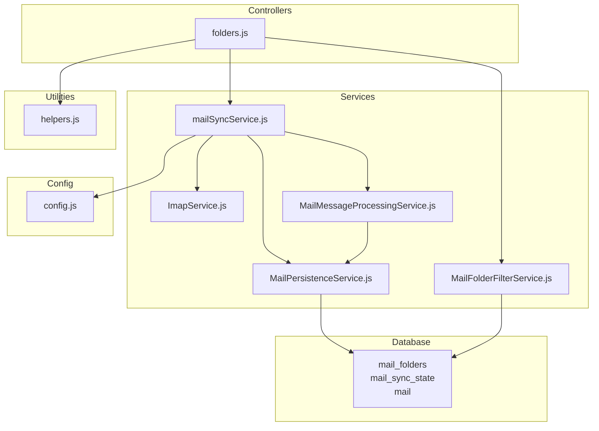

**Diagram sources**
- [folders.js:1-707](file://backend/modules/mail/controllers/folders.js#L1-L707)
- [MailFolderFilterService.js:1-120](file://backend/modules/mail/services/MailFolderFilterService.js#L1-L119)
- [mailSyncService.js:1-800](file://backend/modules/mail/services/mailSyncService.js#L1-L478)
- [MailPersistenceService.js:1-625](file://backend/modules/mail/services/persistence/MailPersistenceService.js#L1-L624)
- [ImapService.js:1-248](file://backend/modules/mail/services/imap/ImapService.js#L1-L247)
- [MailMessageProcessingService.js:1-336](file://backend/modules/mail/services/MailMessageProcessingService.js#L1-L335)
- [helpers.js:1-569](file://backend/modules/mail/utils/helpers.js#L1-L568)
- [config.js:1-71](file://backend/modules/mail/config.js#L1-L70)

**Section sources**
- [routes.js:35-46](file://backend/modules/mail/routes.js#L35-L46)
- [folders.js:1-707](file://backend/modules/mail/controllers/folders.js#L1-L707)

## Core Components
- Folder controller: Implements listing, creation, update, deletion, duplication cleanup, IMAP folder discovery, synchronization, statistics, clearing, and marking as read.
- Filter service: Applies visibility and sync-enabled filters to IMAP folder lists.
- Sync service: Orchestrates IMAP connections, folder counting, incremental/light sync, and progress reporting.
- Persistence service: Manages folder records, message storage, attachment metadata/files, and sync state.
- IMAP service: Retrieves folder trees, counts messages, and performs fetch operations with timeouts.
- Helpers: Resolves IMAP paths, normalizes accounts, moves/deletes on IMAP, and updates folder counters.
- Configuration: Centralizes timeouts, limits, and modes for sync and attachments.

**Section sources**
- [folders.js:17-707](file://backend/modules/mail/controllers/folders.js#L17-L707)
- [MailFolderFilterService.js:9-120](file://backend/modules/mail/services/MailFolderFilterService.js#L9-L119)
- [mailSyncService.js:33-278](file://backend/modules/mail/services/mailSyncService.js#L33-L278)
- [MailPersistenceService.js:13-625](file://backend/modules/mail/services/persistence/MailPersistenceService.js#L13-L624)
- [ImapService.js:10-248](file://backend/modules/mail/services/imap/ImapService.js#L10-L247)
- [helpers.js:32-569](file://backend/modules/mail/utils/helpers.js#L32-L568)
- [config.js:6-71](file://backend/modules/mail/config.js#L6-L70)

## Architecture Overview
The folder management architecture integrates HTTP routes, controllers, and layered services:
- Routes define endpoints for folders and delegate to controllers.
- Controllers enforce user context and call services for IMAP and persistence operations.
- Services coordinate IMAP interactions, parse and persist messages, and manage folder state.
- Persistence stores folder hierarchies, message counts, and sync metadata.
- Filters control which folders are synchronized based on visibility and sync settings.

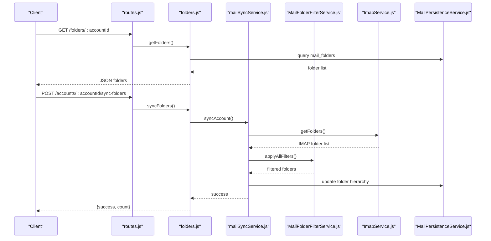

**Diagram sources**
- [routes.js:35-36](file://backend/modules/mail/routes.js#L35-L36)
- [folders.js:17-260](file://backend/modules/mail/controllers/folders.js#L17-L260)
- [mailSyncService.js:77-129](file://backend/modules/mail/services/mailSyncService.js#L77-L129)
- [MailFolderFilterService.js:98-116](file://backend/modules/mail/services/MailFolderFilterService.js#L98-L116)
- [ImapService.js:19-83](file://backend/modules/mail/services/imap/ImapService.js#L19-L83)
- [MailPersistenceService.js:93-204](file://backend/modules/mail/services/persistence/MailPersistenceService.js#L93-L204)

## Detailed Component Analysis

### Folder Listing and Filtering
- Listing: Controller queries folders for an account and user, ordered by display order.
- Visibility and sync filters: Filter service builds a settings map from DB and applies name-based or enabled-filter criteria.

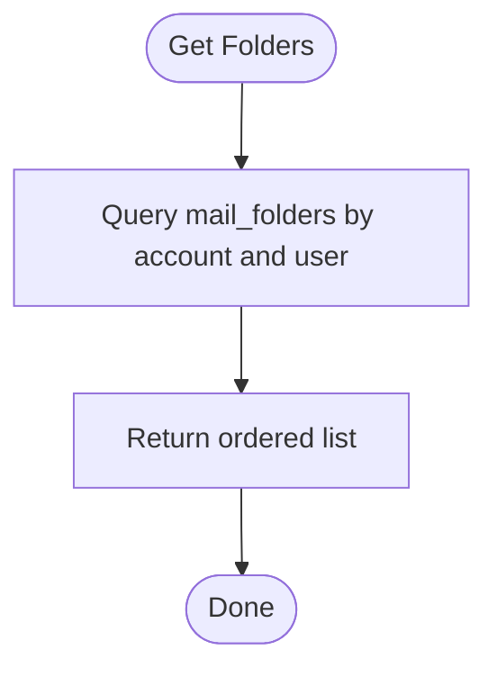

**Diagram sources**
- [folders.js:17-31](file://backend/modules/mail/controllers/folders.js#L17-L31)

**Section sources**
- [folders.js:17-31](file://backend/modules/mail/controllers/folders.js#L17-L31)
- [MailFolderFilterService.js:13-35](file://backend/modules/mail/services/MailFolderFilterService.js#L13-L35)

### IMAP Folder Discovery and Synchronization
- Discover IMAP folders: Controller requests IMAP boxes and flattens hierarchical trees.
- Synchronize with CRM: Controller creates/updates folders and sets parent-child relationships based on IMAP delimiters.

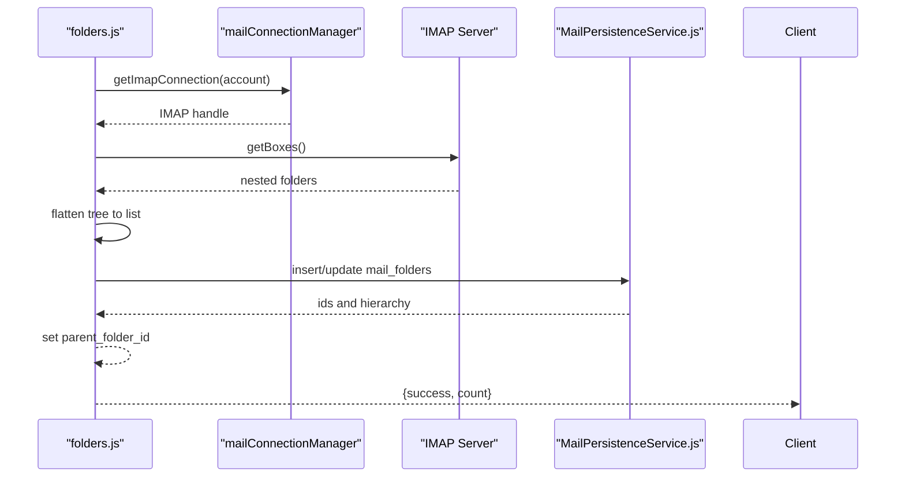

**Diagram sources**
- [folders.js:98-183](file://backend/modules/mail/controllers/folders.js#L98-L183)
- [folders.js:187-260](file://backend/modules/mail/controllers/folders.js#L187-L260)
- [ImapService.js:19-83](file://backend/modules/mail/services/imap/ImapService.js#L19-L83)
- [MailPersistenceService.js:93-204](file://backend/modules/mail/services/persistence/MailPersistenceService.js#L93-L204)

**Section sources**
- [folders.js:98-183](file://backend/modules/mail/controllers/folders.js#L98-L183)
- [folders.js:187-260](file://backend/modules/mail/controllers/folders.js#L187-L260)
- [ImapService.js:19-83](file://backend/modules/mail/services/imap/ImapService.js#L19-L83)

### Folder Creation, Update, and Deletion
- Create: Controller inserts a new folder with optional parent and IMAP path.
- Update: Validates system folder restrictions, prevents cycles, supports renaming/moving with IMAP rename and recursive path updates.
- Delete: Removes only custom-type folders.

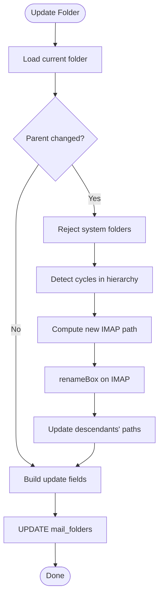

**Diagram sources**
- [folders.js:290-410](file://backend/modules/mail/controllers/folders.js#L290-L410)
- [helpers.js:517-542](file://backend/modules/mail/utils/helpers.js#L517-L542)

**Section sources**
- [folders.js:264-430](file://backend/modules/mail/controllers/folders.js#L264-L430)
- [helpers.js:517-542](file://backend/modules/mail/utils/helpers.js#L517-L542)

### Duplicate Cleanup and Statistics
- Duplicate cleanup: Groups folders by canonical type/name, keeps preferred, moves messages, updates filters, deletes duplicates.
- Stats: Aggregates per-folder mail counts.

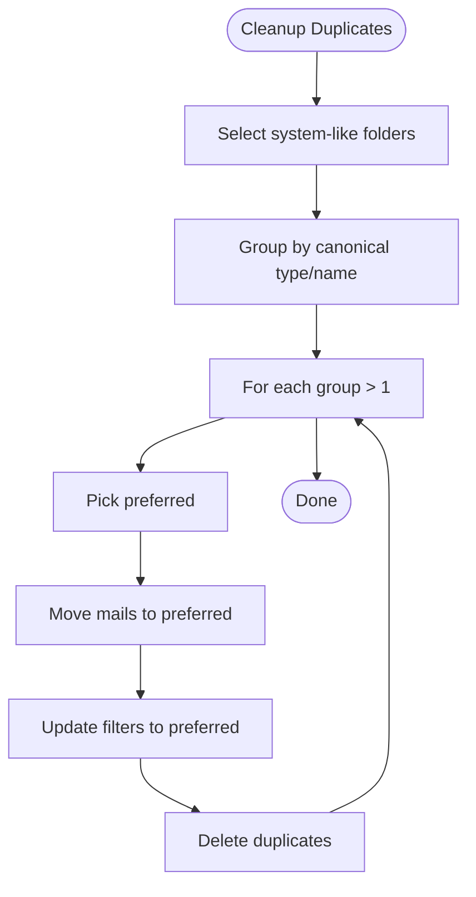

**Diagram sources**
- [folders.js:35-94](file://backend/modules/mail/controllers/folders.js#L35-L94)

**Section sources**
- [folders.js:35-94](file://backend/modules/mail/controllers/folders.js#L35-L94)
- [folders.js:434-465](file://backend/modules/mail/controllers/folders.js#L434-L465)

### Clearing, Local Clear, and Mark-as-Read
- Clear folder: Marks all messages as deleted and expunges on IMAP; clears local DB and resets counters.
- Clear local: Deletes messages locally and resets counters.
- Mark all read: Adds \Seen flags on IMAP and updates local read flags and counters.

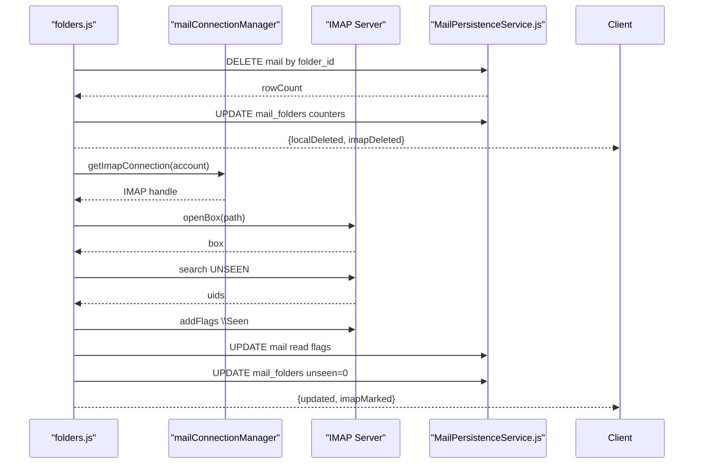

**Diagram sources**
- [folders.js:469-567](file://backend/modules/mail/controllers/folders.js#L469-L567)
- [folders.js:612-692](file://backend/modules/mail/controllers/folders.js#L612-L692)
- [MailPersistenceService.js:463-540](file://backend/modules/mail/services/persistence/MailPersistenceService.js#L463-L540)

**Section sources**
- [folders.js:469-567](file://backend/modules/mail/controllers/folders.js#L469-L567)
- [folders.js:612-692](file://backend/modules/mail/controllers/folders.js#L612-L692)
- [MailPersistenceService.js:463-540](file://backend/modules/mail/services/persistence/MailPersistenceService.js#L463-L540)

### Mail Folder Filter Service
- Builds a settings map of visible/sync-enabled flags per IMAP path.
- Filters by exact name or by a provided list of names.
- Excludes folders where sync is disabled.

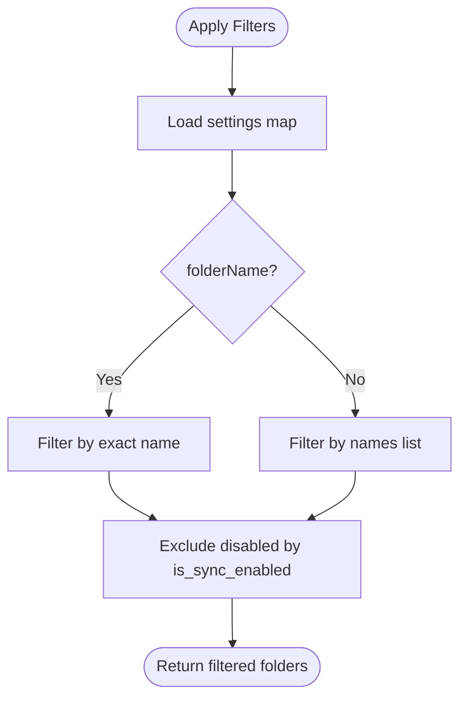

**Diagram sources**
- [MailFolderFilterService.js:98-116](file://backend/modules/mail/services/MailFolderFilterService.js#L98-L116)

**Section sources**
- [MailFolderFilterService.js:9-120](file://backend/modules/mail/services/MailFolderFilterService.js#L9-L119)

### Sync Orchestration and Incremental Behavior
- Connects to IMAP, retrieves folders, applies filters, counts emails, and synchronizes incrementally by UID ranges.
- Uses dynamic timeouts proportional to message counts.
- Emits WebSocket progress updates.

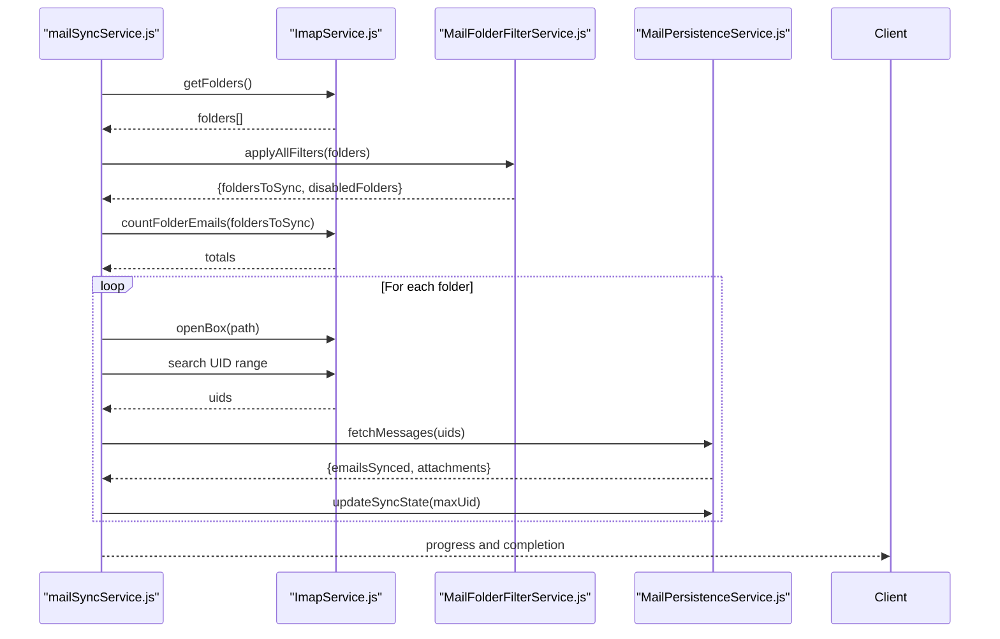

**Diagram sources**
- [mailSyncService.js:77-278](file://backend/modules/mail/services/mailSyncService.js#L77-L278)
- [ImapService.js:88-179](file://backend/modules/mail/services/imap/ImapService.js#L88-L179)
- [MailFolderFilterService.js:98-116](file://backend/modules/mail/services/MailFolderFilterService.js#L98-L116)
- [MailPersistenceService.js:451-460](file://backend/modules/mail/services/persistence/MailPersistenceService.js#L451-L460)

**Section sources**
- [mailSyncService.js:77-278](file://backend/modules/mail/services/mailSyncService.js#L77-L278)
- [ImapService.js:88-179](file://backend/modules/mail/services/imap/ImapService.js#L88-L179)
- [MailFolderFilterService.js:98-116](file://backend/modules/mail/services/MailFolderFilterService.js#L98-L116)

### Message Processing and Attachment Handling
- Processes each message: determines folder, deduplicates by Message-ID/UID, extracts content, saves metadata or files, applies filters.
- Attachment modes: light (metadata only) vs heavy (download files).

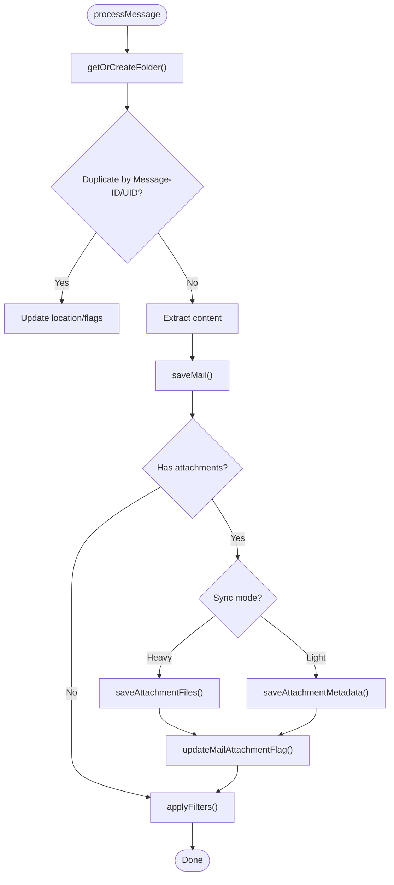

**Diagram sources**
- [MailMessageProcessingService.js:113-224](file://backend/modules/mail/services/MailMessageProcessingService.js#L113-L224)
- [MailPersistenceService.js:209-256](file://backend/modules/mail/services/persistence/MailPersistenceService.js#L209-L256)
- [MailPersistenceService.js:387-444](file://backend/modules/mail/services/persistence/MailPersistenceService.js#L387-L444)

**Section sources**
- [MailMessageProcessingService.js:113-224](file://backend/modules/mail/services/MailMessageProcessingService.js#L113-L224)
- [MailPersistenceService.js:209-256](file://backend/modules/mail/services/persistence/MailPersistenceService.js#L209-L256)
- [MailPersistenceService.js:387-444](file://backend/modules/mail/services/persistence/MailPersistenceService.js#L387-L444)

### Database Schema and Hierarchies
- mail_folders: Stores folder records with hierarchical parent reference, visibility, sync flags, and counters.
- mail_sync_state: Tracks per-folder UID validity and last synced UID.
- mail: Links messages to folders and accounts.

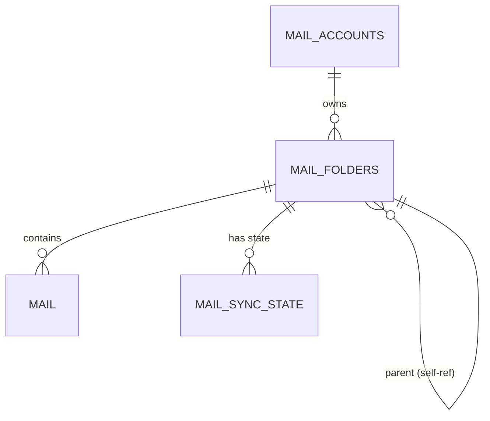

**Diagram sources**
- [76_mail_comprehensive_schema.sql:39-78](file://backend/migrations/76_mail_comprehensive_schema.sql#L39-L78)

**Section sources**
- [76_mail_comprehensive_schema.sql:39-78](file://backend/migrations/76_mail_comprehensive_schema.sql#L39-L78)

## Dependency Analysis
- Controllers depend on persistence and helpers for IMAP operations and path resolution.
- Sync service composes IMAP, filter, parser, and persistence services.
- Filter service depends on DB for settings; IMAP service depends on configuration for timeouts.
- Message processing service depends on parser and persistence services.

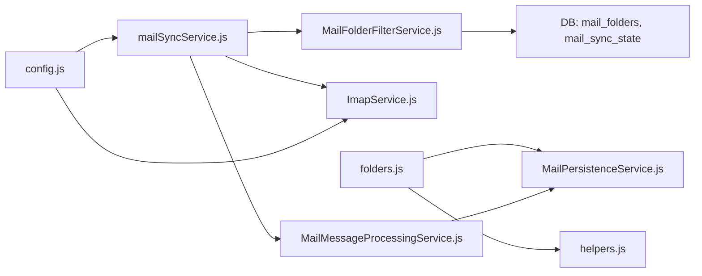

**Diagram sources**
- [folders.js:1-707](file://backend/modules/mail/controllers/folders.js#L1-L707)
- [mailSyncService.js:1-800](file://backend/modules/mail/services/mailSyncService.js#L1-L478)
- [MailFolderFilterService.js:1-120](file://backend/modules/mail/services/MailFolderFilterService.js#L1-L119)
- [ImapService.js:1-248](file://backend/modules/mail/services/imap/ImapService.js#L1-L247)
- [MailMessageProcessingService.js:1-336](file://backend/modules/mail/services/MailMessageProcessingService.js#L1-L335)
- [MailPersistenceService.js:1-625](file://backend/modules/mail/services/persistence/MailPersistenceService.js#L1-L624)
- [config.js:1-71](file://backend/modules/mail/config.js#L1-L70)

**Section sources**
- [routes.js:35-46](file://backend/modules/mail/routes.js#L35-L46)
- [folders.js:1-707](file://backend/modules/mail/controllers/folders.js#L1-L707)
- [mailSyncService.js:1-800](file://backend/modules/mail/services/mailSyncService.js#L1-L478)

## Performance Considerations
- Dynamic timeouts: Base plus per-thousand-email coefficients scale with workload.
- Incremental sync: Uses UID ranges to avoid reprocessing unchanged messages.
- Light vs heavy sync: Choose light to minimize bandwidth and disk usage; heavy for full attachment indexing.
- Batched operations: Fetches and updates are batched to reduce round trips.
- Indexes: Schema includes indexes on account_id for efficient lookups.

Practical tips:
- Tune MAIL_SYNC_MAX_MESSAGES to balance throughput and memory.
- Increase timeouts for slow IMAP servers using environment variables.
- Prefer light mode for initial sync; switch to heavy mode on demand for attachment previews.

**Section sources**
- [config.js:16-32](file://backend/modules/mail/config.js#L16-L32)
- [mailSyncService.js:154-157](file://backend/modules/mail/services/mailSyncService.js#L154-L157)
- [ImapService.js:219-230](file://backend/modules/mail/services/imap/ImapService.js#L219-L230)
- [MailPersistenceService.js:451-460](file://backend/modules/mail/services/persistence/MailPersistenceService.js#L451-L460)

## Troubleshooting Guide
Common issues and resolutions:
- IMAP timeouts: Adjust MAIL_IMAP_FOLDERS_TIMEOUT and related env vars; fallback to local folders is attempted.
- Circular dependency during move: Validation prevents moving a folder into itself or its descendants.
- System folder restrictions: Renames/moves are rejected for canonical system folders.
- Duplicate cleanup: Preferred folder retains messages; duplicates are merged and removed.
- Attachment size limits: Large attachments are skipped according to MAX_SIZE configuration.
- Sync progress: Use WebSocket notifications to monitor progress and detect stalled folders.

Operational checks:
- Verify IMAP credentials and host/port TLS settings.
- Confirm folder visibility and sync flags in DB.
- Inspect mail_sync_logs and last_sync_status for recent errors.

**Section sources**
- [folders.js:119-182](file://backend/modules/mail/controllers/folders.js#L119-L182)
- [folders.js:318-373](file://backend/modules/mail/controllers/folders.js#L318-L373)
- [folders.js:313-316](file://backend/modules/mail/controllers/folders.js#L313-L316)
- [config.js:35-46](file://backend/modules/mail/config.js#L35-L46)
- [MailPersistenceService.js:545-596](file://backend/modules/mail/services/persistence/MailPersistenceService.js#L545-L596)

## Conclusion
The folder management system provides robust capabilities for listing, organizing, and synchronizing mail folders across IMAP servers with strong local caching and filtering. It supports hierarchical organization, visibility and sync controls, and rule-based automation. With configurable timeouts, incremental sync, and flexible attachment modes, it balances performance and functionality across diverse environments.