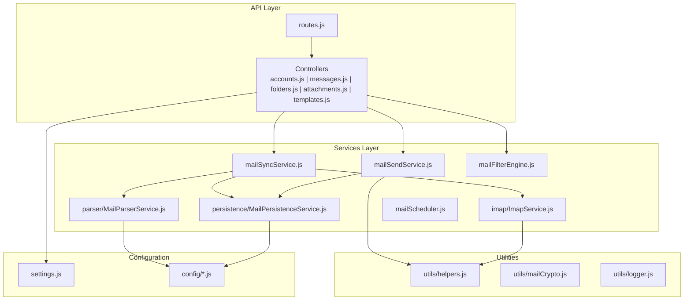
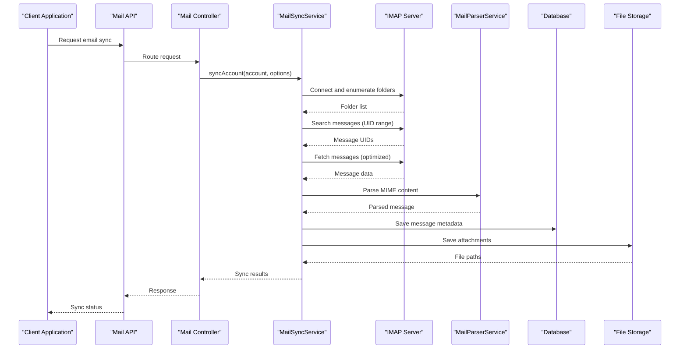
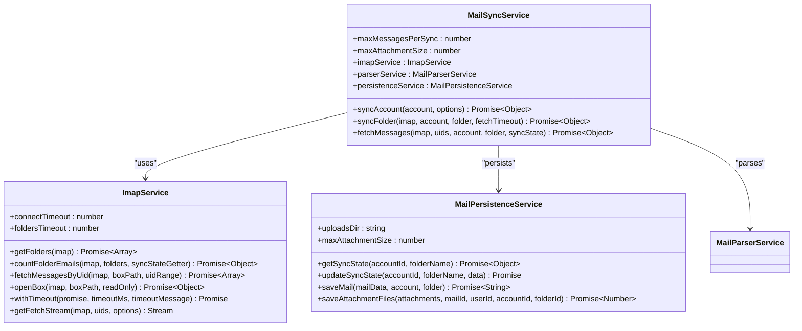
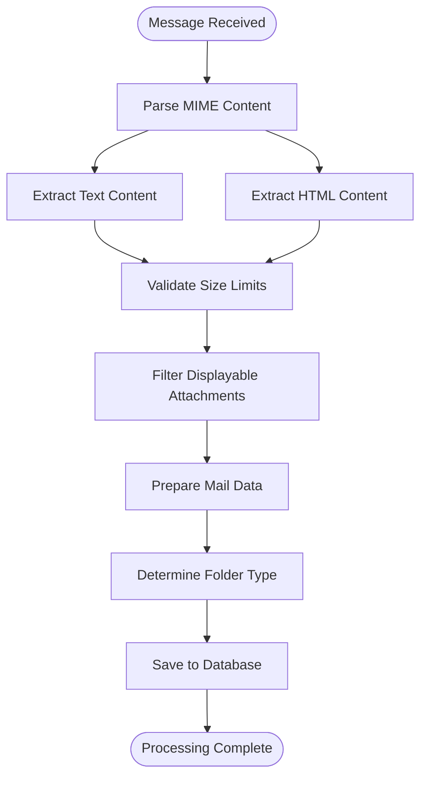
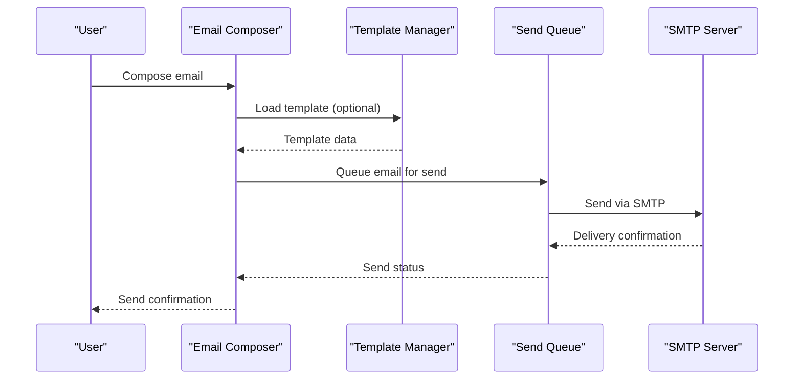
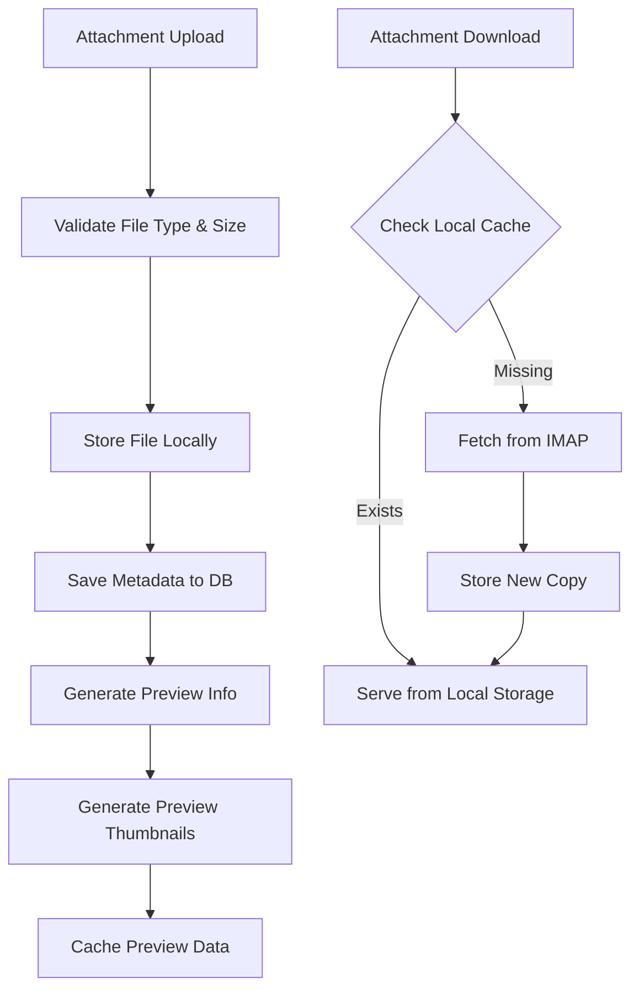
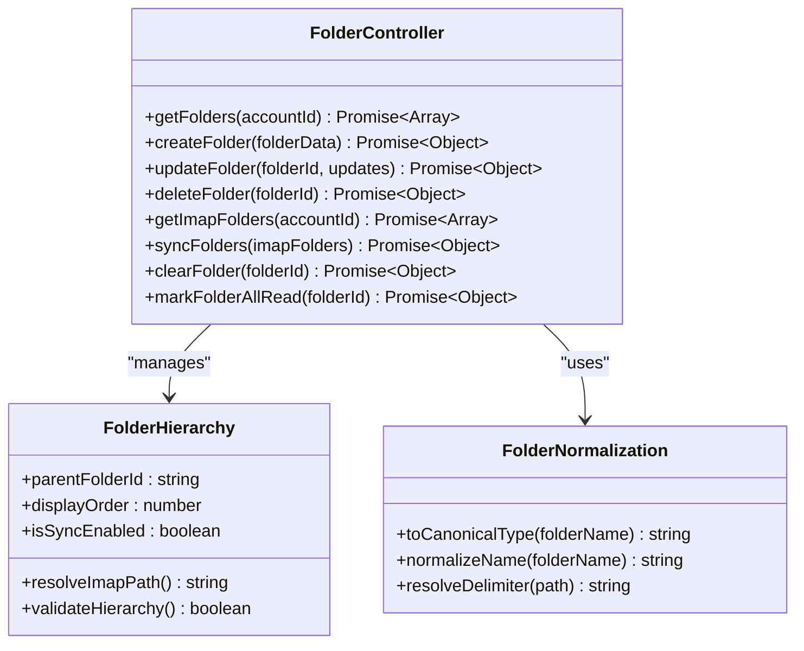
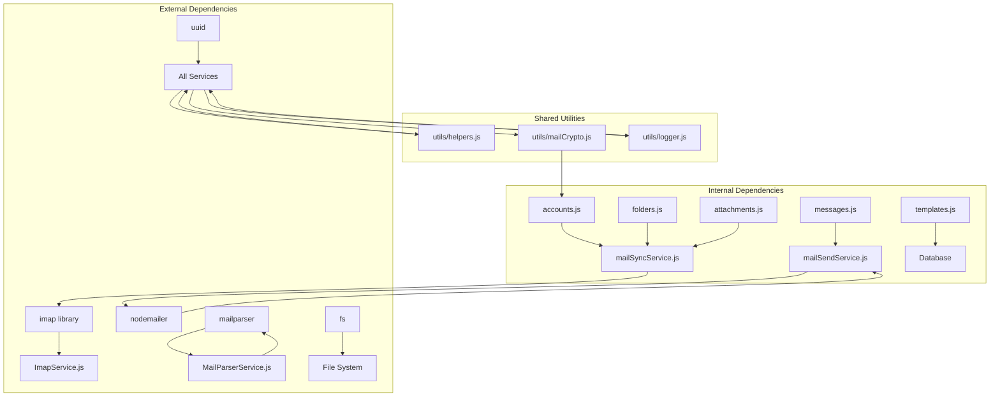

# Mail Module

> 📄 **Синхронизировано** с [docs/modules/mail.md](../../../docs/modules/mail.md) — актуальная компактная спецификация модуля (рус.). Ниже — подробный англоязычный разбор с исходниками и диаграммами.

<cite>
**Referenced Files in This Document**
- [index.js](file://backend/modules/mail/index.js)
- [routes.js](file://backend/modules/mail/routes.js)
- [settings.js](file://backend/modules/mail/settings.js)
- [workflow.js](file://backend/modules/mail/workflow.js)
- [mailSyncService.js](file://backend/modules/mail/services/mailSyncService.js)
- [mailSendService.js](file://backend/modules/mail/services/mailSendService.js)
- [ImapService.js](file://backend/modules/mail/services/imap/ImapService.js)
- [MailParserService.js](file://backend/modules/mail/services/parser/MailParserService.js)
- [MailPersistenceService.js](file://backend/modules/mail/services/persistence/MailPersistenceService.js)
- [accounts.js](file://backend/modules/mail/controllers/accounts.js)
- [messages.js](file://backend/modules/mail/controllers/messages.js)
- [folders.js](file://backend/modules/mail/controllers/folders.js)
- [attachments.js](file://backend/modules/mail/controllers/attachments.js)
- [templates.js](file://backend/modules/mail/controllers/templates.js)
</cite>

## Table of Contents
1. [Introduction](#introduction)
2. [Project Structure](#project-structure)
3. [Core Components](#core-components)
4. [Architecture Overview](#architecture-overview)
5. [Detailed Component Analysis](#detailed-component-analysis)
6. [Dependency Analysis](#dependency-analysis)
7. [Performance Considerations](#performance-considerations)
8. [Troubleshooting Guide](#troubleshooting-guide)
9. [Conclusion](#conclusion)

## Introduction
The Mail module provides comprehensive email integration for the Titan CRM platform, enabling users to connect email accounts, synchronize messages via IMAP, parse and organize emails, manage folders and filters, compose and send emails, and handle attachments with download, preview, and storage integration. It supports real-time synchronization, rule-based filtering, and advanced workflows for automated processing of incoming emails.

## Project Structure
The Mail module follows a layered architecture with clear separation of concerns:
- Controllers: HTTP endpoints for accounts, messages, folders, attachments, and templates
- Services: Business logic for IMAP operations, message parsing, persistence, sending, and scheduling
- Utils: Helpers for encryption, file handling, and IMAP operations
- Routes: Express route definitions with user authentication checks
- Settings: Module configuration including UI defaults, feature flags, and storage policies



**Diagram sources**
- [routes.js:1-114](file://backend/modules/mail/routes.js#L1-L113)
- [mailSyncService.js:1-120](file://backend/modules/mail/services/mailSyncService.js#L1-L120)
- [mailSendService.js:1-60](file://backend/modules/mail/services/mailSendService.js#L1-L60)

**Section sources**
- [index.js:1-30](file://backend/modules/mail/index.js#L1-L29)
- [routes.js:1-114](file://backend/modules/mail/routes.js#L1-L113)
- [settings.js:1-37](file://backend/modules/mail/settings.js#L1-L36)

## Core Components
The Mail module consists of several interconnected services that handle different aspects of email management:

### IMAP Synchronization Service
The core synchronization service manages IMAP connections, folder enumeration, incremental synchronization, and message processing. It implements optimized fetching strategies with configurable batch sizes and timeout controls.

### Message Processing Pipeline
A multi-stage pipeline handles message parsing, content extraction, attachment validation, and persistence. It supports both lightweight and heavy synchronization modes for different performance requirements.

### Email Sending Service
Provides SMTP-based email delivery with queuing, retry mechanisms, and automatic appending to Sent folders. Supports CC/BCC recipients and attachment embedding.

### Storage Management
Handles attachment storage with configurable directory structures, size limits, and file naming policies. Integrates with the broader document management system.

**Section sources**
- [mailSyncService.js:1-120](file://backend/modules/mail/services/mailSyncService.js#L1-L120)
- [mailSendService.js:1-60](file://backend/modules/mail/services/mailSendService.js#L1-L60)
- [settings.js:26-36](file://backend/modules/mail/settings.js#L26-L36)

## Architecture Overview
The Mail module implements a robust three-tier architecture with clear separation between presentation, business logic, and data persistence layers.



**Diagram sources**
- [mailSyncService.js:77-278](file://backend/modules/mail/services/mailSyncService.js#L77-L278)
- [ImapService.js:18-83](file://backend/modules/mail/services/imap/ImapService.js#L18-L83)
- [MailParserService.js:84-166](file://backend/modules/mail/services/parser/MailParserService.js#L84-L166)

The architecture emphasizes:
- **Modular Design**: Clear separation between IMAP operations, parsing, persistence, and sending
- **Error Resilience**: Comprehensive error handling with fallback mechanisms
- **Scalability**: Configurable batch sizes and timeout controls
- **Real-time Updates**: WebSocket notifications for sync progress

## Detailed Component Analysis

### IMAP Connection and Synchronization
The IMAP integration provides robust connection management with automatic reconnection, timeout handling, and folder enumeration capabilities.



**Diagram sources**
- [ImapService.js:10-248](file://backend/modules/mail/services/imap/ImapService.js#L10-L247)
- [mailSyncService.js:33-61](file://backend/modules/mail/services/mailSyncService.js#L33-L61)
- [MailPersistenceService.js:13-625](file://backend/modules/mail/services/persistence/MailPersistenceService.js#L13-L624)

Key synchronization features include:
- **Incremental Sync**: Tracks last processed UID to minimize data transfer
- **Batch Processing**: Limits concurrent message processing with configurable batch sizes
- **Timeout Controls**: Configurable timeouts for connection, folder enumeration, and message fetching
- **Error Recovery**: Graceful handling of network interruptions and server timeouts

**Section sources**
- [ImapService.js:18-179](file://backend/modules/mail/services/imap/ImapService.js#L18-L179)
- [mailSyncService.js:294-446](file://backend/modules/mail/services/mailSyncService.js#L294-L446)

### Message Parsing and Content Extraction
The message parsing service handles MIME content processing, text/html extraction, and attachment filtering with strict size validation.



**Diagram sources**
- [MailParserService.js:84-166](file://backend/modules/mail/services/parser/MailParserService.js#L84-L166)
- [MailParserService.js:220-240](file://backend/modules/mail/services/parser/MailParserService.js#L220-L240)

The parsing pipeline ensures:
- **Content Normalization**: Safe truncation and encoding of extracted content
- **HTML Processing**: Clean extraction of text from HTML with script/style removal
- **Attachment Validation**: Size limits enforcement and displayable attachment filtering
- **Flag Processing**: Proper handling of read/unread and starred flags

**Section sources**
- [MailParserService.js:15-244](file://backend/modules/mail/services/parser/MailParserService.js#L15-L243)

### Email Composition and Template System
The composition system provides rich text editing capabilities with template support and flexible sending workflows.



**Diagram sources**
- [messages.js:247-307](file://backend/modules/mail/controllers/messages.js#L109)
- [templates.js:1-74](file://backend/modules/mail/controllers/templates.js#L1-L73)
- [mailSendService.js:37-84](file://backend/modules/mail/services/mailSendService.js#L37-L84)

Template features include:
- **Rich Content Support**: HTML and plain text templates
- **Dynamic Variables**: Template substitution with user data
- **Organization**: Personal template library with categorization
- **Integration**: Seamless template usage in composition workflow

**Section sources**
- [messages.js:247-307](file://backend/modules/mail/controllers/messages.js#L109)
- [templates.js:1-74](file://backend/modules/mail/controllers/templates.js#L1-L73)

### Attachment Management and Storage Integration
The attachment system provides comprehensive file handling with download, preview, and storage integration capabilities.



**Diagram sources**
- [attachments.js:15-61](file://backend/modules/mail/controllers/attachments.js#L15-L61)
- [attachments.js:108-178](file://backend/modules/mail/controllers/attachments.js#L108-L178)
- [MailPersistenceService.js:387-444](file://backend/modules/mail/services/persistence/MailPersistenceService.js#L387-L444)

Storage integration features:
- **Structured Storage**: Hierarchical directory organization by account, folder, and message
- **Size Limits**: Configurable maximum attachment sizes with validation
- **Preview Support**: Automatic generation of preview thumbnails for supported formats
- **Cleanup Automation**: Automatic removal of orphaned files during maintenance

**Section sources**
- [attachments.js:108-178](file://backend/modules/mail/controllers/attachments.js#L108-L178)
- [MailPersistenceService.js:387-444](file://backend/modules/mail/services/persistence/MailPersistenceService.js#L387-L444)

### Folder Management and Organization
The folder management system provides comprehensive organization capabilities with IMAP synchronization and hierarchical structure support.



**Diagram sources**
- [folders.js:17-707](file://backend/modules/mail/controllers/folders.js#L17-L707)
- [mailSyncService.js:637-640](file://backend/modules/mail/services/mailSyncService.js#L478)

Advanced folder features include:
- **Hierarchical Organization**: Parent-child relationships with automatic path resolution
- **System Folder Detection**: Automatic recognition of standard folders (Inbox, Sent, Drafts, etc.)
- **IMAP Synchronization**: Bidirectional sync with server-side folder structures
- **Duplicate Cleanup**: Automated detection and merging of duplicate folder entries

**Section sources**
- [folders.js:98-183](file://backend/modules/mail/controllers/folders.js#L98-L183)
- [folders.js:187-260](file://backend/modules/mail/controllers/folders.js#L187-L260)

### Email Filtering and Rule-Based Organization
The filtering system enables sophisticated rule-based organization with automatic message routing and categorization.

```mermaid
flowchart TD
Incoming[Incoming Email] --> ApplyRules[Apply Filter Rules]
ApplyRules --> MatchCriteria{Match Criteria?}
MatchCriteria --> |Yes| RouteTo[Route to Target Folder]
MatchCriteria --> |No| LeaveInbox[Leave in Current Folder]
RouteTo --> UpdateFlags[Update Flags & Status]
LeaveInbox --> UpdateFlags
UpdateFlags --> LogActivity[Log Filter Activity]
LogActivity --> NotifyUser[Notify User (Optional)]
```

**Diagram sources**
- [workflow.js:49-151](file://backend/modules/mail/workflow.js#L49-L151)
- [workflow.js:190-268](file://backend/modules/mail/workflow.js#L190-L268)

Filtering capabilities include:
- **Multi-Criteria Matching**: Subject, sender, content, and date-based filters
- **Rule Execution**: Automated processing of incoming messages
- **Workflow Integration**: Extensible action system for custom processing
- **Performance Monitoring**: Real-time progress tracking and logging

**Section sources**
- [workflow.js:49-151](file://backend/modules/mail/workflow.js#L49-L151)
- [workflow.js:190-268](file://backend/modules/mail/workflow.js#L190-L268)

## Dependency Analysis
The Mail module exhibits strong internal cohesion with well-defined external dependencies and minimal circular dependencies.



**Diagram sources**
- [accounts.js:1-491](file://backend/modules/mail/controllers/accounts.js#L1-L488)
- [messages.js:1-860](file://backend/modules/mail/controllers/messages.js#L1-L109)
- [folders.js:1-707](file://backend/modules/mail/controllers/folders.js#L1-L707)
- [attachments.js:1-216](file://backend/modules/mail/controllers/attachments.js#L1-L215)
- [templates.js:1-74](file://backend/modules/mail/controllers/templates.js#L1-L73)

Key dependency characteristics:
- **External Libraries**: Minimal third-party dependencies with focused usage
- **Internal Coupling**: Loose coupling between controllers and services
- **Configuration Management**: Centralized settings with environment-specific overrides
- **Error Propagation**: Consistent error handling and propagation patterns

**Section sources**
- [mailSyncService.js:13-31](file://backend/modules/mail/services/mailSyncService.js#L13-L31)
- [mailSendService.js:10-20](file://backend/modules/mail/services/mailSendService.js#L10-L20)

## Performance Considerations
The Mail module implements several performance optimization strategies:

### Connection Management
- **Connection Pooling**: Shared IMAP connections with automatic reconnection
- **Timeout Controls**: Configurable timeouts for different operation types
- **Batch Processing**: Optimized message fetching with configurable batch sizes

### Memory Management
- **Streaming Operations**: Large file downloads use streaming to minimize memory usage
- **Lazy Loading**: Attachments loaded on-demand rather than pre-fetching
- **Garbage Collection**: Explicit resource cleanup for file handles and database connections

### Database Optimization
- **Index Usage**: Strategic indexing on frequently queried columns
- **Batch Operations**: Bulk inserts and updates for improved throughput
- **Connection Pooling**: Database connection pooling for concurrent operations

### Caching Strategies
- **In-Memory Caching**: Frequently accessed configuration and metadata cached
- **File System Cache**: Local caching of recently accessed attachments
- **Database Query Cache**: Repeated queries cached with appropriate invalidation

## Troubleshooting Guide

### Common IMAP Issues
**Problem**: Connection timeouts or authentication failures
**Solution**: 
- Verify IMAP host/port settings and TLS configuration
- Check firewall settings and network connectivity
- Validate account credentials and app-specific passwords
- Review timeout configurations in settings

**Problem**: Folder enumeration failures
**Solution**:
- Check IMAP server compatibility and supported features
- Verify folder permissions and accessibility
- Review timeout settings for folder operations

### Synchronization Problems
**Problem**: Missing messages or incomplete sync
**Solution**:
- Check UID validity and sync state tracking
- Verify batch size configurations for large mailboxes
- Review timeout settings for long-running operations
- Monitor sync logs for specific error patterns

### Attachment Handling Issues
**Problem**: Large attachment download failures
**Solution**:
- Verify attachment size limits in configuration
- Check available disk space and file system permissions
- Review timeout settings for large file transfers
- Consider switching to heavy sync mode for problematic attachments

**Problem**: Corrupted or incomplete attachments
**Solution**:
- Verify file integrity using checksum validation
- Check for interrupted transfers and retry mechanisms
- Review storage path permissions and disk health
- Validate MIME content parsing for corrupted files

### Email Sending Failures
**Problem**: SMTP authentication or delivery failures
**Solution**:
- Verify SMTP credentials and authentication method
- Check SMTP server configuration and port accessibility
- Review TLS/SSL certificate issues and configuration
- Monitor send queue for retry patterns and failure reasons

**Section sources**
- [accounts.js:244-391](file://backend/modules/mail/controllers/accounts.js#L244-L391)
- [mailSyncService.js:96-112](file://backend/modules/mail/services/mailSyncService.js#L96-L112)
- [mailSendService.js:302-346](file://backend/modules/mail/services/mailSendService.js#L302-L346)

## Conclusion
The Mail module provides a comprehensive and robust email integration solution with strong architectural foundations, extensive feature coverage, and production-ready reliability. Its modular design enables easy maintenance and extension, while performance optimizations ensure efficient handling of large volumes of email data. The combination of IMAP synchronization, intelligent message parsing, flexible attachment management, and powerful filtering capabilities makes it suitable for enterprise email management scenarios.

The module's emphasis on error resilience, scalability, and user experience demonstrates careful consideration of real-world deployment requirements, making it a solid foundation for email-enabled applications within the Titan CRM ecosystem.