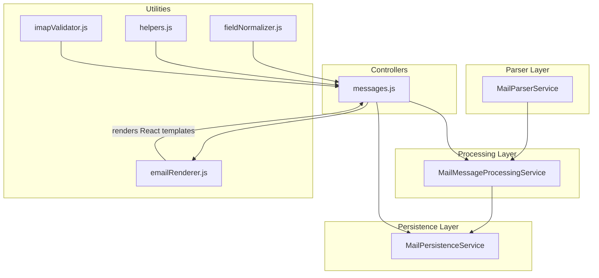
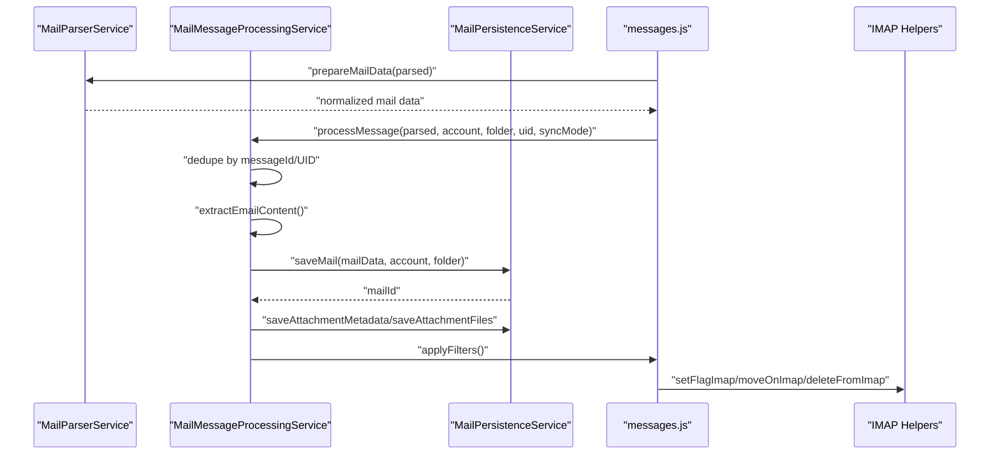
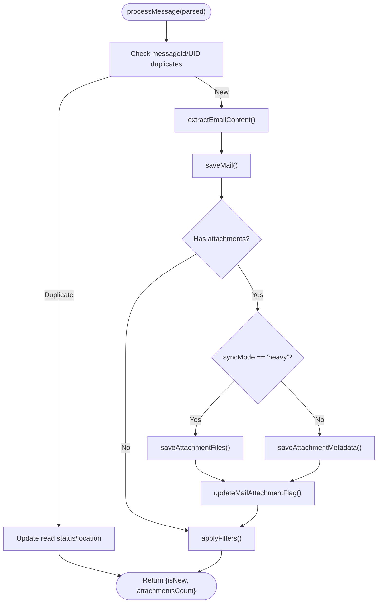
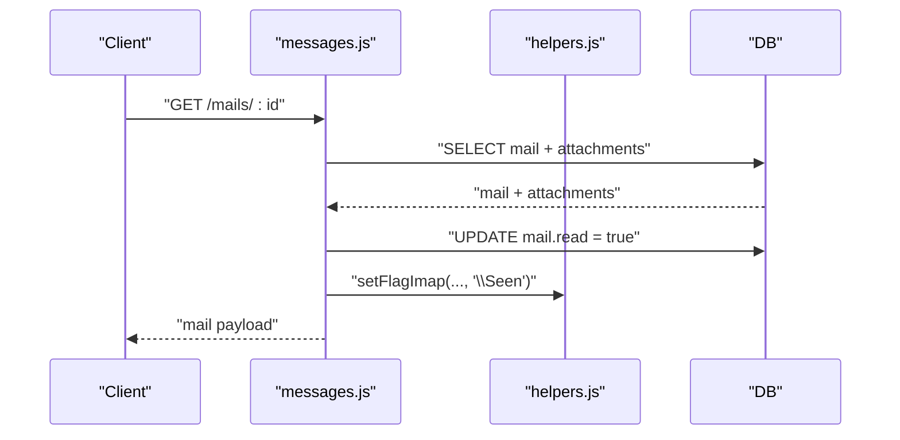
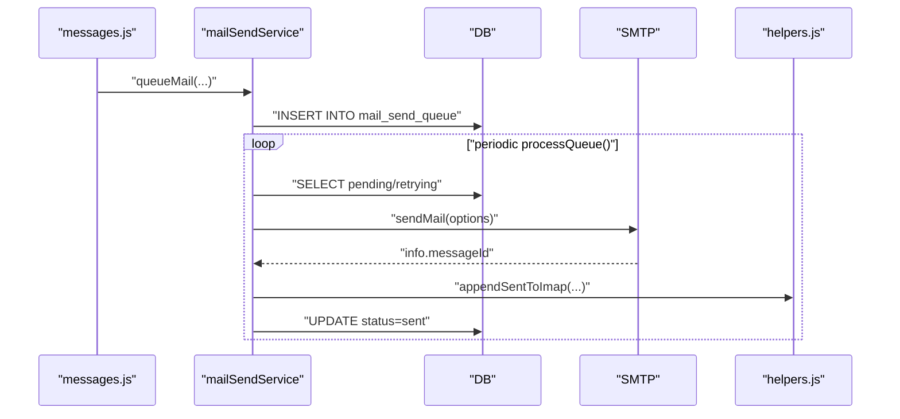
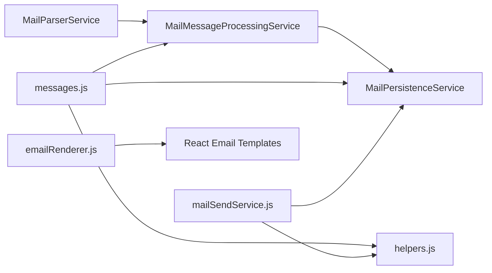

# Message Processing

<cite>
**Referenced Files in This Document**
- [MailParserService.js](file://backend/modules/mail/services/parser/MailParserService.js)
- [MailMessageProcessingService.js](file://backend/modules/mail/services/MailMessageProcessingService.js)
- [MailPersistenceService.js](file://backend/modules/mail/services/persistence/MailPersistenceService.js)
- [messages.js](file://backend/modules/mail/controllers/messages.js)
- [mailSendService.js](file://backend/modules/mail/services/mailSendService.js)
- [emailRenderer.js](file://backend/modules/mail/utils/emailRenderer.js)
- [fieldNormalizer.js](file://backend/modules/mail/utils/fieldNormalizer.js)
- [helpers.js](file://backend/modules/mail/utils/helpers.js)
- [imapValidator.js](file://backend/modules/mail/utils/imapValidator.js)
- [settings.js](file://backend/modules/mail/settings.js)
</cite>

## Table of Contents
1. [Introduction](#introduction)
2. [Project Structure](#project-structure)
3. [Core Components](#core-components)
4. [Architecture Overview](#architecture-overview)
5. [Detailed Component Analysis](#detailed-component-analysis)
6. [Dependency Analysis](#dependency-analysis)
7. [Performance Considerations](#performance-considerations)
8. [Troubleshooting Guide](#troubleshooting-guide)
9. [Conclusion](#conclusion)
10. [Appendices](#appendices)

## Introduction
This document explains the message processing capabilities of the mail module, focusing on:
- Parsing raw email messages into structured content, headers, and metadata
- Processing workflows for content normalization, HTML rendering, and attachment extraction
- Rendering email content for web display with safety and formatting
- Helper utilities for email manipulation, validation, and transformation
- Practical examples and performance optimization techniques for large-scale message handling

## Project Structure
The mail module organizes functionality into services, controllers, and utilities:
- Parser service extracts and normalizes message data
- Processing service orchestrates deduplication, content extraction, and attachment handling
- Persistence service manages database operations and attachment storage
- Controllers expose APIs for listing, viewing, sending, moving, and bulk operations
- Utilities provide rendering, normalization, IMAP helpers, and validators

**Diagram sources**
- [MailParserService.js:1-244](file://backend/modules/mail/services/parser/MailParserService.js#L1-L243)
- [MailMessageProcessingService.js:1-336](file://backend/modules/mail/services/MailMessageProcessingService.js#L1-L335)
- [MailPersistenceService.js:1-625](file://backend/modules/mail/services/persistence/MailPersistenceService.js#L1-L624)
- [messages.js:1-860](file://backend/modules/mail/controllers/messages.js#L1-L109)
- [emailRenderer.js:1-29](file://backend/modules/mail/utils/emailRenderer.js#L1-L28)
- [fieldNormalizer.js:1-181](file://backend/modules/mail/utils/fieldNormalizer.js#L1-L180)
- [helpers.js:1-569](file://backend/modules/mail/utils/helpers.js#L1-L568)
- [imapValidator.js:1-104](file://backend/modules/mail/utils/imapValidator.js#L1-L103)

**Section sources**
- [MailParserService.js:1-244](file://backend/modules/mail/services/parser/MailParserService.js#L1-L243)
- [MailMessageProcessingService.js:1-336](file://backend/modules/mail/services/MailMessageProcessingService.js#L1-L335)
- [MailPersistenceService.js:1-625](file://backend/modules/mail/services/persistence/MailPersistenceService.js#L1-L624)
- [messages.js:1-860](file://backend/modules/mail/controllers/messages.js#L1-L109)
- [emailRenderer.js:1-29](file://backend/modules/mail/utils/emailRenderer.js#L1-L28)
- [fieldNormalizer.js:1-181](file://backend/modules/mail/utils/fieldNormalizer.js#L1-L180)
- [helpers.js:1-569](file://backend/modules/mail/utils/helpers.js#L1-L568)
- [imapValidator.js:1-104](file://backend/modules/mail/utils/imapValidator.js#L1-L103)

## Core Components
- MailParserService: Parses raw messages, sanitizes content, determines folder types, validates attachments, and prepares normalized mail data for persistence.
- MailMessageProcessingService: Deduplicates messages, normalizes dates and strings, extracts text/html content, handles attachments (metadata vs. files), applies filters, and updates read status.
- MailPersistenceService: Manages folder creation/get-or-create, mail insert/update, attachment metadata/file storage, counters, and sync logs.
- messages controller: Exposes endpoints for listing/searching, viewing, sending, marking read/star, moving, deleting, bulk operations, threading, and clearing account data.
- emailRenderer: Renders React email templates to HTML for transactional emails.
- fieldNormalizer: Converts database snake_case fields to camelCase for API responses and vice versa for writes.
- helpers: Provides IMAP path resolution, attachment path building, upload utilities, and IMAP operations (move, delete, flags).
- imapValidator: Validates IMAP configurations and operation parameters.

**Section sources**
- [MailParserService.js:1-244](file://backend/modules/mail/services/parser/MailParserService.js#L1-L243)
- [MailMessageProcessingService.js:1-336](file://backend/modules/mail/services/MailMessageProcessingService.js#L1-L335)
- [MailPersistenceService.js:1-625](file://backend/modules/mail/services/persistence/MailPersistenceService.js#L1-L624)
- [messages.js:1-860](file://backend/modules/mail/controllers/messages.js#L1-L109)
- [emailRenderer.js:1-29](file://backend/modules/mail/utils/emailRenderer.js#L1-L28)
- [fieldNormalizer.js:1-181](file://backend/modules/mail/utils/fieldNormalizer.js#L1-L180)
- [helpers.js:1-569](file://backend/modules/mail/utils/helpers.js#L1-L568)
- [imapValidator.js:1-104](file://backend/modules/mail/utils/imapValidator.js#L1-L103)

## Architecture Overview
End-to-end message processing pipeline:
- Parser extracts and normalizes message data
- Processing service deduplicates, normalizes, and decides heavy/light attachment modes
- Persistence service saves mail records and attachments
- Controllers orchestrate API requests and synchronize flags with IMAP
- Renderer produces HTML for email templates

**Diagram sources**
- [MailParserService.js:134-166](file://backend/modules/mail/services/parser/MailParserService.js#L134-L166)
- [MailMessageProcessingService.js:113-224](file://backend/modules/mail/services/MailMessageProcessingService.js#L113-L224)
- [MailPersistenceService.js:209-256](file://backend/modules/mail/services/persistence/MailPersistenceService.js#L209-L256)
- [messages.js:325-333](file://backend/modules/mail/controllers/messages.js#L109)
- [helpers.js:429-461](file://backend/modules/mail/utils/helpers.js#L429-L461)

## Detailed Component Analysis

### MailParserService
Responsibilities:
- Safe truncation and date normalization
- Attachment filtering and validation against configured size limits
- Content extraction from text/plain or HTML, with HTML-to-text fallback and sanitization
- Determining canonical folder types from names and attributes
- Preparing normalized mail data for persistence

Key behaviors:
- Determines whether content is HTML-capable and sets flags accordingly
- Validates attachment sizes and logs oversized files
- Truncates fields to database limits and normalizes dates

Practical example paths:
- [prepareMailData:134-166](file://backend/modules/mail/services/parser/MailParserService.js#L134-L166)
- [extractMailContent:85-129](file://backend/modules/mail/services/parser/MailParserService.js#L85-L129)
- [validateAttachments:222-240](file://backend/modules/mail/services/parser/MailParserService.js#L222-L240)

**Section sources**
- [MailParserService.js:18-47](file://backend/modules/mail/services/parser/MailParserService.js#L18-L47)
- [MailParserService.js:52-80](file://backend/modules/mail/services/parser/MailParserService.js#L52-L80)
- [MailParserService.js:85-129](file://backend/modules/mail/services/parser/MailParserService.js#L85-L129)
- [MailParserService.js:134-166](file://backend/modules/mail/services/parser/MailParserService.js#L134-L166)
- [MailParserService.js:171-217](file://backend/modules/mail/services/parser/MailParserService.js#L171-L217)
- [MailParserService.js:222-240](file://backend/modules/mail/services/parser/MailParserService.js#L222-L240)

### MailMessageProcessingService
Responsibilities:
- Folder detection and creation with IMAP attributes awareness
- Deduplication via messageId and UID checks
- Content extraction and sanitization
- Attachment handling in light/heavy modes
- Filter application and read-status synchronization

Processing logic highlights:
- Folder type determination from attributes or names
- Displayable attachment filtering excluding inline images with content IDs
- Text-from-HTML extraction with tag stripping and size limits
- Heavy/light attachment modes: file downloads vs. metadata-only
- Filter engine integration for automated actions

Practical example paths:
- [processMessage:113-224](file://backend/modules/mail/services/MailMessageProcessingService.js#L113-L224)
- [extractEmailContent:229-276](file://backend/modules/mail/services/MailMessageProcessingService.js#L229-L276)
- [processAttachments:281-314](file://backend/modules/mail/services/MailMessageProcessingService.js#L281-L314)
- [applyFilters:319-332](file://backend/modules/mail/services/MailMessageProcessingService.js#L319-L332)

**Diagram sources**
- [MailMessageProcessingService.js:113-224](file://backend/modules/mail/services/MailMessageProcessingService.js#L113-L224)
- [MailMessageProcessingService.js:229-276](file://backend/modules/mail/services/MailMessageProcessingService.js#L229-L276)
- [MailMessageProcessingService.js:281-314](file://backend/modules/mail/services/MailMessageProcessingService.js#L281-L314)
- [MailMessageProcessingService.js:319-332](file://backend/modules/mail/services/MailMessageProcessingService.js#L319-L332)

**Section sources**
- [MailMessageProcessingService.js:19-33](file://backend/modules/mail/services/MailMessageProcessingService.js#L19-L33)
- [MailMessageProcessingService.js:38-66](file://backend/modules/mail/services/MailMessageProcessingService.js#L38-L66)
- [MailMessageProcessingService.js:113-224](file://backend/modules/mail/services/MailMessageProcessingService.js#L113-L224)
- [MailMessageProcessingService.js:229-276](file://backend/modules/mail/services/MailMessageProcessingService.js#L229-L276)
- [MailMessageProcessingService.js:281-314](file://backend/modules/mail/services/MailMessageProcessingService.js#L281-L314)
- [MailMessageProcessingService.js:319-332](file://backend/modules/mail/services/MailMessageProcessingService.js#L319-L332)

### MailPersistenceService
Responsibilities:
- Folder creation/get-or-create with IMAP path/type mapping
- Mail insertion with normalized fields and counters update
- Attachment metadata/file persistence
- Batch operations: delete mails, update read status, update folder counters
- Sync state and logs management

Highlights:
- getOrCreateFolder resolves conflicts between IMAP paths and canonical types
- saveAttachmentFiles streams attachment content to disk and records metadata
- updateFolderCounters recalculates totals and unread counts per folder
- updateMailReadStatus updates flags and cascades counter refresh

Practical example paths:
- [getOrCreateFolder:93-204](file://backend/modules/mail/services/persistence/MailPersistenceService.js#L93-L204)
- [saveMail:209-256](file://backend/modules/mail/services/persistence/MailPersistenceService.js#L209-L256)
- [saveAttachmentFiles:387-444](file://backend/modules/mail/services/persistence/MailPersistenceService.js#L387-L444)
- [updateFolderCounters:463-504](file://backend/modules/mail/services/persistence/MailPersistenceService.js#L463-L504)
- [updateMailReadStatus:509-540](file://backend/modules/mail/services/persistence/MailPersistenceService.js#L509-L540)

**Section sources**
- [MailPersistenceService.js:93-204](file://backend/modules/mail/services/persistence/MailPersistenceService.js#L93-L204)
- [MailPersistenceService.js:209-256](file://backend/modules/mail/services/persistence/MailPersistenceService.js#L209-L256)
- [MailPersistenceService.js:387-444](file://backend/modules/mail/services/persistence/MailPersistenceService.js#L387-L444)
- [MailPersistenceService.js:463-504](file://backend/modules/mail/services/persistence/MailPersistenceService.js#L463-L504)
- [MailPersistenceService.js:509-540](file://backend/modules/mail/services/persistence/MailPersistenceService.js#L509-L540)

### messages Controller
Endpoints and workflows:
- List/Search: supports full-text search, filters, pagination, and recursive subfolder inclusion
- View: loads mail with attachments, synchronizes read flag to IMAP, updates counters
- Send: creates draft or queues send; integrates with mailSendService
- Flags: mark read/unread and toggle starred; syncs to IMAP
- Move/Delete: updates local DB and optionally syncs to IMAP
- Bulk operations: batch read/unread, move, delete with IMAP-aware moves
- Thread: retrieves related messages by references/message-id
- Save to Documents: persists attachments as documents
- Clear account: removes all mails for an account

Practical example paths:
- [getAllMails:15-184](file://backend/modules/mail/controllers/messages.js#L15-L109)
- [getMailById:188-243](file://backend/modules/mail/controllers/messages.js#L109)
- [sendMail:247-307](file://backend/modules/mail/controllers/messages.js#L109)
- [markRead:311-349](file://backend/modules/mail/controllers/messages.js#L109)
- [toggleStar:353-387](file://backend/modules/mail/controllers/messages.js#L109)
- [moveMail:390-465](file://backend/modules/mail/controllers/messages.js#L109)
- [bulkRead:518-567](file://backend/modules/mail/controllers/messages.js#L109)
- [bulkMove:571-644](file://backend/modules/mail/controllers/messages.js#L109)
- [bulkDelete:648-699](file://backend/modules/mail/controllers/messages.js#L109)
- [getMailThread:703-761](file://backend/modules/mail/controllers/messages.js#L109)
- [saveToDocuments:764-805](file://backend/modules/mail/controllers/messages.js#L109)
- [clearAccountMails:809-843](file://backend/modules/mail/controllers/messages.js#L109)

**Diagram sources**
- [messages.js:188-243](file://backend/modules/mail/controllers/messages.js#L109)
- [helpers.js:429-461](file://backend/modules/mail/utils/helpers.js#L429-L461)

**Section sources**
- [messages.js:15-184](file://backend/modules/mail/controllers/messages.js#L15-L109)
- [messages.js:188-243](file://backend/modules/mail/controllers/messages.js#L109)
- [messages.js:247-307](file://backend/modules/mail/controllers/messages.js#L109)
- [messages.js:311-349](file://backend/modules/mail/controllers/messages.js#L109)
- [messages.js:353-387](file://backend/modules/mail/controllers/messages.js#L109)
- [messages.js:390-465](file://backend/modules/mail/controllers/messages.js#L109)
- [messages.js:518-567](file://backend/modules/mail/controllers/messages.js#L109)
- [messages.js:571-644](file://backend/modules/mail/controllers/messages.js#L109)
- [messages.js:648-699](file://backend/modules/mail/controllers/messages.js#L109)
- [messages.js:703-761](file://backend/modules/mail/controllers/messages.js#L109)
- [messages.js:764-805](file://backend/modules/mail/controllers/messages.js#L109)
- [messages.js:809-843](file://backend/modules/mail/controllers/messages.js#L109)

### mailSendService
Responsibilities:
- Queue emails with recipients, CC/BCC, subject, HTML/text, and attachments
- Process queue with batching and retry scheduling
- Send via SMTP using decrypted credentials
- Append sent copies to IMAP Sent folder
- Move sent messages to Sent folder locally

Practical example paths:
- [queueMail:37-84](file://backend/modules/mail/services/mailSendService.js#L37-L84)
- [processQueue:89-123](file://backend/modules/mail/services/mailSendService.js#L89-L123)
- [sendQueuedMail:128-238](file://backend/modules/mail/services/mailSendService.js#L128-L238)
- [loadAttachments:243-274](file://backend/modules/mail/services/mailSendService.js#L243-L274)
- [moveToSentFolder:279-297](file://backend/modules/mail/services/mailSendService.js#L279-L297)
- [handleSendError:302-346](file://backend/modules/mail/services/mailSendService.js#L302-L346)

**Diagram sources**
- [mailSendService.js:37-84](file://backend/modules/mail/services/mailSendService.js#L37-L84)
- [mailSendService.js:89-123](file://backend/modules/mail/services/mailSendService.js#L89-L123)
- [mailSendService.js:128-238](file://backend/modules/mail/services/mailSendService.js#L128-L238)
- [mailSendService.js:243-274](file://backend/modules/mail/services/mailSendService.js#L243-L274)
- [mailSendService.js:279-297](file://backend/modules/mail/services/mailSendService.js#L279-L297)
- [mailSendService.js:302-346](file://backend/modules/mail/services/mailSendService.js#L302-L346)

**Section sources**
- [mailSendService.js:37-84](file://backend/modules/mail/services/mailSendService.js#L37-L84)
- [mailSendService.js:89-123](file://backend/modules/mail/services/mailSendService.js#L89-L123)
- [mailSendService.js:128-238](file://backend/modules/mail/services/mailSendService.js#L128-L238)
- [mailSendService.js:243-274](file://backend/modules/mail/services/mailSendService.js#L243-L274)
- [mailSendService.js:279-297](file://backend/modules/mail/services/mailSendService.js#L279-L297)
- [mailSendService.js:302-346](file://backend/modules/mail/services/mailSendService.js#L302-L346)

### emailRenderer
Responsibilities:
- Dynamically register Babel to render JSX email templates
- Render React email components to HTML using @react-email/render

Practical example paths:
- [renderEmail:21-24](file://backend/modules/mail/utils/emailRenderer.js#L21-L24)

**Section sources**
- [emailRenderer.js:1-29](file://backend/modules/mail/utils/emailRenderer.js#L1-L28)

### fieldNormalizer
Responsibilities:
- Normalize database snake_case fields to camelCase for API responses
- Denormalize camelCase to snake_case for DB writes
- Validate and normalize IMAP folder paths and names

Practical example paths:
- [normalizeFromDb:84-99](file://backend/modules/mail/utils/fieldNormalizer.js#L84-L99)
- [denormalizeToDb:104-122](file://backend/modules/mail/utils/fieldNormalizer.js#L104-L122)
- [validateImapPath:138-152](file://backend/modules/mail/utils/fieldNormalizer.js#L138-L152)
- [validateFolderName:157-169](file://backend/modules/mail/utils/fieldNormalizer.js#L157-L169)

**Section sources**
- [fieldNormalizer.js:84-99](file://backend/modules/mail/utils/fieldNormalizer.js#L84-L99)
- [fieldNormalizer.js:104-122](file://backend/modules/mail/utils/fieldNormalizer.js#L104-L122)
- [fieldNormalizer.js:138-152](file://backend/modules/mail/utils/fieldNormalizer.js#L138-L152)
- [fieldNormalizer.js:157-169](file://backend/modules/mail/utils/fieldNormalizer.js#L157-L169)

### helpers
Responsibilities:
- Resolve IMAP mailbox paths for various providers and locales
- Build structured attachment storage paths with UUIDs and optional original names
- IMAP operations: move, delete, set flags, rename boxes
- Apply actual attachment flags by cross-checking siblings with same message-id

Practical example paths:
- [resolveImapBoxPath:32-77](file://backend/modules/mail/utils/helpers.js#L32-L77)
- [buildAttachmentPath:198-254](file://backend/modules/mail/utils/helpers.js#L198-L254)
- [moveOnImap:363-427](file://backend/modules/mail/utils/helpers.js#L363-L427)
- [deleteFromImap:310-361](file://backend/modules/mail/utils/helpers.js#L310-L361)
- [setFlagImap:429-461](file://backend/modules/mail/utils/helpers.js#L429-L461)
- [applyActualAttachmentFlags:145-180](file://backend/modules/mail/utils/helpers.js#L145-L180)

**Section sources**
- [helpers.js:32-77](file://backend/modules/mail/utils/helpers.js#L32-L77)
- [helpers.js:198-254](file://backend/modules/mail/utils/helpers.js#L198-L254)
- [helpers.js:310-361](file://backend/modules/mail/utils/helpers.js#L310-L361)
- [helpers.js:363-427](file://backend/modules/mail/utils/helpers.js#L363-L427)
- [helpers.js:429-461](file://backend/modules/mail/utils/helpers.js#L429-L461)
- [helpers.js:145-180](file://backend/modules/mail/utils/helpers.js#L145-L180)

### imapValidator
Responsibilities:
- Validate IMAP configuration and operation parameters
- Provide safe logging and callbacks for IMAP operations

Practical example paths:
- [validateImapConfig:11-28](file://backend/modules/mail/utils/imapValidator.js#L11-L28)
- [validateOpenBoxParams:33-49](file://backend/modules/mail/utils/imapValidator.js#L33-L49)
- [validateFetchOptions:65-73](file://backend/modules/mail/utils/imapValidator.js#L65-L73)

**Section sources**
- [imapValidator.js:11-28](file://backend/modules/mail/utils/imapValidator.js#L11-L28)
- [imapValidator.js:33-49](file://backend/modules/mail/utils/imapValidator.js#L33-L49)
- [imapValidator.js:65-73](file://backend/modules/mail/utils/imapValidator.js#L65-L73)

## Dependency Analysis
- Parser depends on configuration for attachment size limits and sync mode
- Processing service composes Parser and Persistence services
- Controllers depend on Persistence and IMAP helpers for IMAP synchronization
- mailSendService depends on DB, SMTP, and IMAP helpers
- Renderer depends on @react-email and Babel registration

**Diagram sources**
- [MailParserService.js:1-13](file://backend/modules/mail/services/parser/MailParserService.js#L1-L13)
- [MailMessageProcessingService.js:6-14](file://backend/modules/mail/services/MailMessageProcessingService.js#L6-L14)
- [MailPersistenceService.js:6-17](file://backend/modules/mail/services/persistence/MailPersistenceService.js#L6-L17)
- [messages.js:6-11](file://backend/modules/mail/controllers/messages.js#L6-L11)
- [mailSendService.js:10-20](file://backend/modules/mail/services/mailSendService.js#L10-L20)
- [emailRenderer.js:1-11](file://backend/modules/mail/utils/emailRenderer.js#L1-L11)

**Section sources**
- [MailParserService.js:1-13](file://backend/modules/mail/services/parser/MailParserService.js#L1-L13)
- [MailMessageProcessingService.js:6-14](file://backend/modules/mail/services/MailMessageProcessingService.js#L6-L14)
- [MailPersistenceService.js:6-17](file://backend/modules/mail/services/persistence/MailPersistenceService.js#L6-L17)
- [messages.js:6-11](file://backend/modules/mail/controllers/messages.js#L6-L11)
- [mailSendService.js:10-20](file://backend/modules/mail/services/mailSendService.js#L10-L20)
- [emailRenderer.js:1-11](file://backend/modules/mail/utils/emailRenderer.js#L1-L11)

## Performance Considerations
- Attachment handling modes:
  - Light mode: store only metadata to reduce disk I/O and storage usage
  - Heavy mode: stream attachments to disk; suitable for searchable content but increases IO
- Size limits and truncation:
  - Enforce maximum attachment size and truncate oversized content to prevent DB errors
  - Limit extracted text length to avoid excessive memory usage
- Deduplication:
  - Check by messageId and UID to avoid reprocessing identical messages
- Streaming writes:
  - Use writable streams for attachment files to minimize memory footprint
- Batching:
  - Process queue in batches and schedule retries with exponential/backoff-like delays
- IMAP operations:
  - Prefer asynchronous fire-and-forget updates to avoid blocking API responses
- Indexes and queries:
  - Full-text search leverages PostgreSQL tsvector; ensure appropriate indexing for performance

[No sources needed since this section provides general guidance]

## Troubleshooting Guide
Common issues and resolutions:
- IMAP configuration errors:
  - Validate host/port/user/password and ensure types are correct
  - Use safe callbacks to capture and log IMAP errors
- Attachment failures:
  - Oversized attachments are skipped; adjust settings or compress files
  - Missing file paths cause warnings; verify uploads directory and permissions
- IMAP sync mismatches:
  - Use helpers to resolve mailbox paths and handle provider-specific differences
  - For cross-account moves, IMAP move is not supported; rely on local updates
- Rendering issues:
  - Ensure Babel registration targets the emails directory and uses React preset
- Queue failures:
  - Inspect retry counts and scheduled_at; adjust max retries and delays

**Section sources**
- [imapValidator.js:11-28](file://backend/modules/mail/utils/imapValidator.js#L11-L28)
- [MailParserService.js:222-240](file://backend/modules/mail/services/parser/MailParserService.js#L222-L240)
- [MailPersistenceService.js:387-444](file://backend/modules/mail/services/persistence/MailPersistenceService.js#L387-L444)
- [helpers.js:32-77](file://backend/modules/mail/utils/helpers.js#L32-L77)
- [emailRenderer.js:4-11](file://backend/modules/mail/utils/emailRenderer.js#L4-L11)
- [mailSendService.js:302-346](file://backend/modules/mail/services/mailSendService.js#L302-L346)

## Conclusion
The mail module provides a robust pipeline for parsing, processing, persisting, and rendering email messages. It balances performance with safety by offering configurable attachment modes, strict validation, and IMAP-aware operations. The modular design enables scalable handling of large volumes of messages while maintaining compatibility with diverse email providers.

[No sources needed since this section summarizes without analyzing specific files]

## Appendices

### Practical Examples

- Parsing and preparing mail data:
  - Use [prepareMailData:134-166](file://backend/modules/mail/services/parser/MailParserService.js#L134-L166) to normalize subject, sender, messageId, and content fields.
- Extracting content from HTML:
  - Use [extractMailContent:85-129](file://backend/modules/mail/services/parser/MailParserService.js#L85-L129) to derive text/plain from HTML when missing.
- Processing a single message:
  - Use [processMessage:113-224](file://backend/modules/mail/services/MailMessageProcessingService.js#L113-L224) to deduplicate, extract content, and handle attachments.
- Saving attachments:
  - Choose [saveAttachmentMetadata:353-382](file://backend/modules/mail/services/persistence/MailPersistenceService.js#L353-L382) for light mode or [saveAttachmentFiles:387-444](file://backend/modules/mail/services/persistence/MailPersistenceService.js#L387-L444) for heavy mode.
- Rendering email templates:
  - Use [renderEmail:21-24](file://backend/modules/mail/utils/emailRenderer.js#L21-L24) to produce HTML from React components.
- IMAP operations:
  - Use [moveOnImap:363-427](file://backend/modules/mail/utils/helpers.js#L363-L427), [deleteFromImap:310-361](file://backend/modules/mail/utils/helpers.js#L310-L361), and [setFlagImap:429-461](file://backend/modules/mail/utils/helpers.js#L429-L461) for provider-specific mailbox management.

**Section sources**
- [MailParserService.js:85-166](file://backend/modules/mail/services/parser/MailParserService.js#L85-L166)
- [MailMessageProcessingService.js:113-224](file://backend/modules/mail/services/MailMessageProcessingService.js#L113-L224)
- [MailPersistenceService.js:353-444](file://backend/modules/mail/services/persistence/MailPersistenceService.js#L353-L444)
- [emailRenderer.js:21-24](file://backend/modules/mail/utils/emailRenderer.js#L21-L24)
- [helpers.js:310-461](file://backend/modules/mail/utils/helpers.js#L310-L461)

### Configuration References

- Attachment storage settings:
  - [settings.js:26-36](file://backend/modules/mail/settings.js#L26-L36)
- Sync modes and limits:
  - [MailParserService.js:11-13](file://backend/modules/mail/services/parser/MailParserService.js#L11-L13)
  - [MailMessageProcessingService.js:116](file://backend/modules/mail/services/MailMessageProcessingService.js#L116)

**Section sources**
- [settings.js:26-36](file://backend/modules/mail/settings.js#L26-L36)
- [MailParserService.js:11-13](file://backend/modules/mail/services/parser/MailParserService.js#L11-L13)
- [MailMessageProcessingService.js:116](file://backend/modules/mail/services/MailMessageProcessingService.js#L116)