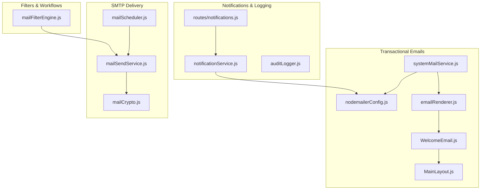
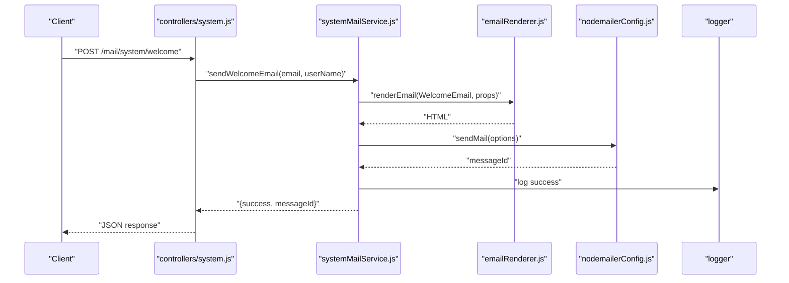
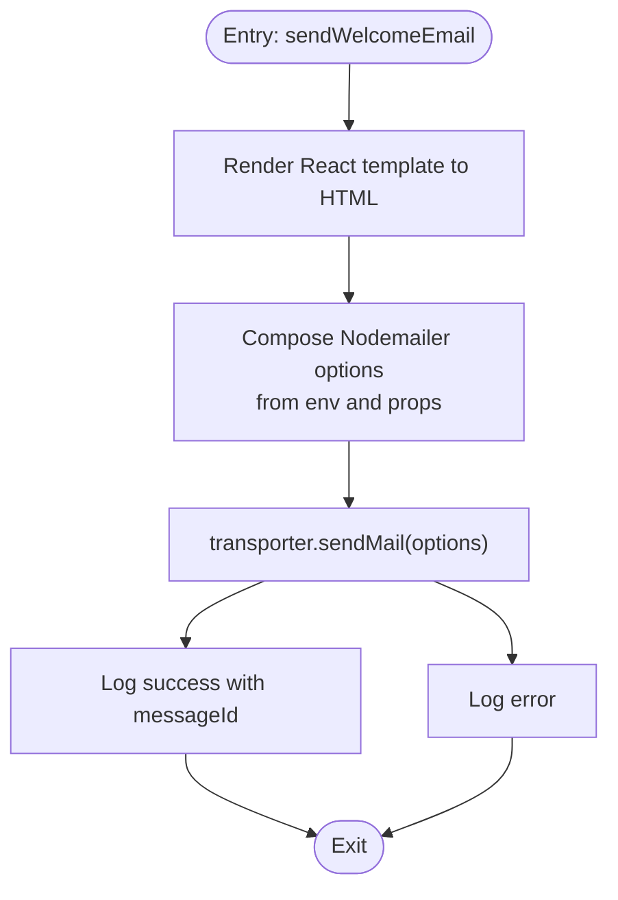
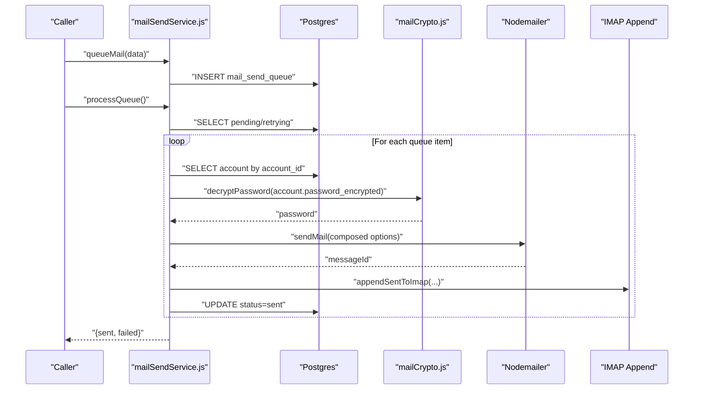
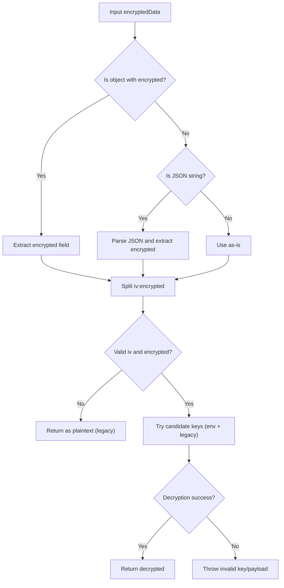
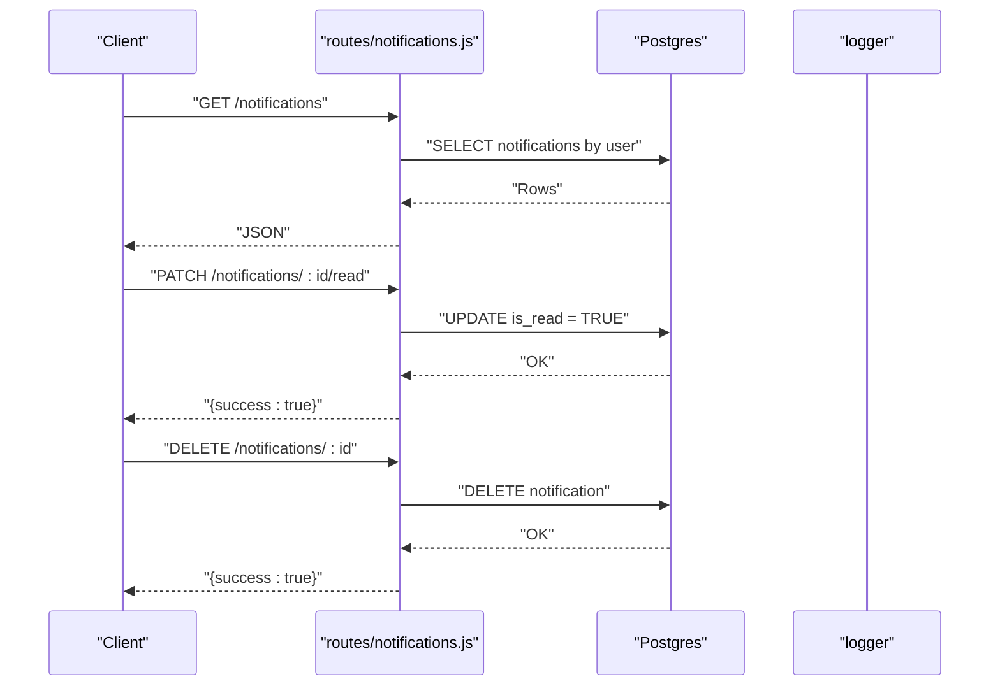
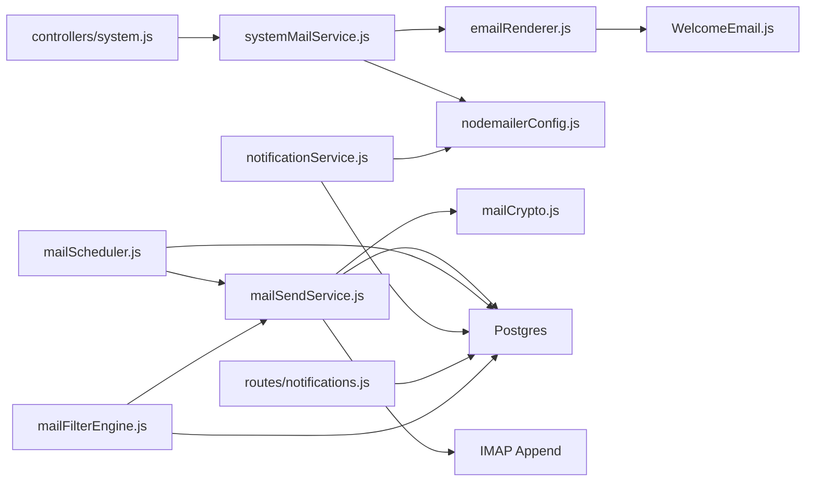

# System Integration

<cite>
**Referenced Files in This Document**
- [systemMailService.js](file://backend/modules/mail/services/systemMailService.js)
- [nodemailerConfig.js](file://backend/modules/mail/utils/nodemailerConfig.js)
- [mailSendService.js](file://backend/modules/mail/services/mailSendService.js)
- [mailScheduler.js](file://backend/modules/mail/services/mailScheduler.js)
- [mailCrypto.js](file://backend/utils/mailCrypto.js)
- [emailRenderer.js](file://backend/modules/mail/utils/emailRenderer.js)
- [WelcomeEmail.js](file://backend/emails/templates/WelcomeEmail.js)
- [MainLayout.js](file://backend/emails/layouts/MainLayout.js)
- [notificationService.js](file://backend/utils/notificationService.js)
- [auditLogger.js](file://backend/utils/auditLogger.js)
- [routes/notifications.js](file://backend/routes/notifications.js)
- [mailFilterEngine.js](file://backend/modules/mail/services/mailFilterEngine.js)
- [controllers/system.js](file://backend/modules/mail/controllers/system.js)
</cite>

## Table of Contents
1. [Introduction](#introduction)
2. [Project Structure](#project-structure)
3. [Core Components](#core-components)
4. [Architecture Overview](#architecture-overview)
5. [Detailed Component Analysis](#detailed-component-analysis)
6. [Dependency Analysis](#dependency-analysis)
7. [Performance Considerations](#performance-considerations)
8. [Troubleshooting Guide](#troubleshooting-guide)
9. [Conclusion](#conclusion)
10. [Appendices](#appendices)

## Introduction
This document explains the system integration capabilities for email and messaging within the backend. It covers:
- Internal messaging and notification systems
- Nodemailer configuration for SMTP transport and email delivery
- Encryption and security utilities for protecting sensitive communications
- Integration with other system components including user notifications, workflow triggers, and audit logging
- Practical examples for configuration, encryption setup, and delivery monitoring
- Security best practices and troubleshooting for delivery failures and authentication issues

## Project Structure
The email and messaging system spans several modules and utilities:
- Transactional email service for system-wide messages (e.g., welcome emails)
- SMTP send service with queuing, retries, and persistence
- Scheduler for periodic sync and send queue processing
- Encryption utilities for securing credentials
- Notification service for flexible channel-based alerts
- Audit logging for tracking actions and events
- Email rendering pipeline for React-based templates

**Diagram sources**
- [systemMailService.js:1-36](file://backend/modules/mail/services/systemMailService.js#L1-L35)
- [nodemailerConfig.js:1-20](file://backend/modules/mail/utils/nodemailerConfig.js#L1-L19)
- [emailRenderer.js:1-29](file://backend/modules/mail/utils/emailRenderer.js#L1-L28)
- [WelcomeEmail.js](file://backend/emails/templates/WelcomeEmail.js)
- [MainLayout.js](file://backend/emails/layouts/MainLayout.js)
- [mailSendService.js:1-388](file://backend/modules/mail/services/mailSendService.js#L1-L387)
- [mailScheduler.js:1-162](file://backend/modules/mail/services/mailScheduler.js#L1-L161)
- [mailCrypto.js:1-126](file://backend/utils/mailCrypto.js#L1-L125)
- [notificationService.js:1-83](file://backend/utils/notificationService.js#L1-L82)
- [auditLogger.js:1-52](file://backend/utils/auditLogger.js#L1-L51)
- [routes/notifications.js:1-81](file://backend/modules/notifications/routes.js#L1-L80)
- [mailFilterEngine.js:1-590](file://backend/modules/mail/services/mailFilterEngine.js#L1-L589)

**Section sources**
- [systemMailService.js:1-36](file://backend/modules/mail/services/systemMailService.js#L1-L35)
- [mailSendService.js:1-388](file://backend/modules/mail/services/mailSendService.js#L1-L387)
- [mailScheduler.js:1-162](file://backend/modules/mail/services/mailScheduler.js#L1-L161)
- [mailCrypto.js:1-126](file://backend/utils/mailCrypto.js#L1-L125)
- [notificationService.js:1-83](file://backend/utils/notificationService.js#L1-L82)
- [auditLogger.js:1-52](file://backend/utils/auditLogger.js#L1-L51)
- [routes/notifications.js:1-81](file://backend/modules/notifications/routes.js#L1-L80)
- [mailFilterEngine.js:1-590](file://backend/modules/mail/services/mailFilterEngine.js#L1-L589)

## Core Components
- System transactional email service: Renders React templates and sends via a global Nodemailer transporter configured from environment variables.
- SMTP send service: Queues outgoing emails, retries on failure, appends sent messages to IMAP Sent, and moves original mail records to the Sent folder.
- Scheduler: Periodically runs synchronization and processes the send queue.
- Encryption utilities: AES-256-CBC encryption/decryption for storing and retrieving SMTP credentials securely.
- Notification service: Channel-agnostic sender supporting email and Telegram using system settings.
- Audit logger: Centralized audit trail for administrative and operational actions.
- Filters engine: Applies rules to incoming/outgoing mail (move, star, label, forward, delete) and integrates with send queue.

**Section sources**
- [systemMailService.js:1-36](file://backend/modules/mail/services/systemMailService.js#L1-L35)
- [nodemailerConfig.js:1-20](file://backend/modules/mail/utils/nodemailerConfig.js#L1-L19)
- [mailSendService.js:1-388](file://backend/modules/mail/services/mailSendService.js#L1-L387)
- [mailScheduler.js:1-162](file://backend/modules/mail/services/mailScheduler.js#L1-L161)
- [mailCrypto.js:1-126](file://backend/utils/mailCrypto.js#L1-L125)
- [notificationService.js:1-83](file://backend/utils/notificationService.js#L1-L82)
- [auditLogger.js:1-52](file://backend/utils/auditLogger.js#L1-L51)
- [mailFilterEngine.js:1-590](file://backend/modules/mail/services/mailFilterEngine.js#L1-L589)

## Architecture Overview
The system separates concerns across layers:
- Controllers orchestrate requests for transactional emails
- Services encapsulate business logic for sending, scheduling, filtering, and encryption
- Utilities provide rendering and cryptographic primitives
- Routes expose notification retrieval and read-state management
- Audit logging persists operational traces

**Diagram sources**
- [controllers/system.js:1-24](file://backend/modules/mail/controllers/system.js#L1-L23)
- [systemMailService.js:1-36](file://backend/modules/mail/services/systemMailService.js#L1-L35)
- [emailRenderer.js:1-29](file://backend/modules/mail/utils/emailRenderer.js#L1-L28)
- [nodemailerConfig.js:1-20](file://backend/modules/mail/utils/nodemailerConfig.js#L1-L19)

## Detailed Component Analysis

### System Transactional Email Service
- Purpose: Send system-wide transactional emails (e.g., welcome) using a global Nodemailer transporter and React-based templates.
- Rendering: Uses a registered Babel transformer to render JSX email templates to HTML.
- Transport: Reads SMTP configuration from environment variables and sends via Nodemailer.
- Logging: Emits structured logs on success/failure.

**Diagram sources**
- [systemMailService.js:11-31](file://backend/modules/mail/services/systemMailService.js#L11-L31)
- [emailRenderer.js:21-24](file://backend/modules/mail/utils/emailRenderer.js#L21-L24)
- [nodemailerConfig.js:6-17](file://backend/modules/mail/utils/nodemailerConfig.js#L6-L17)

**Section sources**
- [systemMailService.js:1-36](file://backend/modules/mail/services/systemMailService.js#L1-L35)
- [emailRenderer.js:1-29](file://backend/modules/mail/utils/emailRenderer.js#L1-L28)
- [WelcomeEmail.js](file://backend/emails/templates/WelcomeEmail.js)
- [MainLayout.js](file://backend/emails/layouts/MainLayout.js)
- [controllers/system.js:1-24](file://backend/modules/mail/controllers/system.js#L1-L23)

### SMTP Send Service and Queue Management
- Queueing: Inserts outbound messages into a dedicated queue with status and retry limits.
- Processing: Periodically selects pending/retrying items and attempts delivery.
- Retries: Linear backoff up to a maximum delay; updates status and schedules retries.
- Persistence: On successful send, appends to IMAP Sent and moves the original record to Sent.
- Attachments: Loads file-based attachments from storage and attaches to the composed message.

**Diagram sources**
- [mailSendService.js:37-84](file://backend/modules/mail/services/mailSendService.js#L37-L84)
- [mailSendService.js:89-123](file://backend/modules/mail/services/mailSendService.js#L89-L123)
- [mailSendService.js:128-238](file://backend/modules/mail/services/mailSendService.js#L128-L238)
- [mailSendService.js:302-346](file://backend/modules/mail/services/mailSendService.js#L302-L346)
- [mailCrypto.js:65-112](file://backend/utils/mailCrypto.js#L65-L112)

**Section sources**
- [mailSendService.js:1-388](file://backend/modules/mail/services/mailSendService.js#L1-L387)
- [mailScheduler.js:127-142](file://backend/modules/mail/services/mailScheduler.js#L127-L142)
- [mailCrypto.js:1-126](file://backend/utils/mailCrypto.js#L1-L125)

### Encryption and Security Utilities
- Algorithm: AES-256-CBC with PBKDF2-derived key using a fixed salt and environment-based master key.
- Backward compatibility: Supports legacy plaintext and JSON-wrapped payloads; tries multiple candidate keys.
- Functions: Encrypt/decrypt passwords and detect presence of encryption key.

**Diagram sources**
- [mailCrypto.js:65-112](file://backend/utils/mailCrypto.js#L65-L112)

**Section sources**
- [mailCrypto.js:1-126](file://backend/utils/mailCrypto.js#L1-L125)

### Notification Service and User Notifications
- Email: Reads SMTP settings from system settings and sends via Nodemailer.
- Telegram: Sends via Telegram Bot API using system settings.
- Notifications API: Provides endpoints to list, mark read, mark all read, and delete user notifications.

**Diagram sources**
- [routes/notifications.js:6-81](file://backend/modules/notifications/routes.js#L6-L80)

**Section sources**
- [notificationService.js:1-83](file://backend/utils/notificationService.js#L1-L82)
- [routes/notifications.js:1-81](file://backend/modules/notifications/routes.js#L1-L80)

### Audit Logging
- Captures user actions with optional old/new data snapshots, IP, and user agent.
- Writes to a centralized audit log table; failures are logged but do not interrupt the main process.

**Section sources**
- [auditLogger.js:1-52](file://backend/utils/auditLogger.js#L1-L51)

### Mail Filter Engine
- Applies user-defined filters to incoming/outgoing mail with support for conditions (from, to, subject, body, attachments, size, date) and operators.
- Actions include moving to folder, marking read/starred, adding labels, forwarding, and deletion.
- Integrates with the send queue for forwarding actions.

**Section sources**
- [mailFilterEngine.js:1-590](file://backend/modules/mail/services/mailFilterEngine.js#L1-L589)

## Dependency Analysis
- Controllers depend on services for business logic.
- Services depend on database, encryption utilities, and external transports.
- Utilities are shared across modules for rendering and cryptography.
- Routes integrate with services and database for notification management.

**Diagram sources**
- [controllers/system.js:1-24](file://backend/modules/mail/controllers/system.js#L1-L23)
- [systemMailService.js:1-36](file://backend/modules/mail/services/systemMailService.js#L1-L35)
- [emailRenderer.js:1-29](file://backend/modules/mail/utils/emailRenderer.js#L1-L28)
- [WelcomeEmail.js](file://backend/emails/templates/WelcomeEmail.js)
- [nodemailerConfig.js:1-20](file://backend/modules/mail/utils/nodemailerConfig.js#L1-L19)
- [mailSendService.js:1-388](file://backend/modules/mail/services/mailSendService.js#L1-L387)
- [mailScheduler.js:1-162](file://backend/modules/mail/services/mailScheduler.js#L1-L161)
- [mailCrypto.js:1-126](file://backend/utils/mailCrypto.js#L1-L125)
- [notificationService.js:1-83](file://backend/utils/notificationService.js#L1-L82)
- [routes/notifications.js:1-81](file://backend/modules/notifications/routes.js#L1-L80)
- [mailFilterEngine.js:1-590](file://backend/modules/mail/services/mailFilterEngine.js#L1-L589)

**Section sources**
- [systemMailService.js:1-36](file://backend/modules/mail/services/systemMailService.js#L1-L35)
- [mailSendService.js:1-388](file://backend/modules/mail/services/mailSendService.js#L1-L387)
- [mailScheduler.js:1-162](file://backend/modules/mail/services/mailScheduler.js#L1-L161)
- [mailCrypto.js:1-126](file://backend/utils/mailCrypto.js#L1-L125)
- [notificationService.js:1-83](file://backend/utils/notificationService.js#L1-L82)
- [routes/notifications.js:1-81](file://backend/modules/notifications/routes.js#L1-L80)
- [mailFilterEngine.js:1-590](file://backend/modules/mail/services/mailFilterEngine.js#L1-L589)

## Performance Considerations
- Queue batching: Limits batch size per iteration to avoid overload.
- Retry backoff: Linearly increasing delays reduce server pressure and spam risk.
- IMAP append: Fire-and-forget asynchronous append prevents blocking the send path.
- Filter processing: Timeout and max filter limits prevent long-running operations.
- Environment-driven transport: Using a single global transporter reduces overhead for system emails.

[No sources needed since this section provides general guidance]

## Troubleshooting Guide
Common issues and resolutions:
- Authentication failures
  - Verify SMTP_HOST, SMTP_PORT, SMTP_USER, SMTP_PASS environment variables for the global transporter.
  - Ensure account credentials are correctly encrypted and decryptable by the encryption utility.
  - Confirm TLS mode aligns with the port (secure=true for port 465).
- Delivery failures
  - Inspect queue status and error messages; retries are scheduled automatically.
  - Review logs for detailed error context.
  - Validate attachment paths and existence before sending.
- IMAP Sent append
  - Ensure a Sent folder exists for the account; otherwise, the append is skipped with a logged warning.
- Notification delivery
  - Confirm system settings for email/Telegram configurations are present and valid.
  - Check route permissions and user ID headers for notification endpoints.

**Section sources**
- [nodemailerConfig.js:6-17](file://backend/modules/mail/utils/nodemailerConfig.js#L6-L17)
- [mailSendService.js:157-171](file://backend/modules/mail/services/mailSendService.js#L157-L171)
- [mailSendService.js:302-346](file://backend/modules/mail/services/mailSendService.js#L302-L346)
- [mailSendService.js:200-220](file://backend/modules/mail/services/mailSendService.js#L200-L220)
- [notificationService.js:25-56](file://backend/utils/notificationService.js#L25-L56)
- [routes/notifications.js:6-81](file://backend/modules/notifications/routes.js#L6-L80)

## Conclusion
The system integrates robust email delivery and notification mechanisms:
- A global Nodemailer transporter enables reliable transactional emails.
- A queued SMTP send service ensures resilience with retries and persistence.
- Encryption utilities protect sensitive credentials.
- Filters and schedulers automate mailbox management.
- Notifications and audit logging provide visibility and compliance.

[No sources needed since this section summarizes without analyzing specific files]

## Appendices

### Practical Examples

- System email configuration (global transporter)
  - Set SMTP_HOST, SMTP_PORT, SMTP_USER, SMTP_PASS, and SMTP_DOMAIN environment variables.
  - Reference: [nodemailerConfig.js:6-17](file://backend/modules/mail/utils/nodemailerConfig.js#L6-L17)

- Encryption setup for SMTP credentials
  - Provide ENCRYPTION_KEY environment variable; the system derives a key and supports backward compatibility.
  - Reference: [mailCrypto.js:15-34](file://backend/utils/mailCrypto.js#L15-L34), [mailCrypto.js:94-105](file://backend/utils/mailCrypto.js#L94-L105)

- Delivery monitoring
  - Use the send queue status to track pending/retrying/sent/failed counts.
  - Reference: [mailSendService.js:370-381](file://backend/modules/mail/services/mailSendService.js#L370-L381)

- Welcome email flow
  - Controller → System mail service → Template renderer → Transporter → Logs.
  - References: [controllers/system.js:6-22](file://backend/modules/mail/controllers/system.js#L6-L22), [systemMailService.js:11-31](file://backend/modules/mail/services/systemMailService.js#L11-L31), [emailRenderer.js:21-24](file://backend/modules/mail/utils/emailRenderer.js#L21-L24)

- Forwarding via filters
  - Filters can enqueue forwards; the send service processes them.
  - References: [mailFilterEngine.js:492-532](file://backend/modules/mail/services/mailFilterEngine.js#L492-L532), [mailSendService.js:128-238](file://backend/modules/mail/services/mailSendService.js#L128-L238)

### Security Best Practices
- Use strong ENCRYPTION_KEY and rotate periodically.
- Prefer port 465 with secure=true for implicit TLS; otherwise use STARTTLS on 587.
- Limit environment exposure; restrict access to SMTP credentials.
- Validate and sanitize email inputs; avoid exposing internal paths in logs.
- Monitor audit logs for suspicious activities and unauthorized access patterns.

[No sources needed since this section provides general guidance]