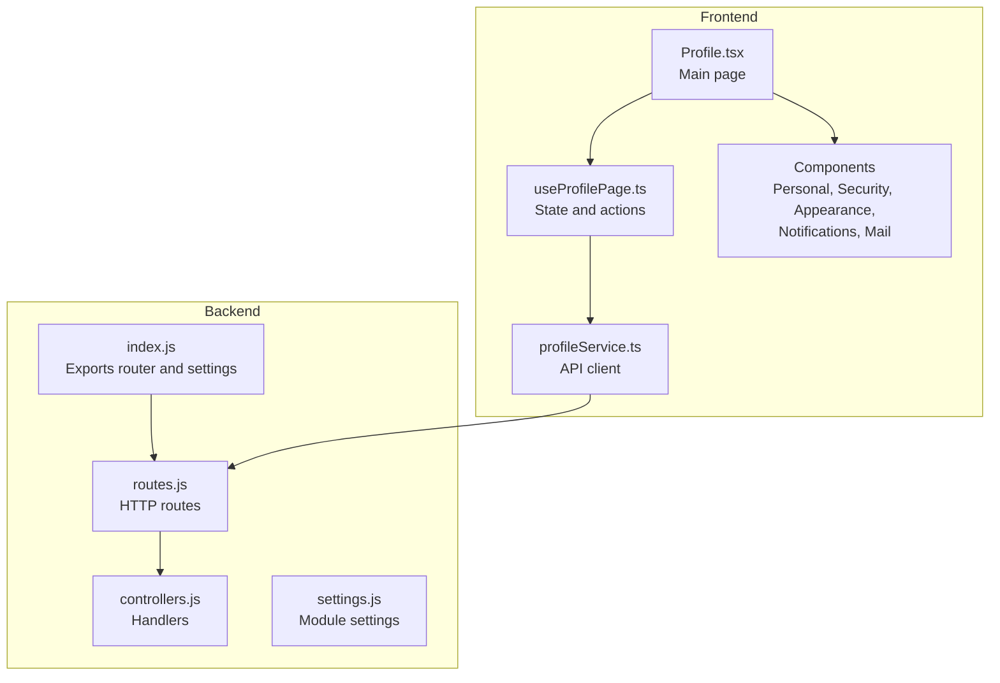
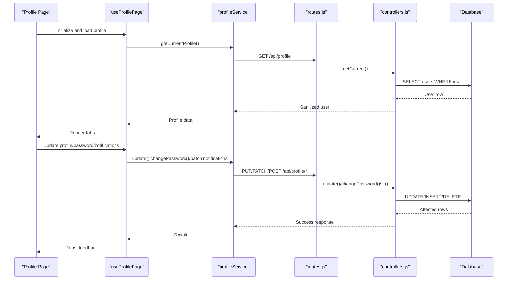
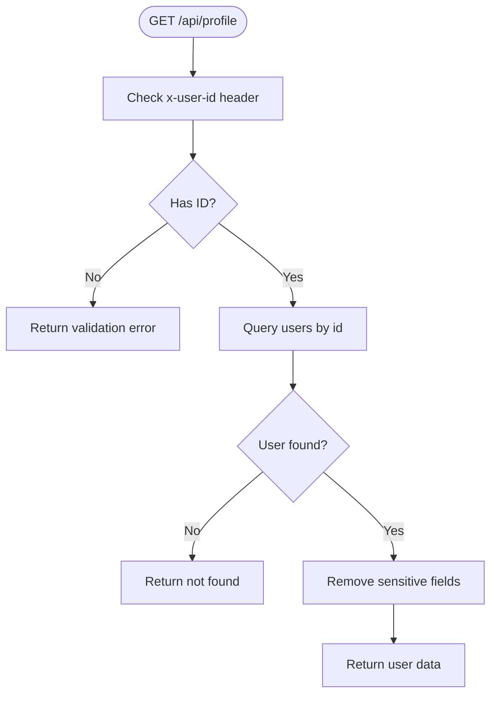
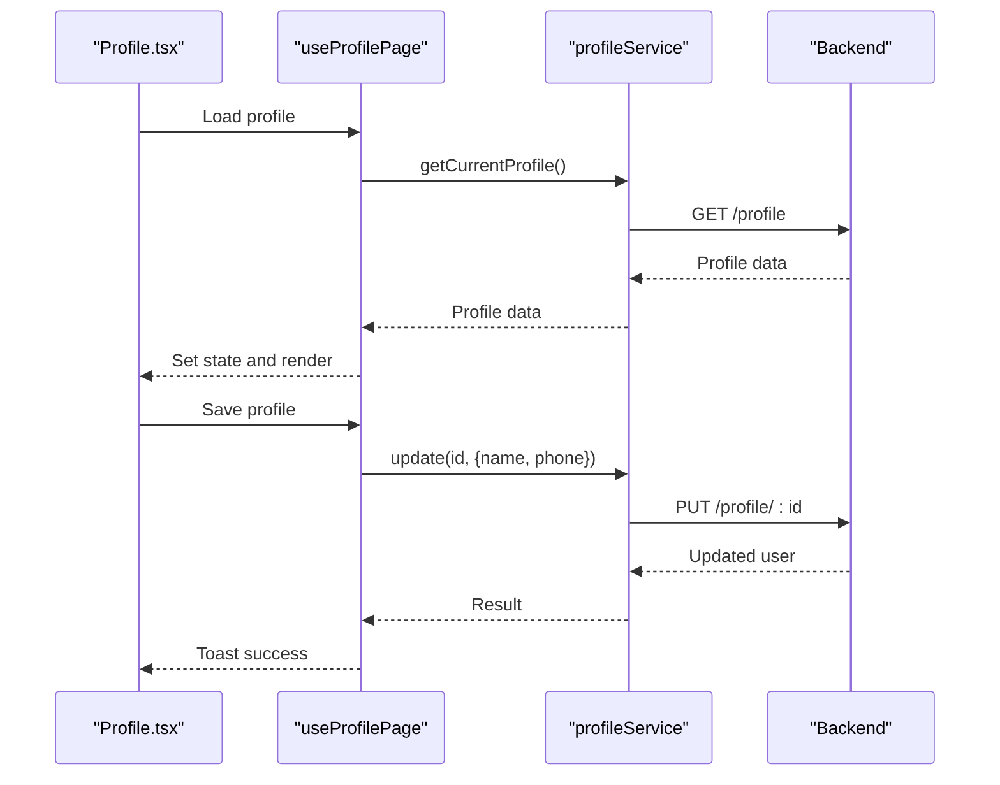
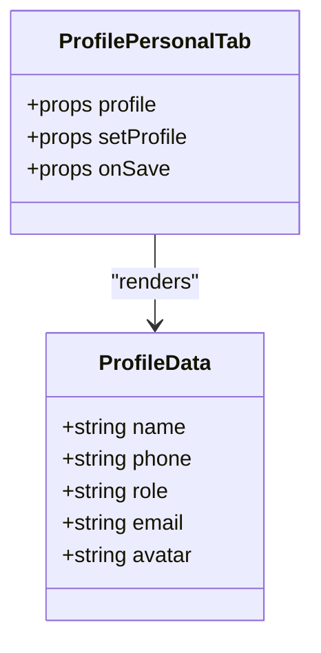
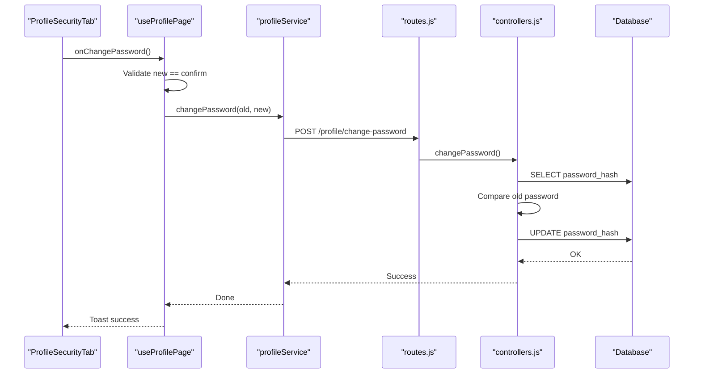
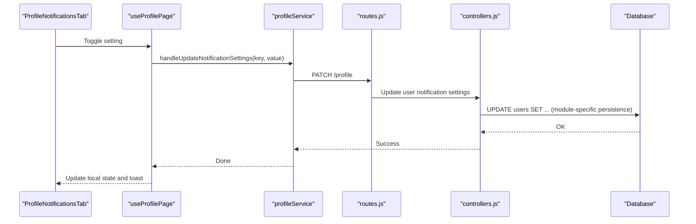
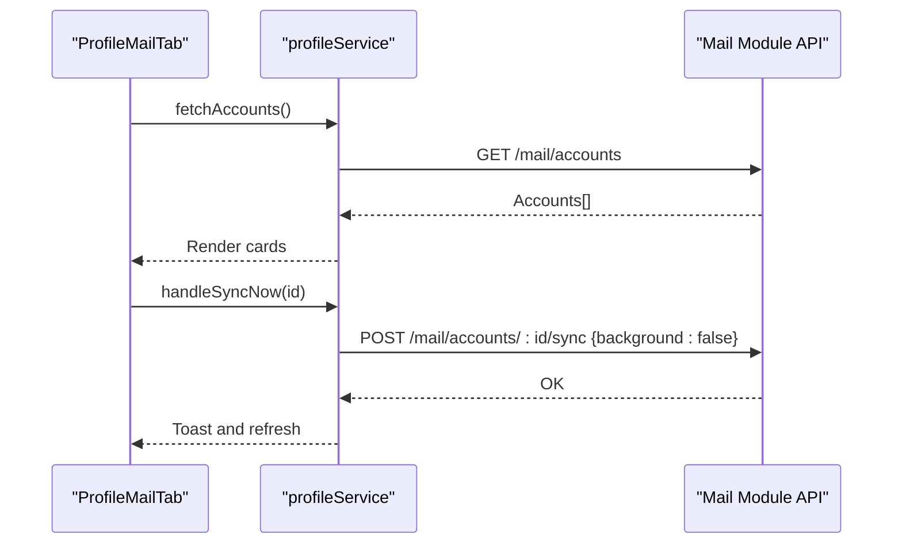
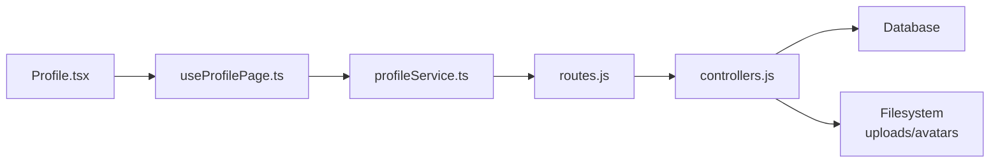

# Profile Module

> 📄 **Синхронизировано** с [docs/modules/profile.md](../../docs/modules/profile.md) — актуальная компактная спецификация модуля (рус.). Ниже — подробный англоязычный разбор с исходниками и диаграммами.

<cite>
**Referenced Files in This Document**
- [backend/modules/profile/index.js](file://backend/modules/profile/index.js)
- [backend/modules/profile/routes.js](file://backend/modules/profile/routes.js)
- [backend/modules/profile/controllers.js](file://backend/modules/profile/controllers.js)
- [backend/modules/profile/settings.js](file://backend/modules/profile/settings.js)
- [frontend/src/modules/profile/pages/Profile.tsx](file://frontend/src/modules/profile/pages/Profile.tsx)
- [frontend/src/modules/profile/hooks/useProfilePage.ts](file://frontend/src/modules/profile/hooks/useProfilePage.ts)
- [frontend/src/modules/profile/api/profileService.ts](file://frontend/src/modules/profile/api/profileService.ts)
- [frontend/src/modules/profile/components/ProfilePersonalTab.tsx](file://frontend/src/modules/profile/components/ProfilePersonalTab.tsx)
- [frontend/src/modules/profile/components/ProfileSecurityTab.tsx](file://frontend/src/modules/profile/components/ProfileSecurityTab.tsx)
- [frontend/src/modules/profile/components/ProfileAppearanceTab.tsx](file://frontend/src/modules/profile/components/ProfileAppearanceTab.tsx)
- [frontend/src/modules/profile/components/ProfileNotificationsTab.tsx](file://frontend/src/modules/profile/components/ProfileNotificationsTab.tsx)
- [frontend/src/modules/profile/components/ProfileMailTab.tsx](file://frontend/src/modules/profile/components/ProfileMailTab.tsx)
- [frontend/src/modules/profile/types.ts](file://frontend/src/modules/profile/types.ts)
</cite>

## Table of Contents
1. [Introduction](#introduction)
2. [Project Structure](#project-structure)
3. [Core Components](#core-components)
4. [Architecture Overview](#architecture-overview)
5. [Detailed Component Analysis](#detailed-component-analysis)
6. [Dependency Analysis](#dependency-analysis)
7. [Performance Considerations](#performance-considerations)
8. [Troubleshooting Guide](#troubleshooting-guide)
9. [Conclusion](#conclusion)
10. [Appendices](#appendices)

## Introduction
The Profile module provides a unified interface for managing user profiles, personal information, appearance settings, notification preferences, and mailbox integration. It exposes a REST API for profile operations and integrates with the frontend to deliver a cohesive user experience. The module supports:
- Personal information updates (name, phone, nickname, Telegram token)
- Avatar upload and management
- Password change with secure hashing
- Shareable document links
- Notification preferences (email, browser, workflow alerts)
- Mailbox account configuration and synchronization controls

## Project Structure
The Profile module is split between backend and frontend:
- Backend: Express routes and controllers under backend/modules/profile
- Frontend: Pages, components, hooks, and services under frontend/src/modules/profile

**Diagram sources**
- [backend/modules/profile/index.js:1-14](file://backend/modules/profile/index.js#L1-L13)
- [backend/modules/profile/routes.js:1-34](file://backend/modules/profile/routes.js#L1-L33)
- [backend/modules/profile/controllers.js:1-241](file://backend/modules/profile/controllers.js#L1-L240)
- [backend/modules/profile/settings.js:1-27](file://backend/modules/profile/settings.js#L1-L26)
- [frontend/src/modules/profile/pages/Profile.tsx:1-105](file://frontend/src/modules/profile/pages/Profile.tsx#L1-L105)
- [frontend/src/modules/profile/hooks/useProfilePage.ts:1-123](file://frontend/src/modules/profile/hooks/useProfilePage.ts#L1-L122)
- [frontend/src/modules/profile/api/profileService.ts:1-97](file://frontend/src/modules/profile/api/profileService.ts#L1-L96)

**Section sources**
- [backend/modules/profile/index.js:1-14](file://backend/modules/profile/index.js#L1-L13)
- [backend/modules/profile/routes.js:1-34](file://backend/modules/profile/routes.js#L1-L33)
- [backend/modules/profile/controllers.js:1-241](file://backend/modules/profile/controllers.js#L1-L240)
- [backend/modules/profile/settings.js:1-27](file://backend/modules/profile/settings.js#L1-L26)
- [frontend/src/modules/profile/pages/Profile.tsx:1-105](file://frontend/src/modules/profile/pages/Profile.tsx#L1-L105)
- [frontend/src/modules/profile/hooks/useProfilePage.ts:1-123](file://frontend/src/modules/profile/hooks/useProfilePage.ts#L1-L122)
- [frontend/src/modules/profile/api/profileService.ts:1-97](file://frontend/src/modules/profile/api/profileService.ts#L1-L96)

## Core Components
- Backend module exports:
  - Router and settings for the Profile module
  - Base route prefix: /api/profile
- Controllers implement:
  - Current user retrieval
  - Password change with verification and hashing
  - Shareable link creation and deletion
  - User document listing
  - Profile retrieval by ID and updates
  - Avatar upload handling with Multer and sanitization
- Frontend module provides:
  - Main Profile page with tabbed interface
  - Hooks for state and API interactions
  - Services for backend communication
  - Components for personal info, security, appearance, notifications, and mailbox integration

**Section sources**
- [backend/modules/profile/index.js:9-13](file://backend/modules/profile/index.js#L9-L13)
- [backend/modules/profile/controllers.js:53-217](file://backend/modules/profile/controllers.js#L53-L217)
- [frontend/src/modules/profile/pages/Profile.tsx:38-101](file://frontend/src/modules/profile/pages/Profile.tsx#L38-L101)
- [frontend/src/modules/profile/hooks/useProfilePage.ts:26-122](file://frontend/src/modules/profile/hooks/useProfilePage.ts#L26-L122)
- [frontend/src/modules/profile/api/profileService.ts:5-96](file://frontend/src/modules/profile/api/profileService.ts#L5-L96)

## Architecture Overview
The Profile module follows a layered architecture:
- Frontend UI invokes services to call backend endpoints
- Backend routes delegate to controllers
- Controllers interact with the database and filesystem
- Settings define feature flags and constraints

**Diagram sources**
- [frontend/src/modules/profile/pages/Profile.tsx:13-27](file://frontend/src/modules/profile/pages/Profile.tsx#L13-L27)
- [frontend/src/modules/profile/hooks/useProfilePage.ts:46-107](file://frontend/src/modules/profile/hooks/useProfilePage.ts#L46-L107)
- [frontend/src/modules/profile/api/profileService.ts:7-95](file://frontend/src/modules/profile/api/profileService.ts#L7-L95)
- [backend/modules/profile/routes.js:9-33](file://backend/modules/profile/routes.js#L9-L33)
- [backend/modules/profile/controllers.js:53-217](file://backend/modules/profile/controllers.js#L53-L217)

## Detailed Component Analysis

### Backend: Routes and Controllers
- Routes:
  - GET /api/profile: Retrieve current user
  - POST /api/profile/change-password: Change password
  - POST /api/profile/share-links: Create share link
  - DELETE /api/profile/share-links/:linkId: Delete share link
  - GET /api/profile/:userId/documents: List user documents
  - GET /api/profile/:id: Get profile by ID
  - PUT /api/profile/:id: Update profile
  - POST /api/profile/:id/avatar: Upload avatar
- Controllers:
  - getCurrent: Validates x-user-id header, queries user, returns sanitized data
  - changePassword: Verifies old password via bcrypt, hashes new password, updates user
  - createShareLink: Generates UUID, inserts into share_links, returns URL
  - deleteShareLink: Deletes by linkId and creator
  - getUserDocuments: Lists documents by uploader
  - getById: Returns sanitized user by ID
  - update: Updates name, email, phone, department, nickname, telegram_token; computes initials
  - uploadAvatar: Saves file via Multer, stores path in users.avatar
  - sanitize: Removes sensitive fields from user object

**Diagram sources**
- [backend/modules/profile/controllers.js:53-65](file://backend/modules/profile/controllers.js#L53-L65)

**Section sources**
- [backend/modules/profile/routes.js:9-33](file://backend/modules/profile/routes.js#L9-L33)
- [backend/modules/profile/controllers.js:53-217](file://backend/modules/profile/controllers.js#L53-L217)

### Frontend: Profile Page and Hooks
- Profile.tsx:
  - Renders tabs: Personal, Mail, Appearance, Security, Notifications
  - Uses useProfilePage for state and actions
- useProfilePage:
  - Loads profile on mount
  - Provides handlers for saving profile, changing password, updating notifications
  - Manages loading and saving states
- profileService:
  - Encapsulates API calls to backend endpoints
  - Handles errors and returns typed responses

**Diagram sources**
- [frontend/src/modules/profile/pages/Profile.tsx:13-27](file://frontend/src/modules/profile/pages/Profile.tsx#L13-L27)
- [frontend/src/modules/profile/hooks/useProfilePage.ts:46-77](file://frontend/src/modules/profile/hooks/useProfilePage.ts#L46-L77)
- [frontend/src/modules/profile/api/profileService.ts:7-37](file://frontend/src/modules/profile/api/profileService.ts#L7-L37)

**Section sources**
- [frontend/src/modules/profile/pages/Profile.tsx:13-101](file://frontend/src/modules/profile/pages/Profile.tsx#L13-L101)
- [frontend/src/modules/profile/hooks/useProfilePage.ts:26-122](file://frontend/src/modules/profile/hooks/useProfilePage.ts#L26-L122)
- [frontend/src/modules/profile/api/profileService.ts:5-96](file://frontend/src/modules/profile/api/profileService.ts#L5-L96)

### Personal Information Tab
- ProfilePersonalTab:
  - Displays avatar with fallback initials
  - Edits name and phone
  - Saves via PATCH to /profile
- Types:
  - ProfileData defines shape for profile fields

**Diagram sources**
- [frontend/src/modules/profile/components/ProfilePersonalTab.tsx:16-97](file://frontend/src/modules/profile/components/ProfilePersonalTab.tsx#L16-L97)
- [frontend/src/modules/profile/types.ts:1-14](file://frontend/src/modules/profile/types.ts#L1-L14)

**Section sources**
- [frontend/src/modules/profile/components/ProfilePersonalTab.tsx:16-97](file://frontend/src/modules/profile/components/ProfilePersonalTab.tsx#L16-L97)
- [frontend/src/modules/profile/types.ts:1-14](file://frontend/src/modules/profile/types.ts#L1-L14)

### Security and Password Management
- ProfileSecurityTab:
  - Collects current/new/confirm passwords
  - Calls changePassword endpoint
- useProfilePage:
  - Validates new vs confirm
  - Handles error/success feedback
- Backend controller:
  - Verifies old password against stored hash
  - Hashes new password with bcrypt
  - Updates user record

**Diagram sources**
- [frontend/src/modules/profile/components/ProfileSecurityTab.tsx:15-85](file://frontend/src/modules/profile/components/ProfileSecurityTab.tsx#L15-L85)
- [frontend/src/modules/profile/hooks/useProfilePage.ts:79-97](file://frontend/src/modules/profile/hooks/useProfilePage.ts#L79-L97)
- [frontend/src/modules/profile/api/profileService.ts:87-95](file://frontend/src/modules/profile/api/profileService.ts#L87-L95)
- [backend/modules/profile/controllers.js:71-96](file://backend/modules/profile/controllers.js#L71-L96)

**Section sources**
- [frontend/src/modules/profile/components/ProfileSecurityTab.tsx:15-85](file://frontend/src/modules/profile/components/ProfileSecurityTab.tsx#L15-L85)
- [frontend/src/modules/profile/hooks/useProfilePage.ts:79-97](file://frontend/src/modules/profile/hooks/useProfilePage.ts#L79-L97)
- [frontend/src/modules/profile/api/profileService.ts:87-95](file://frontend/src/modules/profile/api/profileService.ts#L87-L95)
- [backend/modules/profile/controllers.js:71-96](file://backend/modules/profile/controllers.js#L71-L96)

### Appearance Settings
- ProfileAppearanceTab:
  - Theme selection (light/dark/system)
  - Accent color picker
  - Table density and font size controls
- These settings are persisted via the application’s settings system and not tied to the Profile module endpoints.

**Section sources**
- [frontend/src/modules/profile/components/ProfileAppearanceTab.tsx:11-147](file://frontend/src/modules/profile/components/ProfileAppearanceTab.tsx#L11-L147)

### Notification Preferences
- ProfileNotificationsTab:
  - Toggles for email_notifications, browser_notifications, workflow_alerts
  - Calls PATCH /profile with selected key/value
- useProfilePage:
  - Maintains local state and updates after successful PATCH

**Diagram sources**
- [frontend/src/modules/profile/components/ProfileNotificationsTab.tsx:12-78](file://frontend/src/modules/profile/components/ProfileNotificationsTab.tsx#L12-L78)
- [frontend/src/modules/profile/hooks/useProfilePage.ts:99-107](file://frontend/src/modules/profile/hooks/useProfilePage.ts#L99-L107)
- [frontend/src/modules/profile/api/profileService.ts:97-97](file://frontend/src/modules/profile/api/profileService.ts#L96)

**Section sources**
- [frontend/src/modules/profile/components/ProfileNotificationsTab.tsx:12-78](file://frontend/src/modules/profile/components/ProfileNotificationsTab.tsx#L12-L78)
- [frontend/src/modules/profile/hooks/useProfilePage.ts:99-107](file://frontend/src/modules/profile/hooks/useProfilePage.ts#L99-L107)
- [frontend/src/modules/profile/api/profileService.ts:97-97](file://frontend/src/modules/profile/api/profileService.ts#L96)

### Mailbox Integration
- ProfileMailTab:
  - Lists configured mail accounts
  - Opens MailAccountSettings modal for adding/editing
  - Controls: sync now, toggle active, clear database, delete account
  - Integrates with mail module endpoints (/mail/accounts/*)
- Uses provider icons for Gmail, Outlook, Mail.ru, and generic provider

**Diagram sources**
- [frontend/src/modules/profile/components/ProfileMailTab.tsx:67-148](file://frontend/src/modules/profile/components/ProfileMailTab.tsx#L67-L148)

**Section sources**
- [frontend/src/modules/profile/components/ProfileMailTab.tsx:51-329](file://frontend/src/modules/profile/components/ProfileMailTab.tsx#L51-L279)

### Shareable Links
- Backend:
  - POST /api/profile/share-links creates a share link with optional expiry
  - DELETE /api/profile/share-links/:linkId removes the link by creator
- Frontend:
  - Uses profileService.createShareLink and deleteShareLink
  - Returns share URL pattern (/share/{id})

**Section sources**
- [backend/modules/profile/controllers.js:102-137](file://backend/modules/profile/controllers.js#L102-L137)
- [backend/modules/profile/routes.js:15-19](file://backend/modules/profile/routes.js#L15-L19)
- [frontend/src/modules/profile/api/profileService.ts:63-85](file://frontend/src/modules/profile/api/profileService.ts#L63-L85)

## Dependency Analysis
- Backend dependencies:
  - Express router and controllers
  - Multer for avatar uploads
  - bcrypt for password hashing
  - Database access via centralized db module
  - Response helpers and error handler utilities
- Frontend dependencies:
  - API client (api) for HTTP requests
  - i18n for translations
  - UI components (tabs, cards, switches, buttons)
  - Settings context for appearance controls

**Diagram sources**
- [frontend/src/modules/profile/pages/Profile.tsx:13-27](file://frontend/src/modules/profile/pages/Profile.tsx#L13-L27)
- [frontend/src/modules/profile/hooks/useProfilePage.ts:46-107](file://frontend/src/modules/profile/hooks/useProfilePage.ts#L46-L107)
- [frontend/src/modules/profile/api/profileService.ts:7-95](file://frontend/src/modules/profile/api/profileService.ts#L7-L95)
- [backend/modules/profile/routes.js:9-33](file://backend/modules/profile/routes.js#L9-L33)
- [backend/modules/profile/controllers.js:53-217](file://backend/modules/profile/controllers.js#L53-L217)

**Section sources**
- [backend/modules/profile/controllers.js:18-31](file://backend/modules/profile/controllers.js#L18-L31)
- [frontend/src/modules/profile/api/profileService.ts:3-4](file://frontend/src/modules/profile/api/profileService.ts#L3-L4)

## Performance Considerations
- Avatar uploads:
  - Disk-based storage with randomized filenames
  - Max file size and allowed MIME types configured
- Password hashing:
  - bcrypt cost factor applied during hashing
- Database queries:
  - Single-row lookups and targeted updates minimize overhead
- Frontend:
  - Local state updates before backend confirm reduce perceived latency
  - Toast notifications provide immediate feedback

**Section sources**
- [backend/modules/profile/settings.js:18-22](file://backend/modules/profile/settings.js#L18-L22)
- [backend/modules/profile/controllers.js:92-93](file://backend/modules/profile/controllers.js#L92-L93)
- [backend/modules/profile/controllers.js:24-31](file://backend/modules/profile/controllers.js#L24-L31)

## Troubleshooting Guide
- Authentication header missing:
  - Symptom: Validation error on GET /api/profile
  - Cause: x-user-id header not present
  - Fix: Ensure auth middleware sets the header
- Invalid old password:
  - Symptom: Validation error on password change
  - Cause: Old password mismatch
  - Fix: Re-enter correct current password
- Avatar upload failures:
  - Symptom: Server error on POST /api/profile/:id/avatar
  - Causes: Multer middleware error, invalid file type, or disk write failure
  - Fix: Verify allowed types and file size limits; check server disk permissions
- Share link errors:
  - Symptom: Validation error on create/delete
  - Causes: Missing documentId or unauthorized deletion
  - Fix: Provide valid documentId; ensure creator matches current user

**Section sources**
- [backend/modules/profile/controllers.js:55-57](file://backend/modules/profile/controllers.js#L55-L57)
- [backend/modules/profile/controllers.js:77-80](file://backend/modules/profile/controllers.js#L77-L80)
- [backend/modules/profile/controllers.js:220-227](file://backend/modules/profile/controllers.js#L220-L227)
- [backend/modules/profile/controllers.js:108-111](file://backend/modules/profile/controllers.js#L108-L111)

## Conclusion
The Profile module offers a robust, modular solution for user profile management with clear separation between backend APIs and frontend UI. It emphasizes security (password hashing, sanitization), usability (avatar uploads, shareable links), and flexibility (appearance and notification settings). The integration with the mail module enables comprehensive mailbox configuration and synchronization controls.

## Appendices

### Practical Examples
- Profile setup:
  - Open the Profile page and navigate to the Personal tab
  - Edit name and phone, then save
  - Upload an avatar using the avatar area
- Security configuration:
  - Go to the Security tab
  - Enter current and new passwords; confirm new password
  - Submit to change password
- Notification customization:
  - Visit the Notifications tab
  - Toggle email, browser, and workflow alert preferences
  - Observe immediate feedback via toast messages

[No sources needed since this section provides general guidance]