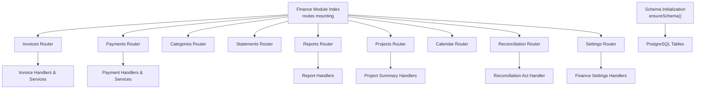
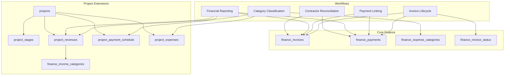
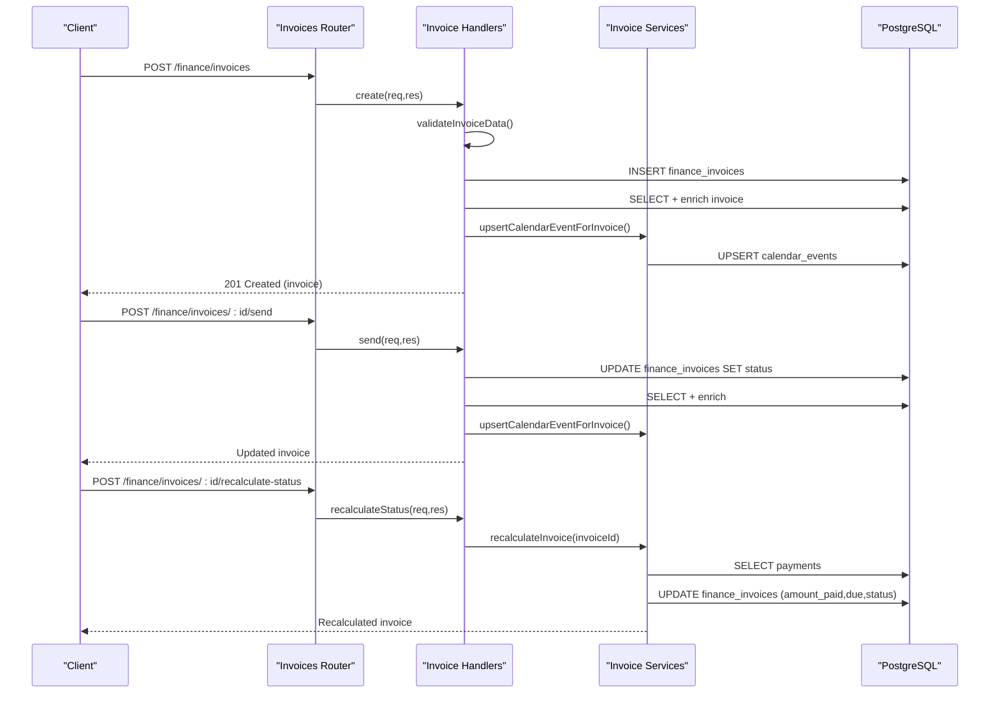
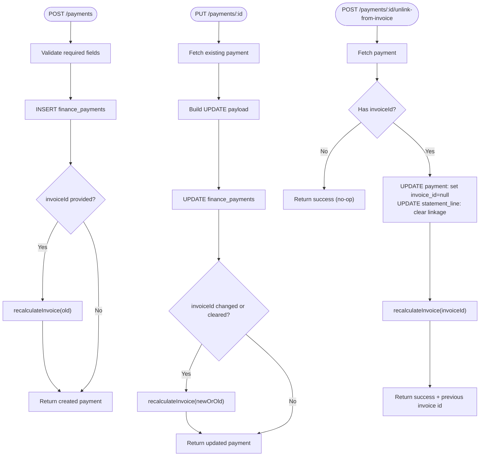
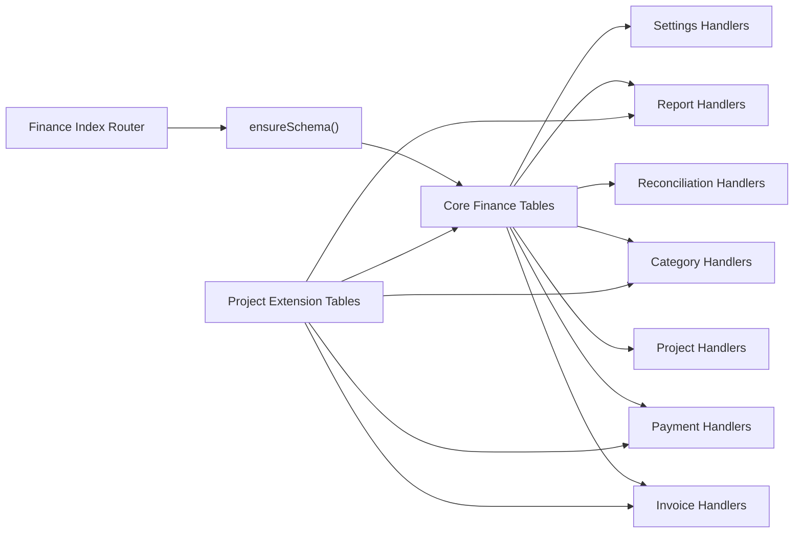

# Project Finance

<cite>
**Referenced Files in This Document**
- [index.js](file://backend/modules/finance/index.js)
- [schema.js](file://backend/modules/finance/schema.js)
- [projects.js](file://backend/modules/finance/projects.js)
- [payments.js](file://backend/modules/finance/payments.js)
- [reports.js](file://backend/modules/finance/reports.js)
- [invoices/index.js](file://backend/modules/finance/invoices/index.js)
- [invoices/handlers.js](file://backend/modules/finance/invoices/handlers.js)
- [invoices/services.js](file://backend/modules/finance/invoices/services.js)
- [categories.js](file://backend/modules/finance/categories.js)
- [statements.js](file://backend/modules/finance/statements.js)
- [reconciliation.js](file://backend/modules/finance/reconciliation.js)
- [utils.js](file://backend/modules/finance/utils.js)
- [settings.js](file://backend/modules/finance/settings.js)
- [69_projects_finance_phase1.sql](file://backend/migrations/69_projects_finance_phase1.sql)
- [71_project_expenses_table.sql](file://backend/migrations/71_project_expenses_table.sql)
- [73_project_expenses_revenues_categories.sql](file://backend/migrations/73_project_expenses_revenues_categories.sql)
</cite>

## Table of Contents
1. [Introduction](#introduction)
2. [Project Structure](#project-structure)
3. [Core Components](#core-components)
4. [Architecture Overview](#architecture-overview)
5. [Detailed Component Analysis](#detailed-component-analysis)
6. [Dependency Analysis](#dependency-analysis)
7. [Performance Considerations](#performance-considerations)
8. [Troubleshooting Guide](#troubleshooting-guide)
9. [Conclusion](#conclusion)
10. [Appendices](#appendices)

## Introduction
This document describes the Project Finance system within the Titan CRM backend. It covers project budget management, expense tracking, and revenue recognition; payment schedules and invoicing workflows; financial reporting; cost allocation and profit margin tracking; financial forecasting; and integration with the main finance module including invoice generation and payment processing. Practical examples illustrate budget setup, expense recording, and financial reporting scenarios. The document also outlines API endpoints, data models, and reconciliation processes with accounting systems.

## Project Structure
The Project Finance module is organized around a central router that mounts submodules for invoices, payments, categories, statements, reports, projects, calendar, reconciliation, and settings. A schema initialization ensures database tables and enums are ready before requests are processed. Migrations define the evolving data model for projects, stages, revenues, payment schedules, and expenses.

**Diagram sources**
- [index.js:1-55](file://backend/modules/finance/index.js#L1-L55)
- [schema.js:9-198](file://backend/modules/finance/schema.js#L9-L198)

**Section sources**
- [index.js:1-55](file://backend/modules/finance/index.js#L1-L55)
- [schema.js:1-201](file://backend/modules/finance/schema.js#L1-L200)

## Core Components
- Invoices: Full lifecycle management including creation, sending, status recalculation, document generation, and bulk updates.
- Payments: CRUD operations, linking/unlinking from invoices, bulk updates, and automatic invoice recalculation.
- Categories: Income/expense categories for classification of project revenues and expenses.
- Reports: Receivables aging, Profit & Loss, Cash Flow (DDS), and payment register exports.
- Projects: Project list with financial summary and per-project financial snapshot.
- Reconciliation: Contractor-level reconciliation act aggregating invoices and payments.
- Settings: Tax regimes, tax rates, allocation methods, overhead articles, and defaults.

**Section sources**
- [invoices/index.js:1-40](file://backend/modules/finance/invoices/index.js#L1-L39)
- [payments.js:1-340](file://backend/modules/finance/payments.js#L1-L7)
- [categories.js:1-86](file://backend/modules/finance/categories.js#L1-L86)
- [reports.js:1-221](file://backend/modules/finance/reports.js#L1-L221)
- [projects.js:1-91](file://backend/modules/finance/projects.js#L1-L90)
- [reconciliation.js:1-79](file://backend/modules/finance/reconciliation.js#L1-L78)
- [settings.js:1-55](file://backend/modules/finance/settings.js#L1-L54)

## Architecture Overview
The Project Finance system integrates tightly with the main finance module. Invoices drive payment tracking and status automation. Payments can be linked to invoices and trigger invoice recalculation. Categories classify cash flows. Reports aggregate data for management insights. Project-specific models (stages, revenues, payment schedule, expenses) extend the core finance schema to support project-level budgeting and forecasting.

**Diagram sources**
- [schema.js:22-197](file://backend/modules/finance/schema.js#L22-L197)
- [69_projects_finance_phase1.sql:8-424](file://backend/migrations/69_projects_finance_phase1.sql#L8-L424)
- [71_project_expenses_table.sql:10-73](file://backend/migrations/71_project_expenses_table.sql#L10-L73)
- [73_project_expenses_revenues_categories.sql:26-104](file://backend/migrations/73_project_expenses_revenues_categories.sql#L26-L104)

## Detailed Component Analysis

### Invoices: Lifecycle and Status Automation
- Creation: Validates input, generates identifiers, inserts invoice, optionally syncs to project revenue, and creates calendar reminders.
- Sending: Updates status to sent/paid depending on current state.
- Recalculation: Computes amount_paid, amount_due, and derived status based on payments and due date.
- Document Generation: Generates invoice-related documents (e.g., invoice factura, act) for paid invoices and persists them.
- Bulk Update: Massively updates selected invoice attributes and recalculates statuses.

**Diagram sources**
- [invoices/index.js:12-31](file://backend/modules/finance/invoices/index.js#L12-L31)
- [invoices/handlers.js:62-142](file://backend/modules/finance/invoices/handlers.js#L62-L142)
- [invoices/handlers.js:286-347](file://backend/modules/finance/invoices/handlers.js#L286-L347)
- [invoices/services.js:83-133](file://backend/modules/finance/invoices/services.js#L83-L133)

**Section sources**
- [invoices/index.js:1-40](file://backend/modules/finance/invoices/index.js#L1-L39)
- [invoices/handlers.js:1-571](file://backend/modules/finance/invoices/handlers.js#L1-L481)
- [invoices/services.js:1-239](file://backend/modules/finance/invoices/services.js#L1-L239)
- [utils.js:42-93](file://backend/modules/finance/utils.js#L42-L93)

### Payments: Linking, Unlinking, and Bulk Operations
- Filtering: Supports filtering by kind, invoiceId, projectId, contractorId, taskId, and date range.
- Creation: Inserts payment, links to invoice if provided, and triggers invoice recalculation.
- Update: Updates payment fields, handles unlinking from invoice, and recalculates affected invoices.
- Unlink: Removes invoice linkage, clears reconciliation linkage, and recalculates invoice.
- Bulk Update: Applies allowed field updates across multiple payments and recalculates related invoices.

**Diagram sources**
- [payments.js:77-266](file://backend/modules/finance/payments.js#L7)

**Section sources**
- [payments.js:1-340](file://backend/modules/finance/payments.js#L1-L7)

### Categories: Income/Expense Classification
- Retrieve categories filtered by kind (income/expense).
- Create/update/delete categories with validation against system categories.
- Used by payments and project revenues/expenses for classification.

**Section sources**
- [categories.js:1-86](file://backend/modules/finance/categories.js#L1-L86)
- [schema.js:104-128](file://backend/modules/finance/schema.js#L104-L128)

### Reports: Receivables Aging, P&L, Cash Flow, Register Export
- Receivables Aging: Groups unpaid invoices by contractor/project or combined, computes overdue flags and days.
- Profit & Loss: Aggregates income/expense by category for a period and project filter.
- Cash Flow (DDS): Consolidates totals by category and kind.
- Payment Register: Export-style listing with optional filters for date range, kind, project, contractor.

**Section sources**
- [reports.js:1-221](file://backend/modules/finance/reports.js#L1-L221)

### Projects: Financial Summary and Snapshot
- List projects with basic budget and aggregated invoice/payment/expense totals.
- Per-project summary computes total invoiced, paid, expenses, receivables, and profit/loss.

**Section sources**
- [projects.js:1-91](file://backend/modules/finance/projects.js#L1-L90)

### Reconciliation: Contractor Reconciliation Act
- Generates a reconciliation act for a contractor over an optional date range, summarizing invoices and payments.

**Section sources**
- [reconciliation.js:1-79](file://backend/modules/finance/reconciliation.js#L1-L78)

### Settings: Tax Regimes, Tax Rates, Allocation Methods, Overhead Articles
- Provides endpoints to manage tax regimes and legal forms, tax rates with history, allocation methods, overhead articles, and default settings.

**Section sources**
- [settings.js:1-55](file://backend/modules/finance/settings.js#L1-L54)

## Dependency Analysis
- Router composition: The finance index router composes submodules and ensures schema readiness via middleware.
- Invoice-to-Payment dependency: Payments link to invoices; unlinking triggers invoice recalculation.
- Category dependency: Payments and project revenues/expenses reference finance categories for classification.
- Project extension dependency: Project stages, revenues, payment schedule, and expenses extend core finance entities with project scoping and status automation via triggers.

**Diagram sources**
- [index.js:19-38](file://backend/modules/finance/index.js#L19-L38)
- [schema.js:9-198](file://backend/modules/finance/schema.js#L9-L198)
- [69_projects_finance_phase1.sql:8-424](file://backend/migrations/69_projects_finance_phase1.sql#L8-L424)

**Section sources**
- [index.js:1-55](file://backend/modules/finance/index.js#L1-L55)
- [schema.js:1-201](file://backend/modules/finance/schema.js#L1-L200)

## Performance Considerations
- Indexes: Migrations create indexes on frequently queried columns (project dates, stage order, revenue/status, payment schedule status/due date, contractor and category filters). These support efficient filtering and aggregation in reports and summaries.
- Aggregation queries: Reports and project summaries use aggregate functions and grouping; ensure appropriate indexes exist on join and filter keys.
- Triggers: Status automation in project tables reduces manual updates but adds write overhead; monitor during bulk operations.
- Pagination and filters: Use query parameters (date ranges, project, contractor, kind) to limit result sets in reports and payments endpoints.

[No sources needed since this section provides general guidance]

## Troubleshooting Guide
- Invoice status anomalies: Use the status recalculation endpoint to recompute amounts and status based on current payments and due date.
- Payment unlinking: If a payment is incorrectly linked, use the unlink endpoint to break the association and clear reconciliation linkage.
- Missing categories: Ensure categories exist and are properly referenced by payments and project entries; system categories cannot be deleted.
- Reconciliation discrepancies: Use the contractor reconciliation act to compare invoices and payments within a date range and resolve differences.

**Section sources**
- [invoices/handlers.js:332-347](file://backend/modules/finance/invoices/handlers.js#L332-L347)
- [payments.js:229-266](file://backend/modules/finance/payments.js#L7)
- [categories.js:67-83](file://backend/modules/finance/categories.js#L67-L83)
- [reconciliation.js:11-76](file://backend/modules/finance/reconciliation.js#L11-L76)

## Conclusion
The Project Finance system provides a robust foundation for managing project budgets, tracking expenses, recognizing revenues, automating payment schedules, generating invoices, and producing financial reports. Its integration with the core finance module enables seamless invoice/payment workflows, while project-specific extensions support detailed planning, forecasting, and profitability tracking. Proper use of categories, status automation, and reporting endpoints supports accurate financial oversight and compliance.

[No sources needed since this section summarizes without analyzing specific files]

## Appendices

### API Endpoints Overview
- Invoices
  - GET /finance/invoices
  - GET /finance/invoices/:id
  - POST /finance/invoices
  - PUT /finance/invoices/:id
  - POST /finance/invoices/:id/send
  - POST /finance/invoices/:id/recalculate-status
  - POST /finance/invoices/:id/generate-document
  - DELETE /finance/invoices/:id
  - POST /finance/invoices/bulk-update
- Payments
  - GET /finance/payments
  - POST /finance/payments
  - PUT /finance/payments/:id
  - DELETE /finance/payments/:id
  - POST /finance/payments/:id/unlink-from-invoice
  - POST /finance/payments/bulk-update
- Categories
  - GET /finance/categories
  - POST /finance/categories
  - PUT /finance/categories/:id
  - DELETE /finance/categories/:id
- Reports
  - GET /finance/reports/receivables
  - GET /finance/reports/pl
  - GET /finance/reports/dds
  - GET /finance/reports/register
- Projects
  - GET /finance/projects
  - GET /finance/projects/:projectId/summary
- Reconciliation
  - GET /finance/reconciliation-act/:contractorId
- Settings
  - GET/POST/PUT/DELETE tax regimes, tax rates, allocation methods, overhead articles, defaults

**Section sources**
- [invoices/index.js:12-37](file://backend/modules/finance/invoices/index.js#L12-L37)
- [payments.js:12-337](file://backend/modules/finance/payments.js#L7)
- [categories.js:9-83](file://backend/modules/finance/categories.js#L9-L83)
- [reports.js:10-218](file://backend/modules/finance/reports.js#L10-L218)
- [projects.js:10-88](file://backend/modules/finance/projects.js#L10-L88)
- [reconciliation.js:11-76](file://backend/modules/finance/reconciliation.js#L11-L76)
- [settings.js:13-52](file://backend/modules/finance/settings.js#L13-L52)

### Data Models and Keys
- Core Finance Tables
  - finance_invoices: id, identifier, contractor_id, project_id, lawyer_user_id, source_task_id, title, description, currency, amount_total, amount_paid, amount_due, issue_date, due_date, status, calendar_event_id, created_by, updated_by, created_at, updated_at, invoice_type, vat_rate, vat_amount, is_taxable
  - finance_payments: id, kind, invoice_id, project_id, contractor_id, task_id, amount, currency, payment_date, method, comment, category_id, created_by, created_at
  - finance_expense_categories: id, name, kind, parent_id, color, is_system, created_at
  - finance_invoice_status: id, name, color, displayorder
  - finance_bank_statements: id, file_name, import_type, account, date_from, date_to, total_credit, total_debit, status, imported_by, created_at
  - finance_statement_lines: id, statement_id, line_date, amount, direction, counterparty, purpose, reference, invoice_id, payment_id, reconcile_status, category_id, contractor_id, counterparty_inn, account_number, created_at
- Project Extension Tables
  - projects: start_date, end_date, budget_currency, tax_regime_id, overhead_allocated, profit_actual, profit_plan, wip_amount, created_at, updated_at
  - project_stages: id, project_id, name, description, start_date, end_date, planned_start_date, planned_end_date, progress, is_completed, completed_at, order_index, budget, budget_used, responsible_user_id, created_at, updated_at
  - project_revenues: id, project_id, stage_id, contractor_id, name, description, amount, currency, vat_rate, vat_amount, planned_date, actual_date, invoice_id, payment_id, status, overdue_since, is_taxable, created_at, updated_at
  - project_payment_schedule: id, project_id, stage_id, revenue_id, name, description, amount, currency, due_date, paid_date, paid_amount, payment_method, status, overdue_since, is_early, payment_reference, created_at, updated_at
  - project_expenses: id, project_id, category_id, contractor_id, name, description, amount, planned_date, actual_date, payment_id, is_approved, is_paid, created_at, updated_at
  - finance_income_categories: id, name, parent_id, color, is_system, is_active, created_at, updated_at

**Section sources**
- [schema.js:22-197](file://backend/modules/finance/schema.js#L22-L197)
- [69_projects_finance_phase1.sql:88-274](file://backend/migrations/69_projects_finance_phase1.sql#L88-L274)
- [71_project_expenses_table.sql:10-56](file://backend/migrations/71_project_expenses_table.sql#L10-L56)
- [73_project_expenses_revenues_categories.sql:26-109](file://backend/migrations/73_project_expenses_revenues_categories.sql#L26-L109)

### Practical Examples

- Budget Setup
  - Configure tax regimes and tax rates via settings endpoints.
  - Define allocation methods and overhead articles for cost distribution.
  - Create project stages with planned budgets and dates; use views for stage summaries.

- Expense Recording
  - Create project expenses with category and contractor references.
  - Mark approvals and payments; use category classification for reporting.

- Financial Reporting
  - Receivables aging grouped by contractor/project to track overdue balances.
  - Profit & Loss by category for a period and project to assess profitability.
  - Cash Flow (DDS) to monitor income vs. expense by category.
  - Payment register export for external reconciliation.

[No sources needed since this section provides general guidance]

### Reconciliation Processes with Accounting Systems
- Import bank statements and match transactions to payments/invoices.
- Use statement lines to reconcile unmatched items and update reconcile_status.
- Generate reconciliation acts for contractors to confirm balances.
- Export payment register for accounting systems.

**Section sources**
- [statements.js:1-17](file://backend/modules/finance/statements.js#L1-L16)
- [schema.js:142-197](file://backend/modules/finance/schema.js#L142-L197)
- [reconciliation.js:11-76](file://backend/modules/finance/reconciliation.js#L11-L76)