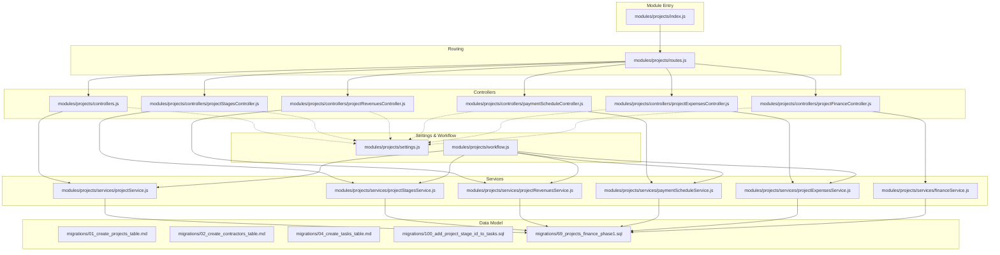
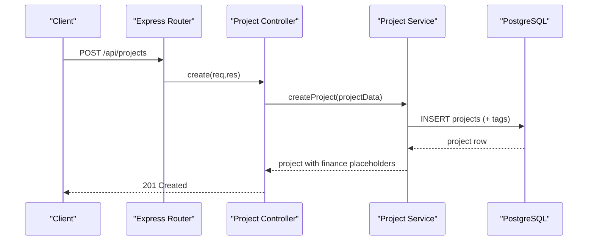
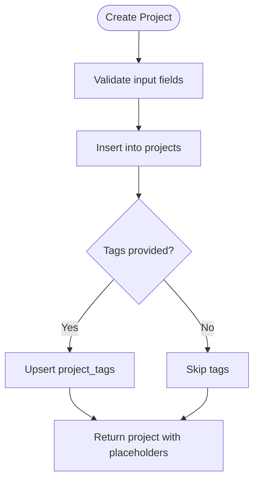
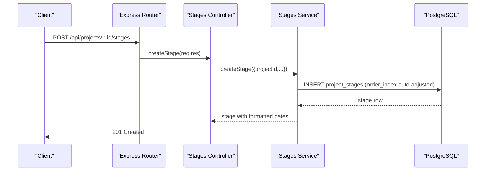
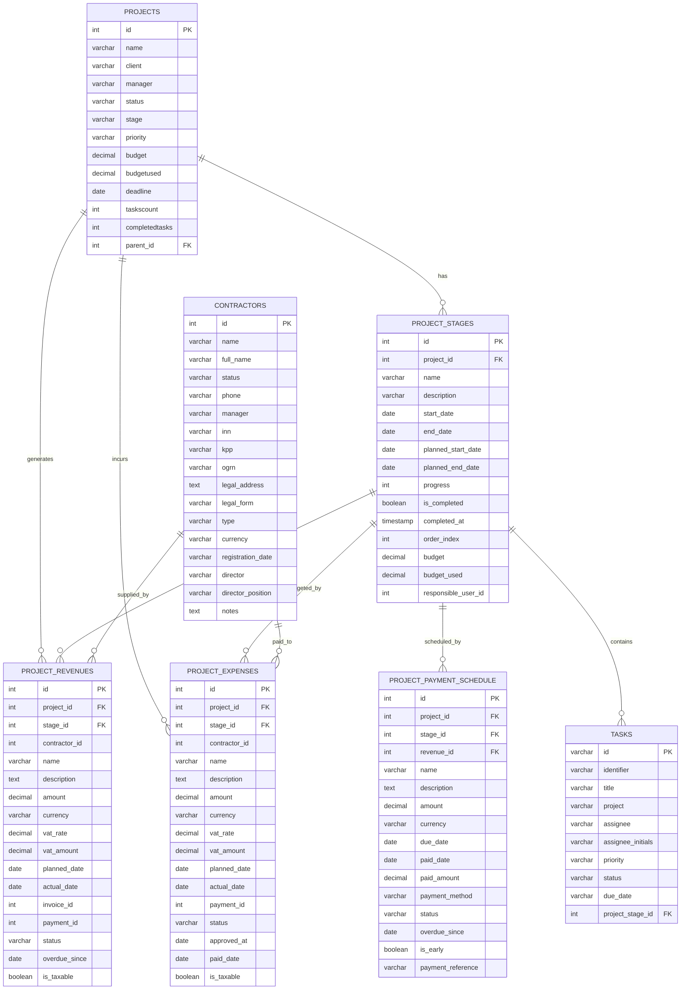
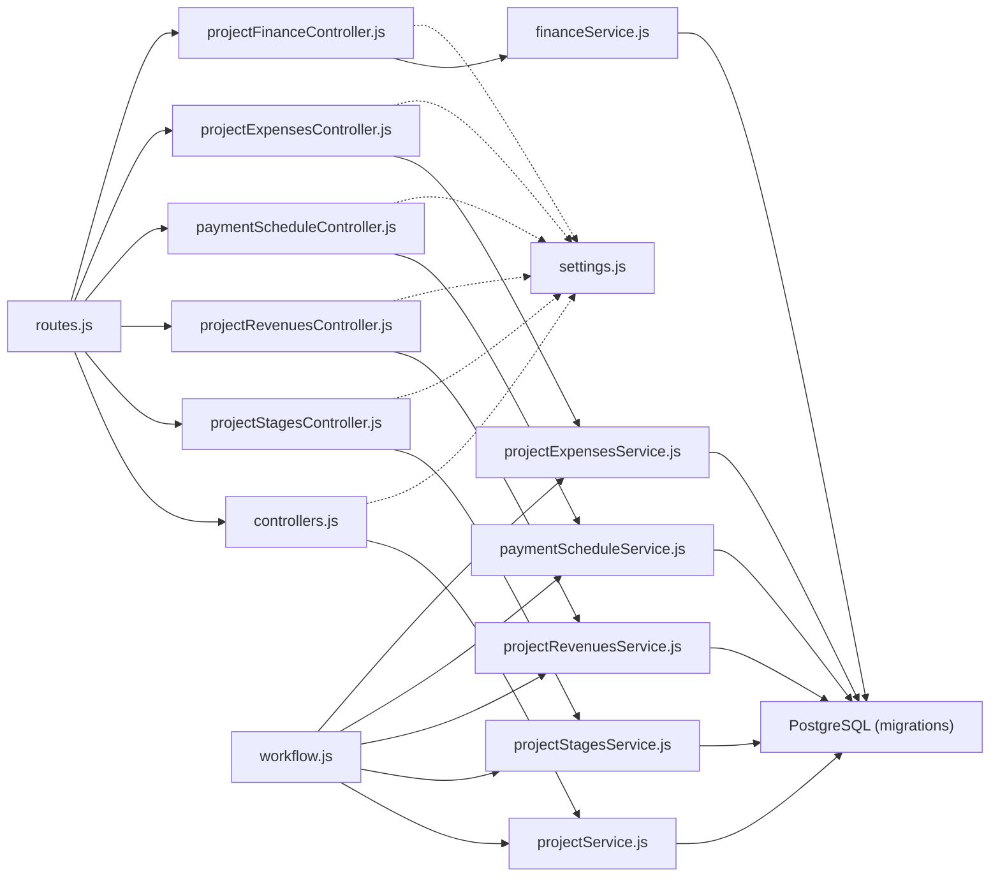

# Project Management

<cite>
**Referenced Files in This Document**
- [backend/modules/projects/index.js](file://backend/modules/projects/index.js)
- [backend/modules/projects/routes.js](file://backend/modules/projects/routes.js)
- [backend/modules/projects/controllers.js](file://backend/modules/projects/controllers.js)
- [backend/modules/projects/services/projectService.js](file://backend/modules/projects/services/projectService.js)
- [backend/modules/projects/workflow.js](file://backend/modules/projects/workflow.js)
- [backend/modules/projects/controllers/projectStagesController.js](file://backend/modules/projects/controllers/projectStagesController.js)
- [backend/modules/projects/services/projectStagesService.js](file://backend/modules/projects/services/projectStagesService.js)
- [backend/modules/projects/controllers/projectExpensesController.js](file://backend/modules/projects/controllers/projectExpensesController.js)
- [backend/modules/projects/services/projectExpensesService.js](file://backend/modules/projects/services/projectExpensesService.js)
- [backend/modules/projects/controllers/projectRevenuesController.js](file://backend/modules/projects/controllers/projectRevenuesController.js)
- [backend/modules/projects/services/projectRevenuesService.js](file://backend/modules/projects/services/projectRevenuesService.js)
- [backend/modules/projects/controllers/paymentScheduleController.js](file://backend/modules/projects/controllers/paymentScheduleController.js)
- [backend/modules/projects/services/paymentScheduleService.js](file://backend/modules/projects/services/paymentScheduleService.js)
- [backend/modules/projects/controllers/projectFinanceController.js](file://backend/modules/projects/controllers/projectFinanceController.js)
- [backend/modules/projects/services/financeService.js](file://backend/modules/projects/services/financeService.js)
- [backend/migrations/01_create_projects_table.md](file://backend/migrations/01_create_projects_table.md)
- [backend/migrations/02_create_contractors_table.md](file://backend/migrations/02_create_contractors_table.md)
- [backend/migrations/04_create_tasks_table.md](file://backend/migrations/04_create_tasks_table.md)
- [backend/migrations/100_add_project_stage_id_to_tasks.sql](file://backend/migrations/100_add_project_stage_id_to_tasks.sql)
- [backend/migrations/69_projects_finance_phase1.sql](file://backend/migrations/69_projects_finance_phase1.sql)
- [docs/api/PROJECTS.md](file://docs/api/PROJECTS.md)
</cite>

## Table of Contents
1. [Introduction](#introduction)
2. [Project Structure](#project-structure)
3. [Core Components](#core-components)
4. [Architecture Overview](#architecture-overview)
5. [Detailed Component Analysis](#detailed-component-analysis)
6. [Dependency Analysis](#dependency-analysis)
7. [Performance Considerations](#performance-considerations)
8. [Troubleshooting Guide](#troubleshooting-guide)
9. [Conclusion](#conclusion)
10. [Appendices](#appendices)

## Introduction
This document describes the Project Management functionality in the Titan CRM system. It covers project creation workflows, lifecycle management (active, completed, archived), configuration options, phases and stages, milestone tracking, resource allocation, team assignment, contractor integration, project settings, and the project API surface. It also explains integration patterns with the Tasks and Finance modules, including stages, revenues, payment schedules, and expenses.

## Project Structure
The Project Management module is organized around a clear separation of concerns:
- Routes define the HTTP endpoints for projects, stages, revenues, payment schedules, and expenses.
- Controllers handle HTTP requests and delegate to services.
- Services encapsulate business logic and database interactions.
- Settings define UI/display defaults and feature toggles.
- Workflow actions integrate project operations into the broader workflow engine.
- Migrations define the underlying data model for projects, stages, revenues, payment schedules, and related integrations.

**Diagram sources**
- [backend/modules/projects/index.js:1-14](file://backend/modules/projects/index.js#L1-L13)
- [backend/modules/projects/routes.js:1-168](file://backend/modules/projects/routes.js#L1-L168)
- [backend/modules/projects/controllers.js:1-201](file://backend/modules/projects/controllers.js#L1-L201)
- [backend/modules/projects/services/projectService.js:1-334](file://backend/modules/projects/services/projectService.js#L1-L334)
- [backend/modules/projects/workflow.js:1-92](file://backend/modules/projects/workflow.js#L1-L91)
- [backend/migrations/69_projects_finance_phase1.sql:1-440](file://backend/migrations/69_projects_finance_phase1.sql#L1-L439)

**Section sources**
- [backend/modules/projects/index.js:1-14](file://backend/modules/projects/index.js#L1-L13)
- [backend/modules/projects/routes.js:1-168](file://backend/modules/projects/routes.js#L1-L168)

## Core Components
- Project CRUD and lifecycle: create, update, delete, bulk update, complete, archive, statistics.
- Project stages: create, update, delete, complete, reorder, and summary.
- Finances: revenues, payment schedule, expenses, P&L, finance summary, taxes.
- Workflow integration: create project, update status, find project.
- Settings: display defaults, feature flags, and default values.

Key capabilities:
- Project creation with tags and optional parent-child hierarchy.
- Stage-based planning with budgets, responsible users, and progress tracking.
- Revenue tracking linked to stages and contractors.
- Payment schedule automation via triggers and status updates.
- Expense approvals and payments with categories.
- Financial analytics and reporting.

**Section sources**
- [backend/modules/projects/controllers.js:1-201](file://backend/modules/projects/controllers.js#L1-L201)
- [backend/modules/projects/services/projectService.js:1-334](file://backend/modules/projects/services/projectService.js#L1-L334)
- [backend/modules/projects/controllers/projectStagesController.js:1-204](file://backend/modules/projects/controllers/projectStagesController.js#L1-L203)
- [backend/modules/projects/services/projectStagesService.js:1-369](file://backend/modules/projects/services/projectStagesService.js#L1-L368)
- [backend/modules/projects/controllers/projectRevenuesController.js](file://backend/modules/projects/controllers/projectRevenuesController.js)
- [backend/modules/projects/services/projectRevenuesService.js](file://backend/modules/projects/services/projectRevenuesService.js)
- [backend/modules/projects/controllers/paymentScheduleController.js](file://backend/modules/projects/controllers/paymentScheduleController.js)
- [backend/modules/projects/services/paymentScheduleService.js](file://backend/modules/projects/services/paymentScheduleService.js)
- [backend/modules/projects/controllers/projectExpensesController.js:1-184](file://backend/modules/projects/controllers/projectExpensesController.js#L1-L183)
- [backend/modules/projects/services/projectExpensesService.js](file://backend/modules/projects/services/projectExpensesService.js)
- [backend/modules/projects/controllers/projectFinanceController.js](file://backend/modules/projects/controllers/projectFinanceController.js)
- [backend/modules/projects/services/financeService.js](file://backend/modules/projects/services/financeService.js)
- [backend/modules/projects/settings.js:1-26](file://backend/modules/projects/settings.js#L1-L25)
- [backend/modules/projects/workflow.js:1-92](file://backend/modules/projects/workflow.js#L1-L91)

## Architecture Overview
The module follows a layered architecture:
- HTTP layer: Express routes and controllers.
- Business logic: service layer implementing domain rules.
- Persistence: PostgreSQL tables and views defined in migrations.
- Integrations: Tasks module via stage association; Finance module via revenues, payments, and expenses.

**Diagram sources**
- [backend/modules/projects/routes.js:27-28](file://backend/modules/projects/routes.js#L27-L28)
- [backend/modules/projects/controllers.js:80-89](file://backend/modules/projects/controllers.js#L80-L89)
- [backend/modules/projects/services/projectService.js:140-184](file://backend/modules/projects/services/projectService.js#L140-L184)

**Section sources**
- [backend/modules/projects/routes.js:1-168](file://backend/modules/projects/routes.js#L1-L168)
- [backend/modules/projects/controllers.js:1-201](file://backend/modules/projects/controllers.js#L1-L201)
- [backend/modules/projects/services/projectService.js:1-334](file://backend/modules/projects/services/projectService.js#L1-L334)

## Detailed Component Analysis

### Project Lifecycle and Configuration
- Creation: Validates required fields, assigns next ID, inserts tags, returns enriched project with financial placeholders.
- Updates: Supports dynamic field mapping, date parsing, and tag replacement.
- Bulk updates: Allowed fields include status, priority, manager, stage.
- Completion and archiving: Atomic state updates with timestamps.
- Statistics: Aggregates counts and completion rates across statuses.

**Diagram sources**
- [backend/modules/projects/services/projectService.js:140-184](file://backend/modules/projects/services/projectService.js#L140-L184)

**Section sources**
- [backend/modules/projects/services/projectService.js:48-184](file://backend/modules/projects/services/projectService.js#L48-L184)
- [backend/modules/projects/controllers.js:80-136](file://backend/modules/projects/controllers.js#L80-L136)

### Project Stages and Milestone Tracking
- Stages are associated with projects and ordered by index.
- Each stage tracks start/end dates, planned dates, progress, budget, responsible user, and completion timestamp.
- Reordering adjusts sibling stages’ order indices atomically.
- Summary aggregates totals, pending/completed counts, average progress, and date range.

**Diagram sources**
- [backend/modules/projects/routes.js:58-59](file://backend/modules/projects/routes.js#L58-L59)
- [backend/modules/projects/controllers/projectStagesController.js:76-87](file://backend/modules/projects/controllers/projectStagesController.js#L76-L87)
- [backend/modules/projects/services/projectStagesService.js:128-184](file://backend/modules/projects/services/projectStagesService.js#L128-L184)

**Section sources**
- [backend/modules/projects/controllers/projectStagesController.js:1-204](file://backend/modules/projects/controllers/projectStagesController.js#L1-L203)
- [backend/modules/projects/services/projectStagesService.js:61-356](file://backend/modules/projects/services/projectStagesService.js#L61-L356)

### Resource Allocation, Team Assignment, and Contractor Integration
- Projects support manager and parent_id for hierarchical organization.
- Stages support a responsible user field for team assignment.
- Expenses and revenues can link to contractors, enabling contractor integration workflows.
- Tasks are linked to stages via project_stage_id, enabling milestone tracking aligned with stage completion.

**Diagram sources**
- [backend/migrations/69_projects_finance_phase1.sql:88-274](file://backend/migrations/69_projects_finance_phase1.sql#L88-L274)
- [backend/migrations/01_create_projects_table.md:8-23](file://backend/migrations/01_create_projects_table.md#L8-L23)
- [backend/migrations/02_create_contractors_table.md:9-27](file://backend/migrations/02_create_contractors_table.md#L9-L27)
- [backend/migrations/04_create_tasks_table.md:8-18](file://backend/migrations/04_create_tasks_table.md#L8-L18)
- [backend/migrations/100_add_project_stage_id_to_tasks.sql:4-15](file://backend/migrations/100_add_project_stage_id_to_tasks.sql#L4-L15)

**Section sources**
- [backend/migrations/69_projects_finance_phase1.sql:88-274](file://backend/migrations/69_projects_finance_phase1.sql#L88-L274)
- [backend/migrations/01_create_projects_table.md:8-23](file://backend/migrations/01_create_projects_table.md#L8-L23)
- [backend/migrations/02_create_contractors_table.md:9-27](file://backend/migrations/02_create_contractors_table.md#L9-L27)
- [backend/migrations/04_create_tasks_table.md:8-18](file://backend/migrations/04_create_tasks_table.md#L8-L18)
- [backend/migrations/100_add_project_stage_id_to_tasks.sql:4-15](file://backend/migrations/100_add_project_stage_id_to_tasks.sql#L4-L15)

### Project Settings, Types, Templates, and Custom Fields
- Settings include display preferences (items per page, sort, default view), feature flags (milestones, team members, timeline, budgeting, documents, tasks, statistics), and default values (status, priority).
- The module does not define explicit project types or templates in the provided sources; however, project creation supports tags and parent-child relationships that can emulate templates and categorization.
- Custom fields are not present in the current schema; extensions would require adding JSONB or reference tables.

Practical implications:
- Enable/disable UI features per setting flags.
- Use tags for lightweight categorization and filtering.
- Parent-child projects support hierarchical grouping.

**Section sources**
- [backend/modules/projects/settings.js:1-26](file://backend/modules/projects/settings.js#L1-L25)
- [backend/modules/projects/services/projectService.js:140-184](file://backend/modules/projects/services/projectService.js#L140-L184)

### Project API Endpoints
Endpoints are grouped by domain: projects, stages, revenues, payment schedules, expenses, and finance analytics. See the authoritative API documentation for request/response shapes and examples.

- Projects: list, stats, get by id, create, update, delete, bulk update, complete, archive.
- Stages: list, summary, get by id, create, update, delete, complete, reorder.
- Revenues: list, summary, get by id, create, update, delete, receive.
- Payment Schedule: list, summary, get by id, create, update, delete, pay.
- Expenses: list, summary, categories, get by id, create, update, delete, approve, pay.
- Finance: P&L, finance summary, taxes.

For endpoint definitions and examples, refer to the API guide.

**Section sources**
- [backend/modules/projects/routes.js:1-168](file://backend/modules/projects/routes.js#L1-L168)
- [docs/api/PROJECTS.md](file://docs/api/PROJECTS.md)

### Practical Examples

- Project setup
  - Create a project with name, client, manager, status, stage, priority, budget, deadline, and optional tags.
  - Optionally set parent_id to create a sub-project under a master project.
  - Use bulk update to change status or stage across multiple projects.

- Stage transitions
  - Create stages with start/end dates; reorder stages to reflect workflow changes.
  - Complete a stage with a progress value; the service ensures bounds and sets completion timestamp.

- Resource management
  - Assign a responsible user to a stage for team tracking.
  - Link tasks to stages via project_stage_id to align milestones with deliverables.

- Finance integration
  - Record revenues with planned/actual dates; trigger automatic status updates via triggers.
  - Manage payment schedules with due dates and automatic status transitions.
  - Track expenses with contractor links, approvals, and payments.

**Section sources**
- [backend/modules/projects/services/projectService.js:140-184](file://backend/modules/projects/services/projectService.js#L140-L184)
- [backend/modules/projects/services/projectStagesService.js:128-184](file://backend/modules/projects/services/projectStagesService.js#L128-L184)
- [backend/migrations/100_add_project_stage_id_to_tasks.sql:4-15](file://backend/migrations/100_add_project_stage_id_to_tasks.sql#L4-L15)
- [backend/migrations/69_projects_finance_phase1.sql:280-350](file://backend/migrations/69_projects_finance_phase1.sql#L280-L350)

## Dependency Analysis
- Controllers depend on services for business logic.
- Services depend on the database layer and date helpers.
- Routes depend on controllers.
- Settings and workflow actions influence UI behavior and automation.

**Diagram sources**
- [backend/modules/projects/routes.js:1-168](file://backend/modules/projects/routes.js#L1-L168)
- [backend/modules/projects/controllers.js:1-201](file://backend/modules/projects/controllers.js#L1-L201)
- [backend/modules/projects/services/projectService.js:1-334](file://backend/modules/projects/services/projectService.js#L1-L334)
- [backend/modules/projects/workflow.js:1-92](file://backend/modules/projects/workflow.js#L1-L91)
- [backend/migrations/69_projects_finance_phase1.sql:1-440](file://backend/migrations/69_projects_finance_phase1.sql#L1-L439)

**Section sources**
- [backend/modules/projects/routes.js:1-168](file://backend/modules/projects/routes.js#L1-L168)
- [backend/modules/projects/workflow.js:1-92](file://backend/modules/projects/workflow.js#L1-L91)

## Performance Considerations
- Indexes on frequently queried columns (project_id, dates, status) improve query performance for stages, revenues, and payment schedules.
- Triggers automatically maintain updated_at and derive status values, reducing client-side logic but adding server-side computation.
- Bulk updates bypass heavy financial recalculations to minimize latency.
- Consider pagination and filtering in controllers for large datasets.

[No sources needed since this section provides general guidance]

## Troubleshooting Guide
Common issues and resolutions:
- Validation errors during project creation/update: ensure required fields are present and dates are parsable.
- Stage reordering anomalies: verify orderIndex is non-negative and adjust siblings accordingly.
- Finance summaries missing: confirm financial tables exist and triggers are active after migration.
- Contractor links: ensure contractor records exist before linking revenues/expenses.

**Section sources**
- [backend/modules/projects/controllers.js:80-136](file://backend/modules/projects/controllers.js#L80-L136)
- [backend/modules/projects/services/projectStagesService.js:283-308](file://backend/modules/projects/services/projectStagesService.js#L283-L308)
- [backend/migrations/69_projects_finance_phase1.sql:239-350](file://backend/migrations/69_projects_finance_phase1.sql#L239-L350)

## Conclusion
The Project Management module provides a robust foundation for managing projects, stages, finances, and contractor relationships. Its layered design, clear API boundaries, and strong data model enable scalable project lifecycle management with deep integration into Tasks and Finance. Feature flags and settings allow flexible UI behavior, while workflow actions automate common project operations.

[No sources needed since this section summarizes without analyzing specific files]

## Appendices

### API Endpoint Reference (Selected)
- Projects
  - GET /api/projects/stats
  - GET /api/projects
  - GET /api/projects/:id
  - POST /api/projects
  - PUT /api/projects/:id
  - DELETE /api/projects/:id
  - POST /api/projects/bulk-update
  - POST /api/projects/:id/complete
  - POST /api/projects/:id/archive
- Stages
  - GET /api/projects/:id/stages
  - GET /api/projects/:id/stages/summary
  - GET /api/projects/:projectId/stages/:stageId
  - POST /api/projects/:id/stages
  - PUT /api/projects/:projectId/stages/:stageId
  - DELETE /api/projects/:projectId/stages/:stageId
  - POST /api/projects/:projectId/stages/:stageId/complete
  - POST /api/projects/:projectId/stages/:stageId/reorder
- Revenues
  - GET /api/projects/:id/revenues
  - GET /api/projects/:id/revenues/summary
  - GET /api/projects/:projectId/revenues/:revenueId
  - POST /api/projects/:id/revenues
  - PUT /api/projects/:projectId/revenues/:revenueId
  - DELETE /api/projects/:projectId/revenues/:revenueId
  - POST /api/projects/:projectId/revenues/:revenueId/receive
- Payment Schedule
  - GET /api/projects/:id/payment-schedule
  - GET /api/projects/:id/payment-schedule/summary
  - GET /api/projects/:projectId/payment-schedule/:paymentId
  - POST /api/projects/:id/payment-schedule
  - PUT /api/projects/:projectId/payment-schedule/:paymentId
  - DELETE /api/projects/:projectId/payment-schedule/:paymentId
  - POST /api/projects/:projectId/payment-schedule/:paymentId/pay
- Expenses
  - GET /api/projects/expenses/categories
  - GET /api/projects/:id/expenses
  - GET /api/projects/:id/expenses/summary
  - GET /api/projects/:projectId/expenses/:expenseId
  - POST /api/projects/:id/expenses
  - PUT /api/projects/:projectId/expenses/:expenseId
  - DELETE /api/projects/:projectId/expenses/:expenseId
  - POST /api/projects/:projectId/expenses/:expenseId/approve
  - POST /api/projects/:projectId/expenses/:expenseId/pay
- Finance Analytics
  - GET /api/projects/:id/pnl
  - GET /api/projects/:id/finance/summary
  - GET /api/projects/:id/finance/taxes

For detailed request/response examples and status codes, see the API documentation.

**Section sources**
- [backend/modules/projects/routes.js:1-168](file://backend/modules/projects/routes.js#L1-L168)
- [docs/api/PROJECTS.md](file://docs/api/PROJECTS.md)