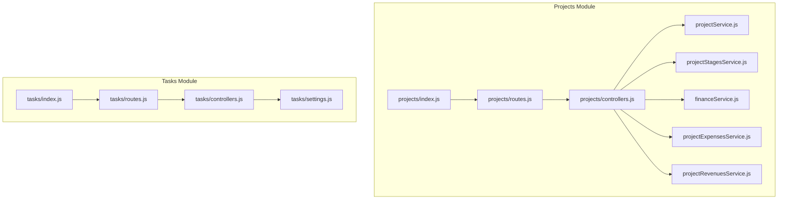
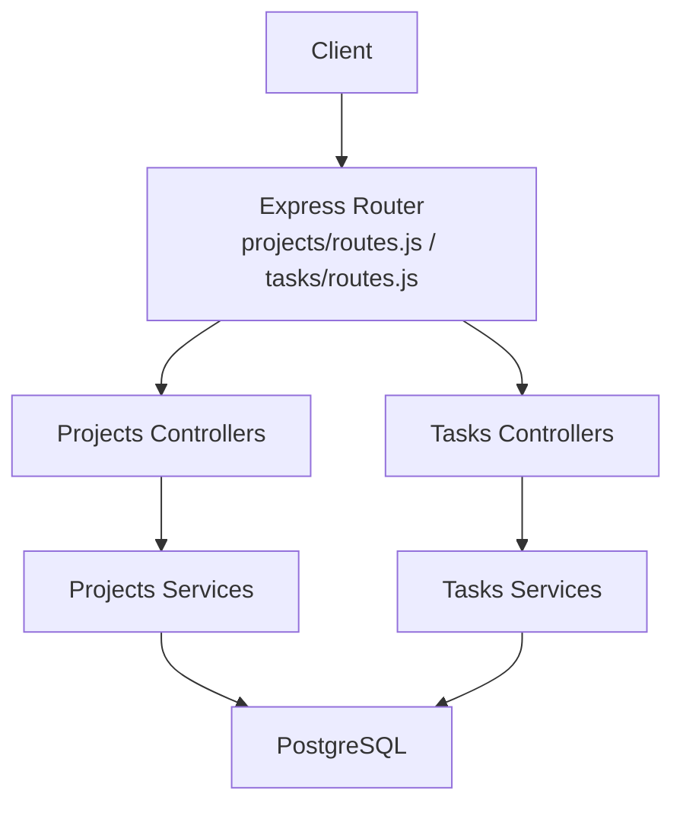
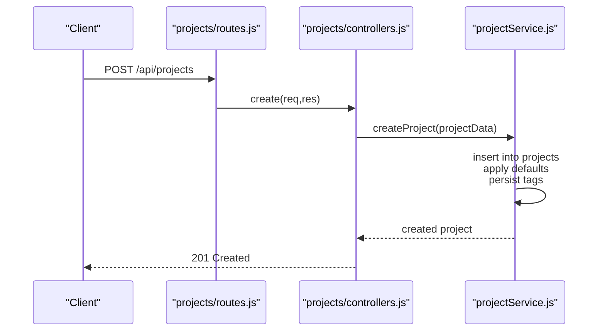
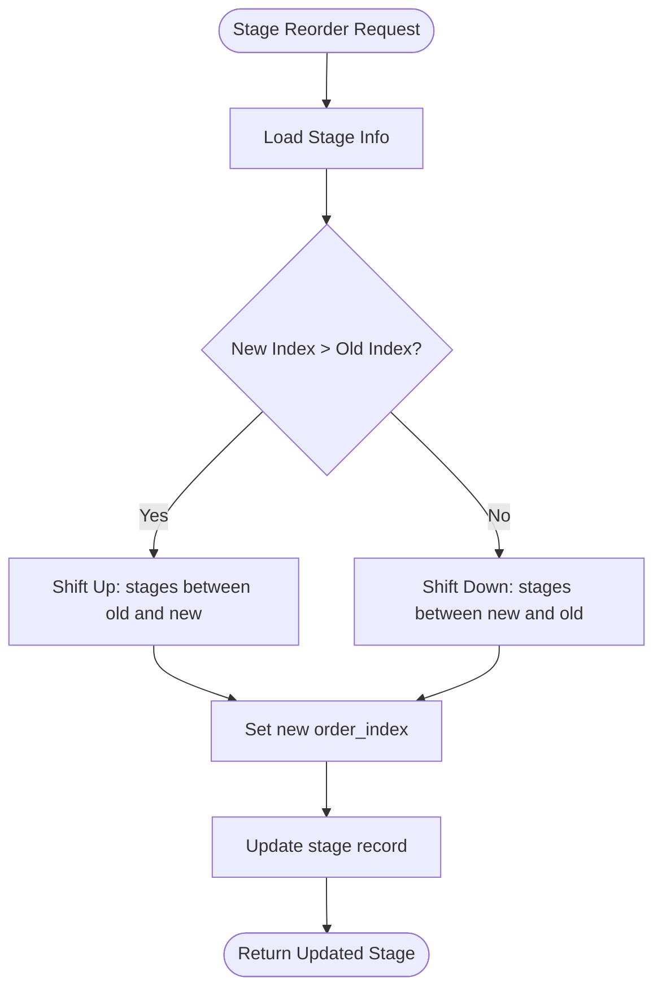
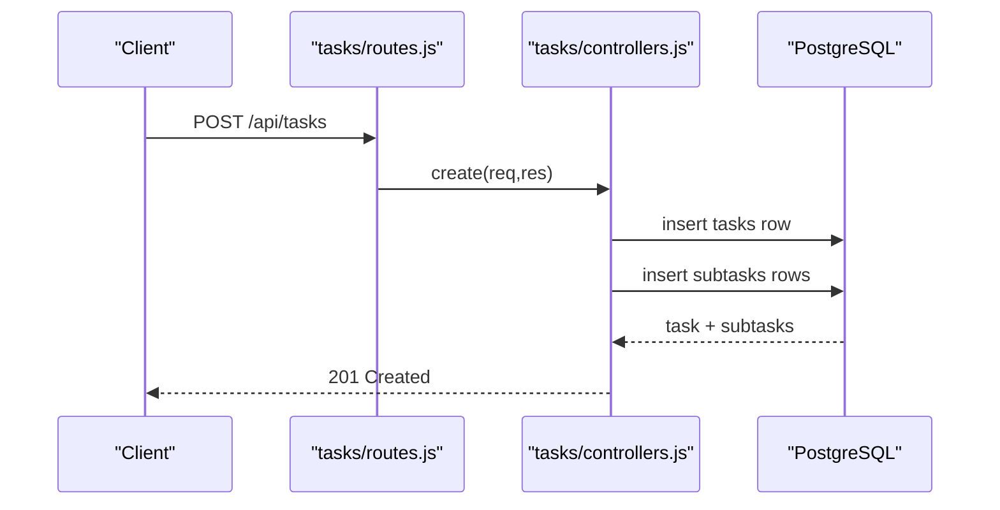
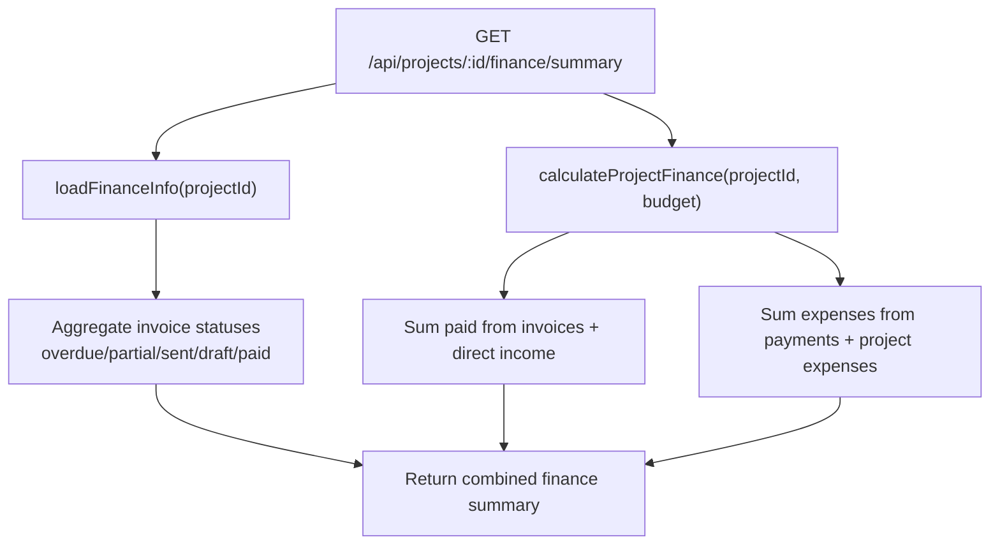
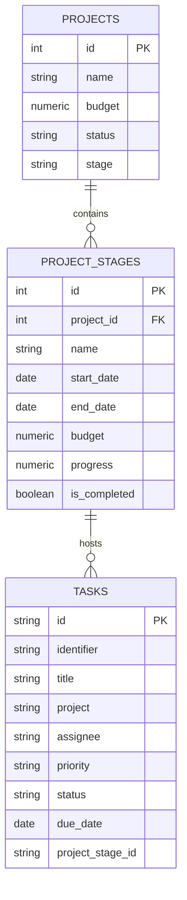
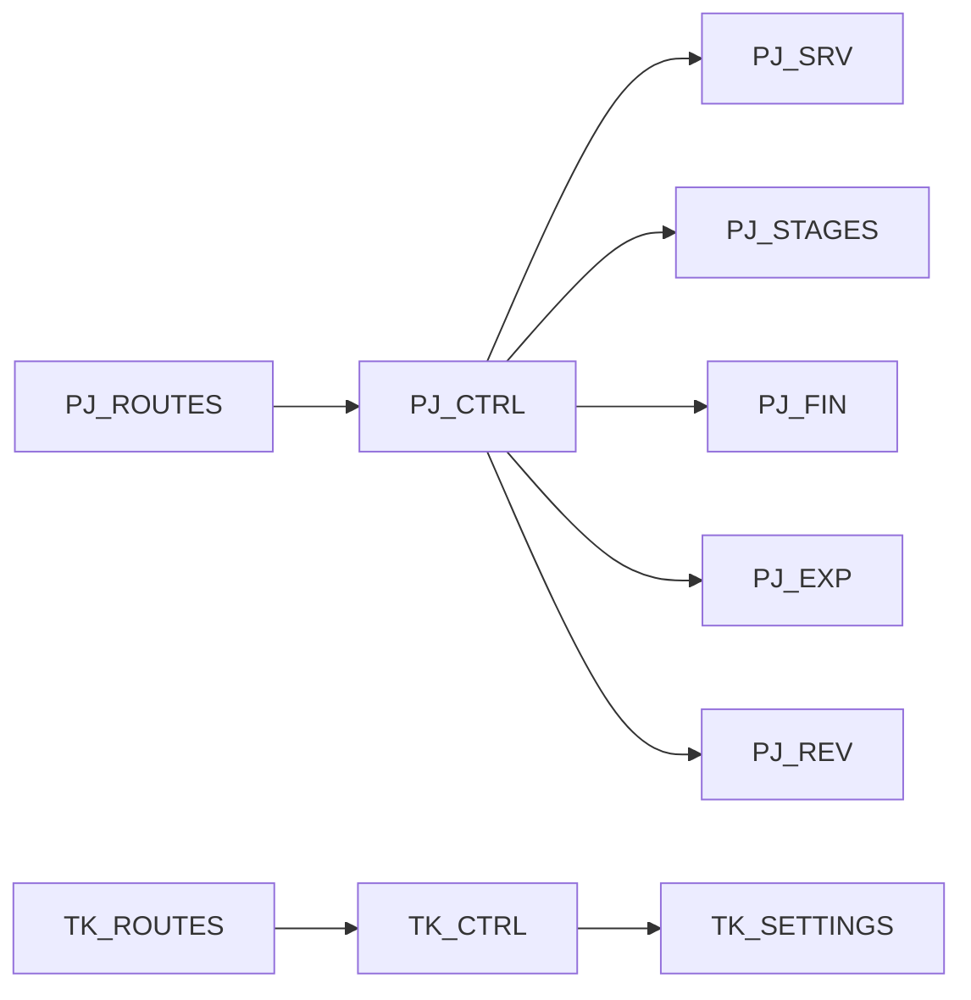

# Projects & Tasks Module

<cite>
**Referenced Files in This Document**
- [backend/modules/projects/index.js](file://backend/modules/projects/index.js)
- [backend/modules/projects/routes.js](file://backend/modules/projects/routes.js)
- [backend/modules/projects/controllers.js](file://backend/modules/projects/controllers.js)
- [backend/modules/projects/services/projectService.js](file://backend/modules/projects/services/projectService.js)
- [backend/modules/projects/services/projectStagesService.js](file://backend/modules/projects/services/projectStagesService.js)
- [backend/modules/projects/services/financeService.js](file://backend/modules/projects/services/financeService.js)
- [backend/modules/projects/services/projectExpensesService.js](file://backend/modules/projects/services/projectExpensesService.js)
- [backend/modules/projects/services/projectRevenuesService.js](file://backend/modules/projects/services/projectRevenuesService.js)
- [backend/modules/tasks/index.js](file://backend/modules/tasks/index.js)
- [backend/modules/tasks/routes.js](file://backend/modules/tasks/routes.js)
- [backend/modules/tasks/controllers.js](file://backend/modules/tasks/controllers.js)
- [backend/modules/tasks/settings.js](file://backend/modules/tasks/settings.js)
- [backend/modules/projects/settings.js](file://backend/modules/projects/settings.js)
</cite>

## Table of Contents
1. [Introduction](#introduction)
2. [Project Structure](#project-structure)
3. [Core Components](#core-components)
4. [Architecture Overview](#architecture-overview)
5. [Detailed Component Analysis](#detailed-component-analysis)
6. [Dependency Analysis](#dependency-analysis)
7. [Performance Considerations](#performance-considerations)
8. [Troubleshooting Guide](#troubleshooting-guide)
9. [Conclusion](#conclusion)
10. [Appendices](#appendices)

## Introduction
This document describes the Projects & Tasks module of the Titan CRM platform. It covers project lifecycle management, phase tracking, resource and timeline management, task assignment workflows, dependency handling, progress tracking, and financial tracking (budgets, expenses, revenues). It also explains integrations with calendar events, contractor management, and financial reporting. Practical examples illustrate typical workflows such as setting up a project, assigning tasks, and managing timelines.

## Project Structure
The Projects module is organized around a set of REST endpoints grouped by functional area:
- Core project CRUD and statistics
- Project stages (phases) with ordering and completion
- Payment schedule management
- Project revenues and expenses
- Financial analytics (P&L, summaries, taxes)

The Tasks module provides task CRUD, statistics, and Kanban-style views. Both modules expose typed settings for UI behavior and feature toggles.

**Diagram sources**
- [backend/modules/projects/index.js:1-14](file://backend/modules/projects/index.js#L1-L13)
- [backend/modules/projects/routes.js:1-168](file://backend/modules/projects/routes.js#L1-L168)
- [backend/modules/projects/controllers.js:1-201](file://backend/modules/projects/controllers.js#L1-L201)
- [backend/modules/projects/services/projectService.js:1-334](file://backend/modules/projects/services/projectService.js#L1-L334)
- [backend/modules/projects/services/projectStagesService.js:1-369](file://backend/modules/projects/services/projectStagesService.js#L1-L368)
- [backend/modules/projects/services/financeService.js:1-204](file://backend/modules/projects/services/financeService.js#L1-L203)
- [backend/modules/projects/services/projectExpensesService.js:1-324](file://backend/modules/projects/services/projectExpensesService.js#L1-L323)
- [backend/modules/projects/services/projectRevenuesService.js:1-288](file://backend/modules/projects/services/projectRevenuesService.js#L1-L288)
- [backend/modules/tasks/index.js:1-14](file://backend/modules/tasks/index.js#L1-L13)
- [backend/modules/tasks/routes.js:1-28](file://backend/modules/tasks/routes.js#L1-L28)
- [backend/modules/tasks/controllers.js:1-207](file://backend/modules/tasks/controllers.js#L1-L207)
- [backend/modules/tasks/settings.js:1-23](file://backend/modules/tasks/settings.js#L1-L22)

**Section sources**
- [backend/modules/projects/index.js:1-14](file://backend/modules/projects/index.js#L1-L13)
- [backend/modules/projects/routes.js:1-168](file://backend/modules/projects/routes.js#L1-L168)
- [backend/modules/tasks/index.js:1-14](file://backend/modules/tasks/index.js#L1-L13)
- [backend/modules/tasks/routes.js:1-28](file://backend/modules/tasks/routes.js#L1-L28)

## Core Components
- Projects module
  - Controllers: HTTP handlers delegating to services
  - Services: Business logic for projects, stages, finances, expenses, revenues
  - Routes: REST endpoints for projects, stages, payment schedules, revenues, expenses, and financial analytics
  - Settings: UI display defaults and feature flags
- Tasks module
  - Controllers: Task CRUD, statistics, and subtasks support
  - Routes: Task endpoints
  - Settings: UI display defaults and feature flags

Key capabilities:
- Project creation, updates, bulk updates, completion, archiving
- Stage-based phase tracking with ordering, completion, and summary
- Revenue and expense tracking with approvals and payments
- Financial analytics: P&L, summaries, taxes
- Task assignment, priorities, due dates, subtasks, and statistics

**Section sources**
- [backend/modules/projects/controllers.js:1-201](file://backend/modules/projects/controllers.js#L1-L201)
- [backend/modules/projects/services/projectService.js:1-334](file://backend/modules/projects/services/projectService.js#L1-L334)
- [backend/modules/projects/services/projectStagesService.js:1-369](file://backend/modules/projects/services/projectStagesService.js#L1-L368)
- [backend/modules/projects/services/projectExpensesService.js:1-324](file://backend/modules/projects/services/projectExpensesService.js#L1-L323)
- [backend/modules/projects/services/projectRevenuesService.js:1-288](file://backend/modules/projects/services/projectRevenuesService.js#L1-L288)
- [backend/modules/projects/services/financeService.js:1-204](file://backend/modules/projects/services/financeService.js#L1-L203)
- [backend/modules/projects/settings.js:1-26](file://backend/modules/projects/settings.js#L1-L25)
- [backend/modules/tasks/controllers.js:1-207](file://backend/modules/tasks/controllers.js#L1-L207)
- [backend/modules/tasks/settings.js:1-23](file://backend/modules/tasks/settings.js#L1-L22)

## Architecture Overview
The module follows a layered architecture:
- HTTP layer: Express routes and controllers
- Service layer: Business logic and data transformations
- Persistence: PostgreSQL queries via a shared database client

**Diagram sources**
- [backend/modules/projects/routes.js:1-168](file://backend/modules/projects/routes.js#L1-L168)
- [backend/modules/tasks/routes.js:1-28](file://backend/modules/tasks/routes.js#L1-L28)
- [backend/modules/projects/controllers.js:1-201](file://backend/modules/projects/controllers.js#L1-L201)
- [backend/modules/tasks/controllers.js:1-207](file://backend/modules/tasks/controllers.js#L1-L207)
- [backend/modules/projects/services/projectService.js:1-334](file://backend/modules/projects/services/projectService.js#L1-L334)
- [backend/modules/projects/services/projectStagesService.js:1-369](file://backend/modules/projects/services/projectStagesService.js#L1-L368)
- [backend/modules/projects/services/financeService.js:1-204](file://backend/modules/projects/services/financeService.js#L1-L203)
- [backend/modules/projects/services/projectExpensesService.js:1-324](file://backend/modules/projects/services/projectExpensesService.js#L1-L323)
- [backend/modules/projects/services/projectRevenuesService.js:1-288](file://backend/modules/projects/services/projectRevenuesService.js#L1-L288)
- [backend/modules/tasks/controllers.js:1-207](file://backend/modules/tasks/controllers.js#L1-L207)

## Detailed Component Analysis

### Projects Module

#### Project Lifecycle Management
- Endpoints: GET /api/projects, GET /api/projects/:id, POST /api/projects, PUT /api/projects/:id, DELETE /api/projects/:id
- Bulk operations: POST /api/projects/bulk-update
- Lifecycle actions: POST /api/projects/:id/complete, POST /api/projects/:id/archive
- Statistics: GET /api/projects/stats

Implementation highlights:
- Controllers delegate to projectService for all operations
- projectService handles data transformation, tags, and financial aggregation for lists and single records
- Completion/archival updates status and stage accordingly

**Diagram sources**
- [backend/modules/projects/routes.js:27-28](file://backend/modules/projects/routes.js#L27-L28)
- [backend/modules/projects/controllers.js:80-89](file://backend/modules/projects/controllers.js#L80-L89)
- [backend/modules/projects/services/projectService.js:140-184](file://backend/modules/projects/services/projectService.js#L140-L184)

**Section sources**
- [backend/modules/projects/controllers.js:1-201](file://backend/modules/projects/controllers.js#L1-L201)
- [backend/modules/projects/services/projectService.js:1-334](file://backend/modules/projects/services/projectService.js#L1-L334)

#### Phase Tracking (Project Stages)
- Endpoints: GET/POST/PUT/DELETE /api/projects/:id/stages, GET /api/projects/:id/stages/summary
- Stage operations: GET/PUT/DELETE /api/projects/:projectId/stages/:stageId, POST /api/projects/:projectId/stages/:stageId/complete, POST /api/projects/:projectId/stages/:stageId/reorder
- Stage model includes dates, budget, progress, responsible user, color, and embedded tasks

**Diagram sources**
- [backend/modules/projects/services/projectStagesService.js:283-308](file://backend/modules/projects/services/projectStagesService.js#L283-L308)

**Section sources**
- [backend/modules/projects/routes.js:49-71](file://backend/modules/projects/routes.js#L49-L71)
- [backend/modules/projects/services/projectStagesService.js:1-369](file://backend/modules/projects/services/projectStagesService.js#L1-L368)

#### Resource Allocation and Timeline Management
- Stages include planned and actual start/end dates, progress, and responsible user
- Stages summary aggregates earliest start, latest end, and budget metrics
- Tasks can be associated with stages via project_stage_id, enabling timeline alignment

Integration points:
- Tasks query includes stage tasks in stage retrieval
- Stage completion auto-records completion timestamp

**Section sources**
- [backend/modules/projects/services/projectStagesService.js:56-108](file://backend/modules/projects/services/projectStagesService.js#L56-L108)
- [backend/modules/tasks/controllers.js:16-19](file://backend/modules/tasks/controllers.js#L16-L19)

#### Task Assignment Workflows and Dependencies
- Tasks support assignees, priorities, due dates, and subtasks
- Subtasks are loaded per-task and updated atomically during task updates
- Tasks can be linked to stages, enabling dependency alignment with project phases

**Diagram sources**
- [backend/modules/tasks/routes.js:18-19](file://backend/modules/tasks/routes.js#L18-L19)
- [backend/modules/tasks/controllers.js:63-108](file://backend/modules/tasks/controllers.js#L63-L108)

**Section sources**
- [backend/modules/tasks/controllers.js:1-207](file://backend/modules/tasks/controllers.js#L1-L207)
- [backend/modules/tasks/settings.js:1-23](file://backend/modules/tasks/settings.js#L1-L22)

#### Progress Tracking
- Stage progress is maintained as a percentage and can be completed automatically
- Project statistics include total and completed tasks with computed completion rate
- Task statistics include counts by status and priority, and overdue count

**Section sources**
- [backend/modules/projects/services/projectStagesService.js:264-275](file://backend/modules/projects/services/projectStagesService.js#L264-L275)
- [backend/modules/projects/services/projectService.js:96-133](file://backend/modules/projects/services/projectService.js#L96-L133)
- [backend/modules/tasks/controllers.js:169-197](file://backend/modules/tasks/controllers.js#L169-L197)

#### Milestone Management
- Milestones feature is enabled in project settings
- Stages can act as milestones with planned/actual dates and completion timestamps

**Section sources**
- [backend/modules/projects/settings.js:12-20](file://backend/modules/projects/settings.js#L12-L20)

#### Calendar Integration
- Calendar module exists and is integrated with other modules
- While explicit calendar event creation endpoints are not present in the Projects module, tasks and stages can be aligned with calendar events via external integration

**Section sources**
- [backend/modules/calendar/index.js](file://backend/modules/calendar/index.js)

#### Contractor Management
- Expenses and revenues can be linked to contractors
- Expense categories are sourced from finance expense categories
- VAT-aware revenue tracking supports contractor tax regimes

**Section sources**
- [backend/modules/projects/services/projectExpensesService.js:291-311](file://backend/modules/projects/services/projectExpensesService.js#L291-L311)
- [backend/modules/projects/services/projectRevenuesService.js:1-288](file://backend/modules/projects/services/projectRevenuesService.js#L1-L288)

#### Financial Reporting
- P&L report endpoint: GET /api/projects/:id/pnl
- Finance summary: GET /api/projects/:id/finance/summary
- Taxes calculation: GET /api/projects/:id/finance/taxes
- Finance analytics combine invoice, payment, and project-level revenue/expense data

**Diagram sources**
- [backend/modules/projects/services/financeService.js:115-125](file://backend/modules/projects/services/financeService.js#L115-L125)

**Section sources**
- [backend/modules/projects/routes.js:158-166](file://backend/modules/projects/routes.js#L158-L166)
- [backend/modules/projects/services/financeService.js:1-204](file://backend/modules/projects/services/financeService.js#L1-L203)

### Tasks Module

#### Task CRUD and Statistics
- Endpoints mirror standard CRUD plus statistics
- Statistics include totals, completion/in-progress/todo counts, priority breakdown, and overdue tasks

**Section sources**
- [backend/modules/tasks/routes.js:1-28](file://backend/modules/tasks/routes.js#L1-L28)
- [backend/modules/tasks/controllers.js:169-197](file://backend/modules/tasks/controllers.js#L169-L197)

#### Subtasks and Dependencies
- Subtasks are stored in a separate table and reloaded with each task
- Updates replace subtasks per atomic update semantics
- Dependencies can be modeled by linking tasks to stages and enforcing stage completion sequences

**Section sources**
- [backend/modules/tasks/controllers.js:16-19](file://backend/modules/tasks/controllers.js#L16-L19)
- [backend/modules/tasks/controllers.js:137-147](file://backend/modules/tasks/controllers.js#L137-L147)

### Integration Between Projects and Tasks
- Tasks can reference a project stage, enabling cascade updates when stages change
- Stage completion and progress feed into project-level summaries
- Finance data aggregates across tasks via stage associations and project-level revenue/expense records

**Diagram sources**
- [backend/modules/projects/services/projectStagesService.js:61-104](file://backend/modules/projects/services/projectStagesService.js#L61-L104)
- [backend/modules/tasks/controllers.js:75-90](file://backend/modules/tasks/controllers.js#L75-L90)

## Dependency Analysis
- Controllers depend on services for business logic
- Services depend on shared database client and date helpers
- Routes define the contract for clients
- Settings influence UI behavior and feature availability

**Diagram sources**
- [backend/modules/projects/routes.js:1-168](file://backend/modules/projects/routes.js#L1-L168)
- [backend/modules/projects/controllers.js:1-201](file://backend/modules/projects/controllers.js#L1-L201)
- [backend/modules/projects/services/projectService.js:1-334](file://backend/modules/projects/services/projectService.js#L1-L334)
- [backend/modules/projects/services/projectStagesService.js:1-369](file://backend/modules/projects/services/projectStagesService.js#L1-L368)
- [backend/modules/projects/services/financeService.js:1-204](file://backend/modules/projects/services/financeService.js#L1-L203)
- [backend/modules/projects/services/projectExpensesService.js:1-324](file://backend/modules/projects/services/projectExpensesService.js#L1-L323)
- [backend/modules/projects/services/projectRevenuesService.js:1-288](file://backend/modules/projects/services/projectRevenuesService.js#L1-L288)
- [backend/modules/tasks/routes.js:1-28](file://backend/modules/tasks/routes.js#L1-L28)
- [backend/modules/tasks/controllers.js:1-207](file://backend/modules/tasks/controllers.js#L1-L207)
- [backend/modules/tasks/settings.js:1-23](file://backend/modules/tasks/settings.js#L1-L22)

**Section sources**
- [backend/modules/projects/settings.js:1-26](file://backend/modules/projects/settings.js#L1-L25)
- [backend/modules/tasks/settings.js:1-23](file://backend/modules/tasks/settings.js#L1-L22)

## Performance Considerations
- Project lists load finance summaries and tags in batch to minimize round-trips
- Stage queries embed task lists; consider pagination or lazy loading for large stages
- Finance calculations aggregate across multiple tables; ensure appropriate indexing on foreign keys and status fields
- Task updates delete and re-insert subtasks; for very large subtask sets, consider incremental updates

## Troubleshooting Guide
Common issues and resolutions:
- Validation errors on project/task creation: ensure required fields are provided and formatted correctly
- Stage reorder anomalies: verify order indices and handle concurrent reorders
- Finance summary discrepancies: confirm invoice/payment linkage and stage associations
- Overdue tasks: review due dates and status transitions

**Section sources**
- [backend/modules/projects/controllers.js:80-89](file://backend/modules/projects/controllers.js#L80-L89)
- [backend/modules/tasks/controllers.js:63-108](file://backend/modules/tasks/controllers.js#L63-L108)
- [backend/modules/projects/services/projectStagesService.js:283-308](file://backend/modules/projects/services/projectStagesService.js#L283-L308)
- [backend/modules/projects/services/financeService.js:56-107](file://backend/modules/projects/services/financeService.js#L56-L107)

## Conclusion
The Projects & Tasks module provides a comprehensive foundation for project lifecycle management, phase tracking, resource and timeline alignment, task assignment, and financial oversight. Its modular design enables clear separation of concerns, while integrations with finance and contractor systems support robust project accounting. The included settings and statistics facilitate flexible UI experiences and data-driven insights.

## Appendices

### Practical Examples

- Project setup
  - Create a project with budget, deadline, and tags
  - Add stages with planned start/end dates and budgets
  - Assign tasks to stages and set priorities/due dates
  - Monitor completion via stage progress and project stats

- Task assignment workflow
  - Create a task with assignee and due date
  - Optionally add subtasks
  - Update task to link to a stage for timeline alignment
  - Track completion and overdue status via statistics

- Timeline management scenario
  - Reorder stages to reflect schedule changes
  - Update stage dates and progress
  - Link tasks to stages to cascade updates and visibility

- Financial tracking
  - Record project revenues with VAT-aware calculations
  - Approve and pay project expenses
  - Generate finance summaries and P&L reports
  - Monitor budget utilization and overdue invoices

[No sources needed since this section provides practical guidance without analyzing specific files]