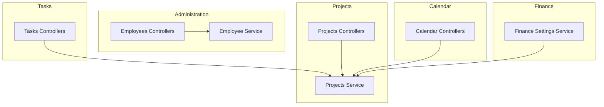
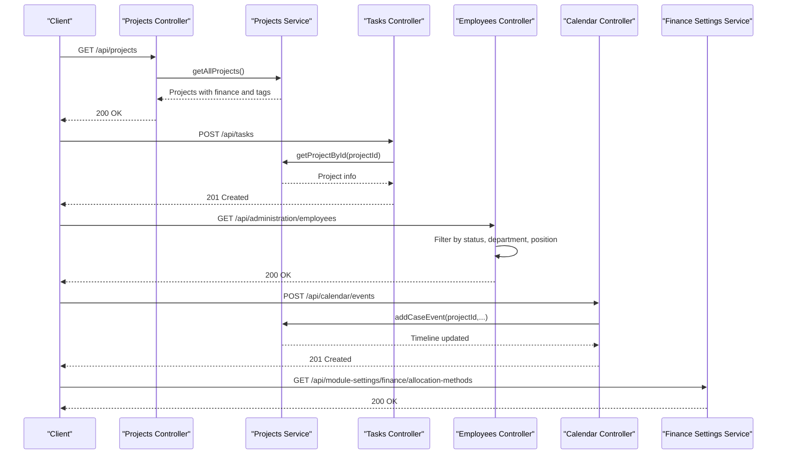
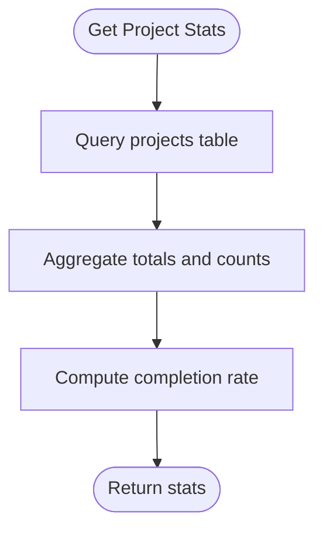
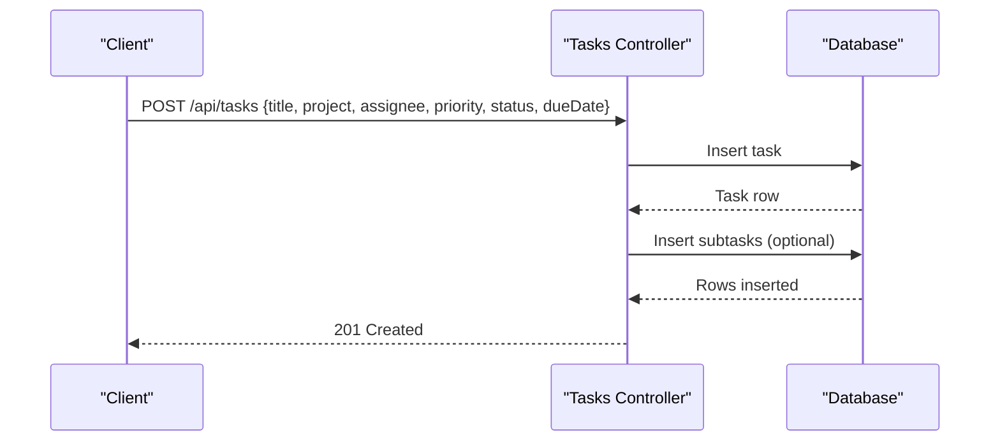
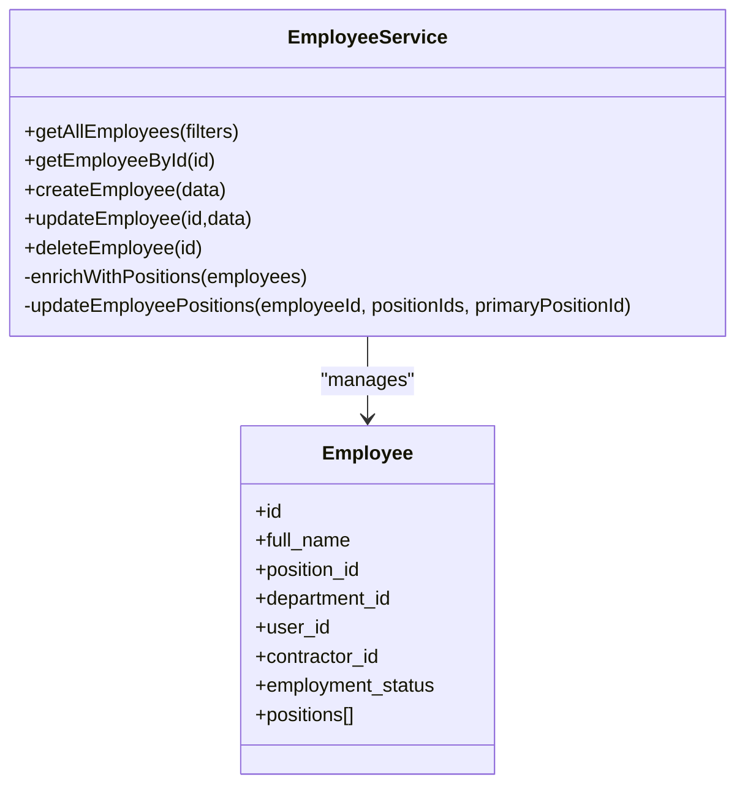
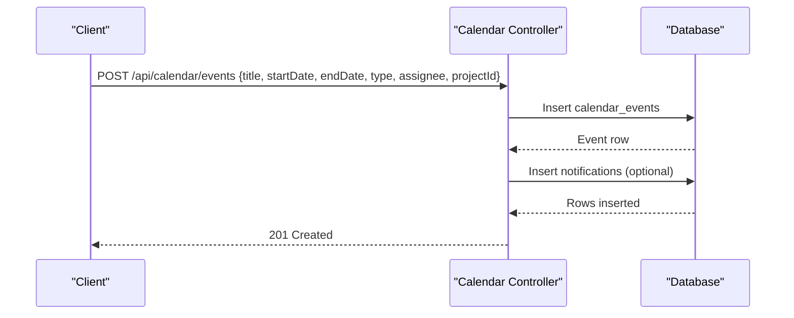
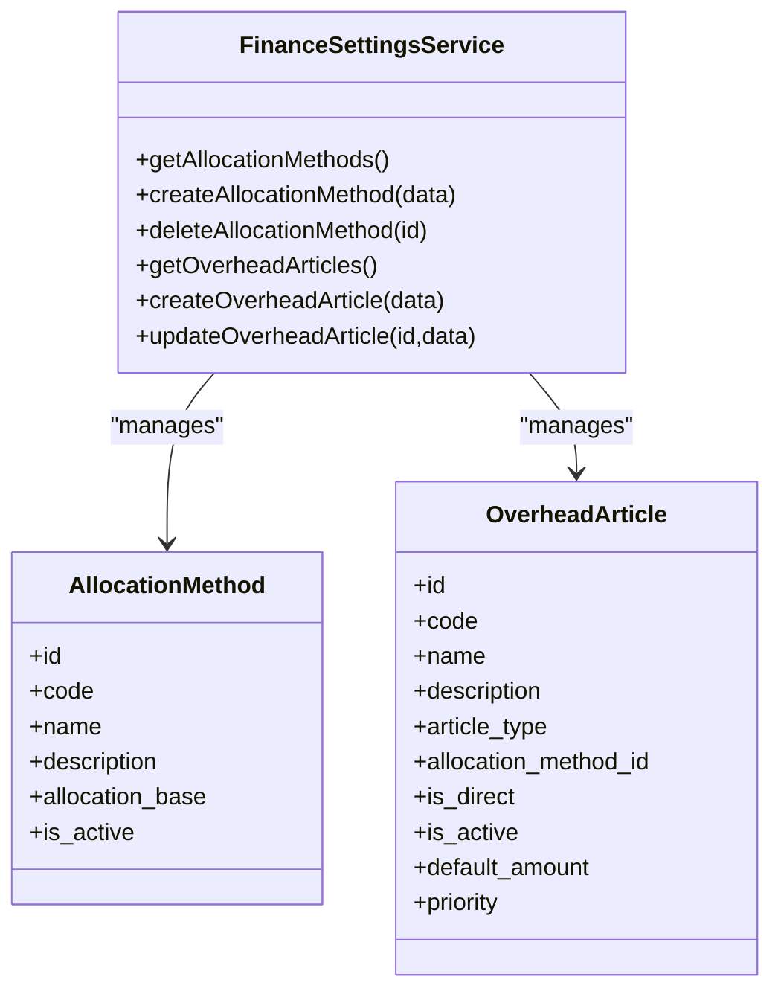
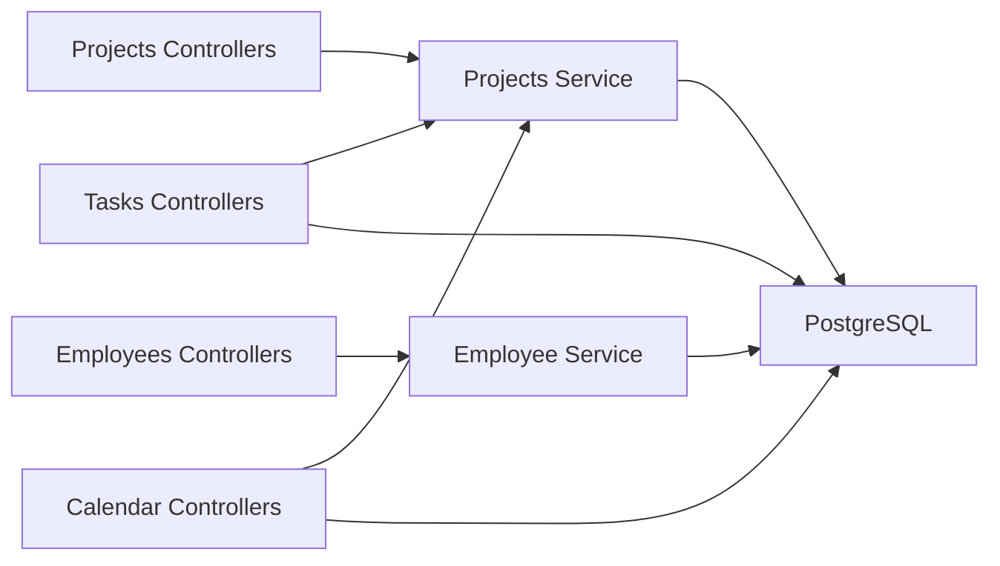

# Resource Allocation

<cite>
**Referenced Files in This Document**
- [controllers.js](file://backend/modules/projects/controllers.js)
- [projectService.js](file://backend/modules/projects/services/projectService.js)
- [controllers.js](file://backend/modules/tasks/controllers.js)
- [controllers.js](file://backend/modules/administration/controllers/employees.js)
- [employeeService.js](file://backend/modules/administration/services/employeeService.js)
- [controllers.js](file://backend/modules/calendar/controllers.js)
- [financeSettingsService.js](file://backend/modules/finance/services/financeSettingsService.js)
- [01_create_projects_table.md](file://backend/migrations/01_create_projects_table.md)
- [04_create_tasks_table.md](file://backend/migrations/04_create_tasks_table.md)
- [10_create_calendar_events_table.md](file://backend/migrations/10_create_calendar_events_table.md)
- [57_add_contractor_id_to_employees.sql](file://backend/migrations/57_add_contractor_id_to_employees.sql)
- [ProjectResources.tsx](file://frontend/coverage/src/modules/projects/components/ProjectResources.tsx.html)
</cite>

## Table of Contents
1. [Introduction](#introduction)
2. [Project Structure](#project-structure)
3. [Core Components](#core-components)
4. [Architecture Overview](#architecture-overview)
5. [Detailed Component Analysis](#detailed-component-analysis)
6. [Dependency Analysis](#dependency-analysis)
7. [Performance Considerations](#performance-considerations)
8. [Troubleshooting Guide](#troubleshooting-guide)
9. [Conclusion](#conclusion)
10. [Appendices](#appendices)

## Introduction
This document describes the Resource Allocation system in Titan CRM. It explains how team members, tasks, and calendar events are coordinated to support capacity planning, workload balancing, and conflict-free scheduling. It also covers integration with employee and contractor databases, resource utilization tracking, and practical scenarios for allocation and optimization.

## Project Structure
The Resource Allocation capability spans several modules:
- Projects: project lifecycle, statistics, and financial context
- Tasks: assignment of work items to team members
- Administration: employee records, positions, and user synchronization
- Calendar: scheduling events and availability alignment
- Finance: allocation methods and overhead articles used for cost distribution

**Diagram sources**
- [controllers.js:1-201](file://backend/modules/projects/controllers.js#L1-L201)
- [projectService.js:1-334](file://backend/modules/projects/services/projectService.js#L1-L334)
- [controllers.js:1-207](file://backend/modules/tasks/controllers.js#L1-L207)
- [controllers.js:1-64](file://backend/modules/administration/controllers/employees.js#L1-L63)
- [employeeService.js:1-306](file://backend/modules/administration/services/employeeService.js#L1-L305)
- [controllers.js:1-312](file://backend/modules/calendar/controllers.js#L1-L311)
- [financeSettingsService.js:633-690](file://backend/modules/finance/services/financeSettingsService.js#L633-L690)

**Section sources**
- [controllers.js:1-201](file://backend/modules/projects/controllers.js#L1-L201)
- [projectService.js:1-334](file://backend/modules/projects/services/projectService.js#L1-L334)
- [controllers.js:1-207](file://backend/modules/tasks/controllers.js#L1-L207)
- [controllers.js:1-64](file://backend/modules/administration/controllers/employees.js#L1-L63)
- [employeeService.js:1-306](file://backend/modules/administration/services/employeeService.js#L1-L305)
- [controllers.js:1-312](file://backend/modules/calendar/controllers.js#L1-L311)
- [financeSettingsService.js:633-690](file://backend/modules/finance/services/financeSettingsService.js#L633-L690)

## Core Components
- Projects module: manages project metadata, status, stages, priorities, budgets, and counts. Provides statistics and CRUD operations.
- Tasks module: handles task creation, updates, deletion, and statistics, including due dates and assignees.
- Administration module: maintains employee records, positions, departments, and links to users and contractors.
- Calendar module: schedules events, assigns participants, and supports notifications and follow-up tasks.
- Finance module: defines allocation methods and overhead articles used for distributing costs across projects.

Key capabilities:
- Team member allocation via task assignees and calendar events
- Equipment scheduling via calendar events linked to projects
- Contractor resource management via contractor tables and employee-contractor linkage
- Capacity planning via project statistics and task counts
- Conflict detection via calendar event overlaps and task assignments
- Cost allocation via finance allocation methods and overhead articles

**Section sources**
- [projectService.js:48-133](file://backend/modules/projects/services/projectService.js#L48-L133)
- [controllers.js:26-197](file://backend/modules/tasks/controllers.js#L26-L197)
- [employeeService.js:68-110](file://backend/modules/administration/services/employeeService.js#L68-L110)
- [controllers.js:56-186](file://backend/modules/calendar/controllers.js#L56-L186)
- [financeSettingsService.js:652-689](file://backend/modules/finance/services/financeSettingsService.js#L652-L689)

## Architecture Overview
The Resource Allocation system orchestrates data from Projects, Tasks, Administration, Calendar, and Finance modules. Controllers expose REST endpoints; services encapsulate business logic and database interactions; migrations define the underlying schema.

**Diagram sources**
- [controllers.js:15-23](file://backend/modules/projects/controllers.js#L15-L23)
- [projectService.js:48-71](file://backend/modules/projects/services/projectService.js#L48-L71)
- [controllers.js:63-108](file://backend/modules/tasks/controllers.js#L63-L108)
- [controllers.js:13-16](file://backend/modules/administration/controllers/employees.js#L13-L16)
- [controllers.js:112-186](file://backend/modules/calendar/controllers.js#L112-L186)
- [financeSettingsService.js:319-327](file://backend/modules/finance/services/financeSettingsService.js#L319-L327)

## Detailed Component Analysis

### Projects Module
- Responsibilities: CRUD for projects, statistics aggregation, and enrichment with finance and tags.
- Capacity planning: Uses project counts and budget fields to compute utilization and completion rates.
- Integration: Supplies project context to tasks and calendar events.

**Diagram sources**
- [projectService.js:96-133](file://backend/modules/projects/services/projectService.js#L96-L133)

**Section sources**
- [controllers.js:15-49](file://backend/modules/projects/controllers.js#L15-L49)
- [projectService.js:48-133](file://backend/modules/projects/services/projectService.js#L48-L133)
- [01_create_projects_table.md:8-22](file://backend/migrations/01_create_projects_table.md#L8-L22)

### Tasks Module
- Responsibilities: Manage tasks and subtasks, assignees, priorities, statuses, due dates, and statistics.
- Resource allocation: Assigns team members to tasks; supports workload balancing via statistics.
- Conflict resolution: Overlapping assignments can be detected by querying assignees and due dates.

**Diagram sources**
- [controllers.js:63-108](file://backend/modules/tasks/controllers.js#L63-L108)

**Section sources**
- [controllers.js:26-197](file://backend/modules/tasks/controllers.js#L26-L197)
- [04_create_tasks_table.md:8-18](file://backend/migrations/04_create_tasks_table.md#L8-L18)

### Administration Module (Employees)
- Responsibilities: Retrieve employees, enrich with positions and departments, and synchronize with users and contractors.
- Integration: Links employees to contractors and users, enabling unified resource management.

**Diagram sources**
- [employeeService.js:68-110](file://backend/modules/administration/services/employeeService.js#L68-L110)
- [employeeService.js:140-205](file://backend/modules/administration/services/employeeService.js#L140-L205)

**Section sources**
- [controllers.js:13-55](file://backend/modules/administration/controllers/employees.js#L13-L55)
- [employeeService.js:68-110](file://backend/modules/administration/services/employeeService.js#L68-L110)
- [employeeService.js:140-205](file://backend/modules/administration/services/employeeService.js#L140-L205)
- [57_add_contractor_id_to_employees.sql:7-21](file://backend/migrations/57_add_contractor_id_to_employees.sql#L7-L21)

### Calendar Module (Equipment Scheduling)
- Responsibilities: Create, update, and delete calendar events; link to projects and assignees; manage notifications.
- Equipment scheduling: Events can represent equipment reservations; assignees can represent equipment identifiers.

**Diagram sources**
- [controllers.js:112-186](file://backend/modules/calendar/controllers.js#L112-L186)
- [10_create_calendar_events_table.md:8-31](file://backend/migrations/10_create_calendar_events_table.md#L8-L31)

**Section sources**
- [controllers.js:56-186](file://backend/modules/calendar/controllers.js#L56-L186)
- [10_create_calendar_events_table.md:8-31](file://backend/migrations/10_create_calendar_events_table.md#L8-L31)

### Finance Module (Allocation Methods)
- Responsibilities: Define allocation methods and overhead articles used for distributing costs across projects.
- Practical use: Allocation methods inform how overhead costs are attributed to projects and tasks.

**Diagram sources**
- [financeSettingsService.js:652-689](file://backend/modules/finance/services/financeSettingsService.js#L652-L689)
- [financeSettingsService.js:714-755](file://backend/modules/finance/services/financeSettingsService.js#L714-L745)

**Section sources**
- [financeSettingsService.js:633-690](file://backend/modules/finance/services/financeSettingsService.js#L633-L690)

### Frontend Resource Planning View
- The frontend includes a resource planning component that loads active employees and renders a grid for resource visualization. While the component is currently not active in the build, it demonstrates the intended integration with the employee endpoint.

**Section sources**
- [ProjectResources.tsx:330-343](file://frontend/coverage/src/modules/projects/components/ProjectResources.tsx.html#L330-L343)

## Dependency Analysis
- Controllers depend on services for business logic.
- Services query the database and coordinate with other modules (e.g., calendar timeline integration).
- Migrations define the schema for projects, tasks, calendar events, and employee-contractor linkage.

**Diagram sources**
- [controllers.js:15-23](file://backend/modules/projects/controllers.js#L15-L23)
- [projectService.js:48-71](file://backend/modules/projects/services/projectService.js#L48-L71)
- [controllers.js:26-35](file://backend/modules/tasks/controllers.js#L26-L35)
- [controllers.js:13-16](file://backend/modules/administration/controllers/employees.js#L13-L16)
- [employeeService.js:68-110](file://backend/modules/administration/services/employeeService.js#L68-L110)
- [controllers.js:61-82](file://backend/modules/calendar/controllers.js#L61-L82)

**Section sources**
- [01_create_projects_table.md:8-22](file://backend/migrations/01_create_projects_table.md#L8-L22)
- [04_create_tasks_table.md:8-18](file://backend/migrations/04_create_tasks_table.md#L8-L18)
- [10_create_calendar_events_table.md:8-31](file://backend/migrations/10_create_calendar_events_table.md#L8-L31)
- [57_add_contractor_id_to_employees.sql:7-21](file://backend/migrations/57_add_contractor_id_to_employees.sql#L7-L21)

## Performance Considerations
- Prefer filtered queries for employees and projects to reduce payload sizes.
- Use database indexes on frequently queried columns (e.g., assignee, project, status, dates).
- Batch operations for bulk updates to minimize round-trips.
- Cache static reference data (e.g., allocation methods, overhead articles) at the frontend when appropriate.

## Troubleshooting Guide
Common issues and resolutions:
- Calendar events table not found: The calendar controller gracefully returns empty lists or validation errors when the table is missing. Ensure the migration has been applied.
- Employee synchronization failures: Employee service logs warnings when optional tables are missing; verify schema consistency.
- Project statistics inconsistencies: Confirm that project counts and budgets are updated after task completions and financial changes.

**Section sources**
- [controllers.js:47-54](file://backend/modules/calendar/controllers.js#L47-L54)
- [employeeService.js:43-46](file://backend/modules/administration/services/employeeService.js#L43-L46)

## Conclusion
Titan CRM’s Resource Allocation system integrates projects, tasks, employees, calendar events, and finance settings to enable capacity planning, workload balancing, and conflict resolution. By leveraging assignees, calendar scheduling, and allocation methods, teams can track utilization, monitor availability, and optimize resource distribution across projects and equipment.

## Appendices

### API Endpoints Overview
- Projects
  - GET /api/projects
  - GET /api/projects/stats
  - GET /api/projects/:id
  - POST /api/projects
  - PUT /api/projects/:id
  - DELETE /api/projects/:id
  - POST /api/projects/bulk-update
  - POST /api/projects/:id/complete
  - POST /api/projects/:id/archive
- Tasks
  - GET /api/tasks
  - GET /api/tasks/:id
  - POST /api/tasks
  - PUT /api/tasks/:id
  - DELETE /api/tasks/:id
  - GET /api/tasks/stats
- Administration (Employees)
  - GET /api/administration/employees
  - GET /api/administration/employees/:id
  - POST /api/administration/employees
  - PUT /api/administration/employees/:id
  - DELETE /api/administration/employees/:id
- Calendar
  - GET /api/calendar/events
  - GET /api/calendar/events/:id
  - POST /api/calendar/events
  - PUT /api/calendar/events/:id
  - DELETE /api/calendar/events/:id
- Finance (Allocation Methods)
  - GET /api/module-settings/finance/allocation-methods
  - POST /api/module-settings/finance/allocation-methods
  - DELETE /api/module-settings/finance/allocation-methods/:id

**Section sources**
- [controllers.js:15-188](file://backend/modules/projects/controllers.js#L15-L188)
- [controllers.js:26-197](file://backend/modules/tasks/controllers.js#L26-L197)
- [controllers.js:13-55](file://backend/modules/administration/controllers/employees.js#L13-L55)
- [controllers.js:61-303](file://backend/modules/calendar/controllers.js#L61-L303)
- [financeSettingsService.js:319-360](file://backend/modules/finance/services/financeSettingsService.js#L319-L360)

### Practical Scenarios and Strategies
- Scenario: Team member allocation
  - Strategy: Use task assignees aligned with employee positions and departments. Monitor task statistics to balance workload.
  - Endpoint: POST /api/tasks
- Scenario: Equipment scheduling
  - Strategy: Create calendar events with equipment as assignee and link to project. Use notifications for reminders.
  - Endpoint: POST /api/calendar/events
- Scenario: Contractor resource management
  - Strategy: Sync contractor records with employees via contractor_id. Use contractor types and legal forms for categorization.
  - Endpoint: GET /api/administration/employees
- Scenario: Capacity planning
  - Strategy: Track project counts and completion rates; adjust priorities and stages accordingly.
  - Endpoint: GET /api/projects/stats
- Scenario: Conflict resolution
  - Strategy: Query overlapping calendar events and task assignments; re-schedule or re-assign resources.
  - Endpoint: GET /api/calendar/events, GET /api/tasks
- Scenario: Cost allocation optimization
  - Strategy: Select allocation methods and overhead articles to distribute costs fairly across projects.
  - Endpoint: GET /api/module-settings/finance/allocation-methods

**Section sources**
- [controllers.js:63-108](file://backend/modules/tasks/controllers.js#L63-L108)
- [controllers.js:112-186](file://backend/modules/calendar/controllers.js#L112-L186)
- [employeeService.js:68-110](file://backend/modules/administration/services/employeeService.js#L68-L110)
- [projectService.js:96-133](file://backend/modules/projects/services/projectService.js#L96-L133)
- [financeSettingsService.js:652-689](file://backend/modules/finance/services/financeSettingsService.js#L652-L689)