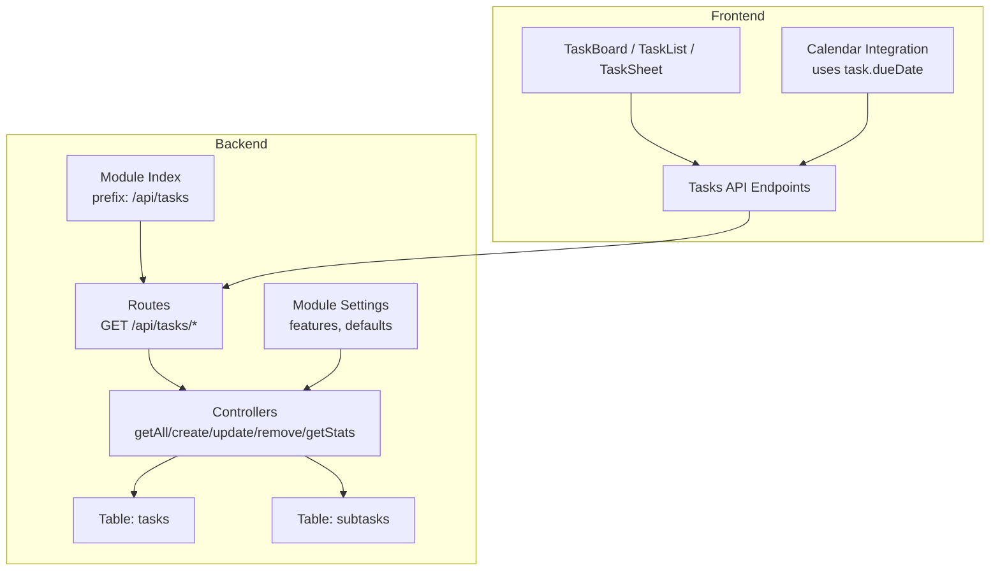
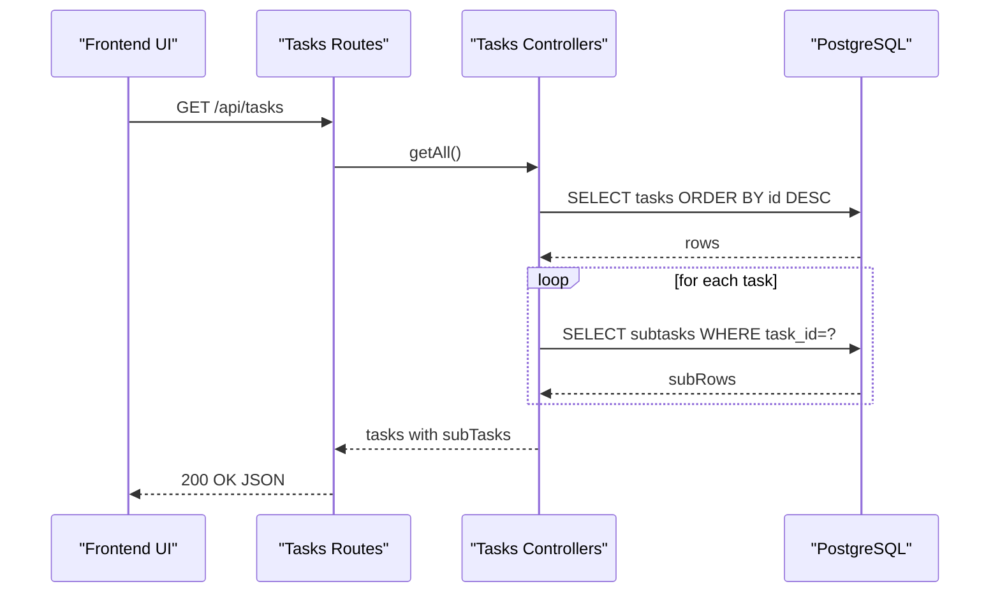
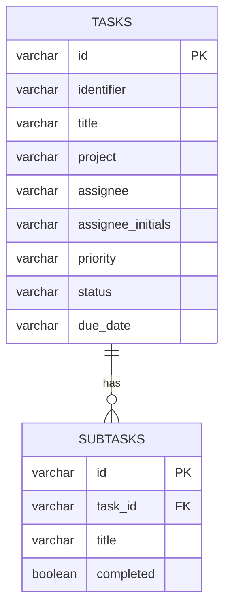
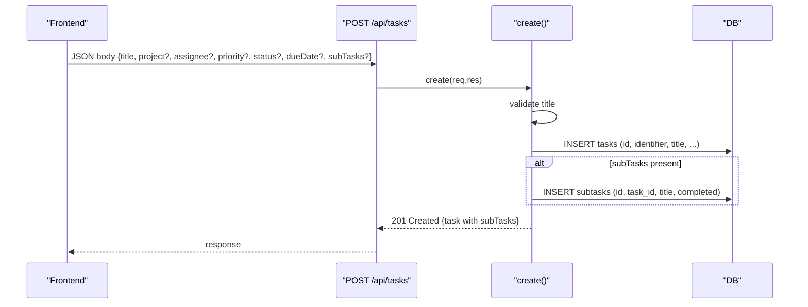
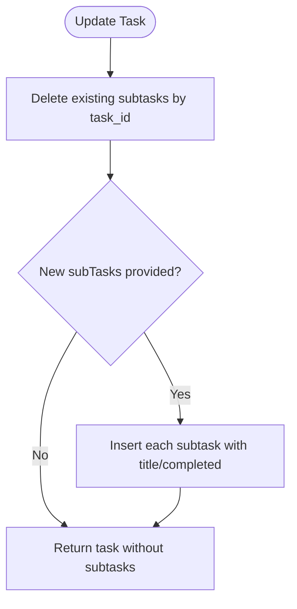
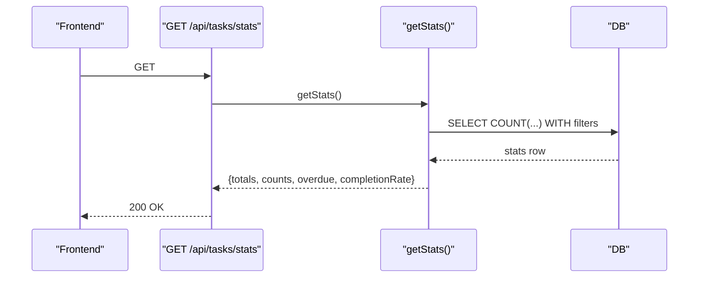
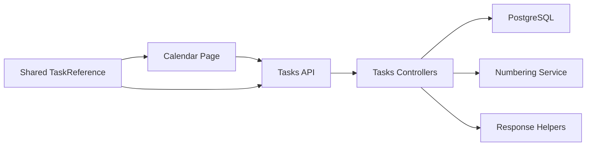

# Task Tracking

<cite>
**Referenced Files in This Document**
- [TASKS.md](file://docs/api/TASKS.md)
- [controllers.js](file://backend/modules/tasks/controllers.js)
- [routes.js](file://backend/modules/tasks/routes.js)
- [index.js](file://backend/modules/tasks/index.js)
- [settings.js](file://backend/modules/tasks/settings.js)
- [04_create_tasks_table.md](file://backend/migrations/04_create_tasks_table.md)
- [40_create_subtasks_table.md](file://backend/migrations/40_create_subtasks_table.md)
- [calendar/settings.js](file://backend/modules/calendar/settings.js)
- [Calendar.tsx](file://frontend/coverage/src/modules/calendar/pages/Calendar.tsx.html)
- [TaskBoard.tsx](file://frontend/coverage/src/modules/tasks/components/TaskBoard.tsx.html)
- [useTasksPage.ts](file://frontend/coverage/src/modules/tasks/hooks/useTasksPage.ts.html)
- [types.ts](file://frontend/coverage/src/lib/types.ts.html)
</cite>

## Table of Contents
1. [Introduction](#introduction)
2. [Project Structure](#project-structure)
3. [Core Components](#core-components)
4. [Architecture Overview](#architecture-overview)
5. [Detailed Component Analysis](#detailed-component-analysis)
6. [Dependency Analysis](#dependency-analysis)
7. [Performance Considerations](#performance-considerations)
8. [Troubleshooting Guide](#troubleshooting-guide)
9. [Conclusion](#conclusion)
10. [Appendices](#appendices)

## Introduction
This document describes the Task Tracking system in Titan CRM. It covers task creation, assignment, priorities, statuses, due dates, subtasks, statistics, and integration with the Calendar module. It also outlines the REST API surface for tasks, typical workflows, and practical examples for assignment, dependency-like chaining via subtasks, and progress monitoring.

## Project Structure
The Task Tracking system is implemented as a backend module with Express routes and PostgreSQL-backed persistence, and a frontend module that renders lists, boards, and sheets for tasks. The Calendar module integrates task due dates into calendar views.

**Diagram sources**
- [routes.js:9-25](file://backend/modules/tasks/routes.js#L9-L25)
- [controllers.js:26-35](file://backend/modules/tasks/controllers.js#L26-L35)
- [04_create_tasks_table.md:8-18](file://backend/migrations/04_create_tasks_table.md#L8-L18)
- [40_create_subtasks_table.md:8-14](file://backend/migrations/40_create_subtasks_table.md#L8-L14)
- [index.js:9-13](file://backend/modules/tasks/index.js#L9-L13)
- [settings.js:5-22](file://backend/modules/tasks/settings.js#L5-L22)
- [Calendar.tsx:1619-1631](file://frontend/coverage/src/modules/calendar/pages/Calendar.tsx.html#L1619-L1631)

**Section sources**
- [routes.js:9-25](file://backend/modules/tasks/routes.js#L9-L25)
- [controllers.js:26-35](file://backend/modules/tasks/controllers.js#L26-L35)
- [index.js:9-13](file://backend/modules/tasks/index.js#L9-L13)
- [settings.js:5-22](file://backend/modules/tasks/settings.js#L5-L22)
- [04_create_tasks_table.md:8-18](file://backend/migrations/04_create_tasks_table.md#L8-L18)
- [40_create_subtasks_table.md:8-14](file://backend/migrations/40_create_subtasks_table.md#L8-L14)

## Core Components
- Backend module exports:
  - Router mounted under /api/tasks
  - Settings controlling features and defaults
- Controllers implement CRUD plus statistics:
  - List all tasks and by ID
  - Create, update, delete tasks
  - Load subtasks per task
  - Compute task statistics
- Database schema:
  - tasks table with identifier, title, project, assignee, priority, status, due_date
  - subtasks table with foreign key to tasks and completion flag

Key behaviors:
- Identifier auto-generation via module numbering service
- Assignee initials derived from assignee name
- Subtasks fully replaced on update (delete old, insert new)
- Statistics include counts by status and priority, overdue calculation

**Section sources**
- [index.js:9-13](file://backend/modules/tasks/index.js#L9-L13)
- [settings.js:5-22](file://backend/modules/tasks/settings.js#L5-L22)
- [controllers.js:26-35](file://backend/modules/tasks/controllers.js#L26-L35)
- [controllers.js:63-108](file://backend/modules/tasks/controllers.js#L63-L108)
- [controllers.js:117-151](file://backend/modules/tasks/controllers.js#L117-L151)
- [controllers.js:169-197](file://backend/modules/tasks/controllers.js#L169-L197)
- [04_create_tasks_table.md:8-18](file://backend/migrations/04_create_tasks_table.md#L8-L18)
- [40_create_subtasks_table.md:8-14](file://backend/migrations/40_create_subtasks_table.md#L8-L14)

## Architecture Overview
The backend exposes REST endpoints for tasks. Controllers query the database, enrich results with subtasks, and return standardized responses. The frontend consumes these endpoints to render task views and integrates with Calendar to visualize due dates.

**Diagram sources**
- [routes.js:9-13](file://backend/modules/tasks/routes.js#L9-L13)
- [controllers.js:26-35](file://backend/modules/tasks/controllers.js#L26-L35)
- [04_create_tasks_table.md:8-18](file://backend/migrations/04_create_tasks_table.md#L8-L18)
- [40_create_subtasks_table.md:8-14](file://backend/migrations/40_create_subtasks_table.md#L8-L14)

## Detailed Component Analysis

### Task Data Model
The task model consists of a task header and a collection of subtasks. The database schema supports both.

**Diagram sources**
- [04_create_tasks_table.md:8-18](file://backend/migrations/04_create_tasks_table.md#L8-L18)
- [40_create_subtasks_table.md:8-14](file://backend/migrations/40_create_subtasks_table.md#L8-L14)

**Section sources**
- [04_create_tasks_table.md:8-18](file://backend/migrations/04_create_tasks_table.md#L8-L18)
- [40_create_subtasks_table.md:8-14](file://backend/migrations/40_create_subtasks_table.md#L8-L14)

### Task States and Priorities
- Statuses include To Do, In Progress, Review, Done, Cancelled
- Priorities include Low, Medium, High, Critical
- Defaults are configured in module settings

**Section sources**
- [TASKS.md:181-199](file://docs/api/TASKS.md#L181-L199)
- [settings.js:18-21](file://backend/modules/tasks/settings.js#L18-L21)

### Task Creation Workflow
- Endpoint: POST /api/tasks
- Required: title
- Defaults applied if unspecified: priority, status
- Identifier generated automatically
- Optional subTasks array accepted; validated and inserted

**Diagram sources**
- [routes.js:18-19](file://backend/modules/tasks/routes.js#L18-L19)
- [controllers.js:63-108](file://backend/modules/tasks/controllers.js#L63-L108)
- [TASKS.md:50-94](file://docs/api/TASKS.md#L50-L94)

**Section sources**
- [controllers.js:63-108](file://backend/modules/tasks/controllers.js#L63-L108)
- [TASKS.md:50-94](file://docs/api/TASKS.md#L50-L94)

### Task Assignment Mechanism
- assignee and assignee_initials are supported
- initials are derived from assignee name
- Frontend displays assignee initials and name on cards

Practical example:
- Create a task with assignee "John Doe"; initials become "JD"
- Update task to change assignee to "Jane Smith"; initials update accordingly

**Section sources**
- [controllers.js:71-90](file://backend/modules/tasks/controllers.js#L71-L90)
- [TaskBoard.tsx:430-442](file://frontend/coverage/src/modules/tasks/components/TaskBoard.tsx.html#L430-L442)

### Dependency Management via Subtasks
- Subtasks are stored with a foreign key to the parent task
- On update, existing subtasks are deleted and replaced with the submitted list
- This enables dependency-like chaining by sequencing subtasks

**Diagram sources**
- [controllers.js:137-146](file://backend/modules/tasks/controllers.js#L137-L146)
- [40_create_subtasks_table.md:8-14](file://backend/migrations/40_create_subtasks_table.md#L8-L14)

**Section sources**
- [controllers.js:137-146](file://backend/modules/tasks/controllers.js#L137-L146)
- [40_create_subtasks_table.md:8-14](file://backend/migrations/40_create_subtasks_table.md#L8-L14)

### Status Tracking and Statistics
- Stats endpoint aggregates totals, per-status counts, per-priority counts, and overdue count
- Overdue is calculated when due_date is in the past and status is not Done

**Diagram sources**
- [routes.js:12-13](file://backend/modules/tasks/routes.js#L12-L13)
- [controllers.js:169-197](file://backend/modules/tasks/controllers.js#L169-L197)

**Section sources**
- [controllers.js:169-197](file://backend/modules/tasks/controllers.js#L169-L197)

### Scheduling, Due Dates, and Reminders
- due_date is part of the task record
- Calendar integration reads task due dates and converts relative labels to concrete dates
- Calendar module settings indicate support for follow-up tasks and notifications

Practical example:
- A task with dueDate "today" appears as today’s event
- A task with dueDate "tomorrow" appears as tomorrow’s event
- Relative labels are localized and mapped to real dates

**Section sources**
- [TASKS.md:15-44](file://docs/api/TASKS.md#L15-L44)
- [Calendar.tsx:1619-1631](file://frontend/coverage/src/modules/calendar/pages/Calendar.tsx.html#L1619-L1631)
- [calendar/settings.js:11-17](file://backend/modules/calendar/settings.js#L11-L17)

### Collaboration Features
- Comments and attachments are not modeled in the tasks module schema
- The frontend demonstrates actions like adding comments and attaching files to tasks
- These actions are surfaced in task sheet interactions

Note: The tasks module does not define comment or attachment tables in the schema; collaboration features are UI-driven and may integrate with other modules.

**Section sources**
- [useTasksPage.ts:1277-1282](file://frontend/coverage/src/modules/tasks/hooks/useTasksPage.ts.html#L1277-L1282)

### Task API Endpoints
- GET /api/tasks – List tasks with subtasks
- GET /api/tasks/:id – Retrieve a single task with subtasks
- POST /api/tasks – Create a task; returns created task with subtasks
- PUT /api/tasks/:id – Update a task; subtasks fully replaced
- DELETE /api/tasks/:id – Delete a task
- GET /api/tasks/stats – Task statistics

Response examples and field definitions are documented in the API guide.

**Section sources**
- [routes.js:9-25](file://backend/modules/tasks/routes.js#L9-L25)
- [TASKS.md:11-149](file://docs/api/TASKS.md#L11-L149)

### Filtering Options
- Sorting: tasks are returned ordered by id descending
- No explicit query filters are implemented in the controller; downstream UI may apply client-side filters

**Section sources**
- [controllers.js:26-35](file://backend/modules/tasks/controllers.js#L26-L35)
- [TASKS.md](file://docs/api/TASKS.md#L46)

### Integration with Calendar and Projects
- Calendar module consumes tasks and projects to build events
- Task due dates are transformed into calendar events
- Cross-module references are typed to share task metadata across modules

**Section sources**
- [Calendar.tsx:1619-1631](file://frontend/coverage/src/modules/calendar/pages/Calendar.tsx.html#L1619-L1631)
- [types.ts:152-160](file://frontend/coverage/src/lib/types.ts.html#L152-L160)

## Dependency Analysis
- Module coupling:
  - tasks module depends on database tables and numbering service
  - controllers depend on database queries and response helpers
- External integrations:
  - Calendar module reads task due dates to populate events
  - Shared types enable cross-module references without circular dependencies

**Diagram sources**
- [controllers.js:6-9](file://backend/modules/tasks/controllers.js#L6-L9)
- [routes.js:9-25](file://backend/modules/tasks/routes.js#L9-L25)
- [Calendar.tsx:1619-1631](file://frontend/coverage/src/modules/calendar/pages/Calendar.tsx.html#L1619-L1631)
- [types.ts:152-160](file://frontend/coverage/src/lib/types.ts.html#L152-L160)

**Section sources**
- [controllers.js:6-9](file://backend/modules/tasks/controllers.js#L6-L9)
- [routes.js:9-25](file://backend/modules/tasks/routes.js#L9-L25)
- [Calendar.tsx:1619-1631](file://frontend/coverage/src/modules/calendar/pages/Calendar.tsx.html#L1619-L1631)
- [types.ts:152-160](file://frontend/coverage/src/lib/types.ts.html#L152-L160)

## Performance Considerations
- Subtasks loading occurs per task in list queries; consider pagination or lazy loading in large datasets
- Subtask replacement on update performs a delete followed by inserts; batching could reduce overhead for large subtask sets
- Statistics query uses filtered counts; ensure appropriate indexing on status and priority columns if growth demands it

## Troubleshooting Guide
Common issues and resolutions:
- Validation failures on create:
  - Ensure title is provided; otherwise a 400 validation error is returned
- Task not found on update/delete:
  - Verify the task ID exists; otherwise update returns a validation error
- Subtasks not appearing after update:
  - Updates fully replace subtasks; ensure subTasks array is included in the request body

**Section sources**
- [controllers.js:67-69](file://backend/modules/tasks/controllers.js#L67-L69)
- [controllers.js:133-135](file://backend/modules/tasks/controllers.js#L133-L135)
- [TASKS.md](file://docs/api/TASKS.md#L133)

## Conclusion
The Task Tracking system provides a compact, database-backed solution for managing tasks, subtasks, assignments, priorities, statuses, and statistics. Its API is straightforward and integrates cleanly with the Calendar module for scheduling. While comments and attachments are not part of the tasks schema, the UI supports collaboration actions. For larger deployments, consider performance enhancements around subtasks loading and replacement.

## Appendices

### Practical Examples

- Task assignment workflow
  - Create task with assignee and priority
  - Update task to change assignee; initials update automatically
  - Monitor progress via stats and status transitions

- Dependency chains with subtasks
  - Create a task with ordered subtasks representing steps
  - Update replaces subtasks; resequence as needed to enforce order

- Progress monitoring
  - Use GET /api/tasks/stats to track completion rate and overdue tasks
  - Filter tasks by status and priority in the UI

[No sources needed since this section provides summarized examples]