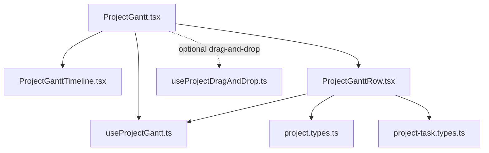
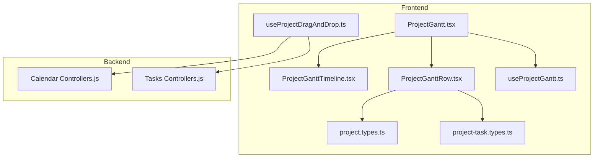
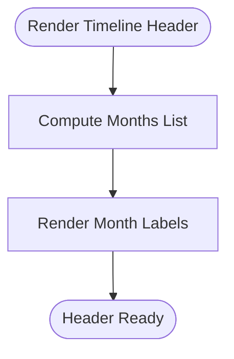
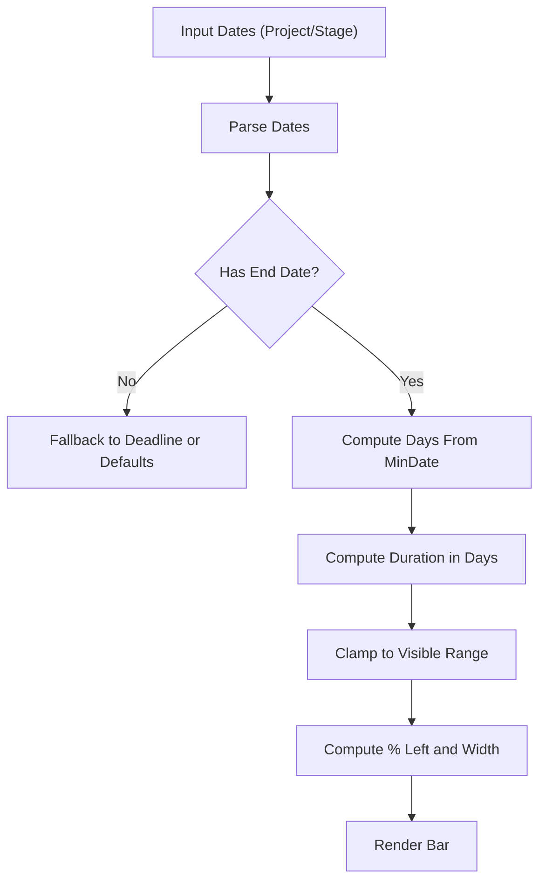
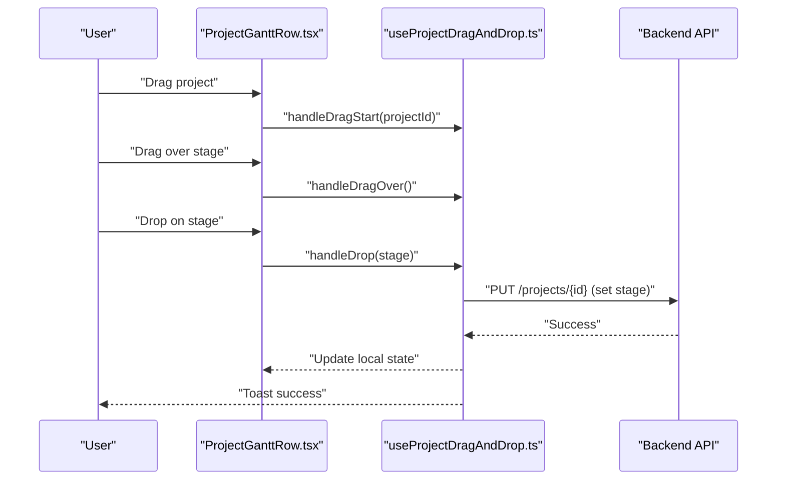
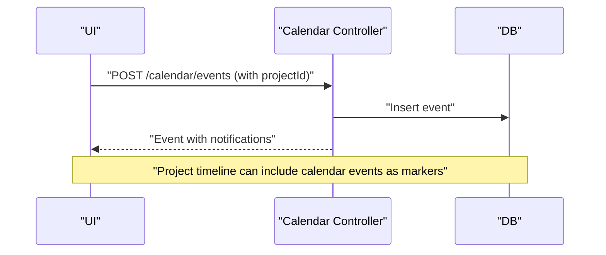
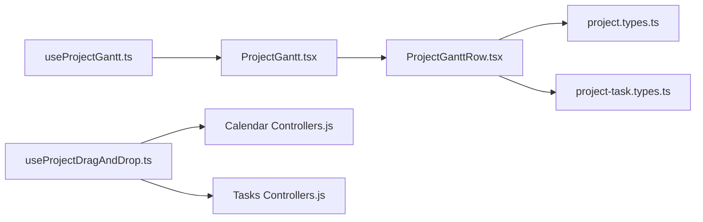

# Timeline & Gantt Charts

<cite>
**Referenced Files in This Document**
- [ProjectGantt.tsx](file://frontend/src/modules/projects/components/ProjectGantt.tsx)
- [ProjectGanttTimeline.tsx](file://frontend/src/modules/projects/components/gantt/ProjectGanttTimeline.tsx)
- [ProjectGanttRow.tsx](file://frontend/src/modules/projects/components/gantt/ProjectGanttRow.tsx)
- [useProjectGantt.ts](file://frontend/src/modules/projects/components/gantt/useProjectGantt.ts)
- [useProjectDragAndDrop.ts](file://frontend/src/modules/projects/hooks/useProjectDragAndDrop.ts)
- [project.types.ts](file://frontend/src/modules/projects/types/project.types.ts)
- [project-task.types.ts](file://frontend/src/modules/projects/types/project-task.types.ts)
- [controllers.js](file://backend/modules/calendar/controllers.js)
- [controllers.js](file://backend/modules/tasks/controllers.js)
</cite>

## Table of Contents
1. [Introduction](#introduction)
2. [Project Structure](#project-structure)
3. [Core Components](#core-components)
4. [Architecture Overview](#architecture-overview)
5. [Detailed Component Analysis](#detailed-component-analysis)
6. [Dependency Analysis](#dependency-analysis)
7. [Performance Considerations](#performance-considerations)
8. [Troubleshooting Guide](#troubleshooting-guide)
9. [Conclusion](#conclusion)
10. [Appendices](#appendices)

## Introduction
This document explains the Timeline and Gantt Chart functionality for projects. It covers how timelines are visualized, how durations and milestones are calculated, how drag-and-drop scheduling works, how constraints and the critical path could be modeled, and how to filter and customize views. It also documents integration with calendar events and resources, and provides practical examples of setup and workflows.

## Project Structure
The Gantt/Timeline feature is implemented in the Projects module on the frontend and backed by calendar and tasks APIs on the backend. The key frontend building blocks are:
- A container component that orchestrates the timeline and rows
- A reusable timeline header that renders month markers
- A row renderer that draws project bars and stage bars
- A hook that computes the visible date range and grid
- A drag-and-drop hook for moving projects across stages
- Types that define the data model for projects, stages, and tasks

**Diagram sources**
- [ProjectGantt.tsx:16-86](file://frontend/src/modules/projects/components/ProjectGantt.tsx#L16-L86)
- [ProjectGanttTimeline.tsx:10-31](file://frontend/src/modules/projects/components/gantt/ProjectGanttTimeline.tsx#L10-L30)
- [ProjectGanttRow.tsx:20-140](file://frontend/src/modules/projects/components/gantt/ProjectGanttRow.tsx#L20-L140)
- [useProjectGantt.ts:29-63](file://frontend/src/modules/projects/components/gantt/useProjectGantt.ts#L29-L63)
- [useProjectDragAndDrop.ts:15-60](file://frontend/src/modules/projects/hooks/useProjectDragAndDrop.ts#L15-L60)
- [project.types.ts:13-81](file://frontend/src/modules/projects/types/project.types.ts#L13-L81)
- [project-task.types.ts:10-33](file://frontend/src/modules/projects/types/project-task.types.ts#L10-L32)

**Section sources**
- [ProjectGantt.tsx:16-86](file://frontend/src/modules/projects/components/ProjectGantt.tsx#L16-L86)
- [ProjectGanttTimeline.tsx:10-31](file://frontend/src/modules/projects/components/gantt/ProjectGanttTimeline.tsx#L10-L30)
- [ProjectGanttRow.tsx:20-140](file://frontend/src/modules/projects/components/gantt/ProjectGanttRow.tsx#L20-L140)
- [useProjectGantt.ts:29-63](file://frontend/src/modules/projects/components/gantt/useProjectGantt.ts#L29-L63)
- [useProjectDragAndDrop.ts:15-60](file://frontend/src/modules/projects/hooks/useProjectDragAndDrop.ts#L15-L60)
- [project.types.ts:13-81](file://frontend/src/modules/projects/types/project.types.ts#L13-L81)
- [project-task.types.ts:10-33](file://frontend/src/modules/projects/types/project-task.types.ts#L10-L32)

## Core Components
- ProjectGantt: Renders the Gantt container, legend, and iterates over flattened projects to render rows. It computes the global timeline via a hook and passes grid data down to child components.
- ProjectGanttTimeline: Renders month markers across the timeline header.
- ProjectGanttRow: Draws the project bar and stage bars, computes positions based on dates, and handles clicks to edit project/stage.
- useProjectGantt: Computes the visible date range, grid months, and total days for scaling.
- useProjectDragAndDrop: Implements drag-and-drop to re-stage projects and persists changes via API.

**Section sources**
- [ProjectGantt.tsx:16-86](file://frontend/src/modules/projects/components/ProjectGantt.tsx#L16-L86)
- [ProjectGanttTimeline.tsx:10-31](file://frontend/src/modules/projects/components/gantt/ProjectGanttTimeline.tsx#L10-L30)
- [ProjectGanttRow.tsx:20-140](file://frontend/src/modules/projects/components/gantt/ProjectGanttRow.tsx#L20-L140)
- [useProjectGantt.ts:29-63](file://frontend/src/modules/projects/components/gantt/useProjectGantt.ts#L29-L63)
- [useProjectDragAndDrop.ts:15-60](file://frontend/src/modules/projects/hooks/useProjectDragAndDrop.ts#L15-L60)

## Architecture Overview
The Gantt view is a composition of presentation and data hooks. The backend exposes calendar and tasks APIs that can integrate with the timeline.

**Diagram sources**
- [ProjectGantt.tsx:16-86](file://frontend/src/modules/projects/components/ProjectGantt.tsx#L16-L86)
- [ProjectGanttTimeline.tsx:10-31](file://frontend/src/modules/projects/components/gantt/ProjectGanttTimeline.tsx#L10-L30)
- [ProjectGanttRow.tsx:20-140](file://frontend/src/modules/projects/components/gantt/ProjectGanttRow.tsx#L20-L140)
- [useProjectGantt.ts:29-63](file://frontend/src/modules/projects/components/gantt/useProjectGantt.ts#L29-L63)
- [useProjectDragAndDrop.ts:15-60](file://frontend/src/modules/projects/hooks/useProjectDragAndDrop.ts#L15-L60)
- [project.types.ts:13-81](file://frontend/src/modules/projects/types/project.types.ts#L13-L81)
- [project-task.types.ts:10-33](file://frontend/src/modules/projects/types/project-task.types.ts#L10-L32)
- [controllers.js:107-186](file://backend/modules/calendar/controllers.js#L107-L186)
- [controllers.js:63-108](file://backend/modules/tasks/controllers.js#L63-L108)

## Detailed Component Analysis

### Timeline Visualization
- Month grid rendering: The timeline header maps over computed months and renders localized month-year labels.
- Grid alignment: Rows overlay bars aligned to the computed min/max dates and total days.

**Diagram sources**
- [ProjectGanttTimeline.tsx:10-31](file://frontend/src/modules/projects/components/gantt/ProjectGanttTimeline.tsx#L10-L30)
- [useProjectGantt.ts:58-59](file://frontend/src/modules/projects/components/gantt/useProjectGantt.ts#L58-L59)

**Section sources**
- [ProjectGanttTimeline.tsx:10-31](file://frontend/src/modules/projects/components/gantt/ProjectGanttTimeline.tsx#L10-L30)
- [useProjectGantt.ts:58-59](file://frontend/src/modules/projects/components/gantt/useProjectGantt.ts#L58-L59)

### Task Duration Calculation and Milestone Placement
- Project duration: Derived from start/end dates; fallback to deadline if end missing. Effective start may be inferred if missing.
- Stage duration: Computed per stage’s start/end.
- Positioning: Left (%) and width (%) computed from differenceInDays against the global minDate and totalDays.
- Milestones: The stage model supports a type field; while rendering currently focuses on bars, adding milestone markers is straightforward by checking stage type and rendering a distinct indicator.

**Diagram sources**
- [ProjectGanttRow.tsx:22-74](file://frontend/src/modules/projects/components/gantt/ProjectGanttRow.tsx#L22-L74)
- [useProjectGantt.ts:35-51](file://frontend/src/modules/projects/components/gantt/useProjectGantt.ts#L35-L51)

**Section sources**
- [ProjectGanttRow.tsx:22-74](file://frontend/src/modules/projects/components/gantt/ProjectGanttRow.tsx#L22-L74)
- [useProjectGantt.ts:35-51](file://frontend/src/modules/projects/components/gantt/useProjectGantt.ts#L35-L51)
- [project.types.ts:61-81](file://frontend/src/modules/projects/types/project.types.ts#L61-L81)

### Drag-and-Drop Task Scheduling
- Drag source: Projects are draggable; drag state is tracked.
- Drop target: Stages; on drop, the project’s stage is updated via an API call and the UI is refreshed locally.
- Persistence: Updates are sent to the backend and confirmed with user feedback.

**Diagram sources**
- [useProjectDragAndDrop.ts:22-51](file://frontend/src/modules/projects/hooks/useProjectDragAndDrop.ts#L22-L51)
- [ProjectGanttRow.tsx:104-108](file://frontend/src/modules/projects/components/gantt/ProjectGanttRow.tsx#L104-L108)

**Section sources**
- [useProjectDragAndDrop.ts:15-60](file://frontend/src/modules/projects/hooks/useProjectDragAndDrop.ts#L15-L60)
- [ProjectGanttRow.tsx:104-108](file://frontend/src/modules/projects/components/gantt/ProjectGanttRow.tsx#L104-L108)

### Constraint Management and Critical Path Identification
- Current state: The frontend does not compute constraints or critical path. It renders bars based on dates.
- Recommended extension:
  - Add a constraints model to stages (e.g., finish-to-start with predecessor IDs).
  - Compute earliest/latest start/end dates per stage.
  - Identify critical path as the longest path with zero slack.
  - Visual indicators: Highlight critical bars differently; show slack as a label or tooltip.
  - Backend: Expose endpoints to fetch/update constraints and compute critical path server-side for consistency.

[No sources needed since this section proposes future enhancements]

### Timeline Filtering, Zoom Controls, and View Customization
- Filtering: Projects support status, stage, priority, manager, client, and search filters. These can be applied upstream to reduce the dataset passed to the Gantt.
- Zoom: The current implementation uses a fixed month grid derived from the computed range. To add zoom, expose a zoom factor/state and derive months accordingly.
- Customization: Allow toggling stage bars visibility, changing status colors, and adding tooltips for progress and dates.

**Section sources**
- [project.types.ts:220-227](file://frontend/src/modules/projects/types/project.types.ts#L220-L227)

### Integration with Calendar Events and Resource Availability
- Calendar integration: The backend calendar controller supports creating/updating events with fields like date, time, location, and linkage to projects. This enables surfacing calendar events alongside project stages.
- Resource availability: The tasks module manages tasks with assignees and due dates. While not directly consumed by the Gantt, it can inform resource capacity and conflicts.

**Diagram sources**
- [controllers.js:107-186](file://backend/modules/calendar/controllers.js#L107-L186)

**Section sources**
- [controllers.js:107-186](file://backend/modules/calendar/controllers.js#L107-L186)
- [controllers.js:63-108](file://backend/modules/tasks/controllers.js#L63-L108)

### Practical Examples

- Timeline setup
  - Provide a list of projects with start/end or deadline dates.
  - Optionally provide stages with start/end dates.
  - Pass these into ProjectGantt along with edit callbacks.

- Task scheduling workflow
  - Drag a project from one stage to another.
  - The backend updates the project’s stage; the UI reflects the change immediately.

- Project planning scenario
  - Create stages with planned start/end dates.
  - Assign tasks to stages; use the tasks API to manage assignments and due dates.
  - Monitor progress via stage completion percentage rendered on stage bars.

**Section sources**
- [ProjectGantt.tsx:16-86](file://frontend/src/modules/projects/components/ProjectGantt.tsx#L16-L86)
- [useProjectDragAndDrop.ts:32-51](file://frontend/src/modules/projects/hooks/useProjectDragAndDrop.ts#L32-L51)
- [project.types.ts:61-81](file://frontend/src/modules/projects/types/project.types.ts#L61-L81)
- [project-task.types.ts:10-33](file://frontend/src/modules/projects/types/project-task.types.ts#L10-L32)

## Dependency Analysis
- ProjectGantt depends on useProjectGantt for timeline bounds and on ProjectGanttRow for rendering.
- ProjectGanttRow depends on project types for data shape and on date utilities for positioning.
- Drag-and-drop depends on the API to persist stage changes.

**Diagram sources**
- [useProjectGantt.ts:29-63](file://frontend/src/modules/projects/components/gantt/useProjectGantt.ts#L29-L63)
- [ProjectGantt.tsx:16-86](file://frontend/src/modules/projects/components/ProjectGantt.tsx#L16-L86)
- [ProjectGanttRow.tsx:20-140](file://frontend/src/modules/projects/components/gantt/ProjectGanttRow.tsx#L20-L140)
- [project.types.ts:13-81](file://frontend/src/modules/projects/types/project.types.ts#L13-L81)
- [project-task.types.ts:10-33](file://frontend/src/modules/projects/types/project-task.types.ts#L10-L32)
- [useProjectDragAndDrop.ts:15-60](file://frontend/src/modules/projects/hooks/useProjectDragAndDrop.ts#L15-L60)
- [controllers.js:107-186](file://backend/modules/calendar/controllers.js#L107-L186)
- [controllers.js:63-108](file://backend/modules/tasks/controllers.js#L63-L108)

**Section sources**
- [useProjectGantt.ts:29-63](file://frontend/src/modules/projects/components/gantt/useProjectGantt.ts#L29-L63)
- [ProjectGantt.tsx:16-86](file://frontend/src/modules/projects/components/ProjectGantt.tsx#L16-L86)
- [ProjectGanttRow.tsx:20-140](file://frontend/src/modules/projects/components/gantt/ProjectGanttRow.tsx#L20-L140)
- [project.types.ts:13-81](file://frontend/src/modules/projects/types/project.types.ts#L13-L81)
- [project-task.types.ts:10-33](file://frontend/src/modules/projects/types/project-task.types.ts#L10-L32)
- [useProjectDragAndDrop.ts:15-60](file://frontend/src/modules/projects/hooks/useProjectDragAndDrop.ts#L15-L60)
- [controllers.js:107-186](file://backend/modules/calendar/controllers.js#L107-L186)
- [controllers.js:63-108](file://backend/modules/tasks/controllers.js#L63-L108)

## Performance Considerations
- Virtualization: For large datasets, consider virtualizing rows to avoid rendering hundreds of DOM nodes.
- Memoization: Already using useMemo for flattening projects; keep expensive computations inside hooks memoized.
- Date parsing: Parsing dates on render is lightweight but avoid repeated work by caching parsed dates if data mutates frequently.
- Rendering cost: Stage bars are overlaid; keep bar widths minimal and avoid heavy CSS where possible.

[No sources needed since this section provides general guidance]

## Troubleshooting Guide
- Drag-and-drop does not update
  - Verify the API endpoint responds and that the local state updater runs after the PUT.
  - Check for toast errors indicating failures.

- Bars not visible or clipped
  - Ensure minDate and totalDays are computed from actual project dates.
  - Confirm that left/width percentages are clamped to the visible range.

- Stage colors not applied
  - When color is a hex value, apply via inline styles; otherwise treat as a Tailwind class.

**Section sources**
- [useProjectDragAndDrop.ts:38-48](file://frontend/src/modules/projects/hooks/useProjectDragAndDrop.ts#L38-L48)
- [ProjectGanttRow.tsx:39-46](file://frontend/src/modules/projects/components/gantt/ProjectGanttRow.tsx#L39-L46)
- [ProjectGanttRow.tsx:116-125](file://frontend/src/modules/projects/components/gantt/ProjectGanttRow.tsx#L116-L125)

## Conclusion
The Gantt/Timeline implementation provides a solid foundation for visualizing project and stage durations with a clean separation of concerns. It supports drag-and-drop scheduling and integrates with calendar and tasks APIs. Extending it with constraints, critical path computation, filtering, zoom, and resource overlays would further enhance project planning capabilities.

## Appendices

### Data Binding Patterns
- Projects and stages are passed into ProjectGantt; rows render project bars and stage bars.
- Click handlers trigger edit callbacks for projects and stages.
- Drag-and-drop updates the project’s stage and refreshes the UI.

**Section sources**
- [ProjectGantt.tsx:16-86](file://frontend/src/modules/projects/components/ProjectGantt.tsx#L16-L86)
- [ProjectGanttRow.tsx:104-134](file://frontend/src/modules/projects/components/gantt/ProjectGanttRow.tsx#L104-L134)
- [useProjectDragAndDrop.ts:32-51](file://frontend/src/modules/projects/hooks/useProjectDragAndDrop.ts#L32-L51)

### Real-Time Synchronization Notes
- The drag-and-drop hook performs an immediate optimistic UI update followed by a backend PUT.
- For true real-time updates across clients, consider integrating WebSocket updates for project/stage changes.

**Section sources**
- [useProjectDragAndDrop.ts:38-48](file://frontend/src/modules/projects/hooks/useProjectDragAndDrop.ts#L38-L48)