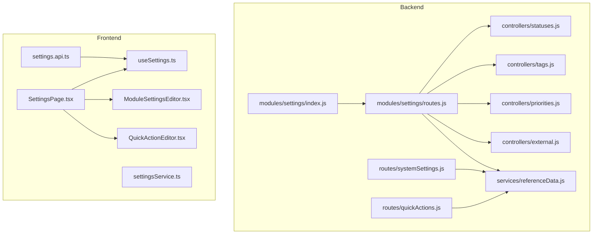
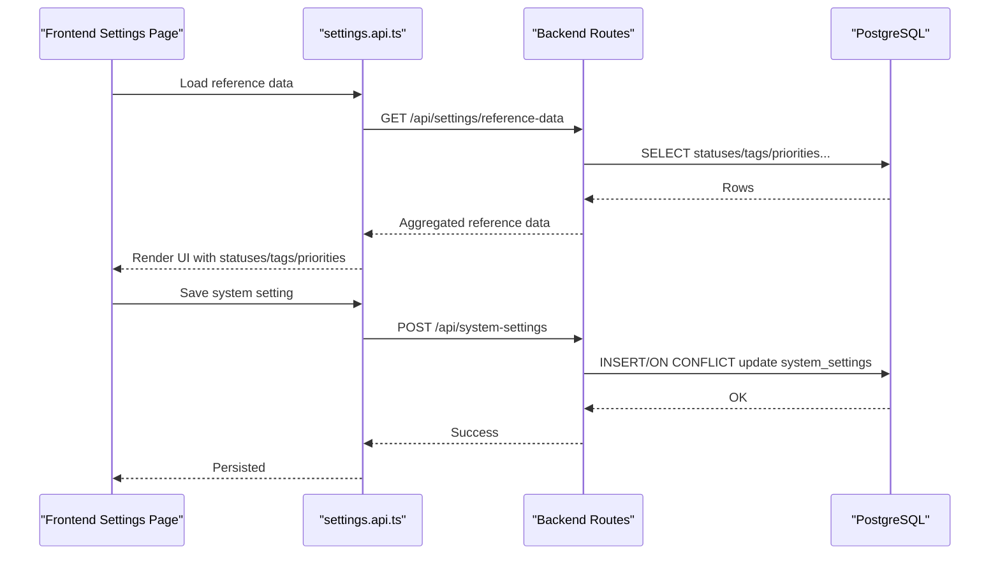
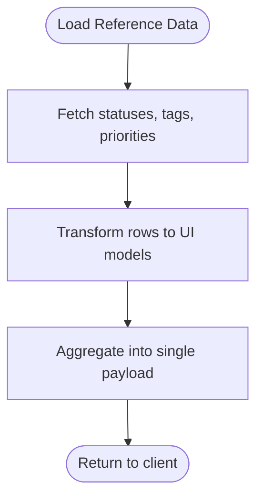
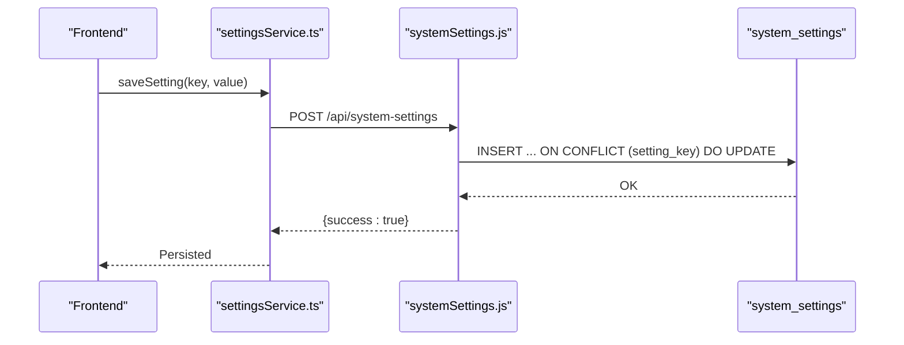
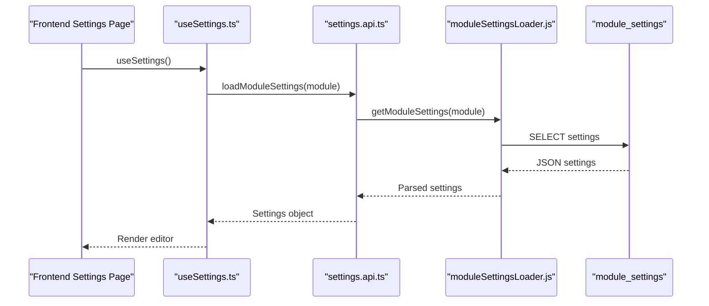
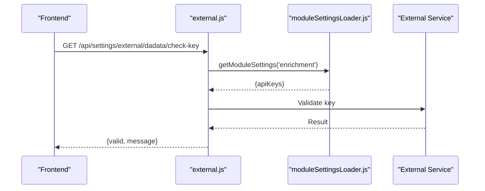
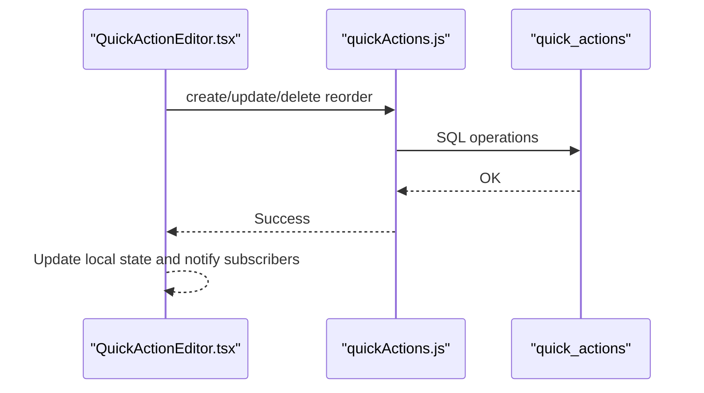
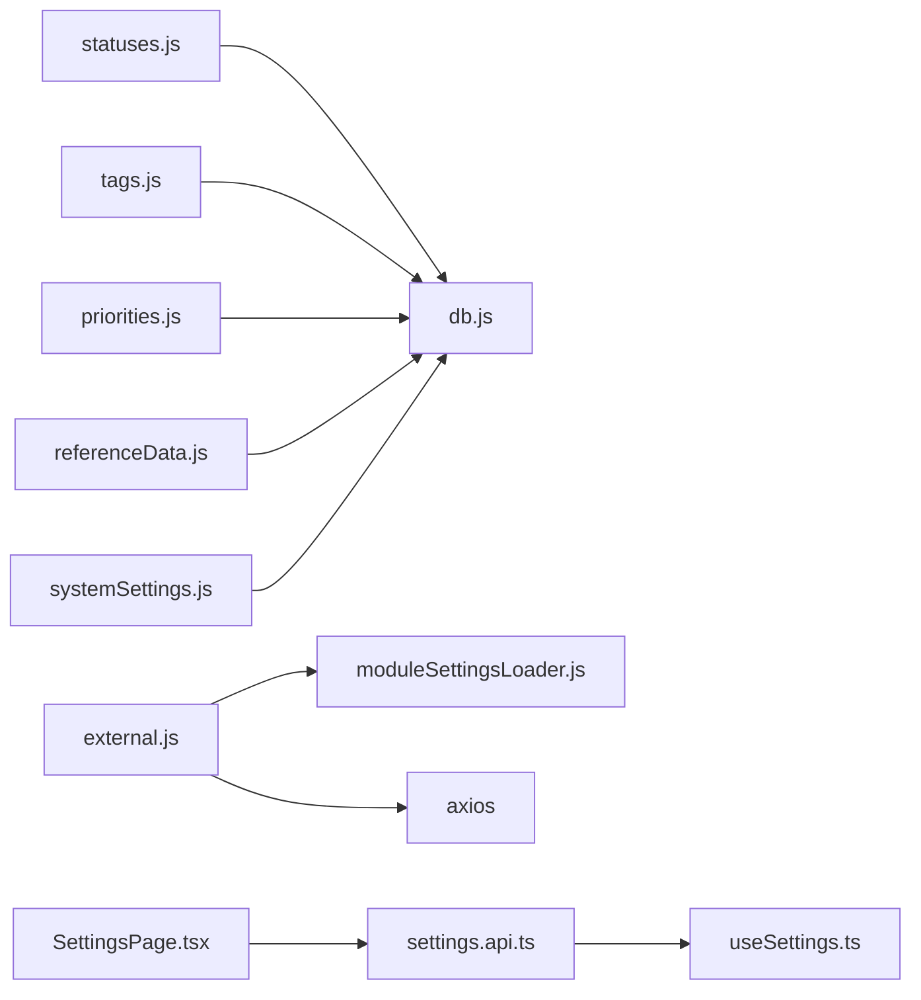

# Settings Module

<cite>
**Referenced Files in This Document**
- [index.js](file://backend/modules/settings/index.js)
- [routes.js](file://backend/modules/settings/routes.js)
- [settings.js](file://backend/modules/settings/settings.js)
- [statuses.js](file://backend/modules/settings/controllers/statuses.js)
- [tags.js](file://backend/modules/settings/controllers/tags.js)
- [priorities.js](file://backend/modules/settings/controllers/priorities.js)
- [external.js](file://backend/modules/settings/controllers/external.js)
- [referenceData.js](file://backend/modules/settings/services/referenceData.js)
- [systemSettings.js](file://backend/routes/systemSettings.js)
- [moduleSettingsLoader.js](file://backend/utils/moduleSettingsLoader.js)
- [quickActions.js](file://backend/routes/quickActions.js)
- [settings.api.ts](file://frontend/src/modules/settings/api/settings.api.ts)
- [settingsService.ts](file://frontend/src/modules/settings/api/settingsService.ts)
- [useSettings.ts](file://frontend/src/hooks/use-settings.ts)
- [SettingsPage.tsx](file://frontend/src/modules/settings/pages/SettingsPage.tsx)
- [ModuleSettingsEditor.tsx](file://frontend/src/modules/settings/components/ModuleSettingsEditor.tsx)
- [QuickActionEditor.tsx](file://frontend/src/modules/settings/components/QuickActionEditor.tsx)
</cite>

## Table of Contents
1. [Introduction](#introduction)
2. [Project Structure](#project-structure)
3. [Core Components](#core-components)
4. [Architecture Overview](#architecture-overview)
5. [Detailed Component Analysis](#detailed-component-analysis)
6. [Dependency Analysis](#dependency-analysis)
7. [Performance Considerations](#performance-considerations)
8. [Troubleshooting Guide](#troubleshooting-guide)
9. [Conclusion](#conclusion)
10. [Appendices](#appendices)

## Introduction
This document describes the Settings module that manages system configuration, reference data (statuses, tags, priorities), and integrations. It explains how global system settings and module-specific configurations are persisted and loaded, how reference data is organized and exposed, and how quick actions are configured and integrated across modules. Practical examples illustrate customization scenarios and operational guidance for validation, persistence, and real-time updates.

## Project Structure
The Settings module is split into backend and frontend parts:
- Backend: Express routers and controllers for statuses, tags, priorities, and external integrations; a service to aggregate reference data; and routes for system settings and quick actions.
- Frontend: A cohesive settings module with typed APIs, editors, and page components for managing system and module settings, reference data, and quick actions.

**Diagram sources**
- [index.js:1-22](file://backend/modules/settings/index.js#L1-L21)
- [routes.js:1-25](file://backend/modules/settings/routes.js#L1-L25)
- [statuses.js:1-215](file://backend/modules/settings/controllers/statuses.js#L1-L215)
- [tags.js:1-148](file://backend/modules/settings/controllers/tags.js#L1-L147)
- [priorities.js:1-166](file://backend/modules/settings/controllers/priorities.js#L1-L166)
- [external.js:1-220](file://backend/modules/settings/controllers/external.js#L1-L219)
- [referenceData.js:1-175](file://backend/modules/settings/services/referenceData.js#L1-L175)
- [systemSettings.js:1-221](file://backend/modules/settings/routes/systemSettings.js#L1-L8)
- [quickActions.js](file://backend/routes/quickActions.js)
- [settings.api.ts](file://frontend/src/modules/settings/api/settings.api.ts)
- [settingsService.ts](file://frontend/src/modules/settings/api/settingsService.ts)
- [useSettings.ts](file://frontend/src/hooks/use-settings.ts)
- [SettingsPage.tsx](file://frontend/src/modules/settings/pages/SettingsPage.tsx)
- [ModuleSettingsEditor.tsx](file://frontend/src/modules/settings/components/ModuleSettingsEditor.tsx)
- [QuickActionEditor.tsx](file://frontend/src/modules/settings/components/QuickActionEditor.tsx)

**Section sources**
- [index.js:1-22](file://backend/modules/settings/index.js#L1-L21)
- [routes.js:1-25](file://backend/modules/settings/routes.js#L1-L25)

## Core Components
- Reference data management: Statuses, tags, priorities, relationship types, and contractor types are managed via dedicated controllers and a unified service that aggregates and transforms data for the UI.
- System settings: Global configuration persisted in a system settings table with robust JSON parsing and safe upsert logic.
- Module settings: Dynamic loading and saving of per-module settings via a loader utility and dedicated routes.
- External integrations: DaData and API-FNS wrappers with key retrieval from module settings, plus usage statistics and validation endpoints.
- Quick actions: Centralized configuration and module integration handled by quick actions routes and UI editors.

**Section sources**
- [settings.js:1-30](file://backend/modules/settings/settings.js#L1-L30)
- [referenceData.js:143-162](file://backend/modules/settings/services/referenceData.js#L143-L162)
- [systemSettings.js:10-65](file://backend/modules/settings/routes/systemSettings.js#L1-L8)
- [moduleSettingsLoader.js](file://backend/utils/moduleSettingsLoader.js)
- [external.js:17-28](file://backend/modules/settings/controllers/external.js#L17-L28)

## Architecture Overview
The Settings module follows a layered backend design:
- Routers define endpoints and delegate to controllers.
- Controllers encapsulate business logic and interact with the database.
- Services provide reusable data transformation and aggregation.
- Frontend integrates with typed APIs and exposes editors and panels for configuration.

**Diagram sources**
- [settings.api.ts](file://frontend/src/modules/settings/api/settings.api.ts)
- [settingsService.ts](file://frontend/src/modules/settings/api/settingsService.ts)
- [routes.js:17-23](file://backend/modules/settings/routes.js#L17-L23)
- [referenceData.js:143-162](file://backend/modules/settings/services/referenceData.js#L143-L162)
- [systemSettings.js:42-65](file://backend/modules/settings/routes/systemSettings.js#L1-L8)

## Detailed Component Analysis

### Reference Data Management
The module supports:
- Statuses: Per-module status lists mapped to dedicated tables. Supports CRUD, reordering, and module filtering.
- Tags: Unified tag list with optional module scoping and badge styling attributes.
- Priorities: Global priority levels with predefined defaults and reordering.
- Relationship types and contractor types: Additional taxonomy structures for relational data.

Controllers implement:
- Validation for required fields.
- Safe updates with conditional SET clauses.
- Reordering by updating display order.
- Module-aware lookups for statuses.

Service consolidates:
- Fetches all reference data concurrently.
- Normalizes rows into UI-friendly shapes with defaults and optional attributes.

**Diagram sources**
- [referenceData.js:143-162](file://backend/modules/settings/services/referenceData.js#L143-L162)
- [statuses.js:63-90](file://backend/modules/settings/controllers/statuses.js#L63-L90)
- [tags.js:36-50](file://backend/modules/settings/controllers/tags.js#L36-L50)
- [priorities.js:39-43](file://backend/modules/settings/controllers/priorities.js#L39-L43)

**Section sources**
- [statuses.js:1-215](file://backend/modules/settings/controllers/statuses.js#L1-L215)
- [tags.js:1-148](file://backend/modules/settings/controllers/tags.js#L1-L147)
- [priorities.js:1-166](file://backend/modules/settings/controllers/priorities.js#L1-L166)
- [referenceData.js:1-175](file://backend/modules/settings/services/referenceData.js#L1-L175)

### System Settings Persistence
System settings are stored in a centralized table with:
- Key-value pairs where values are JSON-encoded.
- Safe upsert logic to avoid partial writes.
- Robust parsing to handle stringified values gracefully.

Endpoints:
- GET /api/system-settings: returns all settings as a flat object.
- POST /api/system-settings: saves a single key-value pair.
- Additional endpoints for testing integrations (email, Telegram, enrichment stats).

**Diagram sources**
- [systemSettings.js:42-65](file://backend/modules/settings/routes/systemSettings.js#L1-L8)
- [settingsService.ts](file://frontend/src/modules/settings/api/settingsService.ts)

**Section sources**
- [systemSettings.js:10-65](file://backend/modules/settings/routes/systemSettings.js#L1-L8)

### Module Settings System
Module settings are dynamically loaded and saved:
- Loader utility retrieves module-specific configuration from persistent storage.
- Routes expose endpoints to manage module settings.
- Frontend hooks coordinate loading and saving with optimistic updates and validation.

**Diagram sources**
- [useSettings.ts](file://frontend/src/hooks/use-settings.ts)
- [settings.api.ts](file://frontend/src/modules/settings/api/settings.api.ts)
- [moduleSettingsLoader.js](file://backend/utils/moduleSettingsLoader.js)

**Section sources**
- [moduleSettingsLoader.js](file://backend/utils/moduleSettingsLoader.js)
- [SettingsPage.tsx](file://frontend/src/modules/settings/pages/SettingsPage.tsx)
- [ModuleSettingsEditor.tsx](file://frontend/src/modules/settings/components/ModuleSettingsEditor.tsx)

### External Integrations (DaData, API-FNS)
The external controller:
- Retrieves API keys from module settings.
- Proxies requests to external services with proper headers and timeouts.
- Provides health checks and usage statistics endpoints.
- Handles common error responses (invalid key, rate limits, blocked IPs).

**Diagram sources**
- [external.js:111-140](file://backend/modules/settings/controllers/external.js#L111-L140)
- [moduleSettingsLoader.js](file://backend/utils/moduleSettingsLoader.js)

**Section sources**
- [external.js:1-220](file://backend/modules/settings/controllers/external.js#L1-L219)

### Quick Actions Configuration
Quick actions are configured centrally and integrated across modules:
- Routes manage creation, updates, deletions, and ordering of quick actions.
- Frontend editors allow defining actions with module targets and custom shortcuts.
- Real-time updates propagate to UI components that consume global quick actions.

**Diagram sources**
- [quickActions.js](file://backend/routes/quickActions.js)
- [QuickActionEditor.tsx](file://frontend/src/modules/settings/components/QuickActionEditor.tsx)

**Section sources**
- [quickActions.js](file://backend/routes/quickActions.js)
- [QuickActionEditor.tsx](file://frontend/src/modules/settings/components/QuickActionEditor.tsx)

## Dependency Analysis
- Backend controllers depend on the database client and shared response helpers.
- The reference data service depends on the database and maps rows to UI models.
- External controller depends on the module settings loader and HTTP client.
- Frontend relies on typed APIs and hooks for reactive updates.

**Diagram sources**
- [statuses.js](file://backend/modules/settings/controllers/statuses.js#L8)
- [tags.js](file://backend/modules/settings/controllers/tags.js#L7)
- [priorities.js](file://backend/modules/settings/controllers/priorities.js#L7)
- [external.js:7-11](file://backend/modules/settings/controllers/external.js#L7-L11)
- [referenceData.js](file://backend/modules/settings/services/referenceData.js#L1)
- [systemSettings.js:4-8](file://backend/modules/settings/routes/systemSettings.js#L4-L8)
- [settings.api.ts](file://frontend/src/modules/settings/api/settings.api.ts)
- [useSettings.ts](file://frontend/src/hooks/use-settings.ts)
- [SettingsPage.tsx](file://frontend/src/modules/settings/pages/SettingsPage.tsx)

**Section sources**
- [statuses.js:1-215](file://backend/modules/settings/controllers/statuses.js#L1-L215)
- [tags.js:1-148](file://backend/modules/settings/controllers/tags.js#L1-L147)
- [priorities.js:1-166](file://backend/modules/settings/controllers/priorities.js#L1-L166)
- [external.js:1-220](file://backend/modules/settings/controllers/external.js#L1-L219)
- [referenceData.js:1-175](file://backend/modules/settings/services/referenceData.js#L1-L175)
- [systemSettings.js:1-221](file://backend/modules/settings/routes/systemSettings.js#L1-L8)
- [settings.api.ts](file://frontend/src/modules/settings/api/settings.api.ts)
- [useSettings.ts](file://frontend/src/hooks/use-settings.ts)
- [SettingsPage.tsx](file://frontend/src/modules/settings/pages/SettingsPage.tsx)

## Performance Considerations
- Reference data aggregation uses concurrent fetches to minimize latency.
- Status and priority reordering updates are batched efficiently.
- JSON parsing in system settings is defensive to avoid crashes on malformed values.
- External requests include timeouts and error handling to prevent hanging calls.

[No sources needed since this section provides general guidance]

## Troubleshooting Guide
Common issues and resolutions:
- Validation errors on missing required fields (e.g., name, module) during creation or updates.
- Unknown module errors when creating statuses; ensure the module is supported.
- Not found responses when editing non-existent items; verify IDs and module tables.
- External integration failures: check API keys in module settings and network connectivity.
- System settings not persisting: confirm JSON encoding and upsert logic.

**Section sources**
- [statuses.js:114-118](file://backend/modules/settings/controllers/statuses.js#L114-L118)
- [tags.js:72-76](file://backend/modules/settings/controllers/tags.js#L72-L76)
- [priorities.js:64-66](file://backend/modules/settings/controllers/priorities.js#L64-L66)
- [external.js:43-45](file://backend/modules/settings/controllers/external.js#L43-L45)
- [systemSettings.js:48-58](file://backend/modules/settings/routes/systemSettings.js#L1-L8)

## Conclusion
The Settings module provides a robust foundation for managing system-wide and module-specific configurations, maintaining reference data, and integrating external services. Its layered design ensures maintainability, while frontend editors and hooks enable intuitive configuration experiences. The documented flows and examples should help administrators customize statuses, tags, priorities, quick actions, and integrations effectively.

[No sources needed since this section summarizes without analyzing specific files]

## Appendices

### Practical Examples

- Customize statuses for a module
  - Use the statuses controller to create, update, reorder, and delete statuses scoped to a module.
  - Example paths: [statuses.js:108-130](file://backend/modules/settings/controllers/statuses.js#L108-L130), [statuses.js:193-204](file://backend/modules/settings/controllers/statuses.js#L193-L204)

- Manage tags with module scoping
  - Create and edit tags with optional module filter and badge styling attributes.
  - Example paths: [tags.js:66-85](file://backend/modules/settings/controllers/tags.js#L66-L85), [tags.js:91-128](file://backend/modules/settings/controllers/tags.js#L91-L128)

- Configure priorities and reordering
  - Create priorities with default colors and levels; reorder globally.
  - Example paths: [priorities.js:59-87](file://backend/modules/settings/controllers/priorities.js#L59-L87), [priorities.js:146-155](file://backend/modules/settings/controllers/priorities.js#L146-L155)

- Configure system settings
  - Save key-value pairs with JSON-safe encoding and upsert semantics.
  - Example paths: [systemSettings.js:42-65](file://backend/modules/settings/routes/systemSettings.js#L1-L8)

- Integrate external services
  - Retrieve keys from module settings and test connectivity; review usage statistics.
  - Example paths: [external.js:17-28](file://backend/modules/settings/controllers/external.js#L17-L28), [external.js:111-140](file://backend/modules/settings/controllers/external.js#L111-L140)

- Configure quick actions
  - Define actions with module targets and shortcuts; update ordering and visibility.
  - Example paths: [quickActions.js](file://backend/routes/quickActions.js), [QuickActionEditor.tsx](file://frontend/src/modules/settings/components/QuickActionEditor.tsx)

### Technical Implementation Notes
- Data persistence
  - System settings: JSON-encoded values with safe upsert.
  - Reference data: Module-specific tables with display order and styling attributes.
  - External integrations: Keys retrieved from module settings; usage tracked in statistics tables.

- Validation and error handling
  - Controllers validate required fields and module support.
  - System settings routes parse values defensively.
  - External routes handle HTTP errors and return actionable messages.

- Real-time configuration updates
  - Frontend hooks coordinate loading and saving; UI components subscribe to state changes.
  - Quick actions updates propagate to consumers via shared state.

**Section sources**
- [systemSettings.js:10-65](file://backend/modules/settings/routes/systemSettings.js#L1-L8)
- [referenceData.js:143-162](file://backend/modules/settings/services/referenceData.js#L143-L162)
- [external.js:17-28](file://backend/modules/settings/controllers/external.js#L17-L28)
- [useSettings.ts](file://frontend/src/hooks/use-settings.ts)
- [QuickActionEditor.tsx](file://frontend/src/modules/settings/components/QuickActionEditor.tsx)