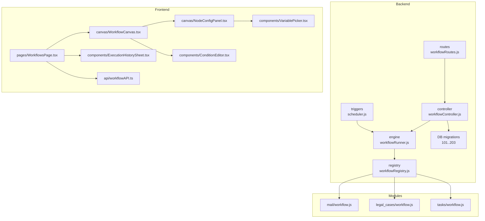
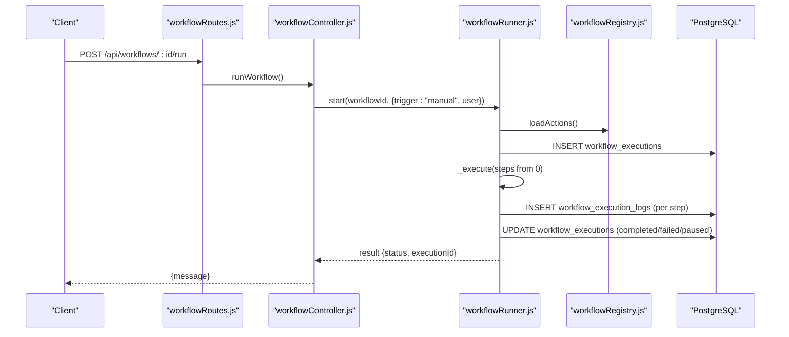
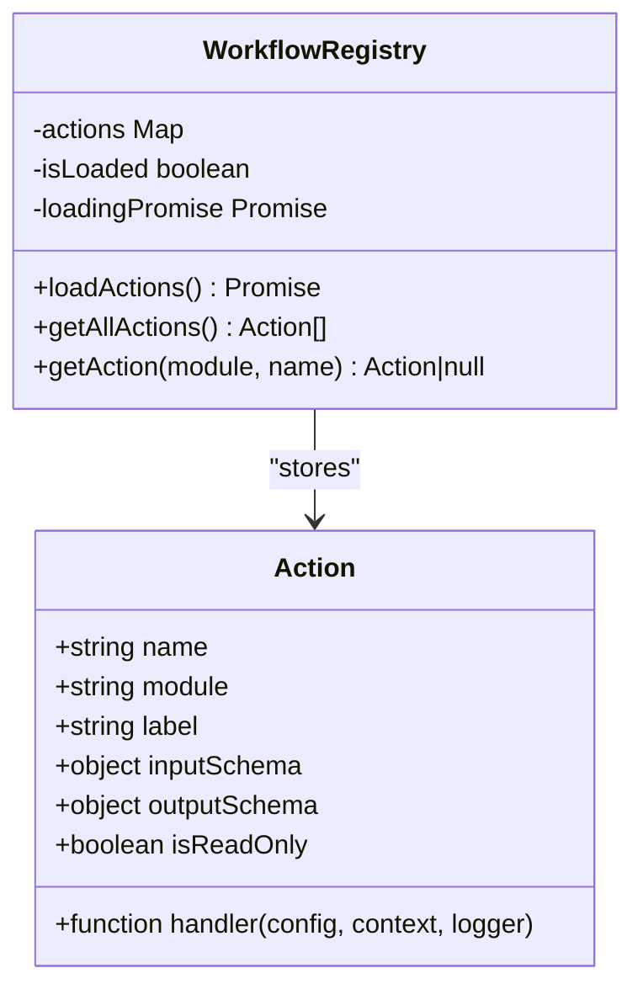
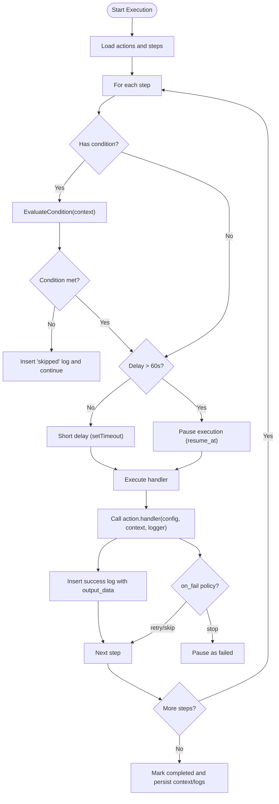
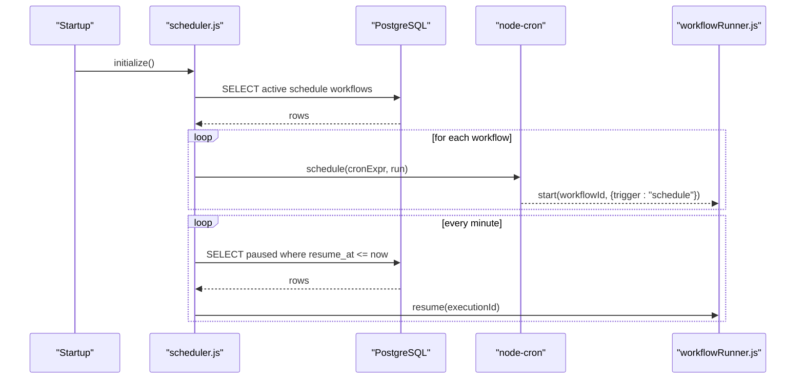
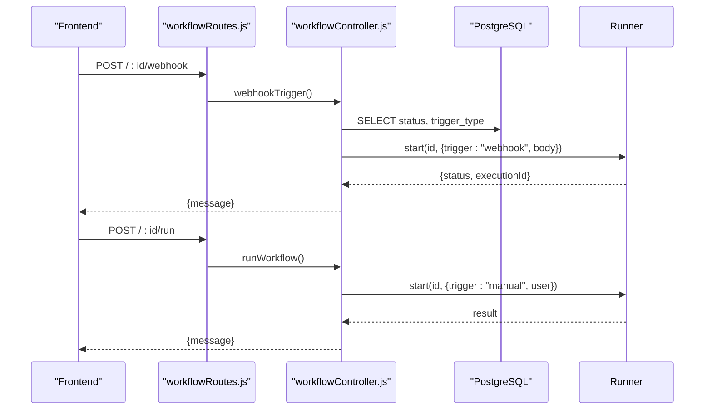
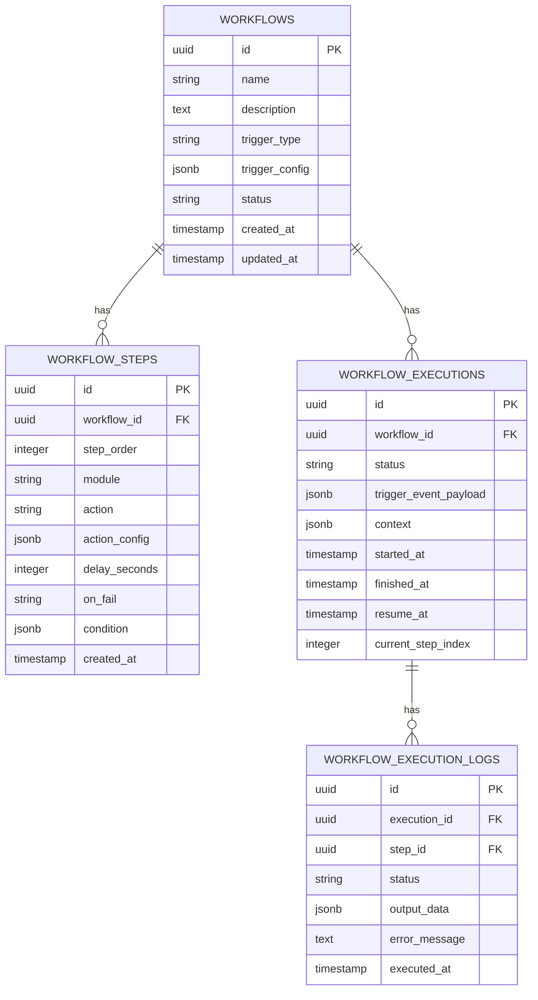
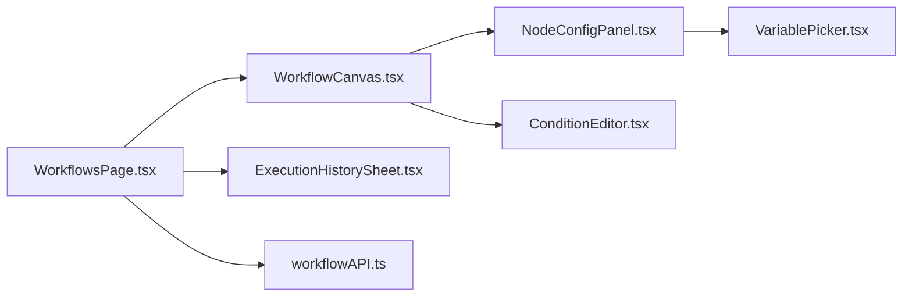
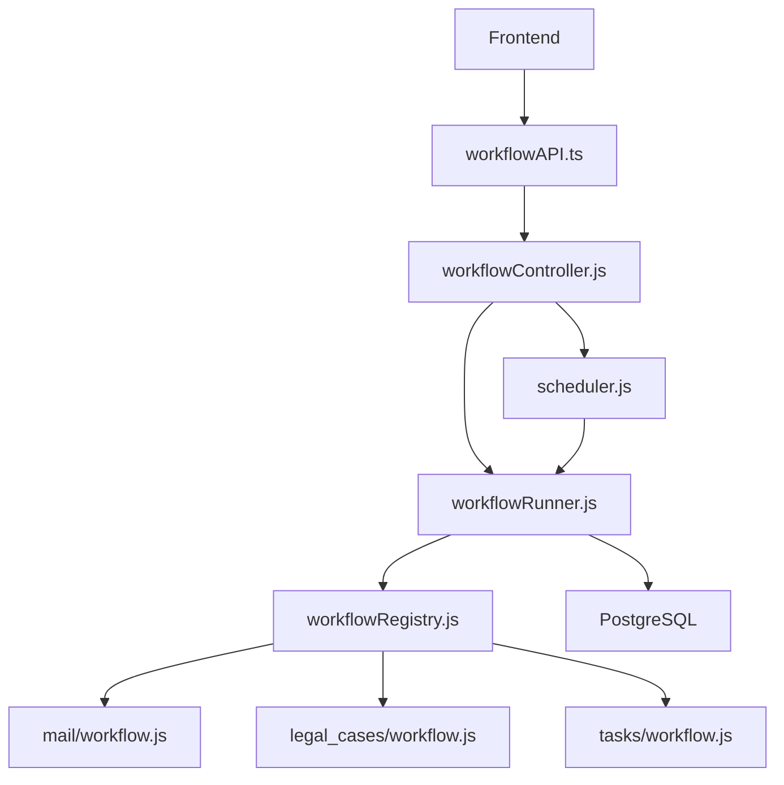

# Workflow Module

> 📄 **Синхронизировано** с [docs/modules/workflow.md](../../docs/modules/workflow.md) — актуальная компактная спецификация модуля (рус.). Ниже — подробный англоязычный разбор с исходниками и диаграммами.

<cite>
**Referenced Files in This Document**
- [index.js](file://backend/modules/workflow/index.js)
- [settings.js](file://backend/modules/workflow/settings.js)
- [workflowController.js](file://backend/modules/workflow/workflowController.js)
- [workflowRoutes.js](file://backend/modules/workflow/workflowRoutes.js)
- [workflowRegistry.js](file://backend/modules/workflow/engine/workflowRegistry.js)
- [workflowRunner.js](file://backend/modules/workflow/engine/workflowRunner.js)
- [scheduler.js](file://backend/modules/workflow/triggers/scheduler.js)
- [101_create_workflow_tables.sql](file://backend/migrations/101_create_workflow_tables.sql)
- [102_add_workflow_step_condition.sql](file://backend/migrations/102_add_workflow_step_condition.sql)
- [203_workflow_pause_resume.sql](file://backend/migrations/203_workflow_pause_resume.sql)
- [mail/workflow.js](file://backend/modules/mail/workflow.js)
- [legal_cases/workflow.js](file://backend/modules/legal_cases/workflow.js)
- [tasks/workflow.js](file://backend/modules/tasks/workflow.js)
- [workflowAPI.ts](file://frontend/src/modules/workflow/api/workflowAPI.ts)
- [WorkflowCanvas.tsx](file://frontend/src/modules/workflow/components/canvas/WorkflowCanvas.tsx)
- [NodeConfigPanel.tsx](file://frontend/src/modules/workflow/components/canvas/NodeConfigPanel.tsx)
- [ConditionEditor.tsx](file://frontend/src/modules/workflow/components/ConditionEditor.tsx)
- [VariablePicker.tsx](file://frontend/src/modules/workflow/components/VariablePicker.tsx)
- [ExecutionHistorySheet.tsx](file://frontend/src/modules/workflow/components/ExecutionHistorySheet.tsx)
- [WorkflowsPage.tsx](file://frontend/src/modules/workflow/pages/WorkflowsPage.tsx)
</cite>

## Table of Contents
1. [Introduction](#introduction)
2. [Project Structure](#project-structure)
3. [Core Components](#core-components)
4. [Architecture Overview](#architecture-overview)
5. [Detailed Component Analysis](#detailed-component-analysis)
6. [Dependency Analysis](#dependency-analysis)
7. [Performance Considerations](#performance-considerations)
8. [Troubleshooting Guide](#troubleshooting-guide)
9. [Conclusion](#conclusion)
10. [Appendices](#appendices)

## Introduction
The Workflow module is a powerful automation engine that orchestrates cross-module actions triggered by schedules, events, or manual runs. It provides:
- A registry of reusable actions across modules
- A step-based execution engine with conditions, delays, and human approvals
- Scheduling and pause/resume capabilities
- Execution history, monitoring, and retry mechanisms
- A canvas-based frontend for designing workflows visually

This document explains the architecture, step definition, condition evaluation, execution tracking, trigger system, visualization, monitoring, persistence, state management, and real-time monitoring.

## Project Structure
The Workflow module is split into backend and frontend parts:
- Backend: routes, controller, engine (runner and registry), triggers (scheduler), and database migrations
- Frontend: canvas, nodes, configuration panels, condition editor, variable picker, and execution history sheet

**Diagram sources**
- [workflowRoutes.js:1-32](file://backend/modules/workflow/workflowRoutes.js#L1-L31)
- [workflowController.js:1-539](file://backend/modules/workflow/workflowController.js#L1-L538)
- [workflowRunner.js:1-399](file://backend/modules/workflow/engine/workflowRunner.js#L1-L399)
- [workflowRegistry.js:1-137](file://backend/modules/workflow/engine/workflowRegistry.js#L1-L136)
- [scheduler.js:1-106](file://backend/modules/workflow/triggers/scheduler.js#L1-L105)
- [101_create_workflow_tables.sql:1-54](file://backend/migrations/101_create_workflow_tables.sql#L1-L53)
- [203_workflow_pause_resume.sql:1-16](file://backend/migrations/203_workflow_pause_resume.sql#L1-L15)
- [mail/workflow.js:1-810](file://backend/modules/mail/workflow.js#L1-L810)
- [legal_cases/workflow.js:1-583](file://backend/modules/legal_cases/workflow.js#L1-L582)
- [tasks/workflow.js:1-108](file://backend/modules/tasks/workflow.js#L1-L107)
- [WorkflowsPage.tsx](file://frontend/src/modules/workflow/pages/WorkflowsPage.tsx)
- [WorkflowCanvas.tsx](file://frontend/src/modules/workflow/components/canvas/WorkflowCanvas.tsx)
- [NodeConfigPanel.tsx](file://frontend/src/modules/workflow/components/canvas/NodeConfigPanel.tsx)
- [ConditionEditor.tsx](file://frontend/src/modules/workflow/components/ConditionEditor.tsx)
- [VariablePicker.tsx](file://frontend/src/modules/workflow/components/VariablePicker.tsx)
- [ExecutionHistorySheet.tsx](file://frontend/src/modules/workflow/components/ExecutionHistorySheet.tsx)
- [workflowAPI.ts](file://frontend/src/modules/workflow/api/workflowAPI.ts)

**Section sources**
- [workflowRoutes.js:1-32](file://backend/modules/workflow/workflowRoutes.js#L1-L31)
- [workflowController.js:1-539](file://backend/modules/workflow/workflowController.js#L1-L538)
- [workflowRunner.js:1-399](file://backend/modules/workflow/engine/workflowRunner.js#L1-L399)
- [workflowRegistry.js:1-137](file://backend/modules/workflow/engine/workflowRegistry.js#L1-L136)
- [scheduler.js:1-106](file://backend/modules/workflow/triggers/scheduler.js#L1-L105)
- [101_create_workflow_tables.sql:1-54](file://backend/migrations/101_create_workflow_tables.sql#L1-L53)
- [203_workflow_pause_resume.sql:1-16](file://backend/migrations/203_workflow_pause_resume.sql#L1-L15)
- [mail/workflow.js:1-810](file://backend/modules/mail/workflow.js#L1-L810)
- [legal_cases/workflow.js:1-583](file://backend/modules/legal_cases/workflow.js#L1-L582)
- [tasks/workflow.js:1-108](file://backend/modules/tasks/workflow.js#L1-L107)
- [WorkflowsPage.tsx](file://frontend/src/modules/workflow/pages/WorkflowsPage.tsx)
- [WorkflowCanvas.tsx](file://frontend/src/modules/workflow/components/canvas/WorkflowCanvas.tsx)
- [NodeConfigPanel.tsx](file://frontend/src/modules/workflow/components/canvas/NodeConfigPanel.tsx)
- [ConditionEditor.tsx](file://frontend/src/modules/workflow/components/ConditionEditor.tsx)
- [VariablePicker.tsx](file://frontend/src/modules/workflow/components/VariablePicker.tsx)
- [ExecutionHistorySheet.tsx](file://frontend/src/modules/workflow/components/ExecutionHistorySheet.tsx)
- [workflowAPI.ts](file://frontend/src/modules/workflow/api/workflowAPI.ts)

## Core Components
- Engine
  - Runner: orchestrates step execution, conditions, delays, human approvals, logging, and persistence
  - Registry: discovers and exposes actions from all modules plus built-in core actions
- Triggers
  - Scheduler: loads active scheduled workflows and resumes paused executions on schedule
- Controller and Routes: expose CRUD, validation, manual run, webhook, history, retry, and approval APIs
- Persistence: workflows, steps, executions, and logs in PostgreSQL with migrations
- Frontend Canvas: visual workflow designer with node configuration and condition editing

**Section sources**
- [workflowRunner.js:1-399](file://backend/modules/workflow/engine/workflowRunner.js#L1-L399)
- [workflowRegistry.js:1-137](file://backend/modules/workflow/engine/workflowRegistry.js#L1-L136)
- [scheduler.js:1-106](file://backend/modules/workflow/triggers/scheduler.js#L1-L105)
- [workflowController.js:1-539](file://backend/modules/workflow/workflowController.js#L1-L538)
- [workflowRoutes.js:1-32](file://backend/modules/workflow/workflowRoutes.js#L1-L31)
- [101_create_workflow_tables.sql:1-54](file://backend/migrations/101_create_workflow_tables.sql#L1-L53)
- [203_workflow_pause_resume.sql:1-16](file://backend/migrations/203_workflow_pause_resume.sql#L1-L15)

## Architecture Overview
The engine executes a linear sequence of steps, each backed by a registered action. Steps can:
- Evaluate a condition against the execution context
- Optionally delay execution (short delays inline, long delays pause)
- Pause for human approval
- Invoke module-specific handlers that may write outputs into the context

Triggers initiate execution:
- Manual runs
- Webhooks (public endpoint)
- Schedules (cron-based)

Execution state is persisted and can be resumed after pauses or failures.

**Diagram sources**
- [workflowRoutes.js:17-23](file://backend/modules/workflow/workflowRoutes.js#L17-L23)
- [workflowController.js:377-395](file://backend/modules/workflow/workflowController.js#L377-L395)
- [workflowRunner.js:23-62](file://backend/modules/workflow/engine/workflowRunner.js#L23-L62)
- [workflowRegistry.js:15-118](file://backend/modules/workflow/engine/workflowRegistry.js#L15-L118)
- [101_create_workflow_tables.sql:33-54](file://backend/migrations/101_create_workflow_tables.sql#L33-L53)

## Detailed Component Analysis

### Engine: Workflow Registry
The registry dynamically loads actions from all backend modules that export a workflow.js with an actions object. It supports:
- Legacy array format and modern object format with input/output schemas
- Built-in core actions (human approval, delay)
- Singleton access for the runner

**Diagram sources**
- [workflowRegistry.js:4-137](file://backend/modules/workflow/engine/workflowRegistry.js#L4-L136)

**Section sources**
- [workflowRegistry.js:1-137](file://backend/modules/workflow/engine/workflowRegistry.js#L1-L136)
- [mail/workflow.js:49-810](file://backend/modules/mail/workflow.js#L49-L810)
- [legal_cases/workflow.js:10-583](file://backend/modules/legal_cases/workflow.js#L10-L582)
- [tasks/workflow.js:8-108](file://backend/modules/tasks/workflow.js#L8-L107)

### Engine: Workflow Runner
Responsibilities:
- Start/resume execution, persist execution records
- Evaluate step conditions against context
- Resolve context variables in action configs
- Execute handlers, handle on_fail policies
- Support human approval and long delays via pause/resume
- Persist logs and final context

**Diagram sources**
- [workflowRunner.js:103-247](file://backend/modules/workflow/engine/workflowRunner.js#L103-L247)

**Section sources**
- [workflowRunner.js:1-399](file://backend/modules/workflow/engine/workflowRunner.js#L1-L399)

### Triggers: Scheduler
- Loads active scheduled workflows and creates cron tasks
- Wakes up paused executions whose resume_at is due
- Supports reload on status/trigger change

**Diagram sources**
- [scheduler.js:11-52](file://backend/modules/workflow/triggers/scheduler.js#L11-L52)
- [scheduler.js:54-101](file://backend/modules/workflow/triggers/scheduler.js#L54-L101)

**Section sources**
- [scheduler.js:1-106](file://backend/modules/workflow/triggers/scheduler.js#L1-L105)

### Controller and Routes
- Expose CRUD for workflows and steps
- Validation, manual run, webhook trigger, execution history, retry, and approval
- Normalize JSON fields and build execution summaries

**Diagram sources**
- [workflowRoutes.js:7-29](file://backend/modules/workflow/workflowRoutes.js#L7-L29)
- [workflowController.js:352-395](file://backend/modules/workflow/workflowController.js#L352-L395)
- [workflowRunner.js:23-62](file://backend/modules/workflow/engine/workflowRunner.js#L23-L62)

**Section sources**
- [workflowRoutes.js:1-32](file://backend/modules/workflow/workflowRoutes.js#L1-L31)
- [workflowController.js:1-539](file://backend/modules/workflow/workflowController.js#L1-L538)

### Persistence and Schema
- workflows: id, name, description, trigger_type, trigger_config, status, timestamps
- workflow_steps: ordered steps with module/action, action_config, delay_seconds, on_fail, condition
- workflow_executions: execution records with status, trigger_event_payload, context, timestamps
- workflow_execution_logs: per-step logs with status, output_data, error_message

**Diagram sources**
- [101_create_workflow_tables.sql:3-54](file://backend/migrations/101_create_workflow_tables.sql#L3-L53)
- [102_add_workflow_step_condition.sql:1-7](file://backend/migrations/102_add_workflow_step_condition.sql#L1-L6)
- [203_workflow_pause_resume.sql:3-16](file://backend/migrations/203_workflow_pause_resume.sql#L3-L15)

**Section sources**
- [101_create_workflow_tables.sql:1-54](file://backend/migrations/101_create_workflow_tables.sql#L1-L53)
- [102_add_workflow_step_condition.sql:1-7](file://backend/migrations/102_add_workflow_step_condition.sql#L1-L6)
- [203_workflow_pause_resume.sql:1-16](file://backend/migrations/203_workflow_pause_resume.sql#L1-L15)

### Frontend: Canvas and Configuration
- WorkflowsPage renders the canvas and lists workflows
- WorkflowCanvas displays nodes and connections
- NodeConfigPanel edits step action_config and delay/on_fail
- ConditionEditor builds step conditions
- VariablePicker inserts context variables into configs
- ExecutionHistorySheet shows execution logs and summaries

**Diagram sources**
- [WorkflowsPage.tsx](file://frontend/src/modules/workflow/pages/WorkflowsPage.tsx)
- [WorkflowCanvas.tsx](file://frontend/src/modules/workflow/components/canvas/WorkflowCanvas.tsx)
- [NodeConfigPanel.tsx](file://frontend/src/modules/workflow/components/canvas/NodeConfigPanel.tsx)
- [ConditionEditor.tsx](file://frontend/src/modules/workflow/components/ConditionEditor.tsx)
- [VariablePicker.tsx](file://frontend/src/modules/workflow/components/VariablePicker.tsx)
- [ExecutionHistorySheet.tsx](file://frontend/src/modules/workflow/components/ExecutionHistorySheet.tsx)
- [workflowAPI.ts](file://frontend/src/modules/workflow/api/workflowAPI.ts)

**Section sources**
- [WorkflowsPage.tsx](file://frontend/src/modules/workflow/pages/WorkflowsPage.tsx)
- [WorkflowCanvas.tsx](file://frontend/src/modules/workflow/components/canvas/WorkflowCanvas.tsx)
- [NodeConfigPanel.tsx](file://frontend/src/modules/workflow/components/canvas/NodeConfigPanel.tsx)
- [ConditionEditor.tsx](file://frontend/src/modules/workflow/components/ConditionEditor.tsx)
- [VariablePicker.tsx](file://frontend/src/modules/workflow/components/VariablePicker.tsx)
- [ExecutionHistorySheet.tsx](file://frontend/src/modules/workflow/components/ExecutionHistorySheet.tsx)
- [workflowAPI.ts](file://frontend/src/modules/workflow/api/workflowAPI.ts)

## Dependency Analysis
- Controller depends on Runner, Registry, and Scheduler
- Runner depends on Registry and DB
- Scheduler depends on Runner and DB
- Modules register actions consumed by Runner
- Frontend depends on backend APIs

**Diagram sources**
- [workflowController.js:1-6](file://backend/modules/workflow/workflowController.js#L1-L6)
- [workflowRunner.js:1-4](file://backend/modules/workflow/engine/workflowRunner.js#L1-L4)
- [workflowRegistry.js:1-137](file://backend/modules/workflow/engine/workflowRegistry.js#L1-L136)
- [scheduler.js:1-5](file://backend/modules/workflow/triggers/scheduler.js#L1-L5)
- [mail/workflow.js:1-810](file://backend/modules/mail/workflow.js#L1-L810)
- [legal_cases/workflow.js:1-583](file://backend/modules/legal_cases/workflow.js#L1-L582)
- [tasks/workflow.js:1-108](file://backend/modules/tasks/workflow.js#L1-L107)
- [workflowAPI.ts](file://frontend/src/modules/workflow/api/workflowAPI.ts)

**Section sources**
- [workflowController.js:1-6](file://backend/modules/workflow/workflowController.js#L1-L6)
- [workflowRunner.js:1-4](file://backend/modules/workflow/engine/workflowRunner.js#L1-L4)
- [workflowRegistry.js:1-137](file://backend/modules/workflow/engine/workflowRegistry.js#L1-L136)
- [scheduler.js:1-5](file://backend/modules/workflow/triggers/scheduler.js#L1-L5)
- [mail/workflow.js:1-810](file://backend/modules/mail/workflow.js#L1-L810)
- [legal_cases/workflow.js:1-583](file://backend/modules/legal_cases/workflow.js#L1-L582)
- [tasks/workflow.js:1-108](file://backend/modules/tasks/workflow.js#L1-L107)
- [workflowAPI.ts](file://frontend/src/modules/workflow/api/workflowAPI.ts)

## Performance Considerations
- Use short inline delays for small waits; long delays trigger pause/resume to avoid blocking threads
- Conditions are evaluated per-step; keep expressions minimal and targeted
- Human approvals and retries should be used judiciously to avoid excessive DB writes
- Batch operations (e.g., process_each_email) iterate per item; consider limits and on_fail policies
- Scheduler wake-ups occur every minute; ensure cron expressions are efficient

[No sources needed since this section provides general guidance]

## Troubleshooting Guide
Common issues and remedies:
- Workflow not starting
  - Verify status is active and trigger type matches (manual/webhook/schedule)
  - Check validation errors returned by the validator endpoint
- Step skipped unexpectedly
  - Review step condition and context variables resolved at runtime
- Paused execution not resuming
  - Confirm resume_at is in the past and scheduler is running
- Human approval not proceeding
  - Use the approve endpoint to inject approval result and resume
- Retry not working
  - Use the retry endpoint to resume the execution

**Section sources**
- [workflowController.js:397-494](file://backend/modules/workflow/workflowController.js#L397-L494)
- [workflowRunner.js:67-98](file://backend/modules/workflow/engine/workflowRunner.js#L67-L98)
- [scheduler.js:33-51](file://backend/modules/workflow/triggers/scheduler.js#L33-L51)

## Conclusion
The Workflow module provides a robust, extensible automation platform. Its modular action registry, flexible triggers, resilient execution engine, and comprehensive monitoring make it suitable for complex cross-module automations. The canvas-based frontend simplifies design and maintenance, while the backend ensures reliable persistence and real-time visibility.

[No sources needed since this section summarizes without analyzing specific files]

## Appendices

### Practical Examples

- Create a workflow with two steps
  - Step 1: Search emails by sender, set limit and unread filter
  - Step 2: Extract case number from email body
  - Configure condition to run only when a case number is found
  - Save and activate the workflow

- Manual start
  - Call the manual run endpoint to execute immediately

- Webhook trigger
  - Send a POST to the webhook endpoint with payload; workflow starts asynchronously

- Monitor execution
  - View history and logs; use retry or approve endpoints as needed

**Section sources**
- [workflowController.js:352-395](file://backend/modules/workflow/workflowController.js#L352-L395)
- [workflowRunner.js:103-247](file://backend/modules/workflow/engine/workflowRunner.js#L103-L247)
- [101_create_workflow_tables.sql:3-54](file://backend/migrations/101_create_workflow_tables.sql#L3-L53)

### Technical Implementation Notes

- Step definition
  - action_config supports context variable substitution using double curly braces
  - condition supports operators: exists, not_exists, equals, not_equals, contains, not_contains, regex, gt, gte, lt, lte

- Execution tracking
  - Logs include status, output_data, and error_message
  - Execution summary aggregates case updates, documents, and processing status

- Persistence and state
  - Execution context is serialized and stored; resume continues from current_step_index
  - Paused executions are resumed by scheduler when due

- Real-time monitoring
  - Execution details endpoint returns logs and computed summary
  - Approval endpoint injects approval result into context and resumes

**Section sources**
- [workflowRunner.js:266-317](file://backend/modules/workflow/engine/workflowRunner.js#L266-L317)
- [workflowController.js:41-141](file://backend/modules/workflow/workflowController.js#L41-L141)
- [203_workflow_pause_resume.sql:3-16](file://backend/migrations/203_workflow_pause_resume.sql#L3-L15)