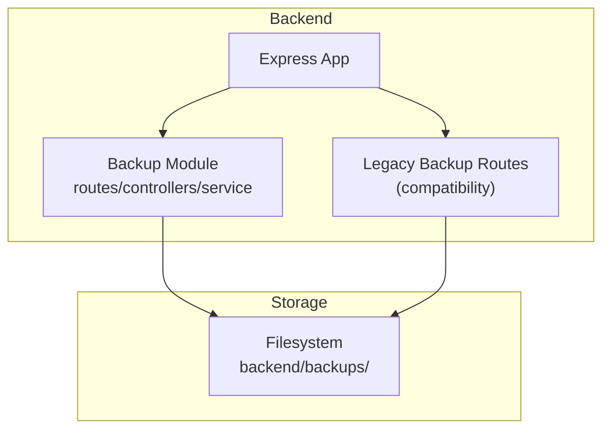
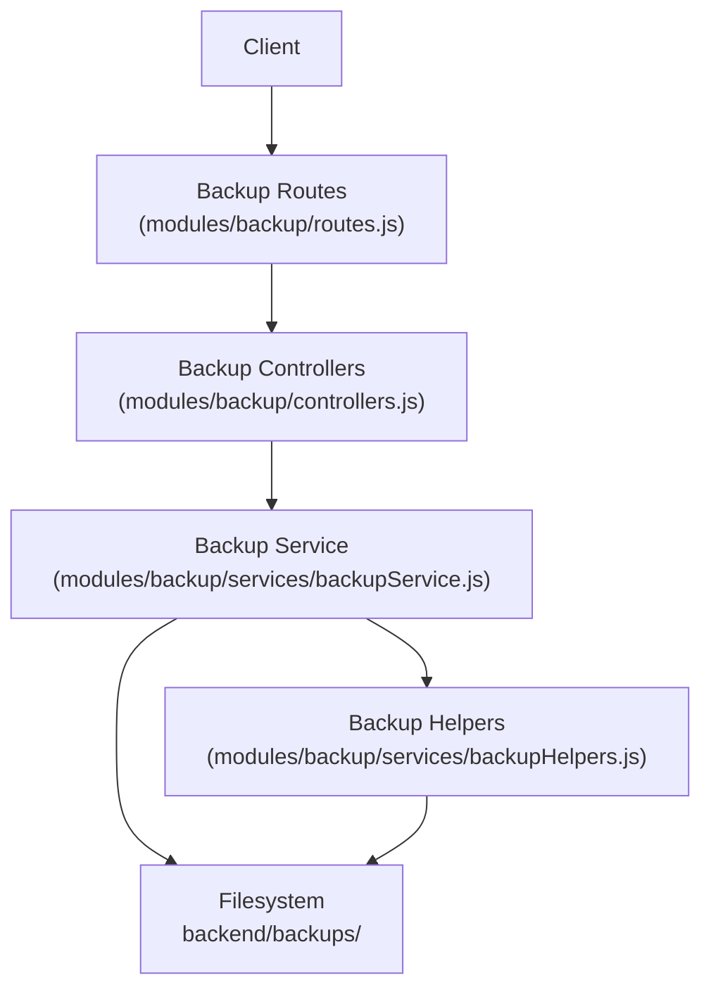
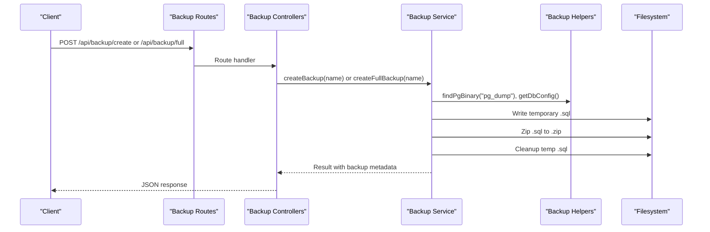
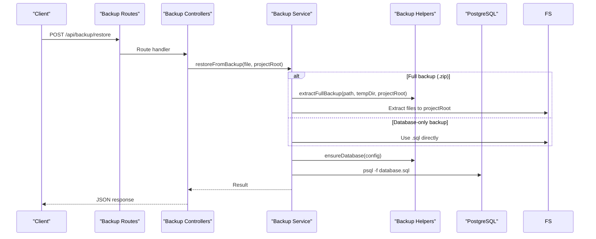
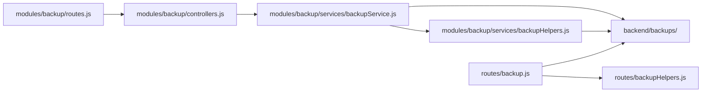

# Backup and Restore System

<cite>
**Referenced Files in This Document**
- [index.js](file://backend/modules/backup/index.js)
- [routes.js](file://backend/modules/backup/routes.js)
- [controllers.js](file://backend/modules/backup/controllers.js)
- [backupService.js](file://backend/modules/backup/services/backupService.js)
- [backupHelpers.js](file://backend/modules/backup/services/backupHelpers.js)
- [backup.js](file://backend/routes/backup.js)
- [backupHelpers.js](file://backend/routes/backupHelpers.js)
- [BACKUP_API.md](file://docs/backend/BACKUP_API.md)
- [RESTORE_GUIDE.md](file://docs/backend/RESTORE_GUIDE.md)
- [BACKUP.md](file://docs/api/BACKUP.md)
</cite>

## Table of Contents
1. [Introduction](#introduction)
2. [Project Structure](#project-structure)
3. [Core Components](#core-components)
4. [Architecture Overview](#architecture-overview)
5. [Detailed Component Analysis](#detailed-component-analysis)
6. [Dependency Analysis](#dependency-analysis)
7. [Performance Considerations](#performance-considerations)
8. [Troubleshooting Guide](#troubleshooting-guide)
9. [Conclusion](#conclusion)
10. [Appendices](#appendices)

## Introduction
This document describes the Titan CRM backup and restore system. It covers automated and manual backup procedures, backup file management, supported backup types, storage locations, retention and cleanup, restore processes (including point-in-time and selective restoration), verification and integrity checks, disaster recovery planning, and security/access controls. The system supports database-only backups and full backups (database plus project files), and provides both API-driven and command-line restoration workflows.

## Project Structure
The backup and restore system is implemented as:
- A dedicated Express module under backend/modules/backup with routes, controllers, and service logic
- Legacy routes and helpers under backend/routes/backup for backward compatibility
- Documentation under docs/backend and docs/api describing API usage and restore procedures

**Diagram sources**
- [index.js:8-17](file://backend/modules/backup/index.js#L8-L17)
- [routes.js:1-49](file://backend/modules/backup/routes.js#L1-L48)
- [backup.js:13-14](file://backend/modules/backup/routes.js#L13-L14)

**Section sources**
- [index.js:1-18](file://backend/modules/backup/index.js#L1-L17)
- [routes.js:1-49](file://backend/modules/backup/routes.js#L1-L48)
- [backup.js:1-335](file://backend/modules/backup/routes.js#L1-L48)

## Core Components
- Backup API module: Provides endpoints for creating database-only backups, full backups (database + project files), listing, downloading, and deleting backups.
- Backup service: Implements the core logic for creating backups, restoring from backups, and managing backup files.
- Backup helpers: Handles PostgreSQL binary discovery, database configuration retrieval, archive extraction, and database existence checks.
- Legacy routes: Compatibility layer for older usage patterns.

Key responsibilities:
- Backup creation: Uses pg_dump to generate SQL dumps, zips them, and stores them in backend/backups/.
- Full backup creation: Adds project files to the archive while excluding unnecessary directories.
- Restore: Supports both API-triggered and direct restoration via psql, with automatic database creation if missing.
- File management: Listing, deletion, and download of backup archives.

**Section sources**
- [controllers.js:1-105](file://backend/modules/backup/controllers.js#L1-L104)
- [backupService.js:1-362](file://backend/modules/backup/services/backupService.js#L1-L361)
- [backupHelpers.js:1-307](file://backend/modules/backup/services/backupHelpers.js#L1-L306)
- [backup.js:53-332](file://backend/modules/backup/routes.js#L1-L48)

## Architecture Overview
The backup system consists of:
- HTTP API layer (Express routers and controllers)
- Business logic (service functions)
- Helper utilities (PostgreSQL binary detection, extraction, database ensure)
- Storage (ZIP archives in backend/backups/)

**Diagram sources**
- [routes.js:1-49](file://backend/modules/backup/routes.js#L1-L48)
- [controllers.js:1-105](file://backend/modules/backup/controllers.js#L1-L104)
- [backupService.js:1-362](file://backend/modules/backup/services/backupService.js#L1-L361)
- [backupHelpers.js:1-307](file://backend/modules/backup/services/backupHelpers.js#L1-L306)

## Detailed Component Analysis

### Backup Types and Use Cases
- Database-only backup (.zip containing .sql): Best for quick database snapshots, minimal storage, and environment migrations.
- Full backup (.zip containing database.sql and project files): Best for complete system restoration, including code, configuration, and uploads.

Supported backup types and behaviors:
- Database-only: Creates a .sql via pg_dump and zips it.
- Full backup: Creates a .sql via pg_dump, adds project files (excluding ignored patterns), and optionally includes a bootstrap script for restoration.

Retention and cleanup:
- No built-in retention policy or automatic cleanup is implemented in the codebase. Administrators should manage retention externally (e.g., cron jobs or OS-level retention).

**Section sources**
- [backupService.js:57-78](file://backend/modules/backup/services/backupService.js#L57-L78)
- [backupService.js:83-209](file://backend/modules/backup/services/backupService.js#L83-L209)
- [backup.js:206-332](file://backend/modules/backup/routes.js#L1-L48)

### Backup Storage Locations
- Default storage directory: backend/backups/
- Backups are stored as ZIP archives named with timestamps and suffixed appropriately for database-only or full backups.

**Section sources**
- [backupService.js:13-18](file://backend/modules/backup/services/backupService.js#L13-L18)
- [backup.js:13-14](file://backend/modules/backup/routes.js#L13-L14)

### Backup Creation Workflow

**Diagram sources**
- [routes.js:16-31](file://backend/modules/backup/routes.js#L16-L31)
- [controllers.js:10-36](file://backend/modules/backup/controllers.js#L10-L36)
- [backupService.js:23-78](file://backend/modules/backup/services/backupService.js#L23-L78)
- [backupService.js:83-209](file://backend/modules/backup/services/backupService.js#L83-L209)
- [backupHelpers.js:21-65](file://backend/modules/backup/services/backupHelpers.js#L21-L65)
- [backupHelpers.js:92-117](file://backend/modules/backup/services/backupHelpers.js#L92-L117)

### Restore Workflow

**Diagram sources**
- [routes.js:28-31](file://backend/modules/backup/routes.js#L28-L31)
- [controllers.js:40-56](file://backend/modules/backup/controllers.js#L40-L56)
- [backupService.js:214-297](file://backend/modules/backup/services/backupService.js#L214-L297)
- [backupHelpers.js:182-268](file://backend/modules/backup/services/backupHelpers.js#L182-L268)
- [backupHelpers.js:275-297](file://backend/modules/backup/services/backupHelpers.js#L275-L297)

### Backup File Management
Operations:
- List backups: Returns metadata for .zip files in backend/backups/, sorted by creation time.
- Delete backup: Removes a specific .zip file.
- Download backup: Streams a .zip file for download.

**Section sources**
- [controllers.js:58-95](file://backend/modules/backup/controllers.js#L58-L95)
- [backupService.js:302-341](file://backend/modules/backup/services/backupService.js#L302-L341)
- [backupService.js:345-351](file://backend/modules/backup/services/backupService.js#L345-L351)

### Point-in-Time Recovery and Selective Restoration
- Point-in-time recovery: Not implemented in the current system. Restores use the selected backup file’s database state at the time the backup was created.
- Selective restoration: The system restores the entire database and project files contained in the archive. There is no built-in mechanism to selectively restore subsets of data or files.

**Section sources**
- [backupService.js:214-297](file://backend/modules/backup/services/backupService.js#L214-L297)
- [backupHelpers.js:182-268](file://backend/modules/backup/services/backupHelpers.js#L182-L268)

### Backup Verification and Integrity Checks
- Integrity checks are not explicitly implemented in the codebase. Recommended practices:
  - Verify backup creation by checking backend/backups/ for the expected .zip file and metadata.
  - Test restore on a staging environment before applying to production.
  - Confirm database connectivity and PostgreSQL availability prior to restore.

**Section sources**
- [backupService.js:23-52](file://backend/modules/backup/services/backupService.js#L23-L52)
- [backupService.js:214-297](file://backend/modules/backup/services/backupService.js#L214-L297)

### Disaster Recovery Planning
- Use full backups for complete system recovery, including code and uploads.
- Maintain offsite copies of backups for disaster recovery.
- Automate periodic full backups and verify restore procedures regularly.

[No sources needed since this section provides general guidance]

### Security and Access Controls
- PostgreSQL credentials are read from the application database pool or environment variables. Ensure secure handling of DB credentials.
- The restore process executes psql against the configured database; restrict access to restore operations to authorized administrators.
- Store backups securely and limit filesystem access to the backend/backups/ directory.

**Section sources**
- [backupHelpers.js:92-117](file://backend/modules/backup/services/backupHelpers.js#L92-L117)
- [backup.js:92-124](file://backend/modules/backup/routes.js#L1-L48)

## Dependency Analysis

**Diagram sources**
- [routes.js:1-49](file://backend/modules/backup/routes.js#L1-L48)
- [controllers.js:1-105](file://backend/modules/backup/controllers.js#L1-L104)
- [backupService.js:1-362](file://backend/modules/backup/services/backupService.js#L1-L361)
- [backupHelpers.js:1-307](file://backend/modules/backup/services/backupHelpers.js#L1-L306)
- [backup.js:1-335](file://backend/modules/backup/routes.js#L1-L48)
- [backupHelpers.js:1-271](file://backend/modules/backup/services/backupHelpers.js#L1-L271)

**Section sources**
- [routes.js:1-49](file://backend/modules/backup/routes.js#L1-L48)
- [backupService.js:1-362](file://backend/modules/backup/services/backupService.js#L1-L361)
- [backup.js:1-335](file://backend/modules/backup/routes.js#L1-L48)

## Performance Considerations
- Full backups include many project files; exclude unnecessary directories to reduce size and time.
- Compression level is set to maximum; expect slower compression but smaller archives.
- Long-running operations (full backup) increase HTTP timeout; ensure client-side handling for extended requests.

**Section sources**
- [backupService.js:102-184](file://backend/modules/backup/services/backupService.js#L102-L184)
- [backup.js:208-310](file://backend/modules/backup/routes.js#L1-L48)

## Troubleshooting Guide
Common issues and resolutions:
- PostgreSQL binaries not found: Set PG_DUMP_PATH and PSQL_PATH environment variables or ensure PostgreSQL is installed and in PATH.
- Permission denied during restore: Verify database user privileges and that the database is reachable.
- SQL file not found in archive: Ensure the archive is a valid full or database-only backup and contains the expected .sql file.
- Temporary directories not cleaned up (Windows): Manually remove backend/backups/temp-* after restore completes.

**Section sources**
- [BACKUP_API.md:171-179](file://docs/backend/BACKUP_API.md#L171-L178)
- [RESTORE_GUIDE.md:160-211](file://docs/backend/RESTORE_GUIDE.md#L160-L211)
- [backupHelpers.js:21-65](file://backend/modules/backup/services/backupHelpers.js#L21-L65)
- [backupService.js:214-297](file://backend/modules/backup/services/backupService.js#L214-L297)

## Conclusion
Titan CRM provides a robust, PostgreSQL-backed backup and restore system supporting database-only and full backups. While the system lacks built-in retention/cleanup and point-in-time recovery, it offers reliable API-driven and direct restoration workflows. Administrators should implement external retention policies, secure backup storage, and regular restore testing to ensure effective disaster recovery.

[No sources needed since this section summarizes without analyzing specific files]

## Appendices

### Step-by-Step Procedures

- Automated backup scheduling
  - Use external scheduling tools (cron, Task Scheduler) to periodically call the backup endpoints or scripts.
  - Full backups: POST /api/backup/full with a descriptive name.
  - Database-only backups: POST /api/backup/create with a descriptive name.
  - Reference: [BACKUP.md:11-199](file://docs/api/BACKUP.md#L11-L198), [BACKUP_API.md:22-54](file://docs/backend/BACKUP_API.md#L22-L54)

- Manual backup procedures
  - Create a database-only backup: POST /api/backup/create with optional name.
  - Create a full backup: POST /api/backup/full with optional name.
  - List backups: GET /api/backup/list.
  - Download a backup: GET /api/backup/download/:file.
  - Delete a backup: DELETE /api/backup/:file.
  - Reference: [BACKUP.md:11-199](file://docs/api/BACKUP.md#L11-L198), [BACKUP_API.md:88-153](file://docs/backend/BACKUP_API.md#L88-L153)

- Backup file management
  - Storage location: backend/backups/.
  - List and delete backups via API endpoints.
  - Reference: [backupService.js:302-341](file://backend/modules/backup/services/backupService.js#L302-L341)

- Restore procedures
  - API restore: POST /api/backup/restore with file parameter.
  - Direct restore (no running backend): Use restore scripts described in the restore guide.
  - Reference: [RESTORE_GUIDE.md:43-128](file://docs/backend/RESTORE_GUIDE.md#L43-L128)

- Point-in-time recovery and selective restoration
  - Not implemented. Restore uses the selected backup’s database state at creation time.
  - Reference: [backupService.js:214-297](file://backend/modules/backup/services/backupService.js#L214-L297)

- Backup verification and integrity checks
  - Verify presence of .zip in backend/backups/.
  - Test restore on a staging environment.
  - Reference: [backupService.js:23-52](file://backend/modules/backup/services/backupService.js#L23-L52)

- Disaster recovery planning
  - Maintain offsite backups.
  - Automate periodic full backups and test restore procedures.
  - Reference: [RESTORE_GUIDE.md:236-288](file://docs/backend/RESTORE_GUIDE.md#L236-L287)

- Security and access controls
  - Secure DB credentials and limit access to restore operations.
  - Store backups securely and restrict filesystem access to backend/backups/.
  - Reference: [backupHelpers.js:92-117](file://backend/modules/backup/services/backupHelpers.js#L92-L117)