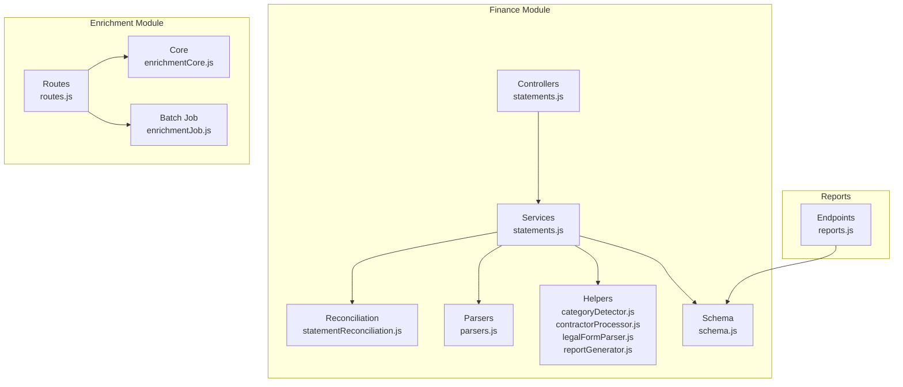
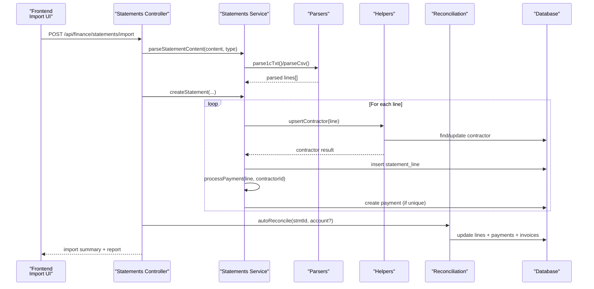
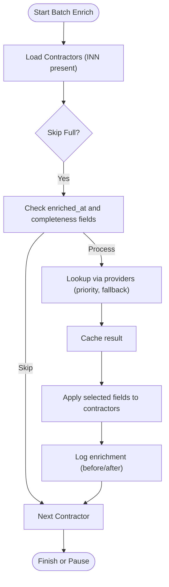
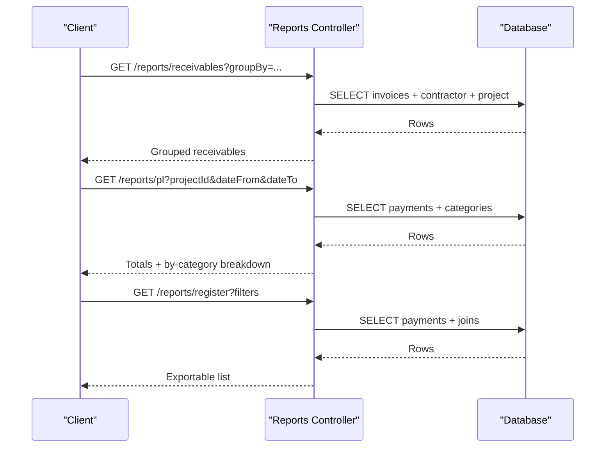
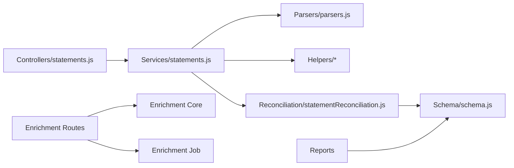

# Data Import and Export

<cite>
**Referenced Files in This Document**
- [statements.js](file://backend/modules/finance/controllers/statements.js)
- [statements.js](file://backend/modules/finance/services/statements.js)
- [statementReconciliation.js](file://backend/modules/finance/services/statementReconciliation.js)
- [parsers.js](file://backend/modules/finance/parsers.js)
- [categoryDetector.js](file://backend/modules/finance/statementHelpers/categoryDetector.js)
- [contractorProcessor.js](file://backend/modules/finance/statementHelpers/contractorProcessor.js)
- [legalFormParser.js](file://backend/modules/finance/statementHelpers/legalFormParser.js)
- [reportGenerator.js](file://backend/modules/finance/statementHelpers/reportGenerator.js)
- [reports.js](file://backend/modules/finance/reports.js)
- [schema.js](file://backend/modules/finance/schema.js)
- [db-structure.json](file://backend/config/db-structure.json)
- [enrichmentCore.js](file://backend/modules/enrichment/services/enrichmentCore.js)
- [enrichmentJob.js](file://backend/modules/enrichment/services/enrichmentJob.js)
- [routes.js](file://backend/modules/enrichment/routes.js)
- [audit_log_table.sql](file://backend/migrations/102_create_audit_log_table.sql)
- [audit_log_migration.js](file://backend/migrations/2026-05-04-01-create-audit-log.js)
- [ImportStatementAction.tsx](file://frontend/src/modules/finance/components/ImportStatementAction.tsx)
</cite>

## Table of Contents
1. [Introduction](#introduction)
2. [Project Structure](#project-structure)
3. [Core Components](#core-components)
4. [Architecture Overview](#architecture-overview)
5. [Detailed Component Analysis](#detailed-component-analysis)
6. [Dependency Analysis](#dependency-analysis)
7. [Performance Considerations](#performance-considerations)
8. [Troubleshooting Guide](#troubleshooting-guide)
9. [Conclusion](#conclusion)
10. [Appendices](#appendices)

## Introduction
This document describes the data import and export capabilities in Titan CRM with a focus on financial statement imports, contractor enrichment, and reporting. It covers supported formats, mapping to database tables, validation and transformation rules, duplicate detection, reconciliation, batch processing, and audit trails. It also outlines export endpoints for generating financial reports and exporting data for external systems.

## Project Structure
The import/export functionality spans the Finance module’s controllers, services, parsers, helpers, and reconciliation logic, plus the Enrichment module for contractor data augmentation. Reports are exposed via dedicated endpoints.

**Diagram sources**
- [statements.js:1-207](file://backend/modules/finance/controllers/statements/index.js#L1-L22)
- [statements.js:1-342](file://backend/modules/finance/services/statements.js#L1-L92)
- [statementReconciliation.js:1-363](file://backend/modules/finance/services/statementReconciliation.js#L1-L116)
- [parsers.js:1-251](file://backend/modules/finance/parsers.js#L1-L207)
- [categoryDetector.js:1-69](file://backend/modules/finance/statementHelpers/categoryDetector.js#L1-L68)
- [contractorProcessor.js:1-193](file://backend/modules/finance/statementHelpers/contractorProcessor.js#L1-L192)
- [legalFormParser.js:1-84](file://backend/modules/finance/statementHelpers/legalFormParser.js#L1-L83)
- [reportGenerator.js:1-121](file://backend/modules/finance/statementHelpers/reportGenerator.js#L1-L120)
- [schema.js:1-201](file://backend/modules/finance/schema.js#L1-L200)
- [enrichmentCore.js:1-441](file://backend/modules/enrichment/services/enrichmentCore.js#L1-L428)
- [enrichmentJob.js:1-154](file://backend/modules/enrichment/services/enrichmentJob.js#L1-L153)
- [routes.js:1-387](file://backend/modules/enrichment/routes.js#L1-L386)
- [reports.js:1-221](file://backend/modules/finance/reports.js#L1-L221)

**Section sources**
- [statements.js:1-207](file://backend/modules/finance/controllers/statements/index.js#L1-L22)
- [statements.js:1-342](file://backend/modules/finance/services/statements.js#L1-L92)
- [schema.js:1-201](file://backend/modules/finance/schema.js#L1-L200)

## Core Components
- Statement import controller and service orchestrate parsing, validation, contractor creation/updating, payment creation, reconciliation, and reporting.
- Parsers support CSV and 1CClientBankExchange (1C) text formats.
- Helpers detect categories, process contractor records, and generate import reports.
- Reconciliation service matches statement lines to invoices and creates payments automatically.
- Enrichment module augments contractor data from multiple providers and supports batch jobs with progress tracking.
- Reporting endpoints expose receivables, profit & loss, cash flow, and payment register exports.

**Section sources**
- [statements.js:45-150](file://backend/modules/finance/controllers/statements/index.js#L1-L22)
- [statements.js:65-194](file://backend/modules/finance/services/statements.js#L65-L92)
- [parsers.js:84-251](file://backend/modules/finance/parsers.js#L84-L207)
- [categoryDetector.js:13-64](file://backend/modules/finance/statementHelpers/categoryDetector.js#L13-L64)
- [contractorProcessor.js:32-187](file://backend/modules/finance/statementHelpers/contractorProcessor.js#L32-L187)
- [statementReconciliation.js:16-109](file://backend/modules/finance/services/statementReconciliation.js#L16-L109)
- [enrichmentCore.js:216-309](file://backend/modules/enrichment/services/enrichmentCore.js#L216-L309)
- [enrichmentJob.js:46-151](file://backend/modules/enrichment/services/enrichmentJob.js#L46-L151)
- [reports.js:11-218](file://backend/modules/finance/reports.js#L11-L218)

## Architecture Overview
End-to-end import flow for bank statements:

**Diagram sources**
- [statements.js:45-150](file://backend/modules/finance/controllers/statements/index.js#L1-L22)
- [statements.js:65-194](file://backend/modules/finance/services/statements.js#L65-L92)
- [parsers.js:84-251](file://backend/modules/finance/parsers.js#L84-L207)
- [contractorProcessor.js:32-187](file://backend/modules/finance/statementHelpers/contractorProcessor.js#L32-L187)
- [statementReconciliation.js:16-109](file://backend/modules/finance/services/statementReconciliation.js#L16-L109)

## Detailed Component Analysis

### Supported Import Formats and Mapping
- Formats:
  - CSV: Generic columns for date, amount, direction, counterparty, purpose, reference.
  - 1CClientBankExchange (.txt): Structured fields with payer/recipient details and purpose concatenation.
- Mapping to database:
  - finance_bank_statements: header-level metadata (file_name, import_type, account, date_from, date_to, totals).
  - finance_statement_lines: per-line details (line_date, amount, direction, counterparty, purpose, reference, contractor_id, category_id, invoice_id, payment_id, reconcile_status).
  - finance_payments: created automatically for unique lines; linked to invoices when reconciled.
  - finance_invoices: reconciled against credit lines to create payments.

**Section sources**
- [parsers.js:84-251](file://backend/modules/finance/parsers.js#L84-L207)
- [statements.js:111-129](file://backend/modules/finance/services/statements.js#L92)
- [schema.js:143-195](file://backend/modules/finance/schema.js#L143-L195)
- [db-structure.json:549-600](file://backend/config/db-structure.json#L549-L600)

### Import Validation and Transformation Rules
- Date normalization and numeric conversion ensure consistent ingestion.
- Direction detection:
  - Credit vs debit inferred from 1C fields and CSV direction keywords.
- VAT extraction from purpose text for structured tax handling.
- Legal form parsing and contractor type detection improve contractor classification.
- Category detection:
  - Automatic categorization by purpose keywords and direction.
  - Income defaults to client receipts; expenses mapped to predefined categories.

**Section sources**
- [utils.js:5-31](file://backend/modules/finance/utils.js#L5-L31)
- [parsers.js:49-77](file://backend/modules/finance/parsers.js#L49-L77)
- [legalFormParser.js:11-77](file://backend/modules/finance/statementHelpers/legalFormParser.js#L11-L77)
- [categoryDetector.js:13-64](file://backend/modules/finance/statementHelpers/categoryDetector.js#L13-L64)

### Duplicate Detection and Conflict Resolution
- Payment uniqueness:
  - Duplicate check compares amount, date, contractor, and kind (income/expense).
  - On match, existing payment is reused and line reconciled; new payment creation is skipped.
- Invoice linking:
  - Auto-reconciliation matches by amount due and optional counterparty filter.
  - Manual assignment prevents cross-linking by unlinking invoice from other lines before reassignment.
- Contractor identity:
  - Search by INN first; if not found, search by cleaned name; create if neither exists.
  - Warn on conflicting INNs for the same name to prevent duplicates.

**Section sources**
- [statements.js:204-319](file://backend/modules/finance/services/statements.js#L92)
- [statementReconciliation.js:16-109](file://backend/modules/finance/services/statementReconciliation.js#L16-L109)
- [contractorProcessor.js:53-127](file://backend/modules/finance/statementHelpers/contractorProcessor.js#L53-L127)

### Contractor Data Enrichment System
- Providers:
  - Priority provider configured via module settings; fallback to official egrul.nalog.ru.
- Fields mapped to contractors table:
  - Name/full_name, INN, OGRN, KPP, legal_address, director, director_position, registration_date, legal_form, legal_entity_type, tax_regime_id, phone, email, website, OKVED/OKVED name, authorized_capital, is_active, status, manager.
- Business rules:
  - Manager field is preserved if already set; otherwise filled by current user.
  - Derived fields computed (status, legal entity type, tax regime) based on enriched data.
- Batch enrichment:
  - Progress tracking, pause/resume, skip already-enriched or sufficiently complete contractors.
  - Logs enrichment attempts and applied changes.

**Diagram sources**
- [enrichmentJob.js:46-151](file://backend/modules/enrichment/services/enrichmentJob.js#L46-L151)
- [enrichmentCore.js:216-309](file://backend/modules/enrichment/services/enrichmentCore.js#L216-L309)
- [routes.js:156-323](file://backend/modules/enrichment/routes.js#L156-L323)

**Section sources**
- [enrichmentCore.js:314-440](file://backend/modules/enrichment/services/enrichmentCore.js#L314-L428)
- [enrichmentJob.js:11-17](file://backend/modules/enrichment/services/enrichmentJob.js#L11-L17)
- [routes.js:156-323](file://backend/modules/enrichment/routes.js#L156-L323)

### Export Functionality and Reports
- Receivables report: grouped by contractor/project with overdue metrics.
- Profit & Loss: categorized income/expense over a date range.
- Cash flow (DDS): aggregated by category and kind.
- Payment register: exportable list with filtering by kind, contractor, project, and date range.

**Diagram sources**
- [reports.js:11-218](file://backend/modules/finance/reports.js#L11-L218)

**Section sources**
- [reports.js:11-218](file://backend/modules/finance/reports.js#L11-L218)

### Frontend Import Experience
- File selection detects type by extension (.txt or containing “1c”) and decodes content accordingly.
- Preview mode allows reviewing parsed lines and summary before committing import.
- Account extraction from filename assists reconciliation.

**Section sources**
- [ImportStatementAction.tsx:28-62](file://frontend/src/modules/finance/components/ImportStatementAction.tsx#L28-L62)

## Dependency Analysis
- Controllers depend on services for orchestration and on helpers for domain logic.
- Services depend on parsers for content ingestion, helpers for contractor/category logic, and reconciliation for matching.
- Reconciliation depends on invoices and payments to maintain financial consistency.
- Enrichment routes depend on core enrichment service and batch job runner.
- Reports depend on schema tables and join with categories, projects, and contractors.

**Diagram sources**
- [statements.js:1-207](file://backend/modules/finance/controllers/statements/index.js#L1-L22)
- [statements.js:1-342](file://backend/modules/finance/services/statements.js#L1-L92)
- [parsers.js:1-251](file://backend/modules/finance/parsers.js#L1-L207)
- [statementReconciliation.js:1-363](file://backend/modules/finance/services/statementReconciliation.js#L1-L116)
- [schema.js:1-201](file://backend/modules/finance/schema.js#L1-L200)
- [routes.js:1-387](file://backend/modules/enrichment/routes.js#L1-L386)
- [enrichmentCore.js:1-441](file://backend/modules/enrichment/services/enrichmentCore.js#L1-L428)
- [enrichmentJob.js:1-154](file://backend/modules/enrichment/services/enrichmentJob.js#L1-L153)
- [reports.js:1-221](file://backend/modules/finance/reports.js#L1-L221)

**Section sources**
- [statements.js:1-207](file://backend/modules/finance/controllers/statements/index.js#L1-L22)
- [statements.js:1-342](file://backend/modules/finance/services/statements.js#L1-L92)
- [statementReconciliation.js:1-363](file://backend/modules/finance/services/statementReconciliation.js#L1-L116)
- [schema.js:1-201](file://backend/modules/finance/schema.js#L1-L200)
- [routes.js:1-387](file://backend/modules/enrichment/routes.js#L1-L386)
- [enrichmentCore.js:1-441](file://backend/modules/enrichment/services/enrichmentCore.js#L1-L428)
- [enrichmentJob.js:1-154](file://backend/modules/enrichment/services/enrichmentJob.js#L1-L153)
- [reports.js:1-221](file://backend/modules/finance/reports.js#L1-L221)

## Performance Considerations
- Batch processing:
  - Statement import processes lines sequentially but leverages database transactions and minimal round-trips per line.
  - Enrichment batch job supports pause/resume and progress tracking; includes small delays to avoid throttling provider APIs.
- Indexes and queries:
  - Reconciliation filters use appropriate conditions to limit scanned lines.
  - Reports use selective WHERE clauses and grouping to reduce result sizes.
- Memory and throughput:
  - CSV parsing reads line-by-line; 1C parsing handles multi-line continuation and concatenates purpose text.
  - Payment creation checks for duplicates before inserts.

[No sources needed since this section provides general guidance]

## Troubleshooting Guide
- Import fails with empty lines:
  - Ensure content is not empty and import type matches file extension.
- No valid lines parsed:
  - Verify CSV headers or 1C structure; confirm date/amount fields are present and formatted correctly.
- Duplicate payments:
  - Existing payments prevent new ones; review reconciliation status and manual assignments.
- Contractor conflicts:
  - Warnings indicate different INNs for the same name; investigate and merge manually.
- Enrichment errors:
  - Provider failures are logged; check module settings for API keys and retry after pausing/resuming the batch job.
- Audit trail:
  - General audit logging exists for administrative actions; enrichment changes are logged in the enrichment log table.

**Section sources**
- [statements.js:48-57](file://backend/modules/finance/controllers/statements/index.js#L1-L22)
- [statements.js:204-319](file://backend/modules/finance/services/statements.js#L92)
- [contractorProcessor.js:119-125](file://backend/modules/finance/statementHelpers/contractorProcessor.js#L119-L125)
- [routes.js:199-202](file://backend/modules/enrichment/routes.js#L199-L202)
- [audit_log_table.sql:4-19](file://backend/migrations/102_create_audit_log_table.sql#L4-L19)
- [audit_log_migration.js:43-99](file://backend/migrations/2026-05-04-01-create-audit-log.js#L43-L99)

## Conclusion
Titan CRM provides robust financial statement import with strong validation, deduplication, and reconciliation, alongside contractor enrichment and comprehensive reporting. The system supports CSV and 1C formats, maps cleanly to relational tables, and offers batch processing with progress tracking and audit logging for transparency.

[No sources needed since this section summarizes without analyzing specific files]

## Appendices

### Common Import Scenarios
- Bank statement imports:
  - Upload CSV or 1C file; preview before import; auto-create contractors, categories, and payments; reconcile against invoices.
- Contractor data enrichment:
  - Single lookup by INN or batch job to enrich multiple contractors; selectively apply fields and track changes.
- Financial transaction imports:
  - Automatically create payments and link to invoices; handle duplicates and manual overrides.

**Section sources**
- [statements.js:45-150](file://backend/modules/finance/controllers/statements/index.js#L1-L22)
- [statements.js:138-194](file://backend/modules/finance/services/statements.js#L92)
- [enrichmentCore.js:216-309](file://backend/modules/enrichment/services/enrichmentCore.js#L216-L309)
- [routes.js:156-323](file://backend/modules/enrichment/routes.js#L156-L323)