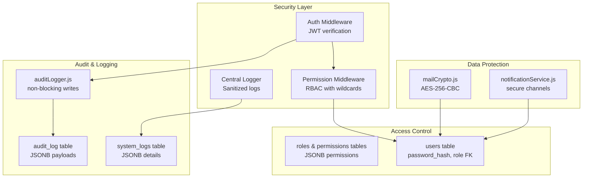
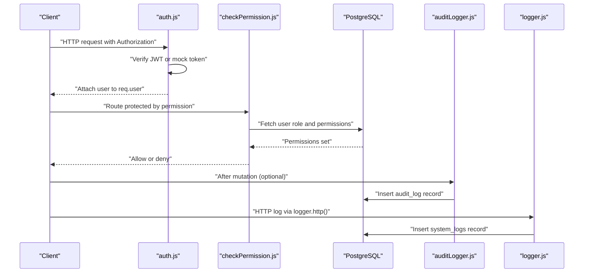
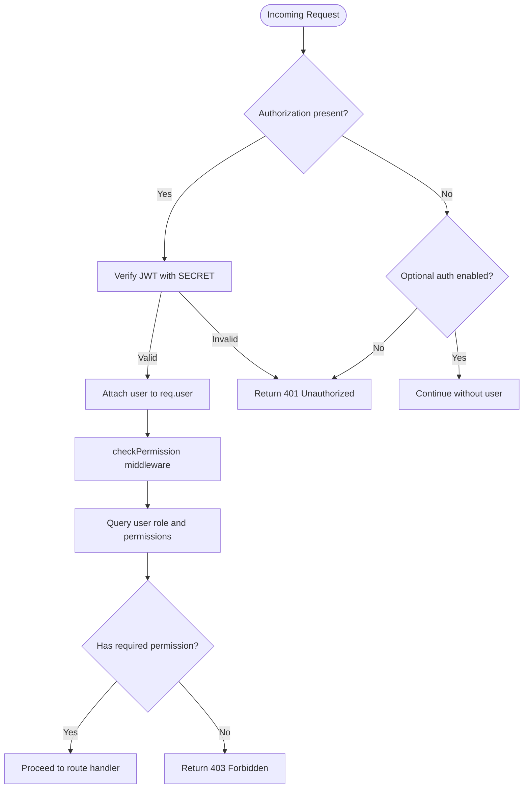
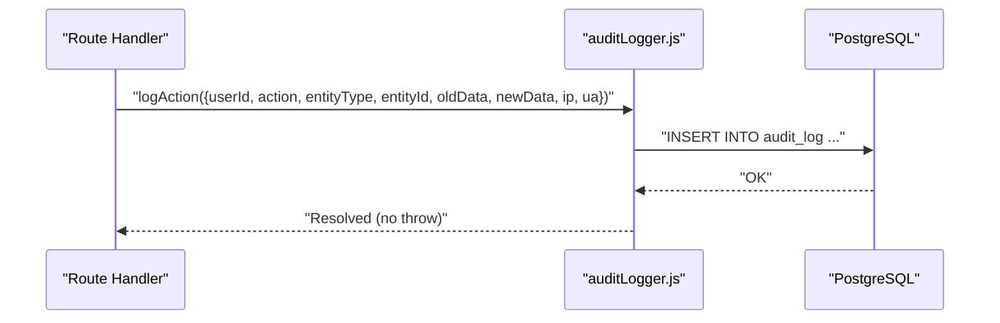
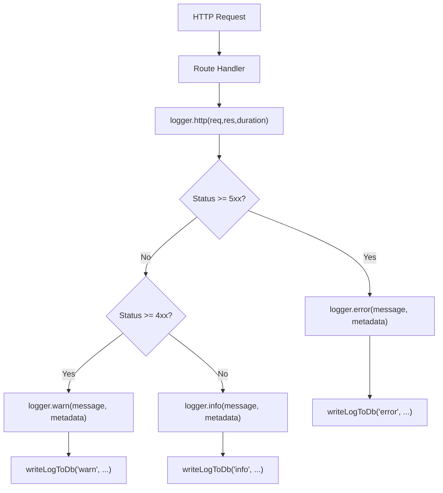
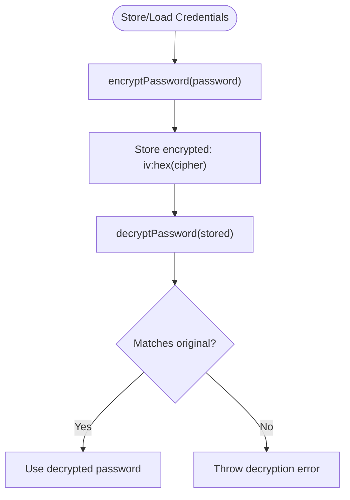
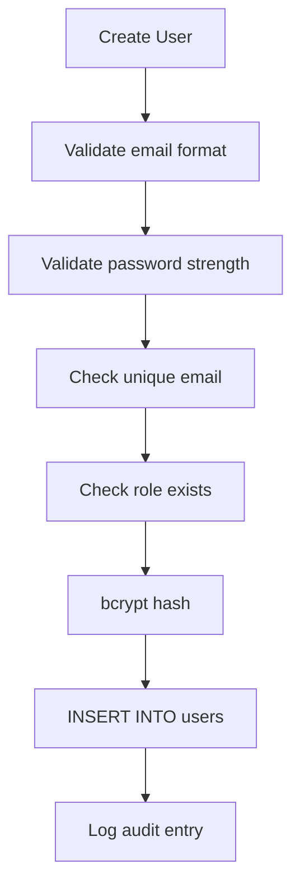
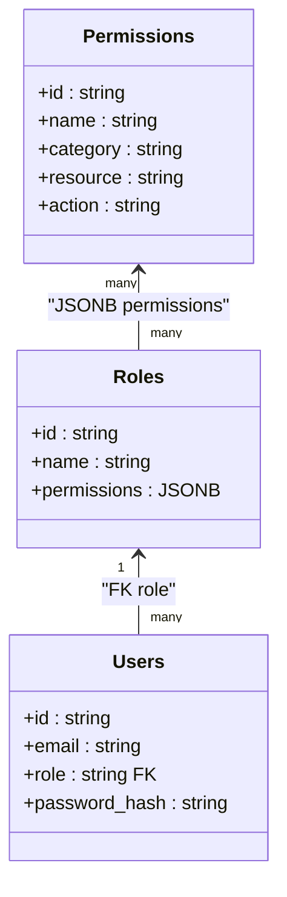
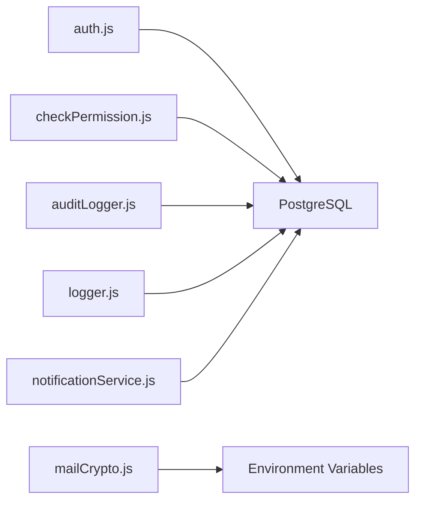

# Data Integrity and Security

<cite>
**Referenced Files in This Document**
- [db-structure.json](file://backend/config/db-structure.json)
- [102_create_audit_log_table.sql](file://backend/migrations/102_create_audit_log_table.sql)
- [auditLogger.js](file://backend/utils/auditLogger.js)
- [auth.js](file://backend/middleware/auth.js)
- [checkPermission.js](file://backend/middleware/checkPermission.js)
- [logger.js](file://backend/utils/logger.js)
- [13_create_system_logs_table.sql](file://backend/migrations/13_create_system_logs_table.sql)
- [authService.js](file://backend/modules/auth/services/authService.js)
- [mailCrypto.js](file://backend/utils/mailCrypto.js)
- [26_create_roles_and_permissions_tables.md](file://backend/migrations/26_create_roles_and_permissions_tables.md)
- [userService.js](file://backend/modules/administration/services/userService.js)
- [notificationService.js](file://backend/utils/notificationService.js)
</cite>

## Table of Contents
1. [Introduction](#introduction)
2. [Project Structure](#project-structure)
3. [Core Components](#core-components)
4. [Architecture Overview](#architecture-overview)
5. [Detailed Component Analysis](#detailed-component-analysis)
6. [Dependency Analysis](#dependency-analysis)
7. [Performance Considerations](#performance-considerations)
8. [Troubleshooting Guide](#troubleshooting-guide)
9. [Conclusion](#conclusion)
10. [Appendices](#appendices)

## Introduction
This document provides comprehensive data integrity and security documentation for Titan CRM. It covers database-level validation and constraints, audit logging, encryption strategies, secure connection protocols, access control, data masking, retention and cleanup, monitoring and alerting, and operational guidelines to maintain data quality and referential integrity across the system.

## Project Structure
Titan CRM’s backend implements robust data integrity and security controls through:
- Database schema definitions and migration-driven enforcement
- Centralized logging and audit systems
- Authentication and authorization middleware
- Data masking utilities
- Encrypted storage for sensitive configuration values
- Notification service integration for secure communications

**Diagram sources**
- [auth.js:1-82](file://backend/middleware/auth.js#L1-L81)
- [checkPermission.js:1-130](file://backend/middleware/checkPermission.js#L1-L129)
- [logger.js:1-319](file://backend/utils/logger.js#L1-L318)
- [102_create_audit_log_table.sql:1-21](file://backend/migrations/102_create_audit_log_table.sql#L1-L20)
- [13_create_system_logs_table.sql:1-16](file://backend/migrations/13_create_system_logs_table.sql#L1-L15)
- [auditLogger.js:1-52](file://backend/utils/auditLogger.js#L1-L51)
- [mailCrypto.js:1-126](file://backend/utils/mailCrypto.js#L1-L125)
- [notificationService.js:1-83](file://backend/utils/notificationService.js#L1-L82)
- [26_create_roles_and_permissions_tables.md:1-61](file://backend/migrations/26_create_roles_and_permissions_tables.md#L1-L60)
- [users table definition:1-200](file://backend/config/db-structure.json#L1-L200)

**Section sources**
- [db-structure.json:1-200](file://backend/config/db-structure.json#L1-L200)
- [102_create_audit_log_table.sql:1-21](file://backend/migrations/102_create_audit_log_table.sql#L1-L20)
- [13_create_system_logs_table.sql:1-16](file://backend/migrations/13_create_system_logs_table.sql#L1-L15)
- [auth.js:1-82](file://backend/middleware/auth.js#L1-L81)
- [checkPermission.js:1-130](file://backend/middleware/checkPermission.js#L1-L129)
- [logger.js:1-319](file://backend/utils/logger.js#L1-L318)
- [auditLogger.js:1-52](file://backend/utils/auditLogger.js#L1-L51)
- [mailCrypto.js:1-126](file://backend/utils/mailCrypto.js#L1-L125)
- [notificationService.js:1-83](file://backend/utils/notificationService.js#L1-L82)
- [26_create_roles_and_permissions_tables.md:1-61](file://backend/migrations/26_create_roles_and_permissions_tables.md#L1-L60)

## Core Components
- Authentication and Authorization
  - JWT-based authentication with optional development bypass and mock tokens
  - Role-based access control with wildcard permission checks
- Audit Logging
  - Non-blocking writes to audit_log with JSONB payloads for old/new data
  - Centralized system_logs for structured event logging
- Data Protection
  - AES-256-CBC encryption for sensitive mailbox credentials
  - Sanitized logging to redact sensitive fields
- Validation and Constraints
  - Database schema definitions and indexes
  - Module-level validators and service-layer checks

**Section sources**
- [auth.js:1-82](file://backend/middleware/auth.js#L1-L81)
- [checkPermission.js:1-130](file://backend/middleware/checkPermission.js#L1-L129)
- [auditLogger.js:1-52](file://backend/utils/auditLogger.js#L1-L51)
- [102_create_audit_log_table.sql:1-21](file://backend/migrations/102_create_audit_log_table.sql#L1-L20)
- [logger.js:1-319](file://backend/utils/logger.js#L1-L318)
- [13_create_system_logs_table.sql:1-16](file://backend/migrations/13_create_system_logs_table.sql#L1-L15)
- [mailCrypto.js:1-126](file://backend/utils/mailCrypto.js#L1-L125)

## Architecture Overview
The system enforces data integrity and security across three layers:
- Transport and Identity: JWT tokens and optional auth bypass
- Access Control: RBAC with wildcard permissions and dynamic permission retrieval
- Data Integrity: Audit logging, sanitized logs, encrypted storage, and centralized logging

**Diagram sources**
- [auth.js:1-82](file://backend/middleware/auth.js#L1-L81)
- [checkPermission.js:1-130](file://backend/middleware/checkPermission.js#L1-L129)
- [auditLogger.js:1-52](file://backend/utils/auditLogger.js#L1-L51)
- [logger.js:270-312](file://backend/utils/logger.js#L270-L312)
- [102_create_audit_log_table.sql:1-21](file://backend/migrations/102_create_audit_log_table.sql#L1-L20)
- [13_create_system_logs_table.sql:1-16](file://backend/migrations/13_create_system_logs_table.sql#L1-L15)

## Detailed Component Analysis

### Authentication and Authorization
- JWT verification with configurable secret; supports mock tokens for development
- Optional auth middleware allows requests without mandatory auth
- Permission middleware resolves user role and validates permissions with wildcard support

**Diagram sources**
- [auth.js:1-82](file://backend/middleware/auth.js#L1-L81)
- [checkPermission.js:1-130](file://backend/middleware/checkPermission.js#L1-L129)

**Section sources**
- [auth.js:1-82](file://backend/middleware/auth.js#L1-L81)
- [checkPermission.js:1-130](file://backend/middleware/checkPermission.js#L1-L129)
- [26_create_roles_and_permissions_tables.md:1-61](file://backend/migrations/26_create_roles_and_permissions_tables.md#L1-L60)

### Audit Logging
- Dedicated audit_log table with JSONB fields for old/new data snapshots
- Non-blocking insertion via auditLogger to avoid impacting request latency
- Indexes on user_id, entity_type+entity_id, and created_at for efficient queries

**Diagram sources**
- [auditLogger.js:16-47](file://backend/utils/auditLogger.js#L16-L47)
- [102_create_audit_log_table.sql:4-21](file://backend/migrations/102_create_audit_log_table.sql#L4-L20)

**Section sources**
- [auditLogger.js:1-52](file://backend/utils/auditLogger.js#L1-L51)
- [102_create_audit_log_table.sql:1-21](file://backend/migrations/102_create_audit_log_table.sql#L1-L20)

### System Logging and Monitoring
- Central logger writes to both filesystem and system_logs table
- Sanitization of sensitive fields (password, token, apiKey, etc.) before logging
- HTTP request logs capture method, path, status, duration, user agent, and IP

**Diagram sources**
- [logger.js:270-312](file://backend/utils/logger.js#L270-L312)
- [logger.js:62-80](file://backend/utils/logger.js#L62-L80)
- [13_create_system_logs_table.sql:4-16](file://backend/migrations/13_create_system_logs_table.sql#L4-L15)

**Section sources**
- [logger.js:1-319](file://backend/utils/logger.js#L1-L318)
- [13_create_system_logs_table.sql:1-16](file://backend/migrations/13_create_system_logs_table.sql#L1-L15)

### Data Protection and Encryption
- Mail module credentials are encrypted using AES-256-CBC with a deterministic key derived from environment variables
- Decryption supports legacy formats and fallback keys for backward compatibility
- Notification service reads secure settings from system_settings and sends messages via email or Telegram

**Diagram sources**
- [mailCrypto.js:41-112](file://backend/utils/mailCrypto.js#L41-L112)

**Section sources**
- [mailCrypto.js:1-126](file://backend/utils/mailCrypto.js#L1-L125)
- [notificationService.js:1-83](file://backend/utils/notificationService.js#L1-L82)

### Data Validation and Constraint Enforcement
- Database schema definitions define columns, nullability, defaults, and indexes
- Service-layer validations enforce business rules (e.g., email uniqueness, password strength, role existence)
- Module-specific validators ensure compliance with tax regimes and contractor limits

**Diagram sources**
- [userService.js:76-155](file://backend/modules/administration/services/userService.js#L76-L155)

**Section sources**
- [db-structure.json:1-200](file://backend/config/db-structure.json#L1-L200)
- [userService.js:18-49](file://backend/modules/administration/services/userService.js#L18-L49)
- [userService.js:76-155](file://backend/modules/administration/services/userService.js#L76-L155)

### Access Control Mechanisms
- Roles and permissions tables store JSONB permissions and default roles
- Permission middleware supports exact match, global wildcard, and resource-level wildcards
- Dynamic permission retrieval ensures up-to-date access decisions

**Diagram sources**
- [26_create_roles_and_permissions_tables.md:9-48](file://backend/migrations/26_create_roles_and_permissions_tables.md#L9-L48)

**Section sources**
- [26_create_roles_and_permissions_tables.md:1-61](file://backend/migrations/26_create_roles_and_permissions_tables.md#L1-L60)
- [checkPermission.js:13-26](file://backend/middleware/checkPermission.js#L13-L26)

### Data Masking and Privacy Protection
- Central logger sanitizes sensitive fields (password, token, apiKey, cookie, ssn, creditCard, cvv) recursively
- HTTP logs exclude large bodies (>10KB) to prevent accidental exposure
- Audit logs store JSONB payloads; ensure minimal PII is persisted

**Section sources**
- [logger.js:82-131](file://backend/utils/logger.js#L82-L131)
- [logger.js:292-300](file://backend/utils/logger.js#L292-L300)
- [auditLogger.js:26-46](file://backend/utils/auditLogger.js#L26-L46)

### Data Retention and Cleanup
- Finance bank statements include rollback tracking and timestamps for auditability
- System logs and audit logs are indexed by created_at for efficient pruning
- Recommendation: Implement scheduled jobs to archive or purge older entries based on organizational policy

**Section sources**
- [db-structure.json:527-690](file://backend/config/db-structure.json#L527-L690)
- [13_create_system_logs_table.sql:14-16](file://backend/migrations/13_create_system_logs_table.sql#L14-L15)
- [102_create_audit_log_table.sql:17-21](file://backend/migrations/102_create_audit_log_table.sql#L17-L20)

### Monitoring and Alerting
- Central logger writes structured events to system_logs with level/source/message/details
- HTTP logs categorize by status code to trigger alerts for server errors and client errors
- Recommended: Integrate system_logs queries with external monitoring dashboards and alert rules

**Section sources**
- [logger.js:167-312](file://backend/utils/logger.js#L167-L312)
- [13_create_system_logs_table.sql:4-16](file://backend/migrations/13_create_system_logs_table.sql#L4-L15)

## Dependency Analysis
- Authentication depends on JWT verification and environment configuration
- Permission checks depend on roles and permissions tables and dynamic user lookup
- Audit logging is decoupled from business logic via non-blocking writes
- Logging sanitization is centralized to avoid leakage across modules
- Mail encryption relies on environment variables and supports legacy keys

**Diagram sources**
- [auth.js:1-82](file://backend/middleware/auth.js#L1-L81)
- [checkPermission.js:1-130](file://backend/middleware/checkPermission.js#L1-L129)
- [auditLogger.js:1-52](file://backend/utils/auditLogger.js#L1-L51)
- [logger.js:1-319](file://backend/utils/logger.js#L1-L318)
- [mailCrypto.js:1-126](file://backend/utils/mailCrypto.js#L1-L125)
- [notificationService.js:1-83](file://backend/utils/notificationService.js#L1-L82)

**Section sources**
- [auth.js:1-82](file://backend/middleware/auth.js#L1-L81)
- [checkPermission.js:1-130](file://backend/middleware/checkPermission.js#L1-L129)
- [auditLogger.js:1-52](file://backend/utils/auditLogger.js#L1-L51)
- [logger.js:1-319](file://backend/utils/logger.js#L1-L318)
- [mailCrypto.js:1-126](file://backend/utils/mailCrypto.js#L1-L125)
- [notificationService.js:1-83](file://backend/utils/notificationService.js#L1-L82)

## Performance Considerations
- Use indexes on frequently queried audit_log columns (user_id, entity_type+entity_id, created_at)
- Avoid logging large request bodies to reduce I/O overhead
- Cache system_settings lookups for logging toggles to minimize DB hits
- Ensure encryption/decryption operations are performed only when necessary

[No sources needed since this section provides general guidance]

## Troubleshooting Guide
- Authentication failures
  - Verify JWT_SECRET environment variable and token validity
  - Check optional auth settings and mock token usage
- Permission denied
  - Confirm user role and permissions in roles table
  - Validate wildcard usage and resource-level permissions
- Audit logging not recorded
  - Ensure audit_log table exists and indexes are created
  - Check non-blocking write errors in logs
- System logs missing
  - Confirm system_logs table exists and log_to_db setting is enabled
  - Review logger cache TTL and manual cache clearing if needed
- Mail credential decryption errors
  - Validate ENCRYPTION_KEY presence and correctness
  - Confirm legacy fallback keys if migrating from older deployments

**Section sources**
- [auth.js:11-53](file://backend/middleware/auth.js#L11-L53)
- [checkPermission.js:34-125](file://backend/middleware/checkPermission.js#L34-L125)
- [102_create_audit_log_table.sql:4-21](file://backend/migrations/102_create_audit_log_table.sql#L4-L20)
- [auditLogger.js:26-46](file://backend/utils/auditLogger.js#L26-L46)
- [13_create_system_logs_table.sql:4-16](file://backend/migrations/13_create_system_logs_table.sql#L4-L15)
- [logger.js:18-60](file://backend/utils/logger.js#L18-L60)
- [mailCrypto.js:94-112](file://backend/utils/mailCrypto.js#L94-L112)

## Conclusion
Titan CRM implements a layered approach to data integrity and security:
- Strong identity and access control with RBAC and wildcard permissions
- Comprehensive audit logging with non-blocking writes and JSONB payloads
- Centralized logging with sensitive data sanitization
- Encrypted storage for mailbox credentials with backward compatibility
- Structured system logs for monitoring and alerting

Adhering to the recommended practices and operational guidelines will help maintain data quality, prevent corruption, and ensure referential integrity across the system.

[No sources needed since this section summarizes without analyzing specific files]

## Appendices

### Compliance and Best Practices Checklist
- Enforce HTTPS/TLS for all transport layers
- Regular rotation of JWT_SECRET and ENCRYPTION_KEY
- Limit audit log retention per policy; implement automated cleanup
- Conduct periodic audits of roles, permissions, and access logs
- Review and sanitize logs for PII before enabling centralized logging

[No sources needed since this section provides general guidance]