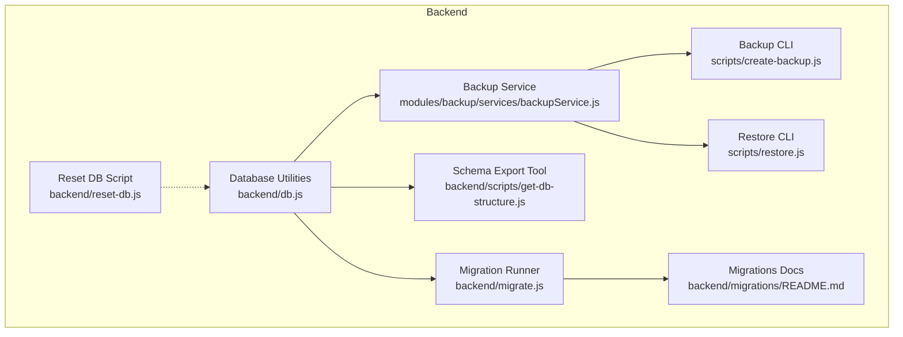
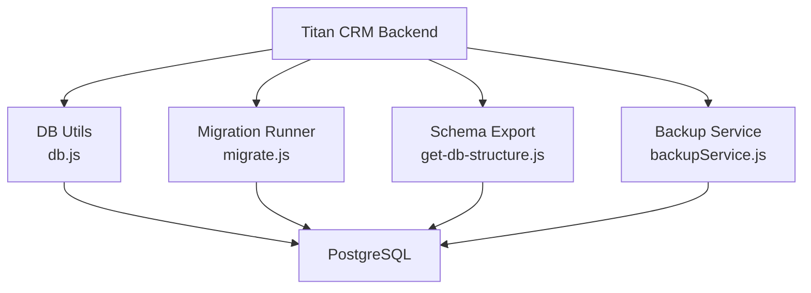
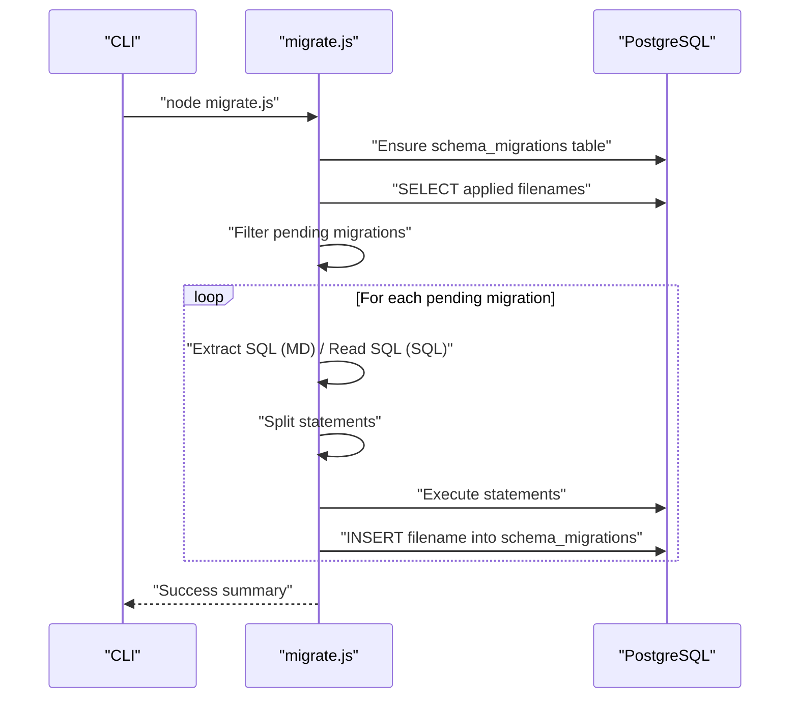
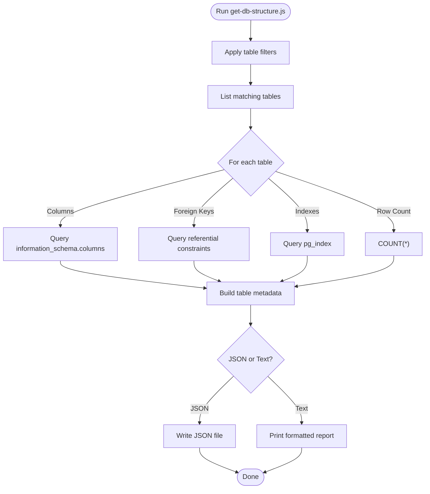
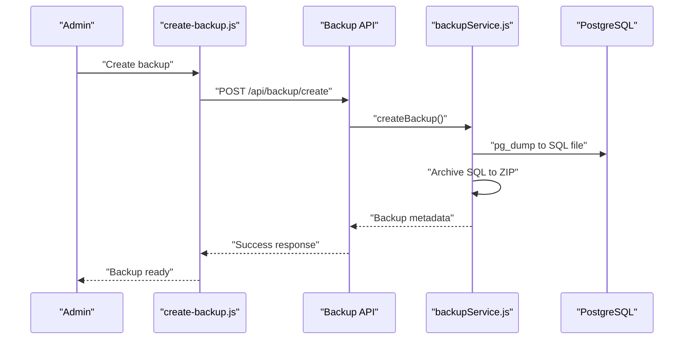
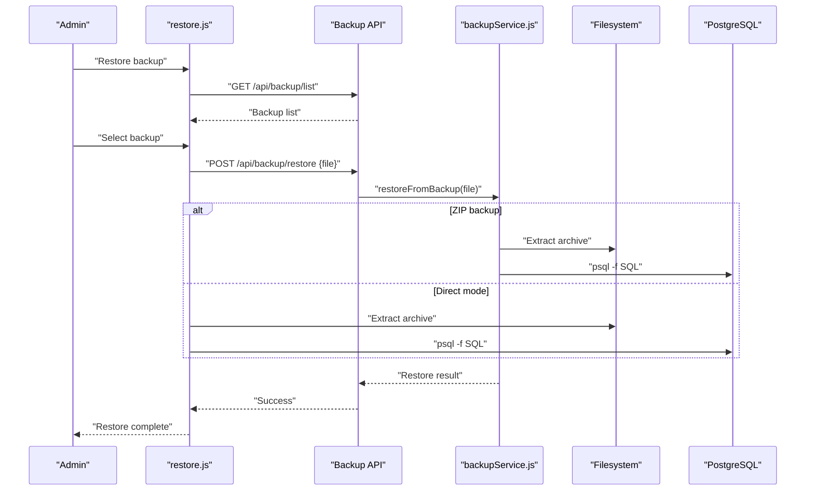
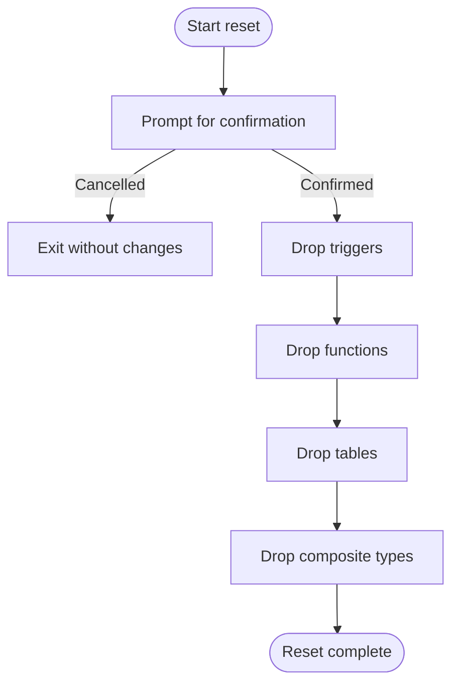
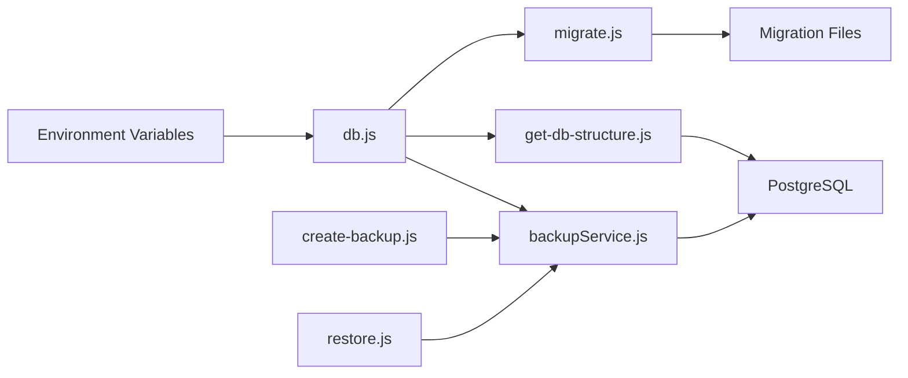
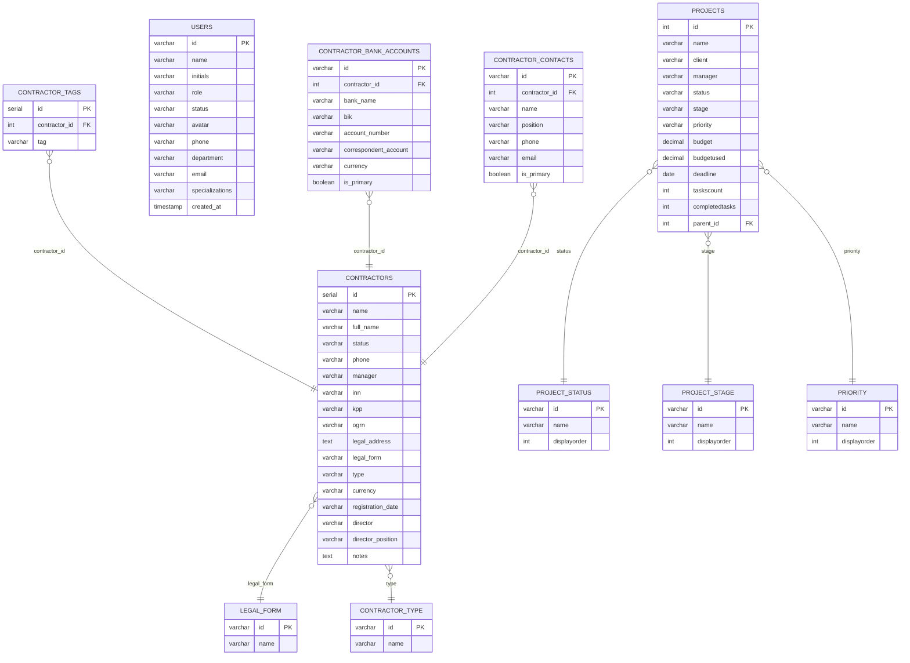

# Data Management

<cite>
**Referenced Files in This Document**
- [backend/db.js](file://backend/db.js)
- [backend/config/db-structure.json](file://backend/config/db-structure.json)
- [backend/migrations/README.md](file://backend/migrations/README.md)
- [backend/migrations/00_schema_migrations.md](file://backend/migrations/00_schema_migrations.md)
- [backend/migrations/01_create_projects_table.md](file://backend/migrations/01_create_projects_table.md)
- [backend/migrations/02_create_contractors_table.md](file://backend/migrations/02_create_contractors_table.md)
- [backend/migrations/07_create_users_table.md](file://backend/migrations/07_create_users_table.md)
- [backend/migrations/09_create_reference_tables.md](file://backend/migrations/09_create_reference_tables.md)
- [backend/migrations/08_create_initial_data.md](file://backend/migrations/08_create_initial_data.md)
- [backend/migrate.js](file://backend/migrate.js)
- [backend/scripts/get-db-structure.js](file://backend/scripts/get-db-structure.js)
- [backend/reset-db.js](file://backend/reset-db.js)
- [backend/modules/backup/services/backupService.js](file://backend/modules/backup/services/backupService.js)
- [backend/scripts/create-backup.js](file://backend/scripts/create-backup.js)
- [backend/scripts/restore.js](file://backend/scripts/restore.js)
</cite>

## Table of Contents
1. [Introduction](#introduction)
2. [Project Structure](#project-structure)
3. [Core Components](#core-components)
4. [Architecture Overview](#architecture-overview)
5. [Detailed Component Analysis](#detailed-component-analysis)
6. [Dependency Analysis](#dependency-analysis)
7. [Performance Considerations](#performance-considerations)
8. [Troubleshooting Guide](#troubleshooting-guide)
9. [Conclusion](#conclusion)
10. [Appendices](#appendices)

## Introduction
This document describes the data management subsystem of Titan CRM with a focus on the PostgreSQL database schema, migration system, backup and restore procedures, and operational practices. It explains how the schema is designed, how it evolves over time, how data integrity and indexing are handled, and how backups are created and restored. It also outlines validation and business logic enforcement points, performance considerations, monitoring approaches, and security controls.

## Project Structure
The data management layer is primarily implemented in the backend under the following areas:
- Database connection and query utilities
- Migration system for schema evolution
- Database structure export and inspection
- Backup and restore services and scripts
- Reset and seed utilities

**Diagram sources**
- [backend/db.js:1-68](file://backend/db.js#L1-L68)
- [backend/migrate.js:1-220](file://backend/migrate.js#L1-L220)
- [backend/migrations/README.md:1-159](file://backend/migrations/README.md#L1-L159)
- [backend/scripts/get-db-structure.js:1-272](file://backend/scripts/get-db-structure.js#L1-L271)
- [backend/reset-db.js:1-109](file://backend/reset-db.js#L1-L108)
- [backend/modules/backup/services/backupService.js:1-362](file://backend/modules/backup/services/backupService.js#L1-L361)
- [backend/scripts/create-backup.js:1-92](file://backend/scripts/create-backup.js#L1-L91)
- [backend/scripts/restore.js:1-419](file://backend/scripts/restore.js#L1-L418)

**Section sources**
- [backend/db.js:1-68](file://backend/db.js#L1-L68)
- [backend/migrate.js:1-220](file://backend/migrate.js#L1-L220)
- [backend/migrations/README.md:1-159](file://backend/migrations/README.md#L1-L159)
- [backend/scripts/get-db-structure.js:1-272](file://backend/scripts/get-db-structure.js#L1-L271)
- [backend/reset-db.js:1-109](file://backend/reset-db.js#L1-L108)
- [backend/modules/backup/services/backupService.js:1-362](file://backend/modules/backup/services/backupService.js#L1-L361)
- [backend/scripts/create-backup.js:1-92](file://backend/scripts/create-backup.js#L1-L91)
- [backend/scripts/restore.js:1-419](file://backend/scripts/restore.js#L1-L418)

## Core Components
- Database connection and query wrapper: Provides a pooled connection, environment-driven configuration, and a query utility that converts snake_case column names to camelCase for JavaScript consumption.
- Migration system: Automatically discovers migration files, extracts SQL, applies only pending migrations, records applied migrations, and ensures idempotency.
- Schema inspection and export: Generates a structured JSON of tables, columns, foreign keys, indexes, and counts for selected subsets of the schema.
- Backup service: Creates database-only or full backups (database + project files), archives them, and supports restore with extraction and database reload.
- Reset and seed utilities: Safely resets the database to a clean state and seeds initial data.

**Section sources**
- [backend/db.js:1-68](file://backend/db.js#L1-L68)
- [backend/migrate.js:134-215](file://backend/migrate.js#L134-L215)
- [backend/scripts/get-db-structure.js:146-210](file://backend/scripts/get-db-structure.js#L146-L210)
- [backend/modules/backup/services/backupService.js:23-78](file://backend/modules/backup/services/backupService.js#L23-L78)
- [backend/reset-db.js:13-102](file://backend/reset-db.js#L13-L102)

## Architecture Overview
The data management architecture centers around PostgreSQL with a Node.js-based migration and backup layer. The migration runner enforces schema evolution, while the backup service encapsulates database dumps and packaging. The database utilities abstract environment configuration and query execution.

**Diagram sources**
- [backend/migrate.js:134-215](file://backend/migrate.js#L134-L215)
- [backend/scripts/get-db-structure.js:215-264](file://backend/scripts/get-db-structure.js#L215-L264)
- [backend/modules/backup/services/backupService.js:23-78](file://backend/modules/backup/services/backupService.js#L23-L78)
- [backend/db.js:58-67](file://backend/db.js#L58-L67)

## Detailed Component Analysis

### Database Connection and Query Utilities
- Environment-driven configuration: Reads DB credentials from a local env file and validates required variables.
- Connection pooling: Uses a pool for efficient connection reuse.
- Query wrapper: Executes queries and transforms column names from snake_case to camelCase for JS compatibility.

Operational implications:
- Centralized credential management via environment variables.
- Consistent column naming across the app reduces mapping overhead.
- Logging and timing are available through the wrapper.

**Section sources**
- [backend/db.js:1-68](file://backend/db.js#L1-L68)

### Migration System
- Discovery and ordering: Scans the migrations directory for .sql and .md files and sorts them numerically.
- Markdown extraction: Extracts SQL from fenced code blocks in .md files.
- Statement splitting: Handles DO blocks, dollar-quoted blocks, and semicolon-delimited statements safely.
- Tracking: Creates a schema_migrations table and records applied migrations to avoid duplicates.
- Idempotency: Uses IF NOT EXISTS patterns and conflict handling to support safe repeated runs.

**Diagram sources**
- [backend/migrate.js:134-215](file://backend/migrate.js#L134-L215)
- [backend/migrations/00_schema_migrations.md:9-19](file://backend/migrations/00_schema_migrations.md#L9-L19)

**Section sources**
- [backend/migrations/README.md:1-159](file://backend/migrations/README.md#L1-L159)
- [backend/migrate.js:1-220](file://backend/migrate.js#L1-L220)
- [backend/migrations/00_schema_migrations.md:1-25](file://backend/migrations/00_schema_migrations.md#L1-L24)

### Schema Inspection and Export
- Selective table filtering: Targets core modules and reference tables.
- Information schema queries: Retrieves columns, comments, foreign keys, and indexes.
- Sample data and row counts: Provides quick insights into table contents.
- Output formats: Plain text or JSON for external consumption.

**Diagram sources**
- [backend/scripts/get-db-structure.js:31-141](file://backend/scripts/get-db-structure.js#L31-L141)
- [backend/scripts/get-db-structure.js:146-210](file://backend/scripts/get-db-structure.js#L146-L210)

**Section sources**
- [backend/scripts/get-db-structure.js:1-272](file://backend/scripts/get-db-structure.js#L1-L271)
- [backend/config/db-structure.json:1-800](file://backend/config/db-structure.json#L1-L800)

### Backup and Restore Services
- Backup creation:
  - Database-only backup: Uses pg_dump with clean flags, zips the SQL, and removes temporary files.
  - Full backup: Includes project files in the archive with selective ignore patterns.
- Restore:
  - Through API: Calls backend endpoints to create and manage backups.
  - Direct mode: Extracts archives locally, ensures database existence, and reloads SQL.
- Listing and deletion: Manages backup inventory and cleanup.

**Diagram sources**
- [backend/scripts/create-backup.js:67-89](file://backend/scripts/create-backup.js#L67-L89)
- [backend/modules/backup/services/backupService.js:23-78](file://backend/modules/backup/services/backupService.js#L23-L78)

**Diagram sources**
- [backend/scripts/restore.js:308-416](file://backend/scripts/restore.js#L308-L416)
- [backend/modules/backup/services/backupService.js:214-297](file://backend/modules/backup/services/backupService.js#L214-L297)

**Section sources**
- [backend/modules/backup/services/backupService.js:1-362](file://backend/modules/backup/services/backupService.js#L1-L361)
- [backend/scripts/create-backup.js:1-92](file://backend/scripts/create-backup.js#L1-L91)
- [backend/scripts/restore.js:1-419](file://backend/scripts/restore.js#L1-L418)

### Database Reset and Seed
- Reset: Drops triggers, functions, tables, and composite types in the public schema, then exits with instructions to re-run migrations and seeds.
- Seed: Initial data is inserted via migrations (e.g., projects, contractors, users, documents, mail).

**Diagram sources**
- [backend/reset-db.js:13-102](file://backend/reset-db.js#L13-L102)

**Section sources**
- [backend/reset-db.js:1-109](file://backend/reset-db.js#L1-L108)
- [backend/migrations/08_create_initial_data.md:1-68](file://backend/migrations/08_create_initial_data.md#L1-L68)

## Dependency Analysis
- Database utilities depend on environment variables and the pg pool.
- Migration runner depends on database utilities and migration files.
- Backup service depends on pg_dump and pg binaries and uses filesystem operations.
- Scripts depend on environment configuration and communicate with the backend API.

**Diagram sources**
- [backend/db.js:1-68](file://backend/db.js#L1-L68)
- [backend/migrate.js:134-215](file://backend/migrate.js#L134-L215)
- [backend/scripts/get-db-structure.js:215-264](file://backend/scripts/get-db-structure.js#L215-L264)
- [backend/modules/backup/services/backupService.js:23-78](file://backend/modules/backup/services/backupService.js#L23-L78)
- [backend/scripts/create-backup.js:67-89](file://backend/scripts/create-backup.js#L67-L89)
- [backend/scripts/restore.js:308-416](file://backend/scripts/restore.js#L308-L416)

**Section sources**
- [backend/db.js:1-68](file://backend/db.js#L1-L68)
- [backend/migrate.js:134-215](file://backend/migrate.js#L134-L215)
- [backend/scripts/get-db-structure.js:215-264](file://backend/scripts/get-db-structure.js#L215-L264)
- [backend/modules/backup/services/backupService.js:23-78](file://backend/modules/backup/services/backupService.js#L23-L78)
- [backend/scripts/create-backup.js:67-89](file://backend/scripts/create-backup.js#L67-L89)
- [backend/scripts/restore.js:308-416](file://backend/scripts/restore.js#L308-L416)

## Performance Considerations
- Connection pooling: Use the provided pool to minimize connection overhead.
- Indexing strategy: Review generated indexes and add composite indexes for frequent join/filter columns (e.g., foreign keys, status, dates).
- Query patterns: Prefer selective queries with appropriate WHERE clauses and LIMITs; leverage EXPLAIN/ANALYZE for slow queries.
- Backup compression: Archive compression is enabled; ensure sufficient disk I/O headroom during backup/restore.
- Migration idempotency: Keep migrations idempotent to reduce downtime risks.

[No sources needed since this section provides general guidance]

## Troubleshooting Guide
- Migration failures:
  - Inspect the specific migration file and SQL statements.
  - Ensure all SQL blocks are properly fenced and semicolon-delimited.
  - Verify that the schema_migrations table exists and is accessible.
- Backup/restore issues:
  - Confirm pg_dump and psql binaries are available and executable.
  - Check file permissions and available disk space.
  - Validate backup file integrity and extraction paths.
- Database connectivity:
  - Verify environment variables and network access to the PostgreSQL host.
  - Test connection with a simple query to ensure the pool is healthy.

**Section sources**
- [backend/migrate.js:171-211](file://backend/migrate.js#L171-L211)
- [backend/modules/backup/services/backupService.js:23-78](file://backend/modules/backup/services/backupService.js#L23-L78)
- [backend/scripts/restore.js:218-306](file://backend/scripts/restore.js#L218-L306)

## Conclusion
Titan CRM’s data management relies on a robust PostgreSQL foundation with a well-structured migration system, comprehensive schema inspection, and reliable backup/restore tooling. By adhering to migration idempotency, maintaining indexes aligned with query patterns, and following documented backup and restore procedures, teams can ensure consistent schema evolution, data integrity, and operational resilience.

[No sources needed since this section summarizes without analyzing specific files]

## Appendices

### Database Schema Overview
- Projects: Hierarchical project tracking with status, stage, priority, budget, deadlines, and parent-child relationships.
- Contractors: Legal and contact details, tags, bank accounts, and contacts.
- Users: Role-based profiles with departments and specializations.
- Reference tables: Controlled vocabularies for statuses, stages, priorities, legal forms, contractor types, currencies, and more.
- Finance and legal modules: Dedicated tables for bank statements, categories, and case management.

**Diagram sources**
- [backend/migrations/01_create_projects_table.md:8-22](file://backend/migrations/01_create_projects_table.md#L8-L22)
- [backend/migrations/02_create_contractors_table.md:9-85](file://backend/migrations/02_create_contractors_table.md#L9-L85)
- [backend/migrations/07_create_users_table.md:8-21](file://backend/migrations/07_create_users_table.md#L8-L21)
- [backend/migrations/09_create_reference_tables.md:8-224](file://backend/migrations/09_create_reference_tables.md#L8-L223)

### Migration and Seed Summary
- Migration tracking: schema_migrations table with filename and timestamp.
- Core tables: projects, contractors, users, calendar events, documents, tasks, legal cases, mail, and more.
- Reference data: Controlled vocabularies for statuses, stages, priorities, legal forms, contractor types, currencies, and labels.
- Initial data: Seeded projects, contractors, documents, users, and mail entries.

**Section sources**
- [backend/migrations/00_schema_migrations.md:1-25](file://backend/migrations/00_schema_migrations.md#L1-L24)
- [backend/migrations/01_create_projects_table.md:1-38](file://backend/migrations/01_create_projects_table.md#L1-L38)
- [backend/migrations/02_create_contractors_table.md:1-86](file://backend/migrations/02_create_contractors_table.md#L1-L85)
- [backend/migrations/07_create_users_table.md:1-45](file://backend/migrations/07_create_users_table.md#L1-L45)
- [backend/migrations/09_create_reference_tables.md:1-224](file://backend/migrations/09_create_reference_tables.md#L1-L223)
- [backend/migrations/08_create_initial_data.md:1-68](file://backend/migrations/08_create_initial_data.md#L1-L68)

### Backup and Restore Procedures
- Automated backup scheduling: Not implemented in the provided scripts; schedule backups externally using OS-level schedulers.
- Manual backup procedures: Use the backup CLI to create database-only or full backups.
- Disaster recovery: Use the restore CLI to restore from backups; supports both API-triggered and direct modes.

**Section sources**
- [backend/scripts/create-backup.js:67-89](file://backend/scripts/create-backup.js#L67-L89)
- [backend/scripts/restore.js:308-416](file://backend/scripts/restore.js#L308-L416)
- [backend/modules/backup/services/backupService.js:23-78](file://backend/modules/backup/services/backupService.js#L23-L78)

### Data Validation and Business Logic
- Migration idempotency: Use IF NOT EXISTS and conflict handling to prevent duplicate operations.
- Reference tables: Enforce controlled vocabularies for statuses, stages, priorities, and types.
- Foreign keys: Maintain referential integrity across related entities (e.g., contractor relationships, tags).
- Audit and logging: Use system logs and audit trails where applicable to track changes.

**Section sources**
- [backend/migrate.js:92-132](file://backend/migrate.js#L92-L132)
- [backend/migrations/09_create_reference_tables.md:8-224](file://backend/migrations/09_create_reference_tables.md#L8-L223)
- [backend/migrations/02_create_contractors_table.md:52-85](file://backend/migrations/02_create_contractors_table.md#L52-L85)

### Security, Encryption, and Access Control
- Credential management: Store database credentials in environment variables; restrict access to the env file.
- Binary access: Ensure pg_dump and psql are available only to authorized users.
- Backup encryption: Encrypt backup archives at rest and in transit; rotate secrets regularly.
- Access control: Limit database user privileges to least-privileged accounts for application usage.

[No sources needed since this section provides general guidance]