# Data Integrity & Constraints

<cite>
**Referenced Files in This Document**
- [db-structure.json](file://backend/config/db-structure.json)
- [README.md](file://backend/migrations/README.md)
- [00_schema_migrations.md](file://backend/migrations/00_schema_migrations.md)
- [01_create_projects_table.md](file://backend/migrations/01_create_projects_table.md)
- [02_create_contractors_table.md](file://backend/migrations/02_create_contractors_table.md)
- [05_create_legal_cases_table.md](file://backend/migrations/05_create_legal_cases_table.md)
- [07_create_users_table.md](file://backend/migrations/07_create_users_table.md)
- [09_create_reference_tables.md](file://backend/migrations/09_create_reference_tables.md)
- [49_create_finance_module_tables.md](file://backend/migrations/49_create_finance_module_tables.md)
- [63_create_case_outcome_table.md](file://backend/migrations/63_create_case_outcome_table.md)
- [67_create_legal_form_groups.sql](file://backend/migrations/67_create_legal_form_groups.sql)
- [69_add_finance_payments_unique_constraint.sql](file://backend/migrations/69_add_finance_payments_unique_constraint.sql)
- [76_mail_comprehensive_schema.sql](file://backend/migrations/76_mail_comprehensive_schema.sql)
- [101_create_workflow_tables.sql](file://backend/migrations/101_create_workflow_tables.sql)
- [102_create_audit_log_table.sql](file://backend/migrations/102_create_audit_log_table.sql)
- [117_add_group_id_to_contractors.sql](file://backend/migrations/117_add_group_id_to_contractors.sql)
- [119_extend_contractors_for_individuals_and_foreign.sql](file://backend/migrations/119_extend_contractors_for_individuals_and_foreign.sql)
- [30_fix_contractor_tags_unique_constraint.md](file://backend/migrations/30_fix_contractor_tags_unique_constraint.md)
</cite>

## Table of Contents
1. [Introduction](#introduction)
2. [Project Structure](#project-structure)
3. [Core Components](#core-components)
4. [Architecture Overview](#architecture-overview)
5. [Detailed Component Analysis](#detailed-component-analysis)
6. [Dependency Analysis](#dependency-analysis)
7. [Performance Considerations](#performance-considerations)
8. [Troubleshooting Guide](#troubleshooting-guide)
9. [Conclusion](#conclusion)

## Introduction
This document provides comprehensive data integrity and constraint documentation for the Titan CRM database schema. It catalogs primary keys, foreign key constraints, unique constraints, and check constraints, explains naming conventions and enforcement mechanisms, details database-level validation rules and their business logic significance, and outlines index strategies, performance implications, and optimization techniques. It also includes examples of complex constraints used for business rule enforcement and guidance for handling constraint violations and debugging integrity issues.

## Project Structure
The database schema is primarily defined by migration files under backend/migrations and supplemented by a schema snapshot in backend/config/db-structure.json. Migrations are numbered and applied in order, with a tracking table ensuring idempotence and safe rollbacks. Reference tables define controlled vocabularies used across entities.

```mermaid
graph TB
subgraph "Migrations"
M00["00_schema_migrations.md"]
M01["01_create_projects_table.md"]
M02["02_create_contractors_table.md"]
M05["05_create_legal_cases_table.md"]
M07["07_create_users_table.md"]
M09["09_create_reference_tables.md"]
M49["49_create_finance_module_tables.md"]
M63["63_create_case_outcome_table.md"]
M67["67_create_legal_form_groups.sql"]
M69["69_add_finance_payments_unique_constraint.sql"]
M76["76_mail_comprehensive_schema.sql"]
M101["101_create_workflow_tables.sql"]
M102["102_create_audit_log_table.sql"]
M117["117_add_group_id_to_contractors.sql"]
M119["119_extend_contractors_for_individuals_and_foreign.sql"]
M30["30_fix_contractor_tags_unique_constraint.md"]
end
subgraph "Schema Snapshot"
S1["db-structure.json"]
end
M00 --> M01
M00 --> M02
M00 --> M05
M00 --> M07
M00 --> M09
M00 --> M49
M00 --> M63
M00 --> M67
M00 --> M69
M00 --> M76
M00 --> M101
M00 --> M102
M00 --> M117
M00 --> M119
M00 --> M30
M00 --> S1
```

**Diagram sources**
- [00_schema_migrations.md](file://backend/migrations/00_schema_migrations.md)
- [01_create_projects_table.md](file://backend/migrations/01_create_projects_table.md)
- [02_create_contractors_table.md](file://backend/migrations/02_create_contractors_table.md)
- [05_create_legal_cases_table.md](file://backend/migrations/05_create_legal_cases_table.md)
- [07_create_users_table.md](file://backend/migrations/07_create_users_table.md)
- [09_create_reference_tables.md](file://backend/migrations/09_create_reference_tables.md)
- [49_create_finance_module_tables.md](file://backend/migrations/49_create_finance_module_tables.md)
- [63_create_case_outcome_table.md](file://backend/migrations/63_create_case_outcome_table.md)
- [67_create_legal_form_groups.sql](file://backend/migrations/67_create_legal_form_groups.sql)
- [69_add_finance_payments_unique_constraint.sql](file://backend/migrations/69_add_finance_payments_unique_constraint.sql)
- [76_mail_comprehensive_schema.sql](file://backend/migrations/76_mail_comprehensive_schema.sql)
- [101_create_workflow_tables.sql](file://backend/migrations/101_create_workflow_tables.sql)
- [102_create_audit_log_table.sql](file://backend/migrations/102_create_audit_log_table.sql)
- [117_add_group_id_to_contractors.sql](file://backend/migrations/117_add_group_id_to_contractors.sql)
- [119_extend_contractors_for_individuals_and_foreign.sql](file://backend/migrations/119_extend_contractors_for_individuals_and_foreign.sql)
- [30_fix_contractor_tags_unique_constraint.md](file://backend/migrations/30_fix_contractor_tags_unique_constraint.md)
- [db-structure.json](file://backend/config/db-structure.json)

**Section sources**
- [README.md](file://backend/migrations/README.md)
- [00_schema_migrations.md](file://backend/migrations/00_schema_migrations.md)

## Core Components
This section enumerates primary keys, foreign keys, unique constraints, and check constraints across major tables, along with their enforcement mechanisms and business significance.

- Primary Keys
  - projects: id (integer)
  - contractors: id (serial)
  - users: id (varchar)
  - legal_cases: id (varchar)
  - finance_invoices: id (text), identifier (unique)
  - finance_payments: id (text)
  - finance_invoice_status: id (text)
  - finance_invoice_documents: id (text)
  - mail_accounts: id (varchar), unique(user_id, email)
  - mail_folders: id (varchar), unique(account_id, folder_name)
  - mail_filters: id (varchar)
  - mail_filter_conditions: id (varchar)
  - mail_attachments: id (varchar)
  - mail_labels: id (varchar), unique(user_id, label_name)
  - mail_labels_mapping: id (varchar), unique(mail_id, label_id)
  - workflows: id (uuid)
  - workflow_steps: id (uuid), unique(workflow_id, step_order)
  - workflow_executions: id (uuid)
  - workflow_execution_logs: id (uuid)
  - audit_log: id (serial)
  - calendar_events: id (varchar)
  - contractor_tags: id (serial)
  - contractor_bank_accounts: id (varchar)
  - contractor_contacts: id (varchar)
  - legal_form_groups: id (varchar), unique(name)
  - case_outcome: id (varchar), unique(name)

- Foreign Keys
  - projects.parent_id → projects.id
  - calendar_events.assignee → users.id
  - calendar_events.client → contractors.id
  - contractor_tags.contractor_id → contractors.id (on delete cascade)
  - contractor_bank_accounts.contractor_id → contractors.id (on delete cascade)
  - contractor_contacts.contractor_id → contractors.id (on delete cascade)
  - case_financial_details.caseId → legal_cases.id
  - case_events.caseId → legal_cases.id
  - case_documents.caseId → legal_cases.id
  - case_document_comments.documentId → case_documents.id
  - case_notes.caseId → legal_cases.id
  - case_third_parties.caseId → legal_cases.id
  - finance_payments.invoice_id → finance_invoices.id
  - finance_payments.project_id → projects.id
  - finance_payments.contractor_id → contractors.id
  - mail_attachments.mail_id → mail.id
  - mail_labels.account_id → mail_accounts.id
  - mail_labels.user_id → users.id
  - mail_labels_mapping.mail_id → mail.id
  - mail_labels_mapping.label_id → mail_labels.id
  - mail_accounts.user_id → users.id
  - mail_folders.account_id → mail_accounts.id
  - mail_folders.user_id → users.id
  - mail_folders.parent_folder_id → mail_folders.id
  - mail_filters.account_id → mail_accounts.id
  - mail_filters.user_id → users.id
  - mail_filters.target_folder_id → mail_folders.id
  - mail_filter_conditions.filter_id → mail_filters.id
  - workflows.created_by → users.id (on delete set null)
  - workflow_steps.workflow_id → workflows.id (on delete cascade)
  - workflow_executions.workflow_id → workflows.id (on delete cascade)
  - workflow_execution_logs.execution_id → workflow_executions.id (on delete cascade)
  - workflow_execution_logs.step_id → workflow_steps.id (on delete set null)
  - legal_form.group_id → legal_form_groups.id
  - contractors.group_id → legal_form_groups.id (on delete set null)

- Unique Constraints
  - finance_invoices.identifier
  - mail_accounts: (user_id, email)
  - mail_folders: (account_id, folder_name)
  - mail_labels: (user_id, label_name)
  - mail_labels_mapping: (mail_id, label_id)
  - contractor_tags: (contractor_id, tag) enforced by unique index/constraint
  - legal_form_groups: unique(name)
  - case_outcome: unique(name)

- Check Constraints
  - finance_payments: relation check ensuring at least one of invoice_id, project_id, or contractor_id is not null
  - finance_payments: unique index preventing duplicate payments by amount, date, contractor, and kind

- Indexes and Performance
  - Finance: indexes on status, due_date, project_id, contractor_id for invoices; invoice_id, project_id for payments
  - Mail: indexes on user_id, account_id, folder_id, created_at for mail; account_id for accounts/folders; attachments/mail-labels mapping; labels per user
  - Audit log: indexes on user_id, entity_type/entity_id, created_at
  - Workflows: composite index on status and trigger_type; unique index on (workflow_id, step_order)
  - Calendar: primary key index on id
  - Legal forms: index on group_id
  - Contractors: unique tag constraint enforced via unique index/constraint

- Naming Conventions
  - Primary key suffix: _pkey (e.g., calendar_events_pkey)
  - Foreign key suffix: _fkey (e.g., calendar_events_assignee_fkey)
  - Unique indexes: often named idx_tablename_unique or idx_tablename_field
  - Composite indexes: idx_tablename_fields
  - Check constraints: descriptive names like relation_chk
  - UUID primary keys: explicit id UUID with defaults

- Enforcement Mechanisms
  - Constraints are defined in migration files and enforced by PostgreSQL at insert/update time.
  - Unique indexes enforce uniqueness and serve as backing for unique constraints.
  - Check constraints enforce business rules such as mutual exclusivity among related identifiers.
  - Cascading deletes propagate removals from parent entities to child records.

**Section sources**
- [db-structure.json](file://backend/config/db-structure.json)
- [01_create_projects_table.md](file://backend/migrations/01_create_projects_table.md)
- [02_create_contractors_table.md](file://backend/migrations/02_create_contractors_table.md)
- [05_create_legal_cases_table.md](file://backend/migrations/05_create_legal_cases_table.md)
- [07_create_users_table.md](file://backend/migrations/07_create_users_table.md)
- [09_create_reference_tables.md](file://backend/migrations/09_create_reference_tables.md)
- [49_create_finance_module_tables.md](file://backend/migrations/49_create_finance_module_tables.md)
- [63_create_case_outcome_table.md](file://backend/migrations/63_create_case_outcome_table.md)
- [67_create_legal_form_groups.sql](file://backend/migrations/67_create_legal_form_groups.sql)
- [69_add_finance_payments_unique_constraint.sql](file://backend/migrations/69_add_finance_payments_unique_constraint.sql)
- [76_mail_comprehensive_schema.sql](file://backend/migrations/76_mail_comprehensive_schema.sql)
- [101_create_workflow_tables.sql](file://backend/migrations/101_create_workflow_tables.sql)
- [102_create_audit_log_table.sql](file://backend/migrations/102_create_audit_log_table.sql)
- [117_add_group_id_to_contractors.sql](file://backend/migrations/117_add_group_id_to_contractors.sql)
- [119_extend_contractors_for_individuals_and_foreign.sql](file://backend/migrations/119_extend_contractors_for_individuals_and_foreign.sql)
- [30_fix_contractor_tags_unique_constraint.md](file://backend/migrations/30_fix_contractor_tags_unique_constraint.md)

## Architecture Overview
The schema enforces referential integrity across modules (Projects, Legal Cases, Finance, Mail, Workflows, Audit Logging). Reference tables centralize controlled vocabularies. Business rules are encoded via check constraints and unique indexes.

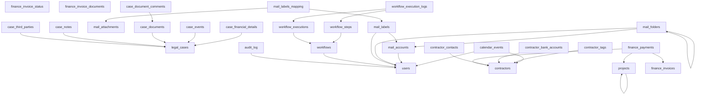

**Diagram sources**
- [01_create_projects_table.md](file://backend/migrations/01_create_projects_table.md)
- [02_create_contractors_table.md](file://backend/migrations/02_create_contractors_table.md)
- [05_create_legal_cases_table.md](file://backend/migrations/05_create_legal_cases_table.md)
- [07_create_users_table.md](file://backend/migrations/07_create_users_table.md)
- [49_create_finance_module_tables.md](file://backend/migrations/49_create_finance_module_tables.md)
- [76_mail_comprehensive_schema.sql](file://backend/migrations/76_mail_comprehensive_schema.sql)
- [101_create_workflow_tables.sql](file://backend/migrations/101_create_workflow_tables.sql)
- [102_create_audit_log_table.sql](file://backend/migrations/102_create_audit_log_table.sql)

## Detailed Component Analysis

### Projects Module
- Primary key: projects.id
- Self-reference: projects.parent_id → projects.id enables hierarchical sub-project relationships.
- Business logic: parent-child hierarchy supports portfolio and phase modeling.

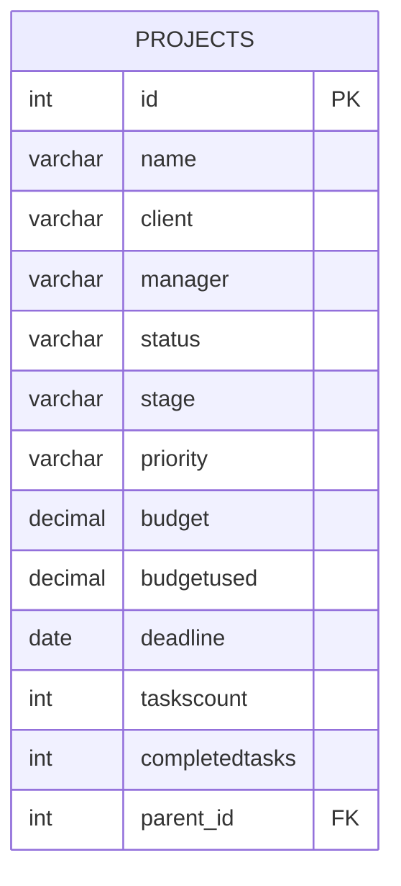

**Diagram sources**
- [01_create_projects_table.md](file://backend/migrations/01_create_projects_table.md)

**Section sources**
- [01_create_projects_table.md](file://backend/migrations/01_create_projects_table.md)

### Contractors Module
- Primary key: contractors.id
- Reference tables: contractor_status, contractor_type, legal_form influence data quality and categorization.
- Supporting entities:
  - contractor_tags: unique (contractor_id, tag) enforced by unique index/constraint
  - contractor_bank_accounts: foreign key to contractors
  - contractor_contacts: foreign key to contractors
- Business logic: unique tags per contractor; cascading deletes remove dependent records.

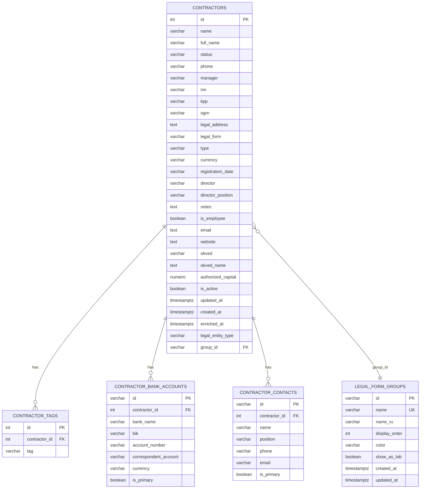

**Diagram sources**
- [02_create_contractors_table.md](file://backend/migrations/02_create_contractors_table.md)
- [117_add_group_id_to_contractors.sql](file://backend/migrations/117_add_group_id_to_contractors.sql)
- [119_extend_contractors_for_individuals_and_foreign.sql](file://backend/migrations/119_extend_contractors_for_individuals_and_foreign.sql)
- [67_create_legal_form_groups.sql](file://backend/migrations/67_create_legal_form_groups.sql)
- [30_fix_contractor_tags_unique_constraint.md](file://backend/migrations/30_fix_contractor_tags_unique_constraint.md)

**Section sources**
- [02_create_contractors_table.md](file://backend/migrations/02_create_contractors_table.md)
- [117_add_group_id_to_contractors.sql](file://backend/migrations/117_add_group_id_to_contractors.sql)
- [119_extend_contractors_for_individuals_and_foreign.sql](file://backend/migrations/119_extend_contractors_for_individuals_and_foreign.sql)
- [67_create_legal_form_groups.sql](file://backend/migrations/67_create_legal_form_groups.sql)
- [30_fix_contractor_tags_unique_constraint.md](file://backend/migrations/30_fix_contractor_tags_unique_constraint.md)

### Legal Cases Module
- Primary key: legal_cases.id
- Dependent entities:
  - case_financial_details: foreign key to legal_cases
  - case_events: foreign key to legal_cases
  - case_documents: foreign key to legal_cases
  - case_document_comments: foreign key to case_documents
  - case_notes: foreign key to legal_cases
  - case_third_parties: foreign key to legal_cases
- Reference tables: case_status, case_type, event_type inform lifecycle and categorization.

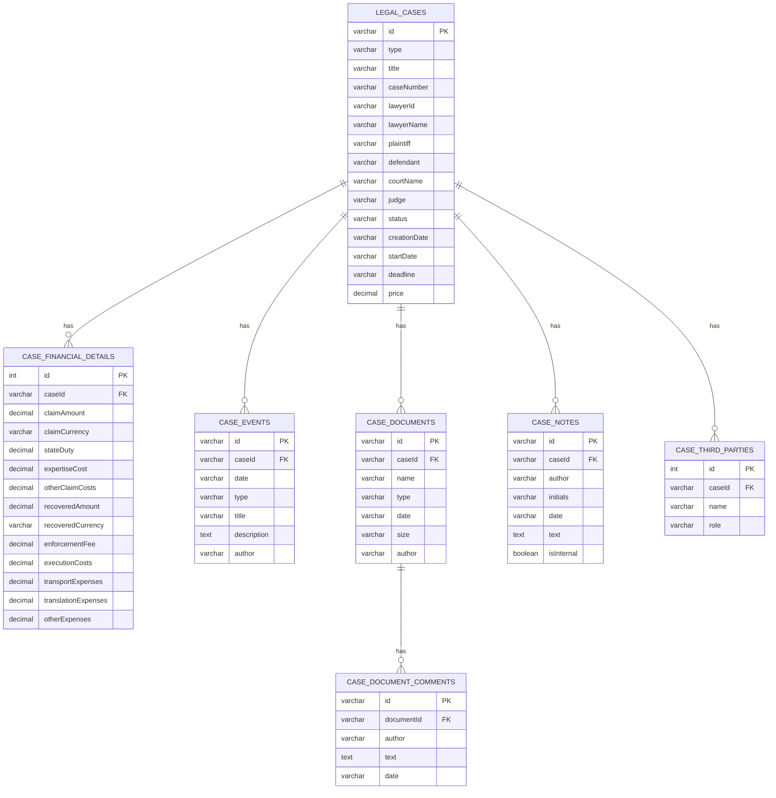

**Diagram sources**
- [05_create_legal_cases_table.md](file://backend/migrations/05_create_legal_cases_table.md)
- [09_create_reference_tables.md](file://backend/migrations/09_create_reference_tables.md)

**Section sources**
- [05_create_legal_cases_table.md](file://backend/migrations/05_create_legal_cases_table.md)
- [09_create_reference_tables.md](file://backend/migrations/09_create_reference_tables.md)

### Finance Module
- Primary keys: finance_invoices.id, finance_payments.id, finance_invoice_status.id, finance_invoice_documents.id
- Unique constraints:
  - finance_invoices.identifier
  - finance_payments: unique index on (amount, payment_date, contractor_id/coalesce, kind)
- Check constraint:
  - finance_payments.relation_chk: at least one of invoice_id, project_id, contractor_id must be present
- Indexes:
  - finance_invoices: status, due_date, project_id, contractor_id
  - finance_payments: invoice_id, project_id
- Business logic: ensures invoice/payment integrity and prevents duplicate payments.

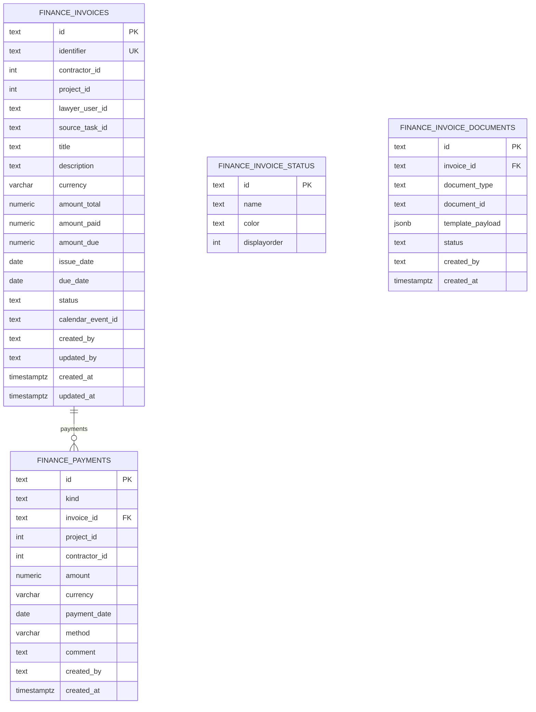

**Diagram sources**
- [49_create_finance_module_tables.md](file://backend/migrations/49_create_finance_module_tables.md)
- [69_add_finance_payments_unique_constraint.sql](file://backend/migrations/69_add_finance_payments_unique_constraint.sql)

**Section sources**
- [49_create_finance_module_tables.md](file://backend/migrations/49_create_finance_module_tables.md)
- [69_add_finance_payments_unique_constraint.sql](file://backend/migrations/69_add_finance_payments_unique_constraint.sql)

### Mail Module
- Primary keys: mail_accounts.id, mail_folders.id, mail_filters.id, mail_filter_conditions.id, mail_attachments.id, mail_labels.id, mail_labels_mapping.id
- Unique constraints:
  - mail_accounts: (user_id, email)
  - mail_folders: (account_id, folder_name)
  - mail_labels: (user_id, label_name)
  - mail_labels_mapping: (mail_id, label_id)
- Foreign keys:
  - mail_attachments.mail_id → mail.id
  - mail_labels.account_id → mail_accounts.id
  - mail_labels.user_id → users.id
  - mail_labels_mapping.mail_id → mail.id
  - mail_labels_mapping.label_id → mail_labels.id
  - mail_accounts.user_id → users.id
  - mail_folders.account_id → mail_accounts.id
  - mail_folders.user_id → users.id
  - mail_folders.parent_folder_id → mail_folders.id
  - mail_filters.account_id → mail_accounts.id
  - mail_filters.user_id → users.id
  - mail_filters.target_folder_id → mail_folders.id
  - mail_filter_conditions.filter_id → mail_filters.id
- Indexes:
  - mail: user_id, account_id, folder_id, created_at
  - mail_accounts: user_id, email
  - mail_folders: account_id
  - mail_attachments: mail_id
  - mail_labels: user_id
- Business logic: multi-account support, hierarchical folders, flexible labeling, and attachment tracking.

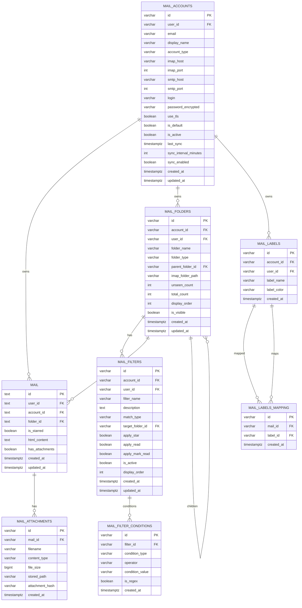

**Diagram sources**
- [76_mail_comprehensive_schema.sql](file://backend/migrations/76_mail_comprehensive_schema.sql)

**Section sources**
- [76_mail_comprehensive_schema.sql](file://backend/migrations/76_mail_comprehensive_schema.sql)

### Workflows Module
- Primary keys: workflows.id (uuid), workflow_steps.id (uuid), workflow_executions.id (uuid), workflow_execution_logs.id (uuid)
- Unique constraints:
  - workflow_steps: unique(workflow_id, step_order)
- Foreign keys:
  - workflows.created_by → users.id (on delete set null)
  - workflow_steps.workflow_id → workflows.id (on delete cascade)
  - workflow_executions.workflow_id → workflows.id (on delete cascade)
  - workflow_execution_logs.execution_id → workflow_executions.id (on delete cascade)
  - workflow_execution_logs.step_id → workflow_steps.id (on delete set null)
- Indexes:
  - workflows: status, trigger_type
- Business logic: structured automation with ordered steps, execution tracking, and logging.

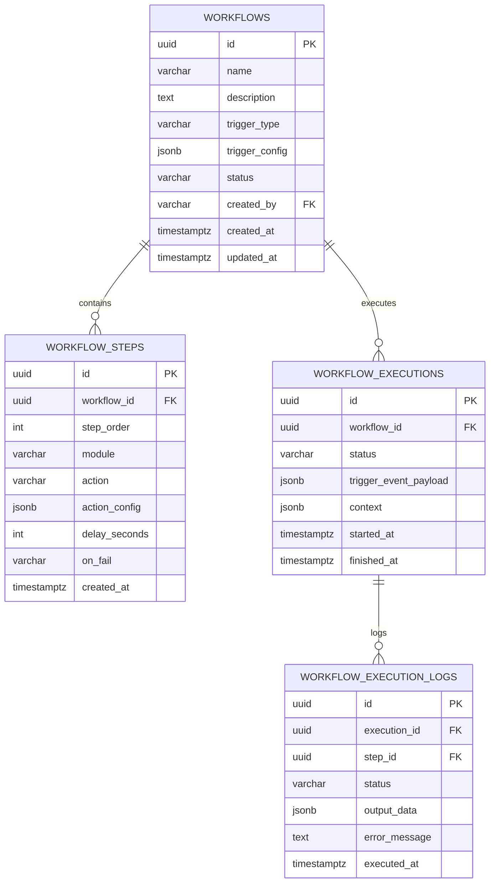

**Diagram sources**
- [101_create_workflow_tables.sql](file://backend/migrations/101_create_workflow_tables.sql)

**Section sources**
- [101_create_workflow_tables.sql](file://backend/migrations/101_create_workflow_tables.sql)

### Audit Logging
- Primary key: audit_log.id
- Indexes:
  - user_id
  - entity_type, entity_id
  - created_at
- Business logic: track user actions, entity changes, IP, and user agent for compliance and forensics.

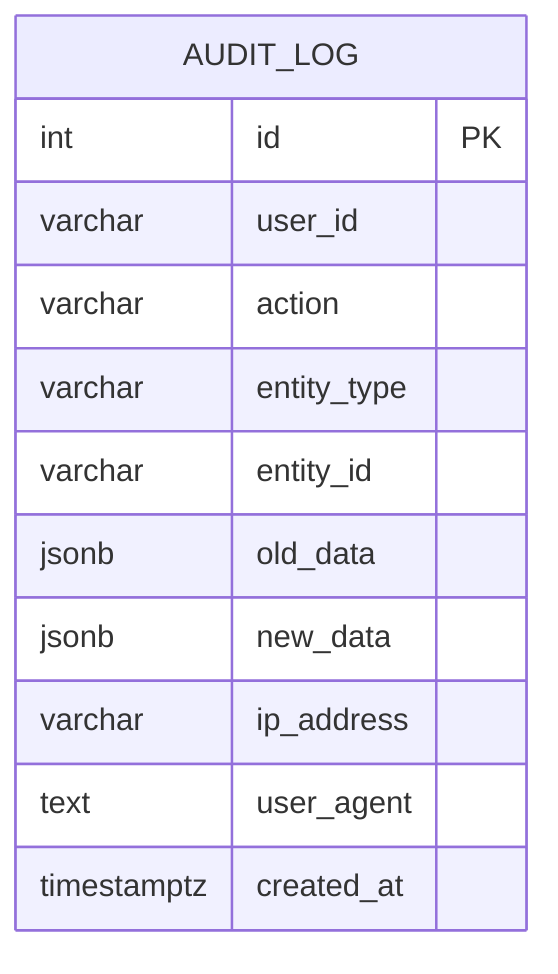

**Diagram sources**
- [102_create_audit_log_table.sql](file://backend/migrations/102_create_audit_log_table.sql)

**Section sources**
- [102_create_audit_log_table.sql](file://backend/migrations/102_create_audit_log_table.sql)

### Calendar Events
- Primary key: calendar_events.id
- Foreign keys:
  - calendar_events.assignee → users.id
  - calendar_events.client → contractors.id
- Business logic: associate calendar entries with users and contractors.

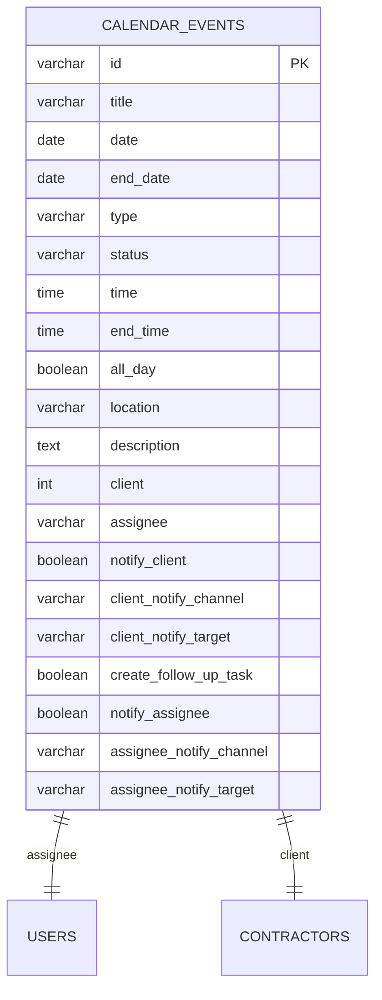

**Diagram sources**
- [db-structure.json](file://backend/config/db-structure.json)

**Section sources**
- [db-structure.json](file://backend/config/db-structure.json)

### Reference Tables and Controlled Vocabularies
- Reference tables define controlled values used across entities (project_status, project_stage, priority, contractor_status, legal_form, contractor_type, task_status, lawyer_status, specialization, case_status, currency, case_type, event_type, mail_label).
- Business logic: centralized governance of dropdown values and consistent display ordering.

**Section sources**
- [09_create_reference_tables.md](file://backend/migrations/09_create_reference_tables.md)

## Dependency Analysis
This section maps inter-table dependencies and highlights potential circularities (none observed) and external integration points.

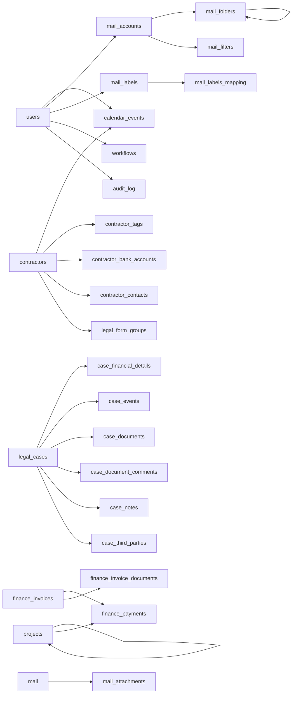

**Diagram sources**
- [01_create_projects_table.md](file://backend/migrations/01_create_projects_table.md)
- [02_create_contractors_table.md](file://backend/migrations/02_create_contractors_table.md)
- [05_create_legal_cases_table.md](file://backend/migrations/05_create_legal_cases_table.md)
- [07_create_users_table.md](file://backend/migrations/07_create_users_table.md)
- [49_create_finance_module_tables.md](file://backend/migrations/49_create_finance_module_tables.md)
- [76_mail_comprehensive_schema.sql](file://backend/migrations/76_mail_comprehensive_schema.sql)
- [101_create_workflow_tables.sql](file://backend/migrations/101_create_workflow_tables.sql)
- [102_create_audit_log_table.sql](file://backend/migrations/102_create_audit_log_table.sql)

**Section sources**
- [01_create_projects_table.md](file://backend/migrations/01_create_projects_table.md)
- [02_create_contractors_table.md](file://backend/migrations/02_create_contractors_table.md)
- [05_create_legal_cases_table.md](file://backend/migrations/05_create_legal_cases_table.md)
- [07_create_users_table.md](file://backend/migrations/07_create_users_table.md)
- [49_create_finance_module_tables.md](file://backend/migrations/49_create_finance_module_tables.md)
- [76_mail_comprehensive_schema.sql](file://backend/migrations/76_mail_comprehensive_schema.sql)
- [101_create_workflow_tables.sql](file://backend/migrations/101_create_workflow_tables.sql)
- [102_create_audit_log_table.sql](file://backend/migrations/102_create_audit_log_table.sql)

## Performance Considerations
- Indexes
  - Finance: selective indexes on status, due_date, project_id, contractor_id for invoices; invoice_id, project_id for payments reduce join and filter costs.
  - Mail: indexes on user_id, account_id, folder_id, created_at improve query performance for mail retrieval and synchronization.
  - Audit log: composite indexes on user_id, entity_type/entity_id, created_at enable efficient auditing queries.
  - Workflows: status-trigger index and unique step order index optimize scheduling and execution.
  - Legal forms: index on group_id accelerates filtering by form groups.
  - Contractors: unique tag constraint via unique index prevents duplicates and speeds up tag lookups.
- Unique Constraints
  - Unique indexes on identifiers (e.g., finance_invoices.identifier, mail_accounts.email per user) prevent duplicates and act as backing for unique constraints.
- Check Constraints
  - finance_payments.relation_chk ensures data validity at write time, reducing downstream anomalies.
- Idempotency and Migration Safety
  - Migrations use IF NOT EXISTS checks and conflict handling to avoid reapplication issues and preserve data integrity during upgrades.

[No sources needed since this section provides general guidance]

## Troubleshooting Guide
- Constraint Violations
  - Unique violation: occurs when inserting duplicate values in unique columns or unique indexes (e.g., finance_invoices.identifier, mail_accounts unique(user_id, email), contractor_tags unique(contractor_id, tag), finance_payments duplicate by amount/date/contractor/kind). Resolution involves deduplicating data or adjusting values to meet uniqueness.
  - Foreign key violation: occurs when referencing non-existent parent rows. Verify parent existence and correct foreign key values.
  - Check constraint violation: occurs when finance_payments relation check fails (no invoice/project/contractor set). Ensure at least one identifier is provided.
- Debugging Approaches
  - Identify violating rows: use targeted queries to locate duplicates or invalid references.
  - Clean data: remove duplicates or correct invalid foreign keys before re-insertion.
  - Review migration history: confirm applied migrations and their effects using the schema_migrations tracking table.
  - Audit trail: leverage audit_log to trace who changed what and when.
- Prevention Strategies
  - Enforce constraints at application level and database level.
  - Use batch processing with pre-validation and upsert logic for unique constraints.
  - Apply defensive programming to ensure foreign key values exist before inserts.

**Section sources**
- [69_add_finance_payments_unique_constraint.sql](file://backend/migrations/69_add_finance_payments_unique_constraint.sql)
- [30_fix_contractor_tags_unique_constraint.md](file://backend/migrations/30_fix_contractor_tags_unique_constraint.md)
- [49_create_finance_module_tables.md](file://backend/migrations/49_create_finance_module_tables.md)
- [76_mail_comprehensive_schema.sql](file://backend/migrations/76_mail_comprehensive_schema.sql)
- [102_create_audit_log_table.sql](file://backend/migrations/102_create_audit_log_table.sql)
- [README.md](file://backend/migrations/README.md)

## Conclusion
Titan CRM’s database schema enforces robust data integrity through carefully designed primary keys, foreign keys, unique constraints, and check constraints. Naming conventions and indexes align with business needs, while migration practices ensure safe evolution. By leveraging these constraints and indexes, the system maintains reliability, traceability, and performance across modules. Adhering to the troubleshooting and prevention strategies outlined above will help sustain data quality and minimize constraint-related issues.