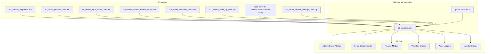
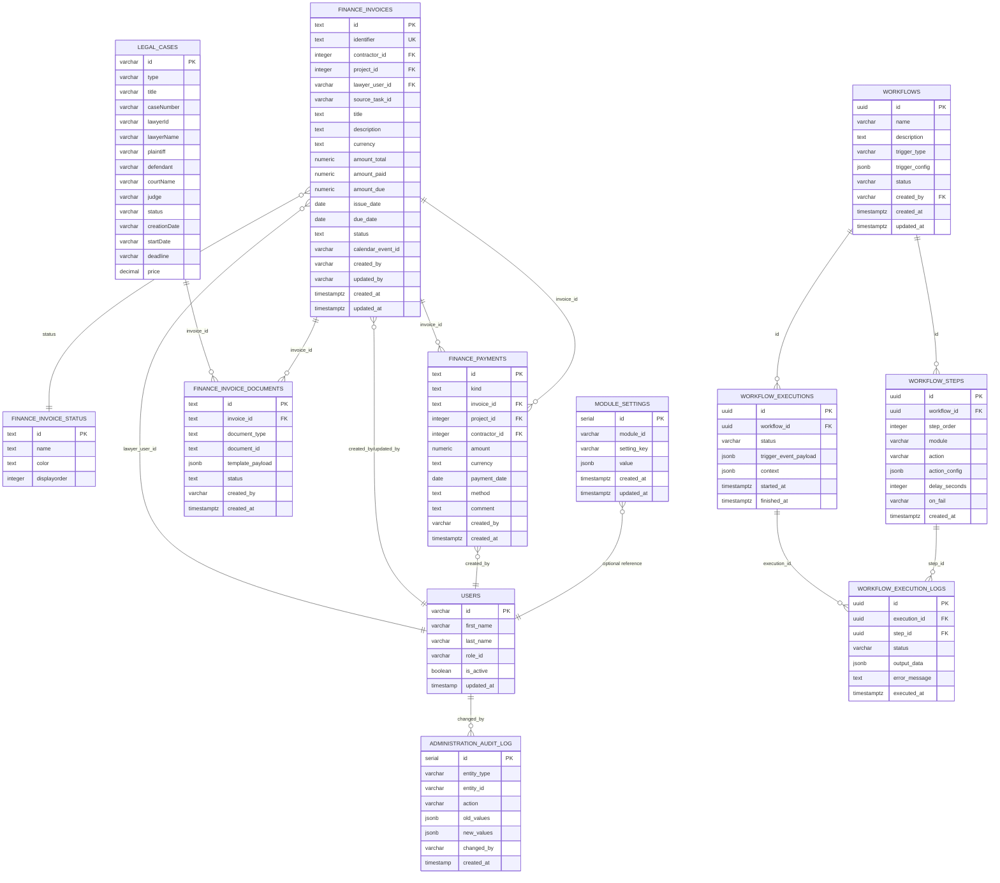
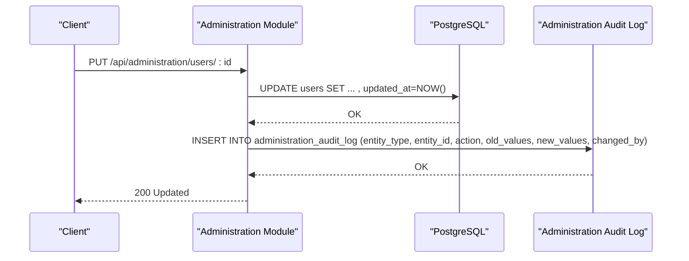
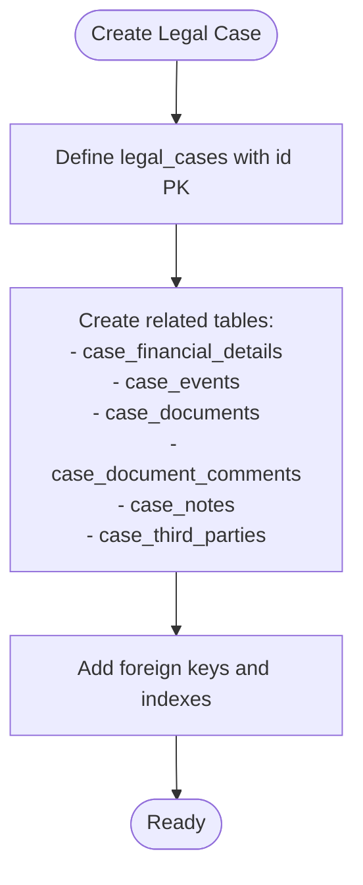
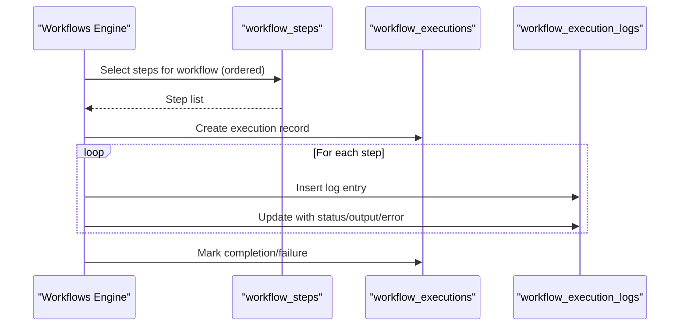
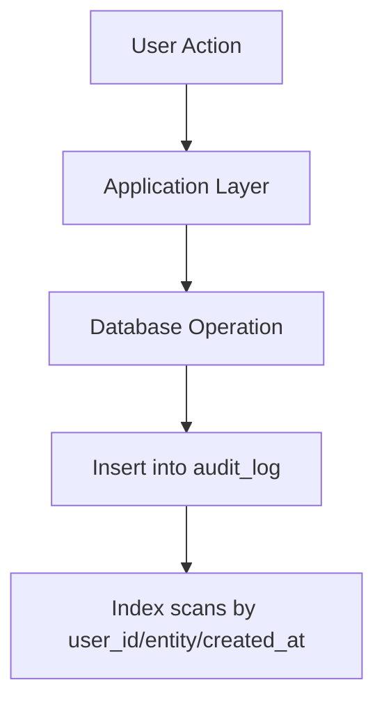
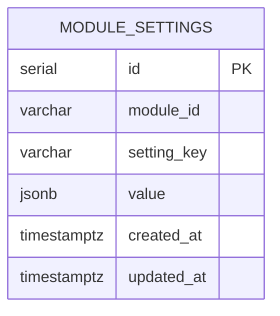
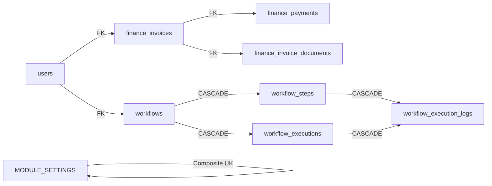

# Database Schema Design

<cite>
**Referenced Files in This Document**
- [db-structure.json](file://db-structure.json)
- [get-db-structure.js](file://backend/scripts/get-db-structure.js)
- [00_schema_migrations.md](file://backend/migrations/00_schema_migrations.md)
- [01_create_projects_table.md](file://backend/migrations/01_create_projects_table.md)
- [05_create_legal_cases_table.md](file://backend/migrations/05_create_legal_cases_table.md)
- [49_create_finance_module_tables.md](file://backend/migrations/49_create_finance_module_tables.md)
- [101_create_workflow_tables.sql](file://backend/migrations/101_create_workflow_tables.sql)
- [102_create_audit_log_table.sql](file://backend/migrations/102_create_audit_log_table.sql)
- [2026-05-04-02-administration-schema-fix.sql](file://backend/migrations/2026-05-04-02-administration-schema-fix.sql)
- [68_create_module_settings_table.sql](file://backend/migrations/68_create_module_settings_table.sql)
- [index.js](file://backend/modules/administration/index.js)
</cite>

## Table of Contents
1. [Introduction](#introduction)
2. [Project Structure](#project-structure)
3. [Core Components](#core-components)
4. [Architecture Overview](#architecture-overview)
5. [Detailed Component Analysis](#detailed-component-analysis)
6. [Dependency Analysis](#dependency-analysis)
7. [Performance Considerations](#performance-considerations)
8. [Troubleshooting Guide](#troubleshooting-guide)
9. [Conclusion](#conclusion)
10. [Appendices](#appendices)

## Introduction
This document describes the complete PostgreSQL schema design for Titan CRM, focusing on entity relationships, table structures, column definitions, primary keys, foreign keys, indexes, constraints, and data types. It also documents the modular architecture with separate business domains (Administration, Legal Cases, Finance, Workflows, Auditing, and Module Settings), naming conventions, validation rules enforced via database constraints, and the schema evolution strategy through migrations.

## Project Structure
The database schema is maintained under the backend directory with:
- Migrations that define schema changes and evolve the database over time
- A script to introspect and export the current database structure to JSON
- Module-specific schemas and tables grouped by functional domain



**Diagram sources**
- [get-db-structure.js:1-272](file://backend/scripts/get-db-structure.js#L1-L271)
- [db-structure.json:1-800](file://db-structure.json#L1-L800)
- [00_schema_migrations.md:1-25](file://backend/migrations/00_schema_migrations.md#L1-L24)
- [01_create_projects_table.md:1-38](file://backend/migrations/01_create_projects_table.md#L1-L38)
- [05_create_legal_cases_table.md:1-130](file://backend/migrations/05_create_legal_cases_table.md#L1-L130)
- [49_create_finance_module_tables.md:1-118](file://backend/migrations/49_create_finance_module_tables.md#L1-L117)
- [101_create_workflow_tables.sql:1-54](file://backend/migrations/101_create_workflow_tables.sql#L1-L53)
- [102_create_audit_log_table.sql:1-21](file://backend/migrations/102_create_audit_log_table.sql#L1-L20)
- [2026-05-04-02-administration-schema-fix.sql:1-57](file://backend/migrations/2026-05-04-02-administration-schema-fix.sql#L1-L56)
- [68_create_module_settings_table.sql:1-434](file://backend/migrations/68_create_module_settings_table.sql#L1-L433)

**Section sources**
- [get-db-structure.js:1-272](file://backend/scripts/get-db-structure.js#L1-L271)
- [db-structure.json:1-800](file://db-structure.json#L1-L800)

## Core Components
This section summarizes the major domains and their representative tables with primary keys, foreign keys, indexes, and constraints.

- Administration
  - Users: primary key on id; optional audit trail via triggers and administration audit log table
  - Roles, Permissions, Employees, Org, Company: routed under administration module
  - Audit log: centralized audit_log table for user actions

- Legal Cases
  - legal_cases: primary key on id
  - Additional related entities: case financial details, events, documents, comments, notes, third parties

- Finance
  - finance_invoice_status: lookup table for invoice statuses
  - finance_invoices: primary key on id; unique constraint on identifier; foreign keys to projects, contractors, users
  - finance_payments: primary key on id; check constraint ensures at least one of invoice_id, project_id, or contractor_id is present
  - finance_invoice_documents: primary key on id; JSONB payload support

- Workflows
  - workflows: primary key on id (UUID)
  - workflow_steps: foreign key to workflows; unique ordering per workflow
  - workflow_executions: foreign key to workflows; JSONB context
  - workflow_execution_logs: foreign key to workflow_executions and workflow_steps

- Module Settings
  - module_settings: composite unique on (module_id, setting_key); JSONB value storage

**Section sources**
- [2026-05-04-02-administration-schema-fix.sql:1-57](file://backend/migrations/2026-05-04-02-administration-schema-fix.sql#L1-L56)
- [102_create_audit_log_table.sql:1-21](file://backend/migrations/102_create_audit_log_table.sql#L1-L20)
- [05_create_legal_cases_table.md:1-130](file://backend/migrations/05_create_legal_cases_table.md#L1-L130)
- [49_create_finance_module_tables.md:1-118](file://backend/migrations/49_create_finance_module_tables.md#L1-L117)
- [101_create_workflow_tables.sql:1-54](file://backend/migrations/101_create_workflow_tables.sql#L1-L53)
- [68_create_module_settings_table.sql:1-434](file://backend/migrations/68_create_module_settings_table.sql#L1-L433)

## Architecture Overview
The schema follows a modular architecture with explicit separation of concerns:
- Public schema tables for core entities
- Domain-specific tables grouped by functional modules
- Centralized auditing and workflow engines
- Extensible module settings for dynamic configuration



**Diagram sources**
- [db-structure.json:1-800](file://db-structure.json#L1-L800)
- [101_create_workflow_tables.sql:1-54](file://backend/migrations/101_create_workflow_tables.sql#L1-L53)
- [102_create_audit_log_table.sql:1-21](file://backend/migrations/102_create_audit_log_table.sql#L1-L20)
- [49_create_finance_module_tables.md:1-118](file://backend/migrations/49_create_finance_module_tables.md#L1-L117)
- [05_create_legal_cases_table.md:1-130](file://backend/migrations/05_create_legal_cases_table.md#L1-L130)
- [68_create_module_settings_table.sql:1-434](file://backend/migrations/68_create_module_settings_table.sql#L1-L433)

## Detailed Component Analysis

### Administration Module
- Users table enhancements:
  - Added first_name, last_name, role_id, is_active, updated_at
  - Trigger to automatically update updated_at on row change
  - Administration audit log table for tracking entity changes
- Routing and organization handled by the administration module index



**Diagram sources**
- [2026-05-04-02-administration-schema-fix.sql:1-57](file://backend/migrations/2026-05-04-02-administration-schema-fix.sql#L1-L56)
- [index.js:1-34](file://backend/modules/administration/index.js#L1-L33)

**Section sources**
- [2026-05-04-02-administration-schema-fix.sql:1-57](file://backend/migrations/2026-05-04-02-administration-schema-fix.sql#L1-L56)
- [index.js:1-34](file://backend/modules/administration/index.js#L1-L33)

### Legal Cases Module
- Core table legal_cases with primary key id
- Related entities:
  - Case financial details, events, documents, comments, notes, third parties
- Additional columns and indexes added over time (e.g., description, timestamps)



**Diagram sources**
- [05_create_legal_cases_table.md:1-130](file://backend/migrations/05_create_legal_cases_table.md#L1-L130)

**Section sources**
- [05_create_legal_cases_table.md:1-130](file://backend/migrations/05_create_legal_cases_table.md#L1-L130)

### Finance Module
- Status lookup table finance_invoice_status
- Invoices table with:
  - Primary key id
  - Unique constraint on identifier
  - Foreign keys to projects, contractors, users
  - Timestamps and defaults
- Payments table with:
  - Primary key id
  - Check constraint ensuring at least one of invoice_id, project_id, or contractor_id is set
- Invoice documents table supporting JSONB payloads

```mermaid
classDiagram
class FinanceInvoiceStatus {
+text id
+text name
+text color
+integer displayorder
}
class FinanceInvoices {
+text id
+text identifier
+integer contractor_id
+integer project_id
+varchar lawyer_user_id
+text title
+text description
+text currency
+numeric amount_total
+numeric amount_paid
+numeric amount_due
+date issue_date
+date due_date
+text status
+varchar created_by
+varchar updated_by
+timestamptz created_at
+timestamptz updated_at
}
class FinancePayments {
+text id
+text kind
+text invoice_id
+integer project_id
+integer contractor_id
+numeric amount
+text currency
+date payment_date
+text method
+text comment
+varchar created_by
+timestamptz created_at
}
class FinanceInvoiceDocuments {
+text id
+text invoice_id
+text document_type
+text document_id
+jsonb template_payload
+text status
+varchar created_by
+timestamptz created_at
}
FinanceInvoices ||--o{ FinanceInvoiceDocuments : "invoice_id"
FinanceInvoices ||--o{ FinancePayments : "invoice_id"
FinanceInvoiceStatus ||--o{ FinanceInvoices : "status"
```

**Diagram sources**
- [49_create_finance_module_tables.md:1-118](file://backend/migrations/49_create_finance_module_tables.md#L1-L117)

**Section sources**
- [49_create_finance_module_tables.md:1-118](file://backend/migrations/49_create_finance_module_tables.md#L1-L117)

### Workflows Engine
- workflows: UUID primary key, trigger configuration stored as JSONB
- workflow_steps: ordered steps per workflow, action configuration JSONB
- workflow_executions: execution context and status
- workflow_execution_logs: per-step execution results and errors



**Diagram sources**
- [101_create_workflow_tables.sql:1-54](file://backend/migrations/101_create_workflow_tables.sql#L1-L53)

**Section sources**
- [101_create_workflow_tables.sql:1-54](file://backend/migrations/101_create_workflow_tables.sql#L1-L53)

### Audit Logging
- Centralized audit_log table capturing user actions, entity changes, IP, and user agent
- Indexed for efficient querying by user, entity, and timestamp



**Diagram sources**
- [102_create_audit_log_table.sql:1-21](file://backend/migrations/102_create_audit_log_table.sql#L1-L20)

**Section sources**
- [102_create_audit_log_table.sql:1-21](file://backend/migrations/102_create_audit_log_table.sql#L1-L20)

### Module Settings
- module_settings: stores module-specific configurations as JSONB
- Composite unique constraint on (module_id, setting_key)
- Indexes for fast lookups



**Diagram sources**
- [68_create_module_settings_table.sql:1-434](file://backend/migrations/68_create_module_settings_table.sql#L1-L433)

**Section sources**
- [68_create_module_settings_table.sql:1-434](file://backend/migrations/68_create_module_settings_table.sql#L1-L433)

## Dependency Analysis
- Foreign Keys
  - Users referenced by workflows (created_by), finance invoices (lawyer_user_id, created_by/updated_by), and administration audit log (changed_by)
  - Invoices referenced by payments and invoice documents
  - Workflows cascade-delete steps and executions; executions cascade-delete logs
- Indexes
  - Finance invoices indexed by status, due_date, project_id, contractor_id
  - Finance payments indexed by invoice_id, project_id
  - Audit log indexed by user_id, entity, created_at
  - Module settings indexed by module_id, setting_key, and composite
- Constraints
  - Unique constraints on invoice identifier
  - Check constraints on payments ensuring at least one target is set
  - Composite unique on module settings (module_id, setting_key)



**Diagram sources**
- [db-structure.json:1-800](file://db-structure.json#L1-L800)
- [101_create_workflow_tables.sql:1-54](file://backend/migrations/101_create_workflow_tables.sql#L1-L53)
- [49_create_finance_module_tables.md:1-118](file://backend/migrations/49_create_finance_module_tables.md#L1-L117)
- [68_create_module_settings_table.sql:1-434](file://backend/migrations/68_create_module_settings_table.sql#L1-L433)

**Section sources**
- [db-structure.json:1-800](file://db-structure.json#L1-L800)

## Performance Considerations
- Indexes on frequently filtered columns:
  - finance_invoices: status, due_date, project_id, contractor_id
  - finance_payments: invoice_id, project_id
  - audit_log: user_id, entity_type+entity_id, created_at
  - module_settings: module_id, setting_key, (module_id, setting_key)
- JSONB fields (template_payload, trigger_config, context) enable flexible schemas while requiring appropriate GIN indexing for complex queries (not shown here but recommended for advanced filtering)
- UUID primary keys reduce contention compared to sequential integers
- Triggers (e.g., updated_at) add overhead; ensure minimal logic in triggers

## Troubleshooting Guide
- Schema introspection
  - Use the database structure script to export current schema to JSON for review and comparison
  - Filter tables by module prefixes to focus on specific domains
- Migration conflicts
  - The schema_migrations tracking table prevents re-applying migrations; verify applied_at timestamps
- Constraint violations
  - Finance payments: ensure at least one of invoice_id, project_id, or contractor_id is set
  - Finance invoices: identifier must be unique
  - Module settings: module_id + setting_key must be unique
- Audit trails
  - Verify audit_log indexes exist for performance; confirm user_id and entity filters work as expected

**Section sources**
- [get-db-structure.js:1-272](file://backend/scripts/get-db-structure.js#L1-L271)
- [00_schema_migrations.md:1-25](file://backend/migrations/00_schema_migrations.md#L1-L24)
- [49_create_finance_module_tables.md:73-76](file://backend/migrations/49_create_finance_module_tables.md#L73-L76)
- [68_create_module_settings_table.sql:12-18](file://backend/migrations/68_create_module_settings_table.sql#L12-L18)
- [102_create_audit_log_table.sql:17-21](file://backend/migrations/102_create_audit_log_table.sql#L17-L20)

## Conclusion
Titan CRM’s database schema is designed around modular domains with clear entity relationships, robust constraints, and performance-oriented indexes. The migration-driven evolution strategy ensures repeatable, auditable changes across Administration, Legal Cases, Finance, Workflows, Auditing, and Module Settings. The schema supports extensibility through JSONB fields and module settings, enabling rapid adaptation to changing business needs while maintaining referential integrity and operational visibility.

## Appendices

### Naming Conventions
- Primary keys: id (serial for integer-based tables, UUID for workflows)
- Foreign keys: <related_table>_id with appropriate data types
- Status/reference tables: plural forms (e.g., finance_invoice_status)
- JSONB fields: template_payload, trigger_config, context, old_values, new_values
- Audit fields: created_by, updated_by, created_at, updated_at, updated_at trigger

### Data Types and Purposes
- varchar/char varying: identifiers, codes, names, statuses
- text: descriptions, comments, payloads
- integer/numeric: counts, monetary amounts, IDs
- date/time: temporal fields
- timestamptz: timestamps with timezone
- uuid: globally unique identifiers for workflows
- jsonb: flexible configuration and structured payloads

### Schema Evolution Strategy
- Track applied migrations in schema_migrations
- Use idempotent migrations with guards (IF NOT EXISTS)
- Add indexes alongside new columns or constraints
- Maintain backward compatibility for JSONB fields
- Seed default reference data in migrations when applicable

**Section sources**
- [00_schema_migrations.md:1-25](file://backend/migrations/00_schema_migrations.md#L1-L24)
- [49_create_finance_module_tables.md:106-117](file://backend/migrations/49_create_finance_module_tables.md#L106-L117)
- [68_create_module_settings_table.sql:1-25](file://backend/migrations/68_create_module_settings_table.sql#L1-L25)