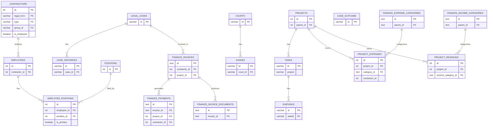
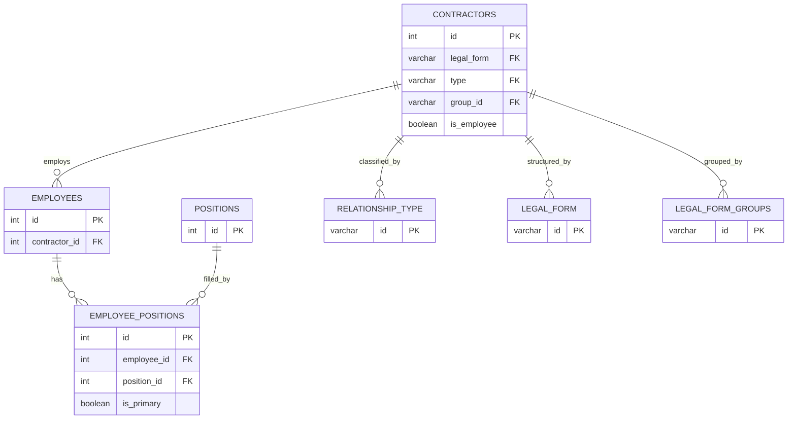
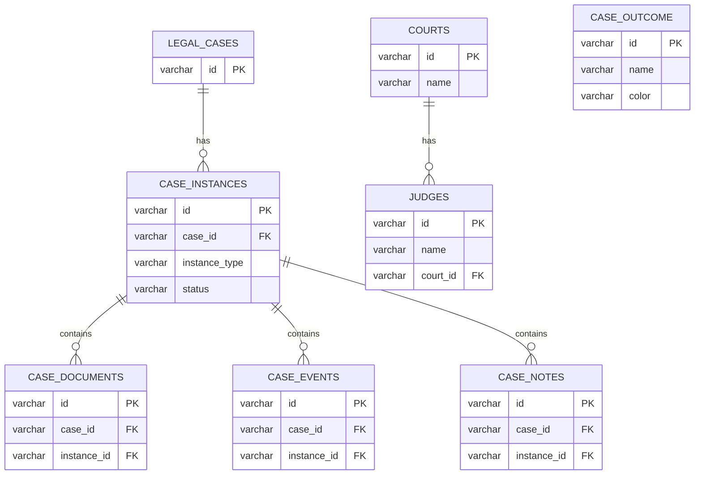
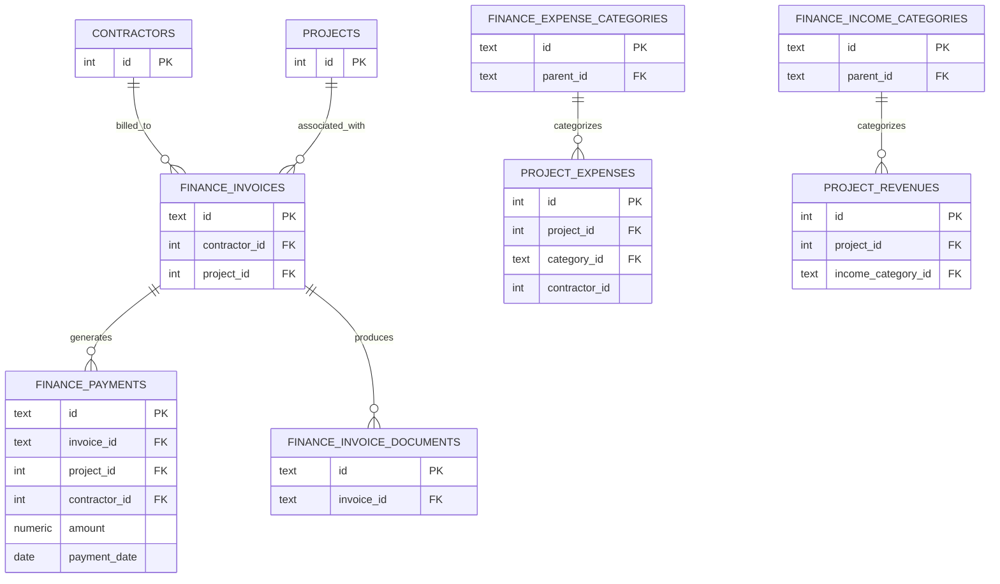
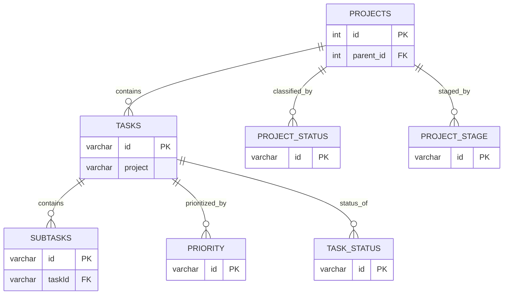
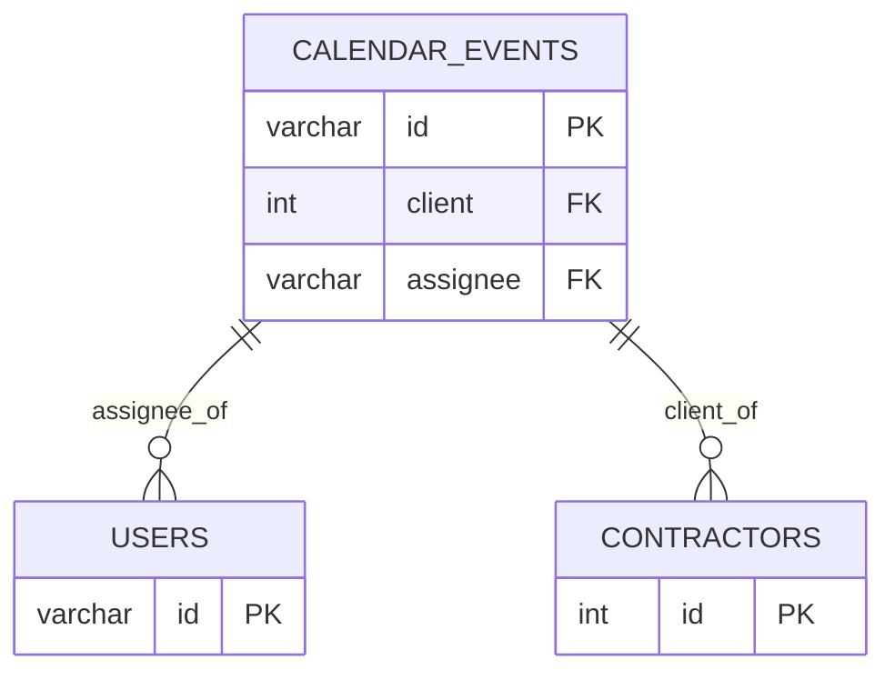
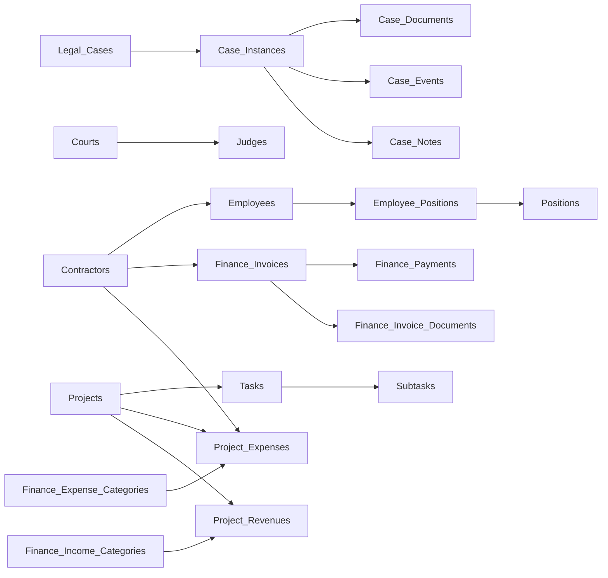

# Entity Relationships

<cite>
**Referenced Files in This Document**
- [db-structure.json](file://backend/config/db-structure.json)
- [02_create_contractors_table.md](file://backend/migrations/02_create_contractors_table.md)
- [05_create_legal_cases_table.md](file://backend/migrations/05_create_legal_cases_table.md)
- [200_case_instances_and_relations.sql](file://backend/migrations/200_case_instances_and_relations.sql)
- [60_create_courts_and_judges_tables.md](file://backend/migrations/60_create_courts_and_judges_tables.md)
- [63_create_case_outcome_table.md](file://backend/migrations/63_create_case_outcome_table.md)
- [49_create_finance_module_tables.md](file://backend/migrations/49_create_finance_module_tables.md)
- [71_project_expenses_table.sql](file://backend/migrations/71_project_expenses_table.sql)
- [73_project_expenses_revenues_categories.sql](file://backend/migrations/73_project_expenses_revenues_categories.sql)
- [01_create_projects_table.md](file://backend/migrations/01_create_projects_table.md)
- [04_create_tasks_table.md](file://backend/migrations/04_create_tasks_table.md)
- [09_create_reference_tables.md](file://backend/migrations/09_create_reference_tables.md)
- [18_create_relationship_types_table.md](file://backend/migrations/18_create_relationship_types_table.md)
- [008_employee_positions_many_to_many.sql](file://backend/migrations/008_employee_positions_many_to_many.sql)
- [57_add_contractor_id_to_employees.sql](file://backend/migrations/57_add_contractor_id_to_employees.sql)
- [117_add_group_id_to_contractors.sql](file://backend/migrations/117_add_group_id_to_contractors.sql)
- [00_schema_migrations.md](file://backend/migrations/00_schema_migrations.md)
</cite>

## Table of Contents
1. [Introduction](#introduction)
2. [Project Structure](#project-structure)
3. [Core Components](#core-components)
4. [Architecture Overview](#architecture-overview)
5. [Detailed Component Analysis](#detailed-component-analysis)
6. [Dependency Analysis](#dependency-analysis)
7. [Performance Considerations](#performance-considerations)
8. [Troubleshooting Guide](#troubleshooting-guide)
9. [Conclusion](#conclusion)

## Introduction
This document describes the entity relationship model for the Titan CRM database schema. It focuses on core entities such as contractors, legal_cases, finance modules, and administrative entities, and explains primary keys, foreign keys, join conditions, and many-to-many relationships. It also highlights cross-module references and the business logic implications of the schema’s design.

## Project Structure
The database schema is primarily defined by migration files and a runtime schema snapshot. The migrations define tables, indexes, constraints, and views, while the schema snapshot provides a current column-level view of tables and their foreign keys.

```mermaid
graph TB
subgraph "Schema Snapshot"
snap["db-structure.json"]
end
subgraph "Migrations"
mig00["00_schema_migrations.md"]
mig01["01_create_projects_table.md"]
mig02["02_create_contractors_table.md"]
mig04["04_create_tasks_table.md"]
mig05["05_create_legal_cases_table.md"]
mig09["09_create_reference_tables.md"]
mig18["18_create_relationship_types_table.md"]
mig49["49_create_finance_module_tables.md"]
mig60["60_create_courts_and_judges_tables.md"]
mig63["63_create_case_outcome_table.md"]
mig200["200_case_instances_and_relations.sql"]
mig57["57_add_contractor_id_to_employees.sql"]
mig008["008_employee_positions_many_to_many.sql"]
mig71["71_project_expenses_table.sql"]
mig73["73_project_expenses_revenues_categories.sql"]
mig117["117_add_group_id_to_contractors.sql"]
end
snap --- mig00
mig01 --- mig02
mig01 --- mig04
mig02 --- mig09
mig02 --- mig18
mig04 --- mig09
mig05 --- mig09
mig05 --- mig60
mig05 --- mig63
mig05 --- mig200
mig49 --- mig09
mig49 --- mig71
mig71 --- mig73
mig57 --- mig09
mig008 --- mig09
mig117 --- mig09
```

**Diagram sources**
- [db-structure.json](file://backend/config/db-structure.json)
- [00_schema_migrations.md](file://backend/migrations/00_schema_migrations.md)
- [01_create_projects_table.md](file://backend/migrations/01_create_projects_table.md)
- [02_create_contractors_table.md](file://backend/migrations/02_create_contractors_table.md)
- [04_create_tasks_table.md](file://backend/migrations/04_create_tasks_table.md)
- [05_create_legal_cases_table.md](file://backend/migrations/05_create_legal_cases_table.md)
- [09_create_reference_tables.md](file://backend/migrations/09_create_reference_tables.md)
- [18_create_relationship_types_table.md](file://backend/migrations/18_create_relationship_types_table.md)
- [49_create_finance_module_tables.md](file://backend/migrations/49_create_finance_module_tables.md)
- [60_create_courts_and_judges_tables.md](file://backend/migrations/60_create_courts_and_judges_tables.md)
- [63_create_case_outcome_table.md](file://backend/migrations/63_create_case_outcome_table.md)
- [200_case_instances_and_relations.sql](file://backend/migrations/200_case_instances_and_relations.sql)
- [57_add_contractor_id_to_employees.sql](file://backend/migrations/57_add_contractor_id_to_employees.sql)
- [008_employee_positions_many_to_many.sql](file://backend/migrations/008_employee_positions_many_to_many.sql)
- [71_project_expenses_table.sql](file://backend/migrations/71_project_expenses_table.sql)
- [73_project_expenses_revenues_categories.sql](file://backend/migrations/73_project_expenses_revenues_categories.sql)
- [117_add_group_id_to_contractors.sql](file://backend/migrations/117_add_group_id_to_contractors.sql)

**Section sources**
- [db-structure.json](file://backend/config/db-structure.json)
- [00_schema_migrations.md](file://backend/migrations/00_schema_migrations.md)

## Core Components
This section summarizes the primary entities and their core attributes, focusing on primary keys and foreign keys as defined by migrations and the schema snapshot.

- Projects
  - Primary key: id (integer)
  - Parent-child hierarchy via parent_id referencing projects.id
  - Related to tasks and finance via project_id

- Contractors
  - Primary key: id (integer)
  - Additional identifiers: inn, kpp, ogrn
  - Relationship type and legal form reference via contractor_type.id and legal_form.id
  - Optional group_id referencing legal_form_groups.id (via migration)

- Tasks
  - Primary key: id (varchar)
  - Project association via project field (varchar)
  - Subtasks linked via subtasks.taskId

- Legal Cases
  - Primary key: id (varchar)
  - Lawyer and party references via lawyerId and plaintiff/defendant
  - Instance hierarchy via case_instances (one legal_cases to many case_instances)
  - Outcomes via case_outcome.id
  - Courts and judges via courts.id and judges.court_id

- Finance Module
  - Invoices: primary key id (text), contractor_id (integer), project_id (integer)
  - Payments: primary key id (text), invoice_id (text), project_id (integer), contractor_id (integer)
  - Invoice documents: primary key id (text), invoice_id (text)
  - Expense categories: hierarchical taxonomy via parent_id
  - Income categories: hierarchical taxonomy via parent_id

- Administration
  - Employees ↔ Contractors via employees.contractor_id → contractors.id
  - Employee ↔ Positions many-to-many via employee_positions junction table
  - Relationship types via relationship_type.id

- Reference/Lookup Tables
  - contractor_status, contractor_type, legal_form, currency, case_status, case_type, task_status, priority, project_status, project_stage, specialization, lawyer_status, event_type, mail_label

**Section sources**
- [01_create_projects_table.md](file://backend/migrations/01_create_projects_table.md)
- [02_create_contractors_table.md](file://backend/migrations/02_create_contractors_table.md)
- [04_create_tasks_table.md](file://backend/migrations/04_create_tasks_table.md)
- [05_create_legal_cases_table.md](file://backend/migrations/05_create_legal_cases_table.md)
- [200_case_instances_and_relations.sql](file://backend/migrations/200_case_instances_and_relations.sql)
- [60_create_courts_and_judges_tables.md](file://backend/migrations/60_create_courts_and_judges_tables.md)
- [63_create_case_outcome_table.md](file://backend/migrations/63_create_case_outcome_table.md)
- [49_create_finance_module_tables.md](file://backend/migrations/49_create_finance_module_tables.md)
- [71_project_expenses_table.sql](file://backend/migrations/71_project_expenses_table.sql)
- [73_project_expenses_revenues_categories.sql](file://backend/migrations/73_project_expenses_revenues_categories.sql)
- [09_create_reference_tables.md](file://backend/migrations/09_create_reference_tables.md)
- [18_create_relationship_types_table.md](file://backend/migrations/18_create_relationship_types_table.md)
- [008_employee_positions_many_to_many.sql](file://backend/migrations/008_employee_positions_many_to_many.sql)
- [57_add_contractor_id_to_employees.sql](file://backend/migrations/57_add_contractor_id_to_employees.sql)
- [117_add_group_id_to_contractors.sql](file://backend/migrations/117_add_group_id_to_contractors.sql)

## Architecture Overview
The schema integrates modules through shared entities:
- Contractors bridge administration (employees) and legal/fiscal workflows.
- Projects connect tasks and finance (invoices/payments).
- Legal cases integrate with courts/judges and outcomes.
- Finance categories enable cross-module categorization for expenses/income.

**Diagram sources**
- [01_create_projects_table.md](file://backend/migrations/01_create_projects_table.md)
- [04_create_tasks_table.md](file://backend/migrations/04_create_tasks_table.md)
- [02_create_contractors_table.md](file://backend/migrations/02_create_contractors_table.md)
- [57_add_contractor_id_to_employees.sql](file://backend/migrations/57_add_contractor_id_to_employees.sql)
- [008_employee_positions_many_to_many.sql](file://backend/migrations/008_employee_positions_many_to_many.sql)
- [05_create_legal_cases_table.md](file://backend/migrations/05_create_legal_cases_table.md)
- [200_case_instances_and_relations.sql](file://backend/migrations/200_case_instances_and_relations.sql)
- [60_create_courts_and_judges_tables.md](file://backend/migrations/60_create_courts_and_judges_tables.md)
- [63_create_case_outcome_table.md](file://backend/migrations/63_create_case_outcome_table.md)
- [49_create_finance_module_tables.md](file://backend/migrations/49_create_finance_module_tables.md)
- [71_project_expenses_table.sql](file://backend/migrations/71_project_expenses_table.sql)
- [73_project_expenses_revenues_categories.sql](file://backend/migrations/73_project_expenses_revenues_categories.sql)

## Detailed Component Analysis

### Contractors and Administrative Entities
Contractors serve as the central hub for administrative and external relationships:
- contractor_type and legal_form reference tables define classification and legal structure.
- group_id links contractors to legal_form_groups for tab/grouping.
- Employees can be linked to Contractors via contractor_id, enabling HR alignment.
- Many-to-many between Employees and Positions is managed via employee_positions.

**Diagram sources**
- [02_create_contractors_table.md](file://backend/migrations/02_create_contractors_table.md)
- [18_create_relationship_types_table.md](file://backend/migrations/18_create_relationship_types_table.md)
- [008_employee_positions_many_to_many.sql](file://backend/migrations/008_employee_positions_many_to_many.sql)
- [57_add_contractor_id_to_employees.sql](file://backend/migrations/57_add_contractor_id_to_employees.sql)
- [117_add_group_id_to_contractors.sql](file://backend/migrations/117_add_group_id_to_contractors.sql)

**Section sources**
- [02_create_contractors_table.md](file://backend/migrations/02_create_contractors_table.md)
- [18_create_relationship_types_table.md](file://backend/migrations/18_create_relationship_types_table.md)
- [008_employee_positions_many_to_many.sql](file://backend/migrations/008_employee_positions_many_to_many.sql)
- [57_add_contractor_id_to_employees.sql](file://backend/migrations/57_add_contractor_id_to_employees.sql)
- [117_add_group_id_to_contractors.sql](file://backend/migrations/117_add_group_id_to_contractors.sql)

### Legal Cases, Instances, Courts, and Outcomes
Legal cases are extended with instance hierarchies and integrated with courts and judges. Outcomes provide customizable resolution categories.

**Diagram sources**
- [05_create_legal_cases_table.md](file://backend/migrations/05_create_legal_cases_table.md)
- [200_case_instances_and_relations.sql](file://backend/migrations/200_case_instances_and_relations.sql)
- [60_create_courts_and_judges_tables.md](file://backend/migrations/60_create_courts_and_judges_tables.md)
- [63_create_case_outcome_table.md](file://backend/migrations/63_create_case_outcome_table.md)

**Section sources**
- [05_create_legal_cases_table.md](file://backend/migrations/05_create_legal_cases_table.md)
- [200_case_instances_and_relations.sql](file://backend/migrations/200_case_instances_and_relations.sql)
- [60_create_courts_and_judges_tables.md](file://backend/migrations/60_create_courts_and_judges_tables.md)
- [63_create_case_outcome_table.md](file://backend/migrations/63_create_case_outcome_table.md)

### Finance Module: Invoices, Payments, and Categories
Finance entities connect contractors and projects, with documents and payments referencing invoices. Categories enable classification for expenses and income.

**Diagram sources**
- [49_create_finance_module_tables.md](file://backend/migrations/49_create_finance_module_tables.md)
- [71_project_expenses_table.sql](file://backend/migrations/71_project_expenses_table.sql)
- [73_project_expenses_revenues_categories.sql](file://backend/migrations/73_project_expenses_revenues_categories.sql)

**Section sources**
- [49_create_finance_module_tables.md](file://backend/migrations/49_create_finance_module_tables.md)
- [71_project_expenses_table.sql](file://backend/migrations/71_project_expenses_table.sql)
- [73_project_expenses_revenues_categories.sql](file://backend/migrations/73_project_expenses_revenues_categories.sql)

### Projects, Tasks, and Subtasks
Projects organize tasks and subtasks, with statuses and priorities defined by reference tables.

**Diagram sources**
- [01_create_projects_table.md](file://backend/migrations/01_create_projects_table.md)
- [04_create_tasks_table.md](file://backend/migrations/04_create_tasks_table.md)
- [09_create_reference_tables.md](file://backend/migrations/09_create_reference_tables.md)

**Section sources**
- [01_create_projects_table.md](file://backend/migrations/01_create_projects_table.md)
- [04_create_tasks_table.md](file://backend/migrations/04_create_tasks_table.md)
- [09_create_reference_tables.md](file://backend/migrations/09_create_reference_tables.md)

### Calendar Events and Cross-Module References
Calendar events reference users and contractors, linking administrative and external entities.

**Diagram sources**
- [db-structure.json](file://backend/config/db-structure.json)

**Section sources**
- [db-structure.json](file://backend/config/db-structure.json)

## Dependency Analysis
This section maps dependencies among core entities and highlights referential integrity constraints.

**Diagram sources**
- [01_create_projects_table.md](file://backend/migrations/01_create_projects_table.md)
- [04_create_tasks_table.md](file://backend/migrations/04_create_tasks_table.md)
- [02_create_contractors_table.md](file://backend/migrations/02_create_contractors_table.md)
- [57_add_contractor_id_to_employees.sql](file://backend/migrations/57_add_contractor_id_to_employees.sql)
- [008_employee_positions_many_to_many.sql](file://backend/migrations/008_employee_positions_many_to_many.sql)
- [05_create_legal_cases_table.md](file://backend/migrations/05_create_legal_cases_table.md)
- [200_case_instances_and_relations.sql](file://backend/migrations/200_case_instances_and_relations.sql)
- [60_create_courts_and_judges_tables.md](file://backend/migrations/60_create_courts_and_judges_tables.md)
- [49_create_finance_module_tables.md](file://backend/migrations/49_create_finance_module_tables.md)
- [71_project_expenses_table.sql](file://backend/migrations/71_project_expenses_table.sql)
- [73_project_expenses_revenues_categories.sql](file://backend/migrations/73_project_expenses_revenues_categories.sql)

**Section sources**
- [01_create_projects_table.md](file://backend/migrations/01_create_projects_table.md)
- [04_create_tasks_table.md](file://backend/migrations/04_create_tasks_table.md)
- [02_create_contractors_table.md](file://backend/migrations/02_create_contractors_table.md)
- [57_add_contractor_id_to_employees.sql](file://backend/migrations/57_add_contractor_id_to_employees.sql)
- [008_employee_positions_many_to_many.sql](file://backend/migrations/008_employee_positions_many_to_many.sql)
- [05_create_legal_cases_table.md](file://backend/migrations/05_create_legal_cases_table.md)
- [200_case_instances_and_relations.sql](file://backend/migrations/200_case_instances_and_relations.sql)
- [60_create_courts_and_judges_tables.md](file://backend/migrations/60_create_courts_and_judges_tables.md)
- [49_create_finance_module_tables.md](file://backend/migrations/49_create_finance_module_tables.md)
- [71_project_expenses_table.sql](file://backend/migrations/71_project_expenses_table.sql)
- [73_project_expenses_revenues_categories.sql](file://backend/migrations/73_project_expenses_revenues_categories.sql)

## Performance Considerations
- Indexes on foreign keys improve JOIN performance:
  - finance_invoices(contractor_id), finance_invoices(project_id)
  - finance_payments(invoice_id), finance_payments(project_id)
  - project_expenses(project_id), project_expenses(category_id)
  - case_instances(case_id), case_documents(instance_id), case_events(instance_id), case_notes(instance_id)
- Hierarchical categories (finance_expense_categories, finance_income_categories) benefit from parent_id indexing.
- Denormalized references (e.g., tasks.project) simplify queries but require careful updates to maintain referential integrity.

[No sources needed since this section provides general guidance]

## Troubleshooting Guide
Common issues and resolutions grounded in schema definitions:
- Missing contractor group_id constraint
  - Symptom: group_id present but no FK constraint.
  - Resolution: Ensure foreign key constraint to legal_form_groups.id is created and data aligned.
  - Section sources
    - [117_add_group_id_to_contractors.sql](file://backend/migrations/117_add_group_id_to_contractors.sql)

- Many-to-many employee-position linkage
  - Symptom: duplicate or missing position assignments.
  - Resolution: Verify employee_positions uniqueness and cascade behavior on employees/positions deletion.
  - Section sources
    - [008_employee_positions_many_to_many.sql](file://backend/migrations/008_employee_positions_many_to_many.sql)

- Finance payment validation
  - Symptom: payments without required invoice/project/contractor linkage.
  - Resolution: Enforce CHECK constraint ensuring at least one of invoice_id, project_id, or contractor_id is set.
  - Section sources
    - [49_create_finance_module_tables.md](file://backend/migrations/49_create_finance_module_tables.md)

- Case instance data integrity
  - Symptom: orphaned documents/events/notes after case deletion.
  - Resolution: Confirm ON DELETE CASCADE from legal_cases to case_instances and SET NULL from case_instances to related records.
  - Section sources
    - [200_case_instances_and_relations.sql](file://backend/migrations/200_case_instances_and_relations.sql)

- Category taxonomy consistency
  - Symptom: mismatch between project_expenses.category_id and finance_expense_categories.id.
  - Resolution: Align category_id values and ensure parent_id hierarchy integrity.
  - Section sources
    - [73_project_expenses_revenues_categories.sql](file://backend/migrations/73_project_expenses_revenues_categories.sql)

## Conclusion
The Titan CRM schema integrates administrative, legal, and financial domains around shared entities like contractors, projects, and categories. Clear primary and foreign key definitions, many-to-many junction tables, and hierarchical categories enable robust cross-module workflows. Adhering to referential integrity constraints and maintaining indexes ensures reliable performance and accurate reporting across modules.