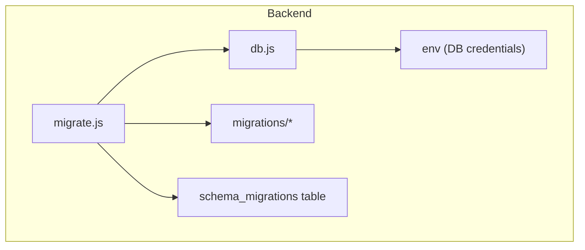
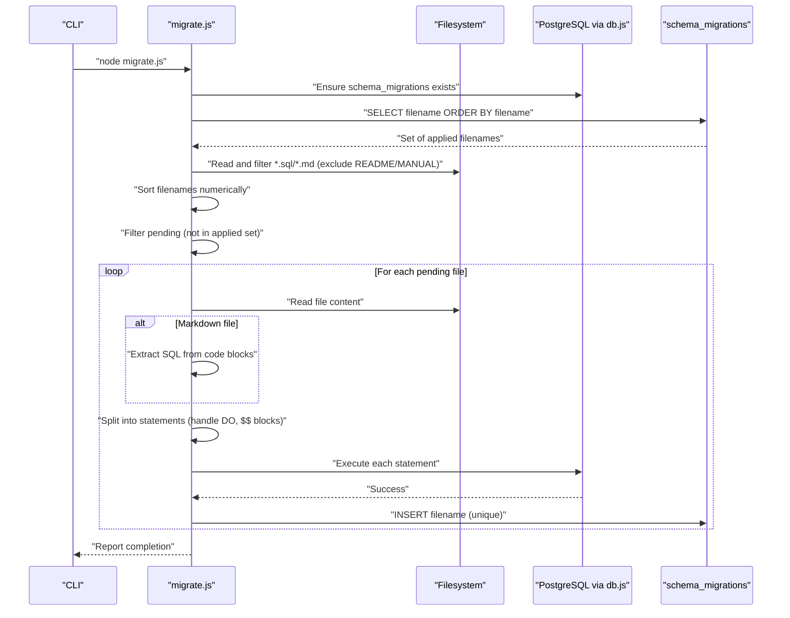
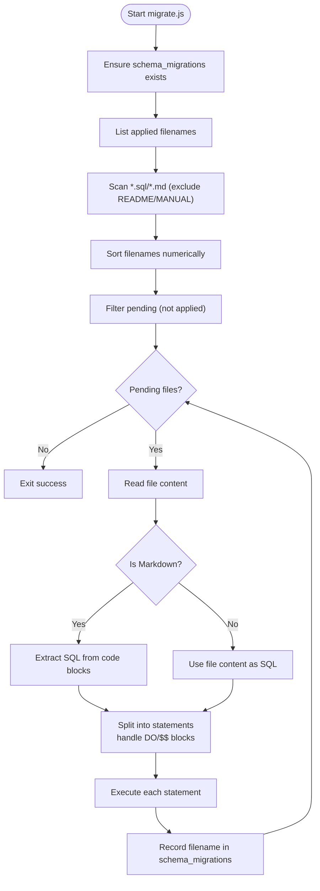
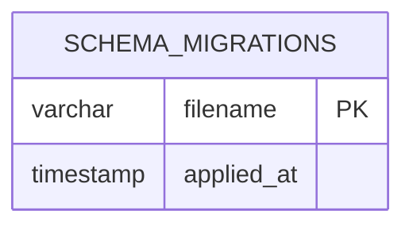
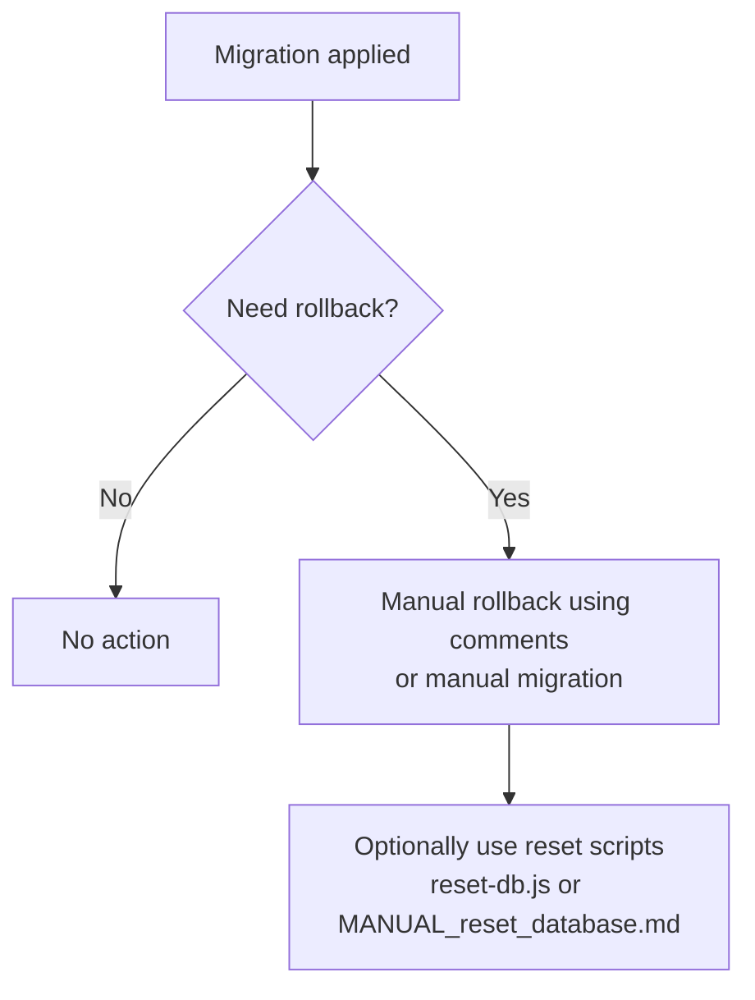
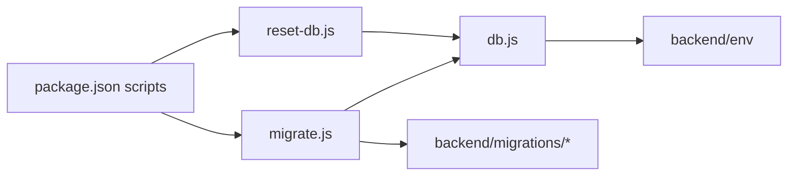

# Migration System

<cite>
**Referenced Files in This Document**
- [migrate.js](file://backend/migrate.js)
- [README.md](file://backend/migrations/README.md)
- [00_schema_migrations.md](file://backend/migrations/00_schema_migrations.md)
- [01_create_projects_table.md](file://backend/migrations/01_create_projects_table.md)
- [100_add_project_stage_id_to_tasks.sql](file://backend/migrations/100_add_project_stage_id_to_tasks.sql)
- [102_create_audit_log_table.sql](file://backend/migrations/102_create_audit_log_table.sql)
- [2026-05-04-01-create-audit-log.js](file://backend/migrations/2026-05-04-01-create-audit-log.js)
- [MANUAL_reset_database.md](file://backend/migrations/MANUAL_reset_database.md)
- [reset-db.js](file://backend/reset-db.js)
- [db.js](file://backend/db.js)
- [package.json](file://backend/package.json)
- [63_create_case_outcome_table.sql](file://backend/migrations/63_create_case_outcome_table.sql)
- [63_INSTALL_INSTRUCTIONS.md.txt](file://backend/migrations/63_INSTALL_INSTRUCTIONS.md.txt)
</cite>

## Table of Contents
1. [Introduction](#introduction)
2. [Project Structure](#project-structure)
3. [Core Components](#core-components)
4. [Architecture Overview](#architecture-overview)
5. [Detailed Component Analysis](#detailed-component-analysis)
6. [Dependency Analysis](#dependency-analysis)
7. [Performance Considerations](#performance-considerations)
8. [Troubleshooting Guide](#troubleshooting-guide)
9. [Conclusion](#conclusion)
10. [Appendices](#appendices)

## Introduction
This document describes the Titan CRM database migration system responsible for schema evolution across development, staging, and production environments. It explains migration file structure, naming conventions, execution order, and the migration runner behavior. It also covers schema change tracking, rollback procedures, complex migration patterns, best practices, testing strategies, deployment considerations, conflict resolution, and troubleshooting.

## Project Structure
The migration system is centered around:
- A dedicated migrations directory containing numbered migration files in SQL and Markdown formats
- A migration runner script that applies pending migrations and tracks applied ones
- A schema_migrations tracking table
- Supporting scripts for reset and database operations
- Environment configuration for database connectivity

**Diagram sources**
- [migrate.js:134-215](file://backend/migrate.js#L134-L215)
- [db.js:31-37](file://backend/db.js#L31-L37)
- [00_schema_migrations.md:10-18](file://backend/migrations/00_schema_migrations.md#L10-L18)

**Section sources**
- [migrate.js:134-215](file://backend/migrate.js#L134-L215)
- [README.md:113-159](file://backend/migrations/README.md#L113-L159)

## Core Components
- Migration Runner (migrate.js)
  - Creates and maintains the schema_migrations tracking table
  - Discovers migration files (SQL and Markdown) and sorts them numerically
  - Extracts SQL from Markdown files and splits into executable statements
  - Executes only pending migrations and records successful applications
- Migration Tracking
  - Tracks filenames and timestamps of applied migrations
  - Prevents duplicate execution and enables fast incremental runs
- Reset Utilities
  - Provides a controlled reset script and a manual reset migration for destructive operations

**Section sources**
- [migrate.js:92-132](file://backend/migrate.js#L92-L132)
- [migrate.js:134-215](file://backend/migrate.js#L134-L215)
- [00_schema_migrations.md:10-18](file://backend/migrations/00_schema_migrations.md#L10-L18)
- [reset-db.js:13-101](file://backend/reset-db.js#L13-L101)
- [MANUAL_reset_database.md:12-67](file://backend/migrations/MANUAL_reset_database.md#L12-L67)

## Architecture Overview
The migration pipeline ensures idempotent, ordered, and trackable schema evolution.

**Diagram sources**
- [migrate.js:134-215](file://backend/migrate.js#L134-L215)
- [migrate.js:111-132](file://backend/migrate.js#L111-L132)
- [migrate.js:17-89](file://backend/migrate.js#L17-L89)
- [00_schema_migrations.md:10-18](file://backend/migrations/00_schema_migrations.md#L10-L18)

## Detailed Component Analysis

### Migration Runner Script
Responsibilities:
- Ensure the schema_migrations tracking table exists
- Discover and sort migration files
- Extract SQL from Markdown and split statements safely
- Execute only pending migrations
- Record successful applications atomically per-file

Key behaviors:
- Index-aware statement splitting handles DO blocks and dollar-quoted blocks
- Skips empty or comment-only files
- Fails fast on first error and does not record partial failures
- Reports counts and progress

**Diagram sources**
- [migrate.js:134-215](file://backend/migrate.js#L134-L215)
- [migrate.js:17-89](file://backend/migrate.js#L17-L89)
- [migrate.js:111-132](file://backend/migrate.js#L111-L132)

**Section sources**
- [migrate.js:92-132](file://backend/migrate.js#L92-L132)
- [migrate.js:134-215](file://backend/migrate.js#L134-L215)
- [migrate.js:17-89](file://backend/migrate.js#L17-L89)

### Migration File Formats and Conventions
- Naming
  - Numerical prefixes with leading zeros (e.g., 01_, 02_, ..., 100_)
  - Mixed extensions: .sql and .md
- Markdown migrations
  - SQL extracted from fenced code blocks
  - Rollback instructions must be commented or marked manual-only to avoid accidental execution
- SQL migrations
  - Self-contained statements; use IF NOT EXISTS for idempotency
- Execution order
  - Sorted numerically by filename; no manual ordering required

Examples:
- Creating a core table: [01_create_projects_table.md](file://backend/migrations/01_create_projects_table.md)
- Adding a column with index and optional FK: [100_add_project_stage_id_to_tasks.sql](file://backend/migrations/100_add_project_stage_id_to_tasks.sql)
- Audit log table creation (SQL): [102_create_audit_log_table.sql](file://backend/migrations/102_create_audit_log_table.sql)
- Audit log table creation (JavaScript-based migration): [2026-05-04-01-create-audit-log.js](file://backend/migrations/2026-05-04-01-create-audit-log.js)

**Section sources**
- [README.md:32-86](file://backend/migrations/README.md#L32-L86)
- [README.md:157-159](file://backend/migrations/README.md#L157-L159)
- [01_create_projects_table.md:1-38](file://backend/migrations/01_create_projects_table.md#L1-L38)
- [100_add_project_stage_id_to_tasks.sql:1-16](file://backend/migrations/100_add_project_stage_id_to_tasks.sql#L1-L15)
- [102_create_audit_log_table.sql:1-21](file://backend/migrations/102_create_audit_log_table.sql#L1-L20)
- [2026-05-04-01-create-audit-log.js:14-99](file://backend/migrations/2026-05-04-01-create-audit-log.js#L14-L99)

### Schema Change Tracking Mechanism
- Tracking table: schema_migrations with filename and applied_at
- Index on applied_at for fast lookups
- Applied migrations are stored as filenames; duplicates are prevented via primary key

**Diagram sources**
- [00_schema_migrations.md:10-18](file://backend/migrations/00_schema_migrations.md#L10-L18)
- [migrate.js:92-108](file://backend/migrate.js#L92-L108)

**Section sources**
- [00_schema_migrations.md:10-18](file://backend/migrations/00_schema_migrations.md#L10-L18)
- [migrate.js:111-119](file://backend/migrate.js#L111-L119)

### Rollback Procedures
- Automatic rollback support is not implemented in the runner for SQL-based migrations
- Rollbacks must be performed manually using comments or dedicated manual migrations
- Examples of manual reset migration: [MANUAL_reset_database.md](file://backend/migrations/MANUAL_reset_database.md)
- Controlled reset script: [reset-db.js](file://backend/reset-db.js)
- JavaScript-based migrations include explicit down() functions for reversible changes (see [2026-05-04-01-create-audit-log.js](file://backend/migrations/2026-05-04-01-create-audit-log.js))

**Diagram sources**
- [README.md:50-54](file://backend/migrations/README.md#L50-L54)
- [MANUAL_reset_database.md:12-67](file://backend/migrations/MANUAL_reset_database.md#L12-L67)
- [reset-db.js:13-101](file://backend/reset-db.js#L13-L101)
- [2026-05-04-01-create-audit-log.js:68-99](file://backend/migrations/2026-05-04-01-create-audit-log.js#L68-L99)

**Section sources**
- [README.md:50-54](file://backend/migrations/README.md#L50-L54)
- [MANUAL_reset_database.md:12-67](file://backend/migrations/MANUAL_reset_database.md#L12-L67)
- [reset-db.js:13-101](file://backend/reset-db.js#L13-L101)
- [2026-05-04-01-create-audit-log.js:68-99](file://backend/migrations/2026-05-04-01-create-audit-log.js#L68-L99)

### Complex Migration Patterns
- Adding new modules and related tables
  - Example: Audit log tables in SQL and JS-based migrations
  - See [102_create_audit_log_table.sql](file://backend/migrations/102_create_audit_log_table.sql) and [2026-05-04-01-create-audit-log.js](file://backend/migrations/2026-05-04-01-create-audit-log.js)
- Modifying existing tables
  - Example: Adding columns, indexes, and optional foreign keys
  - See [100_add_project_stage_id_to_tasks.sql](file://backend/migrations/100_add_project_stage_id_to_tasks.sql)
- Data transformations and seeding
  - Example: Seeding default case outcomes
  - See [63_create_case_outcome_table.sql](file://backend/migrations/63_create_case_outcome_table.sql)

**Section sources**
- [102_create_audit_log_table.sql:1-21](file://backend/migrations/102_create_audit_log_table.sql#L1-L20)
- [2026-05-04-01-create-audit-log.js:14-99](file://backend/migrations/2026-05-04-01-create-audit-log.js#L14-L99)
- [100_add_project_stage_id_to_tasks.sql:1-16](file://backend/migrations/100_add_project_stage_id_to_tasks.sql#L1-L15)
- [63_create_case_outcome_table.sql:1-23](file://backend/migrations/63_create_case_outcome_table.sql#L1-L22)

### Environment and Execution
- Database connectivity is configured via environment variables loaded from backend/env
- Scripts are exposed via package.json for easy invocation
- Typical commands:
  - Apply migrations: npm run migrate
  - Reset database: npm run reset

**Section sources**
- [db.js:6-29](file://backend/db.js#L6-L29)
- [package.json:5-34](file://backend/package.json#L5-L34)

## Dependency Analysis
- migrate.js depends on:
  - db.js for PostgreSQL queries
  - filesystem for reading migration files
  - schema_migrations table for tracking
- db.js depends on backend/env for credentials
- package.json exposes migration and reset scripts

**Diagram sources**
- [package.json:5-34](file://backend/package.json#L5-L34)
- [migrate.js:134-215](file://backend/migrate.js#L134-L215)
- [reset-db.js:13-101](file://backend/reset-db.js#L13-L101)
- [db.js:6-29](file://backend/db.js#L6-L29)

**Section sources**
- [package.json:5-34](file://backend/package.json#L5-L34)
- [migrate.js:134-215](file://backend/migrate.js#L134-L215)
- [reset-db.js:13-101](file://backend/reset-db.js#L13-L101)
- [db.js:6-29](file://backend/db.js#L6-L29)

## Performance Considerations
- Statement splitting avoids executing comments and empty lines
- Index on schema_migrations.applied_at improves lookup performance
- Using IF NOT EXISTS and minimal DDL reduces redundant work
- Batch execution per migration file minimizes round-trips

[No sources needed since this section provides general guidance]

## Troubleshooting Guide
Common issues and resolutions:
- Missing environment variables
  - Ensure DB_USER, DB_HOST, DB_NAME, DB_PASSWORD, DB_PORT are present in backend/env
- Migration fails mid-execution
  - The runner stops and does not record partial application; fix the error and rerun
- Conflicts or duplicate execution attempts
  - The schema_migrations table prevents duplicates; verify applied set and filenames
- Manual reset required
  - Use the reset script or manual reset migration for destructive operations

**Section sources**
- [db.js:20-29](file://backend/db.js#L20-L29)
- [migrate.js:205-211](file://backend/migrate.js#L205-L211)
- [reset-db.js:13-101](file://backend/reset-db.js#L13-L101)
- [MANUAL_reset_database.md:12-67](file://backend/migrations/MANUAL_reset_database.md#L12-L67)

## Conclusion
Titan CRM’s migration system provides a robust, idempotent, and trackable approach to schema evolution. By combining numeric ordering, Markdown/SQL flexibility, and a dedicated tracking table, it supports safe deployments across environments. For irreversible changes, manual rollbacks or controlled resets are recommended. Following the documented best practices ensures predictable upgrades and reliable operations.

[No sources needed since this section summarizes without analyzing specific files]

## Appendices

### Best Practices
- Use leading zeros in filenames to ensure correct numeric sorting
- Prefer IF NOT EXISTS for idempotency
- Keep SQL blocks self-contained; separate concerns across files
- Use Markdown migrations for complex narratives and rollback notes
- Test migrations on a copy of production data before applying to live systems

**Section sources**
- [README.md:57-63](file://backend/migrations/README.md#L57-L63)

### Testing Strategies
- Local testing: npm run migrate on a development database
- Staging verification: apply migrations to a staging replica
- Dry-run checks: review pending migrations and SQL extraction behavior
- Post-deploy verification: confirm schema_migrations entries and table structures

**Section sources**
- [migrate.js:134-215](file://backend/migrate.js#L134-L215)
- [README.md:88-101](file://backend/migrations/README.md#L88-L101)

### Deployment Considerations
- Always back up the database before running migrations
- Apply migrations during maintenance windows when possible
- Monitor schema_migrations to confirm successful application
- For manual-only rollbacks, keep rollback instructions in comments within migration files

**Section sources**
- [README.md:102-112](file://backend/migrations/README.md#L102-L112)
- [README.md:50-54](file://backend/migrations/README.md#L50-L54)

### Additional Examples and Instructions
- Example installation instructions for a specific migration: [63_INSTALL_INSTRUCTIONS.md.txt](file://backend/migrations/63_INSTALL_INSTRUCTIONS.md.txt)
- Example SQL migration for case outcomes: [63_create_case_outcome_table.sql](file://backend/migrations/63_create_case_outcome_table.sql)

**Section sources**
- [63_INSTALL_INSTRUCTIONS.md.txt:1-56](file://backend/migrations/63_INSTALL_INSTRUCTIONS.md.txt#L1-L55)
- [63_create_case_outcome_table.sql:1-23](file://backend/migrations/63_create_case_outcome_table.sql#L1-L22)