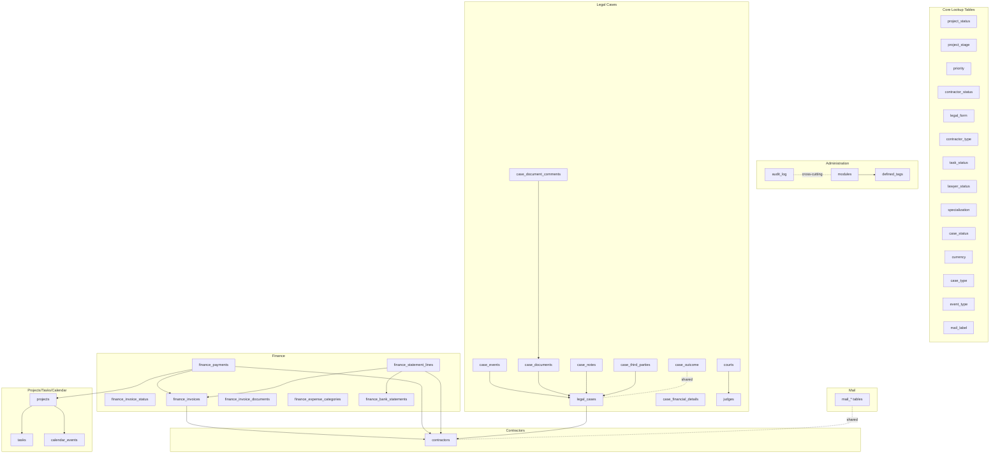
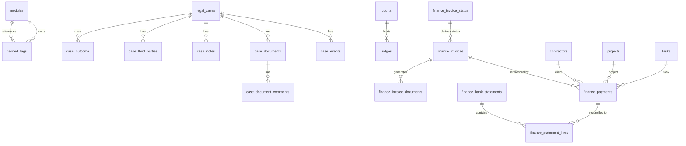
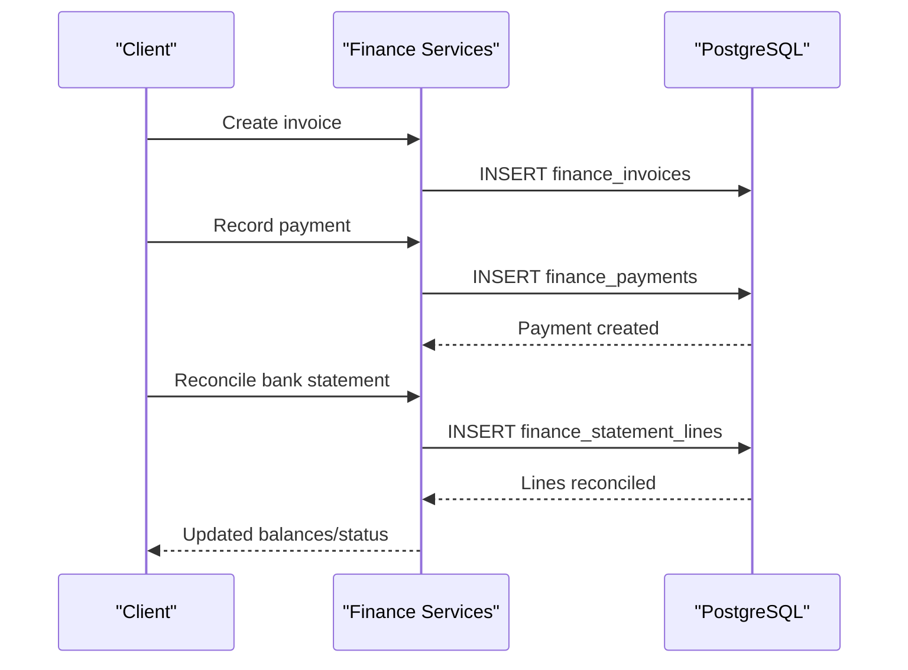
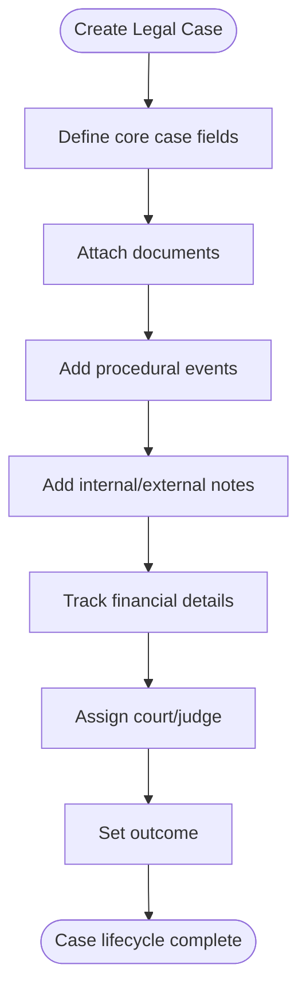
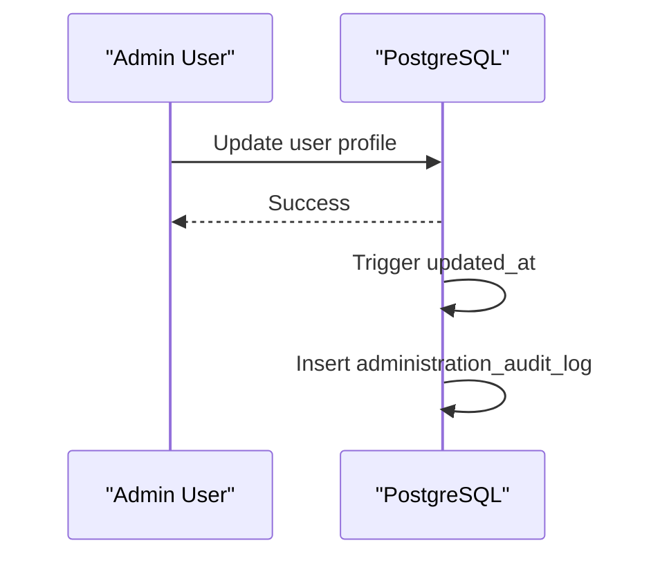
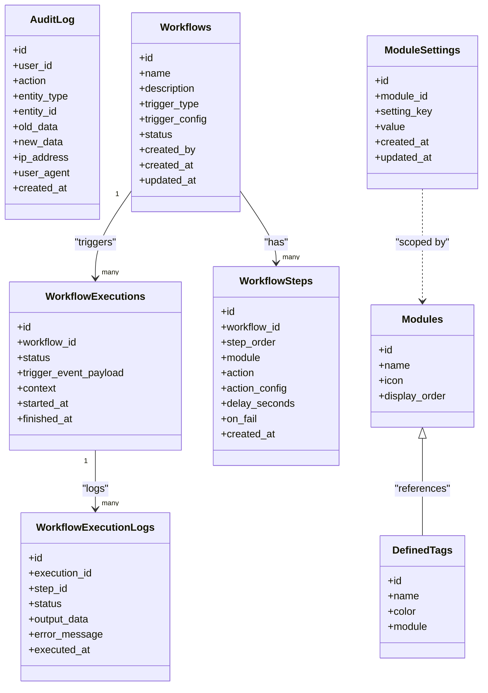
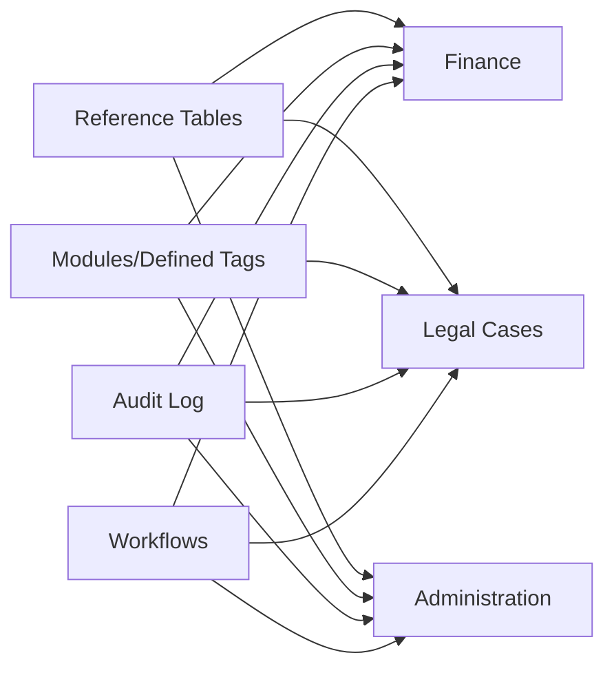

# Schema Modular Architecture

<cite>
**Referenced Files in This Document**
- [db-structure.json](file://backend/config/db-structure.json)
- [README.md](file://backend/migrations/README.md)
- [09_create_reference_tables.md](file://backend/migrations/09_create_reference_tables.md)
- [14_create_modules_and_tags.md](file://backend/migrations/14_create_modules_and_tags.md)
- [49_create_finance_module_tables.md](file://backend/migrations/49_create_finance_module_tables.md)
- [63_create_case_outcome_table.md](file://backend/migrations/63_create_case_outcome_table.md)
- [05_create_legal_cases_table.md](file://backend/migrations/05_create_legal_cases_table.md)
- [60_create_courts_and_judges_tables.md](file://backend/migrations/60_create_courts_and_judges_tables.md)
- [101_create_workflow_tables.sql](file://backend/migrations/101_create_workflow_tables.sql)
- [102_create_audit_log_table.sql](file://backend/migrations/102_create_audit_log_table.sql)
- [68_create_module_settings_table.sql](file://backend/migrations/68_create_module_settings_table.sql)
- [2026-05-04-02-administration-schema-fix.sql](file://backend/migrations/2026-05-04-02-administration-schema-fix.sql)
- [schema.js](file://backend/modules/finance/schema.js)
- [settings.json](file://backend/modules/administration/settings.json)
</cite>

## Table of Contents
1. [Introduction](#introduction)
2. [Project Structure](#project-structure)
3. [Core Components](#core-components)
4. [Architecture Overview](#architecture-overview)
5. [Detailed Component Analysis](#detailed-component-analysis)
6. [Dependency Analysis](#dependency-analysis)
7. [Performance Considerations](#performance-considerations)
8. [Troubleshooting Guide](#troubleshooting-guide)
9. [Conclusion](#conclusion)

## Introduction
This document explains the modular database schema architecture used in Titan CRM. It describes how business domains (administration, legal_cases, finance, contractors, projects, tasks, calendars, mail, and others) are organized within the database, how modules separate concerns while sharing common reference data, and how schema partitioning and naming conventions enable scalable growth. It also covers the migration-driven schema evolution, module settings, and integration patterns for adding new modules.

## Project Structure
The schema is primarily defined by:
- Migration files that create and evolve domain-specific tables and reference data
- A central reference table system for statuses, priorities, currencies, and other lookup values
- Module-scoped tables prefixed or grouped by domain
- Shared tables for cross-cutting concerns (modules, tags, audit logs, workflows)

**Diagram sources**
- [09_create_reference_tables.md:8-224](file://backend/migrations/09_create_reference_tables.md#L8-L223)
- [14_create_modules_and_tags.md:9-23](file://backend/migrations/14_create_modules_and_tags.md#L9-L23)
- [102_create_audit_log_table.sql:4-21](file://backend/migrations/102_create_audit_log_table.sql#L4-L20)
- [49_create_finance_module_tables.md:14-117](file://backend/migrations/49_create_finance_module_tables.md#L14-L117)
- [schema.js:13-197](file://backend/modules/finance/schema.js#L13-L197)
- [05_create_legal_cases_table.md:8-130](file://backend/migrations/05_create_legal_cases_table.md#L8-L130)
- [63_create_case_outcome_table.md:9-26](file://backend/migrations/63_create_case_outcome_table.md#L9-L26)
- [60_create_courts_and_judges_tables.md:14-46](file://backend/migrations/60_create_courts_and_judges_tables.md#L14-L46)

**Section sources**
- [README.md:114-159](file://backend/migrations/README.md#L114-L159)
- [db-structure.json:1-800](file://backend/config/db-structure.json#L1-L800)

## Core Components
- Reference tables: Centralized lookup values for statuses, priorities, currencies, forms, and labels. These tables are shared across modules and provide consistent dropdown values and display ordering.
- Module tables: Domain-specific tables scoped to a module (e.g., finance, legal_cases, contractors). They reference shared reference tables and may reference each other (e.g., payments reference invoices and projects).
- Cross-cutting tables: Modules, defined_tags, audit_log, workflows, and workflow execution logs provide shared infrastructure for permissions, tagging, auditing, and automation.
- Module settings: A JSONB-backed table that stores per-module configuration (e.g., bulk edit fields) enabling flexible UI and behavior customization.

**Section sources**
- [09_create_reference_tables.md:8-224](file://backend/migrations/09_create_reference_tables.md#L8-L223)
- [14_create_modules_and_tags.md:9-23](file://backend/migrations/14_create_modules_and_tags.md#L9-L23)
- [68_create_module_settings_table.sql:5-18](file://backend/migrations/68_create_module_settings_table.sql#L5-L18)

## Architecture Overview
The schema follows a modular-first design:
- Each module owns its entities and relationships within that domain
- Modules reference shared reference tables for consistent semantics
- Cross-cutting concerns (modules/tags, audit, workflows) are centralized
- Finance module demonstrates advanced partitioning with header/detail tables (invoices/payments) and bank statement reconciliation

**Diagram sources**
- [14_create_modules_and_tags.md:9-23](file://backend/migrations/14_create_modules_and_tags.md#L9-L23)
- [49_create_finance_module_tables.md:14-117](file://backend/migrations/49_create_finance_module_tables.md#L14-L117)
- [schema.js:13-197](file://backend/modules/finance/schema.js#L13-L197)
- [05_create_legal_cases_table.md:8-130](file://backend/migrations/05_create_legal_cases_table.md#L8-L130)
- [63_create_case_outcome_table.md:9-26](file://backend/migrations/63_create_case_outcome_table.md#L9-L26)
- [60_create_courts_and_judges_tables.md:14-46](file://backend/migrations/60_create_courts_and_judges_tables.md#L14-L46)

## Detailed Component Analysis

### Finance Module
The finance module is designed with clear separation of concerns:
- Status reference table defines invoice lifecycle states
- Invoices table holds invoice-level metadata and amounts
- Payments table links to invoices, projects, or contractors; includes a flexible constraint allowing any of the three relationships
- Invoice documents table manages generated documents
- Expense categories table provides hierarchical income/expense categories
- Bank statements and statement lines tables support reconciliation workflows
- Payment and statement line tables include optional contractor and category linkage for richer reporting

**Diagram sources**
- [49_create_finance_module_tables.md:14-117](file://backend/migrations/49_create_finance_module_tables.md#L14-L117)
- [schema.js:13-197](file://backend/modules/finance/schema.js#L13-L197)

**Section sources**
- [49_create_finance_module_tables.md:14-117](file://backend/migrations/49_create_finance_module_tables.md#L14-L117)
- [schema.js:13-197](file://backend/modules/finance/schema.js#L13-L197)

### Legal Cases Module
Legal cases are modeled with a central case table and supporting entities:
- Case financial details, events, documents, comments, and notes
- Third-party relationships
- Courts and judges tables with seeded data
- Case outcomes table for customizable results with colors and ordering

**Diagram sources**
- [05_create_legal_cases_table.md:8-130](file://backend/migrations/05_create_legal_cases_table.md#L8-L130)
- [60_create_courts_and_judges_tables.md:14-46](file://backend/migrations/60_create_courts_and_judges_tables.md#L14-L46)
- [63_create_case_outcome_table.md:9-26](file://backend/migrations/63_create_case_outcome_table.md#L9-L26)

**Section sources**
- [05_create_legal_cases_table.md:8-130](file://backend/migrations/05_create_legal_cases_table.md#L8-L130)
- [60_create_courts_and_judges_tables.md:14-46](file://backend/migrations/60_create_courts_and_judges_tables.md#L14-L46)
- [63_create_case_outcome_table.md:9-26](file://backend/migrations/63_create_case_outcome_table.md#L9-L26)

### Administration Module
Administration integrates with the core user table by adding name, role, and activity fields, and introduces an audit log tailored to administrative actions.

**Diagram sources**
- [2026-05-04-02-administration-schema-fix.sql:23-32](file://backend/migrations/2026-05-04-02-administration-schema-fix.sql#L23-L32)

**Section sources**
- [2026-05-04-02-administration-schema-fix.sql:5-57](file://backend/migrations/2026-05-04-02-administration-schema-fix.sql#L5-L56)
- [settings.json:1-7](file://backend/modules/administration/settings.json#L1-L6)

### Cross-Cutting Concerns
- Modules and tags: Centralized module definitions and tag definitions with module-scoped tags
- Audit logging: Global audit_log table for tracking user actions across entities
- Workflows: Workflow engine tables for scheduled/event/webhook-driven automation
- Module settings: JSONB-based settings per module, enabling dynamic UI and behavior

**Diagram sources**
- [14_create_modules_and_tags.md:9-23](file://backend/migrations/14_create_modules_and_tags.md#L9-L23)
- [102_create_audit_log_table.sql:4-21](file://backend/migrations/102_create_audit_log_table.sql#L4-L20)
- [101_create_workflow_tables.sql:4-53](file://backend/migrations/101_create_workflow_tables.sql#L4-L53)
- [68_create_module_settings_table.sql:5-18](file://backend/migrations/68_create_module_settings_table.sql#L5-L18)

**Section sources**
- [14_create_modules_and_tags.md:9-23](file://backend/migrations/14_create_modules_and_tags.md#L9-L23)
- [102_create_audit_log_table.sql:4-21](file://backend/migrations/102_create_audit_log_table.sql#L4-L20)
- [101_create_workflow_tables.sql:4-53](file://backend/migrations/101_create_workflow_tables.sql#L4-L53)
- [68_create_module_settings_table.sql:5-18](file://backend/migrations/68_create_module_settings_table.sql#L5-L18)

## Dependency Analysis
- Cohesion: Each module’s tables are cohesive around a single domain (e.g., finance, legal_cases)
- Coupling: Modules depend on shared reference tables and cross-cutting tables; minimal circular dependencies
- External dependencies: Uses PostgreSQL native types and JSONB for flexible configuration and logs
- Integration points: Module settings and tags connect UI behavior to schema; workflows orchestrate cross-domain actions

**Diagram sources**
- [09_create_reference_tables.md:8-224](file://backend/migrations/09_create_reference_tables.md#L8-L223)
- [14_create_modules_and_tags.md:9-23](file://backend/migrations/14_create_modules_and_tags.md#L9-L23)
- [102_create_audit_log_table.sql:4-21](file://backend/migrations/102_create_audit_log_table.sql#L4-L20)
- [101_create_workflow_tables.sql:4-53](file://backend/migrations/101_create_workflow_tables.sql#L4-L53)

**Section sources**
- [09_create_reference_tables.md:8-224](file://backend/migrations/09_create_reference_tables.md#L8-L223)
- [14_create_modules_and_tags.md:9-23](file://backend/migrations/14_create_modules_and_tags.md#L9-L23)
- [102_create_audit_log_table.sql:4-21](file://backend/migrations/102_create_audit_log_table.sql#L4-L20)
- [101_create_workflow_tables.sql:4-53](file://backend/migrations/101_create_workflow_tables.sql#L4-L53)

## Performance Considerations
- Indexes on frequently filtered columns (e.g., invoice status, due date, contractor_id, project_id) improve query performance in finance and legal cases
- JSONB fields (e.g., module settings, workflow configurations) enable flexible schemas without joins but should be indexed selectively
- Audit and workflow execution logs benefit from targeted indexes on user_id, entity_type+entity_id, and timestamps
- Partitioning strategy: Finance uses header-detail tables (statements/lines) to scale reconciliation; consider similar patterns for high-volume domains

[No sources needed since this section provides general guidance]

## Troubleshooting Guide
- Migration conflicts: Use the migration tracker to identify applied migrations and avoid duplicates
- Schema drift: Rely on idempotent migrations and ensure all additions use “IF NOT EXISTS”
- Audit visibility: Use audit_log queries to trace entity changes and user actions
- Workflow failures: Inspect workflow_execution_logs for step-level errors and retry policies
- Module settings: Verify module_settings entries for expected keys and JSONB structure

**Section sources**
- [README.md:88-112](file://backend/migrations/README.md#L88-L112)
- [102_create_audit_log_table.sql:17-21](file://backend/migrations/102_create_audit_log_table.sql#L17-L20)
- [101_create_workflow_tables.sql:44-53](file://backend/migrations/101_create_workflow_tables.sql#L44-L53)
- [68_create_module_settings_table.sql:5-18](file://backend/migrations/68_create_module_settings_table.sql#L5-L18)

## Conclusion
Titan CRM’s schema modular architecture cleanly separates business domains while leveraging shared reference data and cross-cutting services. The migration-driven evolution ensures safe, repeatable changes, and the module settings and tagging systems enable flexible UI behavior. New modules can integrate by adopting the same patterns: domain tables, shared references, and optional cross-cutting integrations (audit, workflows, settings).