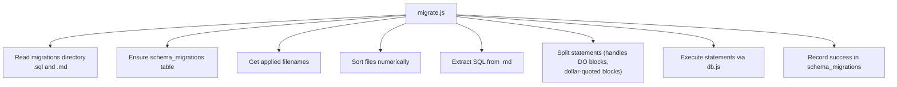
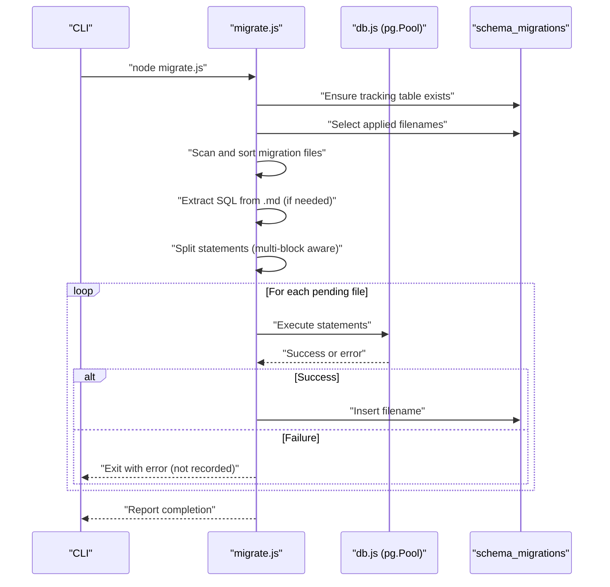
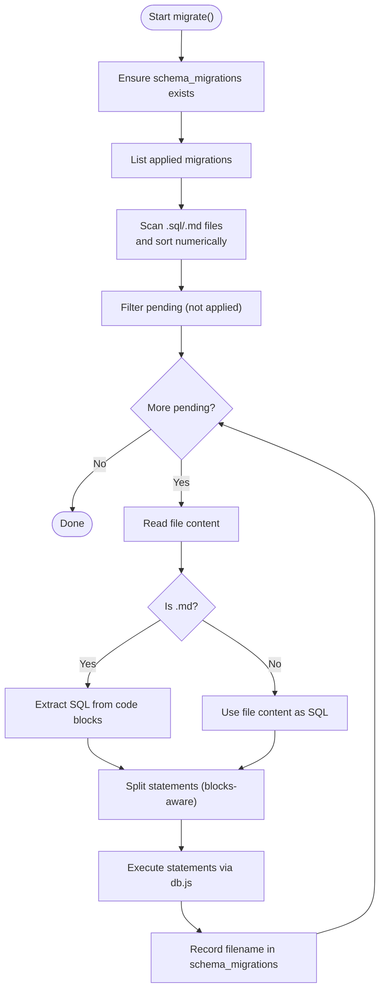
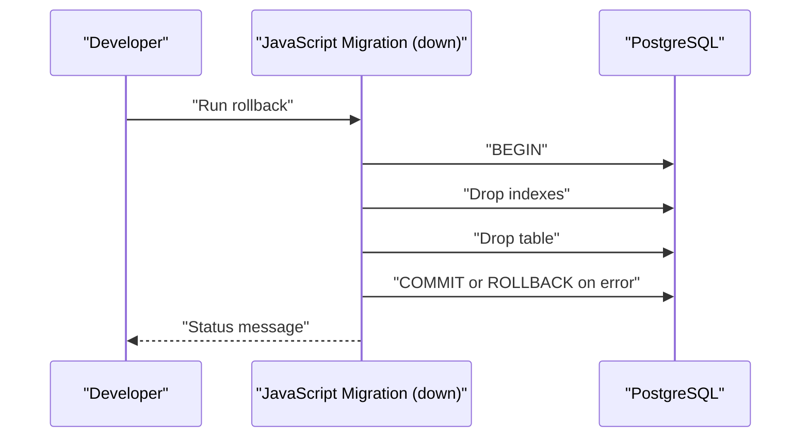
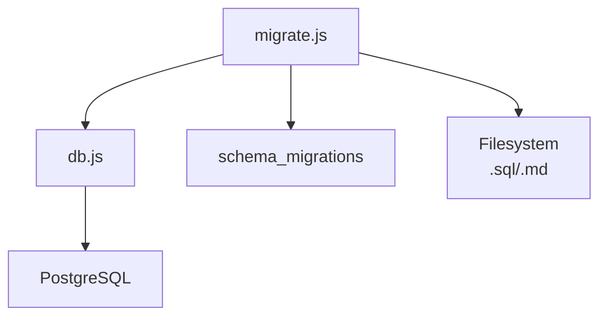

# Migration System

<cite>
**Referenced Files in This Document**
- [README.md](file://backend/migrations/README.md)
- [migrate.js](file://backend/migrate.js)
- [db.js](file://backend/db.js)
- [package.json](file://backend/package.json)
- [reset-db.js](file://backend/reset-db.js)
- [00_schema_migrations.md](file://backend/migrations/00_schema_migrations.md)
- [01_create_projects_table.md](file://backend/migrations/01_create_projects_table.md)
- [08_create_initial_data.md](file://backend/migrations/08_create_initial_data.md)
- [20_seed_migrated_data.md](file://backend/migrations/20_seed_migrated_data.md)
- [29_seed_access_matrix.md](file://backend/migrations/29_seed_access_matrix.md)
- [2026-05-04-01-create-audit-log.js](file://backend/migrations/2026-05-04-01-create-audit-log.js)
</cite>

## Table of Contents
1. [Introduction](#introduction)
2. [Project Structure](#project-structure)
3. [Core Components](#core-components)
4. [Architecture Overview](#architecture-overview)
5. [Detailed Component Analysis](#detailed-component-analysis)
6. [Dependency Analysis](#dependency-analysis)
7. [Performance Considerations](#performance-considerations)
8. [Troubleshooting Guide](#troubleshooting-guide)
9. [Conclusion](#conclusion)
10. [Appendices](#appendices)

## Introduction
This document describes Titan CRM’s database migration system for schema evolution. It explains the migration file structure, naming conventions, execution order, and how migrations are tracked and applied. It also covers how to create new migrations for schema changes, data transformations, and reference data updates; how to run migrations; how to handle failures; and how migrations relate to database state. Examples include adding tables, modifying columns, creating indexes, and seeding data. Finally, it outlines testing, validation, and production deployment strategies, along with rollback mechanisms.

## Project Structure
Titan CRM organizes migrations under the backend/migrations directory. The system supports two formats:
- SQL files (.sql) containing raw SQL statements
- Markdown files (.md) that embed SQL inside fenced code blocks

A dedicated tracking table, schema_migrations, records which migrations have been applied. The migration runner:
- Ensures the tracking table exists
- Reads applied filenames from the tracking table
- Scans the migrations directory for .sql and .md files
- Sorts files numerically by filename
- Skips already-applied migrations
- Extracts SQL from markdown and splits statements
- Executes statements per file
- Records successful migrations in the tracking table

**Diagram sources**
- [migrate.js:134-215](file://backend/migrate.js#L134-L215)
- [db.js:58-67](file://backend/db.js#L58-L67)

**Section sources**
- [README.md:1-159](file://backend/migrations/README.md#L1-L159)
- [migrate.js:134-215](file://backend/migrate.js#L134-L215)
- [db.js:58-67](file://backend/db.js#L58-L67)

## Core Components
- Migration runner (migrate.js): Orchestrates discovery, extraction, parsing, execution, and recording of migrations.
- Database adapter (db.js): Provides a query wrapper around a PostgreSQL connection pool and environment-driven configuration.
- Migration tracking table (schema_migrations): Stores applied migration filenames and timestamps.
- Migration files: SQL or Markdown files that define schema/data changes and optional rollback notes.

Key behaviors:
- Idempotency: Prefer IF NOT EXISTS and ON CONFLICT clauses to avoid errors on repeated runs.
- Statement splitting: Robust handling of DO blocks and dollar-quoted blocks for functions/procedures.
- Safety: Failures abort execution and are not recorded; administrators must fix issues before rerunning.

**Section sources**
- [README.md:11-159](file://backend/migrations/README.md#L11-L159)
- [migrate.js:92-132](file://backend/migrate.js#L92-L132)
- [migrate.js:17-89](file://backend/migrate.js#L17-L89)
- [migrate.js:134-215](file://backend/migrate.js#L134-L215)
- [db.js:20-39](file://backend/db.js#L20-L39)

## Architecture Overview
The migration pipeline is a single-purpose Node.js script that reads migration files, executes SQL safely, and maintains a compact tracking table. It integrates with the PostgreSQL connection pool exposed by db.js.

**Diagram sources**
- [migrate.js:134-215](file://backend/migrate.js#L134-L215)
- [db.js:58-67](file://backend/db.js#L58-L67)

## Detailed Component Analysis

### Migration Runner (migrate.js)
Responsibilities:
- Discover migration files in the migrations directory
- Ensure schema_migrations exists
- Determine pending migrations by comparing filenames against the tracking table
- Extract SQL from markdown files
- Split SQL into executable statements while preserving DO blocks and dollar-quoted blocks
- Execute statements and record successes

Important implementation details:
- Statement splitting handles DO $$ ... $$ blocks and dollar-quoted delimiters commonly used in PostgreSQL functions.
- Empty or comment-only lines are ignored.
- Each file’s statements are executed in order; the first failure stops execution and prevents partial application.

**Diagram sources**
- [migrate.js:134-215](file://backend/migrate.js#L134-L215)
- [migrate.js:17-89](file://backend/migrate.js#L17-L89)

**Section sources**
- [migrate.js:134-215](file://backend/migrate.js#L134-L215)
- [migrate.js:17-89](file://backend/migrate.js#L17-L89)

### Database Adapter (db.js)
Responsibilities:
- Load environment variables from backend/env
- Validate required DB variables
- Create a PostgreSQL connection pool
- Wrap queries to convert snake_case column names to camelCase for application consumption

Operational notes:
- Uses the pg library for connection pooling.
- Exposes a query function that returns normalized rows.

**Section sources**
- [db.js:20-39](file://backend/db.js#L20-L39)
- [db.js:58-67](file://backend/db.js#L58-L67)

### Migration Tracking Table (schema_migrations)
Purpose:
- Track which migration files have been successfully applied.
- Prevent duplicate execution and enable fast incremental runs.

Behavior:
- Stores filename and applied_at timestamp.
- Index on applied_at improves lookup performance.

**Section sources**
- [00_schema_migrations.md:1-25](file://backend/migrations/00_schema_migrations.md#L1-L24)
- [migrate.js:92-108](file://backend/migrate.js#L92-L108)

### Migration File Formats and Patterns

#### SQL-only migrations (.sql)
- Use IF NOT EXISTS for idempotent schema additions.
- Use ON CONFLICT clauses for idempotent data seeding.
- Keep statements separated by semicolons.

Examples in repository:
- Adding columns and indexes
- Creating tables with primary keys and foreign keys
- Seeding reference data with ON CONFLICT

**Section sources**
- [01_create_projects_table.md:1-38](file://backend/migrations/01_create_projects_table.md#L1-L38)
- [08_create_initial_data.md:1-68](file://backend/migrations/08_create_initial_data.md#L1-L68)
- [20_seed_migrated_data.md:1-52](file://backend/migrations/20_seed_migrated_data.md#L1-L51)
- [29_seed_access_matrix.md:1-207](file://backend/migrations/29_seed_access_matrix.md#L1-L207)

#### Markdown migrations (.md)
- Embed SQL inside fenced code blocks.
- Include a Description, SQL Statement block, Notes, and optional Rollback section.
- Rollback instructions must be commented to avoid accidental execution.

**Section sources**
- [README.md:32-86](file://backend/migrations/README.md#L32-L86)

#### JavaScript migrations (advanced)
Some migrations are written in JavaScript with up/down functions and use a PostgreSQL connection pool. These support explicit transaction control and structured logging.

Example:
- Create audit log table with indexes and rollback support.

**Section sources**
- [2026-05-04-01-create-audit-log.js:1-100](file://backend/migrations/2026-05-04-01-create-audit-log.js#L1-L99)

### Execution Order and Naming Conventions
- Numerical ordering: Filenames are sorted lexicographically; use leading zeros (e.g., 01_, 02_, ..., 100_) to ensure correct order.
- The tracking table ensures that only pending migrations are applied on subsequent runs.
- The runner ignores README.md and files starting with MANUAL_ during discovery.

**Section sources**
- [README.md:57-63](file://backend/migrations/README.md#L57-L63)
- [migrate.js:149-162](file://backend/migrate.js#L149-L162)

### Rollback Procedures
- For SQL/Markdown migrations: There is no automated rollback. Rollbacks must be documented manually in the migration file (as “Rollback (manual only)”).
- For JavaScript migrations: The down function performs rollback within a transaction and releases the client.

**Diagram sources**
- [2026-05-04-01-create-audit-log.js:68-99](file://backend/migrations/2026-05-04-01-create-audit-log.js#L68-L99)

**Section sources**
- [README.md:50-55](file://backend/migrations/README.md#L50-L55)
- [2026-05-04-01-create-audit-log.js:68-99](file://backend/migrations/2026-05-04-01-create-audit-log.js#L68-L99)

### Error Handling Strategies
- On statement execution failure, the runner logs the error and exits immediately without recording the migration.
- Administrators should fix the SQL or data issue and rerun the migration.
- The tracking table prevents partially-applied migrations from being retried.

**Section sources**
- [migrate.js:205-211](file://backend/migrate.js#L205-L211)

### Database Reset and Production Safety
- A reset script drops all user-defined objects in the public schema (including schema_migrations) and requires explicit confirmation.
- After reset, run migrations and seed data to restore the database to a clean state.

**Section sources**
- [reset-db.js:13-102](file://backend/reset-db.js#L13-L102)

## Dependency Analysis
The migration system depends on:
- Node.js runtime and the pg library for PostgreSQL connectivity
- Environment variables loaded from backend/env
- The migrations directory structure and file naming conventions

**Diagram sources**
- [migrate.js:1-3](file://backend/migrate.js#L1-L3)
- [db.js:2-5](file://backend/db.js#L2-L5)

**Section sources**
- [migrate.js:1-3](file://backend/migrate.js#L1-L3)
- [db.js:2-5](file://backend/db.js#L2-L5)

## Performance Considerations
- The schema_migrations table includes an index on applied_at to speed up lookups.
- Statement splitting avoids unnecessary overhead by handling complex PostgreSQL constructs correctly.
- Using IF NOT EXISTS and ON CONFLICT reduces redundant operations and improves idempotency.

**Section sources**
- [00_schema_migrations.md:16-18](file://backend/migrations/00_schema_migrations.md#L16-L18)
- [migrate.js:17-89](file://backend/migrate.js#L17-L89)

## Troubleshooting Guide
Common issues and resolutions:
- Missing environment variables: Ensure DB_USER, DB_HOST, DB_NAME, DB_PASSWORD, DB_PORT are present in backend/env.
- Migration fails mid-execution: Fix the SQL/data issue, then rerun. The runner will not record partial migrations.
- Duplicate execution attempts: The tracking table prevents re-running applied migrations.
- Resetting the database: Use the reset script to drop all objects; then rerun migrations and seed data.

**Section sources**
- [db.js:20-29](file://backend/db.js#L20-L29)
- [migrate.js:205-211](file://backend/migrate.js#L205-L211)
- [reset-db.js:13-102](file://backend/reset-db.js#L13-L102)

## Conclusion
Titan CRM’s migration system provides a robust, idempotent, and safe way to evolve the database schema and data. By leveraging a tracking table, careful statement parsing, and explicit safety checks, it minimizes risk during deployments. For schema changes, use SQL/Markdown migrations with IF NOT EXISTS and ON CONFLICT. For advanced logic requiring transactions, use JavaScript migrations with up/down functions. Always document rollbacks for SQL-based migrations and test migrations in staging before production.

## Appendices

### How to Create New Migrations
- Choose a filename with leading zeros (e.g., 100_, 200_) to ensure correct order.
- For schema changes:
  - Use .sql files with IF NOT EXISTS for tables/columns/indexes.
  - Use .md files with fenced SQL blocks and include a Rollback (manual only) section.
- For data transformations/seeding:
  - Use ON CONFLICT clauses for idempotent inserts/updates.
  - For large datasets, consider batching and transaction boundaries.
- For complex logic:
  - Use JavaScript migrations with up/down functions and BEGIN/COMMIT/ROLLBACK.

**Section sources**
- [README.md:57-86](file://backend/migrations/README.md#L57-L86)
- [2026-05-04-01-create-audit-log.js:1-100](file://backend/migrations/2026-05-04-01-create-audit-log.js#L1-L99)

### Common Migration Scenarios
- Add a new table: Define columns, primary keys, and foreign keys; include indexes as needed.
- Modify a column: Use ALTER TABLE with IF NOT EXISTS where applicable.
- Create indexes: Add CREATE INDEX IF NOT EXISTS statements.
- Seed reference data: Use INSERT with ON CONFLICT (DO NOTHING or DO UPDATE) to keep migrations idempotent.

**Section sources**
- [01_create_projects_table.md:1-38](file://backend/migrations/01_create_projects_table.md#L1-L38)
- [08_create_initial_data.md:1-68](file://backend/migrations/08_create_initial_data.md#L1-L68)
- [20_seed_migrated_data.md:1-52](file://backend/migrations/20_seed_migrated_data.md#L1-L51)
- [29_seed_access_matrix.md:1-207](file://backend/migrations/29_seed_access_matrix.md#L1-L207)

### Migration Testing and Validation
- Test locally: Run migrations against a local database copy; verify schema and data.
- Staging validation: Apply migrations in staging and run smoke tests across affected modules.
- Idempotency checks: Re-run migrations to ensure no errors or unintended changes.
- Rollback verification: For JavaScript migrations, test down functions to ensure clean removal.

**Section sources**
- [README.md:88-112](file://backend/migrations/README.md#L88-L112)
- [2026-05-04-01-create-audit-log.js:68-99](file://backend/migrations/2026-05-04-01-create-audit-log.js#L68-L99)

### Production Deployment Strategies
- Pre-deploy checklist:
  - Back up the production database.
  - Review pending migrations and their impact.
  - Run migrations in a maintenance window.
- Post-deploy:
  - Verify applied migrations via the tracking table.
  - Run smoke tests and monitor logs.
- Rollback on failure:
  - For SQL/Markdown migrations: Restore from backup and revert to the previous migration version.
  - For JavaScript migrations: Use the down function if supported; otherwise restore from backup.

**Section sources**
- [README.md:102-112](file://backend/migrations/README.md#L102-L112)
- [2026-05-04-01-create-audit-log.js:68-99](file://backend/migrations/2026-05-04-01-create-audit-log.js#L68-L99)