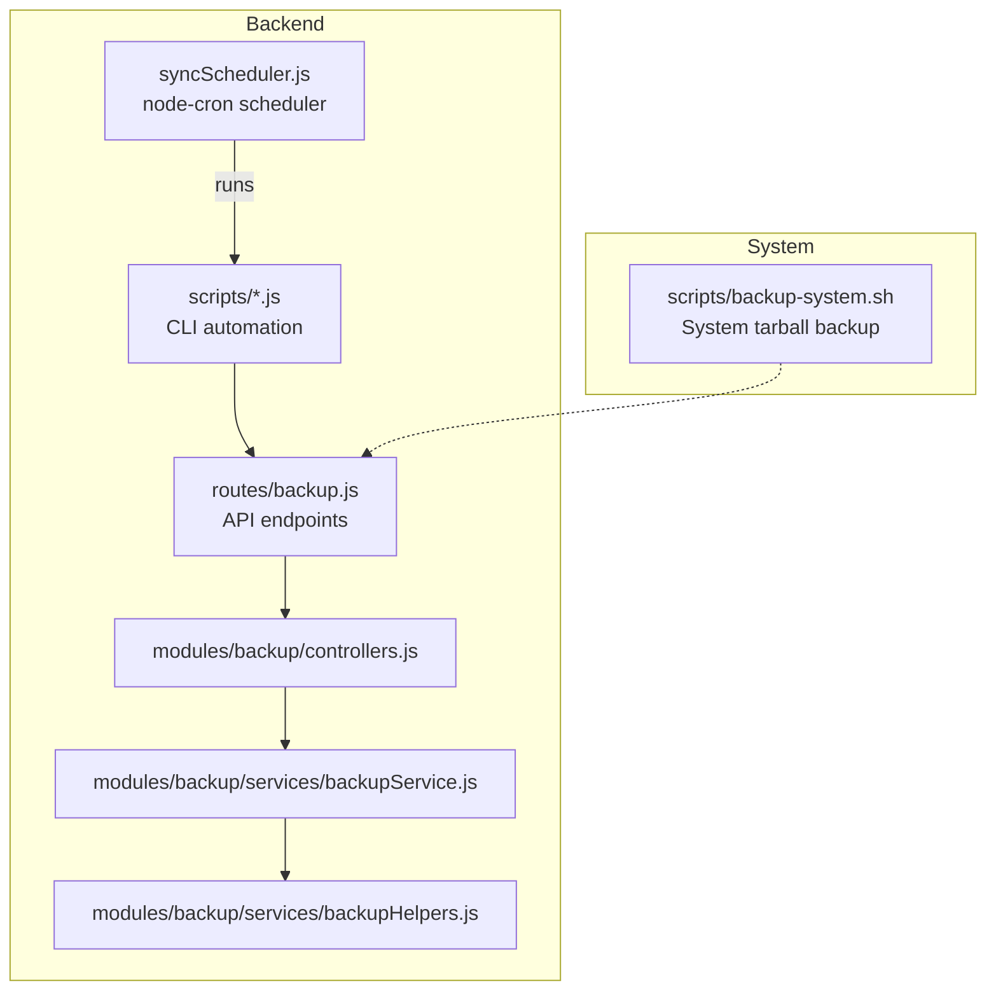
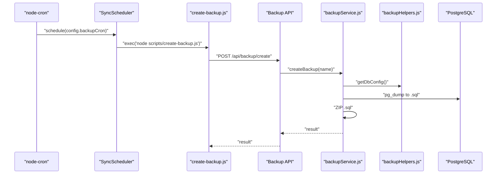
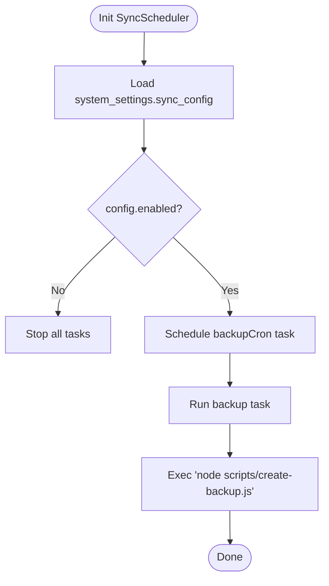
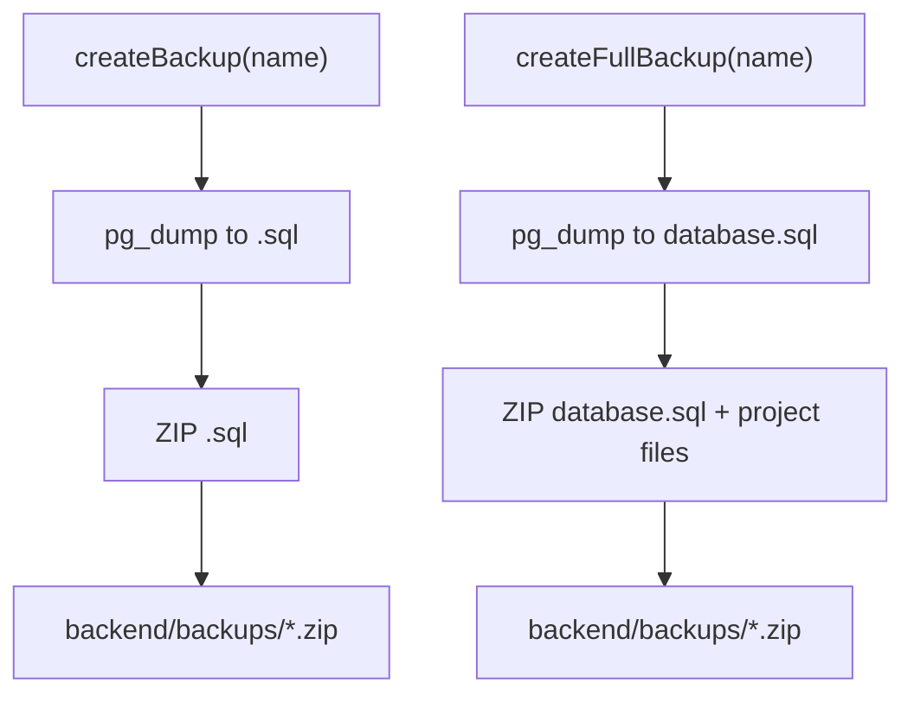
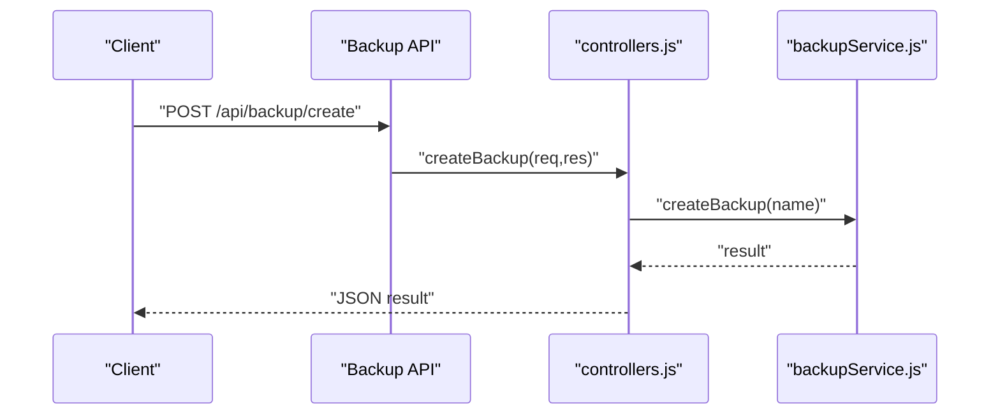
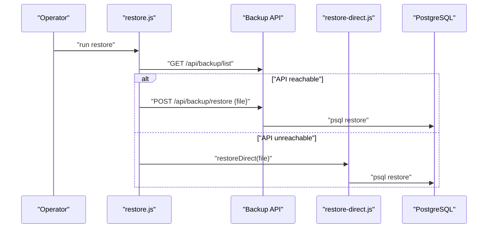
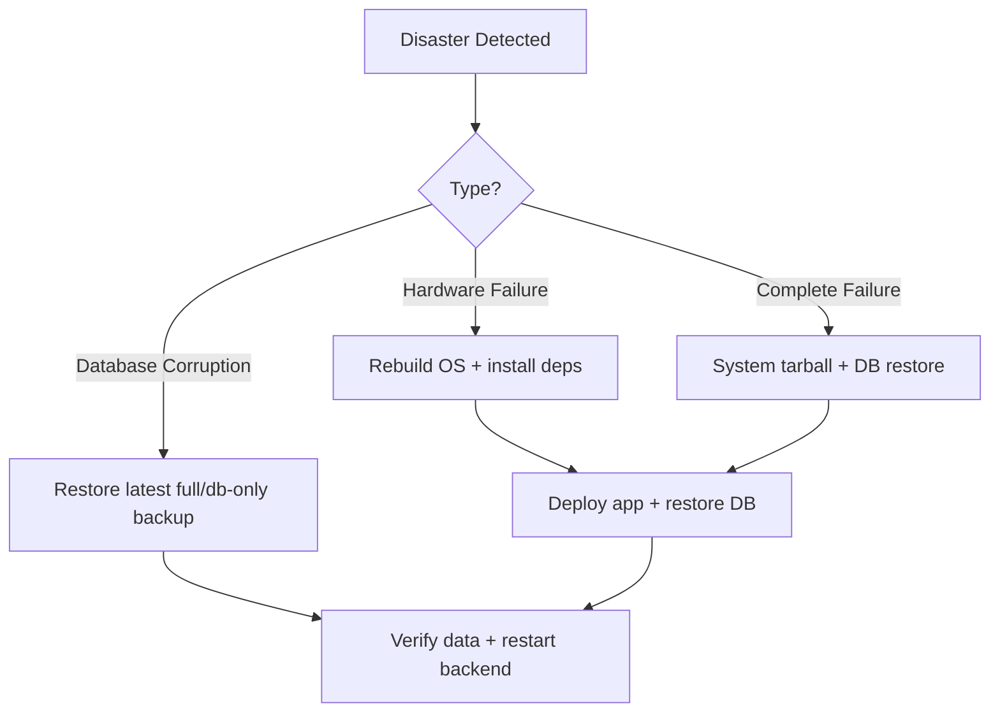
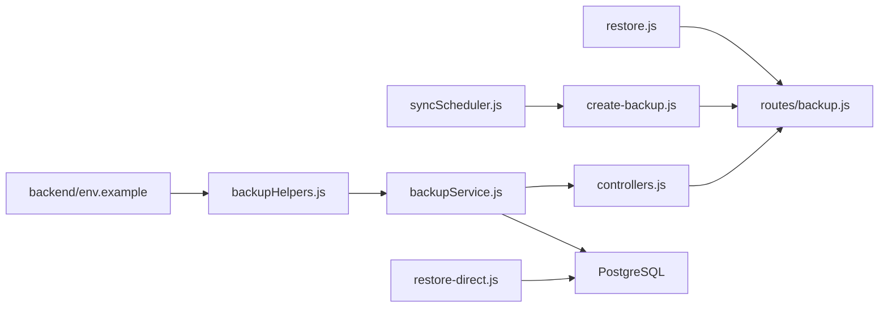

# Backup & Disaster Recovery

<cite>
**Referenced Files in This Document**
- [syncScheduler.js](file://backend/services/syncScheduler.js)
- [backupService.js](file://backend/modules/backup/services/backupService.js)
- [backupHelpers.js](file://backend/modules/backup/services/backupHelpers.js)
- [controllers.js](file://backend/modules/backup/controllers.js)
- [backup.js](file://backend/routes/backup.js)
- [backup.js](file://backend/routes/backupHelpers.js)
- [create-backup.js](file://backend/scripts/create-backup.js)
- [create-full-backup.js](file://backend/scripts/create-full-backup.js)
- [restore.js](file://backend/scripts/restore.js)
- [restore-direct.js](file://backend/scripts/restore-direct.js)
- [list-backups.js](file://backend/scripts/list-backups.js)
- [download-backup.js](file://backend/scripts/download-backup.js)
- [backup-system.sh](file://scripts/backup-system.sh)
- [env.example](file://backend/env.example)
- [BACKUP_API.md](file://docs/backend/BACKUP_API.md)
- [RESTORE_GUIDE.md](file://docs/backend/RESTORE_GUIDE.md)
- [db-structure.json](file://backend/config/db-structure.json)
</cite>

## Table of Contents
1. [Introduction](#introduction)
2. [Project Structure](#project-structure)
3. [Core Components](#core-components)
4. [Architecture Overview](#architecture-overview)
5. [Detailed Component Analysis](#detailed-component-analysis)
6. [Dependency Analysis](#dependency-analysis)
7. [Performance Considerations](#performance-considerations)
8. [Troubleshooting Guide](#troubleshooting-guide)
9. [Conclusion](#conclusion)
10. [Appendices](#appendices)

## Introduction
This document provides comprehensive backup and disaster recovery guidance for Titan CRM. It covers automated backup scheduling via cron and node-cron, backup types (database-only and full-project), storage strategies, verification and restoration testing, disaster scenarios, backup APIs, manual procedures, emergency workflows, retention and compliance considerations, and offsite storage options.

## Project Structure
Titan CRM implements backup and restore through:
- Backend API endpoints under the backup module
- Scheduling service using node-cron
- Scripts for CLI automation
- Cross-platform restore utilities
- System-level backup shell script

**Diagram sources**
- [syncScheduler.js:13-76](file://backend/modules/settings/services/syncScheduler.js#L13-L76)
- [backup.js:222-254](file://backend/modules/backup/routes.js#L1-L48)
- [controllers.js:1-105](file://backend/modules/backup/controllers.js#L1-L104)
- [backupService.js:1-362](file://backend/modules/backup/services/backupService.js#L1-L361)
- [backupHelpers.js:1-307](file://backend/modules/backup/services/backupHelpers.js#L1-L306)
- [create-backup.js:1-92](file://backend/scripts/create-backup.js#L1-L91)
- [create-full-backup.js:1-124](file://backend/scripts/create-full-backup.js#L1-L123)
- [restore.js:1-419](file://backend/scripts/restore.js#L1-L418)
- [restore-direct.js:1-492](file://backend/scripts/restore-direct.js#L1-L491)
- [backup-system.sh:1-99](file://scripts/backup-system.sh#L1-L98)

**Section sources**
- [syncScheduler.js:13-76](file://backend/modules/settings/services/syncScheduler.js#L13-L76)
- [backupService.js:13-18](file://backend/modules/backup/services/backupService.js#L13-L18)
- [backup-system.sh:1-99](file://scripts/backup-system.sh#L1-L98)

## Core Components
- Automated scheduler: schedules backups using node-cron and invokes CLI scripts.
- Backup service: orchestrates pg_dump, ZIP packaging, and restore operations.
- Backup helpers: locate PostgreSQL binaries, manage extraction, ensure database existence.
- API controllers: expose endpoints for create, restore, list, delete, and download.
- CLI scripts: programmatic creation of database-only and full backups, listing and downloading backups, interactive and direct restore.
- System-level backup: tarball of the entire project excluding build artifacts.

**Section sources**
- [syncScheduler.js:21-76](file://backend/modules/settings/services/syncScheduler.js#L21-L76)
- [backupService.js:57-209](file://backend/modules/backup/services/backupService.js#L57-L209)
- [backupHelpers.js:21-117](file://backend/modules/backup/services/backupHelpers.js#L21-L117)
- [controllers.js:10-95](file://backend/modules/backup/controllers.js#L10-L95)
- [create-backup.js:67-92](file://backend/scripts/create-backup.js#L67-L91)
- [create-full-backup.js:95-124](file://backend/scripts/create-full-backup.js#L95-L123)
- [list-backups.js:78-103](file://backend/scripts/list-backups.js#L78-L102)
- [download-backup.js:117-169](file://backend/scripts/download-backup.js#L117-L168)
- [restore.js:308-419](file://backend/scripts/restore.js#L308-L418)
- [restore-direct.js:341-492](file://backend/scripts/restore-direct.js#L341-L491)
- [backup-system.sh:49-99](file://scripts/backup-system.sh#L49-L98)

## Architecture Overview
The backup system integrates scheduling, API, and CLI layers with PostgreSQL utilities and filesystem operations.

**Diagram sources**
- [syncScheduler.js:42-76](file://backend/modules/settings/services/syncScheduler.js#L42-L76)
- [create-backup.js:67-92](file://backend/scripts/create-backup.js#L67-L91)
- [controllers.js:10-19](file://backend/modules/backup/controllers.js#L10-L19)
- [backupService.js:57-78](file://backend/modules/backup/services/backupService.js#L57-L78)
- [backupHelpers.js:92-117](file://backend/modules/backup/services/backupHelpers.js#L92-L117)

## Detailed Component Analysis

### Automated Backup Scheduling (node-cron)
- Loads system settings from the database to determine cron schedule and enable flag.
- Schedules a daily backup task that executes a CLI script to trigger the API endpoint for database-only backups.
- Uses environment variables for API URL resolution.

**Diagram sources**
- [syncScheduler.js:21-62](file://backend/modules/settings/services/syncScheduler.js#L21-L62)
- [syncScheduler.js:67-76](file://backend/modules/settings/services/syncScheduler.js#L67-L76)

**Section sources**
- [syncScheduler.js:21-62](file://backend/modules/settings/services/syncScheduler.js#L21-L62)
- [syncScheduler.js:67-76](file://backend/modules/settings/services/syncScheduler.js#L67-L76)

### Backup Types and Storage
- Database-only backup: produces a ZIP containing a single SQL dump.
- Full backup: produces a ZIP containing the SQL dump plus all project files (excluding configured ignores).
- Storage location: backend/backups/ directory; archives named with timestamps.

**Diagram sources**
- [backupService.js:57-78](file://backend/modules/backup/services/backupService.js#L57-L78)
- [backupService.js:83-209](file://backend/modules/backup/services/backupService.js#L83-L209)
- [backup.js:222-254](file://backend/modules/backup/routes.js#L1-L48)

**Section sources**
- [backupService.js:57-78](file://backend/modules/backup/services/backupService.js#L57-L78)
- [backupService.js:83-209](file://backend/modules/backup/services/backupService.js#L83-L209)
- [backup.js:222-254](file://backend/modules/backup/routes.js#L1-L48)

### Backup API Endpoints
- POST /api/backup/create: Creates a database-only backup.
- POST /api/backup/full: Creates a full backup.
- POST /api/backup/restore: Restores from a backup file.
- GET /api/backup/list: Lists available backups.
- DELETE /api/backup/:file: Deletes a backup file.
- GET /api/backup/download/:file: Downloads a backup file.

**Diagram sources**
- [controllers.js:10-19](file://backend/modules/backup/controllers.js#L10-L19)
- [backupService.js:57-78](file://backend/modules/backup/services/backupService.js#L57-L78)

**Section sources**
- [controllers.js:10-95](file://backend/modules/backup/controllers.js#L10-L95)
- [BACKUP_API.md:20-179](file://docs/backend/BACKUP_API.md#L20-L178)

### Backup Verification and Restoration Testing
- Verification: list and download backups via CLI and API.
- Restoration testing: two modes:
  - Interactive restore: chooses API mode if backend is running, otherwise falls back to direct mode.
  - Direct restore: runs without backend, extracts ZIP, ensures database exists, and restores SQL.

**Diagram sources**
- [restore.js:167-181](file://backend/scripts/restore.js#L167-L181)
- [restore.js:384-389](file://backend/scripts/restore.js#L384-L389)
- [restore-direct.js:452-459](file://backend/scripts/restore-direct.js#L452-L459)

**Section sources**
- [list-backups.js:78-103](file://backend/scripts/list-backups.js#L78-L102)
- [download-backup.js:117-169](file://backend/scripts/download-backup.js#L117-L168)
- [restore.js:167-419](file://backend/scripts/restore.js#L167-L418)
- [restore-direct.js:341-492](file://backend/scripts/restore-direct.js#L341-L491)

### Disaster Recovery Scenarios
- Database corruption: restore from the latest full or database-only backup; verify data integrity.
- Hardware failure: use full backup ZIP to rebuild environment on new hardware; restore database and project files.
- Complete system restoration: use system-level tarball backup for OS-level recovery; apply database restore afterward.

**Diagram sources**
- [RESTORE_GUIDE.md:43-107](file://docs/backend/RESTORE_GUIDE.md#L43-L107)
- [backup-system.sh:49-99](file://scripts/backup-system.sh#L49-L98)

**Section sources**
- [RESTORE_GUIDE.md:43-107](file://docs/backend/RESTORE_GUIDE.md#L43-L107)
- [backup-system.sh:49-99](file://scripts/backup-system.sh#L49-L98)

### Manual Backup Procedures
- Database-only: run the CLI script to call the API endpoint.
- Full backup: run the CLI script to call the full backup endpoint.
- Listing and downloading backups: use dedicated CLI scripts.

**Section sources**
- [create-backup.js:67-92](file://backend/scripts/create-backup.js#L67-L91)
- [create-full-backup.js:95-124](file://backend/scripts/create-full-backup.js#L95-L123)
- [list-backups.js:78-103](file://backend/scripts/list-backups.js#L78-L102)
- [download-backup.js:117-169](file://backend/scripts/download-backup.js#L117-L168)

### Emergency Restoration Workflows
- Immediate steps: confirm PostgreSQL availability, ensure credentials, choose restore mode (API vs direct), confirm destructive action, execute restore, restart backend.
- Direct mode supports portable restoration from ZIP files and can extract backend/env automatically.

**Section sources**
- [restore.js:308-419](file://backend/scripts/restore.js#L308-L418)
- [restore-direct.js:341-492](file://backend/scripts/restore-direct.js#L341-L491)

### Backup Storage Strategies, Encryption, and Offsite Storage
- Local storage: backend/backups/ directory.
- Encryption at rest: not implemented in the current codebase; consider encrypting ZIP archives externally or using filesystem encryption.
- Secure offsite storage: transfer archives to secure cloud storage or external drives; maintain rotation policy.

[No sources needed since this section provides general guidance]

### Backup Retention Policies and Compliance
- Retention: define retention periods per organizational policy; implement deletion via API or filesystem cleanup.
- Compliance: ensure backups are handled according to data protection regulations; maintain audit logs and chain of custody.

[No sources needed since this section provides general guidance]

## Dependency Analysis
The backup subsystem depends on PostgreSQL utilities, filesystem operations, and environment configuration.

**Diagram sources**
- [env.example:1-62](file://backend/env.example#L1-L61)
- [backupHelpers.js:21-117](file://backend/modules/backup/services/backupHelpers.js#L21-L117)
- [backupService.js:13-18](file://backend/modules/backup/services/backupService.js#L13-L18)
- [controllers.js:10-95](file://backend/modules/backup/controllers.js#L10-L95)
- [backup.js:222-254](file://backend/modules/backup/routes.js#L1-L48)
- [syncScheduler.js:67-76](file://backend/modules/settings/services/syncScheduler.js#L67-L76)
- [create-backup.js:67-92](file://backend/scripts/create-backup.js#L67-L91)
- [restore.js:308-419](file://backend/scripts/restore.js#L308-L418)
- [restore-direct.js:452-459](file://backend/scripts/restore-direct.js#L452-L459)

**Section sources**
- [env.example:1-62](file://backend/env.example#L1-L61)
- [backupHelpers.js:21-117](file://backend/modules/backup/services/backupHelpers.js#L21-L117)
- [backupService.js:13-18](file://backend/modules/backup/services/backupService.js#L13-L18)
- [controllers.js:10-95](file://backend/modules/backup/controllers.js#L10-L95)
- [backup.js:222-254](file://backend/modules/backup/routes.js#L1-L48)
- [syncScheduler.js:67-76](file://backend/modules/settings/services/syncScheduler.js#L67-L76)
- [create-backup.js:67-92](file://backend/scripts/create-backup.js#L67-L91)
- [restore.js:308-419](file://backend/scripts/restore.js#L308-L418)
- [restore-direct.js:452-459](file://backend/scripts/restore-direct.js#L452-L459)

## Performance Considerations
- Compression level: ZIP compression uses high compression; consider balancing speed vs size.
- Large databases: increase buffer limits and monitor disk I/O during restore.
- Network transfers: download backups via API for centralized management.

[No sources needed since this section provides general guidance]

## Troubleshooting Guide
Common issues and resolutions:
- PostgreSQL not found: ensure pg_dump and psql are in PATH or configure explicit paths in backend/env.
- Permission denied: verify database user privileges and connection parameters.
- SQL file not found: confirm backup archive integrity and format.
- API connectivity: ensure backend is running and API_URL is correct.

**Section sources**
- [RESTORE_GUIDE.md:158-211](file://docs/backend/RESTORE_GUIDE.md#L158-L211)
- [BACKUP_API.md:169-179](file://docs/backend/BACKUP_API.md#L169-L178)

## Conclusion
Titan CRM provides a robust, extensible backup and disaster recovery framework with automated scheduling, API-driven operations, and flexible restoration modes. Operators should establish retention and offsite policies, regularly test restoration, and consider encryption for sensitive data.

## Appendices
- Environment configuration reference: [env.example:1-62](file://backend/env.example#L1-L61)
- Backup API reference: [BACKUP_API.md:20-179](file://docs/backend/BACKUP_API.md#L20-L178)
- Restore guide reference: [RESTORE_GUIDE.md:1-288](file://docs/backend/RESTORE_GUIDE.md#L1-L287)
- Database schema reference: [db-structure.json:1-800](file://backend/config/db-structure.json#L1-L800)