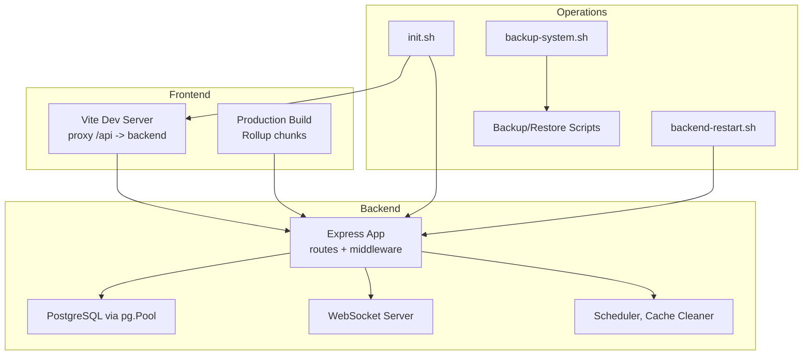
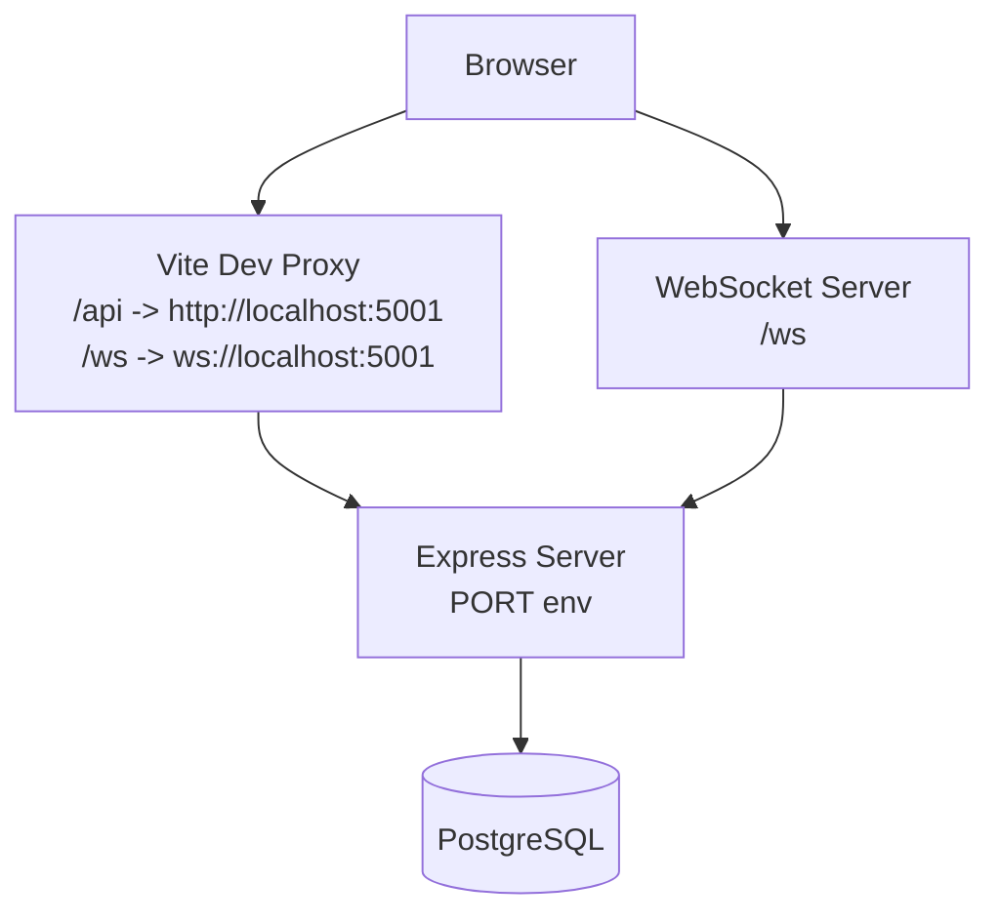
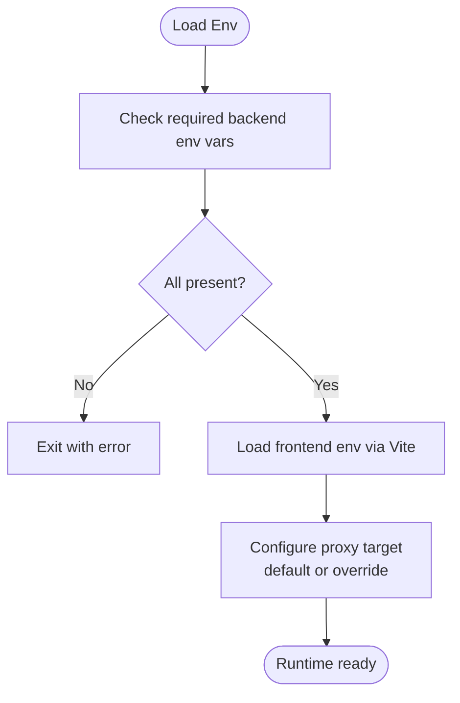
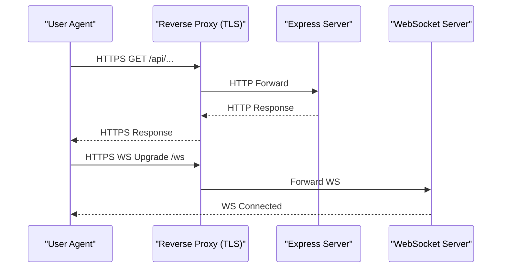
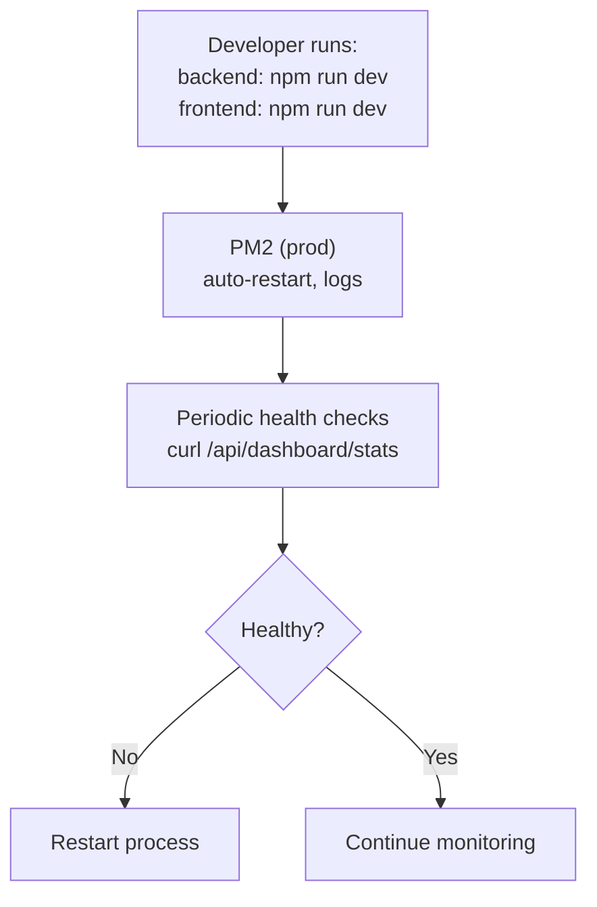
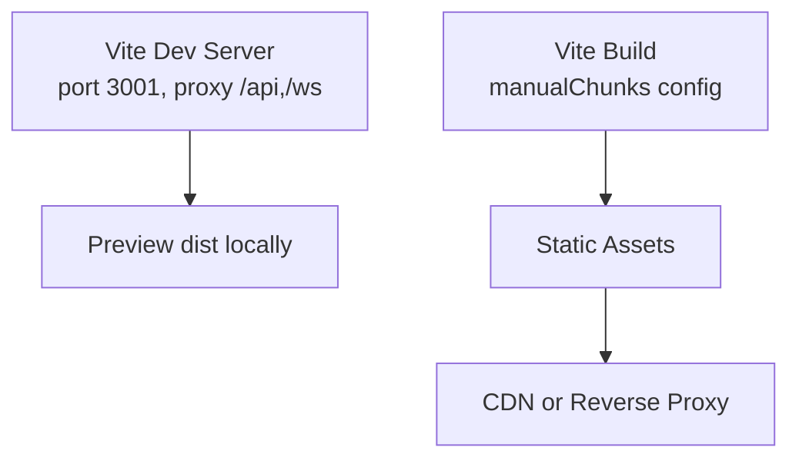
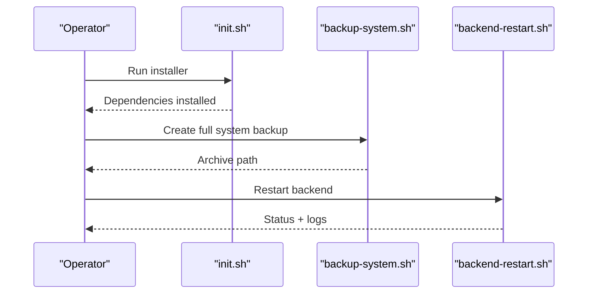
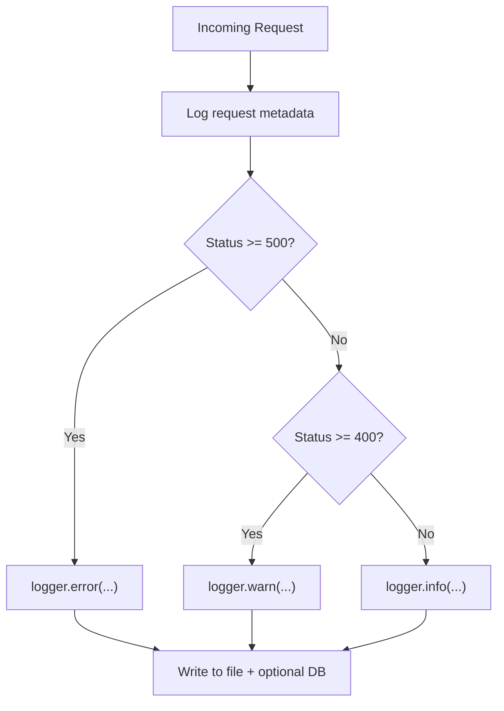
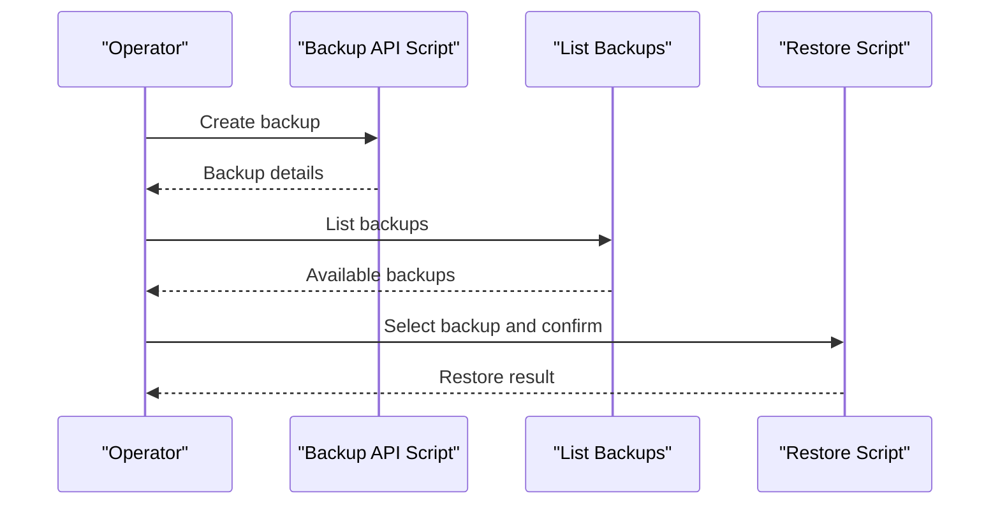
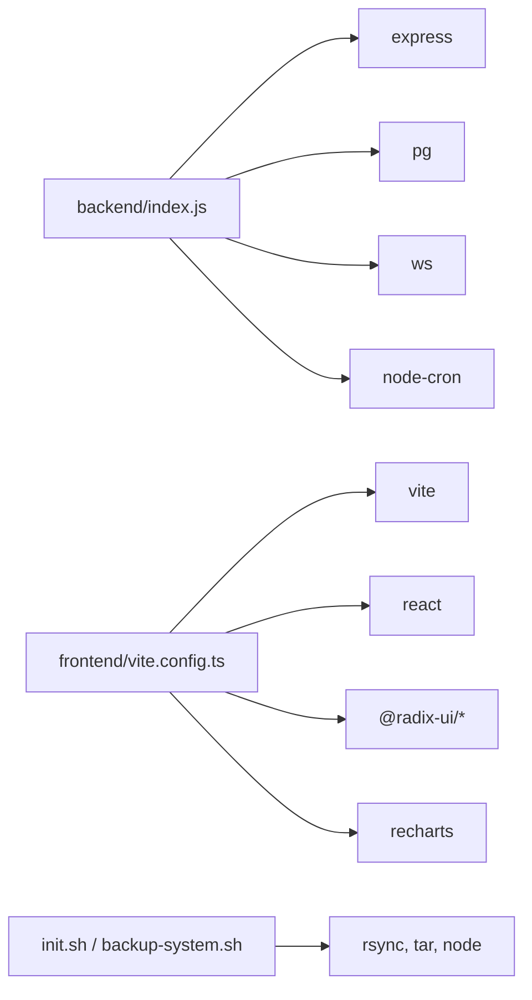

# Deployment & Operations

<cite>
**Referenced Files in This Document**
- [backend/package.json](file://backend/package.json)
- [frontend/package.json](file://frontend/package.json)
- [backend/env.example](file://backend/env.example)
- [backend/index.js](file://backend/index.js)
- [backend/db.js](file://backend/db.js)
- [backend/utils/logger.js](file://backend/utils/logger.js)
- [frontend/vite.config.ts](file://frontend/vite.config.ts)
- [scripts/backup-system.sh](file://scripts/backup-system.sh)
- [scripts/backend-restart.sh](file://scripts/backend-restart.sh)
- [init.sh](file://init.sh)
- [docs/docker-removal-report.md](file://docs/docker-removal-report.md)
- [backend/scripts/create-backup.js](file://backend/scripts/create-backup.js)
- [backend/scripts/restore.js](file://backend/scripts/restore.js)
</cite>

## Table of Contents
1. [Introduction](#introduction)
2. [Project Structure](#project-structure)
3. [Core Components](#core-components)
4. [Architecture Overview](#architecture-overview)
5. [Detailed Component Analysis](#detailed-component-analysis)
6. [Dependency Analysis](#dependency-analysis)
7. [Performance Considerations](#performance-considerations)
8. [Troubleshooting Guide](#troubleshooting-guide)
9. [Conclusion](#conclusion)
10. [Appendices](#appendices)

## Introduction
This document provides comprehensive deployment and operations guidance for Titan CRM. It covers production deployment procedures, environment configuration, reverse proxy setup, SSL/TLS configuration, process management, build processes for frontend and backend, asset optimization, deployment automation, monitoring and logging, performance metrics and alerting, backup scheduling and disaster recovery, system maintenance, scaling and load balancing, database optimization, security hardening, vulnerability management, compliance, and troubleshooting.

## Project Structure
Titan CRM is a full-stack application composed of:
- Backend: Node.js + Express API with modular route registration, PostgreSQL database connectivity, and internal services (WebSocket, scheduler, cache cleaner).
- Frontend: Vite + React application with development proxy and production build pipeline.
- Scripts: Bash and Node-based automation for initialization, restarts, backups, and restores.
- Documentation: Removal of Docker-based deployment artifacts; current guidance focuses on native Node.js + Vite + PostgreSQL deployment.

**Diagram sources**
- [frontend/vite.config.ts:1-113](file://frontend/vite.config.ts#L1-L112)
- [backend/index.js:1-258](file://backend/index.js#L1-L39)
- [backend/db.js:1-68](file://backend/db.js#L1-L68)
- [scripts/init.sh:1-94](file://init.sh#L1-L93)
- [scripts/backup-system.sh:1-99](file://scripts/backup-system.sh#L1-L98)
- [scripts/backend-restart.sh:1-38](file://scripts/backend-restart.sh#L1-L37)

**Section sources**
- [docs/docker-removal-report.md:1-69](file://docs/docker-removal-report.md#L1-L68)
- [frontend/vite.config.ts:1-113](file://frontend/vite.config.ts#L1-L112)
- [backend/index.js:1-258](file://backend/index.js#L1-L39)

## Core Components
- Backend runtime and routing
  - Express server with CORS, JSON/URL-encoded body parsing, static uploads, and request logging.
  - Modular router registration and legacy route aliases.
  - WebSocket initialization and periodic service initializations.
- Database connectivity
  - PostgreSQL connection pool via pg with environment-driven configuration and snake_case to camelCase conversion for query results.
- Logging and diagnostics
  - Centralized logger with file and optional DB persistence, sensitive data sanitization, and HTTP request telemetry.
- Frontend build and proxy
  - Vite dev server with proxy to backend API and WebSocket, production build with Rollup chunk splitting.
- Automation scripts
  - Initialization of dependencies across root, backend, and frontend.
  - System-wide backup creation and archival.
  - Backend restart with cache clearing and health checks.
  - Backup and restore scripts for API and direct modes.

**Section sources**
- [backend/index.js:1-258](file://backend/index.js#L1-L39)
- [backend/db.js:1-68](file://backend/db.js#L1-L68)
- [backend/utils/logger.js:1-319](file://backend/utils/logger.js#L1-L318)
- [frontend/vite.config.ts:1-113](file://frontend/vite.config.ts#L1-L112)
- [init.sh:1-94](file://init.sh#L1-L93)
- [scripts/backup-system.sh:1-99](file://scripts/backup-system.sh#L1-L98)
- [scripts/backend-restart.sh:1-38](file://scripts/backend-restart.sh#L1-L37)

## Architecture Overview
The system runs as two separate processes:
- Backend: Node.js + Express listening on a configurable port, serving REST APIs and WebSocket endpoints, and connecting to PostgreSQL.
- Frontend: Vite dev server with proxy to backend during development; production builds serve static assets.

**Diagram sources**
- [frontend/vite.config.ts:36-47](file://frontend/vite.config.ts#L36-L47)
- [backend/index.js:192-209](file://backend/index.js#L39)
- [backend/db.js:31-39](file://backend/db.js#L31-L39)

## Detailed Component Analysis

### Environment Configuration
- Backend environment variables include server port, API base URL for scripts, PostgreSQL credentials, optional PostgreSQL binary paths, JWT secret, optional auth bypass, log level, SMTP settings, and company logo URL.
- Frontend loads environment variables via Vite’s loadEnv; the proxy target can be overridden via VITE_API_BACKEND_URL.

**Diagram sources**
- [backend/env.example:1-62](file://backend/env.example#L1-L61)
- [backend/index.js:13-29](file://backend/index.js#L13-L29)
- [frontend/vite.config.ts:9-24](file://frontend/vite.config.ts#L9-L24)

**Section sources**
- [backend/env.example:1-62](file://backend/env.example#L1-L61)
- [backend/index.js:13-29](file://backend/index.js#L13-L29)
- [frontend/vite.config.ts:9-24](file://frontend/vite.config.ts#L9-L24)

### Reverse Proxy Setup and SSL/TLS
- Recommended approach:
  - Place a reverse proxy (e.g., Nginx or Apache) in front of the backend Express server.
  - Terminate TLS at the proxy; forward HTTP to the backend port configured by PORT.
  - Configure WebSocket upgrades for /ws.
  - Serve frontend static assets via the proxy or a CDN in production.
- Backend CORS is enabled; ensure the proxy origin matches expectations.

**Diagram sources**
- [backend/index.js:51-63](file://backend/index.js#L39)
- [backend/index.js:202-209](file://backend/index.js#L39)

**Section sources**
- [backend/index.js:51-63](file://backend/index.js#L39)
- [backend/index.js:202-209](file://backend/index.js#L39)

### Process Management
- Development: Run backend and frontend in separate terminals using npm scripts.
- Production: Use process managers (e.g., PM2) to manage Node.js processes, enable restart on failure, and monitor resource usage.
- Health checks: Use the backend’s readiness endpoint pattern and simple curl checks during restarts.

**Diagram sources**
- [scripts/backend-restart.sh:15-37](file://scripts/backend-restart.sh#L15-L37)
- [backend/package.json:5-34](file://backend/package.json#L5-L34)

**Section sources**
- [scripts/backend-restart.sh:1-38](file://scripts/backend-restart.sh#L1-L37)
- [backend/package.json:5-34](file://backend/package.json#L5-L34)

### Build Process and Asset Optimization
- Backend
  - Uses npm scripts for development and operational tasks (migrate, reset, backup, restore, seed, etc.).
- Frontend
  - Development: Vite dev server with HMR and proxy to backend.
  - Production: Vite build with source maps, chunk size warnings, and manual chunk groups for vendor libraries, query, charts, icons, forms, and radix UI packages.

**Diagram sources**
- [frontend/vite.config.ts:27-52](file://frontend/vite.config.ts#L27-L52)
- [frontend/vite.config.ts:67-110](file://frontend/vite.config.ts#L67-L110)

**Section sources**
- [frontend/vite.config.ts:27-52](file://frontend/vite.config.ts#L27-L52)
- [frontend/vite.config.ts:67-110](file://frontend/vite.config.ts#L67-L110)
- [backend/package.json:5-34](file://backend/package.json#L5-L34)

### Deployment Automation
- Initialization: Automated installation of dependencies across root, backend, and frontend.
- System backup: Creates a tarball of the project excluding unnecessary files and supports including node_modules optionally.
- Backend restart: Stops existing backend, clears caches, starts dev server, and validates health.

**Diagram sources**
- [init.sh:1-94](file://init.sh#L1-L93)
- [scripts/backup-system.sh:1-99](file://scripts/backup-system.sh#L1-L98)
- [scripts/backend-restart.sh:1-38](file://scripts/backend-restart.sh#L1-L37)

**Section sources**
- [init.sh:1-94](file://init.sh#L1-L93)
- [scripts/backup-system.sh:1-99](file://scripts/backup-system.sh#L1-L98)
- [scripts/backend-restart.sh:1-38](file://scripts/backend-restart.sh#L1-L37)

### Monitoring and Logging
- Backend logging:
  - Levels: debug, info, warn, error controlled by LOG_LEVEL.
  - File logging per day with sanitized metadata.
  - Optional persistence to system_logs table with caching of the setting.
  - HTTP request telemetry with method, path, status, duration, user ID, IP, and user agent.
- Frontend:
  - No dedicated logging module in the provided configuration; rely on browser console and backend logs.

**Diagram sources**
- [backend/utils/logger.js:167-312](file://backend/utils/logger.js#L167-L312)
- [backend/index.js:111-139](file://backend/index.js#L39)

**Section sources**
- [backend/utils/logger.js:1-319](file://backend/utils/logger.js#L1-L318)
- [backend/index.js:111-139](file://backend/index.js#L39)

### Performance Metrics and Alerting
- Metrics to collect:
  - Backend: HTTP response times, error rates, request volume, DB query durations, WebSocket connections.
  - Frontend: Bundle sizes, LCP/FID/CLS via web vitals in production.
- Alerting:
  - Use process manager logs and system monitoring (CPU, memory, disk) to trigger alerts.
  - Implement simple health endpoints and cron-based checks to notify on downtime.

[No sources needed since this section provides general guidance]

### Backup Scheduling and Disaster Recovery
- System backup:
  - Full project archive with optional inclusion of node_modules and cleanup behavior.
- Database backup and restore:
  - API-based backup and restore scripts; interactive selection and confirmation.
  - Direct mode for restoring without running backend (extracts archive, ensures DB, runs SQL).
  - PostgreSQL binary auto-detection across platforms.

**Diagram sources**
- [backend/scripts/create-backup.js:67-91](file://backend/scripts/create-backup.js#L67-L91)
- [backend/scripts/restore.js:167-181](file://backend/scripts/restore.js#L167-L181)
- [backend/scripts/restore.js:308-416](file://backend/scripts/restore.js#L308-L416)

**Section sources**
- [scripts/backup-system.sh:1-99](file://scripts/backup-system.sh#L1-L98)
- [backend/scripts/create-backup.js:1-92](file://backend/scripts/create-backup.js#L1-L91)
- [backend/scripts/restore.js:1-419](file://backend/scripts/restore.js#L1-L418)

### Scaling and Load Balancing
- Horizontal scaling:
  - Stateless backend allows multiple instances behind a load balancer.
  - Use sticky sessions only if required; otherwise distribute traffic evenly.
- Database:
  - Scale reads with read replicas; writes remain on primary.
  - Optimize queries, add indexes, and consider connection pooling tuning.
- Frontend:
  - Serve static assets via CDN and enable compression.

[No sources needed since this section provides general guidance]

### Database Optimization
- Indexes and constraints: Maintain schema integrity and add indexes on frequently queried columns.
- Connection pooling: Tune pool size and timeouts based on workload.
- Query profiling: Use EXPLAIN/EXPLAIN ANALYZE to optimize slow queries.

[No sources needed since this section provides general guidance]

### Security Hardening and Compliance
- Secrets management:
  - Store secrets in environment variables; never commit to source control.
- Transport security:
  - Enforce HTTPS at the reverse proxy; configure strong ciphers and TLS versions.
- Access control:
  - Enforce JWT-based authentication; disable auth only for testing.
- Data protection:
  - Sanitize logs; avoid logging sensitive fields; encrypt backups at rest.
- Compliance:
  - Maintain audit trails; implement retention policies; ensure data residency.

[No sources needed since this section provides general guidance]

## Dependency Analysis
- Backend depends on Express, pg, cors, bcrypt, jsonwebtoken, nodemailer, ws, node-cron, and others.
- Frontend depends on React, Vite, Tailwind, Recharts, Radix UI, and related libraries.
- Scripts depend on Node.js built-ins and external tools (e.g., rsync, tar, PostgreSQL binaries).

**Diagram sources**
- [backend/package.json:36-59](file://backend/package.json#L36-L59)
- [frontend/package.json:23-90](file://frontend/package.json#L23-L90)
- [init.sh:23-46](file://init.sh#L23-L46)
- [scripts/backup-system.sh:55-74](file://scripts/backup-system.sh#L55-L74)

**Section sources**
- [backend/package.json:36-59](file://backend/package.json#L36-L59)
- [frontend/package.json:23-90](file://frontend/package.json#L23-L90)
- [init.sh:23-46](file://init.sh#L23-L46)
- [scripts/backup-system.sh:55-74](file://scripts/backup-system.sh#L55-L74)

## Performance Considerations
- Frontend
  - Use manual chunking to reduce initial bundle size.
  - Enable source maps only in development; consider production source maps for debugging.
- Backend
  - Limit JSON payload sizes; avoid logging large request bodies.
  - Monitor DB query durations and tune slow queries.
  - Use connection pooling and keep-alive settings appropriately.

[No sources needed since this section provides general guidance]

## Troubleshooting Guide
- Backend fails to start due to missing environment variables
  - Ensure all required backend env vars are present and loaded.
- Database connection errors
  - Verify DB_HOST, DB_PORT, DB_NAME, DB_USER, DB_PASSWORD; test connectivity separately.
- Frontend proxy not working
  - Confirm VITE_API_BACKEND_URL or default proxy target; ensure backend is reachable.
- Backup/restore failures
  - Check API_URL in backend env; verify PostgreSQL binaries are discoverable; confirm backup archives exist.
- Health checks fail after restart
  - Use the restart script’s curl checks; review backend logs and process manager status.

**Section sources**
- [backend/index.js:13-29](file://backend/index.js#L13-L29)
- [backend/db.js:20-29](file://backend/db.js#L20-L29)
- [frontend/vite.config.ts:16-22](file://frontend/vite.config.ts#L16-L22)
- [backend/scripts/create-backup.js:6-10](file://backend/scripts/create-backup.js#L6-L10)
- [backend/scripts/restore.js:93-132](file://backend/scripts/restore.js#L93-L132)
- [scripts/backend-restart.sh:22-37](file://scripts/backend-restart.sh#L22-L37)

## Conclusion
Titan CRM is designed for native deployment using Node.js + Express for the backend, Vite + React for the frontend, and PostgreSQL for persistence. The provided scripts and configuration support development, operational tasks, and basic production readiness. For production, complement this with a reverse proxy, process management, robust monitoring/alerting, secure secrets handling, and a repeatable backup and DR plan.

[No sources needed since this section summarizes without analyzing specific files]

## Appendices

### Appendix A: Environment Variables Reference
- Backend
  - PORT, API_URL, DB_HOST, DB_PORT, DB_NAME, DB_USER, DB_PASSWORD, PG_DUMP_PATH, PSQL_PATH, JWT_SECRET, DISABLE_AUTH, LOG_LEVEL, SMTP_HOST, SMTP_PORT, SMTP_USER, SMTP_PASS, SMTP_FROM, SMTP_DOMAIN, COMPANY_LOGO_URL.
- Frontend
  - VITE_API_BACKEND_URL (optional override), GEMINI_API_KEY (used in define).

**Section sources**
- [backend/env.example:5-62](file://backend/env.example#L5-L61)
- [frontend/vite.config.ts:58-61](file://frontend/vite.config.ts#L58-L61)

### Appendix B: Operational Commands
- Backend
  - Start: npm run dev
  - Migrate/reset/seed/backup/restore via npm scripts
- Frontend
  - Start: npm run dev
  - Build: npm run build
- Scripts
  - init.sh installs dependencies
  - backup-system.sh creates system backups
  - backend-restart.sh restarts backend with cache clearing

**Section sources**
- [backend/package.json:5-34](file://backend/package.json#L5-L34)
- [frontend/package.json:6-21](file://frontend/package.json#L6-L21)
- [init.sh:65-76](file://init.sh#L65-L76)
- [scripts/backup-system.sh:1-99](file://scripts/backup-system.sh#L1-L98)
- [scripts/backend-restart.sh:1-38](file://scripts/backend-restart.sh#L1-L37)