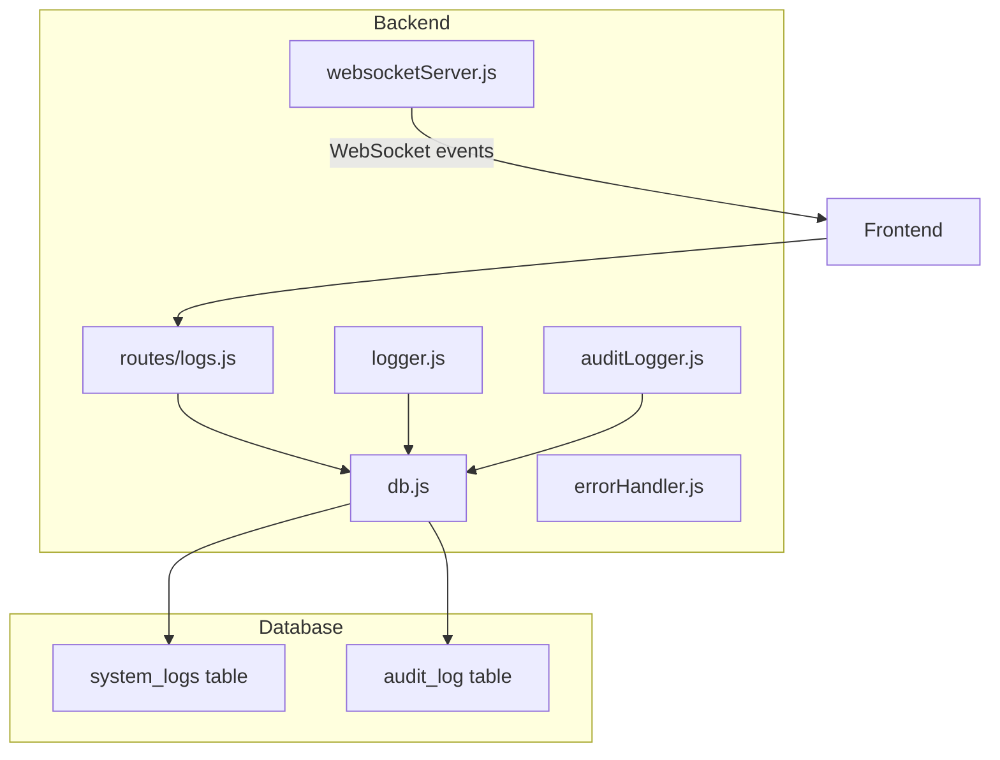
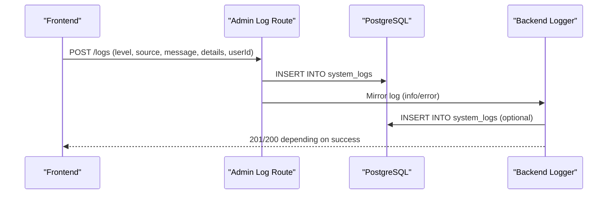
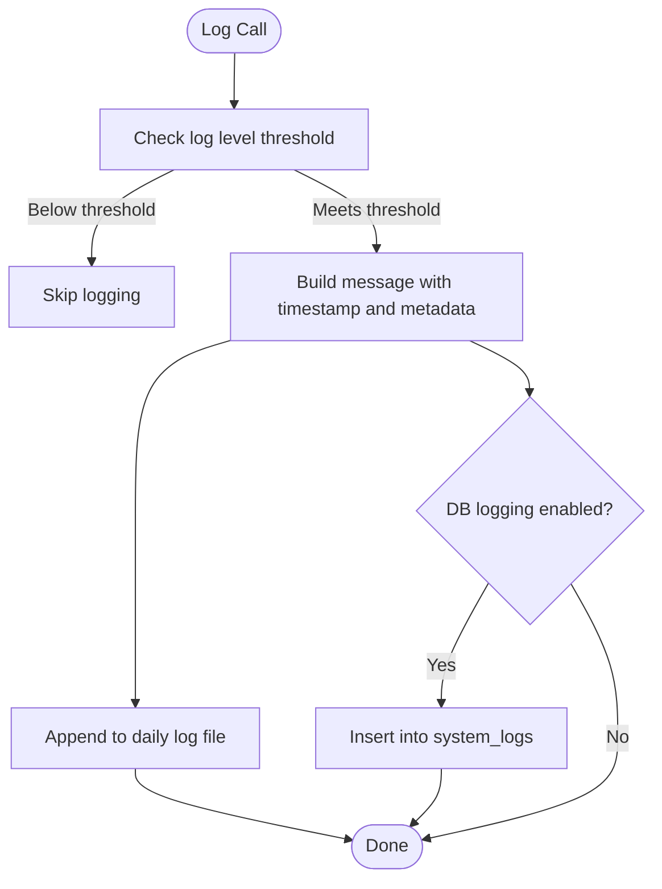
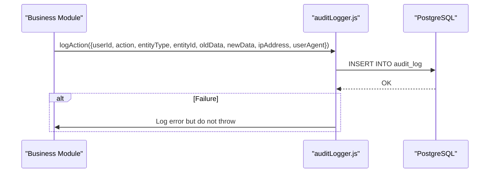
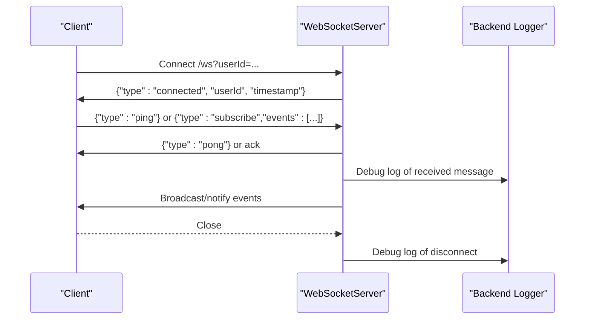
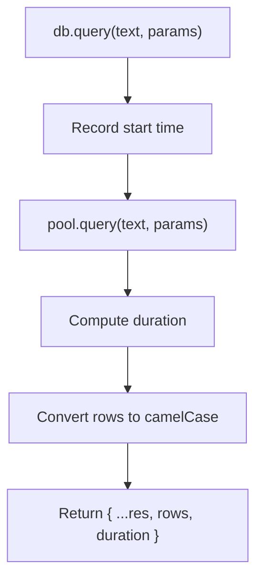
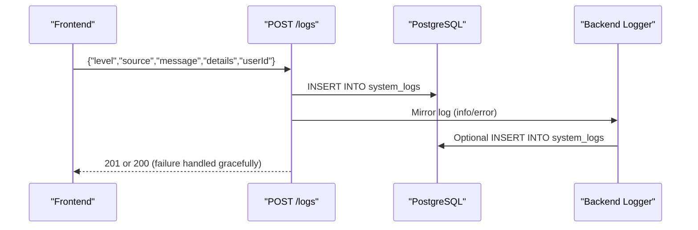
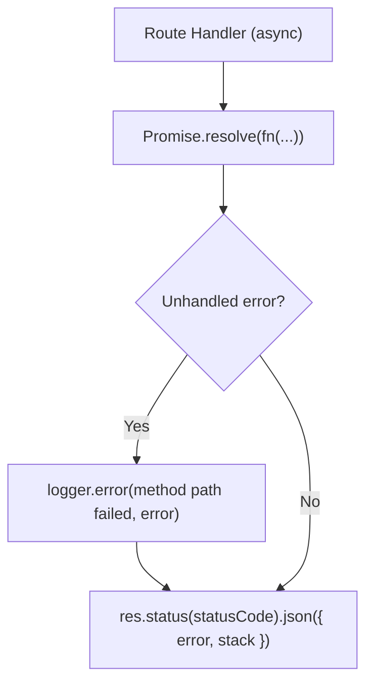
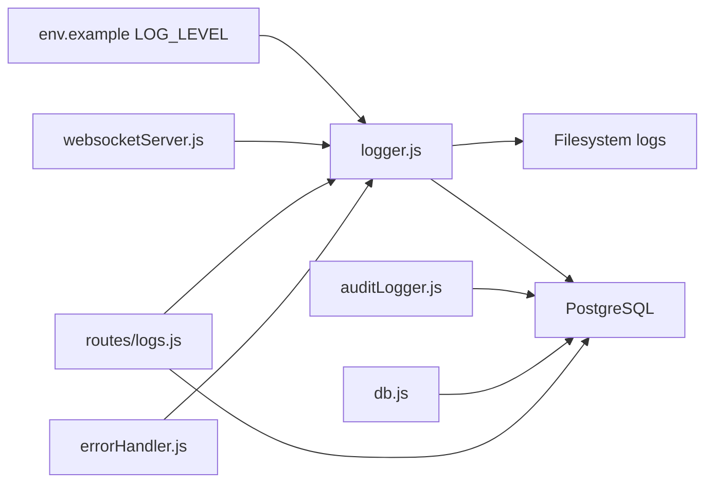

# Monitoring & Logging

<cite>
**Referenced Files in This Document**
- [logger.js](file://backend/utils/logger.js)
- [auditLogger.js](file://backend/utils/auditLogger.js)
- [websocketServer.js](file://backend/services/websocketServer.js)
- [db.js](file://backend/db.js)
- [13_create_system_logs_table.sql](file://backend/migrations/13_create_system_logs_table.sql)
- [102_create_audit_log_table.sql](file://backend/migrations/102_create_audit_log_table.sql)
- [logs.js](file://backend/routes/logs.js)
- [errorHandler.js](file://backend/utils/errorHandler.js)
- [env.example](file://backend/env.example)
- [package.json](file://backend/package.json)
</cite>

## Table of Contents
1. [Introduction](#introduction)
2. [Project Structure](#project-structure)
3. [Core Components](#core-components)
4. [Architecture Overview](#architecture-overview)
5. [Detailed Component Analysis](#detailed-component-analysis)
6. [Dependency Analysis](#dependency-analysis)
7. [Performance Considerations](#performance-considerations)
8. [Troubleshooting Guide](#troubleshooting-guide)
9. [Conclusion](#conclusion)
10. [Appendices](#appendices)

## Introduction
This document provides comprehensive monitoring and logging guidance for the Titan CRM production environment. It covers centralized logging configuration, log rotation strategies, and log aggregation; performance monitoring setup including application and database metrics; real-time monitoring via WebSocket connections; health check endpoints and uptime monitoring; alerting configuration; log analysis and troubleshooting workflows; and integration with monitoring platforms such as Prometheus, Grafana, or cloud-based solutions.

## Project Structure
The monitoring and logging capabilities are implemented primarily in the backend service:
- Centralized logging utility with file and optional database persistence
- Audit logging for user actions
- WebSocket server for real-time notifications
- Database abstraction with timing instrumentation
- Admin API for ingesting logs from the frontend
- Environment configuration for log verbosity

**Diagram sources**
- [logger.js:167-312](file://backend/utils/logger.js#L167-L312)
- [auditLogger.js:16-47](file://backend/utils/auditLogger.js#L16-L47)
- [websocketServer.js:15-311](file://backend/modules/notifications/services/websocketServer.js#L1-L241)
- [db.js:58-67](file://backend/db.js#L58-L67)
- [logs.js:8-48](file://backend/modules/logs/routes.js#L1-L26)
- [13_create_system_logs_table.sql:4-16](file://backend/migrations/13_create_system_logs_table.sql#L4-L15)
- [102_create_audit_log_table.sql:4-21](file://backend/migrations/102_create_audit_log_table.sql#L4-L20)

**Section sources**
- [logger.js:1-319](file://backend/utils/logger.js#L1-L318)
- [auditLogger.js:1-52](file://backend/utils/auditLogger.js#L1-L51)
- [websocketServer.js:1-311](file://backend/modules/notifications/services/websocketServer.js#L1-L241)
- [db.js:1-68](file://backend/db.js#L1-L68)
- [logs.js:1-51](file://backend/modules/logs/routes.js#L1-L26)
- [env.example:48-50](file://backend/env.example#L48-L50)
- [package.json:36-59](file://backend/package.json#L36-L59)

## Core Components
- Centralized Logger: Provides leveled logging to files and optional database persistence, with sensitive data sanitization and HTTP request logging.
- Audit Logger: Records user actions with old/new data snapshots for compliance and forensics.
- WebSocket Server: Enables real-time notifications and heartbeat-based connection health.
- Database Abstraction: Wraps PostgreSQL queries with timing instrumentation suitable for performance monitoring.
- Admin Log Route: Accepts structured log entries from the frontend and mirrors them to the backend logger.
- Error Handler: Ensures unhandled exceptions are logged and responded to consistently.

**Section sources**
- [logger.js:167-312](file://backend/utils/logger.js#L167-L312)
- [auditLogger.js:16-47](file://backend/utils/auditLogger.js#L16-L47)
- [websocketServer.js:15-311](file://backend/modules/notifications/services/websocketServer.js#L1-L241)
- [db.js:58-67](file://backend/db.js#L58-L67)
- [logs.js:8-48](file://backend/modules/logs/routes.js#L1-L26)
- [errorHandler.js:16-32](file://backend/utils/errorHandler.js#L16-L32)

## Architecture Overview
The monitoring architecture integrates logging, auditing, and real-time channels with database-backed persistence and optional ingestion from the frontend.

**Diagram sources**
- [logs.js:8-38](file://backend/modules/logs/routes.js#L1-L26)
- [logger.js:65-80](file://backend/utils/logger.js#L65-L80)
- [13_create_system_logs_table.sql:4-16](file://backend/migrations/13_create_system_logs_table.sql#L4-L15)

## Detailed Component Analysis

### Centralized Logging Utility
The logger provides:
- Level-based filtering controlled by environment variable
- File logging per day with ISO date suffixes
- Optional database persistence with caching of the “log to DB” setting
- Sanitization of sensitive fields in metadata
- HTTP request logging with method, path, status, duration, user ID, IP, and user agent
- Non-blocking writes to file and DB

**Diagram sources**
- [logger.js:148-162](file://backend/utils/logger.js#L148-L162)
- [logger.js:191-268](file://backend/utils/logger.js#L191-L268)
- [logger.js:65-80](file://backend/utils/logger.js#L65-L80)
- [13_create_system_logs_table.sql:4-16](file://backend/migrations/13_create_system_logs_table.sql#L4-L15)

**Section sources**
- [logger.js:148-162](file://backend/utils/logger.js#L148-L162)
- [logger.js:191-268](file://backend/utils/logger.js#L191-L268)
- [logger.js:65-80](file://backend/utils/logger.js#L65-L80)
- [logger.js:82-131](file://backend/utils/logger.js#L82-L131)
- [logger.js:276-311](file://backend/utils/logger.js#L276-L311)

### Audit Logging
Audit logging captures user actions against entities with old/new data snapshots and client metadata.

**Diagram sources**
- [auditLogger.js:16-47](file://backend/utils/auditLogger.js#L16-L47)
- [102_create_audit_log_table.sql:4-21](file://backend/migrations/102_create_audit_log_table.sql#L4-L20)

**Section sources**
- [auditLogger.js:16-47](file://backend/utils/auditLogger.js#L16-L47)
- [102_create_audit_log_table.sql:4-21](file://backend/migrations/102_create_audit_log_table.sql#L4-L20)

### WebSocket Server for Real-Time Monitoring
The WebSocket server supports:
- Heartbeat pings to keep connections alive
- Per-user client tracking
- Subscription-based event routing
- Notifications for new mail, sync status, and sent mail
- Stats endpoint for connection metrics

**Diagram sources**
- [websocketServer.js:25-120](file://backend/modules/notifications/services/websocketServer.js#L25-L120)
- [websocketServer.js:125-150](file://backend/modules/notifications/services/websocketServer.js#L125-L150)
- [websocketServer.js:229-265](file://backend/modules/notifications/services/websocketServer.js#L1-L241)

**Section sources**
- [websocketServer.js:25-120](file://backend/modules/notifications/services/websocketServer.js#L25-L120)
- [websocketServer.js:229-265](file://backend/modules/notifications/services/websocketServer.js#L1-L241)
- [websocketServer.js:284-293](file://backend/modules/notifications/services/websocketServer.js#L1-L241)

### Database Abstraction and Timing Instrumentation
The database wrapper measures query durations and converts column names from snake_case to camelCase, enabling straightforward metric extraction.

**Diagram sources**
- [db.js:58-67](file://backend/db.js#L58-L67)

**Section sources**
- [db.js:58-67](file://backend/db.js#L58-L67)

### Admin Log Route (Frontend-to-Backend Aggregation)
The Admin Log Route accepts structured log entries from the frontend and mirrors them to the backend logger, ensuring centralized aggregation.

**Diagram sources**
- [logs.js:8-38](file://backend/modules/logs/routes.js#L1-L26)
- [logger.js:65-80](file://backend/utils/logger.js#L65-L80)
- [13_create_system_logs_table.sql:4-16](file://backend/migrations/13_create_system_logs_table.sql#L4-L15)

**Section sources**
- [logs.js:8-38](file://backend/modules/logs/routes.js#L1-L26)
- [logger.js:65-80](file://backend/utils/logger.js#L65-L80)

### Error Handling and Consistent Logging
The error handler wraps asynchronous route handlers to ensure all unhandled errors are logged with HTTP method and path context and returned with appropriate status codes.

**Diagram sources**
- [errorHandler.js:16-32](file://backend/utils/errorHandler.js#L16-L32)
- [logger.js:173-199](file://backend/utils/logger.js#L173-L199)

**Section sources**
- [errorHandler.js:16-32](file://backend/utils/errorHandler.js#L16-L32)
- [logger.js:173-199](file://backend/utils/logger.js#L173-L199)

## Dependency Analysis
- Logger depends on filesystem for daily log files and optionally on the database for centralized storage.
- Audit logger depends on the database for persistent audit records.
- WebSocket server depends on the HTTP server instance and uses the logger for operational events.
- Database abstraction is a thin wrapper around the PostgreSQL client with timing instrumentation.
- Admin log route depends on the database and logger for mirroring.
- Environment configuration controls log verbosity.

**Diagram sources**
- [env.example:48-50](file://backend/env.example#L48-L50)
- [logger.js:191-268](file://backend/utils/logger.js#L191-L268)
- [auditLogger.js:26-42](file://backend/utils/auditLogger.js#L26-L42)
- [websocketServer.js:31-60](file://backend/modules/notifications/services/websocketServer.js#L31-L60)
- [db.js:39-67](file://backend/db.js#L39-L67)
- [logs.js:12-22](file://backend/modules/logs/routes.js#L12-L22)
- [errorHandler.js:16-32](file://backend/utils/errorHandler.js#L16-L32)

**Section sources**
- [env.example:48-50](file://backend/env.example#L48-L50)
- [logger.js:191-268](file://backend/utils/logger.js#L191-L268)
- [auditLogger.js:26-42](file://backend/utils/auditLogger.js#L26-L42)
- [websocketServer.js:31-60](file://backend/modules/notifications/services/websocketServer.js#L31-L60)
- [db.js:39-67](file://backend/db.js#L39-L67)
- [logs.js:12-22](file://backend/modules/logs/routes.js#L12-L22)
- [errorHandler.js:16-32](file://backend/utils/errorHandler.js#L16-L32)

## Performance Considerations
- Database query timing: The database wrapper measures query duration, enabling easy extraction of slow queries and latency trends for dashboards.
- Log volume: Daily rotating files reduce per-file growth; consider external log aggregation for long-term retention.
- HTTP logging: Request metadata includes duration and user context, useful for latency and throughput analysis.
- Audit logging: JSONB fields support flexible querying; ensure proper indexing for frequent filters.
- WebSocket heartbeats: Ping/pong mechanism helps detect stale connections proactively.

[No sources needed since this section provides general guidance]

## Troubleshooting Guide
- Verify log level: Ensure LOG_LEVEL is set appropriately in the environment to capture desired verbosity.
- Check database connectivity: Confirm DB credentials and network reachability; the database wrapper logs missing environment variables and exits early if required variables are absent.
- Inspect daily log files: Review backend/logs for the current day’s files to locate recent errors or warnings.
- Validate audit records: Confirm audit_log table exists and is indexed for efficient queries.
- Test WebSocket connectivity: Use the “connected” message and “ping”/“pong” exchange to verify health.
- Admin log ingestion: If frontend logs are not appearing, confirm the Admin Log Route is reachable and that mirroring to the backend logger occurs.

**Section sources**
- [env.example:48-50](file://backend/env.example#L48-L50)
- [db.js:20-29](file://backend/db.js#L20-L29)
- [logger.js:191-268](file://backend/utils/logger.js#L191-L268)
- [102_create_audit_log_table.sql:4-21](file://backend/migrations/102_create_audit_log_table.sql#L4-L20)
- [websocketServer.js:112-120](file://backend/modules/notifications/services/websocketServer.js#L112-L120)
- [logs.js:8-38](file://backend/modules/logs/routes.js#L1-L26)

## Conclusion
Titan CRM’s monitoring and logging infrastructure provides a robust foundation for observability:
- Centralized logging with file and optional database persistence
- Audit trails for compliance
- Real-time notifications via WebSocket
- Database timing instrumentation for performance insights
- Admin log ingestion for frontend telemetry

By integrating these components with external monitoring platforms and implementing log rotation and alerting policies, the system can achieve comprehensive production-grade observability.

[No sources needed since this section summarizes without analyzing specific files]

## Appendices

### Log Rotation Strategies
- File rotation: Daily log files are automatically created; archive and compress older files off-box.
- Size-based rotation: Configure external log collectors to rotate when files exceed thresholds.
- Retention: Maintain logs for at least 90 days for compliance; purge older entries after retention period.

[No sources needed since this section provides general guidance]

### Log Aggregation Systems
- Collect backend/logs and system logs from application servers.
- Stream logs to a centralized platform (e.g., ELK, Loki, Splunk) for querying and alerting.
- Index by level, source, and user ID for targeted investigations.

[No sources needed since this section provides general guidance]

### Performance Monitoring Setup
- Application metrics: Expose query durations and HTTP request latencies for dashboards.
- Database performance: Monitor slow query logs, connection counts, and index usage.
- System resources: Track CPU, memory, disk I/O, and network metrics.

[No sources needed since this section provides general guidance]

### Real-Time Monitoring via WebSocket
- Use heartbeat pings to detect connection health.
- Subscribe to domain-specific events for targeted notifications.
- Track connection stats to identify scaling needs.

[No sources needed since this section provides general guidance]

### Health Checks and Uptime Monitoring
- Implement periodic checks against database connectivity and basic API endpoints.
- Integrate with uptime services (e.g., UptimeRobot, StatusCake) for external monitoring.
- Surface health status in admin panels for quick diagnostics.

[No sources needed since this section provides general guidance]

### Alerting Configuration
- Thresholds: Alert on elevated error rates, slow response times, and low free disk space.
- Critical events: Immediate alerts for database outages, audit failures, and WebSocket connection storms.
- Escalation: Define escalation paths for repeated incidents.

[No sources needed since this section provides general guidance]

### Log Analysis Techniques and Incident Response
- Use correlation IDs and user context to trace requests across services.
- Apply regex and structured parsing to extract meaningful signals from logs.
- Establish runbooks for common incidents: DB timeouts, auth failures, and WebSocket disconnections.

[No sources needed since this section provides general guidance]

### Integration with Monitoring Platforms
- Prometheus: Scrape metrics from database timing and application endpoints.
- Grafana: Visualize dashboards for latency, error rates, and resource utilization.
- Cloud providers: Use managed logging and monitoring services for centralized observability.

[No sources needed since this section provides general guidance]