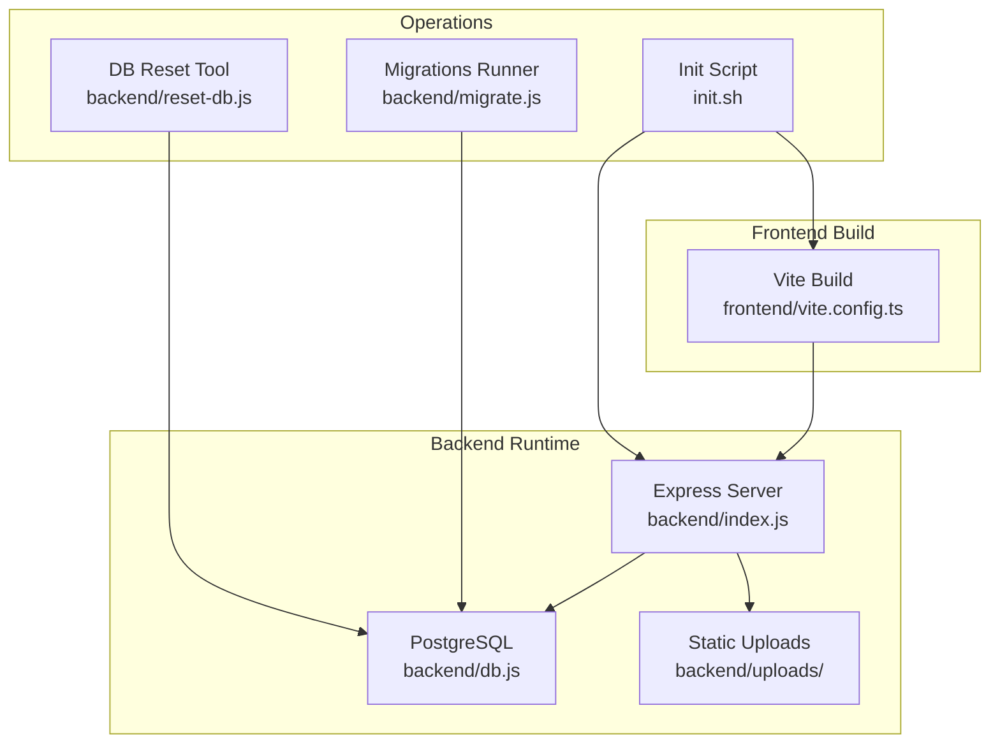
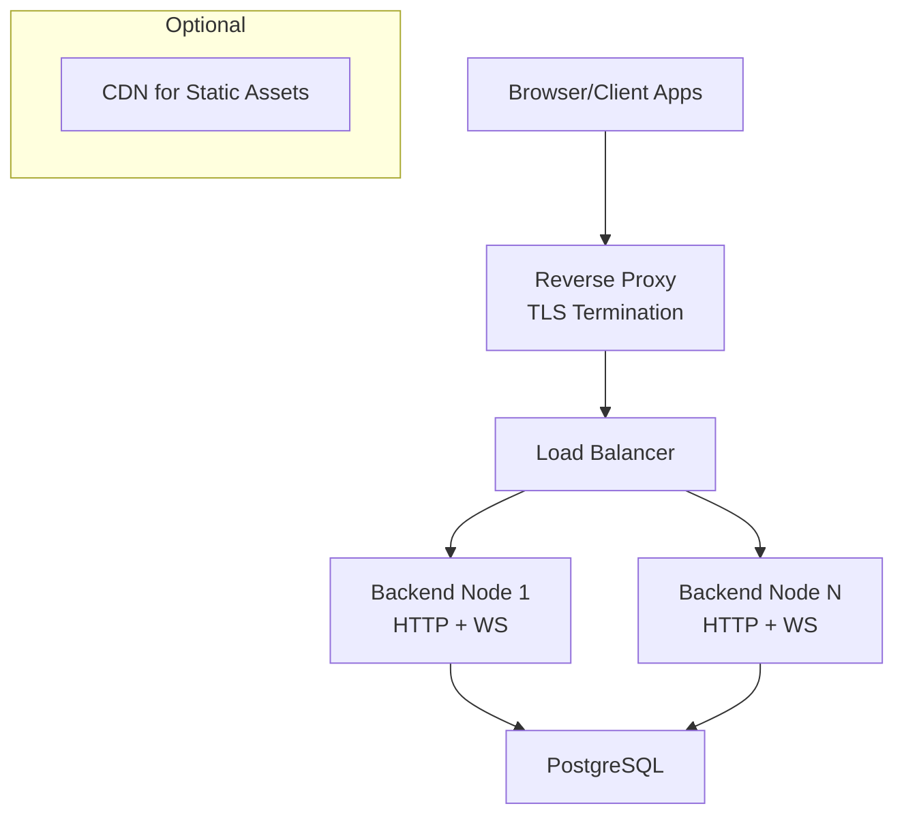
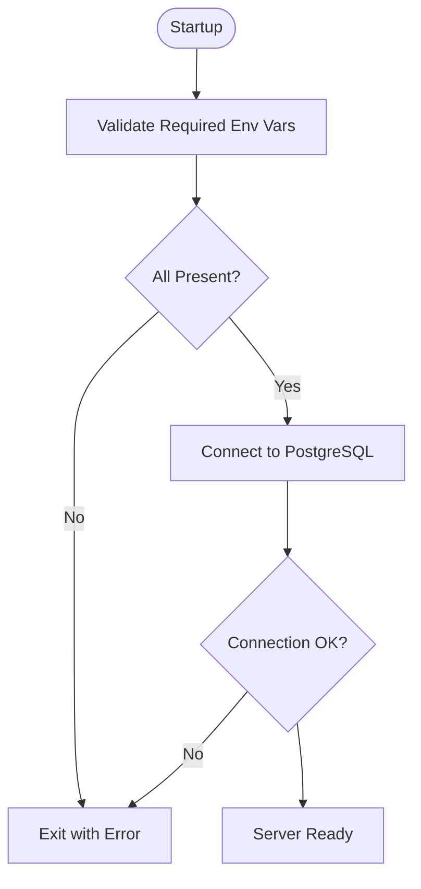
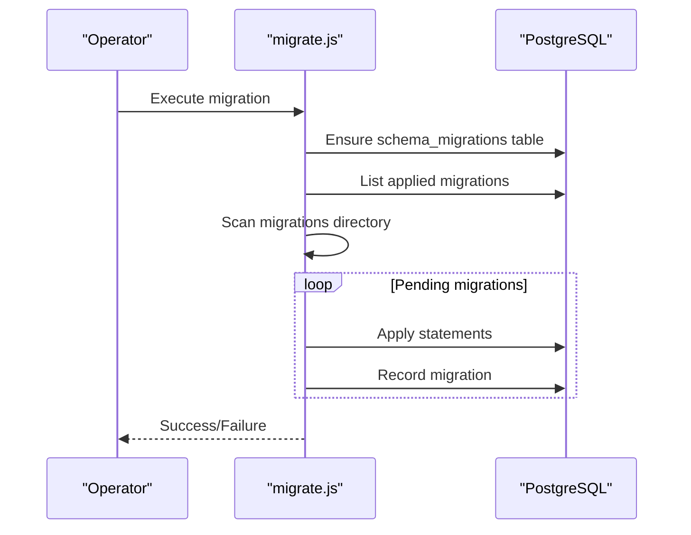
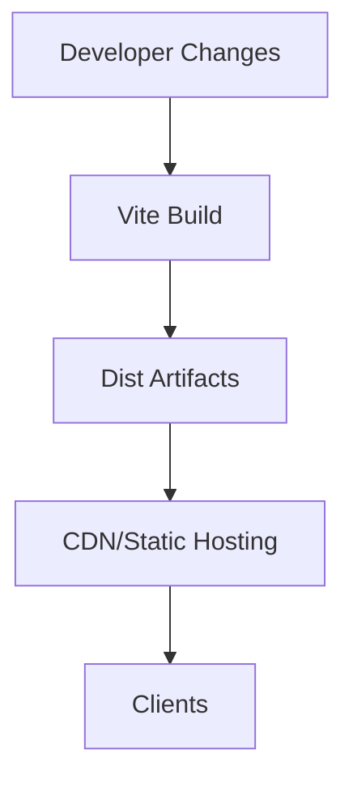
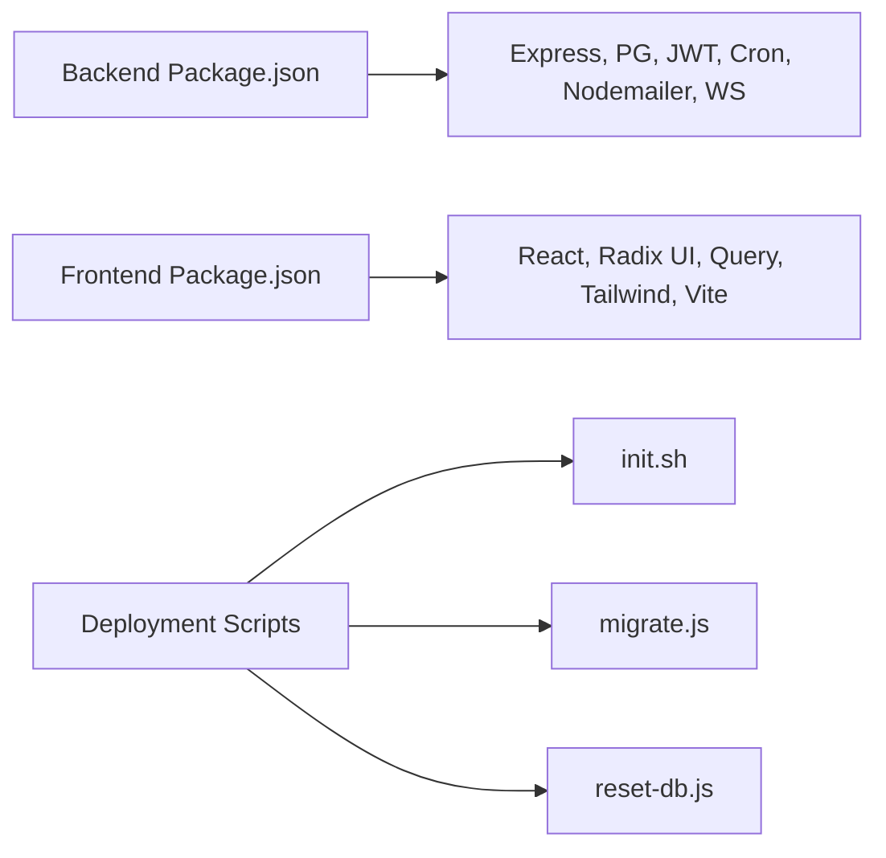

# Production Deployment

<cite>
**Referenced Files in This Document**
- [backend/package.json](file://backend/package.json)
- [frontend/package.json](file://frontend/package.json)
- [backend/env.example](file://backend/env.example)
- [backend/index.js](file://backend/index.js)
- [backend/db.js](file://backend/db.js)
- [backend/migrate.js](file://backend/migrate.js)
- [backend/reset-db.js](file://backend/reset-db.js)
- [frontend/vite.config.ts](file://frontend/vite.config.ts)
- [scripts/README.md](file://scripts/README.md)
- [init.sh](file://init.sh)
</cite>

## Table of Contents
1. [Introduction](#introduction)
2. [Project Structure](#project-structure)
3. [Core Components](#core-components)
4. [Architecture Overview](#architecture-overview)
5. [Detailed Component Analysis](#detailed-component-analysis)
6. [Dependency Analysis](#dependency-analysis)
7. [Performance Considerations](#performance-considerations)
8. [Troubleshooting Guide](#troubleshooting-guide)
9. [Conclusion](#conclusion)
10. [Appendices](#appendices)

## Introduction
This document provides a comprehensive production deployment guide for Titan CRM. It covers environment configuration, database setup, dependency installation, the deployment pipeline from source to production, reverse proxy and TLS configuration, process management and clustering, asset optimization and build processes, static file serving, security hardening, firewall and access control, deployment automation, rollback procedures, and zero-downtime strategies.

## Project Structure
Titan CRM is a full-stack application composed of:
- A Node.js/Express backend that serves APIs, static uploads, and WebSocket endpoints.
- A Vite/React TypeScript frontend that builds optimized static assets.
- PostgreSQL as the primary datastore, with a robust migration system.
- A set of operational scripts for initialization, migrations, backups, and resets.

**Diagram sources**
- [frontend/vite.config.ts:1-113](file://frontend/vite.config.ts#L1-L112)
- [backend/index.js:1-258](file://backend/index.js#L1-L39)
- [backend/db.js:1-68](file://backend/db.js#L1-L68)
- [init.sh:1-94](file://init.sh#L1-L93)
- [backend/migrate.js:1-220](file://backend/migrate.js#L1-L220)
- [backend/reset-db.js:1-109](file://backend/reset-db.js#L1-L108)

**Section sources**
- [frontend/vite.config.ts:1-113](file://frontend/vite.config.ts#L1-L112)
- [backend/index.js:1-258](file://backend/index.js#L1-L39)
- [backend/db.js:1-68](file://backend/db.js#L1-L68)
- [init.sh:1-94](file://init.sh#L1-L93)
- [backend/migrate.js:1-220](file://backend/migrate.js#L1-L220)
- [backend/reset-db.js:1-109](file://backend/reset-db.js#L1-L108)

## Core Components
- Backend runtime and API surface:
  - Express server listens on a configurable port, initializes modules, registers routes, and starts supporting services (WebSocket, cache cleaner, scheduler).
  - Static uploads are served under /uploads, and a dedicated route serves legal-cases files with backward compatibility.
  - Environment validation ensures required variables are present before startup.
- Database connectivity:
  - PostgreSQL connection pool is configured via environment variables.
  - A migration runner applies SQL/Markdown migrations and tracks applied migrations.
  - A reset tool safely drops schema objects and prepares for re-initialization.
- Frontend build and development:
  - Vite configuration defines dev server, proxying to backend, and production build with manual chunking and sourcemaps.
- Initialization and automation:
  - A unified init script installs dependencies across root, backend, and frontend.
  - Operational scripts are documented for backup, restart, and testing.

**Section sources**
- [backend/index.js:13-29](file://backend/index.js#L13-L29)
- [backend/index.js:63-81](file://backend/index.js#L39)
- [backend/db.js:31-37](file://backend/db.js#L31-L37)
- [backend/migrate.js:134-215](file://backend/migrate.js#L134-L215)
- [backend/reset-db.js:13-102](file://backend/reset-db.js#L13-L102)
- [frontend/vite.config.ts:26-112](file://frontend/vite.config.ts#L26-L112)
- [init.sh:23-76](file://init.sh#L23-L76)

## Architecture Overview
The production runtime consists of:
- Reverse Proxy (nginx/Apache) terminating TLS and routing traffic to backend nodes.
- Backend cluster behind the proxy, exposing HTTP and WebSocket endpoints.
- PostgreSQL managed externally or in-cluster with strong credentials and network policies.
- Optional CDN for static assets generated by the frontend build.

[No sources needed since this diagram shows conceptual workflow, not actual code structure]

## Detailed Component Analysis

### Environment Configuration and Secrets
- Required backend environment variables include port and database connection parameters. The server validates presence before starting.
- JWT secret and optional SMTP settings are defined in the example environment file.
- The database client reads environment variables directly from the env file to configure the connection pool.

**Diagram sources**
- [backend/index.js:13-29](file://backend/index.js#L13-L29)
- [backend/db.js:20-29](file://backend/db.js#L20-L29)

**Section sources**
- [backend/env.example:5-62](file://backend/env.example#L5-L61)
- [backend/index.js:13-29](file://backend/index.js#L13-L29)
- [backend/db.js:6-29](file://backend/db.js#L6-L29)

### Database Setup and Migrations
- PostgreSQL is used as the primary database. Configure host, port, database name, user, and password.
- The migration runner:
  - Creates a migration tracking table if absent.
  - Reads .sql and .md migration files, extracts SQL blocks, splits statements, and applies them transactionally.
  - Records successful migrations to prevent reapplication.
- Reset tool:
  - Drops triggers, functions, tables, and composite types in the public schema after user confirmation.
  - Provides next steps to re-apply migrations and seed data.

**Diagram sources**
- [backend/migrate.js:134-215](file://backend/migrate.js#L134-L215)

**Section sources**
- [backend/migrate.js:91-132](file://backend/migrate.js#L91-L132)
- [backend/migrate.js:134-215](file://backend/migrate.js#L134-L215)
- [backend/reset-db.js:13-102](file://backend/reset-db.js#L13-L102)

### Reverse Proxy and TLS Configuration
- Place a reverse proxy (nginx/Apache) in front of backend nodes.
- Terminate TLS at the proxy using valid certificates.
- Route /api paths to backend nodes and enable WebSocket upgrades for /ws.
- Enforce HTTPS redirects at the proxy level.

[No sources needed since this section provides general guidance]

### Process Management and Clustering
- Use a process manager (PM2 or systemd) to manage backend instances.
- Enable clustering to utilize multiple CPU cores.
- Configure health checks and graceful shutdown hooks.
- Use sticky sessions if stateful sessions are required; otherwise rely on stateless design.

[No sources needed since this section provides general guidance]

### Load Balancing Strategies
- Distribute traffic across backend nodes using round-robin or least-connections.
- Enable health checks and auto-remove unhealthy nodes.
- Consider blue/green or rolling deployments behind the load balancer for zero-downtime updates.

[No sources needed since this section provides general guidance]

### Asset Optimization and Build Processes
- Frontend build:
  - Vite generates optimized static assets with manual chunking for major libraries.
  - Sourcemaps enabled for production builds.
  - Proxy in development forwards /api and /ws to backend.
- Backend static uploads:
  - Serve /uploads via Express static middleware.
  - Dedicated route supports legal-cases file retrieval with backward compatibility.

**Diagram sources**
- [frontend/vite.config.ts:67-110](file://frontend/vite.config.ts#L67-L110)
- [backend/index.js:63-81](file://backend/index.js#L39)

**Section sources**
- [frontend/vite.config.ts:26-112](file://frontend/vite.config.ts#L26-L112)
- [backend/index.js:63-81](file://backend/index.js#L39)

### Static File Serving
- Uploads directory is served under /uploads.
- A specific route serves legal-cases files, falling back to documents for backward compatibility.

**Section sources**
- [backend/index.js:63-81](file://backend/index.js#L39)

### Security Hardening and Access Control
- Enforce HTTPS at the reverse proxy.
- Restrict inbound ports to proxy and SSH only.
- Use strong secrets for JWT and database credentials.
- Limit backend access to internal networks; expose only the proxy externally.
- Implement rate limiting and WAF at the proxy layer.

[No sources needed since this section provides general guidance]

### Firewall Configuration
- Allow outbound to PostgreSQL and external services (SMTP/IMAP).
- Restrict inbound to:
  - Proxy: TCP 443 (and optionally 80 for redirect)
  - SSH: TCP 22
  - Internal monitoring/health checks if applicable

[No sources needed since this section provides general guidance]

### Deployment Automation Scripts
- Use the initialization script to install dependencies across root, backend, and frontend.
- Operational scripts are documented for backup, restart, and testing.

**Section sources**
- [init.sh:23-76](file://init.sh#L23-L76)
- [scripts/README.md:1-46](file://scripts/README.md#L1-L46)

### Rollback Procedures
- Keep previous backend and frontend artifacts.
- Re-deploy the prior version and re-run migrations if necessary.
- Restore database from the latest known-good backup.

[No sources needed since this section provides general guidance]

### Zero-Downtime Deployment Strategies
- Blue/green deployment: run two identical environments; switch traffic after validation.
- Rolling updates: drain connections, update nodes sequentially, and re-add them.
- Health checks and readiness probes ensure safe handoff.

[No sources needed since this section provides general guidance]

## Dependency Analysis
- Backend dependencies include Express, CORS, JSON Web Token, PostgreSQL driver, cron, nodemailer, and WebSocket support.
- Frontend dependencies include React, Radix UI, TanStack Query, Tailwind, and Vite toolchain.
- Scripts orchestrate initialization, migrations, backups, and resets.

**Diagram sources**
- [backend/package.json:36-59](file://backend/package.json#L36-L59)
- [frontend/package.json:23-91](file://frontend/package.json#L23-L91)
- [init.sh:23-76](file://init.sh#L23-L76)
- [backend/migrate.js:134-215](file://backend/migrate.js#L134-L215)
- [backend/reset-db.js:13-102](file://backend/reset-db.js#L13-L102)

**Section sources**
- [backend/package.json:36-59](file://backend/package.json#L36-L59)
- [frontend/package.json:23-91](file://frontend/package.json#L23-L91)
- [init.sh:23-76](file://init.sh#L23-L76)
- [backend/migrate.js:134-215](file://backend/migrate.js#L134-L215)
- [backend/reset-db.js:13-102](file://backend/reset-db.js#L13-L102)

## Performance Considerations
- Enable gzip/HTTP/2 at the reverse proxy.
- Use CDN for frontend assets and consider caching headers.
- Tune PostgreSQL connection pooling and query performance.
- Monitor backend memory and CPU; scale horizontally as needed.

[No sources needed since this section provides general guidance]

## Troubleshooting Guide
- Startup failures:
  - Verify required environment variables are present and correct.
  - Confirm database connectivity and credentials.
- Migration issues:
  - Inspect migration logs and fix failing statements before re-running.
- Database reset:
  - Use the reset tool with caution; confirm before proceeding.
- Static file access:
  - Ensure uploads directory exists and is writable by the backend process.

**Section sources**
- [backend/index.js:13-29](file://backend/index.js#L13-L29)
- [backend/db.js:20-29](file://backend/db.js#L20-L29)
- [backend/migrate.js:205-210](file://backend/migrate.js#L205-L210)
- [backend/reset-db.js:13-27](file://backend/reset-db.js#L13-L27)
- [backend/index.js:45-49](file://backend/index.js#L39)

## Conclusion
This guide outlines a production-ready deployment for Titan CRM, covering environment setup, database migrations, frontend and backend builds, reverse proxy and TLS, process management, security, and operational procedures. Follow the outlined steps to achieve a secure, scalable, and maintainable deployment.

## Appendices

### Environment Variables Reference
- Backend:
  - PORT, DB_HOST, DB_PORT, DB_NAME, DB_USER, DB_PASSWORD, JWT_SECRET, LOG_LEVEL, SMTP_* (optional), API_URL (for backup scripts).
- Frontend:
  - VITE_API_BACKEND_URL (optional override for proxy target in dev), API keys if used.

**Section sources**
- [backend/env.example:5-62](file://backend/env.example#L5-L61)
- [frontend/vite.config.ts:13-24](file://frontend/vite.config.ts#L13-L24)