# System Maintenance

<cite>
**Referenced Files in This Document**
- [migrate.js](file://backend/migrate.js)
- [migrations/README.md](file://backend/migrations/README.md)
- [migrations/MANUAL_reset_database.md](file://backend/migrations/MANUAL_reset_database.md)
- [db.js](file://backend/db.js)
- [scripts/create-backup.js](file://backend/scripts/create-backup.js)
- [scripts/restore.js](file://backend/scripts/restore.js)
- [scripts/get-db-structure.js](file://backend/scripts/get-db-structure.js)
- [scripts/cleanup-mail-folders.js](file://backend/scripts/cleanup-mail-folders.js)
- [scripts/check-permissions.js](file://backend/scripts/check-permissions.js)
- [scripts/restart-backend.js](file://backend/scripts/restart-backend.mjs)
- [scripts/kill-server.js](file://backend/scripts/kill-server.js)
- [scripts/backup-system.sh](file://scripts/backup-system.sh)
- [backend/config/README.md](file://backend/config/README.md)
</cite>

## Table of Contents
1. [Introduction](#introduction)
2. [Project Structure](#project-structure)
3. [Core Components](#core-components)
4. [Architecture Overview](#architecture-overview)
5. [Detailed Component Analysis](#detailed-component-analysis)
6. [Dependency Analysis](#dependency-analysis)
7. [Performance Considerations](#performance-considerations)
8. [Troubleshooting Guide](#troubleshooting-guide)
9. [Conclusion](#conclusion)
10. [Appendices](#appendices)

## Introduction
This document provides comprehensive system maintenance guidance for Titan CRM operations. It covers database maintenance (optimization, index rebuilding, statistics updates), the migration system for schema/data changes and feature rollouts, cleanup procedures for temporary files and disk space, security maintenance (dependency updates, vulnerability scanning, patches), performance tuning, maintenance windows planning, health checks, preventive schedules, and troubleshooting common issues.

## Project Structure
Titan CRM’s backend includes:
- A migration engine that applies ordered SQL/Markdown migration files and tracks applied migrations.
- A database connection utility that loads environment variables and exposes a query interface.
- Scripts for backup creation/restoration via API or direct mode, database structure inspection, mail folder cleanup, permission verification/reset, and backend restart/stop utilities.
- Bash-based system backup automation.

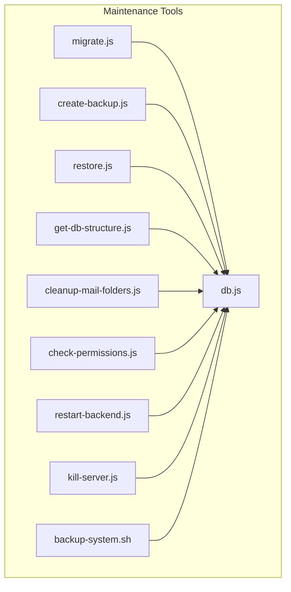

**Diagram sources**
- [migrate.js:1-220](file://backend/migrate.js#L1-L220)
- [db.js:1-68](file://backend/db.js#L1-L68)
- [scripts/create-backup.js:1-92](file://backend/scripts/create-backup.js#L1-L91)
- [scripts/restore.js:1-419](file://backend/scripts/restore.js#L1-L418)
- [scripts/get-db-structure.js:1-272](file://backend/scripts/get-db-structure.js#L1-L271)
- [scripts/cleanup-mail-folders.js:1-87](file://backend/scripts/cleanup-mail-folders.js#L1-L86)
- [scripts/check-permissions.js:1-253](file://backend/scripts/check-permissions.js#L1-L252)
- [scripts/restart-backend.js:1-127](file://backend/scripts/restart-backend.mjs#L1-L127)
- [scripts/kill-server.js:1-46](file://backend/scripts/kill-server.js#L1-L45)
- [scripts/backup-system.sh:1-99](file://scripts/backup-system.sh#L1-L98)

**Section sources**
- [migrate.js:1-220](file://backend/migrate.js#L1-L220)
- [db.js:1-68](file://backend/db.js#L1-L68)
- [scripts/backup-system.sh:1-99](file://scripts/backup-system.sh#L1-L98)

## Core Components
- Migration engine: Applies pending migrations, tracks completion, and supports both .sql and .md formats.
- Database connectivity: Centralized Postgres connection with environment parsing and result normalization.
- Backup/restore: API-driven and direct modes for creating and restoring backups; includes local listing and direct SQL restoration.
- Schema inspection: Generates table/column/index/foreign key details and optional JSON output.
- Cleanup utilities: Mail folder deduplication and consolidation; permission auditing and reset; backend restart/stop helpers.
- System backup: Cross-platform shell script to archive the project excluding unnecessary directories.

**Section sources**
- [migrate.js:134-215](file://backend/migrate.js#L134-L215)
- [db.js:31-67](file://backend/db.js#L31-L67)
- [scripts/create-backup.js:67-91](file://backend/scripts/create-backup.js#L67-L91)
- [scripts/restore.js:167-181](file://backend/scripts/restore.js#L167-L181)
- [scripts/get-db-structure.js:215-264](file://backend/scripts/get-db-structure.js#L215-L264)
- [scripts/cleanup-mail-folders.js:5-84](file://backend/scripts/cleanup-mail-folders.js#L5-L84)
- [scripts/check-permissions.js:142-198](file://backend/scripts/check-permissions.js#L142-L198)
- [scripts/restart-backend.js:108-127](file://backend/scripts/restart-backend.mjs#L108-L127)
- [scripts/kill-server.js:1-46](file://backend/scripts/kill-server.js#L1-L45)
- [scripts/backup-system.sh:49-99](file://scripts/backup-system.sh#L49-L98)

## Architecture Overview
The maintenance architecture centers around the database and a set of maintenance scripts. Migrations are applied against the database through a shared connection utility. Backup/restore scripts communicate with the backend API or operate directly on the filesystem and database.

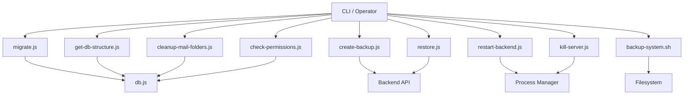

**Diagram sources**
- [migrate.js:1-220](file://backend/migrate.js#L1-L220)
- [db.js:1-68](file://backend/db.js#L1-L68)
- [scripts/create-backup.js:1-92](file://backend/scripts/create-backup.js#L1-L91)
- [scripts/restore.js:1-419](file://backend/scripts/restore.js#L1-L418)
- [scripts/get-db-structure.js:1-272](file://backend/scripts/get-db-structure.js#L1-L271)
- [scripts/cleanup-mail-folders.js:1-87](file://backend/scripts/cleanup-mail-folders.js#L1-L86)
- [scripts/check-permissions.js:1-253](file://backend/scripts/check-permissions.js#L1-L252)
- [scripts/restart-backend.js:1-127](file://backend/scripts/restart-backend.mjs#L1-L127)
- [scripts/kill-server.js:1-46](file://backend/scripts/kill-server.js#L1-L45)
- [scripts/backup-system.sh:1-99](file://scripts/backup-system.sh#L1-L98)

## Detailed Component Analysis

### Migration System
The migration system ensures safe, incremental schema evolution:
- Tracks applied migrations in a dedicated table.
- Supports .sql and .md files; extracts SQL from Markdown code blocks.
- Splits multi-statement SQL safely, handling DO blocks and dollar-quoted blocks.
- Applies only pending migrations and records success.

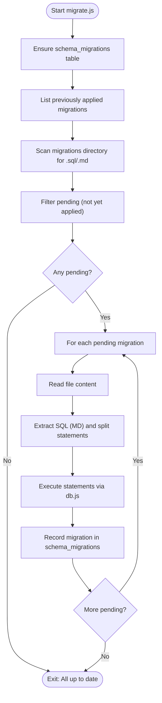

**Diagram sources**
- [migrate.js:91-215](file://backend/migrate.js#L91-L215)
- [db.js:58-67](file://backend/db.js#L58-L67)

**Section sources**
- [migrate.js:1-220](file://backend/migrate.js#L1-L220)
- [migrations/README.md:1-159](file://backend/migrations/README.md#L1-L159)
- [migrations/MANUAL_reset_database.md:1-72](file://backend/migrations/MANUAL_reset_database.md#L1-L72)

### Database Connectivity
The database utility:
- Parses environment variables from a file.
- Validates required variables.
- Creates a connection pool.
- Normalizes result keys from snake_case to camelCase.

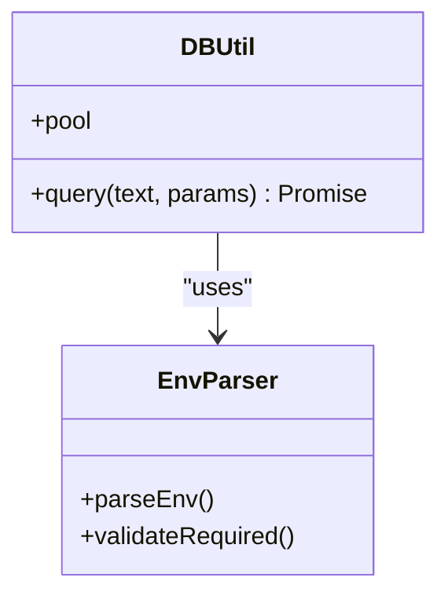

**Diagram sources**
- [db.js:1-68](file://backend/db.js#L1-L68)

**Section sources**
- [db.js:1-68](file://backend/db.js#L1-L68)

### Backup and Restore
Backup creation:
- Sends a request to the backend API to create a backup.
- Prints structured details on success.

Restore:
- Supports API mode and direct mode.
- Lists backups (API or local zip files).
- Provides interactive selection and confirmation.
- Direct mode extracts archive, restores SQL dump, optionally restores project files, and cleans up.

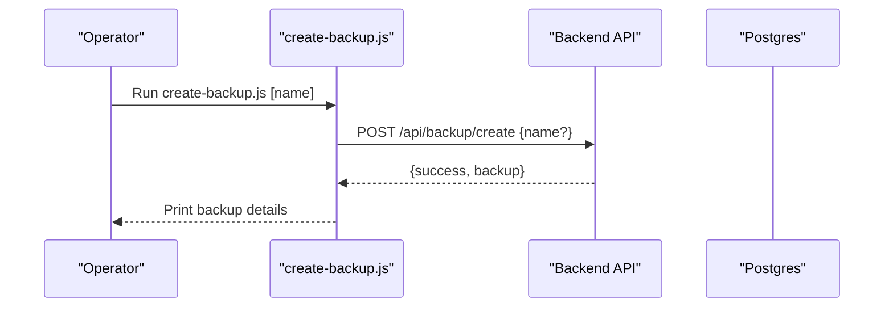

**Diagram sources**
- [scripts/create-backup.js:67-91](file://backend/scripts/create-backup.js#L67-L91)

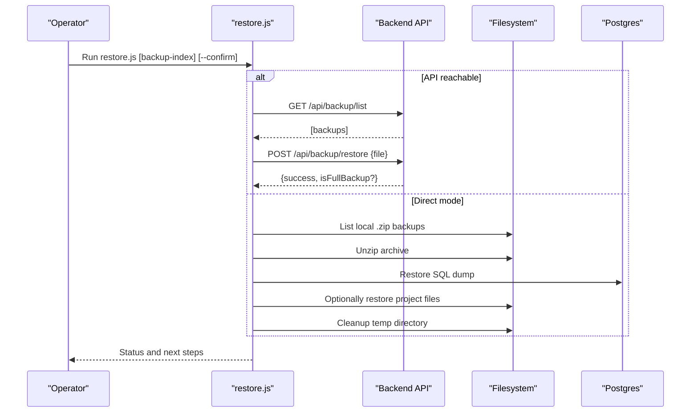

**Diagram sources**
- [scripts/restore.js:167-181](file://backend/scripts/restore.js#L167-L181)
- [scripts/restore.js:218-306](file://backend/scripts/restore.js#L218-L306)

**Section sources**
- [scripts/create-backup.js:1-92](file://backend/scripts/create-backup.js#L1-L91)
- [scripts/restore.js:1-419](file://backend/scripts/restore.js#L1-L418)

### Database Structure Inspection
The structure inspector:
- Filters tables by predefined patterns.
- Retrieves columns, foreign keys, indexes, row counts, and sample data.
- Outputs formatted text or JSON and optionally writes to a file.

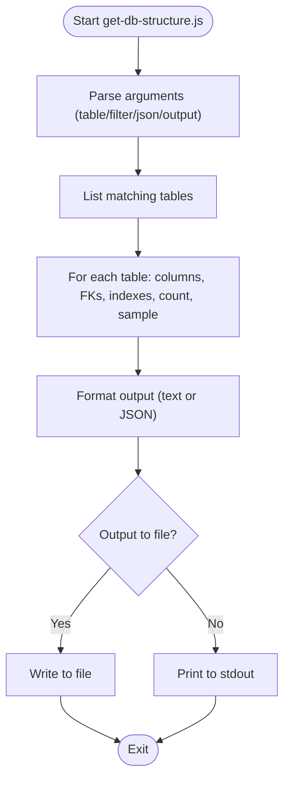

**Diagram sources**
- [scripts/get-db-structure.js:215-264](file://backend/scripts/get-db-structure.js#L215-L264)

**Section sources**
- [scripts/get-db-structure.js:1-272](file://backend/scripts/get-db-structure.js#L1-L271)

### Mail Folder Cleanup
The cleanup utility:
- Enumerates mail accounts and folders.
- Groups folders by canonical type.
- Merges duplicates into a preferred folder, moves emails, updates filters, and deletes duplicates.
- Uses transactions per account.

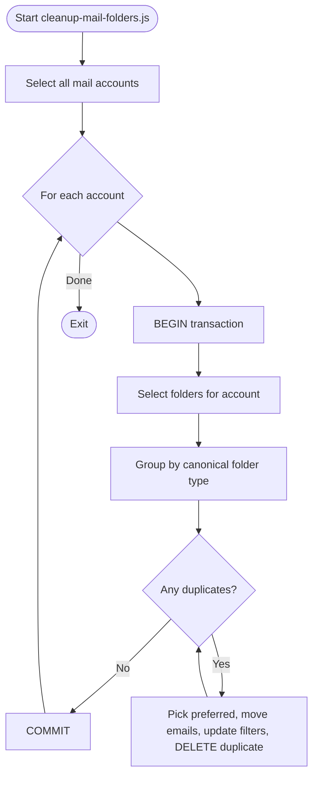

**Diagram sources**
- [scripts/cleanup-mail-folders.js:5-84](file://backend/scripts/cleanup-mail-folders.js#L5-L84)

**Section sources**
- [scripts/cleanup-mail-folders.js:1-87](file://backend/scripts/cleanup-mail-folders.js#L1-L86)

### Permissions Audit and Reset
The permissions utility:
- Audits users, roles, and permissions.
- Optionally resets permissions and roles to defaults, inserting default permissions and seeding role definitions.

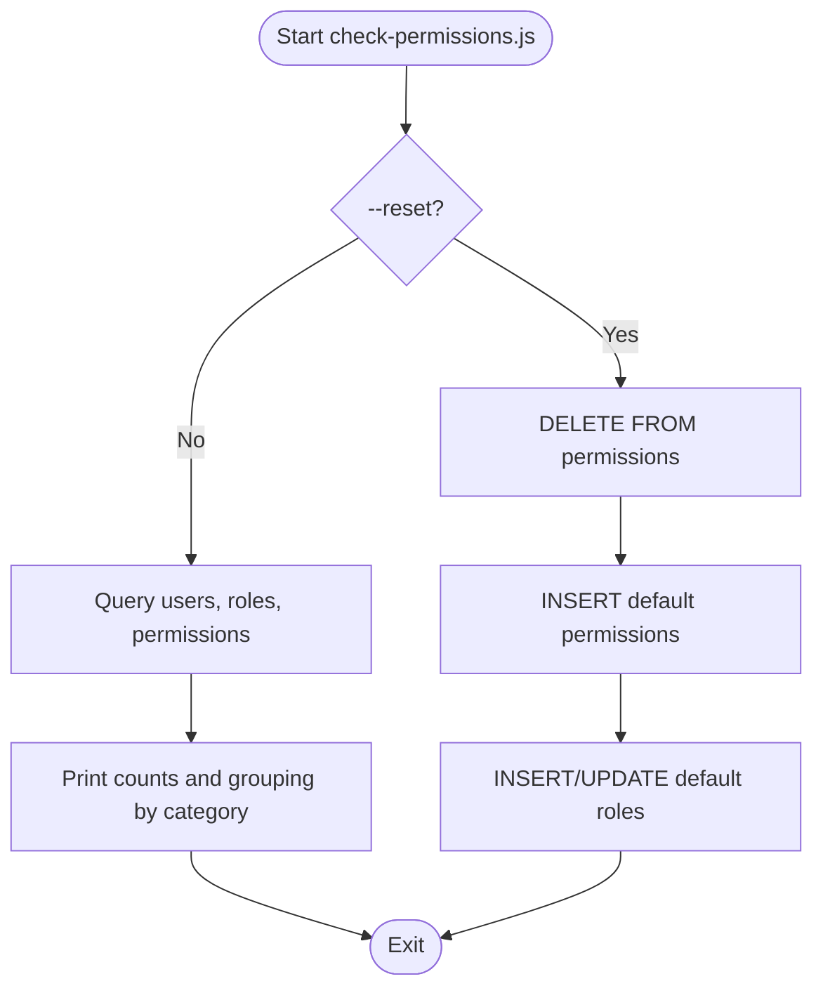

**Diagram sources**
- [scripts/check-permissions.js:142-244](file://backend/scripts/check-permissions.js#L142-L244)

**Section sources**
- [scripts/check-permissions.js:1-253](file://backend/scripts/check-permissions.js#L1-L252)

### Backend Restart and Stop Utilities
- Restart utility: Finds and kills processes on a specific port, then starts the dev server with nodemon.
- Kill utility: Cross-platform stop for backend processes.

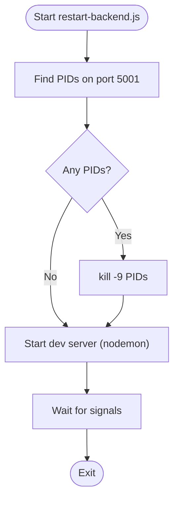

**Diagram sources**
- [scripts/restart-backend.js:22-105](file://backend/scripts/restart-backend.mjs#L22-L105)

**Section sources**
- [scripts/restart-backend.js:1-127](file://backend/scripts/restart-backend.mjs#L1-L127)
- [scripts/kill-server.js:1-46](file://backend/scripts/kill-server.js#L1-L45)

### System-Level Backup Script
The shell script:
- Creates a timestamped backup directory.
- Excludes .git, local-backups, OS artifacts, and optionally node_modules.
- Packs the directory into a tar.gz archive and optionally keeps the folder.

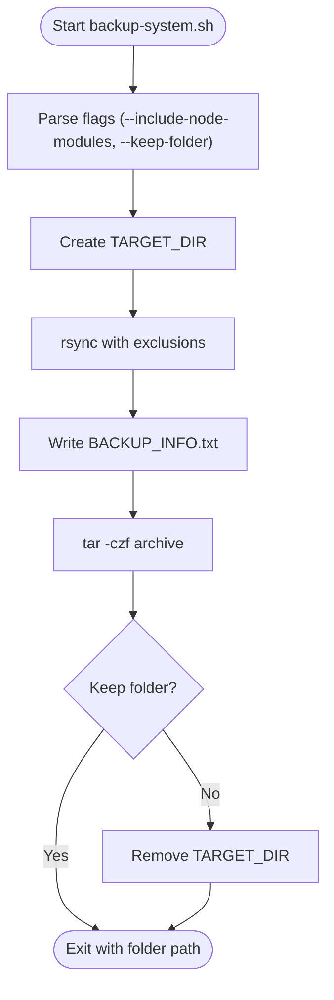

**Diagram sources**
- [scripts/backup-system.sh:49-99](file://scripts/backup-system.sh#L49-L98)

**Section sources**
- [scripts/backup-system.sh:1-99](file://scripts/backup-system.sh#L1-L98)
- [backend/config/README.md:1-9](file://backend/config/README.md#L1-L8)

## Dependency Analysis
- Migration engine depends on the database utility for queries and on migration files for SQL.
- Backup/restore scripts depend on the database utility and the backend API.
- Structure inspector and cleanup utilities depend on the database utility.
- Permission utility depends on the database utility.
- Restart/kill utilities depend on the operating system process manager.
- System backup script depends on rsync and tar.

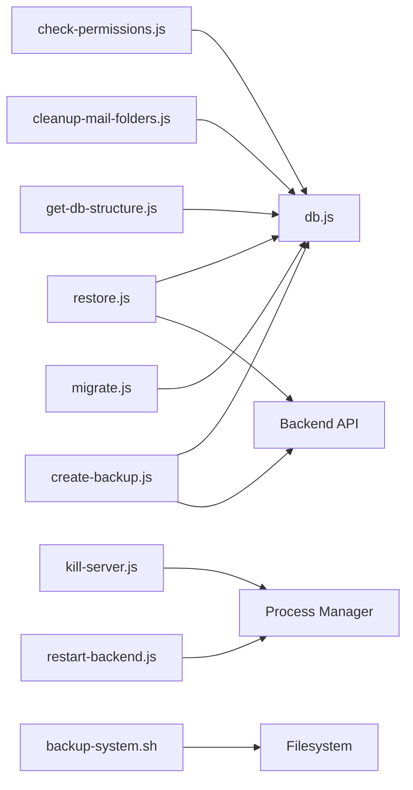

**Diagram sources**
- [migrate.js:1-220](file://backend/migrate.js#L1-L220)
- [db.js:1-68](file://backend/db.js#L1-L68)
- [scripts/create-backup.js:1-92](file://backend/scripts/create-backup.js#L1-L91)
- [scripts/restore.js:1-419](file://backend/scripts/restore.js#L1-L418)
- [scripts/get-db-structure.js:1-272](file://backend/scripts/get-db-structure.js#L1-L271)
- [scripts/cleanup-mail-folders.js:1-87](file://backend/scripts/cleanup-mail-folders.js#L1-L86)
- [scripts/check-permissions.js:1-253](file://backend/scripts/check-permissions.js#L1-L252)
- [scripts/restart-backend.js:1-127](file://backend/scripts/restart-backend.mjs#L1-L127)
- [scripts/kill-server.js:1-46](file://backend/scripts/kill-server.js#L1-L45)
- [scripts/backup-system.sh:1-99](file://scripts/backup-system.sh#L1-L98)

**Section sources**
- [migrate.js:1-220](file://backend/migrate.js#L1-L220)
- [db.js:1-68](file://backend/db.js#L1-L68)
- [scripts/restore.js:1-419](file://backend/scripts/restore.js#L1-L418)

## Performance Considerations
- Index management: Use the schema inspection tool to review indexes and identify missing or redundant indexes. Create appropriate indexes for frequent join/filter columns.
- Statistics: Keep table statistics updated to support efficient query planning.
- Query optimization: Use the structure inspector to understand table sizes and cardinalities; rewrite slow queries and add targeted indexes.
- Resource allocation: Adjust database connection pool size and timeouts in the database utility as needed.
- Cleanup: Regularly run mail folder cleanup to reduce duplication and maintain manageable folder sets.

[No sources needed since this section provides general guidance]

## Troubleshooting Guide
Common maintenance issues and resolutions:
- Migration failures: Review the migration log for the failing statement, fix the SQL, and rerun the migration. The system does not record partial migrations.
- Backup/restore errors: Verify API availability or switch to direct mode; ensure sufficient disk space; confirm database credentials; check archive integrity.
- Permission inconsistencies: Use the permissions checker to audit and the reset option to restore defaults.
- Stuck backend processes: Use the kill utility to terminate backend processes, then restart with the restart utility.
- Disk pressure: Use the system backup script to offload archives; run mail folder cleanup to consolidate storage.

**Section sources**
- [migrate.js:205-211](file://backend/migrate.js#L205-L211)
- [scripts/restore.js:378-410](file://backend/scripts/restore.js#L378-L410)
- [scripts/check-permissions.js:203-244](file://backend/scripts/check-permissions.js#L203-L244)
- [scripts/kill-server.js:1-46](file://backend/scripts/kill-server.js#L1-L45)
- [scripts/restart-backend.js:108-127](file://backend/scripts/restart-backend.mjs#L108-L127)
- [scripts/backup-system.sh:49-99](file://scripts/backup-system.sh#L49-L98)

## Conclusion
Titan CRM’s maintenance toolkit provides robust mechanisms for schema evolution, backup/restore, database introspection, cleanup, and operational control. By following the documented procedures and integrating regular health checks and preventive maintenance, operators can keep the system reliable, secure, and performant.

[No sources needed since this section summarizes without analyzing specific files]

## Appendices

### Maintenance Windows Planning
- Schedule migrations during low-traffic periods; verify preconditions (backup, permissions).
- Plan backup windows to minimize impact; automate backups and verify retention.
- Perform cleanup tasks (mail folders, logs) weekly/monthly depending on growth rates.
- Conduct periodic schema reviews and index audits.

[No sources needed since this section provides general guidance]

### Preventive Maintenance Schedule
- Daily: Monitor logs, verify backups, check mail sync.
- Weekly: Run schema inspection, cleanup utilities, and security scans.
- Monthly: Review migration history, update dependencies, reindex major tables.
- Quarterly: Audit permissions, rotate secrets, validate disaster recovery procedures.

[No sources needed since this section provides general guidance]