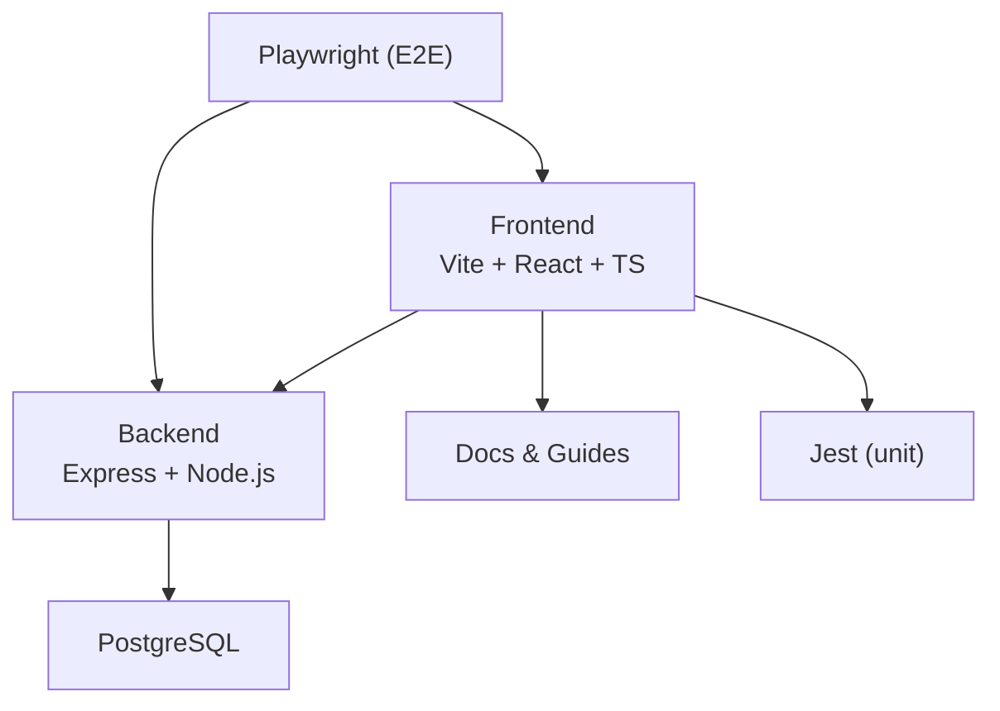
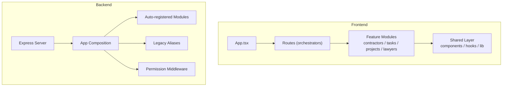
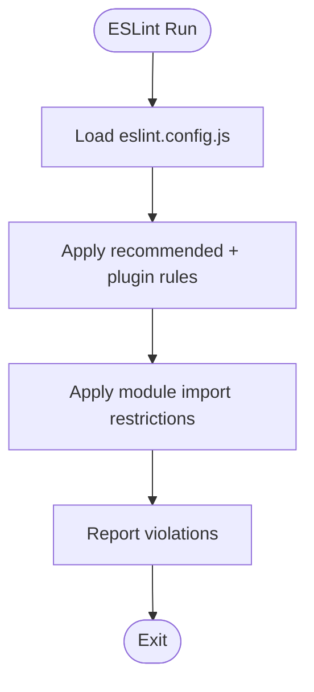
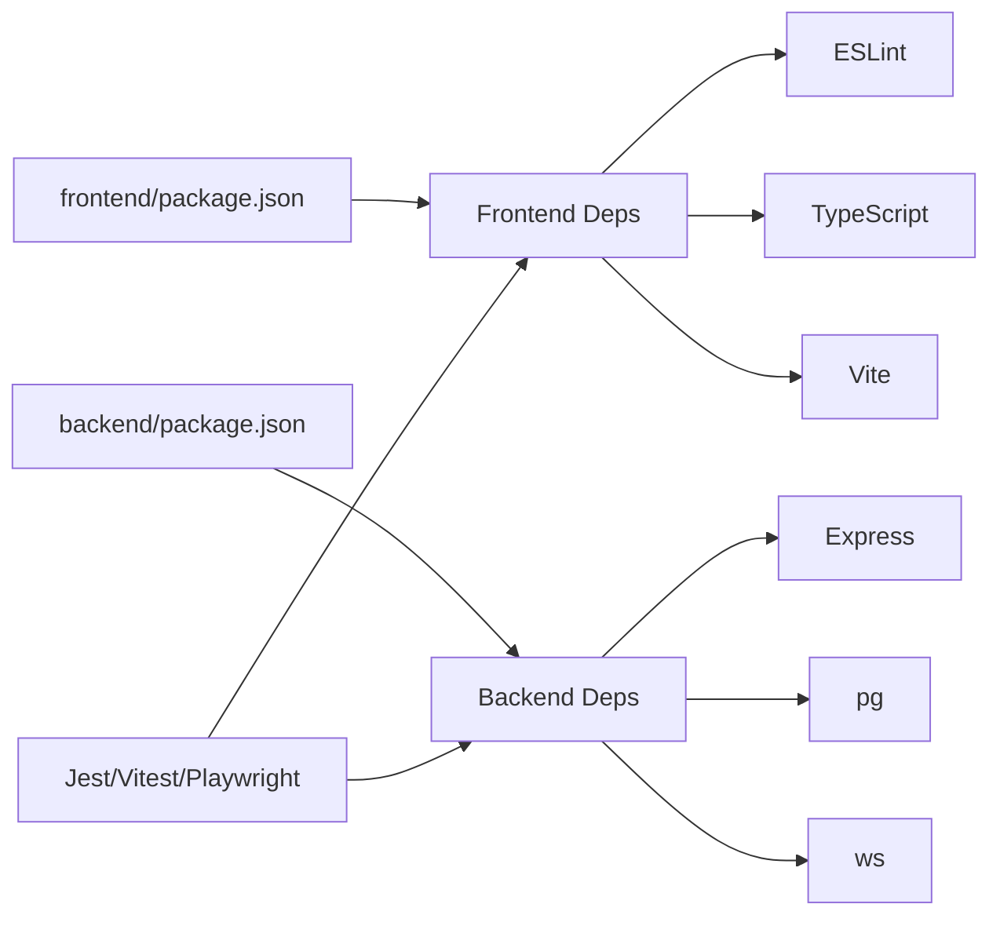

# Development Guidelines

<cite>
**Referenced Files in This Document**
- [package.json](file://frontend/package.json)
- [eslint.config.js](file://frontend/eslint.config.js)
- [tsconfig.json](file://frontend/tsconfig.json)
- [vite.config.ts](file://frontend/vite.config.ts)
- [tailwind.config.ts](file://frontend/tailwind.config.ts)
- [jest.config.ts](file://config/jest.config.ts)
- [playwright.config.ts](file://config/playwright.config.ts)
- [setupTests.ts](file://config/setupTests.ts)
- [index.js](file://backend/index.js)
- [appComposition.js](file://backend/utils/appComposition.js)
- [package.json](file://backend/package.json)
- [DEVELOPMENT_RULES.md](file://docs/DEVELOPMENT_RULES.md)
- [ARCHITECTURE.md](file://docs/ARCHITECTURE.md)
- [PERMISSIONS_SYSTEM.md](file://docs/PERMISSIONS_SYSTEM.md)
- [WORKFLOW_TABLES_REFERENCE.md](file://docs/WORKFLOW_TABLES_REFERENCE.md)
- [API_LIGHT_MODE_EXAMPLES.md](file://docs/API_LIGHT_MODE_EXAMPLES.md)
</cite>

## Table of Contents
1. [Introduction](#introduction)
2. [Project Structure](#project-structure)
3. [Core Components](#core-components)
4. [Architecture Overview](#architecture-overview)
5. [Detailed Component Analysis](#detailed-component-analysis)
6. [Dependency Analysis](#dependency-analysis)
7. [Performance Considerations](#performance-considerations)
8. [Troubleshooting Guide](#troubleshooting-guide)
9. [Conclusion](#conclusion)
10. [Appendices](#appendices)

## Introduction
This document defines comprehensive development guidelines for Titan CRM, covering frontend and backend standards, tooling, testing, branching and commit conventions, pull request processes, and operational workflows. It consolidates existing project practices and provides templates and references to ensure consistent, maintainable, and high-quality development across JavaScript/TypeScript, React components, and Node.js services.

## Project Structure
Titan CRM follows a modular, dual-package structure:
- Frontend: Vite + React + TypeScript with Tailwind CSS, organized under frontend/.
- Backend: Express-based Node.js service under backend/, with modular route registration and dynamic module initialization via appComposition.js.
- Shared tooling: Jest for unit tests, Playwright for E2E, ESLint for linting, and Vite for dev/build.

**Section sources**
- [package.json:1-118](file://frontend/package.json#L1-L118)
- [package.json:1-81](file://backend/package.json#L1-L81)
- [index.js:1-40](file://backend/index.js#L1-L39)
- [appComposition.js:1-125](file://backend/utils/appComposition.js#L1-L125)
- [playwright.config.ts:1-48](file://config/playwright.config.ts#L1-L48)

## Core Components
- Frontend toolchain: Vite dev server, React Refresh, TypeScript compiler, ESLint, Tailwind CSS, Vitest/Jest for testing, and Playwright for E2E.
- Backend toolchain: Express server, startup preflight checks, modular routing via appComposition, middleware, and script-driven operations (migrations, seeding, backups).
- Shared development rules: i18n enforcement, JSDoc requirements, TypeScript strictness, and module boundary policies.

**Section sources**
- [package.json:6-22](file://frontend/package.json#L6-L22)
- [eslint.config.js:1-139](file://frontend/eslint.config.js#L1-L138)
- [tsconfig.json:1-40](file://frontend/tsconfig.json#L1-L40)
- [vite.config.ts:1-113](file://frontend/vite.config.ts#L1-L112)
- [tailwind.config.ts:1-112](file://frontend/tailwind.config.ts#L1-L111)
- [jest.config.ts:1-41](file://config/jest.config.ts#L1-L41)
- [playwright.config.ts:1-48](file://config/playwright.config.ts#L1-L48)
- [setupTests.ts:1-1](file://config/setupTests.ts#L1)
- [index.js:1-40](file://backend/index.js#L1-L39)
- [appComposition.js:1-125](file://backend/utils/appComposition.js#L1-L125)
- [package.json:5-35](file://backend/package.json#L5-L35)

## Architecture Overview
The system enforces module boundaries and safe orchestration:
- Feature modules under frontend/src/modules are independent and must not import each other directly.
- Cross-feature UI composition is centralized in app-level routes.
- Backend auto-registers module routers via moduleSettingsLoader and maintains legacy aliases in routeRegistry for backward compatibility.
- Permissions are enforced via constants, middleware, and UI guards.

**Diagram sources**
- [ARCHITECTURE.md:1-171](file://docs/ARCHITECTURE.md#L1-L171)
- [appComposition.js:1-125](file://backend/utils/appComposition.js#L1-L125)
- [PERMISSIONS_SYSTEM.md:126-147](file://docs/PERMISSIONS_SYSTEM.md#L126-L147)

**Section sources**
- [ARCHITECTURE.md:1-171](file://docs/ARCHITECTURE.md#L1-L171)
- [appComposition.js:1-125](file://backend/utils/appComposition.js#L1-L125)
- [PERMISSIONS_SYSTEM.md:126-147](file://docs/PERMISSIONS_SYSTEM.md#L126-L147)

## Detailed Component Analysis

### Coding Standards and Linting (ESLint)
- Recommended rules include TypeScript ESLint, React Hooks, and React Refresh plugins.
- Project-specific restrictions:
  - No direct imports among feature modules (contractors/tasks/projects/lawyers).
  - No deep-imports from module pages in App and routes.
- Disabled or downgraded rules:
  - Unused vars, explicit any, empty object type, unused expressions, and useless escape warnings are configured per project policy.

**Diagram sources**
- [eslint.config.js:1-139](file://frontend/eslint.config.js#L1-L138)

**Section sources**
- [eslint.config.js:10-30](file://frontend/eslint.config.js#L10-L30)
- [eslint.config.js:32-54](file://frontend/eslint.config.js#L32-L54)
- [eslint.config.js:55-76](file://frontend/eslint.config.js#L55-L76)
- [eslint.config.js:77-98](file://frontend/eslint.config.js#L77-L98)
- [eslint.config.js:99-120](file://frontend/eslint.config.js#L99-L120)
- [eslint.config.js:121-138](file://frontend/eslint.config.js#L121-L138)

### Formatting and Style (Prettier)
- The repository does not include a Prettier configuration file. Formatting is primarily enforced by ESLint rules and Tailwind usage.
- Recommendation: Introduce a Prettier config aligned with existing ESLint rules to prevent conflicts and ensure consistent formatting across contributors.

[No sources needed since this section provides general guidance]

### TypeScript Configuration
- Target ES2022, JSX with React, bundler module resolution, allow importing TS extensions, and path aliases (@/*).
- Jest uses ts-jest with a separate tsconfig for tests.

**Section sources**
- [tsconfig.json:1-40](file://frontend/tsconfig.json#L1-L40)
- [jest.config.ts:14-21](file://config/jest.config.ts#L14-L21)

### Frontend Build and Dev Server (Vite)
- Dev server runs on port 3001, proxies /api and /ws to backend, supports HMR, and defines global aliases.
- Build optimization groups vendor and UI libraries into dedicated chunks.

**Section sources**
- [vite.config.ts:9-52](file://frontend/vite.config.ts#L9-L52)
- [vite.config.ts:67-110](file://frontend/vite.config.ts#L67-L110)

### Styling (Tailwind CSS)
- Dark mode enabled, extensive color palette, animations, and responsive containers.
- Content paths include pages, components, app, and src.

**Section sources**
- [tailwind.config.ts:1-112](file://frontend/tailwind.config.ts#L1-L111)

### Testing Frameworks
- Unit tests: Vitest with Jest preset and DOM environment; Jest config for frontend tests.
- E2E tests: Playwright configured to run against the frontend dev server, with HTML and list reporters and GitHub reporter in CI.

**Section sources**
- [jest.config.ts:1-41](file://config/jest.config.ts#L1-L41)
- [playwright.config.ts:1-48](file://config/playwright.config.ts#L1-L48)

### Backend Server and Routing
- Environment validation for DB and server variables via startupPreflight.
- Centralized request logging and error handling in appComposition.
- Modular router registration via moduleSettingsLoader and legacy aliases in routeRegistry.
- WebSocket initialization, cache cleaner, and scheduler initialization in startupServices.

**Section sources**
- [index.js:1-40](file://backend/index.js#L1-L39)
- [appComposition.js:1-125](file://backend/utils/appComposition.js#L1-L125)
- [startupServices.js:1-50](file://backend/utils/startupServices.js#L1-L50)

### Permissions System
- Centralized permissions constants, translations, UI guards (Can/Cannot/usePermission), and server-side middleware.
- Admin role and wildcard permissions bypass checks.

**Section sources**
- [PERMISSIONS_SYSTEM.md:1-378](file://docs/PERMISSIONS_SYSTEM.md#L1-L377)

### Module Boundaries and Orchestration
- Enforced by ESLint rules and documented in ARCHITECTURE.md.
- Cross-feature UI composed in routes; modules expose public entry points via index.ts.

**Section sources**
- [ARCHITECTURE.md:1-171](file://docs/ARCHITECTURE.md#L1-L171)

### Development Rules and Quality Gates
- Mandatory JSDoc for exports, i18n keys only, strict TypeScript typing, and end-to-end verification for entity field changes.
- Pre-merge checklist includes field checks, TS compile, JSDoc presence, i18n validation, and lint clean.

**Section sources**
- [DEVELOPMENT_RULES.md:1-258](file://docs/DEVELOPMENT_RULES.md#L1-L258)

### API Usage Examples and Troubleshooting
- Light mode attachment API examples for frontend and backend, cURL usage, health checks, and troubleshooting steps.

**Section sources**
- [API_LIGHT_MODE_EXAMPLES.md:1-459](file://docs/API_LIGHT_MODE_EXAMPLES.md#L1-L458)

## Dependency Analysis
- Frontend depends on React ecosystem, Radix UI, TanStack Query, Tailwind, and Vite tooling.
- Backend depends on Express, PostgreSQL driver, JWT, Nodemailer, WS, and cron jobs.
- Tests depend on Jest, Vitest, Supertest, and Playwright.

**Diagram sources**
- [package.json:23-91](file://frontend/package.json#L23-L91)
- [package.json:36-59](file://backend/package.json#L36-L59)
- [jest.config.ts:1-41](file://config/jest.config.ts#L1-L41)
- [playwright.config.ts:1-48](file://config/playwright.config.ts#L1-L48)

**Section sources**
- [package.json:23-91](file://frontend/package.json#L23-L91)
- [package.json:36-59](file://backend/package.json#L36-L59)
- [jest.config.ts:1-41](file://config/jest.config.ts#L1-L41)
- [playwright.config.ts:1-48](file://config/playwright.config.ts#L1-L48)

## Performance Considerations
- Frontend build optimization: manualChunks for vendor, query, charts, icons, forms, and radix packages.
- Chunk size warning threshold increased to reduce noise for large bundles.
- Backend request logging and error handling help identify slow endpoints and failures.
- Light mode attachment caching reduces repeated IMAP fetch overhead.

**Section sources**
- [vite.config.ts:67-110](file://frontend/vite.config.ts#L67-L110)
- [appComposition.js:101-125](file://backend/utils/appComposition.js#L101-L125)
- [API_LIGHT_MODE_EXAMPLES.md:371-430](file://docs/API_LIGHT_MODE_EXAMPLES.md#L371-L430)

## Troubleshooting Guide
Common issues and remedies:
- Missing environment variables on backend startup cause immediate exit via startupPreflight; ensure .env is present and complete.
- Database connection failures during pre-flight halt the server; verify credentials and connectivity.
- Permission denials: confirm middleware is attached and x-user-id header is present.
- Module boundary violations: resolve ESLint errors by moving cross-feature UI into routes or using shared contracts.
- i18n hardcoding: replace Russian strings with translation keys and run i18n scanning.
- E2E flakiness: adjust retries and traces; ensure frontend dev server is reachable at configured base URL.

**Section sources**
- [index.js:1-40](file://backend/index.js#L1-L39)
- [startupPreflight.js:1-50](file://backend/utils/startupPreflight.js#L1-L24)
- [PERMISSIONS_SYSTEM.md:357-367](file://docs/PERMISSIONS_SYSTEM.md#L357-L367)
- [ARCHITECTURE.md:147-158](file://docs/ARCHITECTURE.md#L147-L158)
- [DEVELOPMENT_RULES.md:58-137](file://docs/DEVELOPMENT_RULES.md#L58-L137)
- [playwright.config.ts:13-27](file://config/playwright.config.ts#L13-L27)

## Conclusion
These guidelines consolidate Titan CRM’s development practices, ensuring consistent code quality, robust architecture, and reliable operations. By adhering to module boundaries, TypeScript strictness, i18n discipline, and comprehensive testing, contributors can deliver maintainable features efficiently.

## Appendices

### A. Branching Strategy and Commit Conventions
- Branch naming: feature/short-description, fix/issue, hotfix/urgent-fix, chore/maintenance.
- Commit messages: present tense imperative, concise subject, optional body with rationale and links to issues.
- Merge strategy: squash and merge for feature branches; rebase for hotfixes; ensure PRs pass all checks.

[No sources needed since this section provides general guidance]

### B. Pull Request Guidelines
- Title and description: summarize changes, link related issues, and outline testing performed.
- Review checklist: module boundary compliance, TypeScript checks, lint clean, i18n completeness, permissions coverage, and E2E scenarios.

[No sources needed since this section provides general guidance]

### C. Local Setup and Development Workflow
- Backend:
  - Install dependencies, configure .env, run migrations, seed data, and start dev server.
- Frontend:
  - Install dependencies, configure .env, start dev server, and connect to backend via proxy.
- Testing:
  - Run unit tests with Vitest/Jest, E2E with Playwright, and lint with ESLint.

**Section sources**
- [package.json:5-35](file://backend/package.json#L5-L35)
- [index.js:1-40](file://backend/index.js#L1-L39)
- [package.json:6-22](file://frontend/package.json#L6-L22)
- [vite.config.ts:26-48](file://frontend/vite.config.ts#L26-L48)
- [jest.config.ts:1-41](file://config/jest.config.ts#L1-L41)
- [playwright.config.ts:1-48](file://config/playwright.config.ts#L1-L48)

### D. Adding New Modules and Extending Functionality
- Frontend:
  - Create module under src/modules/<module>, export public API via index.ts, keep internal imports private, and add to registry manifests.
  - Respect module boundaries; move cross-feature UI to routes.
- Backend:
  - Add routes and controllers under modules/<module>, ensure middleware protection, and register module routers via database configuration.
  - Maintain legacy aliases in routeRegistry for backward compatibility.

**Section sources**
- [ARCHITECTURE.md:42-88](file://docs/ARCHITECTURE.md#L42-L88)
- [appComposition.js:1-125](file://backend/utils/appComposition.js#L1-L125)

### E. Templates and Boilerplate References
- Component template with i18n and JSDoc: see examples in development rules.
- Permission guard usage: Can/Cannot/usePermission patterns.
- Workflow step references: document attachment lifecycle and SQL mappings.

**Section sources**
- [DEVELOPMENT_RULES.md:185-224](file://docs/DEVELOPMENT_RULES.md#L185-L224)
- [PERMISSIONS_SYSTEM.md:61-114](file://docs/PERMISSIONS_SYSTEM.md#L61-L114)
- [WORKFLOW_TABLES_REFERENCE.md:1-227](file://docs/WORKFLOW_TABLES_REFERENCE.md#L1-L226)