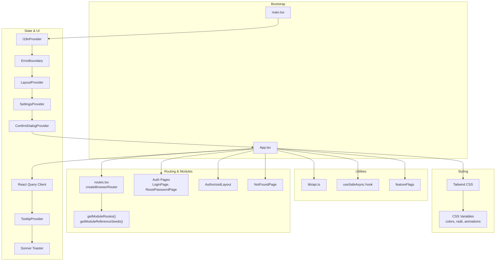
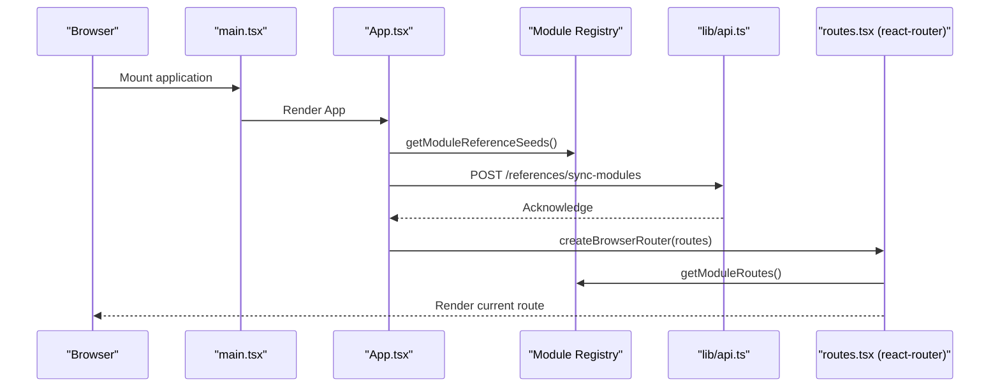
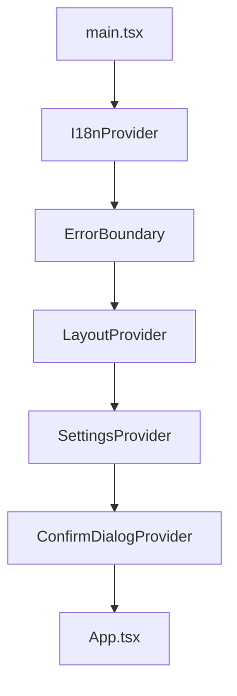
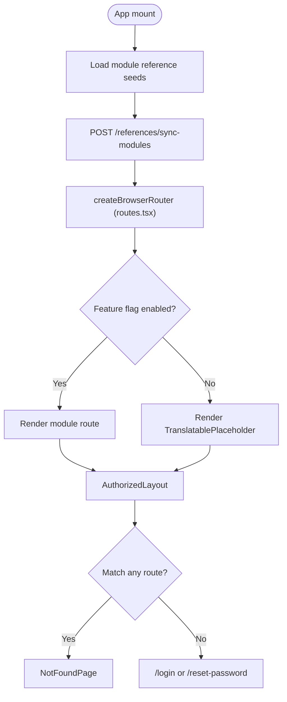
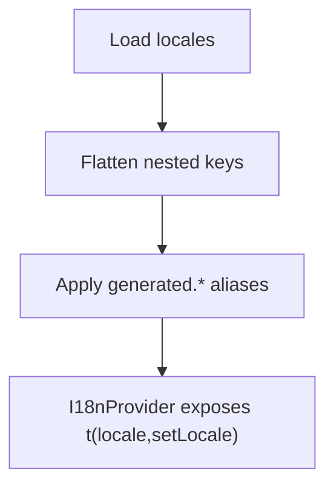
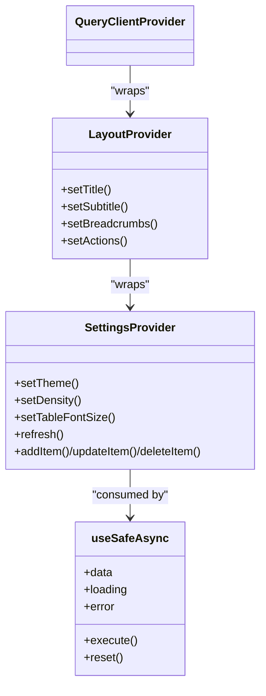
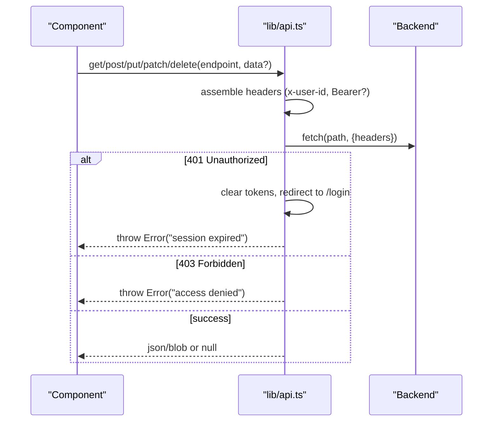
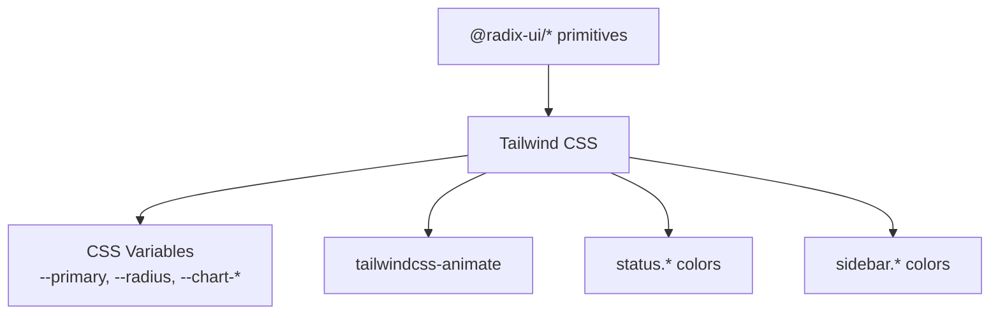
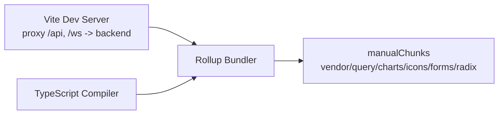

# Frontend System

<cite>
**Referenced Files in This Document**
- [package.json](file://frontend/package.json)
- [vite.config.ts](file://frontend/vite.config.ts)
- [main.tsx](file://frontend/src/main.tsx)
- [App.tsx](file://frontend/src/App.tsx)
- [routes.tsx](file://frontend/src/routes.tsx)
- [tailwind.config.ts](file://frontend/tailwind.config.ts)
- [tsconfig.json](file://frontend/tsconfig.json)
- [modules/index.ts](file://frontend/src/modules/index.ts)
- [lib/i18n/index.tsx](file://frontend/src/lib/i18n/index.tsx)
- [context/LayoutContext.tsx](file://frontend/src/context/LayoutContext.tsx)
- [context/SettingsContext.tsx](file://frontend/src/context/SettingsContext.tsx)
- [hooks/useSafeAsync.ts](file://frontend/src/hooks/useSafeAsync.ts)
- [lib/api.ts](file://frontend/src/lib/api.ts)
</cite>

## Table of Contents
1. [Introduction](#introduction)
2. [Project Structure](#project-structure)
3. [Core Components](#core-components)
4. [Architecture Overview](#architecture-overview)
5. [Detailed Component Analysis](#detailed-component-analysis)
6. [Dependency Analysis](#dependency-analysis)
7. [Performance Considerations](#performance-considerations)
8. [Troubleshooting Guide](#troubleshooting-guide)
9. [Conclusion](#conclusion)
10. [Appendices](#appendices)

## Introduction
This document describes the frontend system powering Titan CRM. It covers the React 18.3.1 application built with Vite, the module registry and dynamic routing system, the component library based on Radix UI and Tailwind CSS, state management patterns using React Query and custom hooks, internationalization, build configuration, development workflow, and deployment considerations. It also highlights performance optimization, accessibility, and responsive design practices used across the application.

## Project Structure
The frontend is organized around a modular architecture with a central App shell that dynamically loads module routes and reference data. Key areas:
- Application bootstrap and providers in main.tsx
- Provider wiring and module reference sync in App.tsx
- Routing definition in routes.tsx (createBrowserRouter)
- Build configuration via Vite and TypeScript
- Design system and styling via Tailwind CSS
- Internationalization and contexts for layout and settings
- API abstraction and safe async utilities

**Diagram sources**
- [main.tsx:1-26](file://frontend/src/main.tsx#L1-L26)
- [App.tsx:1-31](file://frontend/src/App.tsx#L1-L31)
- [routes.tsx:1-49](file://frontend/src/routes.tsx#L1-L49)
- [vite.config.ts:1-112](file://frontend/vite.config.ts#L1-L112)
- [tailwind.config.ts:1-111](file://frontend/tailwind.config.ts#L1-L111)
- [lib/api.ts:1-209](file://frontend/src/lib/api.ts#L1-L209)
- [hooks/useSafeAsync.ts:1-69](file://frontend/src/hooks/useSafeAsync.ts#L1-L69)

**Section sources**
- [main.tsx:1-26](file://frontend/src/main.tsx#L1-L26)
- [App.tsx:1-31](file://frontend/src/App.tsx#L1-L31)
- [routes.tsx:1-49](file://frontend/src/routes.tsx#L1-L49)
- [vite.config.ts:1-112](file://frontend/vite.config.ts#L1-L112)
- [tailwind.config.ts:1-111](file://frontend/tailwind.config.ts#L1-L111)
- [tsconfig.json:1-40](file://frontend/tsconfig.json#L1-L40)

## Core Components
- Application shell and provider chain: The root creates the React root, wires providers for i18n, error boundary, layout, settings, and confirm dialogs, and mounts App.
- Routing: routes.tsx declares a `createBrowserRouter` with public auth pages, a protected `AuthorizedLayout`, and dynamic module routes gated by feature flags with placeholder fallbacks.
- Module registry: App initializes module reference seeds and posts them to the backend, while module routes are resolved by the registry and gated by feature flags.
- State management: React Query client is created once and provided globally; layout and settings are managed via dedicated contexts.
- Internationalization: A lightweight i18n provider flattens translation namespaces and supports interpolation and legacy aliases.
- API layer: A typed wrapper around fetch handles auth headers, redirects on 401, and normalizes responses.
- Utilities: A safe async hook wraps async operations with loading/error/data state and defensive checks.

**Section sources**
- [main.tsx:1-26](file://frontend/src/main.tsx#L1-L26)
- [App.tsx:1-31](file://frontend/src/App.tsx#L1-L31)
- [routes.tsx:1-49](file://frontend/src/routes.tsx#L1-L49)
- [lib/i18n/index.tsx:1-125](file://frontend/src/lib/i18n/index.tsx#L1-L125)
- [context/LayoutContext.tsx:1-97](file://frontend/src/context/LayoutContext.tsx#L1-L97)
- [context/SettingsContext.tsx:1-312](file://frontend/src/context/SettingsContext.tsx#L1-L312)
- [lib/api.ts:1-209](file://frontend/src/lib/api.ts#L1-L209)
- [hooks/useSafeAsync.ts:1-69](file://frontend/src/hooks/useSafeAsync.ts#L1-L69)

## Architecture Overview
The frontend uses a modular routing pattern where module routes and reference seeds are loaded at startup. The router is built with `createBrowserRouter` and rendered via `RouterProvider`; feature flags gate visibility of module routes. Providers encapsulate cross-cutting concerns (internationalization, layout, settings, error handling). Styling leverages Tailwind with CSS variables for themes and densities. Build-time chunk splitting groups libraries for optimal caching.

**Diagram sources**
- [main.tsx:1-26](file://frontend/src/main.tsx#L1-L26)
- [App.tsx:14-19](file://frontend/src/App.tsx#L14-L19)
- [routes.tsx:28-49](file://frontend/src/routes.tsx#L28-L49)
- [lib/api.ts:31-209](file://frontend/src/lib/api.ts#L31-L209)

**Section sources**
- [App.tsx:1-31](file://frontend/src/App.tsx#L1-L31)
- [routes.tsx:1-49](file://frontend/src/routes.tsx#L1-L49)
- [modules/index.ts:1-1](file://frontend/src/modules/index.ts#L1)

## Detailed Component Analysis

### Provider Chain and Bootstrapping
The provider chain establishes global behavior:
- Error boundary for graceful error handling
- Layout provider for page metadata and breadcrumbs
- Settings provider for theme, density, fonts, and reference data
- Confirm dialog provider for consistent confirmations
- I18n provider for translations
- React Query provider for caching and background updates
- Tooltip provider for UI tooltips
- Sonner for toast notifications

**Diagram sources**
- [main.tsx:14-25](file://frontend/src/main.tsx#L14-L25)

**Section sources**
- [main.tsx:1-26](file://frontend/src/main.tsx#L1-L26)

### Routing and Dynamic Module Loading
- The router is created in routes.tsx via `createBrowserRouter` and rendered through `RouterProvider` in App.tsx.
- Public auth routes (`/login`, `/reset-password`) are declared separately and are not protected.
- The root route (`/`) renders an `AuthorizedLayout` with an `errorElement` fallback; its children are dynamic module routes produced by `getDynamicModuleRoutes()`.
- Each module route is gated by a feature flag: if enabled, the module page is rendered; otherwise a `TranslatablePlaceholder` page (using the module title key) is shown.
- A catch-all route (`*`) renders the not-found page.
- On mount, App.tsx syncs module reference seeds to the backend via `POST /references/sync-modules`.

**Diagram sources**
- [routes.tsx:18-49](file://frontend/src/routes.tsx#L18-L49)
- [App.tsx:14-19](file://frontend/src/App.tsx#L14-L19)

**Section sources**
- [routes.tsx:1-49](file://frontend/src/routes.tsx#L1-L49)
- [App.tsx:1-31](file://frontend/src/App.tsx#L1-L31)

### Internationalization System
- Translations are flattened from nested namespaces, with special handling for container modules and legacy aliases.
- Interpolation supports positional and named parameters.
- The provider exposes a t function and locale state.

**Diagram sources**
- [lib/i18n/index.tsx:12-83](file://frontend/src/lib/i18n/index.tsx#L12-L83)

**Section sources**
- [lib/i18n/index.tsx:1-125](file://frontend/src/lib/i18n/index.tsx#L1-L125)

### State Management Patterns
- Global React Query client is created once and provided at the root.
- Layout state (title, breadcrumbs, actions) is centralized via a dedicated context.
- Settings state (theme, density, fonts, reference lists) is centralized via a settings context with persistence and API synchronization.
- A safe async hook encapsulates async operations with defensive checks and reset semantics.

**Diagram sources**
- [App.tsx:5-7](file://frontend/src/App.tsx#L5-L7)
- [context/LayoutContext.tsx:25-45](file://frontend/src/context/LayoutContext.tsx#L25-L45)
- [context/SettingsContext.tsx:83-299](file://frontend/src/context/SettingsContext.tsx#L83-L299)
- [hooks/useSafeAsync.ts:15-58](file://frontend/src/hooks/useSafeAsync.ts#L15-L58)

**Section sources**
- [App.tsx:5-7](file://frontend/src/App.tsx#L5-L7)
- [context/LayoutContext.tsx:1-97](file://frontend/src/context/LayoutContext.tsx#L1-L97)
- [context/SettingsContext.tsx:1-312](file://frontend/src/context/SettingsContext.tsx#L1-L312)
- [hooks/useSafeAsync.ts:1-69](file://frontend/src/hooks/useSafeAsync.ts#L1-L69)

### API Layer and Error Handling
- Centralized fetch wrapper adds `x-user-id` and an optional `Authorization: Bearer` header.
- Redirects to login on 401 (clearing titan_token, titan_user_id, titan_user_role); throws normalized errors for 403 and other failures.
- Supports JSON and blob responses, query params, and FormData for uploads.
- Base URL defaults to `/api` (via Vite proxy) or `VITE_API_URL`.

**Diagram sources**
- [lib/api.ts:31-209](file://frontend/src/lib/api.ts#L31-L209)

**Section sources**
- [lib/api.ts:1-209](file://frontend/src/lib/api.ts#L1-L209)

### Component Library and Design System
- Built on Radix UI primitives for accessible base components.
- Styled with Tailwind CSS using CSS variables for theme tokens, radii, and density.
- Animations and transitions are standardized via Tailwind plugins and keyframes.
- Color palettes include primary/accent, status variants, chart, and sidebar tokens.

**Diagram sources**
- [tailwind.config.ts:17-107](file://frontend/tailwind.config.ts#L17-L107)
- [package.json:26-100](file://frontend/package.json#L26-L100)

**Section sources**
- [tailwind.config.ts:1-111](file://frontend/tailwind.config.ts#L1-L111)
- [package.json:22-100](file://frontend/package.json#L22-L100)

## Dependency Analysis
- Build and toolchain: Vite with React plugin, TypeScript configuration with path aliases, and PostCSS/Tailwind pipeline.
- Runtime dependencies: React 18.3.1, React Router DOM 7, React Query, Radix UI, Tailwind utilities, and UI libraries (e.g., recharts, react-virtuoso, @tiptap, @xyflow/react, @dnd-kit).
- Chunk splitting groups major vendor libraries to improve caching and reduce bundle sizes.

**Diagram sources**
- [vite.config.ts:28-108](file://frontend/vite.config.ts#L28-L108)
- [tsconfig.json:24-28](file://frontend/tsconfig.json#L24-L28)

**Section sources**
- [vite.config.ts:1-112](file://frontend/vite.config.ts#L1-L112)
- [tsconfig.json:1-40](file://frontend/tsconfig.json#L1-L40)
- [package.json:1-128](file://frontend/package.json#L1-L128)

## Performance Considerations
- Bundle splitting: Vendor chunks isolate frequently cached libraries (React, Router, Query) and UI libraries to minimize cache misses.
- Lazy loading: Module routes are dynamically resolved, enabling code-splitting per module.
- Query caching: React Query manages server state and invalidation, reducing redundant network requests.
- Rendering: Virtualized lists and panels are used in several modules to handle large datasets efficiently.
- Styling: CSS variables enable runtime theme switching without remounting components.

[No sources needed since this section provides general guidance]

## Troubleshooting Guide
Common issues and remedies:
- Authentication errors: 401 responses clear tokens and redirect to login; verify token presence and expiration.
- Access denied: 403 indicates insufficient permissions; check user role and module permissions.
- Network failures: Inspect headers and query parameters; ensure proxy target matches backend URL (default http://localhost:5001).
- Internationalization: Missing keys fall back to the key itself; verify translation keys and aliases.
- Settings not persisting: Confirm local storage keys and user-settings API endpoints.
- Route not found or placeholder shown: Verify the feature flag for the module is enabled; check that the module is exported from the registry.

**Section sources**
- [lib/api.ts:53-61](file://frontend/src/lib/api.ts#L53-L61)
- [lib/api.ts:63-68](file://frontend/src/lib/api.ts#L63-L68)
- [lib/i18n/index.tsx:96-110](file://frontend/src/lib/i18n/index.tsx#L96-L110)
- [context/SettingsContext.tsx:191-195](file://frontend/src/context/SettingsContext.tsx#L191-L195)
- [routes.tsx:18-26](file://frontend/src/routes.tsx#L18-L26)

## Conclusion
Titan CRM’s frontend is a modular, provider-driven React application powered by Vite and TypeScript. It leverages Radix UI and Tailwind CSS for a consistent, accessible UI foundation, React Query for robust state management, and a dynamic module registry combined with `createBrowserRouter` for scalable routing. The design system emphasizes theme flexibility and density controls, while the API layer ensures secure, resilient communication with the backend. The build configuration prioritizes caching and performance through strategic chunking.

[No sources needed since this section summarizes without analyzing specific files]

## Appendices

### Build Configuration and Scripts
- Scripts include dev/build/lint/test/coverage and specialized tasks for i18n scanning and verification.
- Vite dev server runs on port 3001 and proxies /api and /ws to the backend (http://localhost:5001 by default, overridable via VITE_API_BACKEND_URL); defines environment variables for the app.
- Path aliases configured for clean imports (@/* -> src/*).

**Section sources**
- [package.json:6-20](file://frontend/package.json#L6-L20)
- [vite.config.ts:9-66](file://frontend/vite.config.ts#L9-L66)
- [tsconfig.json:24-28](file://frontend/tsconfig.json#L24-L28)

### Development Workflow
- Start the dev server with hot module replacement.
- Use Vitest for unit and integration tests.
- Lint with ESLint and format with Prettier as configured.
- Run i18n scans and validation scripts to maintain translation integrity.

**Section sources**
- [package.json:6-20](file://frontend/package.json#L6-L20)
- [vite.config.ts:27-52](file://frontend/vite.config.ts#L27-L52)

### Deployment Processes
- Build artifacts are produced via Vite; source maps are enabled for debugging.
- Configure environment variables for backend URLs and feature flags.
- Serve static assets behind a reverse proxy that forwards /api to the backend.

**Section sources**
- [vite.config.ts:67-109](file://frontend/vite.config.ts#L67-L109)
- [lib/api.ts:1-2](file://frontend/src/lib/api.ts#L1-L2)
