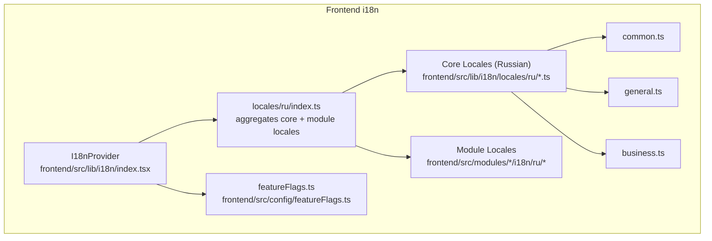
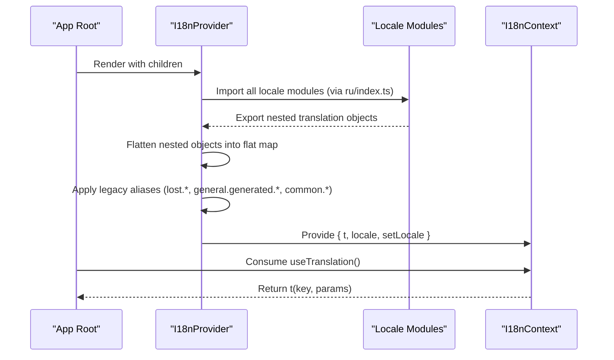
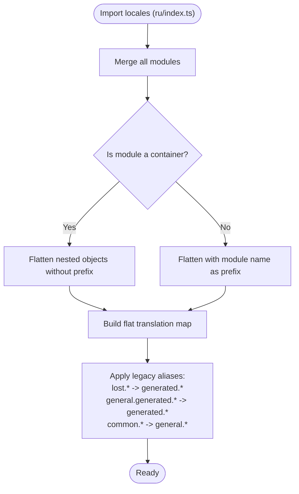
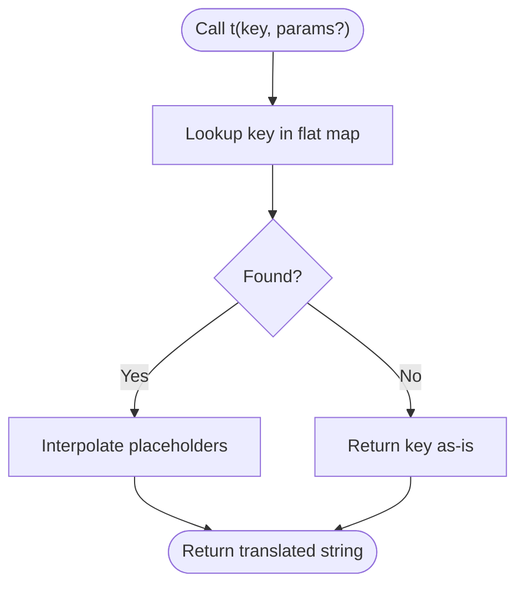
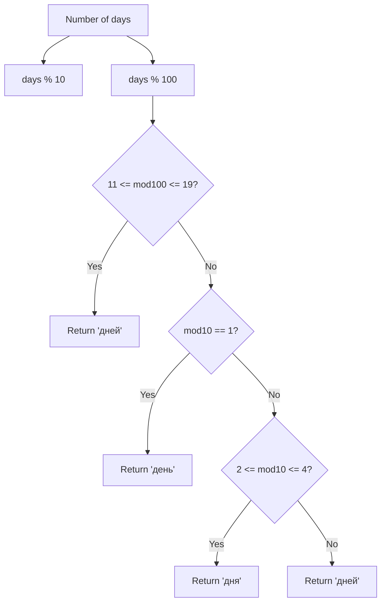
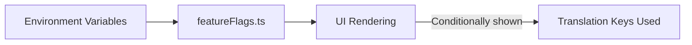
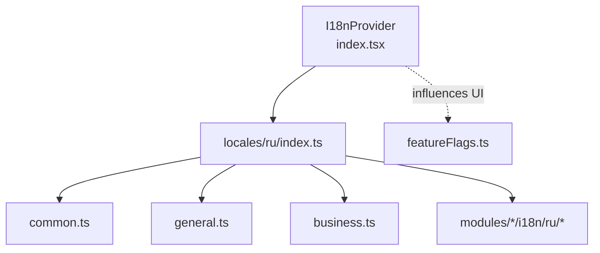

# Internationalization (i18n)

<cite>
**Referenced Files in This Document**
- [index.tsx](file://frontend/src/lib/i18n/index.tsx)
- [locales/ru/index.ts](file://frontend/src/lib/i18n/locales/ru/index.ts)
- [common.ts](file://frontend/src/lib/i18n/locales/ru/common.ts)
- [general.ts](file://frontend/src/lib/i18n/locales/ru/general.ts)
- [business.ts](file://frontend/src/lib/i18n/locales/ru/business.ts)
- [featureFlags.ts](file://frontend/src/config/featureFlags.ts)
- [birthdayUtils.ts](file://frontend/src/modules/calendar/utils/birthdayUtils.ts)
- [extract_defined.js](file://scripts/extract_defined.js)
- [scan-i18n.js](file://frontend/scripts/scan-i18n.js)
- [verify-i18n.js](file://frontend/scripts/verify-i18n.js)
</cite>

## Table of Contents
1. [Introduction](#introduction)
2. [Project Structure](#project-structure)
3. [Core Components](#core-components)
4. [Architecture Overview](#architecture-overview)
5. [Detailed Component Analysis](#detailed-component-analysis)
6. [Dependency Analysis](#dependency-analysis)
7. [Performance Considerations](#performance-considerations)
8. [Troubleshooting Guide](#troubleshooting-guide)
9. [Conclusion](#conclusion)
10. [Appendices](#appendices)

## Introduction
This document describes the internationalization (i18n) system in Titan CRM. It explains how translations are organized, loaded, and resolved at runtime, how interpolation works, and how module-specific translation namespaces are handled. It also covers legacy aliasing, translation key conventions, nested object flattening, and the feature flag system’s relationship to i18n. Guidance is included for adding new languages, dynamic translation usage, right-to-left language support, performance considerations for large translation sets, and validation of translation completeness.

## Project Structure
The i18n system is implemented in the frontend under a dedicated library module. Core translations are stored as TypeScript modules grouped by language and functional domain; module-specific translations live in each module’s `i18n/ru/` folder and are aggregated by `locales/ru/index.ts`. A central provider composes all translations into a single flat lookup table and exposes a hook for resolving localized strings with optional interpolation.

**Diagram sources**
- [index.tsx:1-125](file://frontend/src/lib/i18n/index.tsx#L1-L125)
- [locales/ru/index.ts:1-40](file://frontend/src/lib/i18n/locales/ru/index.ts#L1-L40)
- [common.ts:1-507](file://frontend/src/lib/i18n/locales/ru/common.ts#L1-L507)
- [general.ts:1-573](file://frontend/src/lib/i18n/locales/ru/general.ts#L1-L573)
- [business.ts:1-41](file://frontend/src/lib/i18n/locales/ru/business.ts#L1-L41)
- [featureFlags.ts:1-54](file://frontend/src/config/featureFlags.ts#L1-L54)

**Section sources**
- [index.tsx:1-125](file://frontend/src/lib/i18n/index.tsx#L1-L125)
- [locales/ru/index.ts:1-40](file://frontend/src/lib/i18n/locales/ru/index.ts#L1-L40)
- [common.ts:1-507](file://frontend/src/lib/i18n/locales/ru/common.ts#L1-L507)
- [general.ts:1-573](file://frontend/src/lib/i18n/locales/ru/general.ts#L1-L573)
- [business.ts:1-41](file://frontend/src/lib/i18n/locales/ru/business.ts#L1-L41)
- [featureFlags.ts:1-54](file://frontend/src/config/featureFlags.ts#L1-L54)

## Core Components
- I18nProvider: Creates a React context with a translation function, current locale, and setter for locale. It builds a flat translation map from modular locale files and applies legacy key aliases.
- useTranslation: Hook to consume the i18n context and access the translation function and locale.
- Translation modules: TypeScript modules exporting nested objects per functional area (e.g., common, general, business) plus per-module translations (tasks, contractors, contracts, mail, products, etc.). These are flattened into a single key-value map at startup.
- Legacy aliasing: Automatic creation of generated.* aliases from lost.*, general.generated.*, and common.* keys to maintain backward compatibility with older code.

Key behaviors:
- Nested object flattening: Converts nested translation objects into dot-delimited keys.
- Container modules: Certain top-level modules (business, legal, office, layout) are treated specially so inner keys become root-level keys without an extra prefix.
- Interpolation: Supports positional arrays and named parameters via placeholder replacement.
- Fallback: Returns the key itself if a translation is missing.

**Section sources**
- [index.tsx:1-125](file://frontend/src/lib/i18n/index.tsx#L1-L125)

## Architecture Overview
The i18n architecture centers around a single provider that aggregates translations from modular files, flattens nested structures, and exposes a simple translation function. Feature flags are separate but can influence which UI strings are shown.

**Diagram sources**
- [index.tsx:1-125](file://frontend/src/lib/i18n/index.tsx#L1-L125)

## Detailed Component Analysis

### Translation Provider and Flattening
The provider imports all locale modules and flattens nested objects into a single map. Container modules (business, legal, office, layout) are treated as special cases so that inner keys are promoted to root-level keys. This enables concise keys like “contractor.title” instead of “business.contractors.title”.

**Diagram sources**
- [index.tsx:12-83](file://frontend/src/lib/i18n/index.tsx#L12-L83)

**Section sources**
- [index.tsx:1-125](file://frontend/src/lib/i18n/index.tsx#L1-L125)

### Translation Function and Interpolation
The translation function resolves a key against the flat map and optionally interpolates placeholders. It supports:
- Named parameters: {name}, {count}
- Positional parameters: {0}, {1}

If a key is not found, the key itself is returned as a fallback.

**Diagram sources**
- [index.tsx:96-110](file://frontend/src/lib/i18n/index.tsx#L96-L110)

**Section sources**
- [index.tsx:93-117](file://frontend/src/lib/i18n/index.tsx#L93-L117)

### Module-Specific Translation Files
Translation domains are split into focused files:
- common.ts: Shared UI terms and generic phrases (also aliased as `activity`)
- general.ts: Toast messages, generic statuses, and generated.* entries
- business.ts: Aggregates tasks/contractor translations (tasks, task_sheet, confirm, validation, contractors, contractor_sheet, contractor, contractor_type, quick_sheet, toast, logs, enrichment, messages) and defines container-level aliases
- Additional core files: auth, components, errors, layout, legal, lost, modules, notifications, office, placeholders, profile, references, settings, tasks_v2
- Module files: Each feature module (tasks, contractors, contracts, mail, products, services, finance, calendar, workflows, dashboard, projects, reports, marketing, templates, warehouse) exports its own `i18n/ru` namespace, aggregated in `locales/ru/index.ts`

These files are imported by the provider and merged into the flat map. Container modules (e.g., business, legal, office, layout) are flattened without an extra prefix, allowing keys like “confirm.delete_task” to resolve directly.

**Section sources**
- [locales/ru/index.ts:1-40](file://frontend/src/lib/i18n/locales/ru/index.ts#L1-L40)
- [common.ts:1-507](file://frontend/src/lib/i18n/locales/ru/common.ts#L1-L507)
- [general.ts:1-573](file://frontend/src/lib/i18n/locales/ru/general.ts#L1-L573)
- [business.ts:1-41](file://frontend/src/lib/i18n/locales/ru/business.ts#L1-L41)
- [index.tsx:25-38](file://frontend/src/lib/i18n/index.tsx#L25-L38)

### Pluralization Rules
Pluralization is handled locally in module utilities. For example, a helper computes Russian plural forms for days.

**Diagram sources**
- [birthdayUtils.ts:179-193](file://frontend/src/modules/calendar/utils/birthdayUtils.ts#L179-L193)

**Section sources**
- [birthdayUtils.ts:177-193](file://frontend/src/modules/calendar/utils/birthdayUtils.ts#L177-L193)

### Date/Time Formatting
There is no centralized date/time formatter in the i18n provider. Formatting is typically delegated to locale-aware utilities or libraries elsewhere in the codebase. If needed, integrate a formatter that respects the current locale.

[No sources needed since this section does not analyze specific files]

### Feature Flag System and Conditional Translations
Feature flags control visibility of UI sections and therefore indirectly affect which strings are rendered. Flags are environment-driven booleans that can gate UI elements and, by extension, which translation keys are accessed during runtime.

**Diagram sources**
- [featureFlags.ts:31-52](file://frontend/src/config/featureFlags.ts#L31-L52)

**Section sources**
- [featureFlags.ts:1-54](file://frontend/src/config/featureFlags.ts#L1-L54)

### Dynamic Import of Translation Resources
The current provider statically imports all locale modules at build time. To enable dynamic loading of language packs:
- Split locale modules into separate chunks per language
- Load the appropriate chunk based on the current locale
- Replace the static import with a dynamic import inside the provider
- Update the flat map when new chunks are loaded

This pattern scales to large translation sets by reducing initial bundle size.

[No sources needed since this section provides general guidance]

### Fallback Mechanisms
- Missing translation key: Returns the key itself
- Legacy aliasing: Populates generated.* keys from lost.*, general.generated.*, and general.* keys from common.* to avoid breaking existing code

**Section sources**
- [index.tsx:42-83](file://frontend/src/lib/i18n/index.tsx#L42-L83)

### Translation Key Conventions and Nested Object Structure
- Keys are dot-delimited hierarchical identifiers
- Container modules promote inner keys to root level (e.g., business.tasks.title becomes tasks.title)
- Non-container modules prefix inner keys with the module name (e.g., common.search)
- Nested objects are flattened recursively into a single-level map

**Section sources**
- [index.tsx:12-38](file://frontend/src/lib/i18n/index.tsx#L12-L38)

### Translation Extraction Processes
Scripts assist in scanning and generating translation keys:
- extract_defined.js: Parses translation files to extract keys for settings and general namespaces
- scan-i18n.js: Scans the codebase for translation keys
- verify-i18n.js: Verifies translation completeness and missing keys
- debug-keys.mjs / view-i18n-report.js: Debug and report helpers

These scripts help maintain completeness and enforce conventions.

**Section sources**
- [extract_defined.js:70-117](file://scripts/extract_defined.js#L70-L117)
- [scan-i18n.js:1-227](file://frontend/scripts/scan-i18n.js#L1-L227)
- [verify-i18n.js:1-500](file://frontend/scripts/verify-i18n.js#L1-L500)

## Dependency Analysis
The i18n provider depends on:
- Locale modules (core + per-module i18n folders) for translation content
- Feature flags for conditional UI rendering
- React context for exposing translation utilities

**Diagram sources**
- [index.tsx:1-125](file://frontend/src/lib/i18n/index.tsx#L1-L125)
- [locales/ru/index.ts:1-40](file://frontend/src/lib/i18n/locales/ru/index.ts#L1-L40)
- [common.ts:1-507](file://frontend/src/lib/i18n/locales/ru/common.ts#L1-L507)
- [general.ts:1-573](file://frontend/src/lib/i18n/locales/ru/general.ts#L1-L573)
- [business.ts:1-41](file://frontend/src/lib/i18n/locales/ru/business.ts#L1-L41)
- [featureFlags.ts:1-54](file://frontend/src/config/featureFlags.ts#L1-L54)

**Section sources**
- [index.tsx:1-125](file://frontend/src/lib/i18n/index.tsx#L1-L125)
- [featureFlags.ts:1-54](file://frontend/src/config/featureFlags.ts#L1-L54)

## Performance Considerations
- Large translation files: Keep modules small and focused; consider splitting by domain or feature
- Static imports: Current implementation loads all locales at startup; switch to dynamic imports for on-demand loading
- Bundle size: Lazy-load language packs based on user preferences or detected locale
- Interpolation cost: Keep parameter objects small; avoid deep nesting in interpolated values
- Alias generation: Precompute aliases during build or at startup to minimize runtime overhead

[No sources needed since this section provides general guidance]

## Troubleshooting Guide
Common issues and resolutions:
- Missing translation: Verify the key exists in the appropriate module; ensure container/module prefixing is correct
- Wrong pluralization: Implement or adjust local pluralization logic (e.g., Russian cases)
- Legacy key not found: Confirm that aliases were generated (lost.*, general.generated.*, common.*) and that the provider ran the aliasing pass
- Interpolation mismatch: Ensure placeholder names match between key and parameters
- Feature-gated strings not appearing: Check feature flags and environment variables

Validation tips:
- Run extraction/scan scripts (scan-i18n.js, verify-i18n.js) to enumerate keys and detect missing ones
- Add unit tests that assert presence of required keys
- Use linters or custom checks to prevent hardcoded strings

**Section sources**
- [index.tsx:42-83](file://frontend/src/lib/i18n/index.tsx#L42-L83)
- [extract_defined.js:70-117](file://scripts/extract_defined.js#L70-L117)

## Conclusion
Titan CRM’s i18n system provides a straightforward, flat-key translation model with container-aware flattening and legacy aliasing. It supports interpolation and integrates with feature flags to conditionally render content. For production-scale deployments, adopt dynamic imports for language packs, keep modules cohesive, and leverage extraction/validation scripts to maintain translation completeness.

[No sources needed since this section summarizes without analyzing specific files]

## Appendices

### Adding a New Language
Steps:
- Create a new directory under locales for the language (e.g., locales/fr/)
- Copy the structure of existing modules (common.ts, general.ts, business.ts, etc.)
- Translate all leaf values while preserving the nested object shape
- Add per-module translations under each module’s i18n folder
- Update the provider to import the new locale set (statically or dynamically)
- Test interpolation and alias resolution

[No sources needed since this section provides general guidance]

### Implementing Dynamic Translations
- Split locale modules into per-language bundles
- Detect or set the desired locale
- Dynamically import the corresponding bundle
- Merge the new translations into the provider’s flat map
- Trigger a re-render by updating the context value

[No sources needed since this section provides general guidance]

### Handling Right-to-Left Languages
- Ensure the UI layout adapts to RTL directionality
- Adjust text alignment and component ordering
- Validate that interpolation and pluralization remain correct
- Test with a real RTL locale to catch edge cases

[No sources needed since this section provides general guidance]

### Guidelines for Developers and Translators
- Prefer dot-delimited keys and nested objects for clarity
- Use placeholders consistently for dynamic values
- Avoid hardcoded strings; always use translation keys
- Keep translation files modular and focused
- Use extraction/scan scripts to track missing keys
- Validate translations after updates

[No sources needed since this section provides general guidance]
