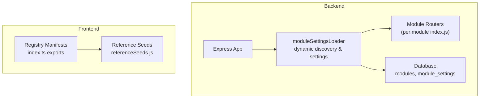
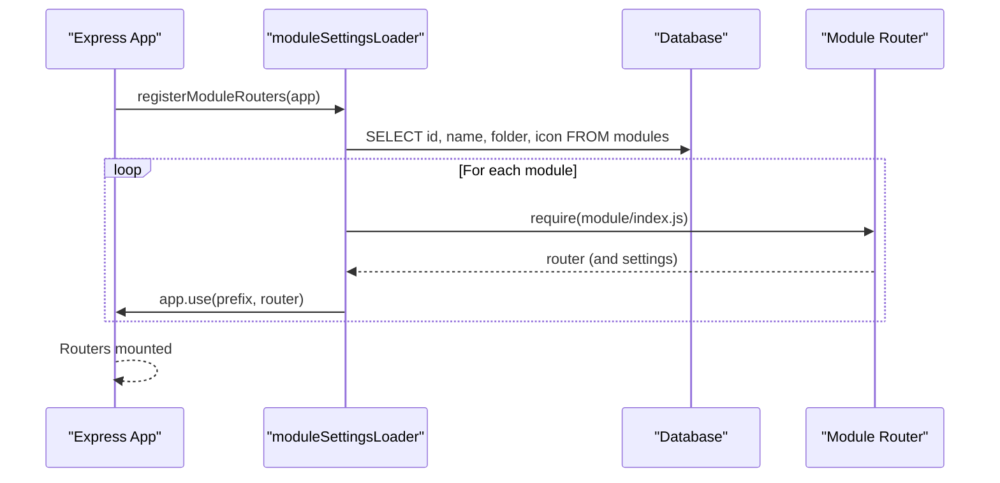
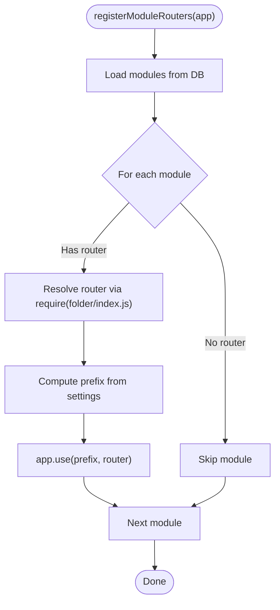
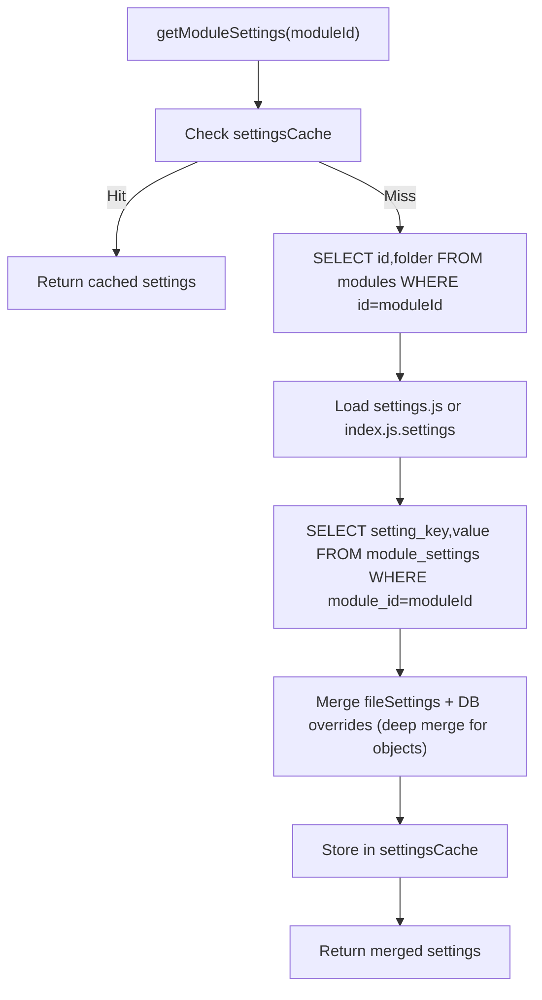
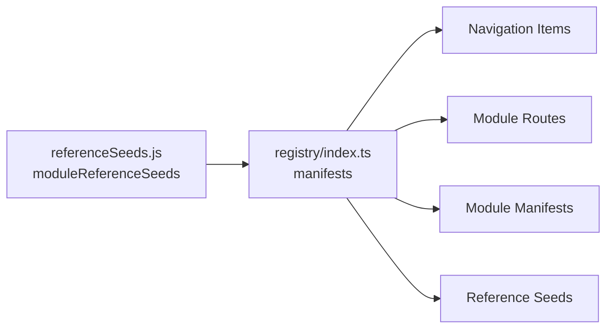
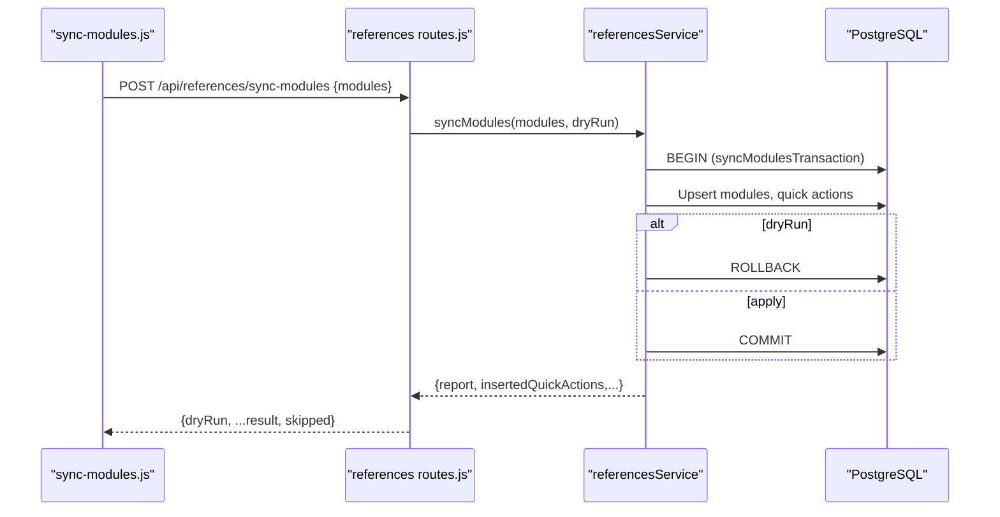
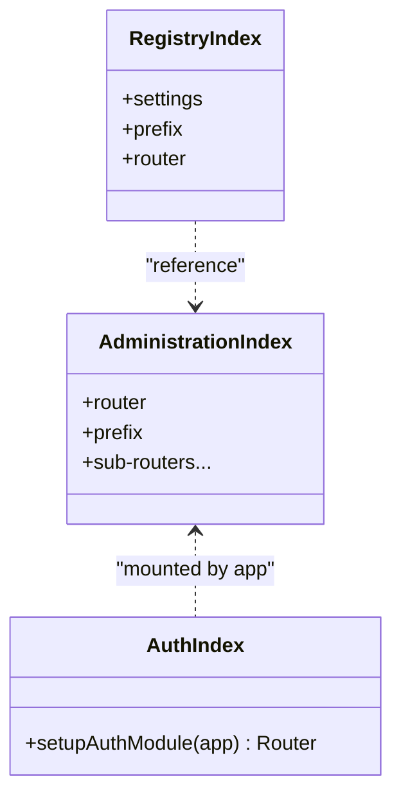
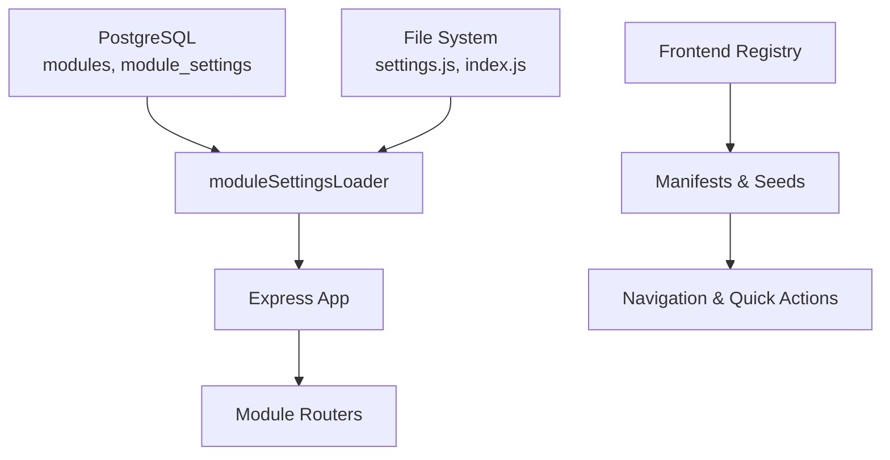

# Module System

<cite>
**Referenced Files in This Document**
- [backend/modules/registry/index.js](file://backend/modules/registry/index.js)
- [backend/modules/registry/settings.js](file://backend/modules/registry/settings.js)
- [backend/modules/administration/index.js](file://backend/modules/administration/index.js)
- [backend/modules/administration/settings.js](file://backend/modules/administration/settings.js)
- [backend/modules/auth/index.js](file://backend/modules/auth/index.js)
- [backend/utils/moduleSettingsLoader.js](file://backend/utils/moduleSettingsLoader.js)
- [backend/modules/settings/routes/moduleSettings.js](file://backend/modules/settings/routes/moduleSettings.js)
- [backend/modules/references/index.js](file://backend/modules/references/index.js)
- [backend/modules/references/routes.js](file://backend/modules/references/routes.js)
- [backend/modules/references/controllers/referencesController.js](file://backend/modules/references/controllers/referencesController.js)
- [backend/modules/references/services/referencesService.js](file://backend/modules/references/services/referencesService.js)
- [backend/modules/references/referencesHelpers.js](file://backend/modules/references/referencesHelpers.js)
- [backend/scripts/sync-modules.js](file://backend/scripts/sync-modules.js)
- [frontend/src/modules/registry/index.ts](file://frontend/src/modules/registry/index.ts)
- [frontend/src/modules/registry/referenceSeeds.js](file://frontend/src/modules/registry/referenceSeeds.js)
- [backend/migrations/14_create_modules_and_tags.md](file://backend/migrations/14_create_modules_and_tags.md)
- [backend/migrations/68_create_module_settings_table.sql](file://backend/migrations/68_create_module_settings_table.sql)
</cite>

## Table of Contents
1. [Introduction](#introduction)
2. [Project Structure](#project-structure)
3. [Core Components](#core-components)
4. [Architecture Overview](#architecture-overview)
5. [Detailed Component Analysis](#detailed-component-analysis)
6. [Dependency Analysis](#dependency-analysis)
7. [Performance Considerations](#performance-considerations)
8. [Troubleshooting Guide](#troubleshooting-guide)
9. [Conclusion](#conclusion)
10. [Appendices](#appendices)

## Introduction
This document explains the module system architecture in Titan CRM. It covers how modules are discovered, loaded, and registered at runtime; how module settings are managed and persisted; how module manifests and reference seeds drive frontend navigation and quick actions; and how inter-module communication and permissions integrate with the system. It also provides practical guidance for creating new modules, extending existing ones, managing dependencies, and optimizing performance for large module sets.

## Project Structure
Titan CRM organizes modules under a dedicated backend modules directory, with each module exposing an index.js that defines routes and optional settings. A central loader utility dynamically discovers modules, merges static and database-backed settings, and registers module routers into the Express application. Frontend modules are driven by a registry that exposes manifests, routes, navigation items, and reference seeds.

**Diagram sources**
- [backend/utils/moduleSettingsLoader.js:304-353](file://backend/utils/moduleSettingsLoader.js#L304-L353)
- [backend/modules/administration/index.js:1-33](file://backend/modules/administration/index.js#L1-L33)
- [backend/migrations/14_create_modules_and_tags.md:9-22](file://backend/migrations/14_create_modules_and_tags.md#L9-L22)
- [backend/migrations/68_create_module_settings_table.sql:5-18](file://backend/migrations/68_create_module_settings_table.sql#L5-L18)
- [frontend/src/modules/registry/index.ts:1-31](file://frontend/src/modules/registry/index.ts#L1-L31)
- [frontend/src/modules/registry/referenceSeeds.js:1-184](file://frontend/src/modules/registry/referenceSeeds.js#L1-L184)

**Section sources**
- [backend/modules/registry/index.js:1-13](file://backend/modules/registry/index.js#L1-L13)
- [backend/modules/administration/index.js:1-33](file://backend/modules/administration/index.js#L1-L33)
- [backend/utils/moduleSettingsLoader.js:304-353](file://backend/utils/moduleSettingsLoader.js#L304-L353)
- [frontend/src/modules/registry/index.ts:1-31](file://frontend/src/modules/registry/index.ts#L1-L31)

## Core Components
- Dynamic module loader: Discovers modules by reading the modules table and loading each module’s index.js to obtain its router and settings.
- Module settings system: Combines static settings from settings.js or index.js with dynamic overrides stored in module_settings (JSONB), with caching and persistence.
- Route registration: Registers each module router under a configurable prefix derived from module settings.
- Frontend registry: Exposes module manifests, routes, navigation items, and reference seeds for UI composition and quick actions.
- Reference synchronization: Provides APIs and scripts to synchronize module metadata and quick actions with the database.

**Section sources**
- [backend/utils/moduleSettingsLoader.js:23-141](file://backend/utils/moduleSettingsLoader.js#L23-L141)
- [backend/modules/settings/routes/moduleSettings.js:17-188](file://backend/modules/settings/routes/moduleSettings.js#L17-L188)
- [backend/modules/references/routes.js:11-12](file://backend/modules/references/routes.js#L11-L12)
- [frontend/src/modules/registry/index.ts:1-31](file://frontend/src/modules/registry/index.ts#L1-L31)
- [frontend/src/modules/registry/referenceSeeds.js:1-184](file://frontend/src/modules/registry/referenceSeeds.js#L1-L184)

## Architecture Overview
The module system comprises three layers:
- Backend discovery and registration: Loads module metadata from the database, resolves per-module routers, and mounts them onto the Express app.
- Settings layer: Merges static and dynamic settings, caches results, and exposes APIs for reading/writing module settings.
- Frontend registry: Reads manifests and reference seeds to render navigation, routes, and quick actions.

**Diagram sources**
- [backend/utils/moduleSettingsLoader.js:337-353](file://backend/utils/moduleSettingsLoader.js#L337-L353)
- [backend/modules/administration/index.js:1-33](file://backend/modules/administration/index.js#L1-L33)

## Detailed Component Analysis

### Backend Module Discovery and Registration
- Module discovery: Queries the modules table to enumerate active modules and their folder names.
- Router resolution: Dynamically requires each module’s index.js and extracts the router export.
- Prefix derivation: Uses module settings to compute the mount prefix (defaults to /api/{module_id} if not provided).
- Caching: Maintains separate caches for settings and routers to avoid repeated disk reads and require() calls.

**Diagram sources**
- [backend/utils/moduleSettingsLoader.js:337-353](file://backend/utils/moduleSettingsLoader.js#L337-L353)

**Section sources**
- [backend/utils/moduleSettingsLoader.js:270-353](file://backend/utils/moduleSettingsLoader.js#L270-L353)
- [backend/modules/administration/index.js:1-33](file://backend/modules/administration/index.js#L1-L33)

### Module Settings System
- Static vs dynamic: Static settings come from settings.js or index.js; dynamic settings are stored in module_settings with JSONB values.
- Merge strategy: Dynamic settings override scalar keys; nested objects are deep-merged.
- Persistence: Supports saving and deleting settings; clears caches after writes.
- Bulk edit integration: Dedicated endpoints and utilities manage bulk-edit configurations per module.

**Diagram sources**
- [backend/utils/moduleSettingsLoader.js:89-141](file://backend/utils/moduleSettingsLoader.js#L89-L141)
- [backend/migrations/68_create_module_settings_table.sql:5-18](file://backend/migrations/68_create_module_settings_table.sql#L5-L18)

**Section sources**
- [backend/utils/moduleSettingsLoader.js:23-233](file://backend/utils/moduleSettingsLoader.js#L23-L233)
- [backend/modules/settings/routes/moduleSettings.js:17-188](file://backend/modules/settings/routes/moduleSettings.js#L17-L188)
- [backend/migrations/68_create_module_settings_table.sql:5-18](file://backend/migrations/68_create_module_settings_table.sql#L5-L18)

### Frontend Module Registry and Reference Seeds
- Registry exports: Provides getters for manifests, routes, navigation items, and reference seeds.
- Navigation composition: Filters manifests with navigation entries, enriches with feature flags, and sorts by order.
- Reference seeds: Define module metadata and quick actions for UI scaffolding and synchronization.

**Diagram sources**
- [frontend/src/modules/registry/referenceSeeds.js:1-184](file://frontend/src/modules/registry/referenceSeeds.js#L1-L184)
- [frontend/src/modules/registry/index.ts:1-31](file://frontend/src/modules/registry/index.ts#L1-L31)

**Section sources**
- [frontend/src/modules/registry/index.ts:1-31](file://frontend/src/modules/registry/index.ts#L1-L31)
- [frontend/src/modules/registry/referenceSeeds.js:1-184](file://frontend/src/modules/registry/referenceSeeds.js#L1-L184)

### Module Registration and Synchronization
- Backend route: POST /api/references/sync-modules orchestrates transactional synchronization of module metadata and quick actions. The route is declared in the references module and handled by a controller/service chain.
- CLI script: sync-modules.js loads seeds from frontend referenceSeeds.js (moduleReferenceSeeds export) and posts to the backend API, supporting dry-run mode and custom payloads.

**Diagram sources**
- [backend/modules/references/routes.js:12](file://backend/modules/references/routes.js#L12)
- [backend/modules/references/controllers/referencesController.js:38-61](file://backend/modules/references/controllers/referencesController.js#L38-L61)
- [backend/modules/references/services/referencesService.js:132-142](file://backend/modules/references/services/referencesService.js#L132-L142)
- [backend/modules/references/referencesHelpers.js:71-152](file://backend/modules/references/referencesHelpers.js#L71-L152)
- [backend/scripts/sync-modules.js:53-89](file://backend/scripts/sync-modules.js#L53-L89)

**Section sources**
- [backend/modules/references/routes.js:1-30](file://backend/modules/references/routes.js#L1-L30)
- [backend/modules/references/controllers/referencesController.js:38-61](file://backend/modules/references/controllers/referencesController.js#L38-L61)
- [backend/scripts/sync-modules.js:1-110](file://backend/scripts/sync-modules.js#L1-L110)

### Example Modules and Patterns
- Administration module: Aggregates multiple sub-routes (users, roles, permissions, employees, org, company) and exports a router with a fixed prefix.
- Auth module: Returns a router factory that mounts auth routes.
- Registry module: Provides settings and a minimal (empty) router; useful for reference and testing.

**Diagram sources**
- [backend/modules/administration/index.js:1-33](file://backend/modules/administration/index.js#L1-L33)
- [backend/modules/auth/index.js:1-17](file://backend/modules/auth/index.js#L1-L17)
- [backend/modules/registry/index.js:1-13](file://backend/modules/registry/index.js#L1-L13)

**Section sources**
- [backend/modules/administration/index.js:1-33](file://backend/modules/administration/index.js#L1-L33)
- [backend/modules/auth/index.js:1-17](file://backend/modules/auth/index.js#L1-L17)
- [backend/modules/registry/index.js:1-13](file://backend/modules/registry/index.js#L1-L13)

### Permissions and Visibility Defaults
Administration module settings define default roles (admin, manager, user, contractor) and permissions, along with visibility toggles for inactive/deleted records. These demonstrate how module-level configuration can influence UI behavior and access controls.

**Section sources**
- [backend/modules/administration/settings.js:1-92](file://backend/modules/administration/settings.js#L1-L92)

## Dependency Analysis
- Backend depends on:
  - Database for module metadata and settings persistence.
  - File system for static settings and router discovery.
  - Express for mounting routers.
- Frontend depends on:
  - Registry manifests and reference seeds for navigation and quick actions.
  - Backend APIs for module settings and reference data.

**Diagram sources**
- [backend/utils/moduleSettingsLoader.js:304-353](file://backend/utils/moduleSettingsLoader.js#L304-L353)
- [backend/migrations/14_create_modules_and_tags.md:9-22](file://backend/migrations/14_create_modules_and_tags.md#L9-L22)
- [backend/migrations/68_create_module_settings_table.sql:5-18](file://backend/migrations/68_create_module_settings_table.sql#L5-L18)
- [frontend/src/modules/registry/index.ts:1-31](file://frontend/src/modules/registry/index.ts#L1-L31)

**Section sources**
- [backend/utils/moduleSettingsLoader.js:304-353](file://backend/utils/moduleSettingsLoader.js#L304-L353)
- [backend/migrations/14_create_modules_and_tags.md:9-22](file://backend/migrations/14_create_modules_and_tags.md#L9-L22)
- [backend/migrations/68_create_module_settings_table.sql:5-18](file://backend/migrations/68_create_module_settings_table.sql#L5-L18)
- [frontend/src/modules/registry/index.ts:1-31](file://frontend/src/modules/registry/index.ts#L1-L31)

## Performance Considerations
- Caching: Settings and routers are cached to reduce filesystem and database overhead. Clear caches after settings changes.
- Batch initialization: Use getAllModulesWithSettings during startup to pre-warm caches.
- Indexes: module_settings table has indexes for module_id, setting_key, and the composite (module_id, setting_key).
- Conditional loading: Only mount routers for active modules; avoid unnecessary require() calls by checking module existence first.
- Frontend manifests: Keep manifests lean; defer heavy computations to lazy-loaded components.

[No sources needed since this section provides general guidance]

## Troubleshooting Guide
- Module not found: Verify the module exists in the modules table and the folder name matches the module id.
- Router not mounted: Confirm the module’s index.js exports a router property or default export; check prefix derivation from settings.
- Settings not applied: Ensure module_settings entries exist and are properly formatted JSONB; clear caches if stale.
- Synchronization failures: Use dry-run mode to preview changes; inspect returned reports for invalid items.
- CLI connectivity: Ensure backend is running before invoking sync-modules.js; adjust SYNC_MODULES_API_URL if needed.

**Section sources**
- [backend/utils/moduleSettingsLoader.js:239-247](file://backend/utils/moduleSettingsLoader.js#L239-L247)
- [backend/modules/settings/routes/moduleSettings.js:70-139](file://backend/modules/settings/routes/moduleSettings.js#L70-L139)
- [backend/scripts/sync-modules.js:91-110](file://backend/scripts/sync-modules.js#L91-L110)

## Conclusion
Titan CRM’s module system combines dynamic discovery, flexible settings management, and a declarative frontend registry to support scalable, maintainable feature growth. By leveraging database-backed settings, transactional synchronization, and modular routing, the platform enables rapid iteration while preserving consistency across modules.

[No sources needed since this section summarizes without analyzing specific files]

## Appendices

### Creating a New Module
- Backend:
  - Add a new folder under backend/modules with an index.js exporting a router and optional settings.
  - Seed the modules table with id, name, icon, and folder.
  - Optionally add settings.js or expose settings via index.js.
- Frontend:
  - Extend frontend/src/modules/registry/referenceSeeds.js with a new module seed and quick actions.
  - Run sync-modules.js to synchronize backend state.

**Section sources**
- [backend/modules/administration/index.js:1-33](file://backend/modules/administration/index.js#L1-L33)
- [backend/migrations/14_create_modules_and_tags.md:9-22](file://backend/migrations/14_create_modules_and_tags.md#L9-L22)
- [frontend/src/modules/registry/referenceSeeds.js:1-184](file://frontend/src/modules/registry/referenceSeeds.js#L1-L184)
- [backend/scripts/sync-modules.js:53-89](file://backend/scripts/sync-modules.js#L53-L89)

### Extending Existing Modules
- Update settings.js or index.js to add new configuration groups.
- Persist overrides via module settings API; verify deep merge behavior for nested objects.
- Rebuild frontend manifests if adding navigation or quick actions.

**Section sources**
- [backend/utils/moduleSettingsLoader.js:119-131](file://backend/utils/moduleSettingsLoader.js#L119-L131)
- [backend/modules/settings/routes/moduleSettings.js:70-188](file://backend/modules/settings/routes/moduleSettings.js#L70-L188)

### Managing Dependencies and Inter-Module Communication
- Use module prefixes to namespace routes consistently.
- Share constants or utilities across modules via shared libraries or centralized helpers.
- For cross-module data access, rely on backend services and controllers; avoid tight coupling in routers.

[No sources needed since this section provides general guidance]

### Hot Reloading During Development
- Restart the backend server to refresh module routers and settings caches.
- For frontend, reload the page to re-fetch manifests and seeds.

[No sources needed since this section provides general guidance]
