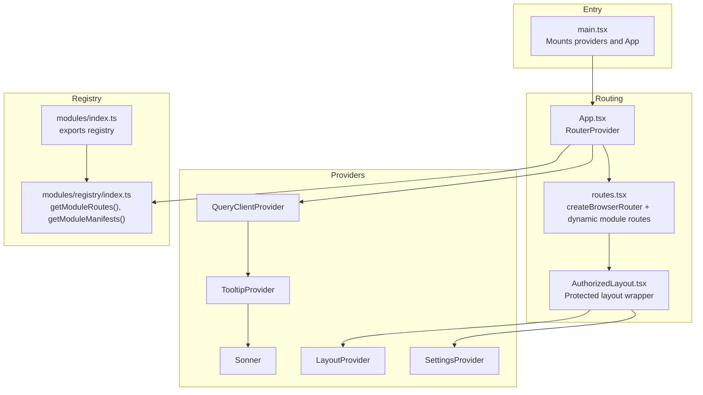
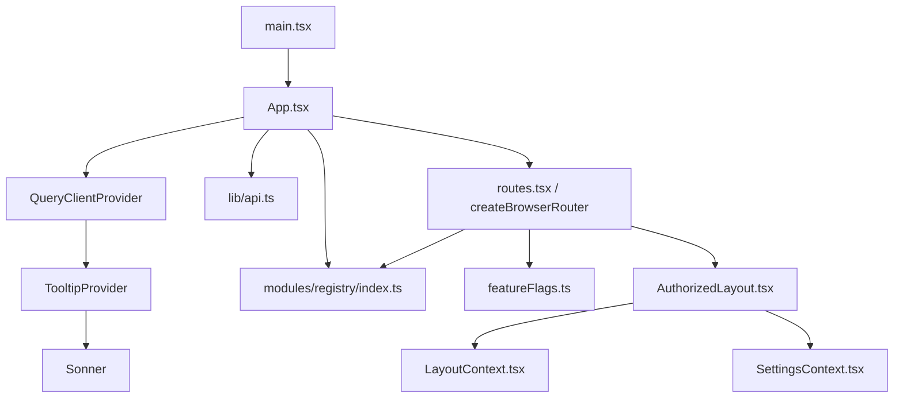
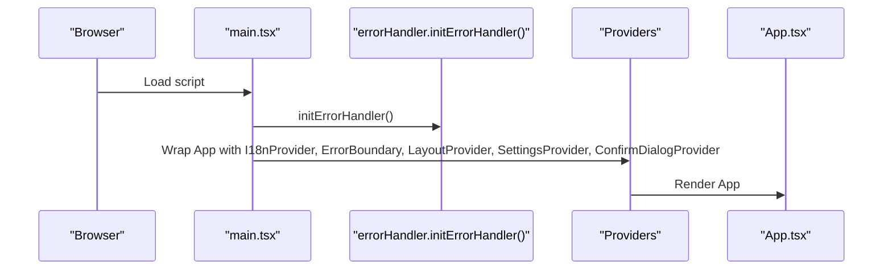
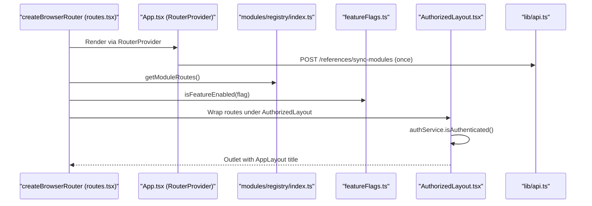
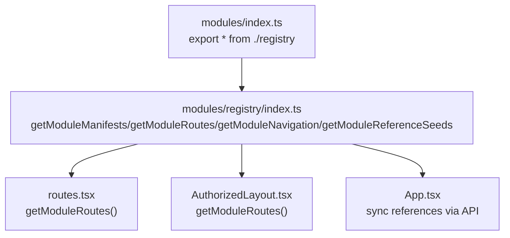
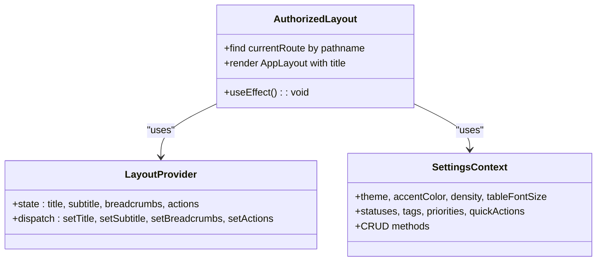
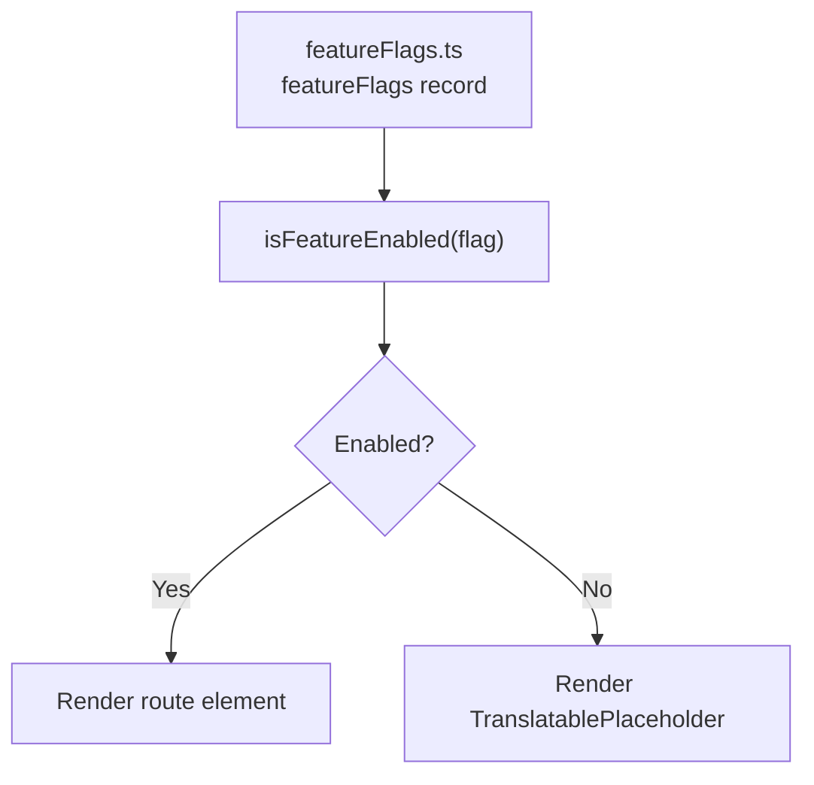
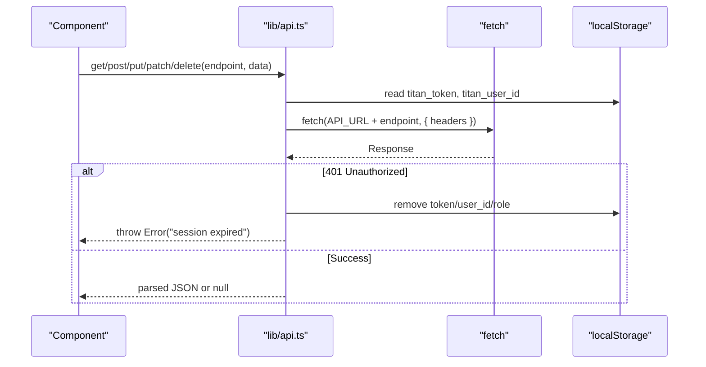
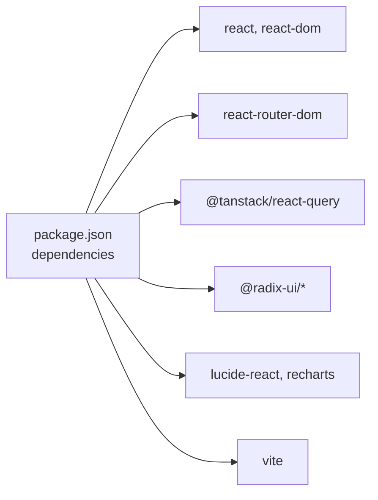

# React Application Architecture

<cite>
**Referenced Files in This Document**
- [frontend/src/main.tsx](file://frontend/src/main.tsx)
- [frontend/src/App.tsx](file://frontend/src/App.tsx)
- [frontend/src/routes.tsx](file://frontend/src/routes.tsx)
- [frontend/vite.config.ts](file://frontend/vite.config.ts)
- [frontend/package.json](file://frontend/package.json)
- [frontend/tsconfig.json](file://frontend/tsconfig.json)
- [frontend/src/modules/index.ts](file://frontend/src/modules/index.ts)
- [frontend/src/modules/registry/index.ts](file://frontend/src/modules/registry/index.ts)
- [frontend/src/components/layout/AuthorizedLayout.tsx](file://frontend/src/components/layout/AuthorizedLayout.tsx)
- [frontend/src/config/featureFlags.ts](file://frontend/src/config/featureFlags.ts)
- [frontend/src/lib/api.ts](file://frontend/src/lib/api.ts)
- [frontend/src/context/SettingsContext.tsx](file://frontend/src/context/SettingsContext.tsx)
- [frontend/src/context/LayoutContext.tsx](file://frontend/src/context/LayoutContext.tsx)
- [frontend/src/lib/errorHandler.ts](file://frontend/src/lib/errorHandler.ts)
</cite>

## Table of Contents
1. [Introduction](#introduction)
2. [Project Structure](#project-structure)
3. [Core Components](#core-components)
4. [Architecture Overview](#architecture-overview)
5. [Detailed Component Analysis](#detailed-component-analysis)
6. [Dependency Analysis](#dependency-analysis)
7. [Performance Considerations](#performance-considerations)
8. [Troubleshooting Guide](#troubleshooting-guide)
9. [Conclusion](#conclusion)

## Introduction
This document describes the React 18.3.1 application architecture powering Titan CRM’s frontend. It covers the initialization process, provider stack, routing with React Router (via `createBrowserRouter`), the module registry system that dynamically loads feature modules, layout system, global providers (React Query, TooltipProvider, Sonner), feature flags, TypeScript configuration, environment variable handling, and build optimization strategies. It also addresses performance considerations, lazy loading patterns, and code splitting techniques used across the application.

## Project Structure
The frontend is organized around a modular architecture with a central entrypoint, routing, providers, and a registry-driven module system. Key areas:
- Entry and Providers: The application initializes providers and mounts the root component.
- Routing: routes.tsx builds a `createBrowserRouter` composing module routes and a protected layout.
- Modules: A registry exposes manifests, routes, navigation, and reference seeds.
- Contexts: Settings and Layout contexts manage UI state and page metadata.
- Build and Tooling: Vite configuration defines dev server, proxy, aliases, and code splitting.

**Diagram sources**
- [frontend/src/main.tsx:1-26](file://frontend/src/main.tsx#L1-L26)
- [frontend/src/App.tsx:1-31](file://frontend/src/App.tsx#L1-L31)
- [frontend/src/routes.tsx:1-49](file://frontend/src/routes.tsx#L1-L49)
- [frontend/src/modules/index.ts:1-1](file://frontend/src/modules/index.ts#L1)
- [frontend/src/modules/registry/index.ts:13-31](file://frontend/src/modules/registry/index.ts#L13-L31)
- [frontend/src/components/layout/AuthorizedLayout.tsx:14-53](file://frontend/src/components/layout/AuthorizedLayout.tsx#L14-L53)

**Section sources**
- [frontend/src/main.tsx:1-26](file://frontend/src/main.tsx#L1-L26)
- [frontend/src/App.tsx:1-31](file://frontend/src/App.tsx#L1-L31)
- [frontend/src/routes.tsx:1-49](file://frontend/src/routes.tsx#L1-L49)
- [frontend/src/modules/index.ts:1-1](file://frontend/src/modules/index.ts#L1)
- [frontend/src/modules/registry/index.ts:13-31](file://frontend/src/modules/registry/index.ts#L13-L31)

## Core Components
- Application bootstrap and provider stack:
  - Initializes global error handling, sets up internationalization, error boundary, layout, settings, and confirm dialog providers, then renders the root App component.
- Central routing and layout:
  - Creates a single React Query client, wraps the app with TooltipProvider and Sonner, and renders the router via `RouterProvider`.
  - routes.tsx builds the router with `createBrowserRouter`: public auth pages, a protected AuthorizedLayout root with module children, and a catch-all not-found route.
  - Dynamically loads module routes via the registry and conditionally renders placeholders based on feature flags.
  - Uses a protected AuthorizedLayout that enforces authentication and passes page metadata to the main layout.
- Module registry:
  - Exposes module manifests, routes, navigation items, and reference seeds. Navigation items inherit feature flags from their associated routes.
- Feature flags:
  - Centralized feature flag evaluation using environment variables with sensible defaults.
- API client:
  - Unified fetch wrapper with automatic token injection, 401 handling, and structured error propagation.
- Contexts:
  - SettingsContext manages UI preferences, reference data, and CRUD operations against the backend.
  - LayoutContext manages page title, subtitle, breadcrumbs, and action buttons.

**Section sources**
- [frontend/src/main.tsx:11-26](file://frontend/src/main.tsx#L11-L26)
- [frontend/src/App.tsx:14-27](file://frontend/src/App.tsx#L14-L27)
- [frontend/src/routes.tsx:1-49](file://frontend/src/routes.tsx#L1-L49)
- [frontend/src/modules/registry/index.ts:13-31](file://frontend/src/modules/registry/index.ts#L13-L31)
- [frontend/src/config/featureFlags.ts:23-54](file://frontend/src/config/featureFlags.ts#L23-L54)
- [frontend/src/lib/api.ts:31-209](file://frontend/src/lib/api.ts#L31-L209)
- [frontend/src/context/SettingsContext.tsx:83-299](file://frontend/src/context/SettingsContext.tsx#L83-L299)
- [frontend/src/context/LayoutContext.tsx:25-97](file://frontend/src/context/LayoutContext.tsx#L25-L97)

## Architecture Overview
The application follows a layered architecture:
- Entry layer: Initializes providers and mounts the root component.
- Presentation layer: App component renders the router via RouterProvider; routes.tsx orchestrates routing, feature flags, and module routes.
- Domain layer: Module registry encapsulates module metadata and navigation.
- Infrastructure layer: API client handles HTTP requests, authentication, and error handling.
- State layer: Context providers manage UI state and reference data.

**Diagram sources**
- [frontend/src/main.tsx:14-25](file://frontend/src/main.tsx#L14-L25)
- [frontend/src/App.tsx:22-27](file://frontend/src/App.tsx#L22-L27)
- [frontend/src/routes.tsx:18-49](file://frontend/src/routes.tsx#L18-L49)
- [frontend/src/modules/registry/index.ts:13-31](file://frontend/src/modules/registry/index.ts#L13-L31)
- [frontend/src/config/featureFlags.ts:23-54](file://frontend/src/config/featureFlags.ts#L23-L54)
- [frontend/src/lib/api.ts:31-209](file://frontend/src/lib/api.ts#L31-L209)
- [frontend/src/context/LayoutContext.tsx:25-45](file://frontend/src/context/LayoutContext.tsx#L25-L45)
- [frontend/src/context/SettingsContext.tsx:83-203](file://frontend/src/context/SettingsContext.tsx#L83-L203)

## Detailed Component Analysis

### Bootstrapping and Provider Stack
The application initializes global error handling early, then composes a nested provider stack before rendering the root App. Providers include:
- Internationalization
- Error boundary
- Layout state
- Settings state
- Confirm dialog

**Diagram sources**
- [frontend/src/main.tsx:11-26](file://frontend/src/main.tsx#L11-L26)
- [frontend/src/lib/errorHandler.ts:7-39](file://frontend/src/lib/errorHandler.ts#L7-L39)

**Section sources**
- [frontend/src/main.tsx:11-26](file://frontend/src/main.tsx#L11-L26)
- [frontend/src/lib/errorHandler.ts:7-39](file://frontend/src/lib/errorHandler.ts#L7-L39)

### Routing and Protected Layout
routes.tsx creates a router via `createBrowserRouter`, rendered by `<RouterProvider>` in App.tsx:
- Creates a single React Query client instance and wraps the app with TooltipProvider and Sonner.
- Public auth routes (`/login`, `/reset-password`) are declared outside the protected layout.
- The root route renders an `AuthorizedLayout` with an `errorElement` fallback; children are dynamic module routes.
- Module routes come from the registry and are gated by feature flags — disabled routes render a `TranslatablePlaceholder`.
- A catch-all route renders the not-found page.
- AuthorizedLayout checks authentication and sets page metadata (title, breadcrumbs) from the matched route.
- On mount, App.tsx syncs module reference seeds via `POST /references/sync-modules`.

**Diagram sources**
- [frontend/src/routes.tsx:18-49](file://frontend/src/routes.tsx#L18-L49)
- [frontend/src/App.tsx:14-27](file://frontend/src/App.tsx#L14-L27)
- [frontend/src/modules/registry/index.ts:13-16](file://frontend/src/modules/registry/index.ts#L13-L16)
- [frontend/src/config/featureFlags.ts:54](file://frontend/src/config/featureFlags.ts#L54)
- [frontend/src/components/layout/AuthorizedLayout.tsx:20-42](file://frontend/src/components/layout/AuthorizedLayout.tsx#L20-L42)
- [frontend/src/lib/api.ts:24-26](file://frontend/src/lib/api.ts#L24-L26)

**Section sources**
- [frontend/src/routes.tsx:1-49](file://frontend/src/routes.tsx#L1-L49)
- [frontend/src/App.tsx:14-27](file://frontend/src/App.tsx#L14-L27)
- [frontend/src/modules/registry/index.ts:13-16](file://frontend/src/modules/registry/index.ts#L13-L16)
- [frontend/src/config/featureFlags.ts:23-54](file://frontend/src/config/featureFlags.ts#L23-L54)
- [frontend/src/components/layout/AuthorizedLayout.tsx:14-53](file://frontend/src/components/layout/AuthorizedLayout.tsx#L14-L53)
- [frontend/src/lib/api.ts:24-26](file://frontend/src/lib/api.ts#L24-L26)

### Module Registry System
The registry exports:
- Manifests
- Routes
- Navigation items (with inherited feature flags)
- Reference seeds

**Diagram sources**
- [frontend/src/modules/index.ts:1-1](file://frontend/src/modules/index.ts#L1)
- [frontend/src/modules/registry/index.ts:13-31](file://frontend/src/modules/registry/index.ts#L13-L31)
- [frontend/src/routes.tsx:19](file://frontend/src/routes.tsx#L19)
- [frontend/src/components/layout/AuthorizedLayout.tsx:18](file://frontend/src/components/layout/AuthorizedLayout.tsx#L18)
- [frontend/src/lib/api.ts:16](file://frontend/src/lib/api.ts#L16)

**Section sources**
- [frontend/src/modules/index.ts:1-1](file://frontend/src/modules/index.ts#L1)
- [frontend/src/modules/registry/index.ts:13-31](file://frontend/src/modules/registry/index.ts#L13-L31)

### Layout System and Page Metadata
The layout system consists of:
- AuthorizedLayout: Enforces authentication and computes the current page title from the matched route.
- LayoutProvider: Manages page title, subtitle, breadcrumbs, and actions.
- SettingsContext: Provides UI preferences and reference data.

**Diagram sources**
- [frontend/src/components/layout/AuthorizedLayout.tsx:14-53](file://frontend/src/components/layout/AuthorizedLayout.tsx#L14-L53)
- [frontend/src/context/LayoutContext.tsx:25-97](file://frontend/src/context/LayoutContext.tsx#L25-L97)
- [frontend/src/context/SettingsContext.tsx:83-299](file://frontend/src/context/SettingsContext.tsx#L83-L299)

**Section sources**
- [frontend/src/components/layout/AuthorizedLayout.tsx:14-53](file://frontend/src/components/layout/AuthorizedLayout.tsx#L14-L53)
- [frontend/src/context/LayoutContext.tsx:25-97](file://frontend/src/context/LayoutContext.tsx#L25-L97)
- [frontend/src/context/SettingsContext.tsx:83-299](file://frontend/src/context/SettingsContext.tsx#L83-L299)

### Feature Flag System
Feature flags are centralized and evaluated at runtime using environment variables. The system:
- Defines a union type for 20 known flags (dashboard, contractors, projects, contracts, tasks, mail, documents, lawyers, calendar, finance, settings, profile, workflows, marketing, reports, products, templates, warehouse, services, trash).
- Converts environment values to booleans with defaults (default true).
- Exposes an isFeatureEnabled function for route guards.

**Diagram sources**
- [frontend/src/config/featureFlags.ts:1-54](file://frontend/src/config/featureFlags.ts#L1-L54)

**Section sources**
- [frontend/src/config/featureFlags.ts:23-54](file://frontend/src/config/featureFlags.ts#L23-L54)
- [frontend/src/routes.tsx:22-24](file://frontend/src/routes.tsx#L22-L24)

### API Client and Authentication Handling
The API client:
- Injects user ID and optional Authorization header.
- Handles 401 by clearing tokens and redirecting to login.
- Normalizes responses and propagates structured errors.

**Diagram sources**
- [frontend/src/lib/api.ts:31-209](file://frontend/src/lib/api.ts#L31-L209)

**Section sources**
- [frontend/src/lib/api.ts:31-209](file://frontend/src/lib/api.ts#L31-L209)

### Global Providers
- React Query: Single client instance configured globally.
- TooltipProvider: Enables tooltips across the app.
- Sonner: Toast notifications positioned and styled centrally.
- SettingsProvider: Loads and persists UI preferences and reference data.
- LayoutProvider: Manages page metadata for the main layout.

**Section sources**
- [frontend/src/App.tsx:22-27](file://frontend/src/App.tsx#L22-L27)
- [frontend/src/context/SettingsContext.tsx:83-203](file://frontend/src/context/SettingsContext.tsx#L83-L203)
- [frontend/src/context/LayoutContext.tsx:25-45](file://frontend/src/context/LayoutContext.tsx#L25-L45)

## Dependency Analysis
The application relies on:
- React 18.3.1 and React Router 7 for UI and routing.
- TanStack React Query for caching and data fetching.
- Radix UI primitives for accessible UI components.
- Tailwind CSS and shadcn/ui-inspired components.
- Additional UI libraries: recharts, react-virtuoso, @xyflow/react, @tiptap, @dnd-kit, react-hook-form + zod, sonner.
- Vite for build tooling and development server.

**Diagram sources**
- [frontend/package.json:21-101](file://frontend/package.json#L21-L101)

**Section sources**
- [frontend/package.json:21-101](file://frontend/package.json#L21-L101)

## Performance Considerations
- Code splitting and chunking:
  - Manual chunks separate core libraries and UI libraries to optimize caching and initial load.
  - Vendor chunk includes React, ReactDOM, and React Router.
  - Query chunk isolates React Query.
  - Radix UI grouped into a dedicated chunk.
  - Forms and validation libraries grouped separately.
- Build optimization:
  - Source maps enabled for production builds.
  - Chunk size warning threshold increased to accommodate large UI libraries.
- Lazy loading:
  - Module routes are dynamically generated from manifests, enabling deferred loading of module-specific code.
- Runtime performance:
  - Single React Query client reduces overhead.
  - Context providers minimize prop drilling and enable selective re-renders.

**Section sources**
- [frontend/vite.config.ts:67-109](file://frontend/vite.config.ts#L67-L109)
- [frontend/src/App.tsx:14-19](file://frontend/src/App.tsx#L14-L19)

## Troubleshooting Guide
- Global error handling:
  - Unhandled promise rejections and general errors are captured and logged; payload-related errors are detected and handled gracefully.
- Chunk loading errors:
  - The error handler detects chunk loading failures and logs them; consider adding a retry mechanism if needed.
- API errors:
  - 401 responses clear local tokens and redirect to login; ensure tokens are persisted correctly.
  - 403 responses propagate descriptive errors.
- Environment variables:
  - Feature flags default to true when undefined; verify environment configuration for desired behavior.
- Proxy and backend connectivity:
  - Vite proxy targets the backend API; ensure VITE_API_BACKEND_URL is set appropriately for cross-device access.
- Route not found or placeholder shown:
  - Confirm the module feature flag is enabled and the manifest is exported from the registry.

**Section sources**
- [frontend/src/lib/errorHandler.ts:7-39](file://frontend/src/lib/errorHandler.ts#L7-L39)
- [frontend/src/lib/api.ts:63-68](file://frontend/src/lib/api.ts#L63-L68)
- [frontend/src/config/featureFlags.ts:23-29](file://frontend/src/config/featureFlags.ts#L23-L29)
- [frontend/vite.config.ts:16-22](file://frontend/vite.config.ts#L16-L22)

## Conclusion
Titan CRM’s frontend is a modular, provider-rich React application built with modern tooling. The registry-driven module system enables dynamic feature loading, while React Router 7 (`createBrowserRouter`) and the protected layout ensure secure and coherent navigation. Global providers streamline state management and data fetching, and Vite’s configuration delivers optimized builds with strategic code splitting. Together, these patterns support maintainability, scalability, and a responsive user experience.
