# State Management

<cite>
**Referenced Files in This Document**
- [App.tsx](file://frontend/src/App.tsx)
- [api.ts](file://frontend/src/lib/api.ts)
- [LayoutContext.tsx](file://frontend/src/context/LayoutContext.tsx)
- [SettingsContext.tsx](file://frontend/src/context/SettingsContext.tsx)
- [useDataTable.ts](file://frontend/src/hooks/useDataTable.ts)
- [useNotifications.ts](file://frontend/src/hooks/useNotifications.ts)
- [usePermission.ts](file://frontend/src/hooks/usePermission.ts)
- [useBulkSelection.ts](file://frontend/src/hooks/useBulkSelection.ts)
- [useColumnDrag.ts](file://frontend/src/hooks/useColumnDrag.ts)
- [useTabDrag.ts](file://frontend/src/hooks/useTabDrag.ts)
- [useWebSocket.ts](file://frontend/src/hooks/useWebSocket.ts)
- [use-mobile.tsx](file://frontend/src/hooks/use-mobile.tsx)
</cite>

## Table of Contents
1. [Introduction](#introduction)
2. [Project Structure](#project-structure)
3. [Core Components](#core-components)
4. [Architecture Overview](#architecture-overview)
5. [Detailed Component Analysis](#detailed-component-analysis)
6. [Dependency Analysis](#dependency-analysis)
7. [Performance Considerations](#performance-considerations)
8. [Troubleshooting Guide](#troubleshooting-guide)
9. [Conclusion](#conclusion)
10. [Appendices](#appendices)

## Introduction
This document explains state management patterns in Titan CRM’s frontend. It covers:
- React Query integration for data fetching, caching, and synchronization
- Custom hooks for data tables, notifications, permissions, settings, bulk selection, column/tab drag-and-drop, mobile responsiveness, and WebSocket integration
- Local state management via React Context (LayoutContext and SettingsContext)
- API service layer, error handling, and loading state management
- Data synchronization patterns, optimistic updates, and cache invalidation strategies
- State persistence, performance optimization, and memory management
- Practical examples for implementing new state management patterns

## Project Structure
Titan CRM initializes a single React Query client at the application root and wraps routing with providers for UI, tooltips, and notifications. The frontend organizes state management across:
- React Query provider for caching and synchronization
- Context providers for layout and settings
- Custom hooks for domain-specific state and interactions
- A thin API service layer for HTTP requests and token handling

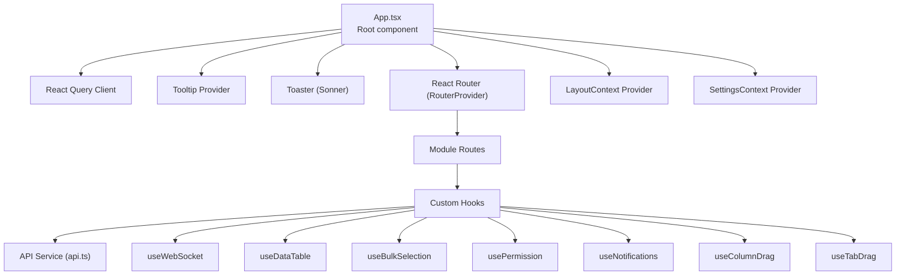

**Diagram sources**
- [App.tsx:5-27](file://frontend/src/App.tsx#L5-L27)
- [api.ts:31-209](file://frontend/src/lib/api.ts#L31-L209)

**Section sources**
- [App.tsx:5-27](file://frontend/src/App.tsx#L5-L27)

## Core Components
- React Query provider: Centralized caching and synchronization for server data
- API service: Unified HTTP client with token injection and 401 handling
- Context providers: LayoutContext for page metadata and SettingsContext for UI/theme/prefs and reference data
- Custom hooks: useDataTable, useNotifications, usePermission, useBulkSelection, useColumnDrag, useTabDrag, useWebSocket

**Section sources**
- [App.tsx:5-7](file://frontend/src/App.tsx#L5-L7)
- [api.ts:31-209](file://frontend/src/lib/api.ts#L31-L209)
- [LayoutContext.tsx:25-55](file://frontend/src/context/LayoutContext.tsx#L25-L55)
- [SettingsContext.tsx:83-299](file://frontend/src/context/SettingsContext.tsx#L83-L299)

## Architecture Overview
The state architecture combines centralized caching (React Query), local UI state (Context), and domain-specific hooks. Data flows from the API service to React Query caches and Context stores, while UI components consume derived state and trigger mutations.

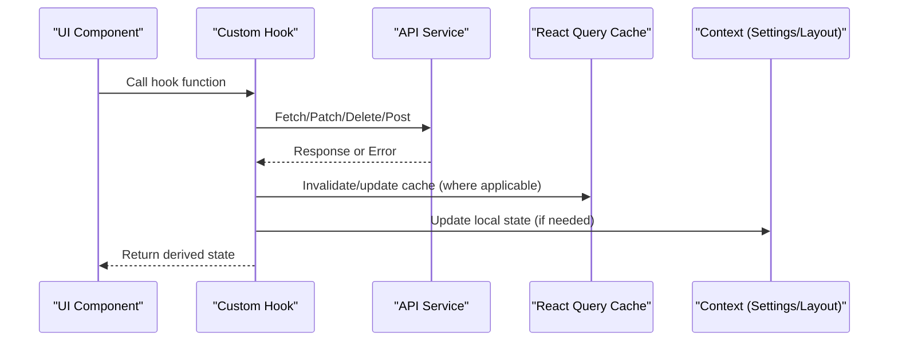

**Diagram sources**
- [App.tsx:5-7](file://frontend/src/App.tsx#L5-L7)
- [api.ts:31-209](file://frontend/src/lib/api.ts#L31-L209)
- [SettingsContext.tsx:151-203](file://frontend/src/context/SettingsContext.tsx#L151-L203)
- [useNotifications.ts:23-36](file://frontend/src/hooks/useNotifications.ts#L23-L36)

## Detailed Component Analysis

### React Query Integration
- Initialization: A single QueryClient is created at the root and provided to the app.
- Purpose: Enables caching, background refetching, optimistic updates, and cache invalidation across modules.
- Usage pattern: Hooks call the API service; React Query manages cache keys, stale times, and invalidations.

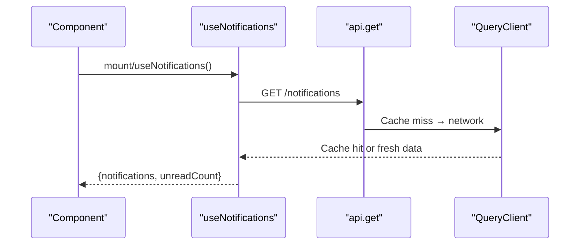

**Diagram sources**
- [App.tsx:5-7](file://frontend/src/App.tsx#L5-L7)
- [useNotifications.ts:23-36](file://frontend/src/hooks/useNotifications.ts#L23-L36)
- [api.ts:31-80](file://frontend/src/lib/api.ts#L31-L80)

**Section sources**
- [App.tsx:5-7](file://frontend/src/App.tsx#L5-L7)

### API Service Layer and Error Handling
- Authentication: Injects x-user-id and optional Authorization (Bearer) headers from localStorage.
- 401 handling: Clears tokens (titan_token, titan_user_id, titan_user_role) and redirects to login.
- Error propagation: Throws structured errors with status and message; 403 special case.
- Loading states: Consumers manage loading via hook state or React Suspense/Query suspense.

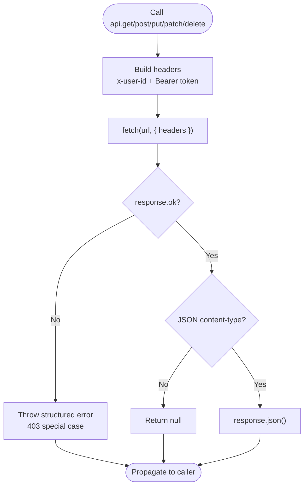

**Diagram sources**
- [api.ts:15-209](file://frontend/src/lib/api.ts#L15-L209)

**Section sources**
- [api.ts:15-209](file://frontend/src/lib/api.ts#L15-L209)

### Local State Management: Context Providers

#### LayoutContext
- Purpose: Centralizes page-level metadata (title, subtitle, breadcrumbs, actions).
- Pattern: Separate state and dispatch contexts; memoized values prevent unnecessary re-renders.
- Usage: usePageSettings sets transient page metadata; useLayout reads combined state/dispatch.

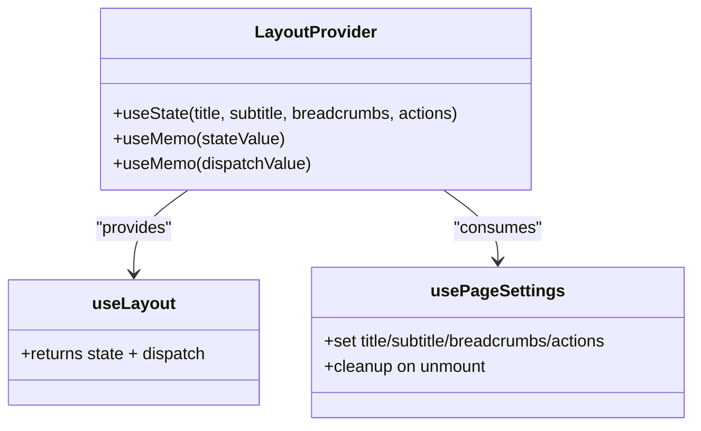

**Diagram sources**
- [LayoutContext.tsx:25-97](file://frontend/src/context/LayoutContext.tsx#L25-L97)

**Section sources**
- [LayoutContext.tsx:25-97](file://frontend/src/context/LayoutContext.tsx#L25-L97)

#### SettingsContext
- Purpose: Manages UI/theme preferences, density, font size, accent color, sidebar collapse, and reference data (statuses, tags, priorities, quick actions, legal forms, positions, modules, tax regimes, contractor types).
- Persistence: Loads from API and localStorage; saves to API on change; applies CSS variables dynamically (theme, accent, density, table font size).
- Concurrency: Uses callbacks to apply theme/density/accent to DOM; loadData reloads all settings.
- CRUD: Provides methods to add/update/delete reference items, manage legal forms, and reorder quick actions.

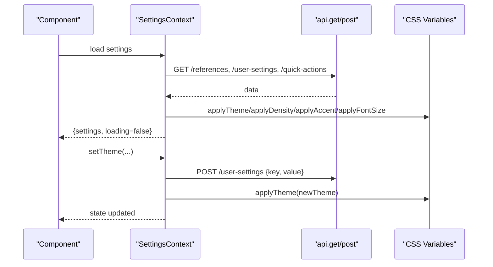

**Diagram sources**
- [SettingsContext.tsx:83-299](file://frontend/src/context/SettingsContext.tsx#L83-L299)
- [api.ts:31-209](file://frontend/src/lib/api.ts#L31-L209)

**Section sources**
- [SettingsContext.tsx:83-299](file://frontend/src/context/SettingsContext.tsx#L83-L299)

### Custom Hooks Patterns

#### useDataTable
- Responsibilities: Search, sort, selection, column visibility/order, tabs config, column widths, pagination, and persistence to user settings.
- Persistence: Loads and saves to /user-settings with keys like {storageKey}-columns, {storageKey}-column-order, {storageKey}-tabs, {storageKey}-pagination, {storageKey}-column-widths.
- Dynamic tabs: Maintains a ref (savedTabVisibilityRef) of saved visibility for tabs loaded after initial API fetch.
- Additional helpers: moveTab, reorderTab, injectTabColumns, toggleColumnVisibility, moveColumn, reorderColumn, setColumnWidth.

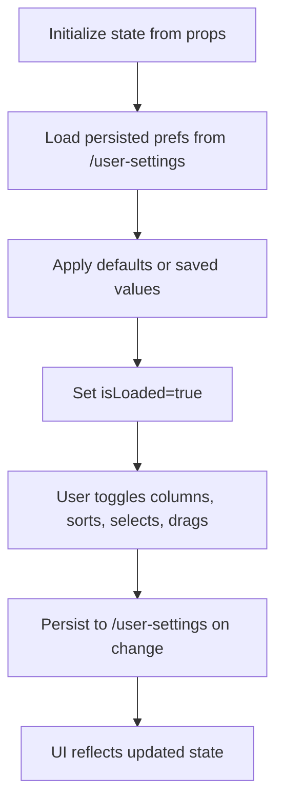

**Diagram sources**
- [useDataTable.ts:33-401](file://frontend/src/hooks/useDataTable.ts#L33-L401)

**Section sources**
- [useDataTable.ts:33-401](file://frontend/src/hooks/useDataTable.ts#L33-L401)

#### useNotifications
- Responsibilities: Fetch notifications, mark as read, mark all as read, delete, compute unread count, refresh on WebSocket events, poll every 60 seconds as fallback.
- Integration: Subscribes to WebSocket messages; on a `notification` event, refreshes the list.

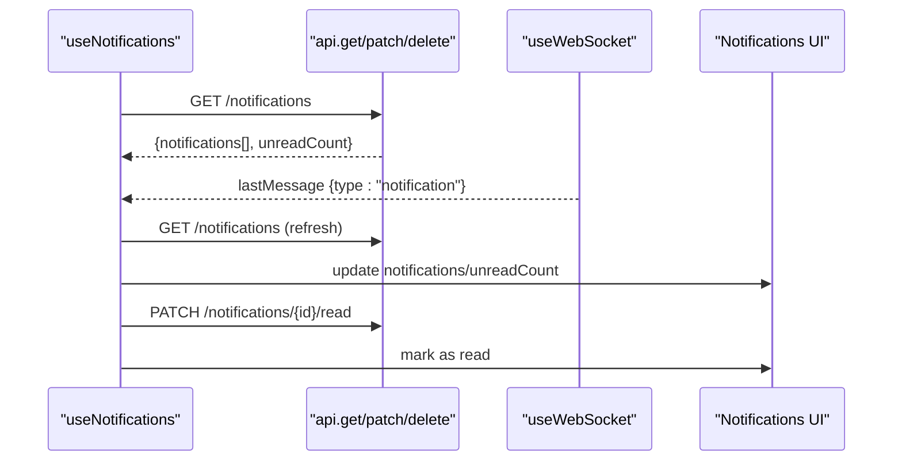

**Diagram sources**
- [useNotifications.ts:15-102](file://frontend/src/hooks/useNotifications.ts#L15-L102)
- [useWebSocket.ts:157-253](file://frontend/src/hooks/useWebSocket.ts#L157-L253)

**Section sources**
- [useNotifications.ts:15-102](file://frontend/src/hooks/useNotifications.ts#L15-L102)

#### usePermission
- Responsibilities: Load user role and permissions, support wildcard admin, expose helpers for permission checks (hasPermission, hasAnyPermission, hasAllPermissions, getRole, isAdmin).
- Fallback: On failure, falls back to role from localStorage.

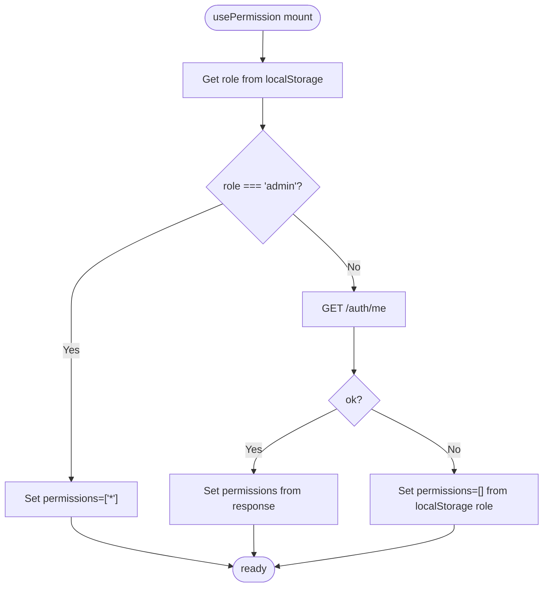

**Diagram sources**
- [usePermission.ts:17-112](file://frontend/src/hooks/usePermission.ts#L17-L112)

**Section sources**
- [usePermission.ts:17-112](file://frontend/src/hooks/usePermission.ts#L17-L112)

#### useBulkSelection
- Responsibilities: Compute selection states across current page/all pages, toggle selections, clear, select current page only, and expose counts.
- Inputs: allData, pageData, selectedIds, getId.

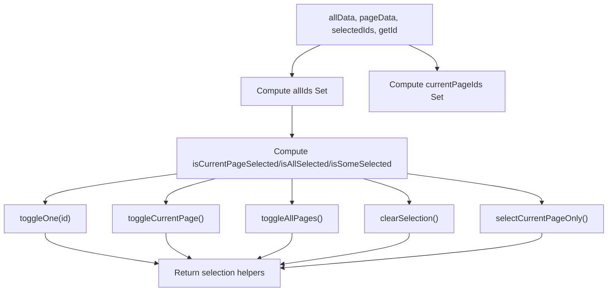

**Diagram sources**
- [useBulkSelection.ts:67-172](file://frontend/src/hooks/useBulkSelection.ts#L67-L172)

**Section sources**
- [useBulkSelection.ts:67-172](file://frontend/src/hooks/useBulkSelection.ts#L67-L172)

#### Drag-and-Drop Hooks
- useColumnDrag: Long-press drag-and-drop for table columns (400 ms); supports quick sort on short press.
- useTabDrag: Grip-based drag-and-drop for tabs.

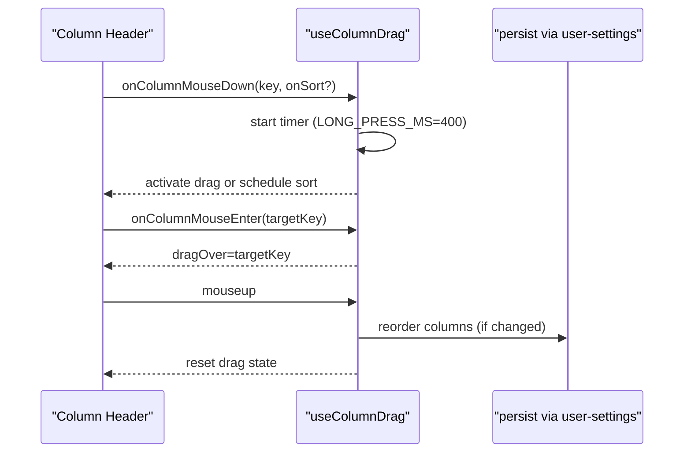

**Diagram sources**
- [useColumnDrag.ts:15-80](file://frontend/src/hooks/useColumnDrag.ts#L15-L80)

**Section sources**
- [useColumnDrag.ts:15-80](file://frontend/src/hooks/useColumnDrag.ts#L15-L80)
- [useTabDrag.ts:11-55](file://frontend/src/hooks/useTabDrag.ts#L11-L55)

#### useWebSocket
- Responsibilities: Manage a single global WebSocket connection shared across consumers, broadcast messages to listeners, auto-reconnect, and expose subscribe/unsubscribe/send/connect/disconnect.
- Events: Handles connection, ping/pong, new_mail (toast + callbacks), sync_status (toast + callbacks), mail_sent (toast); updates internal state and notifies listeners.

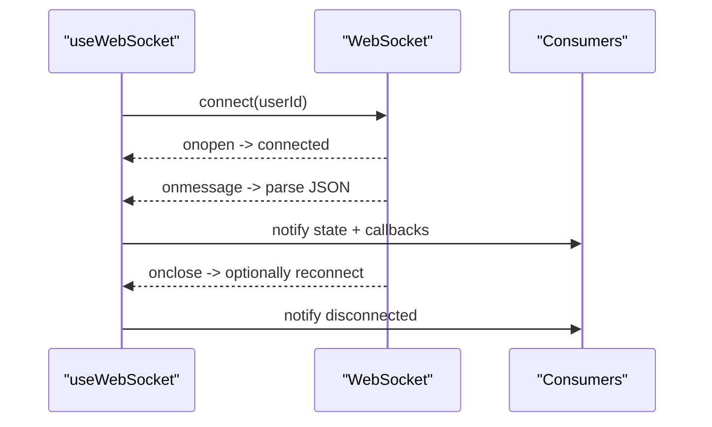

**Diagram sources**
- [useWebSocket.ts:59-253](file://frontend/src/hooks/useWebSocket.ts#L59-L253)

**Section sources**
- [useWebSocket.ts:59-253](file://frontend/src/hooks/useWebSocket.ts#L59-L253)

### Data Synchronization Patterns, Optimistic Updates, and Cache Invalidation
- Synchronization: useNotifications polls every 60 seconds and refreshes on WebSocket notification events.
- Optimistic updates: Not currently implemented in the reviewed hooks; recommended approach is to update UI immediately and rollback on error.
- Cache invalidation: React Query invalidates queries on mutation success; for user settings persistence, direct POST to /user-settings is used to keep UI and server in sync.

**Section sources**
- [useNotifications.ts:84-91](file://frontend/src/hooks/useNotifications.ts#L84-L91)
- [useDataTable.ts:173-245](file://frontend/src/hooks/useDataTable.ts#L173-L245)

### Mobile Responsiveness and Accessibility
- A `use-mobile` hook (use-mobile.tsx) exposes an `isMobile` flag based on a Tailwind md breakpoint matchMedia query. Responsive breakpoints and touch-friendly gestures are integrated in components consuming useDataTable and the drag hooks.

**Section sources**
- [useDataTable.ts:33-401](file://frontend/src/hooks/useDataTable.ts#L33-L401)
- [use-mobile.tsx:1-50](file://frontend/src/hooks/use-mobile.tsx#L1-L38)

## Dependency Analysis
- App.tsx depends on React Query provider and exposes routes/modules.
- Hooks depend on the API service and optional WebSocket hook.
- Context providers encapsulate state and persistence logic, reducing prop drilling.

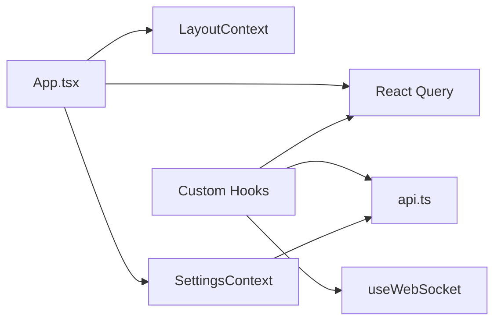

**Diagram sources**
- [App.tsx:5-7](file://frontend/src/App.tsx#L5-L7)
- [api.ts:31-209](file://frontend/src/lib/api.ts#L31-L209)
- [SettingsContext.tsx:83-299](file://frontend/src/context/SettingsContext.tsx#L83-L299)

**Section sources**
- [App.tsx:5-7](file://frontend/src/App.tsx#L5-L7)
- [api.ts:31-209](file://frontend/src/lib/api.ts#L31-L209)

## Performance Considerations
- Memoization: useDataTable memoizes computed values; SettingsContext memoizes state/dispatch; useBulkSelection computes derived states efficiently.
- Minimal re-renders: Context values are memoized; avoid passing new objects/functions down the tree.
- Debounced persistence: useDataTable persists settings via lastSaved* refs, skipping redundant writes.
- Efficient polling: useNotifications polls every 60 seconds; consider throttling or pausing when tab is inactive.
- WebSocket reuse: useWebSocket maintains a single global connection shared by all consumers.

[No sources needed since this section provides general guidance]

## Troubleshooting Guide
- 401 Unauthorized: API clears tokens and redirects to login; ensure localStorage contains valid titan_token and titan_user_id.
- Permission failures: usePermission falls back to localStorage role if API fails; verify role presence.
- Notifications not updating: Confirm WebSocket connection and that lastMessage.type equals "notification"; verify polling interval.
- Settings not persisting: Check POST to /user-settings; ensure storage keys match expected patterns.
- Drag-and-drop not activating: useColumnDrag requires a 400 ms long press; useTabDrag requires the grip icon.

**Section sources**
- [api.ts:53-61](file://frontend/src/lib/api.ts#L53-L61)
- [usePermission.ts:21-49](file://frontend/src/hooks/usePermission.ts#L21-L49)
- [useNotifications.ts:84-91](file://frontend/src/hooks/useNotifications.ts#L84-L91)
- [useDataTable.ts:173-245](file://frontend/src/hooks/useDataTable.ts#L173-L245)
- [useColumnDrag.ts:4](file://frontend/src/hooks/useColumnDrag.ts#L4)

## Conclusion
Titan CRM employs a layered state management strategy:
- React Query for robust caching and synchronization
- Context providers for UI and settings state
- Custom hooks encapsulating domain logic and persistence
- A unified API service with clear error handling
Adhering to these patterns ensures predictable state updates, efficient performance, and maintainable extensions.

[No sources needed since this section summarizes without analyzing specific files]

## Appendices

### Implementing a New State Management Pattern
- Define a dedicated hook with clear inputs/outputs and encapsulated side effects.
- Prefer React Query for server data; use Context for UI state and preferences.
- Persist user preferences via /user-settings and invalidate caches appropriately.
- Use memoization and refs to minimize re-renders and optimize performance.
- Add WebSocket integration for real-time updates where applicable.

[No sources needed since this section provides general guidance]
