# UI Components Library

<cite>
**Referenced Files in This Document**
- [tailwind.config.ts](file://frontend/tailwind.config.ts)
- [package.json](file://frontend/package.json)
- [ui/index.ts](file://frontend/src/components/ui/index.ts)
- [button.tsx](file://frontend/src/components/ui/button.tsx)
- [input.tsx](file://frontend/src/components/ui/input.tsx)
- [dialog.tsx](file://frontend/src/components/ui/dialog.tsx)
- [data-table.tsx](file://frontend/src/components/ui/data-table.tsx)
- [status-system/index.ts](file://frontend/src/components/ui/status-system/index.ts)
- [Badge.tsx](file://frontend/src/components/ui/status-system/Badge.tsx)
- [Tag.tsx](file://frontend/src/components/ui/status-system/Tag.tsx)
- [status-system.hooks.ts](file://frontend/src/components/ui/status-system/status-system.hooks.ts)
- [status-system.api.ts](file://frontend/src/components/ui/status-system/status-system.api.ts)
- [types.ts](file://frontend/src/components/ui/status-system/types.ts)
- [shared/index.ts](file://frontend/src/components/shared/index.ts)
- [DataTableToolbar.tsx](file://frontend/src/components/shared/DataTableToolbar.tsx)
- [BulkEditDialog.tsx](file://frontend/src/components/shared/BulkEditDialog.tsx)
</cite>

## Table of Contents
1. [Introduction](#introduction)
2. [Project Structure](#project-structure)
3. [Core Components](#core-components)
4. [Architecture Overview](#architecture-overview)
5. [Detailed Component Analysis](#detailed-component-analysis)
6. [Dependency Analysis](#dependency-analysis)
7. [Performance Considerations](#performance-considerations)
8. [Troubleshooting Guide](#troubleshooting-guide)
9. [Conclusion](#conclusion)
10. [Appendices](#appendices)

## Introduction
This document describes the UI components library built with Radix UI primitives and Tailwind CSS. It explains the design system principles, component architecture, styling methodology, and usage patterns. It covers the component hierarchy from low-level primitives (button, input, dialog) to composite components (data tables, forms, modals), and details the status system components (badges, tags, priority indicators, outcome displays). It also documents shared components such as DataTableToolbar, BulkEditDialog, and ConfirmDialog, along with props, customization options, theme integration, accessibility features, responsive design, dark mode support, and composition strategies.

## Project Structure
The UI library is organized into two main areas:
- Primitive and composite UI components under `frontend/src/components/ui`
- Shared reusable components under `frontend/src/components/shared`

The design system relies on:
- Radix UI for accessible, headless primitives (`@radix-ui/*`, ~20 packages)
- Tailwind CSS for utility-first styling and theme tokens
- Class Variance Authority (cva) for variant-driven component styling
- React components composed from Radix UI and Tailwind utilities

Both directories are exported through barrel files:
- `ui/index.ts:1-13` re-exports 13 primitives (button, card, badge, input, label, select, tabs, StatsCard, CalendarWidget, StatusBadge, empty-state, skeleton, progress).
- `shared/index.ts:1-24` re-exports ~24 shared components (DataTableToolbar + BulkActionButton/BulkDeleteButton, SheetTabSettings, QuickActionsBar, UserSelect, TableFooterPagination, TableSortIcon, SortableTableHead, SortableTabsList, TableUtilityHead, EntityCombobox, DiscardChangesDialog, BulkEditDialog, ConfirmDialog, TableHeaderCheckbox, ValidationErrorToast, ResizableSheet, EmptyState, TimelineEventForm, SmartMetadataGrid, CommentsSection, OnboardingWizard) plus the `useBulkSelection` hook and bulk-edit types.

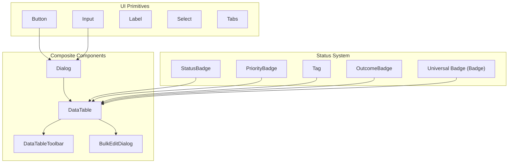

**Diagram sources**
- [ui/index.ts:1-13](file://frontend/src/components/ui/index.ts#L1-L13)
- [dialog.tsx:1-95](file://frontend/src/components/ui/dialog.tsx#L1-L95)
- [data-table.tsx:1-484](file://frontend/src/components/ui/data-table.tsx#L1-L484)
- [DataTableToolbar.tsx:1-305](file://frontend/src/components/shared/DataTableToolbar.tsx#L1-L305)
- [BulkEditDialog.tsx:1-262](file://frontend/src/components/shared/BulkEditDialog.tsx#L1-L262)
- [Badge.tsx:1-505](file://frontend/src/components/ui/status-system/Badge.tsx#L1-L505)
- [Tag.tsx:1-337](file://frontend/src/components/ui/status-system/Tag.tsx#L1-L337)

**Section sources**
- [ui/index.ts:1-13](file://frontend/src/components/ui/index.ts#L1-L13)
- [shared/index.ts:1-24](file://frontend/src/components/shared/index.ts#L1-L24)
- [tailwind.config.ts:1-111](file://frontend/tailwind.config.ts#L1-L111)

## Core Components
This section outlines the foundational building blocks and their design principles.

- Button
  - Uses cva for variants and sizes, supports `asChild` via Radix Slot, and integrates focus-visible ring styles.
  - Props include variant, size, asChild, and standard HTML attributes.
  - Accessibility: inherits native button semantics and keyboard interaction; disabled state applies `pointer-events-none` and `opacity-50`.

- Input
  - Utility-first Tailwind classes define focus states, disabled states, and responsive typography (`text-base md:text-sm`).
  - Props include type and standard HTML attributes.

- Dialog
  - Composed from Radix UI primitives: Root, Portal, Overlay, Content, Title, Description, Trigger, Close.
  - Includes animated transitions (fade/zoom/slide via `data-[state=*]` classes) and a close button with screen-reader label.
  - Accessibility: manages focus trapping and ARIA attributes via Radix.

- DataTable
  - Composite table with toolbar, sorting, filtering, pagination, selection, and optional virtualization via react-virtuoso.
  - Integrates with shared components like TableHeaderCheckbox, SortableTableHead, EmptyState, and DataTableToolbar.
  - Supports bulk actions, empty states, skeleton loaders, and mobile card mode.

- Status System
  - Barrel (`status-system/index.ts:1-110`) exposes types, an API layer, TanStack Query hooks, legacy components (StatusBadge/StatusDot/StatusSelect, Tag/TagList/TagInput, PriorityBadge/PrioritySelect/PriorityGroup, OutcomeBadge/OutcomeDot/OutcomeSelect) and a new unified Badge system.
  - Badge: universal component for status, priority, tag, and outcome with extensive customization (variants, sizes, shapes, gradients, glass, animations, in-place style picker).
  - Tag: specialized badge with remove, click, and category support; TagList and TagInput for lists and input.

**Section sources**
- [button.tsx:1-50](file://frontend/src/components/ui/button.tsx#L1-L50)
- [input.tsx:1-22](file://frontend/src/components/ui/input.tsx#L1-L22)
- [dialog.tsx:1-95](file://frontend/src/components/ui/dialog.tsx#L1-L95)
- [data-table.tsx:1-484](file://frontend/src/components/ui/data-table.tsx#L1-L484)
- [status-system/index.ts:1-110](file://frontend/src/components/ui/status-system/index.ts#L1-L110)
- [Badge.tsx:1-505](file://frontend/src/components/ui/status-system/Badge.tsx#L1-L505)
- [Tag.tsx:1-337](file://frontend/src/components/ui/status-system/Tag.tsx#L1-L337)

## Architecture Overview
The library follows a layered architecture:
- Primitives: Radix UI + Tailwind utilities
- Variants: cva-based styling for consistent variants and sizes
- Composition: composite components assemble primitives and variants
- Status System: centralized configuration, TanStack Query hooks and runtime display logic, persisted in the database
- Shared: reusable UI helpers and dialogs, exported via a barrel

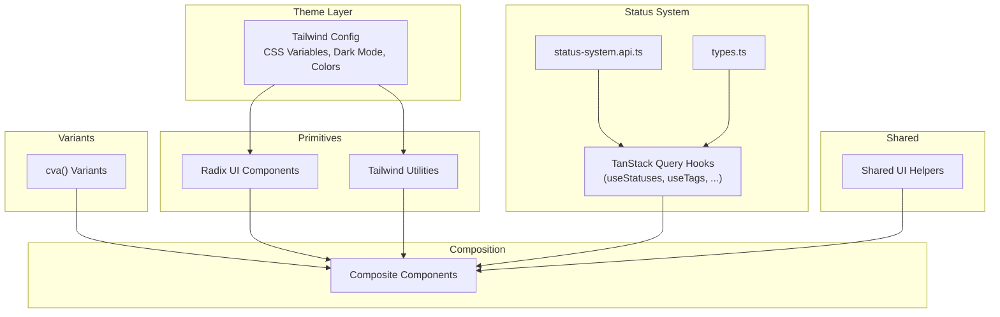

**Diagram sources**
- [tailwind.config.ts:1-111](file://frontend/tailwind.config.ts#L1-L111)
- [button.tsx:8-32](file://frontend/src/components/ui/button.tsx#L8-L32)
- [status-system/index.ts:52-69](file://frontend/src/components/ui/status-system/index.ts#L52-L69)
- [status-system.hooks.ts:1-536](file://frontend/src/components/ui/status-system/status-system.hooks.ts#L1-L536)
- [Badge.tsx:195-257](file://frontend/src/components/ui/status-system/Badge.tsx#L195-L257)
- [data-table.tsx:1-484](file://frontend/src/components/ui/data-table.tsx#L1-L484)
- [DataTableToolbar.tsx:1-305](file://frontend/src/components/shared/DataTableToolbar.tsx#L1-L305)
- [BulkEditDialog.tsx:1-262](file://frontend/src/components/shared/BulkEditDialog.tsx#L1-L262)

## Detailed Component Analysis

### Button
- Purpose: Unified button with variants (default, destructive, outline, secondary, ghost, link) and sizes (default, sm, lg, icon).
- Implementation: cva defines base + variant + size classes (`button.tsx:8-32`); `asChild` allows rendering as another element via Radix Slot; `cn` merges classes.
- Accessibility: Inherits button semantics; focus-visible ring and disabled pointer-events.

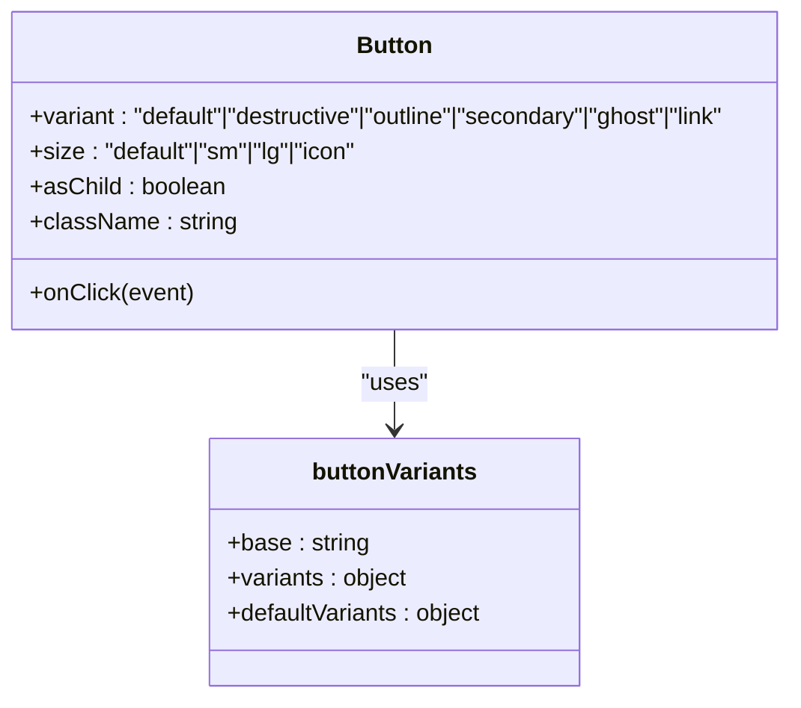

**Diagram sources**
- [button.tsx:8-32](file://frontend/src/components/ui/button.tsx#L8-L32)

**Section sources**
- [button.tsx:1-50](file://frontend/src/components/ui/button.tsx#L1-L50)

### Input
- Purpose: Text input with consistent focus states, disabled state, and responsive typography.
- Implementation: Tailwind classes for border, background, focus ring, and responsive text size (`text-base md:text-sm`).

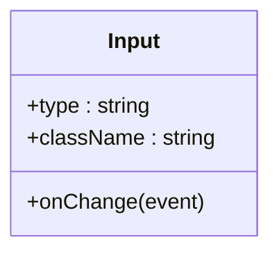

**Diagram sources**
- [input.tsx:5-20](file://frontend/src/components/ui/input.tsx#L5-L20)

**Section sources**
- [input.tsx:1-22](file://frontend/src/components/ui/input.tsx#L1-L22)

### Dialog
- Purpose: Modal overlay with animated entrance/exit, focus management, and close controls.
- Implementation: Radix UI primitives; overlay and content include animation classes (fade, zoom, slide from top); close button with `sr-only` label. Exports Dialog, DialogPortal, DialogOverlay, DialogClose, DialogTrigger, DialogContent, DialogHeader, DialogFooter, DialogTitle, DialogDescription.

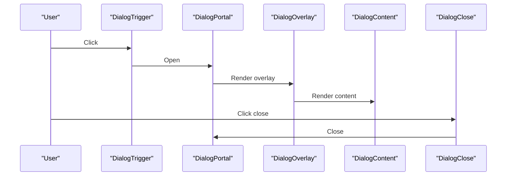

**Diagram sources**
- [dialog.tsx:7-52](file://frontend/src/components/ui/dialog.tsx#L7-L52)

**Section sources**
- [dialog.tsx:1-95](file://frontend/src/components/ui/dialog.tsx#L1-L95)

### DataTable
- Purpose: Feature-rich table with search, filters, sorting, pagination, selection, and optional virtualization.
- Key features:
  - Toolbar: search, filters, column visibility/toggle, tab ordering, bulk-action mode.
  - Header: sticky sortable columns with resize support (SortableTableHead) and a TableHeaderCheckbox with a "select current page / all pages" dropdown.
  - Body: virtualized rows via react-virtuoso (TableVirtuoso) with colgroup-driven column widths; fallback static table with skeleton loaders and empty state.
  - Pagination: configurable rows per page (5/10/25/50/100/all), page navigation with ellipsis compression.
  - Mobile cards: `enableMobileCards` applies the `table-mobile-cards` class to reflow rows into cards on small screens.
  - Row ID resolution: `getItemId` (`data-table.tsx:149-159`) uses `getRowId` prop, falls back to `item.id`, then to typical wrappers (`item.project.id`, `item.task.id`, `item.invoice.id`).
- Props: `table` (DataTableState), `data`, `columnLabels`, `totalCount`, `renderRow`, `filters`, `bulkActions`, `onBulkDelete`, `virtualized`, `virtualHeight`, `getRowId`, `isLoading`, empty-state props, `enableMobileCards`, `hideToolbar`, `hidePagination`.

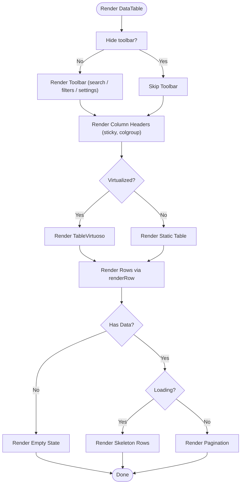

**Diagram sources**
- [data-table.tsx:93-484](file://frontend/src/components/ui/data-table.tsx#L93-L484)

**Section sources**
- [data-table.tsx:1-484](file://frontend/src/components/ui/data-table.tsx#L1-L484)

### Status System
The status system is a self-contained subsystem under `frontend/src/components/ui/status-system`:
- `types.ts:1-418` — shared types (Status, Tag, Priority, Outcome, DisplayConfig, request/response types).
- `status-system.api.ts:1-219` — REST API wrappers for CRUD operations on statuses, tags, priorities, outcomes.
- `status-system.hooks.ts:1-536` — TanStack Query hooks: useStatuses, useCreateStatus, useUpdateStatus, useDeleteStatus, useTags, useCreateTag, useUpdateTag, useDeleteTag, usePriorities, useCreatePriority, useUpdatePriority, useDeletePriority, useOutcomes, useCreateOutcome, useUpdateOutcome, useDeleteOutcome.
- Legacy display components: StatusBadge/StatusDot/StatusSelect, Tag/TagList/TagInput, PriorityBadge/PrioritySelect/PriorityGroup, OutcomeBadge/OutcomeDot/OutcomeSelect.
- New unified Badge system (see below).

#### Status System: Badge
- Purpose: Universal badge for status, priority, tag, and outcome with rich customization; data (name/color/variant/shape/icon) is loaded from the database through hooks.
- Features:
  - Variants: solid, soft, outline, ghost, secondary
  - Sizes: xs, sm, md, lg
  - Shapes: square, rounded, pill, left-pill, right-pill, top-pill, bottom-pill, bubble, stadium
  - Effects: gradient, glass, animation (`animate-pulse-subtle`), dot indicator, icon (Lucide by name), uppercase, noWrap
  - Interactions: clickable (Enter/Space keyboard support, role=button), disabled state, hover scale
  - Style picker: 10 predefined presets (`BADGE_PRESETS`) with inline editing via Popover for authorized users
  - Overrides: props take priority over database config; `module` prop disambiguates colliding IDs
- Props: id, type, name, color, variant, size, shape, onClick, disabled, className, title, showDot, uppercase, noWrap, module, icon, isGlass, isGradient, secondaryColor, isAnimated, children, showLabel, allowStyleEdit.

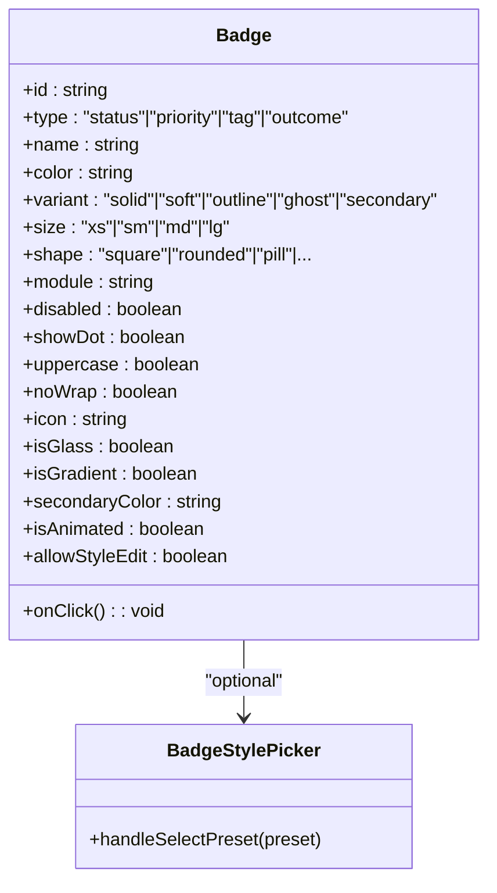

**Diagram sources**
- [Badge.tsx:87-123](file://frontend/src/components/ui/status-system/Badge.tsx#L87-L123)
- [Badge.tsx:330-420](file://frontend/src/components/ui/status-system/Badge.tsx#L330-L420)

**Section sources**
- [Badge.tsx:1-505](file://frontend/src/components/ui/status-system/Badge.tsx#L1-L505)

#### Status System: Tag
- Purpose: Tag display with dynamic color loaded from the database (fallback: color generated from the name), optional remove button, and interactive variants.
- Features:
  - Legacy `rounded` mapping to new shapes (none→square, sm/md→rounded, full→pill)
  - TagList for compact display with overflow indicator
  - TagInput with suggestions (module-scoped via `useTags({ module })`) and creation flow
- Props: tagId, name, color, className, size, variant, rounded, onRemove, onClick, disabled, title, icon, category.

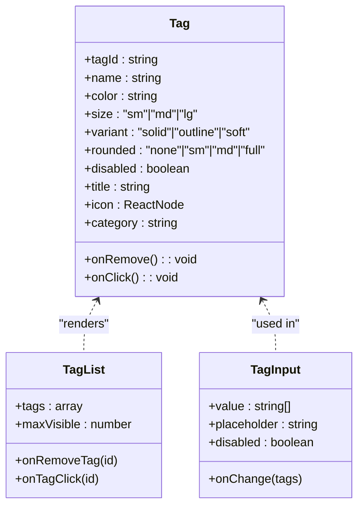

**Diagram sources**
- [Tag.tsx:30-57](file://frontend/src/components/ui/status-system/Tag.tsx#L30-L57)
- [Tag.tsx:148-182](file://frontend/src/components/ui/status-system/Tag.tsx#L148-L182)
- [Tag.tsx:195-314](file://frontend/src/components/ui/status-system/Tag.tsx#L195-L314)

**Section sources**
- [Tag.tsx:1-337](file://frontend/src/components/ui/status-system/Tag.tsx#L1-L337)

### Shared Components

#### DataTableToolbar
- Purpose: Reusable toolbar for DataTable with search (expandable), filters, column management, tab management, and a dedicated bulk-action mode.
- Also exports `BulkActionButton` (`DataTableToolbar.tsx:24-36`) and `BulkDeleteButton` (`DataTableToolbar.tsx:42-55`) for consistent custom bulk operations.
- Props: searchQuery/onSearchChange/searchPlaceholder, selectedCount/onCancelSelection/onBulkDelete, bulkActions, tabsConfig/onMoveTab/onToggleTab, visibleColumns/columnLabels/columnOrder/onMoveColumn/columnWidths/onColumnResize, filters/filterDropdownWidth, className.
- Modes: when `selectedCount > 0` renders a floating bulk-action bar; otherwise the standard toolbar.

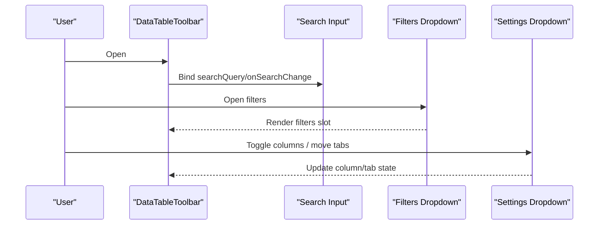

**Diagram sources**
- [DataTableToolbar.tsx:24-87](file://frontend/src/components/shared/DataTableToolbar.tsx#L24-L87)
- [DataTableToolbar.tsx:123-177](file://frontend/src/components/shared/DataTableToolbar.tsx#L123-L177)
- [DataTableToolbar.tsx:180-305](file://frontend/src/components/shared/DataTableToolbar.tsx#L180-L305)

**Section sources**
- [DataTableToolbar.tsx:1-305](file://frontend/src/components/shared/DataTableToolbar.tsx#L1-L305)

#### BulkEditDialog
- Purpose: Dialog to bulk edit records across multiple modules with field-specific editors (select, combobox, text, number, date, boolean, tags).
- Features:
  - Dynamic field loading from module settings (`GET /module-settings/{moduleId}/bulk-edit/enabled`) when `fields` prop is not provided
  - Reference data resolution for field options (dataSource keys with fallback matching)
  - Combobox creation flow for supported entities (projects, tasks, contractors, tags) via `POST /projects`, `/tasks`, `/contractors`, `/references/defined_tags`
  - TagMultiSelect for tag fields; toast feedback and validation
- Props: open/onOpenChange/onConfirm, count, moduleId, fields/title/description/referenceData.

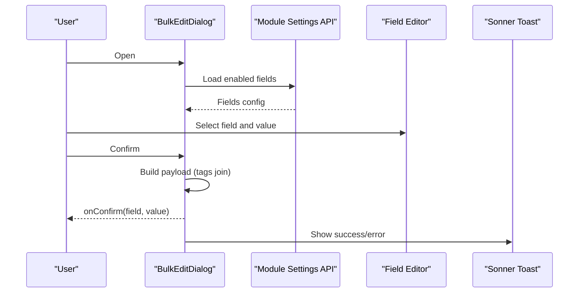

**Diagram sources**
- [BulkEditDialog.tsx:29-39](file://frontend/src/components/shared/BulkEditDialog.tsx#L29-L39)
- [BulkEditDialog.tsx:60-77](file://frontend/src/components/shared/BulkEditDialog.tsx#L60-L77)
- [BulkEditDialog.tsx:100-112](file://frontend/src/components/shared/BulkEditDialog.tsx#L100-L112)
- [BulkEditDialog.tsx:179-262](file://frontend/src/components/shared/BulkEditDialog.tsx#L179-L262)

**Section sources**
- [BulkEditDialog.tsx:1-262](file://frontend/src/components/shared/BulkEditDialog.tsx#L1-L262)

## Dependency Analysis
External dependencies relevant to the UI library (`package.json:21-101`):
- Radix UI packages for accessible primitives (~20 `@radix-ui/*` packages)
- Tailwind CSS and related plugins (tailwindcss-animate, @tailwindcss/typography) for styling and animations
- Sonner for toast notifications
- Next Themes for theme switching (dark mode)
- Class Variance Authority, clsx, and tailwind-merge for variant composition
- react-virtuoso for virtualized tables
- Additional UI-relevant: lucide-react (icons), cmdk, react-day-picker, embla-carousel-react, react-resizable-panels, vaul, @dnd-kit/* (drag and drop), react-hook-form + zod (forms), @tiptap/* (rich text), @xyflow/react (flow graphs), recharts (charts)

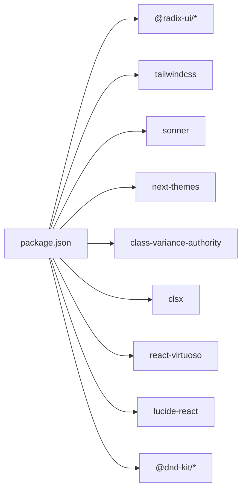

**Diagram sources**
- [package.json:21-101](file://frontend/package.json#L21-L101)

**Section sources**
- [package.json:1-128](file://frontend/package.json#L1-L128)

## Performance Considerations
- DataTable virtualization: react-virtuoso is used to render large datasets efficiently by only rendering visible rows (with `increaseViewportBy={200}`).
- Skeleton loaders: DataTable shows skeleton rows while loading to maintain perceived performance.
- Conditional rendering: Toolbar switches between bulk-action and standard modes to avoid unnecessary DOM nodes.
- colgroup-driven column widths: header and body share widths without per-cell style recalculations; column resizing persists via useDataTable.
- CSS variables and Tailwind utilities: Efficiently compute styles without heavy JS logic.
- TanStack Query: status-system data (statuses/tags/priorities/outcomes) is cached and shared across the app.

[No sources needed since this section provides general guidance]

## Troubleshooting Guide
- Dialog focus issues: Ensure DialogTrigger and DialogClose are properly used; Radix manages focus automatically but incorrect nesting can cause issues.
- Button disabled state: Verify the `disabled` prop is passed; `disabled:pointer-events-none disabled:opacity-50` are applied by the base cva classes.
- DataTable selection: Confirm `getRowId` (or `item.id` / nested `project/task/invoice` wrappers) resolves to a stable identifier; otherwise selection state may not persist across pages.
- Badge interactivity: For clickable badges, ensure `onClick` is provided; the component then sets `role=button`, `tabIndex=0` and handles Enter/Space activation.
- Badge ID collisions: When multiple modules share tag/status IDs, pass the `module` prop so the hook resolves the right database record.
- TagInput suggestions: Validate reference data availability; ensure module-scoped tags are loaded via `useTags({ module })` when using TagInput.
- DataTable ID resolution: For tree/nested data, `getItemId` (`data-table.tsx:149-159`) searches `project`, `task`, `invoice` wrappers automatically.

**Section sources**
- [dialog.tsx:1-95](file://frontend/src/components/ui/dialog.tsx#L1-L95)
- [button.tsx:8-32](file://frontend/src/components/ui/button.tsx#L8-L32)
- [data-table.tsx:149-159](file://frontend/src/components/ui/data-table.tsx#L149-L159)
- [Badge.tsx:282-291](file://frontend/src/components/ui/status-system/Badge.tsx#L282-L291)
- [Tag.tsx:208-314](file://frontend/src/components/ui/status-system/Tag.tsx#L208-L314)

## Conclusion
The UI components library leverages Radix UI and Tailwind CSS to deliver accessible, themeable, and composable components. The design system centers around cva-based variants, a robust status system with database-driven dynamic theming and TanStack Query hooks, and reusable shared components exported through barrels. Composite components like DataTable integrate primitives and shared helpers to provide powerful, customizable experiences with strong accessibility and performance characteristics.

[No sources needed since this section summarizes without analyzing specific files]

## Appendices

### Design System Principles
- Accessible primitives: Built on Radix UI for proper semantics and keyboard navigation.
- Theme tokens: Tailwind CSS variables enable consistent colors, spacing, and typography across light and dark modes.
- Variant-driven components: cva ensures predictable styling and easy customization.
- Responsive defaults: Tailwind utilities provide mobile-first responsive behavior out of the box (e.g., `table-mobile-cards` for DataTable on small screens).

**Section sources**
- [tailwind.config.ts:1-111](file://frontend/tailwind.config.ts#L1-L111)
- [button.tsx:8-32](file://frontend/src/components/ui/button.tsx#L8-L32)

### Theming and Dark Mode
- Tailwind dark mode configured via class strategy; CSS variables define semantic tokens for backgrounds, borders, accents, and status colors.
- Status system colors are stored in the database per status/priority/tag/outcome record and applied as inline styles (with `withAlpha`/`getContrastColor` helpers), enabling fully dynamic theming beyond static CSS variables.

**Section sources**
- [tailwind.config.ts:6-83](file://frontend/tailwind.config.ts#L6-L83)
- [Badge.tsx:195-257](file://frontend/src/components/ui/status-system/Badge.tsx#L195-L257)

### Accessibility Features
- Buttons and inputs inherit native semantics; focus-visible rings improve keyboard navigation.
- Dialogs manage focus trapping and ARIA attributes via Radix UI.
- Screen-reader labels included for close buttons and interactive elements.
- Keyboard support for badges (Enter/Space activation, `role=button`, `tabIndex`) and dialogs.

**Section sources**
- [button.tsx:34-40](file://frontend/src/components/ui/button.tsx#L34-L40)
- [dialog.tsx:45-48](file://frontend/src/components/ui/dialog.tsx#L45-L48)
- [Badge.tsx:282-291](file://frontend/src/components/ui/status-system/Badge.tsx#L282-L291)

### Component Composition Strategies
- Prefer composition over inheritance: Build complex components by combining primitives and shared helpers.
- Use props for configuration: Keep components flexible by accepting props for labels, callbacks, and state.
- Centralize state in higher-order components: For DataTable, pass a `table` state object (DataTableState) to encapsulate selection, sorting, pagination, and filters.
- Barrel exports: Import from `@/components/ui` and `@/components/shared` index files rather than deep paths.

**Section sources**
- [data-table.tsx:38-62](file://frontend/src/components/ui/data-table.tsx#L38-L62)
- [DataTableToolbar.tsx:57-87](file://frontend/src/components/shared/DataTableToolbar.tsx#L57-L87)
- [BulkEditDialog.tsx:29-39](file://frontend/src/components/shared/BulkEditDialog.tsx#L29-L39)
- [shared/index.ts:1-24](file://frontend/src/components/shared/index.ts#L1-L24)
