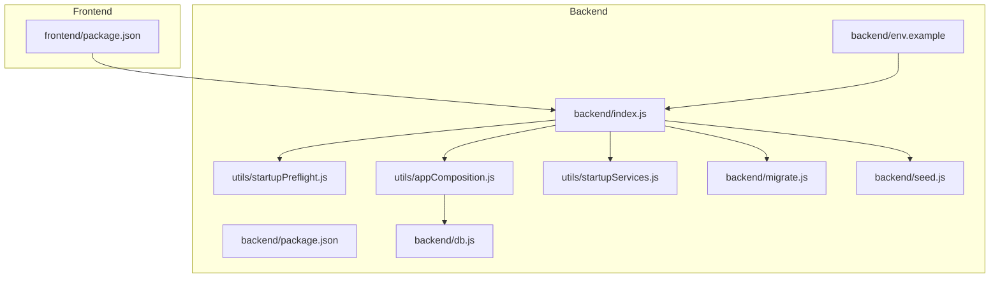
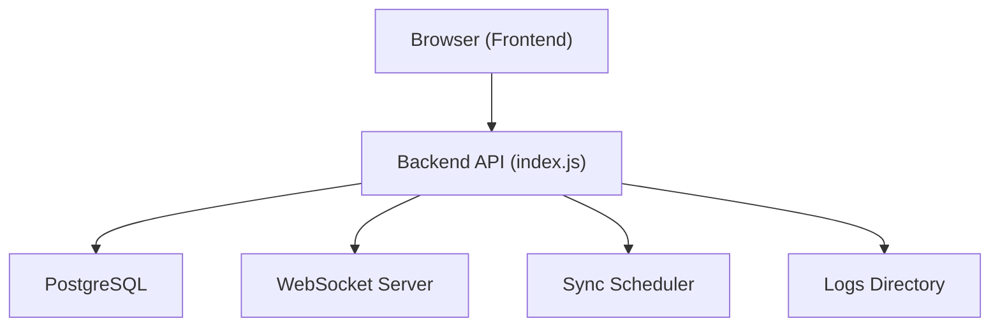
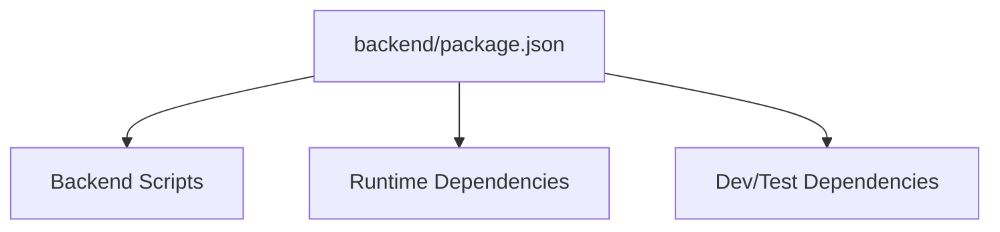

# Getting Started

<cite>
**Referenced Files in This Document**
- [backend/package.json](file://backend/package.json)
- [backend/env.example](file://backend/env.example)
- [backend/index.js](file://backend/index.js)
- [backend/db.js](file://backend/db.js)
- [backend/migrate.js](file://backend/migrate.js)
- [backend/seed.js](file://backend/seed.js)
- [backend/utils/startupPreflight.js](file://backend/utils/startupPreflight.js)
- [backend/utils/appComposition.js](file://backend/utils/appComposition.js)
- [backend/utils/startupServices.js](file://backend/utils/startupServices.js)
- [frontend/package.json](file://frontend/package.json)
- [init.sh](file://init.sh)
- [docs/SETUP_FROM_SCRATCH.md](file://docs/SETUP_FROM_SCRATCH.md)
- [backend/migrations/README.md](file://backend/migrations/README.md)
</cite>

## Table of Contents
1. [Introduction](#introduction)
2. [Project Structure](#project-structure)
3. [Core Components](#core-components)
4. [Architecture Overview](#architecture-overview)
5. [Detailed Component Analysis](#detailed-component-analysis)
6. [Dependency Analysis](#dependency-analysis)
7. [Performance Considerations](#performance-considerations)
8. [Troubleshooting Guide](#troubleshooting-guide)
9. [Conclusion](#conclusion)
10. [Appendices](#appendices)

## Introduction
This guide helps you install, configure, and launch Titan CRM from a fresh clone. It covers prerequisites, environment setup, database configuration, applying migrations, seeding data, and starting both backend and frontend servers. It also includes verification steps, troubleshooting tips, and guidance for development versus production deployments.

## Project Structure
Titan CRM is a full-stack application composed of:
- A Node.js/Express backend that exposes REST APIs and manages database migrations and seeding.
- A React/Vite frontend that consumes the backend API.
- Shared documentation and scripts to streamline setup and operations.

**Diagram sources**
- [backend/package.json:1-81](file://backend/package.json#L1-L81)
- [backend/index.js:1-40](file://backend/index.js#L1-L39)
- [backend/utils/startupPreflight.js:1-50](file://backend/utils/startupPreflight.js#L1-L24)
- [backend/utils/appComposition.js:1-125](file://backend/utils/appComposition.js#L1-L125)
- [backend/utils/startupServices.js:1-50](file://backend/utils/startupServices.js#L1-L50)
- [backend/db.js:1-68](file://backend/db.js#L1-L68)
- [backend/migrate.js:1-220](file://backend/migrate.js#L1-L220)
- [backend/seed.js:1-132](file://backend/seed.js#L1-L132)
- [frontend/package.json:1-118](file://frontend/package.json#L1-L118)
- [backend/env.example:1-62](file://backend/env.example#L1-L61)

**Section sources**
- [backend/package.json:1-81](file://backend/package.json#L1-L81)
- [frontend/package.json:1-118](file://frontend/package.json#L1-L118)
- [docs/SETUP_FROM_SCRATCH.md:190-216](file://docs/SETUP_FROM_SCRATCH.md#L190-L216)

## Core Components
- Backend entrypoint initializes Express, validates prerequisites via startupPreflight, configures the app via appComposition, and starts supporting services via startupServices.
- Database client wraps the PostgreSQL connection pool and normalizes result keys from snake_case to camelCase.
- Migration runner applies schema changes from SQL/Markdown files and tracks applied migrations.
- Seed scripts insert predefined reference data and sample records.

**Section sources**
- [backend/index.js:1-40](file://backend/index.js#L1-L39)
- [backend/utils/startupPreflight.js:1-50](file://backend/utils/startupPreflight.js#L1-L24)
- [backend/utils/appComposition.js:1-125](file://backend/utils/appComposition.js#L1-L125)
- [backend/utils/startupServices.js:1-50](file://backend/utils/startupServices.js#L1-L50)
- [backend/db.js:20-37](file://backend/db.js#L20-L37)
- [backend/migrate.js:134-215](file://backend/migrate.js#L134-L215)
- [backend/seed.js:3-127](file://backend/seed.js#L3-L127)

## Architecture Overview
The backend listens on a configurable port, serves static uploads, exposes modular API routes, and initializes auxiliary services. The frontend runs on a separate port and communicates with the backend via HTTP.

**Diagram sources**
- [backend/utils/startupServices.js:1-50](file://backend/utils/startupServices.js#L1-L50)

**Section sources**
- [backend/utils/startupServices.js:1-50](file://backend/utils/startupServices.js#L1-L50)

## Detailed Component Analysis

### Prerequisites
- Node.js and npm: Required to install backend and frontend dependencies and run scripts.
- PostgreSQL: Used as the primary database; the backend connects via the pg driver.
- Git: To clone the repository.

Verification steps:
- Confirm Node.js and npm availability in your terminal.
- Confirm PostgreSQL service is running locally or reachable remotely.

**Section sources**
- [init.sh:48-62](file://init.sh#L48-L62)
- [backend/package.json:36-59](file://backend/package.json#L36-L59)

### Environment Setup
- Backend environment variables:
  - Define required variables (port, database host/port/name/user/password).
  - Optional: SMTP settings for email notifications.
  - Optional: Paths to pg_dump/psql utilities if auto-detection fails.
- Frontend environment variables:
  - Configure the API base URL pointing to the backend.

Recommended approach:
- Copy the example environment file to the backend and fill in values.
- Create the frontend environment file with the API URL.

**Section sources**
- [backend/env.example:5-62](file://backend/env.example#L5-L61)
- [docs/SETUP_FROM_SCRATCH.md:17-32](file://docs/SETUP_FROM_SCRATCH.md#L17-L32)

### Database Configuration
- Connection parameters are loaded from the backend environment file and validated at startup via startupPreflight.
- The database client reads the environment file and constructs a connection pool.

Validation:
- The backend performs a connectivity test before starting the server.
- If any required database variables are missing, the server exits with an error.

**Section sources**
- [backend/db.js:6-29](file://backend/db.js#L6-L29)
- [backend/utils/startupPreflight.js:1-50](file://backend/utils/startupPreflight.js#L1-L24)

### Applying Migrations
- Run the migration script to apply schema changes in numeric order.
- The system maintains a migration tracking table to avoid re-applying completed migrations.

Common commands:
- Apply migrations from the backend directory.

**Section sources**
- [backend/migrate.js:134-215](file://backend/migrate.js#L134-L215)
- [backend/migrations/README.md:18-31](file://backend/migrations/README.md#L18-L31)

### Seeding Data
- Seed scripts insert reference data and sample records.
- The seed process checks for existing entries to avoid duplicates.

Commands:
- Seed all reference and initial data from the backend directory.

**Section sources**
- [backend/seed.js:3-127](file://backend/seed.js#L3-L127)
- [docs/SETUP_FROM_SCRATCH.md:41-46](file://docs/SETUP_FROM_SCRATCH.md#L41-L46)

### Starting the Application
- Backend:
  - Development mode: run the dev script to start with hot reloading.
  - Production mode: run the start script.
- Frontend:
  - Development mode: run the dev script to start the Vite server.
  - Production build: build the app and preview the production bundle.

Verification:
- Open the frontend URL in a browser after both servers are running.

**Section sources**
- [backend/package.json:5-34](file://backend/package.json#L5-L34)
- [frontend/package.json:6-21](file://frontend/package.json#L6-L21)
- [docs/SETUP_FROM_SCRATCH.md:48-60](file://docs/SETUP_FROM_SCRATCH.md#L48-L60)

### Resetting the Database (Development)
- Use the reset script to remove all user-defined objects except the migration tracking table.
- After resetting, re-run migrations and seed again.

**Section sources**
- [backend/migrations/README.md:102-112](file://backend/migrations/README.md#L102-L112)

### Configuration Artifacts
- Backend configuration overview and related artifacts are documented in the backend config README.

**Section sources**
- [backend/config/README.md:1-9](file://backend/config/README.md#L1-L8)

## Dependency Analysis
The backend declares runtime and development dependencies, including Express, PostgreSQL driver, JWT utilities, cron jobs, email libraries, and testing frameworks. Scripts orchestrate migrations, seeding, backups, and development tasks.

**Diagram sources**
- [backend/package.json:5-81](file://backend/package.json#L5-L81)

**Section sources**
- [backend/package.json:36-81](file://backend/package.json#L36-L81)

## Performance Considerations
- Keep migrations minimal and idempotent to reduce downtime during upgrades.
- Use the migration tracking table to avoid redundant work.
- Monitor database connection pooling and adjust as needed for production scale.

## Troubleshooting Guide
Common issues and resolutions:
- Missing environment variables:
  - Ensure all required backend variables are present and correctly formatted.
- Database connection failures:
  - Verify host, port, database name, user, and password.
  - Confirm the database service is reachable.
- Migration errors:
  - Review the specific migration failure message and fix the SQL.
  - Rerun migrations after correcting issues.
- Seed conflicts:
  - Seed scripts skip existing records; confirm expected data presence.
- Server startup errors:
  - Check backend logs and ensure migrations are applied before starting.

Verification checklist:
- Backend health: confirm the server is listening on the configured port.
- Database connectivity: verify a successful connection test at startup via startupPreflight.
- Frontend connectivity: ensure the frontend can reach the backend API.

**Section sources**
- [backend/index.js:13-40](file://backend/index.js#L13-L39)
- [backend/utils/startupPreflight.js:1-50](file://backend/utils/startupPreflight.js#L1-L24)
- [backend/db.js:20-29](file://backend/db.js#L20-L29)
- [backend/migrate.js:205-210](file://backend/migrate.js#L205-L210)
- [docs/SETUP_FROM_SCRATCH.md:252-260](file://docs/SETUP_FROM_SCRATCH.md#L252-L260)

## Conclusion
You now have the essential steps to install Titan CRM, configure environments, set up the database, apply migrations, seed data, and launch both backend and frontend servers. Use the verification steps and troubleshooting tips to ensure a smooth setup. For production, adapt environment variables, secure secrets, and deployment configurations accordingly.

## Appendices

### Step-by-Step Installation Checklist
- Clone the repository.
- Install dependencies using the provided installer script or manually in backend and frontend directories.
- Configure backend environment variables.
- Configure frontend environment variables.
- Create and connect to the PostgreSQL database.
- Apply migrations.
- Seed reference and initial data.
- Start backend and frontend servers.
- Verify the application is accessible in the browser.

**Section sources**
- [init.sh:65-76](file://init.sh#L65-L76)
- [docs/SETUP_FROM_SCRATCH.md:3-58](file://docs/SETUP_FROM_SCRATCH.md#L3-L58)

### Development vs Production Guidance
- Development:
  - Use dev scripts for both backend and frontend.
  - Enable verbose logging and keep environment variables minimal but sufficient.
- Production:
  - Build the frontend and serve statically via a reverse proxy or CDN.
  - Secure environment variables and secrets outside version control.
  - Use production-ready database credentials and network policies.
  - Monitor logs and set up alerts for critical errors.

**Section sources**
- [backend/package.json:5-34](file://backend/package.json#L5-L34)
- [frontend/package.json:6-21](file://frontend/package.json#L6-L21)
- [docs/SETUP_FROM_SCRATCH.md:142-186](file://docs/SETUP_FROM_SCRATCH.md#L142-L186)