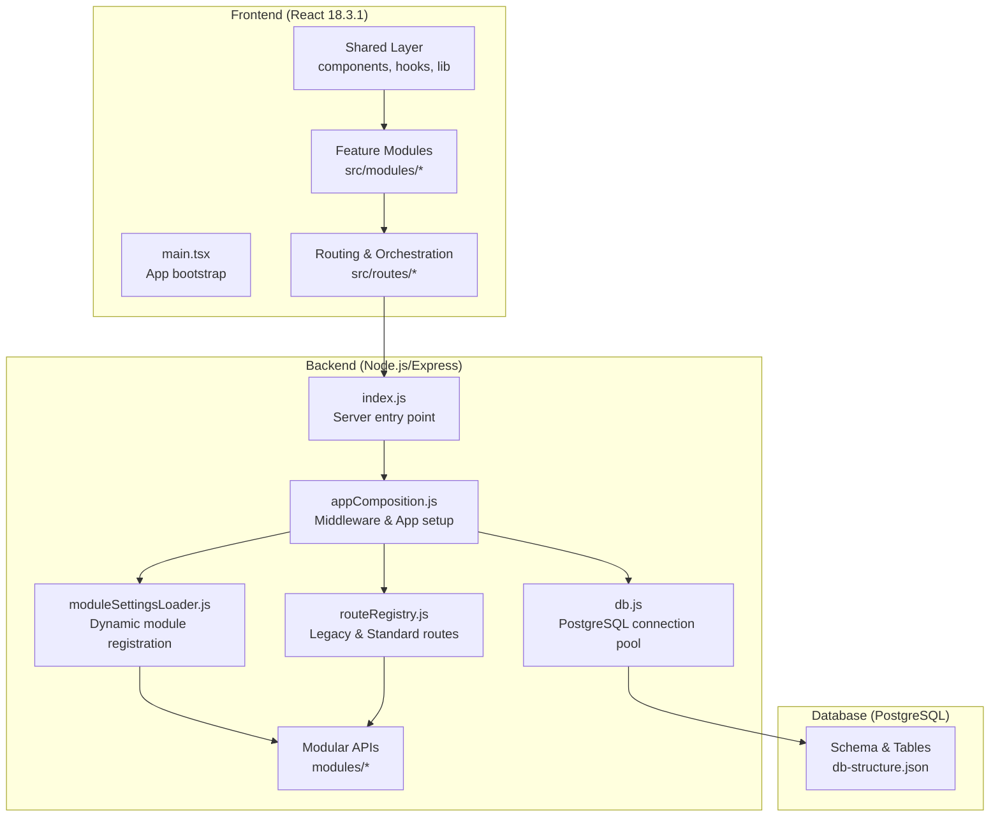
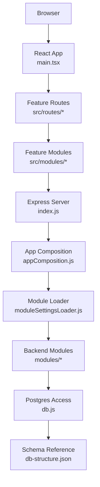
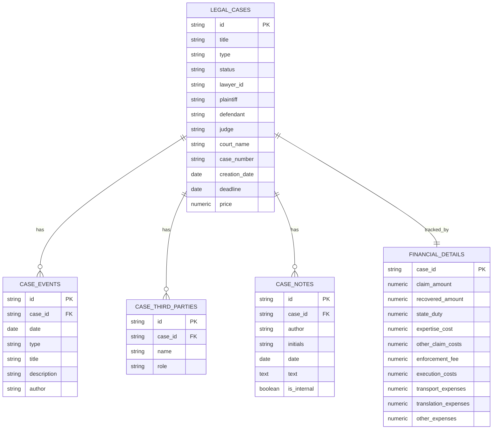
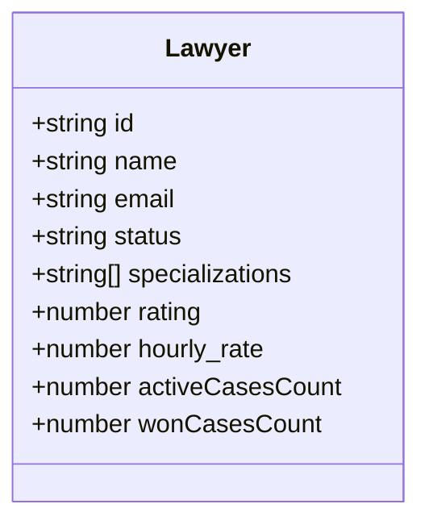
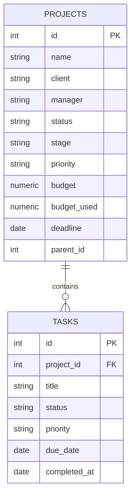
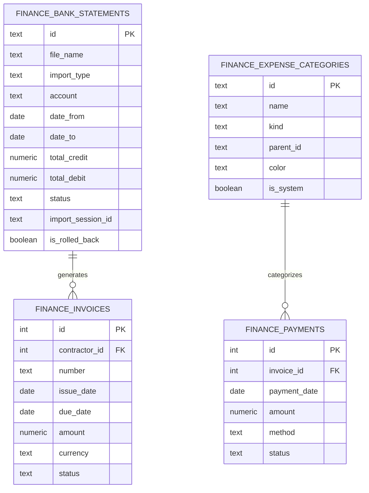
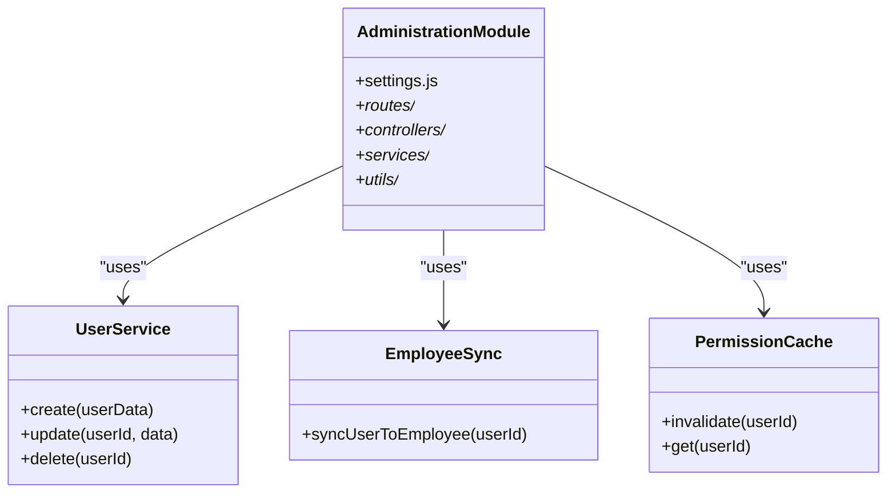
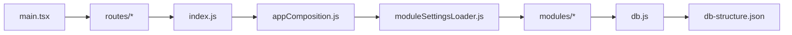

# Project Overview

> 📄 Актуальные компактные спецификации всех модулей: [docs/modules](../docs/modules/README.md) (рус.). Оглавление документации: [docs/README.md](../docs/README.md).

<cite>
**Referenced Files in This Document**
- [backend/package.json](file://backend/package.json)
- [frontend/package.json](file://frontend/package.json)
- [backend/index.js](file://backend/index.js)
- [backend/db.js](file://backend/db.js)
- [backend/utils/appComposition.js](file://backend/utils/appComposition.js)
- [backend/utils/routeRegistry.js](file://backend/utils/routeRegistry.js)
- [backend/utils/moduleSettingsLoader.js](file://backend/utils/moduleSettingsLoader.js)
- [docs/ARCHITECTURE.md](file://docs/ARCHITECTURE.md)
- [frontend/src/main.tsx](file://frontend/src/main.tsx)
- [backend/config/db-structure.json](file://backend/config/db-structure.json)
- [docs/API/LEGAL_CASES.md](file://docs/API/LEGAL_CASES.md)
- [docs/API/PROJECTS.md](file://docs/API/PROJECTS.md)
- [backend/modules/administration/README.md](file://backend/modules/administration/README.md)
</cite>

## Table of Contents
1. [Introduction](#introduction)
2. [Project Structure](#project-structure)
3. [Core Components](#core-components)
4. [Architecture Overview](#architecture-overview)
5. [Detailed Component Analysis](#detailed-component-analysis)
6. [Dependency Analysis](#dependency-analysis)
7. [Performance Considerations](#performance-considerations)
8. [Troubleshooting Guide](#troubleshooting-guide)
9. [Conclusion](#conclusion)

## Introduction
Titan CRM is a comprehensive Customer Relationship Management system tailored for legal services and corporate environments. It centralizes client and contractor relationship management, legal case lifecycle tracking, financial operations, project and task management, and team collaboration. Built with modern web technologies, it enables legal professionals and corporate teams to streamline workflows, maintain compliance, and improve operational visibility across practice areas.

The system’s value proposition lies in:
- Unified legal case and contractor management with robust audit and enrichment features
- Integrated financial operations including bank statement reconciliation, invoicing, and expense tracking
- Project and task orchestration with stage-based workflows and real-time collaboration
- Scalable, modular backend architecture with a reactive frontend for efficient maintenance and extensibility

## Project Structure
The project follows a full-stack monorepo-like structure with a Node.js/Express backend, a React 18.3.1 frontend, and a PostgreSQL database. The backend exposes modular APIs organized by functional domains, using a dynamic module loading system that combines static configuration with database-driven settings.

**Diagram sources**
- [frontend/src/main.tsx:1-27](file://frontend/src/main.tsx#L1-L26)
- [backend/index.js:1-40](file://backend/index.js#L1-L39)
- [backend/utils/appComposition.js:1-125](file://backend/utils/appComposition.js#L1-L125)
- [backend/utils/routeRegistry.js:1-45](file://backend/utils/routeRegistry.js#L1-L45)
- [backend/utils/moduleSettingsLoader.js:1-360](file://backend/utils/moduleSettingsLoader.js#L1-L360)
- [backend/db.js:1-68](file://backend/db.js#L1-L68)
- [docs/ARCHITECTURE.md:1-171](file://docs/ARCHITECTURE.md#L1-L171)
- [backend/config/db-structure.json:1-800](file://backend/config/db-structure.json#L1-L800)

**Section sources**
- [frontend/src/main.tsx:1-27](file://frontend/src/main.tsx#L1-L26)
- [backend/index.js:1-40](file://backend/index.js#L1-L39)
- [docs/ARCHITECTURE.md:1-171](file://docs/ARCHITECTURE.md#L1-L171)

## Core Components
- Legal Cases Management: Full lifecycle tracking of court, claim, arbitration, and administrative cases, including events, third parties, notes, documents, and financial details.
- Lawyers Management: Tracking of legal professionals, their specializations, ratings, hourly rates, and case performance metrics.
- Contractor/Client Relationship Management: Centralized contractor profiles, legal forms, enrichment, and relationship tagging for seamless client onboarding and management.
- Financial Operations: Bank statement import and reconciliation, invoice generation, payment tracking, tax settings, and expense/revenue categorization.
- Project and Task Management: Hierarchical project structures, stages, priorities, deadlines, budget tracking, and task workflows integrated with calendar and notifications.
- Team Collaboration: Role-based permissions, activity tracking, real-time notifications, and shared documents with audit logging.
- Administration: Users, employees, roles, permissions, departments, and organizational structure management.

Practical examples:
- A legal team tracks a multi-stage arbitration case with linked documents, deadlines, and financial costs, while assigning tasks to team members and synchronizing calendar events.
- A corporate project manager creates a hierarchical project, assigns tasks, monitors budget usage, generates invoices, and reconciles bank statements to track profitability.
- An administrator enforces role-based access, manages organizational units, and ensures compliance via audit logs and permission caches.

**Section sources**
- [docs/API/LEGAL_CASES.md:1-348](file://docs/API/LEGAL_CASES.md#L1-L347)
- [docs/API/PROJECTS.md:1-225](file://docs/API/PROJECTS.md#L1-L224)
- [backend/modules/administration/README.md:1-103](file://backend/modules/administration/README.md#L1-L102)

## Architecture Overview
Titan CRM employs a modular backend-to-frontend architecture:
- Backend: Modular Express server where modules encapsulate domain-specific APIs and services. It uses a dynamic registration system to mount module routers based on database configuration.
- Frontend: React 18.3.1 with TypeScript, feature modules, shared components, and a module registry for dynamic navigation and settings synchronization.
- Database: PostgreSQL with a normalized schema supporting legal cases, contractors, finances, projects, tasks, calendar, and audit/logging.

**Diagram sources**
- [frontend/src/main.tsx:1-27](file://frontend/src/main.tsx#L1-L26)
- [backend/index.js:1-40](file://backend/index.js#L1-L39)
- [backend/utils/appComposition.js:1-125](file://backend/utils/appComposition.js#L1-L125)
- [backend/db.js:1-68](file://backend/db.js#L1-L68)
- [backend/config/db-structure.json:1-800](file://backend/config/db-structure.json#L1-L800)

**Section sources**
- [docs/ARCHITECTURE.md:1-171](file://docs/ARCHITECTURE.md#L1-L171)
- [backend/index.js:1-40](file://backend/index.js#L1-L39)
- [backend/db.js:1-68](file://backend/db.js#L1-L68)

## Detailed Component Analysis

### Technology Stack
- Backend
  - Node.js with Express for HTTP server and routing
  - PostgreSQL for persistence with a dedicated connection pool
  - Middleware for CORS, JSON parsing, file serving, activity tracking, and error logging
  - Modular structure with dynamic loading and legacy alias support
- Frontend
  - React 18.3.1 with TypeScript and Vite
  - Feature-module architecture with shared components and hooks
  - Routing orchestrated via module manifests and feature flags
- Database
  - PostgreSQL schema with normalized tables for legal cases, contractors, finances, projects, tasks, calendar, and audit logs

**Section sources**
- [backend/package.json:1-81](file://backend/package.json#L1-L81)
- [frontend/package.json:1-118](file://frontend/package.json#L1-L118)
- [backend/index.js:1-40](file://backend/index.js#L1-L39)
- [backend/utils/appComposition.js:1-125](file://backend/utils/appComposition.js#L1-L125)
- [backend/db.js:1-68](file://backend/db.js#L1-L68)
- [backend/config/db-structure.json:1-800](file://backend/config/db-structure.json#L1-L800)

### Legal Cases Management
Legal cases are modeled with rich metadata, lifecycle events, third-party participants, notes, and financial cost tracking. The API supports full CRUD operations and structured relationships.

**Diagram sources**
- [docs/API/LEGAL_CASES.md:223-348](file://docs/API/LEGAL_CASES.md#L223-L347)
- [backend/config/db-structure.json:233-516](file://backend/config/db-structure.json#L233-L516)

**Section sources**
- [docs/API/LEGAL_CASES.md:1-348](file://docs/API/LEGAL_CASES.md#L1-L347)
- [backend/config/db-structure.json:233-516](file://backend/config/db-structure.json#L233-L516)

### Lawyers Management
The Lawyers module handles legal professionals, aggregating data from the Users and Employees systems. It tracks specializations, ratings, and case performance metrics.

**Section sources**
- [backend/modules/lawyers/controllers.js:1-140](file://backend/modules/lawyers/controllers.js#L1-L140)

### Projects and Task Management
Projects support hierarchical parent-child relationships, stage-based workflows, budgets, deadlines, and financial statuses. Tasks are associated with projects and tracked through completion.

**Diagram sources**
- [docs/API/PROJECTS.md:165-225](file://docs/API/PROJECTS.md#L165-L224)
- [backend/config/db-structure.json:1-232](file://backend/config/db-structure.json#L1-L232)

**Section sources**
- [docs/API/PROJECTS.md:1-225](file://docs/API/PROJECTS.md#L1-L224)
- [backend/config/db-structure.json:1-232](file://backend/config/db-structure.json#L1-L232)

### Financial Operations
Finance integrates bank statement imports, reconciliation, invoice workflows, tax settings, and expense/revenue categorization. The schema includes dedicated tables for statements, categories, and payment tracking.

**Diagram sources**
- [backend/config/db-structure.json:527-800](file://backend/config/db-structure.json#L527-L800)

**Section sources**
- [backend/config/db-structure.json:527-800](file://backend/config/db-structure.json#L527-L800)

### Administration and Permissions
Administration consolidates users, employees, roles, permissions, departments, and organizational structure. It provides a unified foundation for access control and HR-related workflows.

**Diagram sources**
- [backend/modules/administration/README.md:1-103](file://backend/modules/administration/README.md#L1-L102)

**Section sources**
- [backend/modules/administration/README.md:1-103](file://backend/modules/administration/README.md#L1-L102)

## Dependency Analysis
- Frontend-to-Backend: The React frontend bootstraps global providers and renders feature modules that communicate with backend APIs. Routing and orchestration are handled centrally, ensuring clean separation of concerns.
- Backend Modularity: The Express server initializes via appComposition.js, which registers module routers and legacy aliases, enabling independent development and deployment of features.
- Database Coupling: Tables are normalized with explicit foreign keys and indexes, minimizing tight coupling and supporting scalable growth.

**Diagram sources**
- [frontend/src/main.tsx:1-27](file://frontend/src/main.tsx#L1-L26)
- [backend/index.js:1-40](file://backend/index.js#L1-L39)
- [backend/utils/appComposition.js:1-125](file://backend/utils/appComposition.js#L1-L125)
- [backend/db.js:1-68](file://backend/db.js#L1-L68)
- [backend/config/db-structure.json:1-800](file://backend/config/db-structure.json#L1-L800)

**Section sources**
- [docs/ARCHITECTURE.md:1-171](file://docs/ARCHITECTURE.md#L1-L171)
- [backend/index.js:1-40](file://backend/index.js#L1-L39)

## Performance Considerations
- Database pooling and query normalization: The backend uses a pooled PostgreSQL connection and converts column names from snake_case to camelCase to reduce overhead and improve readability.
- Middleware-driven logging and activity tracking: Request timing and user activity are logged centrally, aiding performance monitoring and troubleshooting.
- Frontend module boundaries: Strict import rules and feature flags prevent unnecessary bundle bloat and enable incremental loading of features.
- Cached Module Settings: The backend caches module settings to minimize repeated database reads during registration.

[No sources needed since this section provides general guidance]

## Troubleshooting Guide
- Environment configuration: Ensure required environment variables are present in the backend env file; startup checks validate database connectivity and required variables.
- Request logging and errors: The server logs incoming requests and unhandled errors with contextual metadata, including user ID and IP address.
- WebSocket and scheduler initialization: On startup, the server initializes WebSocket endpoints and background schedulers; failures are logged as warnings to avoid blocking startup.
- Module Registration: If a module fails to load, check the modules table in the database and ensure the folder exists in backend/modules/.

**Section sources**
- [backend/index.js:13-40](file://backend/index.js#L13-L39)
- [backend/utils/appComposition.js:111-125](file://backend/utils/appComposition.js#L111-L125)
- [backend/utils/startupServices.js:1-50](file://backend/utils/startupServices.js#L1-L50)

## Conclusion
Titan CRM delivers a robust, modular platform for legal and corporate environments. Its layered architecture, comprehensive domain coverage, and strong operational tooling enable teams to manage complex workflows efficiently. By combining a scalable backend with a flexible frontend and a well-normalized database, the system supports both stakeholder oversight and developer productivity.

[No sources needed since this section summarizes without analyzing specific files]