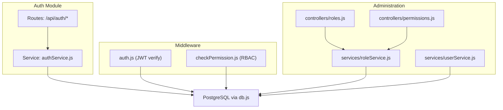
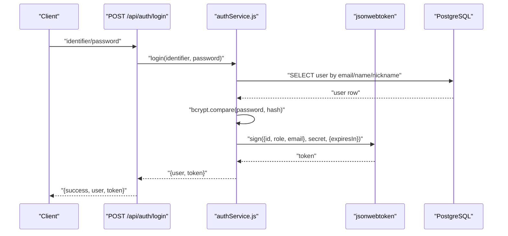
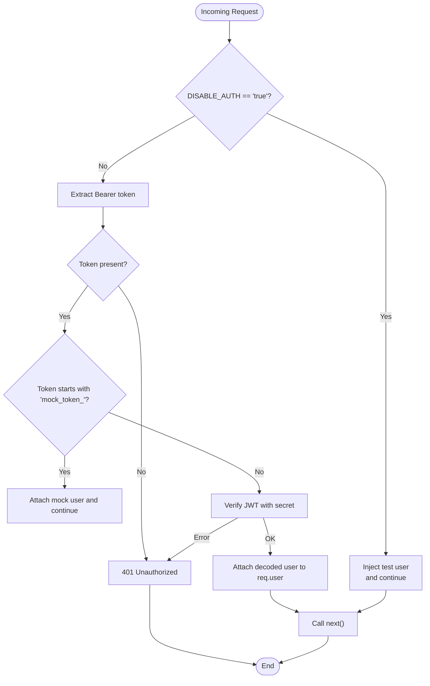
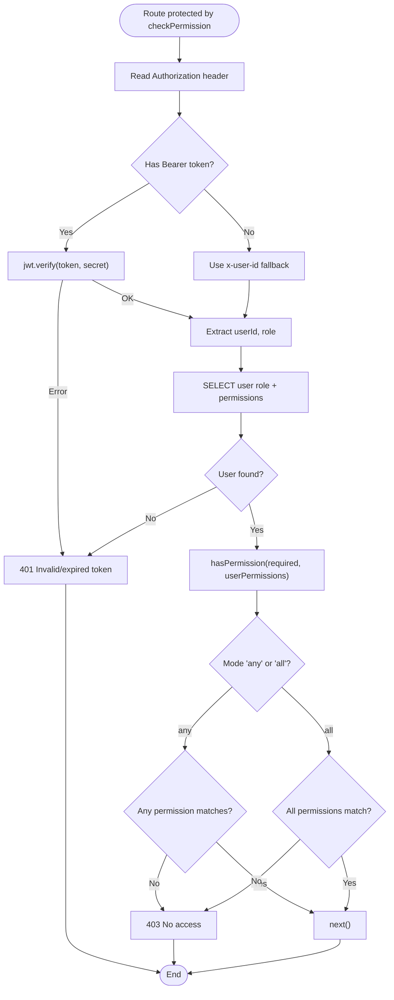
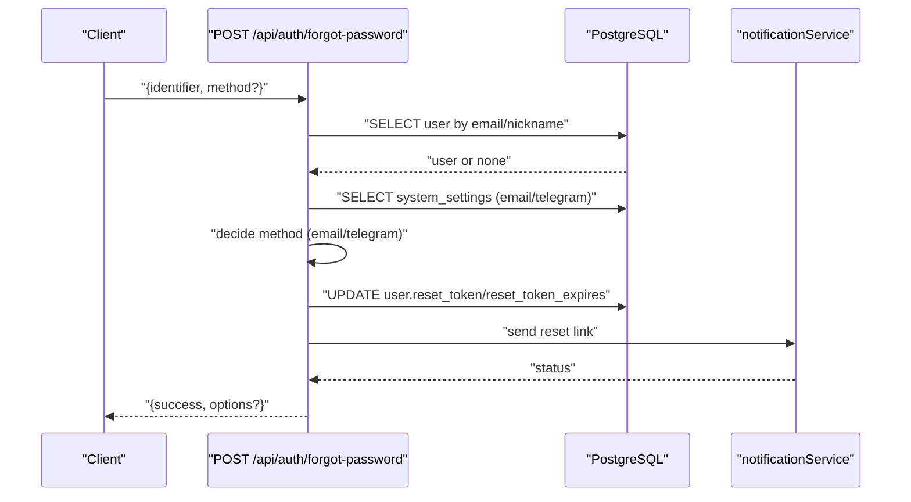
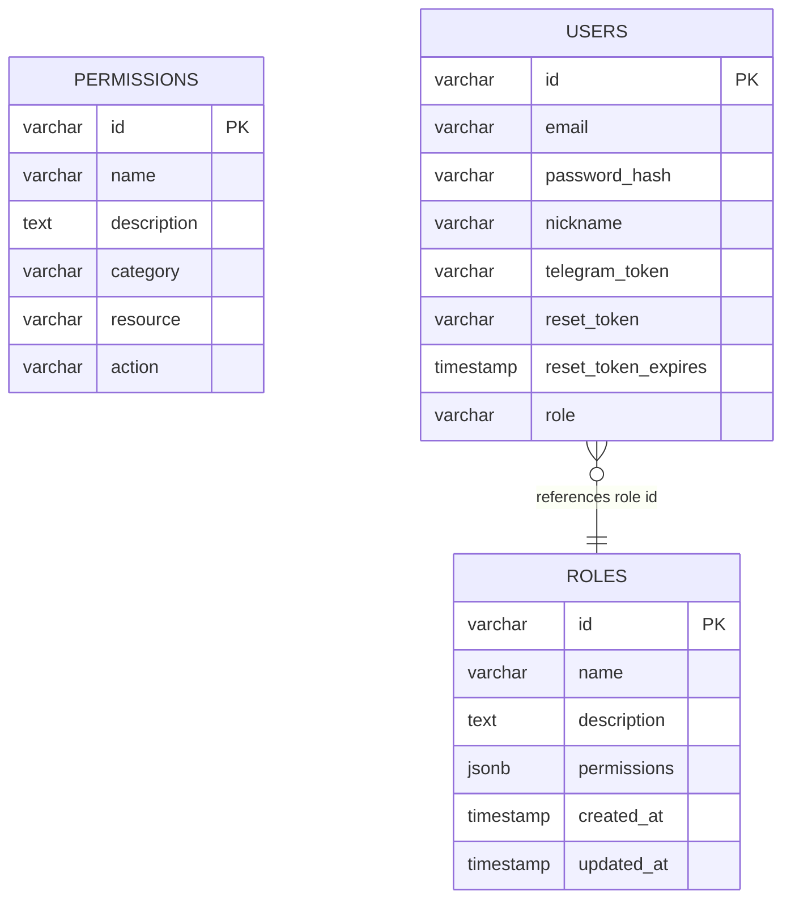
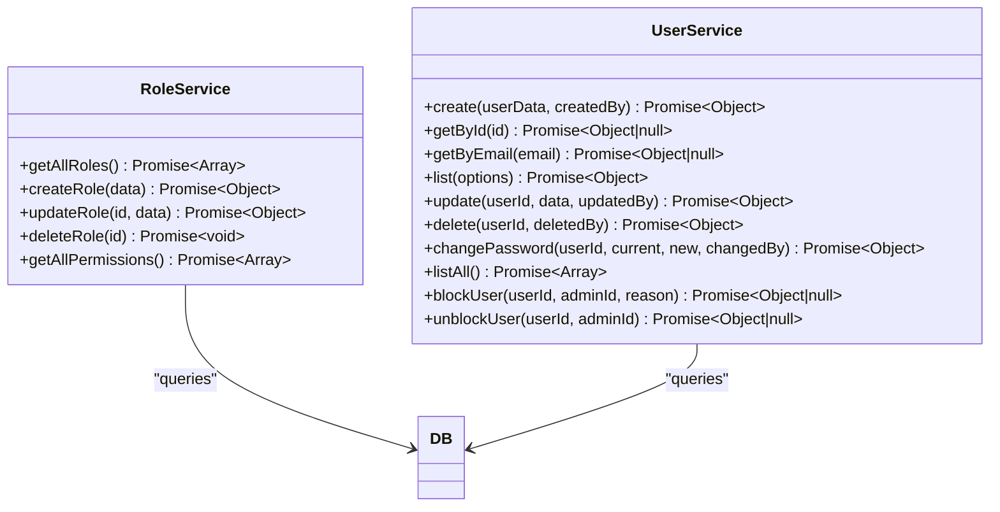
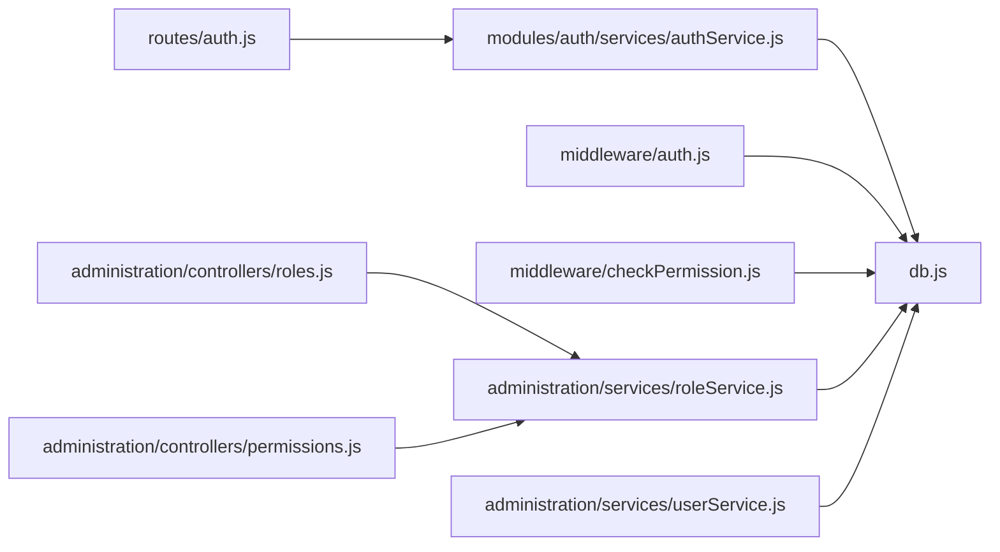

# Authentication & Authorization

<cite>
**Referenced Files in This Document**
- [backend/middleware/auth.js](file://backend/middleware/auth.js)
- [backend/middleware/checkPermission.js](file://backend/middleware/checkPermission.js)
- [backend/modules/auth/services/authService.js](file://backend/modules/auth/services/authService.js)
- [backend/routes/auth.js](file://backend/routes/auth.js)
- [backend/modules/administration/services/roleService.js](file://backend/modules/administration/services/roleService.js)
- [backend/modules/administration/services/userService.js](file://backend/modules/administration/services/userService.js)
- [backend/modules/administration/controllers/roles.js](file://backend/modules/administration/controllers/roles.js)
- [backend/modules/administration/controllers/permissions.js](file://backend/modules/administration/controllers/permissions.js)
- [backend/migrations/26_create_roles_and_permissions_tables.md](file://backend/migrations/26_create_roles_and_permissions_tables.md)
- [backend/migrations/29_seed_access_matrix.md](file://backend/migrations/29_seed_access_matrix.md)
- [backend/migrations/35_add_auth_columns_to_users.md](file://backend/migrations/35_add_auth_columns_to_users.md)
- [backend/db.js](file://backend/db.js)
</cite>

## Table of Contents
1. [Introduction](#introduction)
2. [Project Structure](#project-structure)
3. [Core Components](#core-components)
4. [Architecture Overview](#architecture-overview)
5. [Detailed Component Analysis](#detailed-component-analysis)
6. [Dependency Analysis](#dependency-analysis)
7. [Performance Considerations](#performance-considerations)
8. [Troubleshooting Guide](#troubleshooting-guide)
9. [Conclusion](#conclusion)

## Introduction
This document describes the JWT-based authentication and authorization system used by the CRM backend. It covers the authentication flow, token generation and validation, session management, login/logout processes, role-based access control (RBAC), permission checking middleware, and user blocking functionality. It also explains the JWT token structure, header configuration, secure token handling, the permission matrix system, user role assignments, access control patterns, security considerations, and error handling.

## Project Structure
The authentication and authorization system spans several backend modules:
- Authentication endpoints and services under the auth module
- RBAC model with roles and permissions stored in the database
- Middleware for enforcing authentication and permission checks
- Administration controllers and services for managing roles and permissions
- Database schema and migrations defining the RBAC tables and initial data

**Diagram sources**
- [backend/routes/auth.js:1-246](file://backend/modules/auth/routes.js#L1-L33)
- [backend/modules/auth/services/authService.js:1-233](file://backend/modules/auth/services/authService.js#L1-L232)
- [backend/middleware/auth.js:1-82](file://backend/middleware/auth.js#L1-L81)
- [backend/middleware/checkPermission.js:1-130](file://backend/middleware/checkPermission.js#L1-L129)
- [backend/modules/administration/controllers/roles.js:1-56](file://backend/modules/administration/controllers/roles.js#L1-L55)
- [backend/modules/administration/controllers/permissions.js:1-21](file://backend/modules/administration/controllers/permissions.js#L1-L20)
- [backend/modules/administration/services/roleService.js:1-109](file://backend/modules/administration/services/roleService.js#L1-L108)
- [backend/modules/administration/services/userService.js:1-554](file://backend/modules/administration/services/userService.js#L1-L553)
- [backend/db.js:1-68](file://backend/db.js#L1-L68)

**Section sources**
- [backend/routes/auth.js:1-246](file://backend/modules/auth/routes.js#L1-L33)
- [backend/modules/auth/services/authService.js:1-233](file://backend/modules/auth/services/authService.js#L1-L232)
- [backend/middleware/auth.js:1-82](file://backend/middleware/auth.js#L1-L81)
- [backend/middleware/checkPermission.js:1-130](file://backend/middleware/checkPermission.js#L1-L129)
- [backend/modules/administration/controllers/roles.js:1-56](file://backend/modules/administration/controllers/roles.js#L1-L55)
- [backend/modules/administration/controllers/permissions.js:1-21](file://backend/modules/administration/controllers/permissions.js#L1-L20)
- [backend/modules/administration/services/roleService.js:1-109](file://backend/modules/administration/services/roleService.js#L1-L108)
- [backend/modules/administration/services/userService.js:1-554](file://backend/modules/administration/services/userService.js#L1-L553)
- [backend/db.js:1-68](file://backend/db.js#L1-L68)

## Core Components
- JWT middleware: Extracts the Authorization header, supports mock tokens for development, verifies JWT with a secret, and attaches user info to the request.
- Permission middleware: Verifies JWT when present, fetches user role and permissions from the database, and enforces wildcard-based permission checks.
- Auth service and routes: Handle login, password reset request, and password reset. They sign JWT tokens with a 24-hour expiration and return user data alongside the token.
- RBAC services and controllers: Manage roles and permissions, expose endpoints to list permissions and manage roles, and maintain counts of users per role.
- Database schema and migrations: Define roles and permissions tables, seed default roles and permissions, and add authentication-related columns to users.

**Section sources**
- [backend/middleware/auth.js:1-82](file://backend/middleware/auth.js#L1-L81)
- [backend/middleware/checkPermission.js:1-130](file://backend/middleware/checkPermission.js#L1-L129)
- [backend/modules/auth/services/authService.js:1-233](file://backend/modules/auth/services/authService.js#L1-L232)
- [backend/routes/auth.js:1-246](file://backend/modules/auth/routes.js#L1-L33)
- [backend/modules/administration/services/roleService.js:1-109](file://backend/modules/administration/services/roleService.js#L1-L108)
- [backend/modules/administration/controllers/roles.js:1-56](file://backend/modules/administration/controllers/roles.js#L1-L55)
- [backend/modules/administration/controllers/permissions.js:1-21](file://backend/modules/administration/controllers/permissions.js#L1-L20)
- [backend/migrations/26_create_roles_and_permissions_tables.md:1-61](file://backend/migrations/26_create_roles_and_permissions_tables.md#L1-L60)
- [backend/migrations/29_seed_access_matrix.md:1-207](file://backend/migrations/29_seed_access_matrix.md#L1-L207)
- [backend/migrations/35_add_auth_columns_to_users.md:1-67](file://backend/migrations/35_add_auth_columns_to_users.md#L1-L67)

## Architecture Overview
The system uses bearer tokens for stateless authentication. On login, the server validates credentials, signs a JWT containing user identity and role, and returns both user data and the token. Subsequent requests include the Authorization header with the Bearer token. Middleware verifies the token and optionally enforces permission checks against the database-backed RBAC model.

**Diagram sources**
- [backend/routes/auth.js:17-86](file://backend/modules/auth/routes.js#L1-L33)
- [backend/modules/auth/services/authService.js:15-74](file://backend/modules/auth/services/authService.js#L15-L74)
- [backend/db.js:1-68](file://backend/db.js#L1-L68)

**Section sources**
- [backend/routes/auth.js:17-86](file://backend/modules/auth/routes.js#L1-L33)
- [backend/modules/auth/services/authService.js:15-74](file://backend/modules/auth/services/authService.js#L15-L74)
- [backend/db.js:1-68](file://backend/db.js#L1-L68)

## Detailed Component Analysis

### JWT Middleware (auth.js)
Responsibilities:
- Extracts Authorization header and strips the "Bearer " prefix
- Supports a development-only mock token scheme
- Verifies JWT using a shared secret and attaches decoded payload to req.user
- Provides an optional variant that tolerates missing/invalid tokens

Behavior highlights:
- When DISABLE_AUTH is true, injects a test user and bypasses JWT verification
- Logs warnings for missing or invalid tokens
- Returns 401 for missing or invalid tokens

**Diagram sources**
- [backend/middleware/auth.js:6-54](file://backend/middleware/auth.js#L6-L54)

**Section sources**
- [backend/middleware/auth.js:1-82](file://backend/middleware/auth.js#L1-L81)

### Permission Middleware (checkPermission.js)
Responsibilities:
- Accepts a single permission or an array with mode 'any' or 'all'
- Supports wildcard matching: exact match, global '*', and resource-level '*'
- Verifies JWT when provided; otherwise falls back to headers for development
- Queries user role and permissions from the database and enforces access control

**Diagram sources**
- [backend/middleware/checkPermission.js:34-126](file://backend/middleware/checkPermission.js#L34-L126)

**Section sources**
- [backend/middleware/checkPermission.js:1-130](file://backend/middleware/checkPermission.js#L1-L129)

### Authentication Service and Routes
- Login endpoint accepts an identifier (email or name or nickname) and password, validates credentials, and returns a signed JWT with 24-hour expiry
- Password reset request generates a temporary token with an expiration and sends reset instructions via configured channels
- Reset endpoint validates the token and updates the user’s password after hashing

**Diagram sources**
- [backend/routes/auth.js:88-205](file://backend/modules/auth/routes.js#L1-L33)

**Section sources**
- [backend/modules/auth/services/authService.js:15-74](file://backend/modules/auth/services/authService.js#L15-L74)
- [backend/modules/auth/services/authService.js:79-226](file://backend/modules/auth/services/authService.js#L79-L226)
- [backend/routes/auth.js:17-86](file://backend/modules/auth/routes.js#L1-L33)
- [backend/routes/auth.js:88-205](file://backend/modules/auth/routes.js#L1-L33)

### RBAC Model and Data
- Roles table stores role identifiers, names, descriptions, and a JSONB permissions array
- Permissions table defines granular permission records with category, resource, and action
- Initial seeding defines default roles and permissions across modules
- Users table references a role ID and includes authentication fields

**Diagram sources**
- [backend/migrations/26_create_roles_and_permissions_tables.md:9-28](file://backend/migrations/26_create_roles_and_permissions_tables.md#L9-L28)
- [backend/migrations/29_seed_access_matrix.md:17-61](file://backend/migrations/29_seed_access_matrix.md#L17-L61)
- [backend/migrations/35_add_auth_columns_to_users.md:5-67](file://backend/migrations/35_add_auth_columns_to_users.md#L5-L67)

**Section sources**
- [backend/migrations/26_create_roles_and_permissions_tables.md:1-61](file://backend/migrations/26_create_roles_and_permissions_tables.md#L1-L60)
- [backend/migrations/29_seed_access_matrix.md:1-207](file://backend/migrations/29_seed_access_matrix.md#L1-L207)
- [backend/migrations/35_add_auth_columns_to_users.md:1-67](file://backend/migrations/35_add_auth_columns_to_users.md#L1-L67)

### Administration Controllers and Services
- Roles controller exposes endpoints to list, create, update, and delete roles
- Permissions controller exposes endpoint to list permissions
- Role service manages role CRUD, computes user counts per role, and normalizes permissions
- User service provides user management, password validation, and blocking/unblocking with audit logging

**Diagram sources**
- [backend/modules/administration/services/roleService.js:1-109](file://backend/modules/administration/services/roleService.js#L1-L108)
- [backend/modules/administration/services/userService.js:1-554](file://backend/modules/administration/services/userService.js#L1-L553)

**Section sources**
- [backend/modules/administration/controllers/roles.js:1-56](file://backend/modules/administration/controllers/roles.js#L1-L55)
- [backend/modules/administration/controllers/permissions.js:1-21](file://backend/modules/administration/controllers/permissions.js#L1-L20)
- [backend/modules/administration/services/roleService.js:1-109](file://backend/modules/administration/services/roleService.js#L1-L108)
- [backend/modules/administration/services/userService.js:1-554](file://backend/modules/administration/services/userService.js#L1-L553)

## Dependency Analysis
- Routes depend on the auth service for login and password reset flows
- Middleware depends on jsonwebtoken and environment configuration
- Permission middleware queries the database to resolve user permissions
- Administration services depend on the database for role and user operations
- Database abstraction centralizes connection and result normalization

**Diagram sources**
- [backend/routes/auth.js:1-246](file://backend/modules/auth/routes.js#L1-L33)
- [backend/modules/auth/services/authService.js:1-233](file://backend/modules/auth/services/authService.js#L1-L232)
- [backend/middleware/auth.js:1-82](file://backend/middleware/auth.js#L1-L81)
- [backend/middleware/checkPermission.js:1-130](file://backend/middleware/checkPermission.js#L1-L129)
- [backend/modules/administration/controllers/roles.js:1-56](file://backend/modules/administration/controllers/roles.js#L1-L55)
- [backend/modules/administration/controllers/permissions.js:1-21](file://backend/modules/administration/controllers/permissions.js#L1-L20)
- [backend/modules/administration/services/roleService.js:1-109](file://backend/modules/administration/services/roleService.js#L1-L108)
- [backend/modules/administration/services/userService.js:1-554](file://backend/modules/administration/services/userService.js#L1-L553)
- [backend/db.js:1-68](file://backend/db.js#L1-L68)

**Section sources**
- [backend/routes/auth.js:1-246](file://backend/modules/auth/routes.js#L1-L33)
- [backend/modules/auth/services/authService.js:1-233](file://backend/modules/auth/services/authService.js#L1-L232)
- [backend/middleware/auth.js:1-82](file://backend/middleware/auth.js#L1-L81)
- [backend/middleware/checkPermission.js:1-130](file://backend/middleware/checkPermission.js#L1-L129)
- [backend/modules/administration/controllers/roles.js:1-56](file://backend/modules/administration/controllers/roles.js#L1-L55)
- [backend/modules/administration/controllers/permissions.js:1-21](file://backend/modules/administration/controllers/permissions.js#L1-L20)
- [backend/modules/administration/services/roleService.js:1-109](file://backend/modules/administration/services/roleService.js#L1-L108)
- [backend/modules/administration/services/userService.js:1-554](file://backend/modules/administration/services/userService.js#L1-L553)
- [backend/db.js:1-68](file://backend/db.js#L1-L68)

## Performance Considerations
- JWT verification is lightweight; caching decoded user info in memory is generally unnecessary given short-lived tokens
- Permission checks involve a database query per protected route; consider caching role-to-permissions mapping for frequently accessed roles
- Indexes on roles and permissions tables improve lookup performance
- Avoid excessive wildcard checks; prefer precise permissions where possible

[No sources needed since this section provides general guidance]

## Troubleshooting Guide
Common issues and resolutions:
- Missing or invalid Authorization header: Ensure clients send "Authorization: Bearer <token>" and that the token is not expired
- JWT verification failures: Confirm the JWT_SECRET environment variable matches the backend configuration
- Permission denied errors: Verify the user’s role permissions include the required resource.action or wildcard
- Password reset failures: Confirm system settings for email/telegram are configured and the reset token is valid and unexpired
- User not found during login: Ensure the identifier matches email, name, or nickname stored in the database

**Section sources**
- [backend/middleware/auth.js:24-53](file://backend/middleware/auth.js#L24-L53)
- [backend/middleware/checkPermission.js:44-57](file://backend/middleware/checkPermission.js#L44-L57)
- [backend/middleware/checkPermission.js:69-71](file://backend/middleware/checkPermission.js#L69-L71)
- [backend/routes/auth.js:24-54](file://backend/modules/auth/routes.js#L1-L33)
- [backend/modules/auth/services/authService.js:198-213](file://backend/modules/auth/services/authService.js#L198-L213)

## Conclusion
The system implements a robust JWT-based authentication and RBAC-driven authorization model. Authentication is handled centrally with middleware that verifies tokens and enforces permissions against a database-backed roles and permissions schema. The design supports wildcard-based permissions, development-friendly mock tokens, and administrative controls for managing roles and permissions. Security is strengthened by strict password hashing, controlled password reset flows, and optional user blocking capabilities.