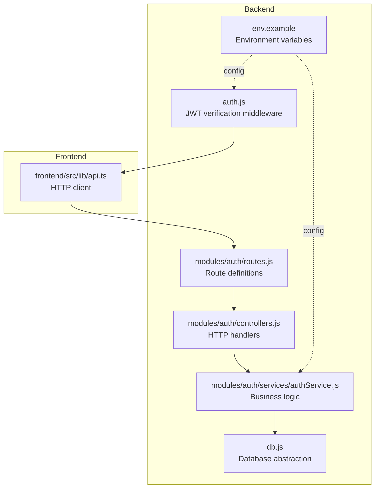
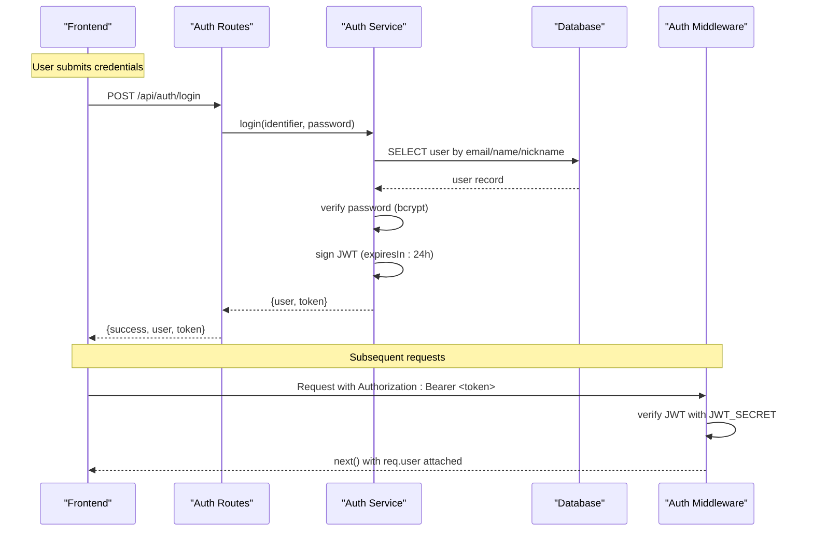
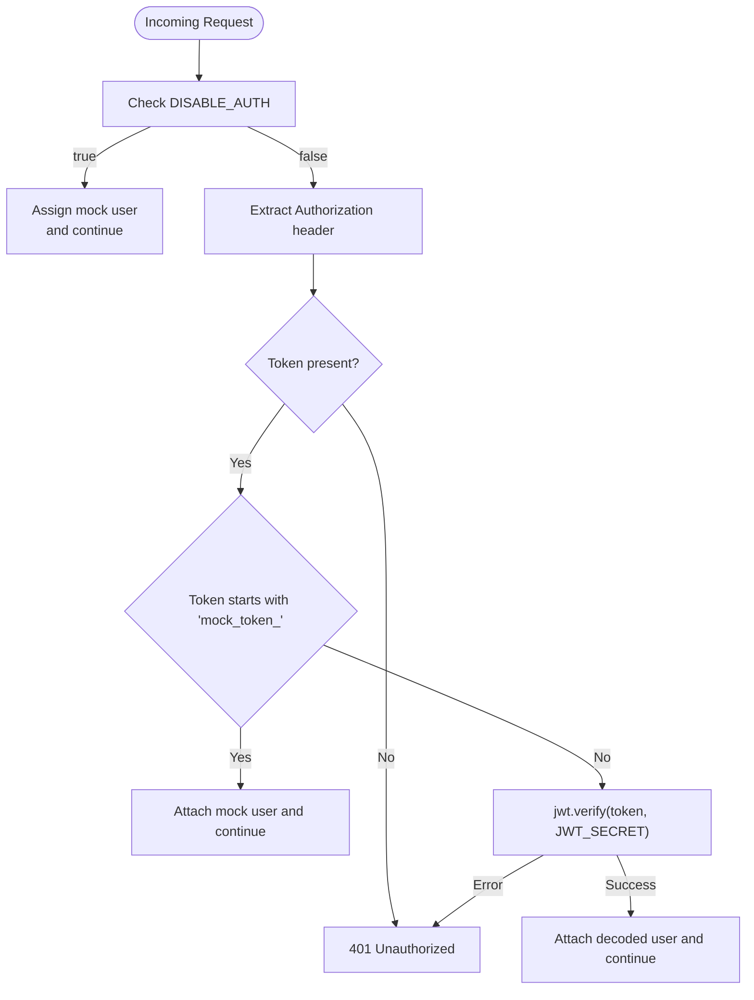
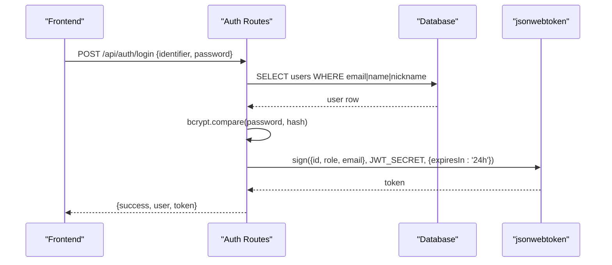
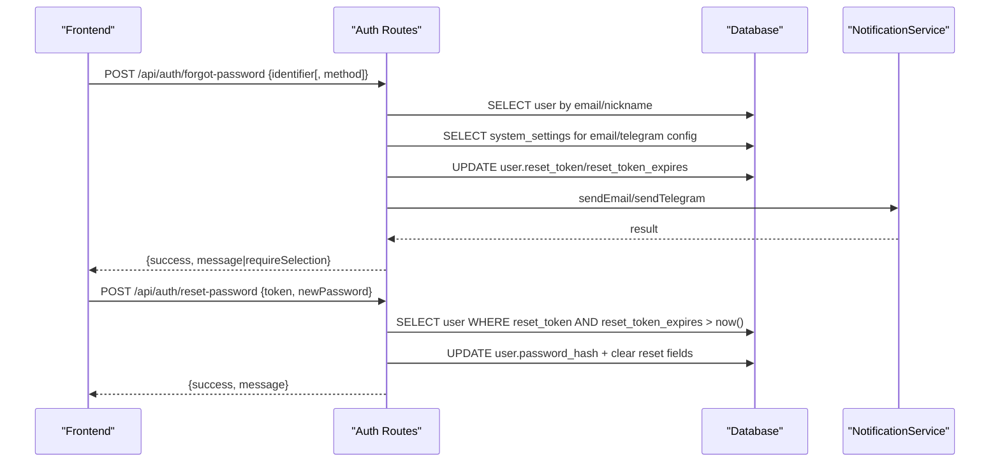
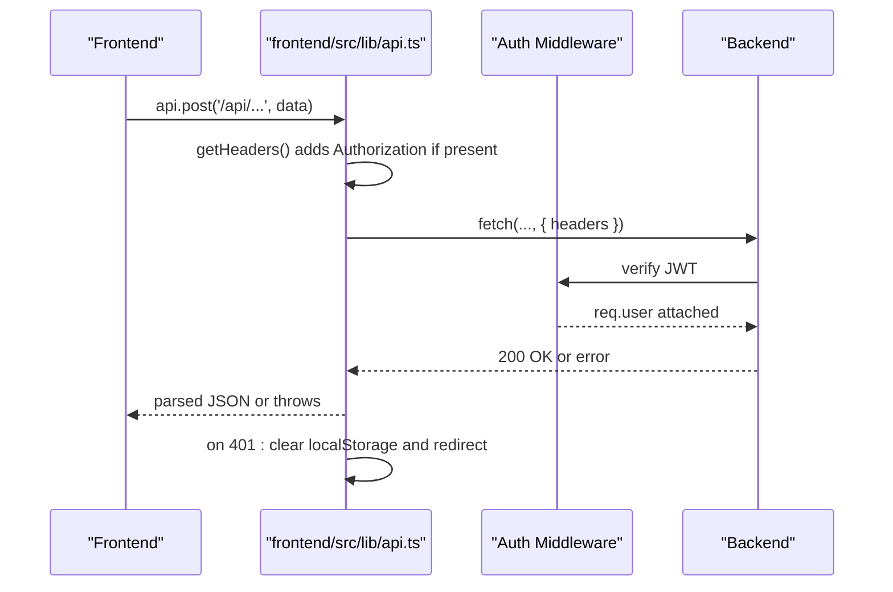
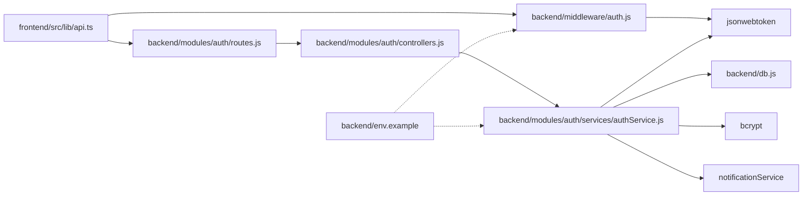

# JWT Authentication

<cite>
**Referenced Files in This Document**
- [backend/middleware/auth.js](file://backend/middleware/auth.js)
- [backend/modules/auth/services/authService.js](file://backend/modules/auth/services/authService.js)
- [backend/modules/auth/controllers.js](file://backend/modules/auth/controllers.js)
- [backend/modules/auth/routes.js](file://backend/modules/auth/routes.js)
- [backend/routes/auth.js](file://backend/routes/auth.js)
- [backend/env.example](file://backend/env.example)
- [backend/utils/errorHandler.js](file://backend/utils/errorHandler.js)
- [backend/db.js](file://backend/db.js)
- [frontend/src/lib/api.ts](file://frontend/src/lib/api.ts)
- [docs/backend/AUTH_SETUP.md](file://docs/backend/AUTH_SETUP.md)
</cite>

## Table of Contents
1. [Introduction](#introduction)
2. [Project Structure](#project-structure)
3. [Core Components](#core-components)
4. [Architecture Overview](#architecture-overview)
5. [Detailed Component Analysis](#detailed-component-analysis)
6. [Dependency Analysis](#dependency-analysis)
7. [Performance Considerations](#performance-considerations)
8. [Troubleshooting Guide](#troubleshooting-guide)
9. [Conclusion](#conclusion)
10. [Appendices](#appendices)

## Introduction
This document explains the JWT-based authentication system used by the backend and integrated with the frontend. It covers the complete authentication flow from login to token validation, protected route access, and error handling. It also details token structure, expiration handling, secure storage recommendations, and security considerations.

## Project Structure
The authentication system spans backend modules and middleware, and integrates with the frontend API client. Key areas:
- Backend middleware validates Authorization headers and decodes JWT tokens.
- Backend routes and services implement login, password reset, and token issuance.
- Frontend API client injects Authorization headers and handles 401 responses.

**Diagram sources**
- [backend/middleware/auth.js:1-82](file://backend/middleware/auth.js#L1-L81)
- [backend/modules/auth/routes.js:1-34](file://backend/modules/auth/routes.js#L1-L33)
- [backend/modules/auth/controllers.js:1-69](file://backend/modules/auth/controllers.js#L1-L68)
- [backend/modules/auth/services/authService.js:1-233](file://backend/modules/auth/services/authService.js#L1-L232)
- [backend/db.js:1-68](file://backend/db.js#L1-L68)
- [backend/env.example:1-62](file://backend/env.example#L1-L61)
- [frontend/src/lib/api.ts:1-226](file://frontend/src/lib/api.ts#L1-L209)

**Section sources**
- [backend/middleware/auth.js:1-82](file://backend/middleware/auth.js#L1-L81)
- [backend/modules/auth/routes.js:1-34](file://backend/modules/auth/routes.js#L1-L33)
- [backend/modules/auth/controllers.js:1-69](file://backend/modules/auth/controllers.js#L1-L68)
- [backend/modules/auth/services/authService.js:1-233](file://backend/modules/auth/services/authService.js#L1-L232)
- [backend/db.js:1-68](file://backend/db.js#L1-L68)
- [backend/env.example:1-62](file://backend/env.example#L1-L61)
- [frontend/src/lib/api.ts:1-226](file://frontend/src/lib/api.ts#L1-L209)

## Core Components
- JWT Middleware: Extracts Authorization header, supports mock tokens, verifies JWT, and attaches user info to the request.
- Auth Routes: Exposes login, forgot-password, and reset-password endpoints.
- Auth Service: Implements login logic, password hashing, and password reset token lifecycle.
- Frontend API Client: Injects Authorization header and clears local storage on 401.
- Environment: Defines JWT_SECRET and optional DISABLE_AUTH flag.

**Section sources**
- [backend/middleware/auth.js:1-82](file://backend/middleware/auth.js#L1-L81)
- [backend/modules/auth/routes.js:1-34](file://backend/modules/auth/routes.js#L1-L33)
- [backend/modules/auth/services/authService.js:1-233](file://backend/modules/auth/services/authService.js#L1-L232)
- [frontend/src/lib/api.ts:1-226](file://frontend/src/lib/api.ts#L1-L209)
- [backend/env.example:1-62](file://backend/env.example#L1-L61)

## Architecture Overview
The authentication flow consists of:
- Login: Frontend posts credentials; backend validates and issues a signed JWT.
- Protected Access: Frontend includes Authorization: Bearer <token>; middleware validates and attaches user.
- Logout: Frontend clears local storage; server-side token remains valid until expiration.

**Diagram sources**
- [backend/modules/auth/routes.js:16-86](file://backend/modules/auth/routes.js#L16-L33)
- [backend/modules/auth/services/authService.js:15-74](file://backend/modules/auth/services/authService.js#L15-L74)
- [backend/middleware/auth.js:6-54](file://backend/middleware/auth.js#L6-L54)
- [frontend/src/lib/api.ts:17-38](file://frontend/src/lib/api.ts#L17-L38)

## Detailed Component Analysis

### JWT Middleware
Responsibilities:
- Extracts token from Authorization header.
- Supports development mode with DISABLE_AUTH.
- Accepts legacy mock tokens for development.
- Verifies JWT using JWT_SECRET and attaches decoded user to req.user.
- Returns 401 for missing or invalid tokens.

Key behaviors:
- Token extraction strips "Bearer " prefix.
- Optional auth variant ignores invalid tokens and continues.

**Diagram sources**
- [backend/middleware/auth.js:6-54](file://backend/middleware/auth.js#L6-L54)

**Section sources**
- [backend/middleware/auth.js:1-82](file://backend/middleware/auth.js#L1-L81)

### Login Flow
Endpoints:
- POST /api/auth/login (module routes) and POST /api/auth/login (legacy routes) both implement the same flow.

Flow:
- Validate presence of identifier and password.
- Query user by email, name, or nickname.
- Compare password using bcrypt.
- Sign JWT with subject claims and 24-hour expiry.
- Return user profile and token.

**Diagram sources**
- [backend/modules/auth/routes.js:16-86](file://backend/modules/auth/routes.js#L16-L33)
- [backend/modules/auth/services/authService.js:15-74](file://backend/modules/auth/services/authService.js#L15-L74)

**Section sources**
- [backend/modules/auth/routes.js:16-86](file://backend/modules/auth/routes.js#L16-L33)
- [backend/modules/auth/services/authService.js:15-74](file://backend/modules/auth/services/authService.js#L15-L74)

### Password Reset Flow
Endpoints:
- POST /api/auth/forgot-password
- POST /api/auth/reset-password

Flow:
- forgot-password finds user, checks system settings for email/telegram availability, generates a temporary reset token with expiry, and sends via selected channel.
- reset-password validates token against database and updates hashed password.

**Diagram sources**
- [backend/modules/auth/routes.js:88-243](file://backend/modules/auth/routes.js#L33)
- [backend/modules/auth/services/authService.js:79-226](file://backend/modules/auth/services/authService.js#L79-L226)

**Section sources**
- [backend/modules/auth/routes.js:88-243](file://backend/modules/auth/routes.js#L33)
- [backend/modules/auth/services/authService.js:79-226](file://backend/modules/auth/services/authService.js#L79-L226)

### Frontend Integration and Protected Requests
Frontend responsibilities:
- Store token and user info in localStorage after login.
- Inject Authorization: Bearer <token> header on every request.
- On 401, clear stored token and redirect to login.

**Diagram sources**
- [frontend/src/lib/api.ts:17-38](file://frontend/src/lib/api.ts#L17-L38)
- [frontend/src/lib/api.ts:67-77](file://frontend/src/lib/api.ts#L67-L77)
- [backend/middleware/auth.js:21-53](file://backend/middleware/auth.js#L21-L53)

**Section sources**
- [frontend/src/lib/api.ts:1-226](file://frontend/src/lib/api.ts#L1-L209)
- [backend/middleware/auth.js:1-82](file://backend/middleware/auth.js#L1-L81)

### JWT Token Structure
Claims included at login:
- id: user identifier
- role: user role
- email: user email

Signing:
- Algorithm: HS256 (default for the library)
- Secret: JWT_SECRET from environment
- Expiration: 24 hours

Storage:
- Frontend stores token in localStorage under titan_token.
- Backend middleware reads Authorization header and verifies signature.

Security considerations:
- Use a strong, random JWT_SECRET in production.
- Prefer HTTPS to prevent token interception.
- Limit token scope and refresh as needed.
- Consider short-lived tokens with refresh tokens for extended sessions.

**Section sources**
- [backend/modules/auth/services/authService.js:48-57](file://backend/modules/auth/services/authService.js#L48-L57)
- [backend/env.example:44-45](file://backend/env.example#L44-L45)
- [frontend/src/lib/api.ts:9-14](file://frontend/src/lib/api.ts#L9-L14)

### Token Expiration and Refresh Mechanisms
Current behavior:
- Access tokens expire in 24 hours.
- There is no built-in refresh endpoint in the current codebase.

Recommendations:
- Add a dedicated refresh endpoint that accepts a valid refresh token and issues a new access token.
- Store refresh tokens securely (e.g., httpOnly cookies) and rotate them periodically.
- Enforce refresh token expiration and single-use where possible.

[No sources needed since this section provides general guidance]

### Secure Token Storage Recommendations
- Frontend:
  - Continue using localStorage for the access token as implemented.
  - Avoid storing sensitive data in localStorage; rely on server-side session state.
- Backend:
  - Use HTTPS/TLS termination.
  - Set JWT_SECRET to a strong secret in production.
  - Optionally enable DISABLE_AUTH only in controlled development environments.

**Section sources**
- [frontend/src/lib/api.ts:5-7](file://frontend/src/lib/api.ts#L5-L7)
- [backend/env.example:44-45](file://backend/env.example#L44-L45)

### Authentication Middleware Implementation
- Required vs Optional:
  - authMiddleware enforces token presence and validity, returning 401 on failure.
  - optionalAuthMiddleware allows requests without a token and ignores invalid tokens.

Integration:
- Middleware should be mounted on protected routes.
- Docs indicate middleware is configured but not yet mounted in the main server file.

**Section sources**
- [backend/middleware/auth.js:56-78](file://backend/middleware/auth.js#L56-L78)
- [docs/backend/AUTH_SETUP.md:16-16](file://docs/backend/AUTH_SETUP.md#L16)

### Token Extraction and Protected Route Access Patterns
- Header format: Authorization: Bearer <token>
- Frontend automatically attaches the header for all requests.
- On 401, frontend clears token and redirects to login.

**Section sources**
- [frontend/src/lib/api.ts:17-38](file://frontend/src/lib/api.ts#L17-L38)
- [frontend/src/lib/api.ts:67-77](file://frontend/src/lib/api.ts#L67-L77)

### Error Handling for Invalid/Expired Tokens
- Backend:
  - Missing token: 401 Unauthorized.
  - Invalid/expired token: 401 Unauthorized with a localized message.
- Frontend:
  - On 401, clears token and user data, then redirects to login.

**Section sources**
- [backend/middleware/auth.js:24-27](file://backend/middleware/auth.js#L24-L27)
- [backend/middleware/auth.js:46-53](file://backend/middleware/auth.js#L46-L53)
- [frontend/src/lib/api.ts:67-77](file://frontend/src/lib/api.ts#L67-L77)

## Dependency Analysis

**Diagram sources**
- [frontend/src/lib/api.ts:1-226](file://frontend/src/lib/api.ts#L1-L209)
- [backend/middleware/auth.js:1-82](file://backend/middleware/auth.js#L1-L81)
- [backend/modules/auth/routes.js:1-34](file://backend/modules/auth/routes.js#L1-L33)
- [backend/modules/auth/controllers.js:1-69](file://backend/modules/auth/controllers.js#L1-L68)
- [backend/modules/auth/services/authService.js:1-233](file://backend/modules/auth/services/authService.js#L1-L232)
- [backend/db.js:1-68](file://backend/db.js#L1-L68)
- [backend/env.example:1-62](file://backend/env.example#L1-L61)

**Section sources**
- [backend/modules/auth/services/authService.js:4-8](file://backend/modules/auth/services/authService.js#L4-L8)
- [backend/middleware/auth.js:1](file://backend/middleware/auth.js#L1)

## Performance Considerations
- Keep JWT_SECRET unchanged in production to avoid signature mismatches.
- Avoid excessive logging of tokens; the middleware logs a token prefix for diagnostics.
- Consider rate-limiting login attempts to mitigate brute-force attacks.
- Offload hashing to optimized bcrypt settings if scaling.

[No sources needed since this section provides general guidance]

## Troubleshooting Guide
Common issues and resolutions:
- 401 Unauthorized on login:
  - Verify credentials and ensure user exists.
  - Confirm JWT_SECRET is set and identical across deployments.
- 401 Unauthorized on protected routes:
  - Ensure Authorization header is present and formatted as Bearer <token>.
  - Clear browser localStorage and re-login if token is corrupted.
- Development mode:
  - DISABLE_AUTH=true bypasses JWT verification; useful for testing but insecure for production.

**Section sources**
- [backend/middleware/auth.js:24-27](file://backend/middleware/auth.js#L24-L27)
- [backend/middleware/auth.js:46-53](file://backend/middleware/auth.js#L46-L53)
- [docs/backend/AUTH_SETUP.md:10-16](file://docs/backend/AUTH_SETUP.md#L10-L16)

## Conclusion
The system implements a straightforward JWT-based authentication flow with clear separation of concerns across middleware, routes, services, and frontend integration. While access tokens are short-lived, extending the system with a refresh mechanism would improve UX for long sessions. Security hinges on proper secret management, transport encryption, and cautious token handling.

[No sources needed since this section summarizes without analyzing specific files]

## Appendices

### Environment Variables
- JWT_SECRET: Secret key for signing JWTs.
- DISABLE_AUTH: Enable/disable auth enforcement.

**Section sources**
- [backend/env.example:44-45](file://backend/env.example#L44-L45)

### Database Abstraction
- Centralized query wrapper converts DB snake_case keys to camelCase for JS consumption.

**Section sources**
- [backend/db.js:42-56](file://backend/db.js#L42-L56)