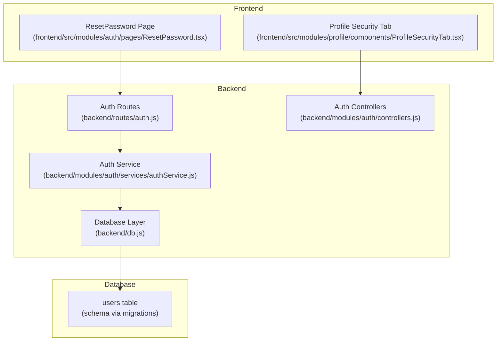
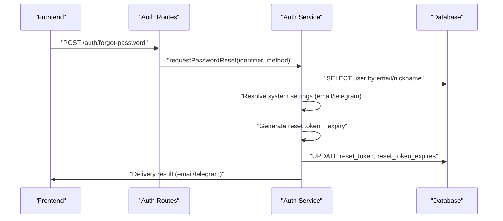
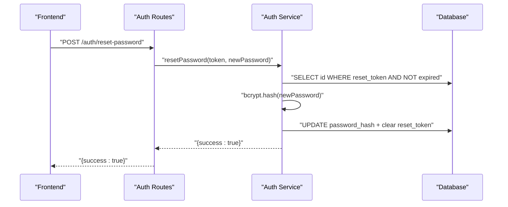
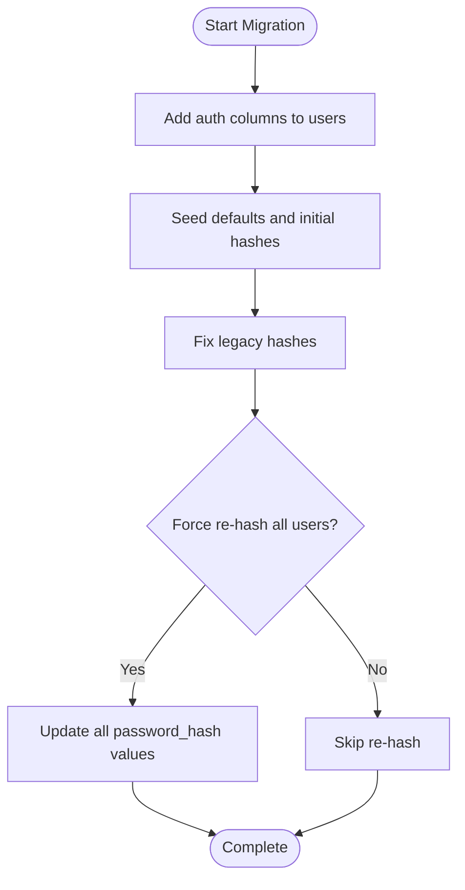

# Password Security & Management

<cite>
**Referenced Files in This Document**
- [backend/routes/auth.js](file://backend/routes/auth.js)
- [backend/modules/auth/services/authService.js](file://backend/modules/auth/services/authService.js)
- [backend/modules/auth/controllers.js](file://backend/modules/auth/controllers.js)
- [backend/db.js](file://backend/db.js)
- [backend/migrations/35_add_auth_columns_to_users.md](file://backend/migrations/35_add_auth_columns_to_users.md)
- [backend/migrations/36_fix_password_hashes.md](file://backend/migrations/36_fix_password_hashes.md)
- [backend/migrations/37_force_update_all_password_hashes.md](file://backend/migrations/37_force_update_all_password_hashes.md)
- [backend/migrations/07_create_users_table.md](file://backend/migrations/07_create_users_table.md)
- [docs/api/AUTH.md](file://docs/api/AUTH.md)
- [frontend/src/modules/auth/pages/ResetPassword.tsx](file://frontend/src/modules/auth/pages/ResetPassword.tsx)
- [frontend/src/modules/profile/components/ProfileSecurityTab.tsx](file://frontend/src/modules/profile/components/ProfileSecurityTab.tsx)
</cite>

## Table of Contents
1. [Introduction](#introduction)
2. [Project Structure](#project-structure)
3. [Core Components](#core-components)
4. [Architecture Overview](#architecture-overview)
5. [Detailed Component Analysis](#detailed-component-analysis)
6. [Dependency Analysis](#dependency-analysis)
7. [Performance Considerations](#performance-considerations)
8. [Troubleshooting Guide](#troubleshooting-guide)
9. [Conclusion](#conclusion)
10. [Appendices](#appendices)

## Introduction
This document provides comprehensive guidance for password security and management within the system. It covers hashing algorithms, salt generation, secure storage, password reset workflows, temporary token handling, validation rules, and migration procedures for upgrading legacy password handling. It also outlines best practices for breach prevention and user recovery processes.

## Project Structure
Password security spans backend routes and services, database schema, and frontend pages. The backend exposes authentication endpoints and manages password resets, while the database stores hashed credentials and reset tokens. Frontend pages implement user-facing flows for password reset and profile-based password changes.

**Diagram sources**
- [backend/routes/auth.js:1-246](file://backend/modules/auth/routes.js#L1-L33)
- [backend/modules/auth/services/authService.js:1-233](file://backend/modules/auth/services/authService.js#L1-L232)
- [backend/modules/auth/controllers.js:1-68](file://backend/modules/auth/controllers.js#L1-L68)
- [backend/db.js:1-68](file://backend/db.js#L1-L68)
- [backend/migrations/35_add_auth_columns_to_users.md:1-67](file://backend/migrations/35_add_auth_columns_to_users.md#L1-L67)

**Section sources**
- [backend/routes/auth.js:1-246](file://backend/modules/auth/routes.js#L1-L33)
- [backend/modules/auth/services/authService.js:1-233](file://backend/modules/auth/services/authService.js#L1-L232)
- [backend/modules/auth/controllers.js:1-68](file://backend/modules/auth/controllers.js#L1-L68)
- [backend/db.js:1-68](file://backend/db.js#L1-L68)
- [backend/migrations/35_add_auth_columns_to_users.md:1-67](file://backend/migrations/35_add_auth_columns_to_users.md#L1-L67)

## Core Components
- Authentication routes: handle login, forgot-password, and reset-password requests.
- Authentication service: orchestrates password verification, token generation, and reset execution.
- Database layer: executes queries and normalizes column names from snake_case to camelCase.
- Migrations: define and populate password-related columns and hashes.
- Frontend pages: implement user-facing reset and change-password flows.

Key responsibilities:
- Secure hashing with bcrypt and configurable cost factor.
- Temporary token generation with expiration and single-use semantics.
- Multi-channel password reset delivery (email and Telegram).
- Validation rules for minimum password length and confirmation checks.
- Legacy password hash migration and forced re-hashing.

**Section sources**
- [backend/routes/auth.js:16-86](file://backend/modules/auth/routes.js#L1-L33)
- [backend/modules/auth/services/authService.js:15-74](file://backend/modules/auth/services/authService.js#L15-L74)
- [backend/modules/auth/services/authService.js:79-192](file://backend/modules/auth/services/authService.js#L79-L192)
- [backend/modules/auth/services/authService.js:197-226](file://backend/modules/auth/services/authService.js#L197-L226)
- [backend/db.js:41-67](file://backend/db.js#L41-L67)
- [backend/migrations/35_add_auth_columns_to_users.md:5-67](file://backend/migrations/35_add_auth_columns_to_users.md#L5-L67)
- [backend/migrations/36_fix_password_hashes.md:5-10](file://backend/migrations/36_fix_password_hashes.md#L5-L9)
- [backend/migrations/37_force_update_all_password_hashes.md:5-10](file://backend/migrations/37_force_update_all_password_hashes.md#L5-L9)
- [frontend/src/modules/auth/pages/ResetPassword.tsx:34-53](file://frontend/src/modules/auth/pages/ResetPassword.tsx#L34-L53)
- [frontend/src/modules/profile/components/ProfileSecurityTab.tsx:15-85](file://frontend/src/modules/profile/components/ProfileSecurityTab.tsx#L15-L85)

## Architecture Overview
The authentication subsystem follows a layered pattern:
- Presentation: Express routes and controllers.
- Application: Auth service encapsulates business logic.
- Persistence: Database layer with normalized column access.
- Storage: users table with password_hash, reset_token, and reset_token_expires.

**Diagram sources**
- [backend/routes/auth.js:88-205](file://backend/modules/auth/routes.js#L1-L33)
- [backend/modules/auth/services/authService.js:79-192](file://backend/modules/auth/services/authService.js#L79-L192)
- [backend/db.js:58-67](file://backend/db.js#L58-L67)

## Detailed Component Analysis

### Password Hashing and Salt Generation
- Hashing algorithm: bcrypt.
- Cost factor: 10 rounds.
- Salt generation: automatic via bcrypt.
- Storage: password_hash column in users table.

Implementation highlights:
- Verification during login compares plaintext against stored bcrypt hash.
- Resetting password hashes the new password with bcrypt before updating storage.

Best practices:
- Keep bcrypt cost factor balanced for security/performance.
- Ensure consistent hashing across environments.

**Section sources**
- [backend/modules/auth/services/authService.js:41](file://backend/modules/auth/services/authService.js#L41)
- [backend/modules/auth/services/authService.js:216](file://backend/modules/auth/services/authService.js#L216)
- [backend/migrations/35_add_auth_columns_to_users.md:5-14](file://backend/migrations/35_add_auth_columns_to_users.md#L5-L14)
- [backend/migrations/36_fix_password_hashes.md:5-10](file://backend/migrations/36_fix_password_hashes.md#L5-L9)
- [backend/migrations/37_force_update_all_password_hashes.md:5-10](file://backend/migrations/37_force_update_all_password_hashes.md#L5-L9)

### Secure Password Storage Practices
- Column definitions: password_hash, reset_token, reset_token_expires.
- Default values and seeding: initial password hashing for existing users.
- Normalization: database layer converts column names to camelCase for JS consumption.

Recommendations:
- Enforce strong hashing and avoid storing plaintext.
- Regularly re-hash passwords for legacy users.
- Monitor and log authentication events.

**Section sources**
- [backend/migrations/35_add_auth_columns_to_users.md:5-58](file://backend/migrations/35_add_auth_columns_to_users.md#L5-L58)
- [backend/migrations/36_fix_password_hashes.md:5-10](file://backend/migrations/36_fix_password_hashes.md#L5-L9)
- [backend/migrations/37_force_update_all_password_hashes.md:5-10](file://backend/migrations/37_force_update_all_password_hashes.md#L5-L9)
- [backend/db.js:41-56](file://backend/db.js#L41-L56)

### Password Reset Workflow
End-to-end flow:
1. User initiates reset with identifier (email or nickname).
2. System resolves available channels (email/Telegram) based on settings and user profile.
3. If multiple channels are available, the user selects one.
4. Backend generates a random token and sets an expiration (1 hour).
5. Delivery via selected channel with a deep link containing the token.
6. User submits new password; backend validates token and updates hash.

**Diagram sources**
- [backend/routes/auth.js:207-243](file://backend/modules/auth/routes.js#L1-L33)
- [backend/modules/auth/services/authService.js:197-226](file://backend/modules/auth/services/authService.js#L197-L226)

**Section sources**
- [backend/routes/auth.js:88-205](file://backend/modules/auth/routes.js#L1-L33)
- [backend/modules/auth/services/authService.js:79-192](file://backend/modules/auth/services/authService.js#L79-L192)
- [backend/modules/auth/services/authService.js:197-226](file://backend/modules/auth/services/authService.js#L197-L226)
- [docs/api/AUTH.md:118-164](file://docs/api/AUTH.md#L118-L163)

### Temporary Token Generation and Expiration
- Token generation: random string combining alphanumeric segments and timestamp.
- Expiration: 1 hour from creation.
- Single-use semantics: token is cleared after successful reset.

Security considerations:
- Ensure tokens are unpredictable and sufficiently long-lived.
- Clear tokens immediately upon use.
- Log token creation and usage for auditing.

**Section sources**
- [backend/modules/auth/services/authService.js:158](file://backend/modules/auth/services/authService.js#L158)
- [backend/modules/auth/services/authService.js:159](file://backend/modules/auth/services/authService.js#L159)
- [backend/modules/auth/services/authService.js:161-164](file://backend/modules/auth/services/authService.js#L161-L164)
- [backend/modules/auth/services/authService.js:219-221](file://backend/modules/auth/services/authService.js#L219-L221)

### Password Validation Rules and Confirmation
- Minimum length: 6 characters for reset requests.
- Frontend confirmation: password and confirmation must match.
- Additional frontend constraint: minimum 4 characters before submission.

Operational notes:
- Enforce validation on both client and server.
- Provide clear error messages for invalid inputs.

**Section sources**
- [backend/modules/auth/services/authService.js:202-204](file://backend/modules/auth/services/authService.js#L202-L204)
- [frontend/src/modules/auth/pages/ResetPassword.tsx:34-37](file://frontend/src/modules/auth/pages/ResetPassword.tsx#L34-L37)
- [frontend/src/modules/auth/pages/ResetPassword.tsx:334-342](file://frontend/src/modules/auth/pages/ResetPassword.tsx#L121)

### Password History Tracking
- No password history tracking is implemented in the current codebase.
- Recommendation: introduce a password history table and enforce uniqueness or recency constraints to prevent reuse.

[No sources needed since this section provides recommendations without analyzing specific files]

### Migration Procedures for Password Security Improvements
- Add authentication columns to users table (password_hash, nickname, telegram_token, reset_token, reset_token_expires).
- Seed default values and initial hashes for existing users.
- Fix or force update password hashes to align with bcrypt.

**Diagram sources**
- [backend/migrations/35_add_auth_columns_to_users.md:5-67](file://backend/migrations/35_add_auth_columns_to_users.md#L5-L67)
- [backend/migrations/36_fix_password_hashes.md:5-10](file://backend/migrations/36_fix_password_hashes.md#L5-L9)
- [backend/migrations/37_force_update_all_password_hashes.md:5-10](file://backend/migrations/37_force_update_all_password_hashes.md#L5-L9)

**Section sources**
- [backend/migrations/35_add_auth_columns_to_users.md:5-67](file://backend/migrations/35_add_auth_columns_to_users.md#L5-L67)
- [backend/migrations/36_fix_password_hashes.md:5-10](file://backend/migrations/36_fix_password_hashes.md#L5-L9)
- [backend/migrations/37_force_update_all_password_hashes.md:5-10](file://backend/migrations/37_force_update_all_password_hashes.md#L5-L9)
- [backend/migrations/07_create_users_table.md:8-21](file://backend/migrations/07_create_users_table.md#L8-L21)

### Security Question Handling
- No security questions are implemented in the current codebase.
- Recommendation: implement optional security questions with hashed answers and rate-limiting for reset attempts.

[No sources needed since this section provides recommendations without analyzing specific files]

### User Password Recovery Processes
- Multi-channel delivery: email and Telegram.
- Graceful degradation: if one channel is unavailable, fallback to the other.
- No selection prompt: if only one channel is available, it is used automatically.
- Error handling: masked responses to avoid leaking account existence.

**Section sources**
- [backend/modules/auth/services/authService.js:120-134](file://backend/modules/auth/services/authService.js#L120-L134)
- [backend/modules/auth/services/authService.js:136-155](file://backend/modules/auth/services/authService.js#L136-L155)
- [backend/routes/auth.js:125-140](file://backend/modules/auth/routes.js#L1-L33)
- [backend/routes/auth.js:142-161](file://backend/modules/auth/routes.js#L1-L33)

## Dependency Analysis
- Routes depend on the Auth Service for business logic.
- Auth Service depends on the Database layer for persistence.
- Database layer depends on environment configuration and normalizes column names.
- Frontend pages depend on backend endpoints for reset and change-password actions.

**Diagram sources**
- [backend/routes/auth.js:1-14](file://backend/modules/auth/routes.js#L1-L14)
- [backend/modules/auth/services/authService.js:1-11](file://backend/modules/auth/services/authService.js#L1-L11)
- [backend/db.js:1-10](file://backend/db.js#L1-L10)

**Section sources**
- [backend/routes/auth.js:1-14](file://backend/modules/auth/routes.js#L1-L14)
- [backend/modules/auth/services/authService.js:1-11](file://backend/modules/auth/services/authService.js#L1-L11)
- [backend/db.js:1-10](file://backend/db.js#L1-L10)

## Performance Considerations
- bcrypt cost factor (10) balances security and performance; adjust based on hardware capacity.
- Token generation uses randomness; ensure sufficient entropy.
- Database normalization adds minimal overhead; keep queries indexed on lookup columns (email, nickname).
- Avoid repeated hashing by caching validated tokens within their lifetime window.

[No sources needed since this section provides general guidance]

## Troubleshooting Guide
Common issues and resolutions:
- Invalid or expired token: verify token presence and expiration before hashing and updating.
- Insufficient password length: enforce minimum length on both client and server.
- Channel unavailability: confirm system settings and user profile fields for email/Telegram.
- Missing credentials: ensure identifier and password are provided for login.
- Notification failures: check integration configurations and logs.

**Section sources**
- [backend/modules/auth/services/authService.js:202-204](file://backend/modules/auth/services/authService.js#L202-L204)
- [backend/modules/auth/services/authService.js:211-213](file://backend/modules/auth/services/authService.js#L211-L213)
- [backend/routes/auth.js:24-27](file://backend/modules/auth/routes.js#L24-L27)
- [backend/modules/auth/services/authService.js:120-134](file://backend/modules/auth/services/authService.js#L120-L134)

## Conclusion
The system implements robust password security fundamentals: bcrypt hashing, secure tokenized reset workflows, and multi-channel delivery. Migrations establish secure storage foundations, while frontend validations improve user experience. Recommendations include adding password history tracking, optional security questions, and continuous monitoring for improved resilience.

[No sources needed since this section summarizes without analyzing specific files]

## Appendices

### API Definitions
- POST /auth/login: Authenticate with email/identifier and password; returns JWT token.
- POST /auth/forgot-password: Initiate password reset; returns channel selection or delivery confirmation.
- POST /auth/reset-password: Complete reset with token and new password.

**Section sources**
- [docs/api/AUTH.md:109-164](file://docs/api/AUTH.md#L109-L163)