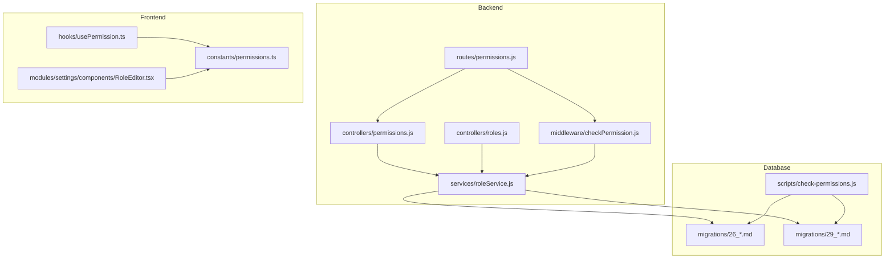
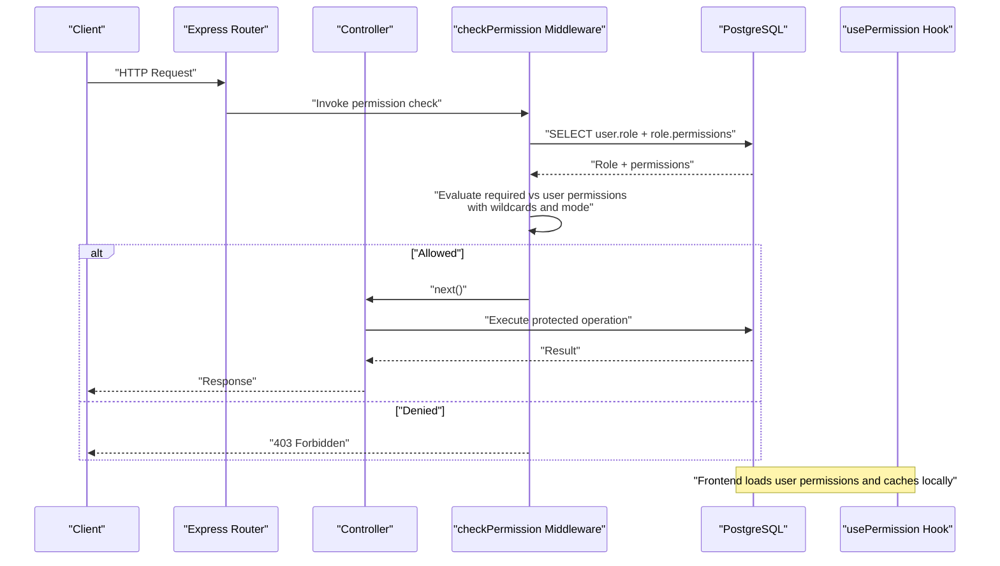
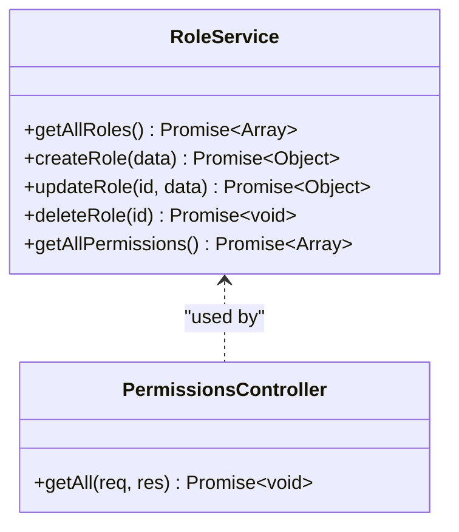
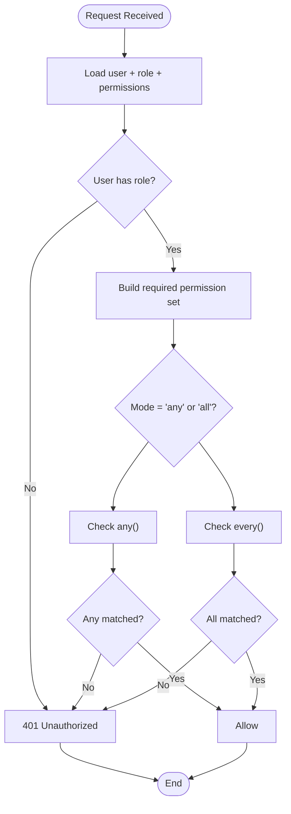
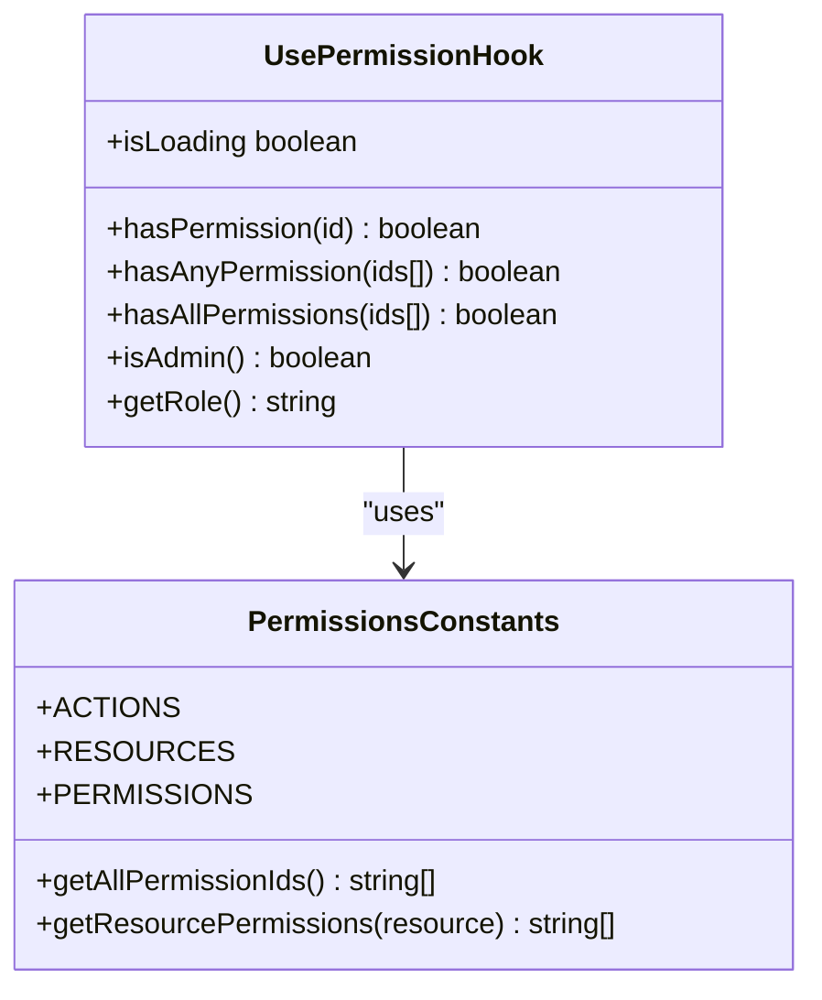
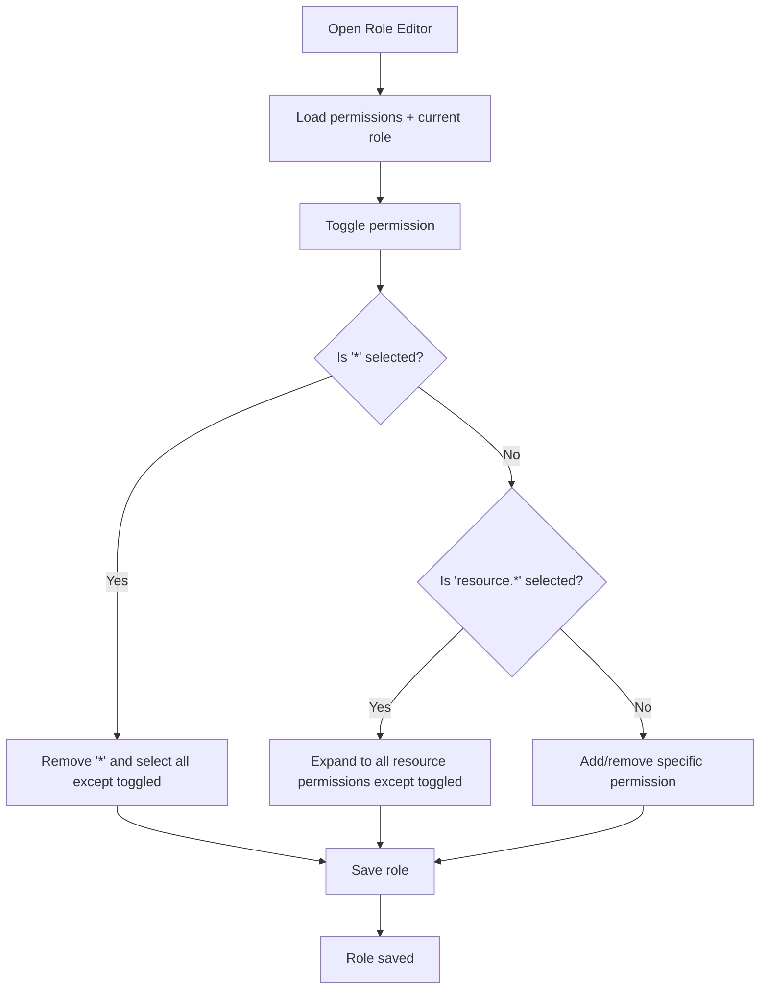
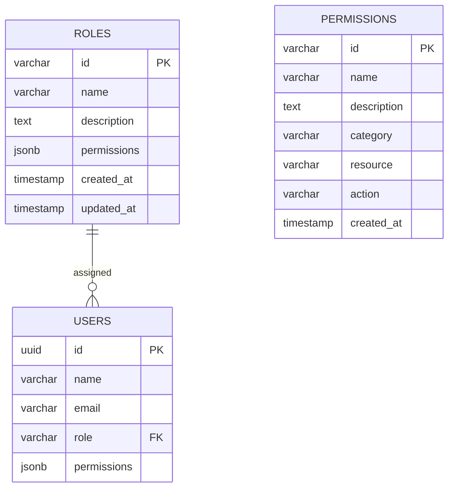
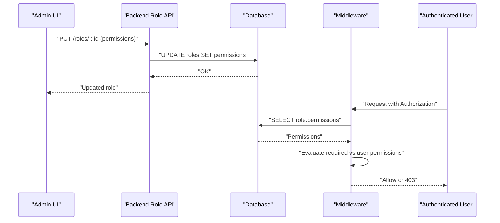
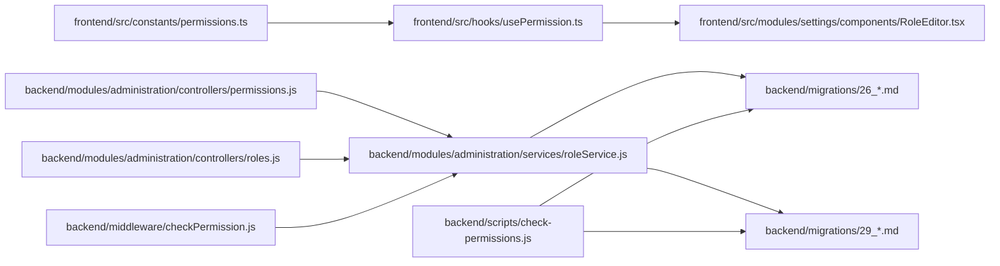

# Permission Management

<cite>
**Referenced Files in This Document**
- [backend/modules/administration/controllers/permissions.js](file://backend/modules/administration/controllers/permissions.js)
- [backend/modules/administration/controllers/roles.js](file://backend/modules/administration/controllers/roles.js)
- [backend/modules/administration/routes/permissions.js](file://backend/modules/administration/routes/permissions.js)
- [backend/modules/administration/services/roleService.js](file://backend/modules/administration/services/roleService.js)
- [backend/middleware/checkPermission.js](file://backend/middleware/checkPermission.js)
- [backend/migrations/26_create_roles_and_permissions_tables.md](file://backend/migrations/26_create_roles_and_permissions_tables.md)
- [backend/migrations/29_seed_access_matrix.md](file://backend/migrations/29_seed_access_matrix.md)
- [backend/scripts/check-permissions.js](file://backend/scripts/check-permissions.js)
- [backend/check-permissions.js](file://backend/scripts/check-permissions.js)
- [frontend/src/constants/permissions.ts](file://frontend/src/constants/permissions.ts)
- [frontend/src/hooks/usePermission.ts](file://frontend/src/hooks/usePermission.ts)
- [frontend/src/modules/settings/components/RoleEditor.tsx](file://frontend/src/modules/settings/components/RoleEditor.tsx)
</cite>

## Table of Contents
1. [Introduction](#introduction)
2. [Project Structure](#project-structure)
3. [Core Components](#core-components)
4. [Architecture Overview](#architecture-overview)
5. [Detailed Component Analysis](#detailed-component-analysis)
6. [Dependency Analysis](#dependency-analysis)
7. [Performance Considerations](#performance-considerations)
8. [Troubleshooting Guide](#troubleshooting-guide)
9. [Conclusion](#conclusion)
10. [Appendices](#appendices)

## Introduction
This document describes the permission management system used by the CRM. It covers the permission matrix, access control rules, role-to-permission relationships, dynamic permission evaluation, and enforcement mechanisms. It also documents the database schema, migration and seeding procedures, and provides guidance for auditing, debugging, and maintaining access control consistency.

## Project Structure
The permission system spans backend controllers and services, middleware for runtime checks, frontend permission constants and hooks, and database migrations and scripts for schema and data initialization.

**Diagram sources**
- [backend/modules/administration/routes/permissions.js:1-17](file://backend/modules/administration/routes/permissions.js#L1-L16)
- [backend/modules/administration/controllers/permissions.js:1-21](file://backend/modules/administration/controllers/permissions.js#L1-L20)
- [backend/modules/administration/controllers/roles.js:1-56](file://backend/modules/administration/controllers/roles.js#L1-L55)
- [backend/modules/administration/services/roleService.js:1-109](file://backend/modules/administration/services/roleService.js#L1-L108)
- [backend/middleware/checkPermission.js:1-130](file://backend/middleware/checkPermission.js#L1-L129)
- [frontend/src/constants/permissions.ts:1-245](file://frontend/src/constants/permissions.ts#L1-L245)
- [frontend/src/hooks/usePermission.ts:1-113](file://frontend/src/hooks/usePermission.ts#L1-L112)
- [frontend/src/modules/settings/components/RoleEditor.tsx:176-331](file://frontend/src/modules/settings/components/RoleEditor.tsx#L176-L331)
- [backend/migrations/26_create_roles_and_permissions_tables.md:1-61](file://backend/migrations/26_create_roles_and_permissions_tables.md#L1-L60)
- [backend/migrations/29_seed_access_matrix.md:1-207](file://backend/migrations/29_seed_access_matrix.md#L1-L207)
- [backend/scripts/check-permissions.js:1-253](file://backend/scripts/check-permissions.js#L1-L252)

**Section sources**
- [backend/modules/administration/routes/permissions.js:1-17](file://backend/modules/administration/routes/permissions.js#L1-L16)
- [backend/modules/administration/controllers/permissions.js:1-21](file://backend/modules/administration/controllers/permissions.js#L1-L20)
- [backend/modules/administration/controllers/roles.js:1-56](file://backend/modules/administration/controllers/roles.js#L1-L55)
- [backend/modules/administration/services/roleService.js:1-109](file://backend/modules/administration/services/roleService.js#L1-L108)
- [backend/middleware/checkPermission.js:1-130](file://backend/middleware/checkPermission.js#L1-L129)
- [frontend/src/constants/permissions.ts:1-245](file://frontend/src/constants/permissions.ts#L1-L245)
- [frontend/src/hooks/usePermission.ts:1-113](file://frontend/src/hooks/usePermission.ts#L1-L112)
- [frontend/src/modules/settings/components/RoleEditor.tsx:176-331](file://frontend/src/modules/settings/components/RoleEditor.tsx#L176-L331)
- [backend/migrations/26_create_roles_and_permissions_tables.md:1-61](file://backend/migrations/26_create_roles_and_permissions_tables.md#L1-L60)
- [backend/migrations/29_seed_access_matrix.md:1-207](file://backend/migrations/29_seed_access_matrix.md#L1-L207)
- [backend/scripts/check-permissions.js:1-253](file://backend/scripts/check-permissions.js#L1-L252)

## Core Components
- Backend permission controller and service: expose endpoints to fetch permissions and manage roles, including CRUD operations and permission retrieval.
- Middleware permission checker: evaluates user permissions against required permissions with wildcard support and mode selection (any/all).
- Frontend permission constants and hook: define canonical permission IDs and provide runtime checks for UI visibility and actions.
- Database schema and seed: roles and permissions tables with default roles and permissions, plus comprehensive access matrix seeding.
- Audit and reset scripts: verify and reset permissions and roles to defaults.

Key responsibilities:
- Define canonical permission IDs and categorization on the frontend.
- Enforce access control at the route level via middleware.
- Persist roles and permissions in the database with JSONB for flexible permission sets.
- Provide UI controls to build roles with granular or wildcard permissions.

**Section sources**
- [backend/modules/administration/controllers/permissions.js:9-20](file://backend/modules/administration/controllers/permissions.js#L9-L20)
- [backend/modules/administration/controllers/roles.js:13-48](file://backend/modules/administration/controllers/roles.js#L13-L48)
- [backend/modules/administration/services/roleService.js:11-100](file://backend/modules/administration/services/roleService.js#L11-L100)
- [backend/middleware/checkPermission.js:13-26](file://backend/middleware/checkPermission.js#L13-L26)
- [frontend/src/constants/permissions.ts:57-245](file://frontend/src/constants/permissions.ts#L57-L245)
- [frontend/src/hooks/usePermission.ts:55-112](file://frontend/src/hooks/usePermission.ts#L55-L112)

## Architecture Overview
The system enforces permissions at two layers:
- Backend middleware validates permissions per request using the user’s role-derived permission set.
- Frontend checks permissions for UI rendering and action availability.

**Diagram sources**
- [backend/middleware/checkPermission.js:37-126](file://backend/middleware/checkPermission.js#L37-L126)
- [backend/modules/administration/routes/permissions.js:14-14](file://backend/modules/administration/routes/permissions.js#L14)
- [backend/modules/administration/controllers/permissions.js:13-16](file://backend/modules/administration/controllers/permissions.js#L13-L16)
- [frontend/src/hooks/usePermission.ts:21-49](file://frontend/src/hooks/usePermission.ts#L21-L49)

## Detailed Component Analysis

### Backend Services and Controllers
- Role service:
  - Retrieves roles with user counts and parses stored JSONB permissions.
  - Creates, updates, and deletes roles while validating referential integrity.
  - Exposes a method to fetch all available permissions.
- Permissions controller:
  - Returns the canonical list of permissions for administrative use.

**Diagram sources**
- [backend/modules/administration/services/roleService.js:11-100](file://backend/modules/administration/services/roleService.js#L11-L100)
- [backend/modules/administration/controllers/permissions.js:13-16](file://backend/modules/administration/controllers/permissions.js#L13-L16)

**Section sources**
- [backend/modules/administration/services/roleService.js:11-100](file://backend/modules/administration/services/roleService.js#L11-L100)
- [backend/modules/administration/controllers/permissions.js:13-16](file://backend/modules/administration/controllers/permissions.js#L13-L16)

### Middleware Permission Evaluation
- Extracts user identity from Authorization header or fallback headers.
- Loads user role and permissions from the database.
- Supports:
  - Exact permission matches.
  - Global wildcard (“*”).
  - Resource-level wildcard (“resource.*”).
  - Mode selection: “any” requires at least one permission, “all” requires all.
- Logs denial attempts with user, role, requested, and granted permissions.

**Diagram sources**
- [backend/middleware/checkPermission.js:37-126](file://backend/middleware/checkPermission.js#L37-L126)

**Section sources**
- [backend/middleware/checkPermission.js:13-26](file://backend/middleware/checkPermission.js#L13-L26)
- [backend/middleware/checkPermission.js:37-126](file://backend/middleware/checkPermission.js#L37-L126)

### Frontend Permission Constants and Hook
- Canonical permission IDs are defined centrally with resources and actions.
- The hook:
  - Loads user role and permissions from local storage or server.
  - Supports wildcard admin behavior.
  - Provides helpers for single, any, and all permission checks.

**Diagram sources**
- [frontend/src/constants/permissions.ts:13-245](file://frontend/src/constants/permissions.ts#L13-L245)
- [frontend/src/hooks/usePermission.ts:55-112](file://frontend/src/hooks/usePermission.ts#L55-L112)

**Section sources**
- [frontend/src/constants/permissions.ts:57-245](file://frontend/src/constants/permissions.ts#L57-L245)
- [frontend/src/hooks/usePermission.ts:17-112](file://frontend/src/hooks/usePermission.ts#L17-L112)

### Role Editor (UI)
- Allows administrators to build roles with granular permissions or wildcards.
- Handles wildcard expansion and collapse:
  - Selecting “resource.*” selects all permissions for that resource.
  - Selecting “*” selects all permissions.
  - Removing a specific permission under an existing “resource.*” expands to explicit IDs.

**Diagram sources**
- [frontend/src/modules/settings/components/RoleEditor.tsx:182-306](file://frontend/src/modules/settings/components/RoleEditor.tsx#L182-L306)

**Section sources**
- [frontend/src/modules/settings/components/RoleEditor.tsx:182-306](file://frontend/src/modules/settings/components/RoleEditor.tsx#L182-L306)

### Database Schema and Seeding
- Roles table stores role metadata and a JSONB array of permissions.
- Permissions table defines canonical permission entries with category, resource, and action.
- Initial seeding establishes default roles and permissions, and assigns baseline permissions to existing users.

**Diagram sources**
- [backend/migrations/26_create_roles_and_permissions_tables.md:9-28](file://backend/migrations/26_create_roles_and_permissions_tables.md#L9-L28)
- [backend/migrations/29_seed_access_matrix.md:17-61](file://backend/migrations/29_seed_access_matrix.md#L17-L61)

**Section sources**
- [backend/migrations/26_create_roles_and_permissions_tables.md:9-28](file://backend/migrations/26_create_roles_and_permissions_tables.md#L9-L28)
- [backend/migrations/29_seed_access_matrix.md:67-140](file://backend/migrations/29_seed_access_matrix.md#L67-L140)

### Permission Assignment Workflows
- Backend:
  - Administrators call role endpoints to create or update roles with permission arrays.
  - Middleware resolves user permissions from the database and enforces checks.
- Frontend:
  - Administrators use the Role Editor to assign permissions to roles.
  - UI respects wildcard semantics and collapses/expands selections automatically.

**Diagram sources**
- [backend/modules/administration/controllers/roles.js:31-34](file://backend/modules/administration/controllers/roles.js#L31-L34)
- [backend/modules/administration/services/roleService.js:59-78](file://backend/modules/administration/services/roleService.js#L59-L78)
- [backend/middleware/checkPermission.js:37-126](file://backend/middleware/checkPermission.js#L37-L126)

**Section sources**
- [backend/modules/administration/controllers/roles.js:22-34](file://backend/modules/administration/controllers/roles.js#L22-L34)
- [backend/modules/administration/services/roleService.js:59-78](file://backend/modules/administration/services/roleService.js#L59-L78)
- [backend/middleware/checkPermission.js:37-126](file://backend/middleware/checkPermission.js#L37-L126)

## Dependency Analysis
- Controllers depend on the role service for data access.
- Middleware depends on the database to resolve user permissions.
- Frontend constants and hook depend on backend-provided permissions and local storage.
- Database migrations define the schema and initial data; scripts maintain consistency.

**Diagram sources**
- [frontend/src/constants/permissions.ts:1-245](file://frontend/src/constants/permissions.ts#L1-L245)
- [frontend/src/hooks/usePermission.ts:1-113](file://frontend/src/hooks/usePermission.ts#L1-L112)
- [frontend/src/modules/settings/components/RoleEditor.tsx:176-331](file://frontend/src/modules/settings/components/RoleEditor.tsx#L176-L331)
- [backend/modules/administration/controllers/permissions.js:1-21](file://backend/modules/administration/controllers/permissions.js#L1-L20)
- [backend/modules/administration/controllers/roles.js:1-56](file://backend/modules/administration/controllers/roles.js#L1-L55)
- [backend/modules/administration/services/roleService.js:1-109](file://backend/modules/administration/services/roleService.js#L1-L108)
- [backend/middleware/checkPermission.js:1-130](file://backend/middleware/checkPermission.js#L1-L129)
- [backend/migrations/26_create_roles_and_permissions_tables.md:1-61](file://backend/migrations/26_create_roles_and_permissions_tables.md#L1-L60)
- [backend/migrations/29_seed_access_matrix.md:1-207](file://backend/migrations/29_seed_access_matrix.md#L1-L207)
- [backend/scripts/check-permissions.js:1-253](file://backend/scripts/check-permissions.js#L1-L252)

**Section sources**
- [backend/modules/administration/controllers/permissions.js:1-21](file://backend/modules/administration/controllers/permissions.js#L1-L20)
- [backend/modules/administration/controllers/roles.js:1-56](file://backend/modules/administration/controllers/roles.js#L1-L55)
- [backend/modules/administration/services/roleService.js:1-109](file://backend/modules/administration/services/roleService.js#L1-L108)
- [backend/middleware/checkPermission.js:1-130](file://backend/middleware/checkPermission.js#L1-L129)
- [frontend/src/constants/permissions.ts:1-245](file://frontend/src/constants/permissions.ts#L1-L245)
- [frontend/src/hooks/usePermission.ts:1-113](file://frontend/src/hooks/usePermission.ts#L1-L112)
- [frontend/src/modules/settings/components/RoleEditor.tsx:176-331](file://frontend/src/modules/settings/components/RoleEditor.tsx#L176-L331)
- [backend/migrations/26_create_roles_and_permissions_tables.md:1-61](file://backend/migrations/26_create_roles_and_permissions_tables.md#L1-L60)
- [backend/migrations/29_seed_access_matrix.md:1-207](file://backend/migrations/29_seed_access_matrix.md#L1-L207)
- [backend/scripts/check-permissions.js:1-253](file://backend/scripts/check-permissions.js#L1-L252)

## Performance Considerations
- Middleware performs a single query to fetch user and role permissions; ensure appropriate indexing on user and role identifiers.
- JSONB permissions enable flexible storage but may benefit from normalized joins for very large datasets; current design favors simplicity and readability.
- Frontend caching of permissions reduces repeated network requests; ensure cache invalidation on role changes.

## Troubleshooting Guide
Common issues and resolutions:
- Access denied with wildcard or resource-level wildcard:
  - Verify the user’s role includes the required wildcard or resource-level permission.
  - Confirm the middleware mode setting (“any” vs “all”) aligns with expectations.
- Role deletion blocked:
  - Ensure no users are assigned the role; the service prevents deletion if users still reference it.
- Admin role behavior:
  - Admin users receive a wildcard (“*”) allowing all actions; confirm role assignment and local storage state.
- Database inconsistencies:
  - Use the provided scripts to audit or reset permissions and roles to defaults.

Operational commands:
- Audit permissions and roles:
  - Run the backend check script to print user, role, and permission counts and groupings.
- Reset permissions and roles:
  - Run the reset script to clear and re-seed default permissions and roles.

**Section sources**
- [backend/middleware/checkPermission.js:84-116](file://backend/middleware/checkPermission.js#L84-L116)
- [backend/modules/administration/services/roleService.js:84-91](file://backend/modules/administration/services/roleService.js#L84-L91)
- [frontend/src/hooks/usePermission.ts:27-31](file://frontend/src/hooks/usePermission.ts#L27-L31)
- [backend/scripts/check-permissions.js:142-198](file://backend/scripts/check-permissions.js#L142-L198)
- [backend/scripts/check-permissions.js:203-244](file://backend/scripts/check-permissions.js#L203-L244)

## Conclusion
The permission management system combines a canonical permission model, flexible wildcard-based inheritance, and layered enforcement across backend middleware and frontend UI. The database schema supports extensibility, while migrations and scripts ensure consistent initialization and maintenance. Administrators can efficiently assign and audit permissions using dedicated UI and CLI tools.

## Appendices

### Database Migration Procedures
- Apply migration 26 to create roles and permissions tables and insert defaults.
- Apply migration 29 to seed comprehensive roles and permissions and update existing users.

**Section sources**
- [backend/migrations/26_create_roles_and_permissions_tables.md:1-61](file://backend/migrations/26_create_roles_and_permissions_tables.md#L1-L60)
- [backend/migrations/29_seed_access_matrix.md:1-207](file://backend/migrations/29_seed_access_matrix.md#L1-L207)

### Permission Seeding Processes
- Default roles and permissions are inserted during migrations.
- A dedicated script can reset permissions and roles to defaults for development or recovery scenarios.

**Section sources**
- [backend/migrations/29_seed_access_matrix.md:17-61](file://backend/migrations/29_seed_access_matrix.md#L17-L61)
- [backend/scripts/check-permissions.js:203-244](file://backend/scripts/check-permissions.js#L203-L244)

### Permission Auditing and Debugging
- Use the backend check script to inspect users, roles, and permissions.
- Review middleware logs for access denials and user/role details.
- Confirm frontend hook behavior for wildcard and role-based permissions.

**Section sources**
- [backend/scripts/check-permissions.js:142-198](file://backend/scripts/check-permissions.js#L142-L198)
- [backend/middleware/checkPermission.js:90-115](file://backend/middleware/checkPermission.js#L90-L115)
- [frontend/src/hooks/usePermission.ts:21-49](file://frontend/src/hooks/usePermission.ts#L21-L49)