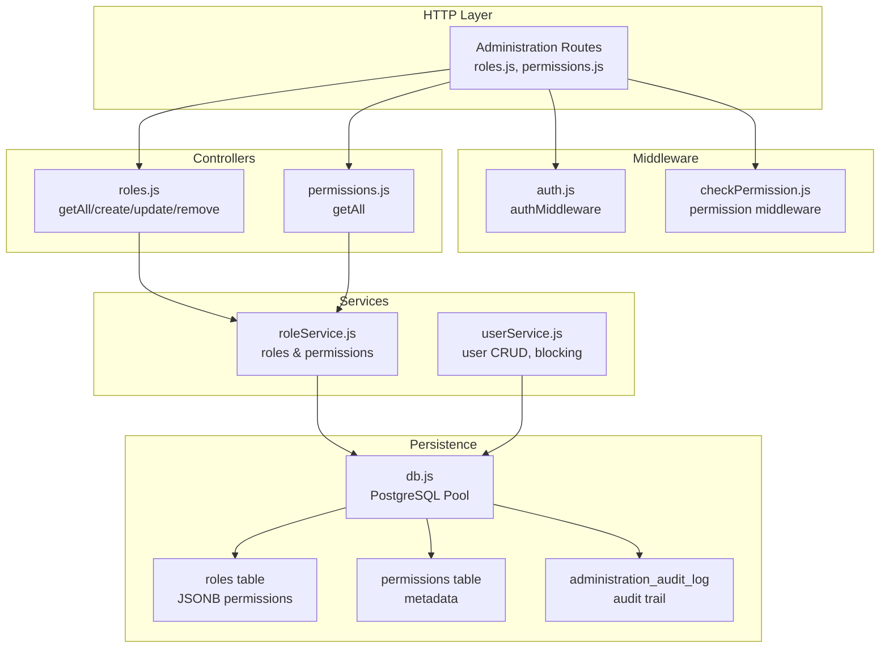
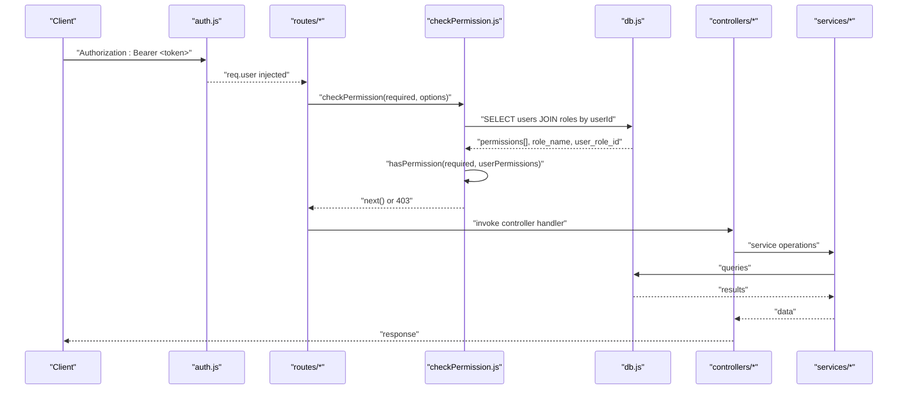
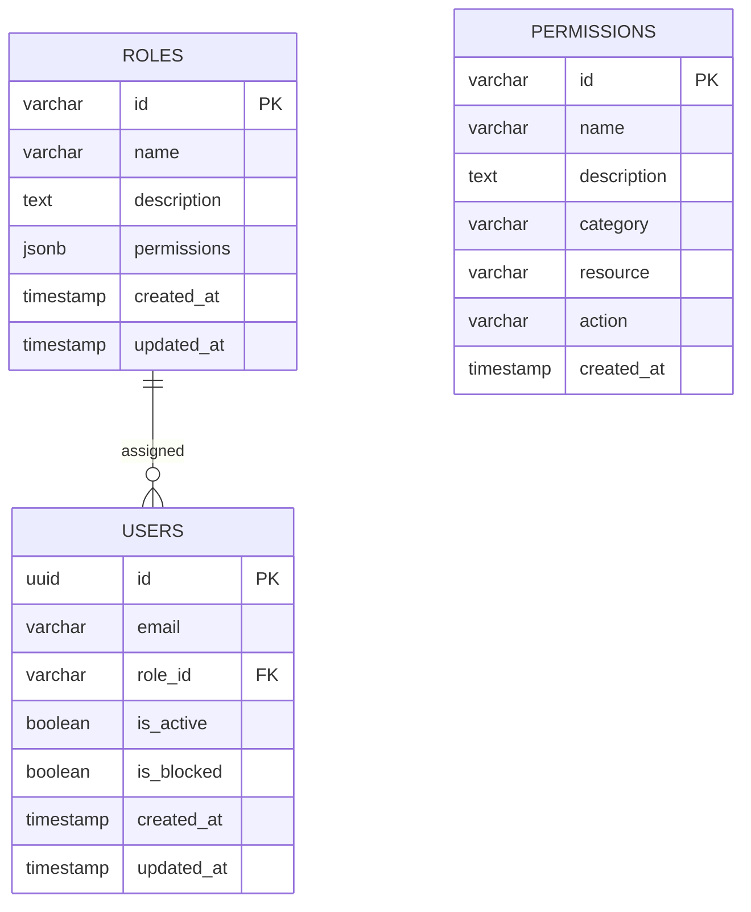
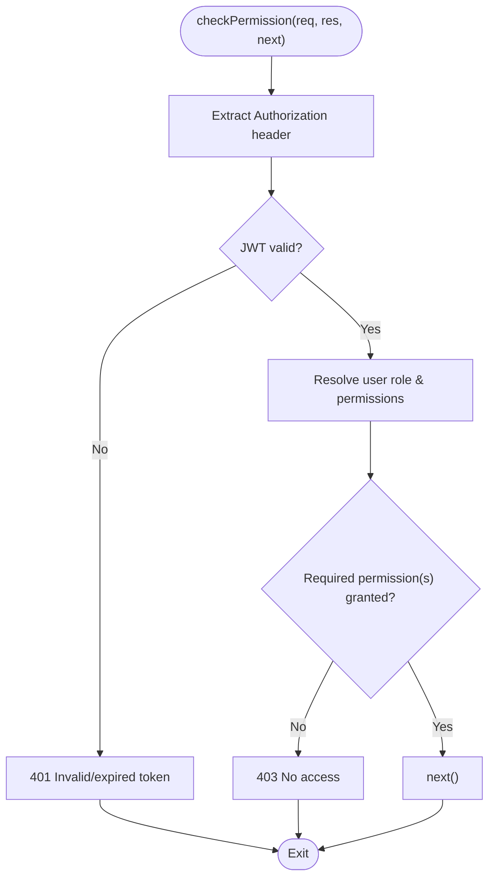
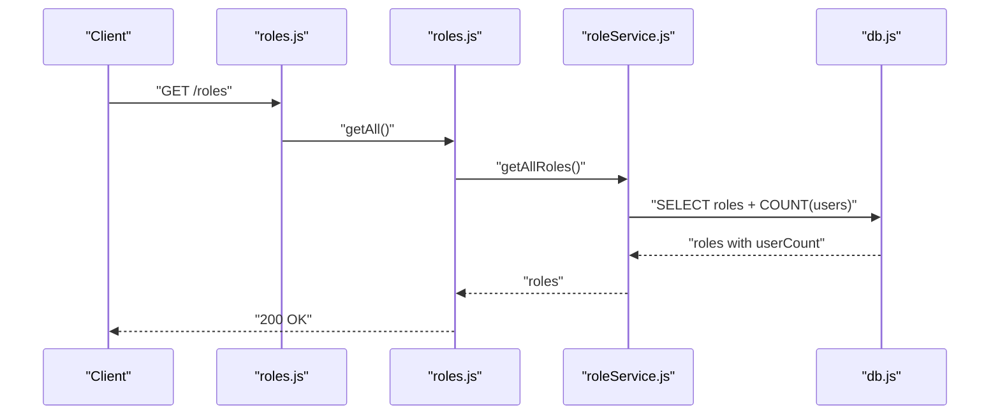
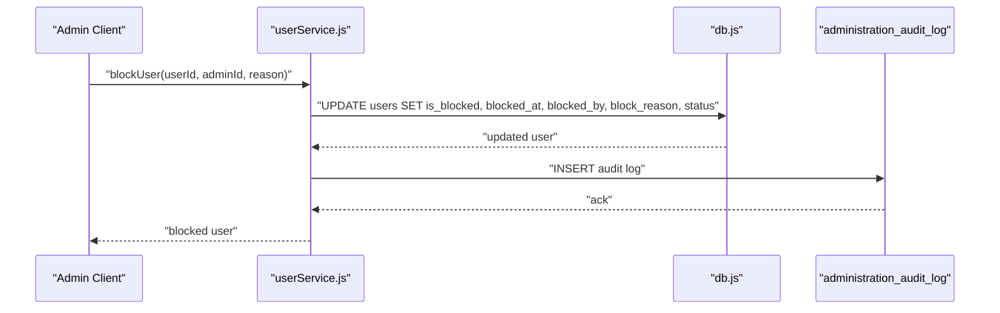
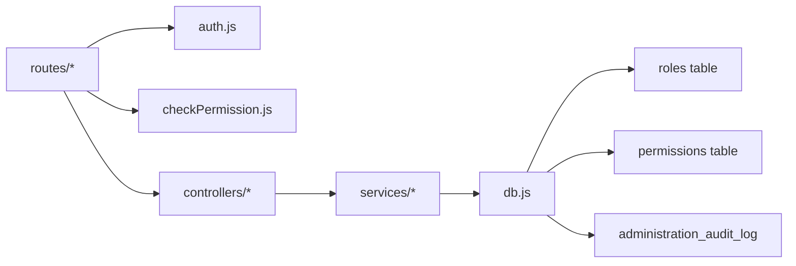

# Role-Based Access Control (RBAC)

<cite>
**Referenced Files in This Document**
- [backend/middleware/checkPermission.js](file://backend/middleware/checkPermission.js)
- [backend/middleware/auth.js](file://backend/middleware/auth.js)
- [backend/modules/administration/services/roleService.js](file://backend/modules/administration/services/roleService.js)
- [backend/modules/administration/controllers/roles.js](file://backend/modules/administration/controllers/roles.js)
- [backend/modules/administration/routes/roles.js](file://backend/modules/administration/routes/roles.js)
- [backend/modules/administration/controllers/permissions.js](file://backend/modules/administration/controllers/permissions.js)
- [backend/modules/administration/routes/permissions.js](file://backend/modules/administration/routes/permissions.js)
- [backend/modules/administration/services/userService.js](file://backend/modules/administration/services/userService.js)
- [backend/migrations/26_create_roles_and_permissions_tables.md](file://backend/migrations/26_create_roles_and_permissions_tables.md)
- [backend/migrations/29_seed_access_matrix.md](file://backend/migrations/29_seed_access_matrix.md)
- [backend/migrations/2026-05-04-01-create-audit-log.js](file://backend/migrations/2026-05-04-01-create-audit-log.js)
- [backend/utils/auditLogger.js](file://backend/utils/auditLogger.js)
- [backend/db.js](file://backend/db.js)
</cite>

## Table of Contents
1. [Introduction](#introduction)
2. [Project Structure](#project-structure)
3. [Core Components](#core-components)
4. [Architecture Overview](#architecture-overview)
5. [Detailed Component Analysis](#detailed-component-analysis)
6. [Dependency Analysis](#dependency-analysis)
7. [Performance Considerations](#performance-considerations)
8. [Troubleshooting Guide](#troubleshooting-guide)
9. [Conclusion](#conclusion)
10. [Appendices](#appendices)

## Introduction
This document describes the Role-Based Access Control (RBAC) system implemented in the backend. It covers the role hierarchy, permission matrix, access control middleware, user role resolution, dynamic permission checking, role-service implementation, permission validation logic, user blocking functionality, role management workflows, permission auditing, and security boundary enforcement. The system is built around JWT-based authentication, route-level permission guards, and database-backed roles and permissions stored as JSONB arrays.

## Project Structure
The RBAC implementation spans middleware, administration routes/controllers/services, database migrations, and audit utilities. Key areas:
- Authentication middleware validates JWT tokens and injects user identity.
- Permission middleware resolves user roles and checks required permissions with wildcard support.
- Administration module exposes endpoints to manage roles and fetch permissions.
- Database migrations define roles and permissions tables and seed default data.
- Audit logging tracks administrative actions for compliance.

**Diagram sources**
- [backend/modules/administration/routes/roles.js:1-20](file://backend/modules/administration/routes/roles.js#L1-L19)
- [backend/modules/administration/routes/permissions.js:1-16](file://backend/modules/administration/routes/permissions.js#L1-L16)
- [backend/middleware/auth.js:1-82](file://backend/middleware/auth.js#L1-L81)
- [backend/middleware/checkPermission.js:1-130](file://backend/middleware/checkPermission.js#L1-L129)
- [backend/modules/administration/controllers/roles.js:1-56](file://backend/modules/administration/controllers/roles.js#L1-L55)
- [backend/modules/administration/controllers/permissions.js:1-20](file://backend/modules/administration/controllers/permissions.js#L1-L20)
- [backend/modules/administration/services/roleService.js:1-109](file://backend/modules/administration/services/roleService.js#L1-L108)
- [backend/modules/administration/services/userService.js:1-554](file://backend/modules/administration/services/userService.js#L1-L553)
- [backend/db.js:1-68](file://backend/db.js#L1-L68)
- [backend/migrations/26_create_roles_and_permissions_tables.md:1-61](file://backend/migrations/26_create_roles_and_permissions_tables.md#L1-L60)
- [backend/migrations/29_seed_access_matrix.md:1-207](file://backend/migrations/29_seed_access_matrix.md#L1-L207)
- [backend/migrations/2026-05-04-01-create-audit-log.js:1-46](file://backend/migrations/2026-05-04-01-create-audit-log.js#L1-L46)

**Section sources**
- [backend/modules/administration/routes/roles.js:1-20](file://backend/modules/administration/routes/roles.js#L1-L19)
- [backend/modules/administration/routes/permissions.js:1-16](file://backend/modules/administration/routes/permissions.js#L1-L16)
- [backend/middleware/auth.js:1-82](file://backend/middleware/auth.js#L1-L81)
- [backend/middleware/checkPermission.js:1-130](file://backend/middleware/checkPermission.js#L1-L129)
- [backend/modules/administration/services/roleService.js:1-109](file://backend/modules/administration/services/roleService.js#L1-L108)
- [backend/modules/administration/services/userService.js:1-554](file://backend/modules/administration/services/userService.js#L1-L553)
- [backend/migrations/26_create_roles_and_permissions_tables.md:1-61](file://backend/migrations/26_create_roles_and_permissions_tables.md#L1-L60)
- [backend/migrations/29_seed_access_matrix.md:1-207](file://backend/migrations/29_seed_access_matrix.md#L1-L207)
- [backend/migrations/2026-05-04-01-create-audit-log.js:1-46](file://backend/migrations/2026-05-04-01-create-audit-log.js#L1-L46)
- [backend/db.js:1-68](file://backend/db.js#L1-L68)

## Core Components
- Authentication middleware: Extracts and verifies JWT tokens, supports optional auth and mock tokens for development.
- Permission middleware: Resolves user role and permissions, supports exact matches, global wildcard, and resource-level wildcards; supports “any” or “all” modes for arrays.
- Role service: CRUD for roles, permission enumeration, and user-count aggregation.
- User service: User lifecycle operations, including blocking/unblocking with audit logging.
- Database: Roles and permissions tables with JSONB permissions; audit log table for administrative actions.

**Section sources**
- [backend/middleware/auth.js:1-82](file://backend/middleware/auth.js#L1-L81)
- [backend/middleware/checkPermission.js:1-130](file://backend/middleware/checkPermission.js#L1-L129)
- [backend/modules/administration/services/roleService.js:1-109](file://backend/modules/administration/services/roleService.js#L1-L108)
- [backend/modules/administration/services/userService.js:1-554](file://backend/modules/administration/services/userService.js#L1-L553)
- [backend/migrations/26_create_roles_and_permissions_tables.md:1-61](file://backend/migrations/26_create_roles_and_permissions_tables.md#L1-L60)
- [backend/migrations/29_seed_access_matrix.md:1-207](file://backend/migrations/29_seed_access_matrix.md#L1-L207)
- [backend/migrations/2026-05-04-01-create-audit-log.js:1-46](file://backend/migrations/2026-05-04-01-create-audit-log.js#L1-L46)

## Architecture Overview
The RBAC architecture enforces access control at the route level via middleware. Authentication middleware ensures a valid user identity is present. Permission middleware resolves the user’s permissions from the database and evaluates against required permissions with wildcard semantics. Administration routes delegate to controllers, which call services to interact with the database.

**Diagram sources**
- [backend/middleware/auth.js:1-82](file://backend/middleware/auth.js#L1-L81)
- [backend/middleware/checkPermission.js:1-130](file://backend/middleware/checkPermission.js#L1-L129)
- [backend/modules/administration/routes/roles.js:1-20](file://backend/modules/administration/routes/roles.js#L1-L19)
- [backend/modules/administration/controllers/roles.js:1-56](file://backend/modules/administration/controllers/roles.js#L1-L55)
- [backend/modules/administration/services/roleService.js:1-109](file://backend/modules/administration/services/roleService.js#L1-L108)
- [backend/db.js:1-68](file://backend/db.js#L1-L68)

## Detailed Component Analysis

### Role Hierarchy and Permission Matrix
- Roles are stored with a JSONB permissions array. Default roles include admin, manager, user, lawyer, accountant, viewer, and others, each with tailored permission sets covering modules like users, roles, permissions, settings, contractors, projects, tasks, documents, cases, calendar, mail, reports, and backups.
- Permissions are normalized into structured records with category, resource, and action fields. The seed migration defines a comprehensive matrix across modules.
- The system supports wildcard semantics: exact match, global wildcard, and resource-level wildcard.

**Diagram sources**
- [backend/migrations/26_create_roles_and_permissions_tables.md:9-28](file://backend/migrations/26_create_roles_and_permissions_tables.md#L9-L28)
- [backend/migrations/29_seed_access_matrix.md:17-61](file://backend/migrations/29_seed_access_matrix.md#L17-L61)
- [backend/db.js:58-67](file://backend/db.js#L58-L67)

**Section sources**
- [backend/migrations/26_create_roles_and_permissions_tables.md:1-61](file://backend/migrations/26_create_roles_and_permissions_tables.md#L1-L60)
- [backend/migrations/29_seed_access_matrix.md:1-207](file://backend/migrations/29_seed_access_matrix.md#L1-L207)

### Permission Checking Middleware
- Extracts Authorization header and verifies JWT; falls back to development headers when no bearer token is provided.
- Resolves user role and permissions by joining users with roles.
- Implements hasPermission supporting:
  - Exact permission match
  - Global wildcard
  - Resource-level wildcard (e.g., roles.*)
- Supports arrays with two modes:
  - any: at least one permission must match
  - all: all permissions must match
- On success, attaches user info to req.user and proceeds; otherwise returns 401/403 with details.

**Diagram sources**
- [backend/middleware/checkPermission.js:34-126](file://backend/middleware/checkPermission.js#L34-L126)

**Section sources**
- [backend/middleware/checkPermission.js:1-130](file://backend/middleware/checkPermission.js#L1-L129)

### Authentication Middleware
- Enforces JWT verification for all protected routes.
- Supports optional auth mode for local development.
- Accepts legacy mock tokens for backward compatibility.
- Injects req.user with decoded token payload.

**Section sources**
- [backend/middleware/auth.js:1-82](file://backend/middleware/auth.js#L1-L81)

### Role Management Workflows
- Routes expose GET/POST/PUT/DELETE for roles with permission guards.
- Controllers delegate to roleService for data access.
- roleService:
  - getAllRoles: enumerates roles and counts users per role, parsing JSONB permissions.
  - createRole/updateRole/deleteRole: manage role lifecycle with validation and user count.
  - getAllPermissions: lists permission metadata.

**Diagram sources**
- [backend/modules/administration/routes/roles.js:1-20](file://backend/modules/administration/routes/roles.js#L1-L19)
- [backend/modules/administration/controllers/roles.js:1-56](file://backend/modules/administration/controllers/roles.js#L1-L55)
- [backend/modules/administration/services/roleService.js:1-109](file://backend/modules/administration/services/roleService.js#L1-L108)
- [backend/db.js:58-67](file://backend/db.js#L58-L67)

**Section sources**
- [backend/modules/administration/routes/roles.js:1-20](file://backend/modules/administration/routes/roles.js#L1-L19)
- [backend/modules/administration/controllers/roles.js:1-56](file://backend/modules/administration/controllers/roles.js#L1-L55)
- [backend/modules/administration/services/roleService.js:1-109](file://backend/modules/administration/services/roleService.js#L1-L108)

### Permission Enumeration Endpoint
- A dedicated endpoint returns all available permissions for UI consumption or administrative review.

**Section sources**
- [backend/modules/administration/routes/permissions.js:1-16](file://backend/modules/administration/routes/permissions.js#L1-L16)
- [backend/modules/administration/controllers/permissions.js:1-20](file://backend/modules/administration/controllers/permissions.js#L1-L20)
- [backend/modules/administration/services/roleService.js:93-100](file://backend/modules/administration/services/roleService.js#L93-L100)

### User Blocking Functionality
- User service adds block/unblock operations with audit logging.
- Columns for blocking are ensured to exist before queries.
- Block/unblock updates status and metadata, with audit entries recorded.

**Diagram sources**
- [backend/modules/administration/services/userService.js:505-533](file://backend/modules/administration/services/userService.js#L505-L533)
- [backend/migrations/2026-05-04-01-create-audit-log.js:22-46](file://backend/migrations/2026-05-04-01-create-audit-log.js#L22-L46)

**Section sources**
- [backend/modules/administration/services/userService.js:466-533](file://backend/modules/administration/services/userService.js#L466-L533)
- [backend/migrations/2026-05-04-01-create-audit-log.js:1-46](file://backend/migrations/2026-05-04-01-create-audit-log.js#L1-L46)

### Permission Validation Logic
- Exact match: userPermissions includes requiredPermission.
- Global wildcard: userPermissions includes "*".
- Resource wildcard: resource.* covers all actions under a resource.
- Arrays: “any” requires at least one match; “all” requires every item to match.

**Section sources**
- [backend/middleware/checkPermission.js:13-26](file://backend/middleware/checkPermission.js#L13-L26)

### Security Boundary Enforcement
- All administration routes are protected by authMiddleware.
- Route-level guards enforce granular permissions (e.g., roles.read, roles.write, roles.delete).
- Permission middleware centralizes evaluation and error responses.

**Section sources**
- [backend/modules/administration/routes/roles.js:11-17](file://backend/modules/administration/routes/roles.js#L11-L17)
- [backend/modules/administration/routes/permissions.js:11-14](file://backend/modules/administration/routes/permissions.js#L11-L14)
- [backend/middleware/checkPermission.js:34-126](file://backend/middleware/checkPermission.js#L34-L126)

## Dependency Analysis
- Routes depend on authMiddleware and checkPermission.
- Controllers depend on services.
- Services depend on db for SQL operations.
- Database schema defines roles and permissions tables and audit log table.

**Diagram sources**
- [backend/modules/administration/routes/roles.js:1-20](file://backend/modules/administration/routes/roles.js#L1-L19)
- [backend/modules/administration/routes/permissions.js:1-16](file://backend/modules/administration/routes/permissions.js#L1-L16)
- [backend/middleware/auth.js:1-82](file://backend/middleware/auth.js#L1-L81)
- [backend/middleware/checkPermission.js:1-130](file://backend/middleware/checkPermission.js#L1-L129)
- [backend/modules/administration/controllers/roles.js:1-56](file://backend/modules/administration/controllers/roles.js#L1-L55)
- [backend/modules/administration/controllers/permissions.js:1-20](file://backend/modules/administration/controllers/permissions.js#L1-L20)
- [backend/modules/administration/services/roleService.js:1-109](file://backend/modules/administration/services/roleService.js#L1-L108)
- [backend/modules/administration/services/userService.js:1-554](file://backend/modules/administration/services/userService.js#L1-L553)
- [backend/db.js:1-68](file://backend/db.js#L1-L68)
- [backend/migrations/26_create_roles_and_permissions_tables.md:9-28](file://backend/migrations/26_create_roles_and_permissions_tables.md#L9-L28)
- [backend/migrations/29_seed_access_matrix.md:17-61](file://backend/migrations/29_seed_access_matrix.md#L17-L61)
- [backend/migrations/2026-05-04-01-create-audit-log.js:22-46](file://backend/migrations/2026-05-04-01-create-audit-log.js#L22-L46)

**Section sources**
- [backend/modules/administration/routes/roles.js:1-20](file://backend/modules/administration/routes/roles.js#L1-L19)
- [backend/modules/administration/routes/permissions.js:1-16](file://backend/modules/administration/routes/permissions.js#L1-L16)
- [backend/middleware/auth.js:1-82](file://backend/middleware/auth.js#L1-L81)
- [backend/middleware/checkPermission.js:1-130](file://backend/middleware/checkPermission.js#L1-L129)
- [backend/modules/administration/services/roleService.js:1-109](file://backend/modules/administration/services/roleService.js#L1-L108)
- [backend/modules/administration/services/userService.js:1-554](file://backend/modules/administration/services/userService.js#L1-L553)
- [backend/db.js:1-68](file://backend/db.js#L1-L68)
- [backend/migrations/26_create_roles_and_permissions_tables.md:1-61](file://backend/migrations/26_create_roles_and_permissions_tables.md#L1-L60)
- [backend/migrations/29_seed_access_matrix.md:1-207](file://backend/migrations/29_seed_access_matrix.md#L1-L207)
- [backend/migrations/2026-05-04-01-create-audit-log.js:1-46](file://backend/migrations/2026-05-04-01-create-audit-log.js#L1-L46)

## Performance Considerations
- Indexes on roles.name, permissions.category, and permissions.resource improve lookup performance.
- JSONB permissions enable flexible permission sets; keep arrays concise for efficient matching.
- Centralized permission evaluation avoids redundant database calls by resolving once per request.
- Consider caching frequently accessed roles and permissions for high-throughput environments.

[No sources needed since this section provides general guidance]

## Troubleshooting Guide
- 401 Unauthorized:
  - Missing or invalid JWT token; verify Authorization header and secret configuration.
- 403 Forbidden:
  - Insufficient permissions; confirm user role permissions include required permission or wildcard.
  - For arrays, ensure mode alignment (“any” vs “all”).
- Role deletion fails:
  - Cannot delete roles assigned to users; reassign users to another role first.
- Audit logging:
  - Administrative actions are logged to administration_audit_log; verify table existence and indexes.

**Section sources**
- [backend/middleware/checkPermission.js:44-57](file://backend/middleware/checkPermission.js#L44-L57)
- [backend/middleware/checkPermission.js:84-116](file://backend/middleware/checkPermission.js#L84-L116)
- [backend/modules/administration/services/roleService.js:84-91](file://backend/modules/administration/services/roleService.js#L84-L91)
- [backend/migrations/2026-05-04-01-create-audit-log.js:22-46](file://backend/migrations/2026-05-04-01-create-audit-log.js#L22-L46)

## Conclusion
The RBAC system provides a robust, database-backed framework for managing roles and permissions with clear security boundaries enforced at the route level. The permission middleware offers flexible matching semantics, while administration endpoints enable role management and permission enumeration. Audit logging ensures compliance and traceability for administrative actions.

[No sources needed since this section summarizes without analyzing specific files]

## Appendices

### Permission Evaluation Reference
- Exact match: requiredPermission ∈ userPermissions
- Global wildcard: "*" ∈ userPermissions
- Resource wildcard: resource.* covers all actions under resource
- Arrays:
  - mode “any”: any item must match
  - mode “all”: every item must match

**Section sources**
- [backend/middleware/checkPermission.js:13-26](file://backend/middleware/checkPermission.js#L13-L26)