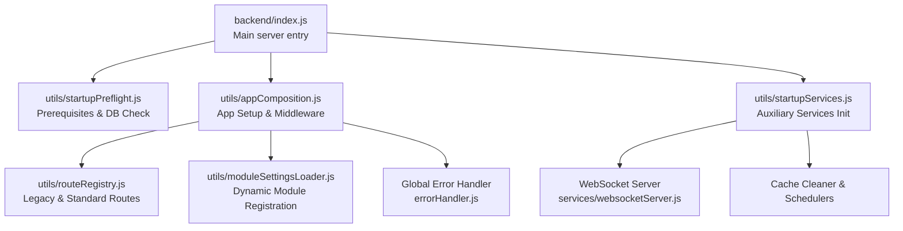
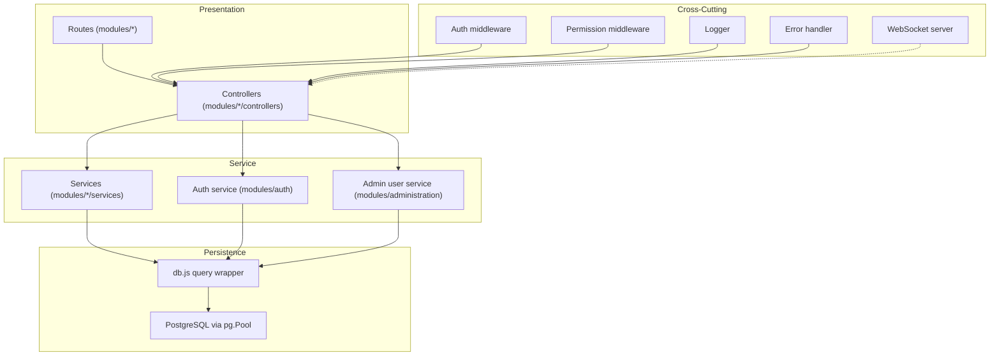
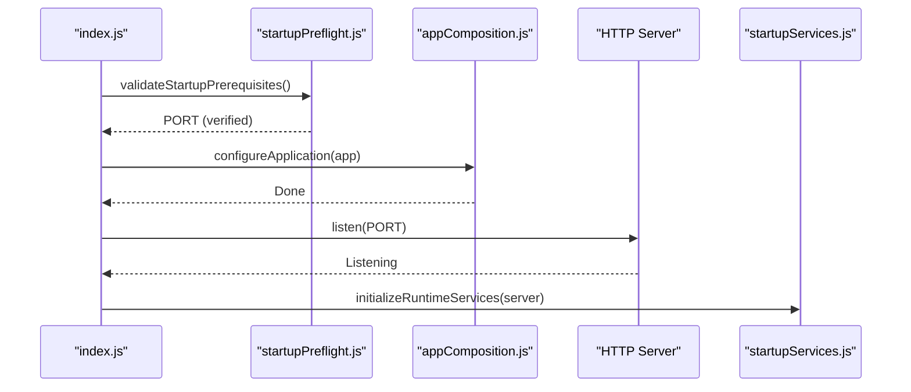

# Backend Architecture

<cite>
**Referenced Files in This Document**
- [index.js](file://backend/index.js)
- [appComposition.js](file://backend/utils/appComposition.js)
- [startupPreflight.js](file://backend/utils/startupPreflight.js)
- [startupServices.js](file://backend/utils/startupServices.js)
- [routeRegistry.js](file://backend/utils/routeRegistry.js)
- [db.js](file://backend/db.js)
- [package.json](file://backend/package.json)
- [auth.js](file://backend/middleware/auth.js)
- [checkPermission.js](file://backend/middleware/checkPermission.js)
- [moduleSettingsLoader.js](file://backend/utils/moduleSettingsLoader.js)
- [websocketServer.js](file://backend/services/websocketServer.js)
- [errorHandler.js](file://backend/utils/errorHandler.js)
- [logger.js](file://backend/utils/logger.js)
- [authService.js](file://backend/modules/auth/services/authService.js)
- [userService.js](file://backend/modules/administration/services/userService.js)
</cite>

## Table of Contents
1. [Introduction](#introduction)
2. [Project Structure](#project-structure)
3. [Core Components](#core-components)
4. [Architecture Overview](#architecture-overview)
5. [Detailed Component Analysis](#detailed-component-analysis)
6. [Dependency Analysis](#dependency-analysis)
7. [Performance Considerations](#performance-considerations)
8. [Troubleshooting Guide](#troubleshooting-guide)
9. [Conclusion](#conclusion)

## Introduction
This document describes the Node.js/Express backend architecture of the TITAN CRM system. It covers the modular feature-based design, refactored Express application setup, middleware configuration, PostgreSQL integration, service-layer pattern, controller architecture, authentication and authorization with JWT, permission checking and role-based access control, API routing structure, error handling patterns, dynamic module loading mechanism, WebSocket real-time capabilities, and inter-module communication patterns.

## Project Structure
The backend is organized around a modular feature architecture under the `modules` directory, with shared utilities, database access, and runtime services. The main entry point initializes the system using a decoupled startup sequence that separates environment validation, application composition, and service orchestration.

**Diagram sources**
- [index.js:1-40](file://backend/index.js#L1-L39)
- [appComposition.js:1-125](file://backend/utils/appComposition.js#L1-L125)
- [startupServices.js:1-50](file://backend/utils/startupServices.js#L1-L50)
- [websocketServer.js:25-61](file://backend/modules/notifications/services/websocketServer.js#L25-L61)

**Section sources**
- [index.js:1-40](file://backend/index.js#L1-L39)
- [appComposition.js:1-125](file://backend/utils/appComposition.js#L1-L125)
- [moduleSettingsLoader.js:1-360](file://backend/utils/moduleSettingsLoader.js#L1-L360)

## Core Components
- Refactored Express application: Bootstrapped via `index.js`, configured via `appComposition.js`, and supported by `startupPreflight.js` and `startupServices.js`.
- Database abstraction: PostgreSQL connection pool in `db.js` with automatic camelCase conversion for query results.
- Authentication middleware: JWT verification in `middleware/auth.js` with support for mock tokens and optional auth fallback.
- Permission middleware: Role-based permission checking in `middleware/checkPermission.js` with wildcard support and dynamic user permission retrieval.
- Module router loader: Dynamic discovery and registration in `moduleSettingsLoader.js` using both static and database-driven settings.
- WebSocket server: Real-time notifications and heartbeat management in `services/websocketServer.js`.
- Error handling: Centralized async wrapper and typed error classes in `utils/errorHandler.js`.
- Logging: Structured logging to files and database in `utils/logger.js` with sensitive data sanitization.

**Section sources**
- [index.js:1-40](file://backend/index.js#L1-L39)
- [db.js:1-68](file://backend/db.js#L1-L68)
- [auth.js:1-82](file://backend/middleware/auth.js#L1-L81)
- [checkPermission.js:1-130](file://backend/middleware/checkPermission.js#L1-L129)
- [moduleSettingsLoader.js:1-360](file://backend/utils/moduleSettingsLoader.js#L1-L360)
- [websocketServer.js:15-311](file://backend/modules/notifications/services/websocketServer.js#L1-L241)
- [errorHandler.js:1-81](file://backend/utils/errorHandler.js#L1-L80)
- [logger.js:1-319](file://backend/utils/logger.js#L1-L318)

## Architecture Overview
The system follows a layered architecture:
- Presentation Layer: Express routes and controllers within modules.
- Service Layer: Business logic encapsulated in services.
- Persistence Layer: PostgreSQL via a pooled connection with result normalization.
- Cross-Cutting Concerns: Authentication, authorization, logging, error handling, and WebSocket communication.

**Diagram sources**
- [appComposition.js:1-125](file://backend/utils/appComposition.js#L1-L125)
- [authService.js:1-233](file://backend/modules/auth/services/authService.js#L1-L232)
- [userService.js:51-554](file://backend/modules/administration/services/userService.js#L51-L553)
- [db.js:58-67](file://backend/db.js#L58-L67)
- [auth.js:1-82](file://backend/middleware/auth.js#L1-L81)
- [checkPermission.js:1-130](file://backend/middleware/checkPermission.js#L1-L129)
- [logger.js:1-319](file://backend/utils/logger.js#L1-L318)

## Detailed Component Analysis

### Decoupled Startup Sequence
The refactored `index.js` orchestrates a clean startup sequence:
1. **Preflight**: `validateStartupPrerequisites()` checks environment and DB.
2. **Composition**: `configureApplication(app)` sets up Express, middleware, and routes.
3. **Listen**: Server starts listening on the validated port.
4. **Services**: `initializeRuntimeServices(server)` starts WebSockets, schedulers, and cleans caches.

**Section sources**
- [index.js:1-40](file://backend/index.js#L1-L39)
- [startupPreflight.js:1-50](file://backend/utils/startupPreflight.js#L1-L24)
- [appComposition.js:1-125](file://backend/utils/appComposition.js#L1-L125)
- [startupServices.js:1-50](file://backend/utils/startupServices.js#L1-L50)

### Database Layer (PostgreSQL)
- Connection pool created from environment variables.
- Query wrapper in `db.js` converts snake_case column names to camelCase for JS consumption.
- Centralized query execution with timing and result normalization.

**Section sources**
- [db.js:1-68](file://backend/db.js#L1-L68)

### Service Layer Pattern
- Services encapsulate business logic and coordinate database operations.
- Example services include `AuthService` for session management and `UserService` for identity management.
- Services depend on `db.js` and common utilities.

**Section sources**
- [authService.js:1-233](file://backend/modules/auth/services/authService.js#L1-L232)
- [userService.js:1-554](file://backend/modules/administration/services/userService.js#L1-L553)

### Controller Architecture
- Controllers handle HTTP requests, using `asyncHandler` for error propagation and standardized response helpers.
- They act as thin layers delegating to services.

**Section sources**
- [backend/modules/administration/controllers/users.js:1-132](file://backend/modules/administration/controllers/users.js#L1-L131)

### Authentication and Authorization (JWT)
- `middleware/auth.js` verifies JWT tokens or applies mock authentication for development.
- Decoded user info is attached to `req.user` for downstream use.

**Section sources**
- [auth.js:1-82](file://backend/middleware/auth.js#L1-L81)

### Permission Checking and RBAC
- `middleware/checkPermission.js` enforces fine-grained access control.
- Supports wildcard matching (e.g., `projects.*`) and logic modes (any/all).
- Wildcard `*` for admins bypasses all checks.

**Section sources**
- [checkPermission.js:1-130](file://backend/middleware/checkPermission.js#L1-L129)

### API Routing Structure
- Routes are managed via `routeRegistry.js` (static/legacy) and `moduleSettingsLoader.js` (dynamic).
- Legacy aliases provide backward compatibility for the frontend.
- Dynamic modules are registered with prefixes based on database configuration.

**Section sources**
- [routeRegistry.js:1-45](file://backend/utils/routeRegistry.js#L1-L45)
- [moduleSettingsLoader.js:296-345](file://backend/utils/moduleSettingsLoader.js#L296-L345)

### Error Handling Patterns
- `asyncHandler` in `utils/errorHandler.js` catches async rejections.
- Global error handler in `appComposition.js` catches all unhandled exceptions, logging them and returning a generic 500 response.

**Section sources**
- [errorHandler.js:1-81](file://backend/utils/errorHandler.js#L1-L80)
- [appComposition.js:111-125](file://backend/utils/appComposition.js#L111-L125)

### Module Loading Mechanism
- `moduleSettingsLoader.js` merges static settings (file) with dynamic settings (DB).
- Routers are dynamically required and mounted to the Express app.

**Section sources**
- [moduleSettingsLoader.js:1-360](file://backend/utils/moduleSettingsLoader.js#L1-L360)

### WebSocket Implementation (Real-Time)
- Runs on `/ws`, attached to the same HTTP server instance.
- Handles user connection tracking, heartbeats, and real-time event broadcasting.

**Section sources**
- [websocketServer.js:1-311](file://backend/modules/notifications/services/websocketServer.js#L1-L241)

## Dependency Analysis
- Core dependencies: `express`, `pg`, `bcrypt`, `jsonwebtoken`, `multer`, `ws`, `cron`.
- Internal dependencies: `db.js`, `logger.js`, `errorHandler.js`.
- Startup dependencies: `startupPreflight.js`, `appComposition.js`, `startupServices.js`.

**Section sources**
- [package.json:1-81](file://backend/package.json#L1-L81)

## Performance Considerations
- Database connection pooling.
- Caching of module settings to reduce DB load.
- Asynchronous logging and sanitized error reporting.
- Efficient WebSocket heartbeat management.

## Troubleshooting Guide
- Startup Failures: Review `startupPreflight.js` logs for environment or DB issues.
- Module Issues: Check `moduleSettingsLoader.js` logs for registration errors.
- Unhandled Errors: Inspect logs for stack traces emitted by the global error handler.

**Section sources**
- [index.js:1-40](file://backend/index.js#L1-L39)
- [appComposition.js:111-125](file://backend/utils/appComposition.js#L111-L125)

## Conclusion
The backend architecture of Titan CRM is designed for modularity, scalability, and maintainability. By refactoring the startup sequence and centralizing application composition, the system ensures a clean separation of concerns while providing robust cross-cutting capabilities such as authentication, authorization, and real-time communication.