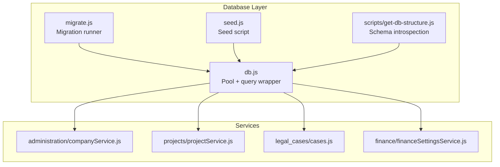
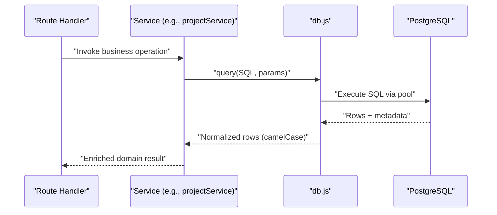
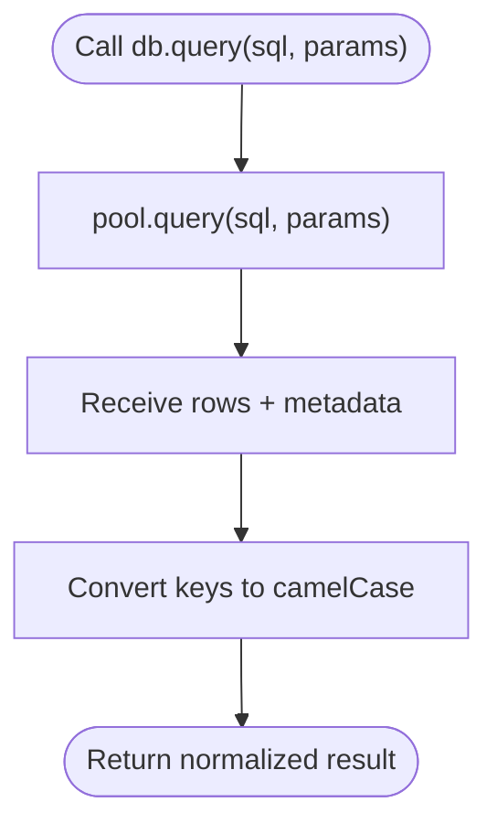
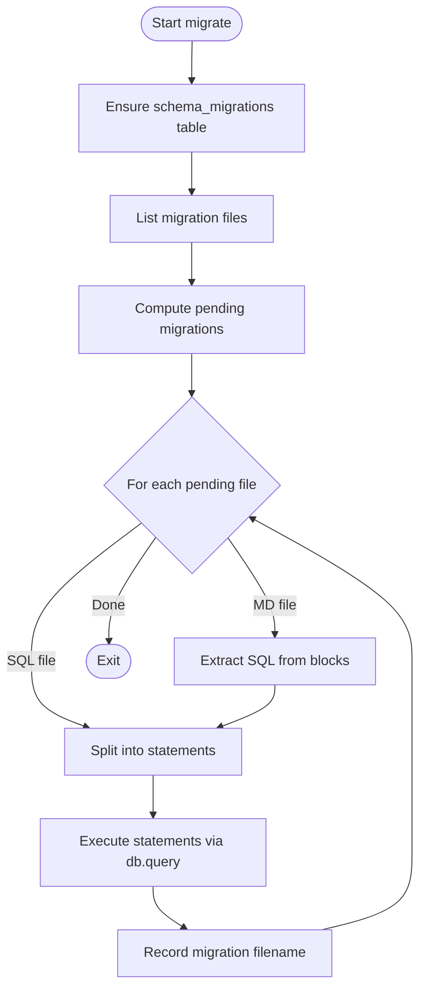
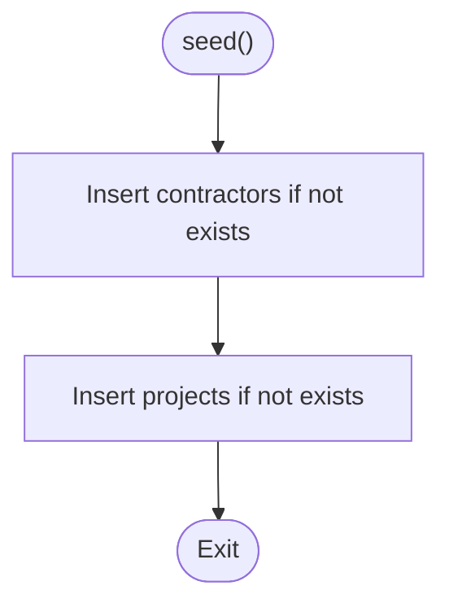
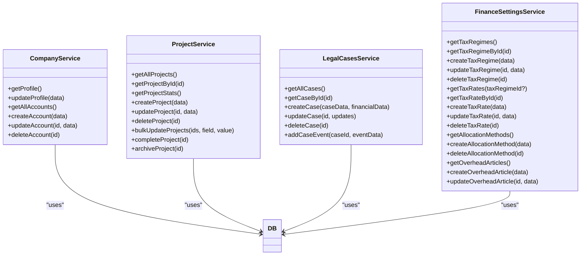
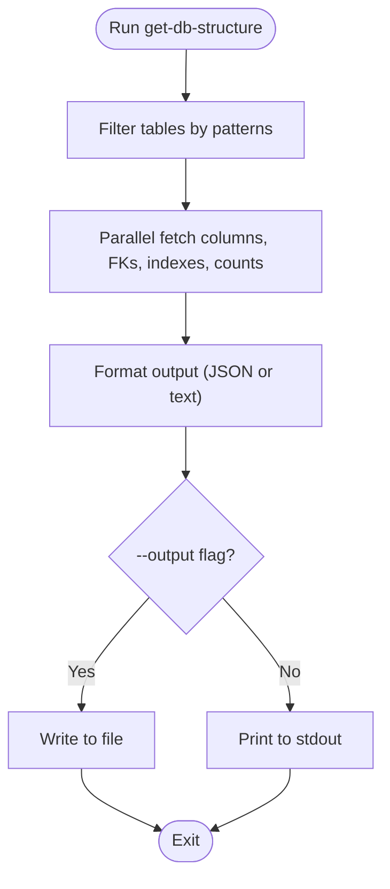
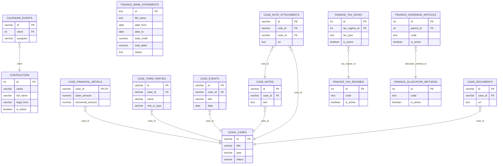
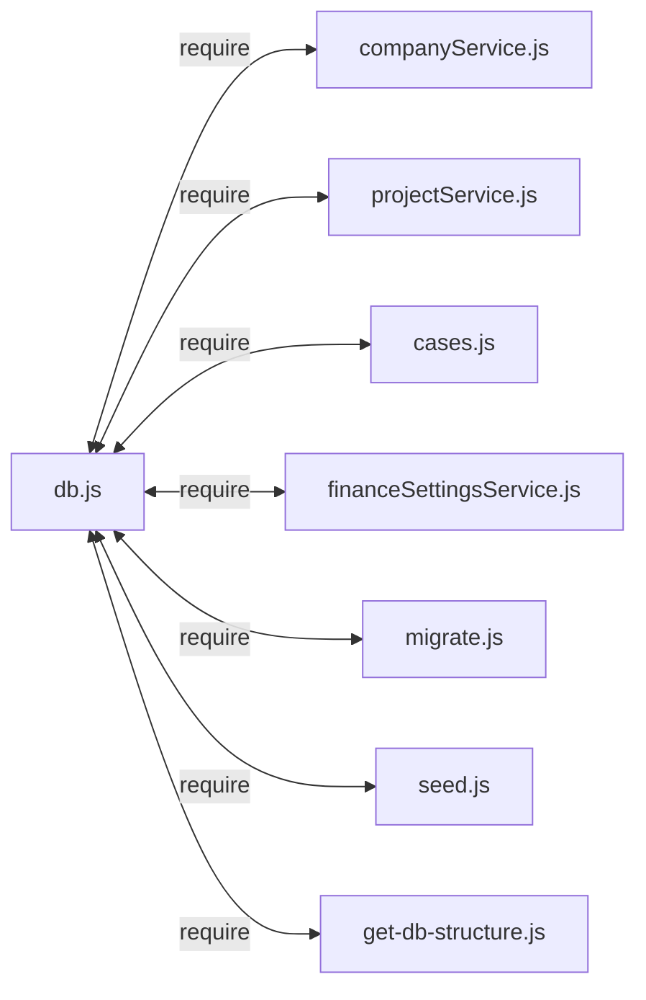

# Database Layer & ORM

<cite>
**Referenced Files in This Document**
- [backend/db.js](file://backend/db.js)
- [backend/migrate.js](file://backend/migrate.js)
- [backend/seed.js](file://backend/seed.js)
- [backend/modules/administration/services/companyService.js](file://backend/modules/administration/services/companyService.js)
- [backend/modules/projects/services/projectService.js](file://backend/modules/projects/services/projectService.js)
- [backend/modules/legal_cases/services/cases.js](file://backend/modules/legal_cases/services/cases.js)
- [backend/modules/finance/services/financeSettingsService.js](file://backend/modules/finance/services/financeSettingsService.js)
- [backend/config/db-structure.json](file://backend/config/db-structure.json)
- [backend/scripts/get-db-structure.js](file://backend/scripts/get-db-structure.js)
- [backend/modules/finance/schema.js](file://backend/modules/finance/schema.js)
</cite>

## Table of Contents
1. [Introduction](#introduction)
2. [Project Structure](#project-structure)
3. [Core Components](#core-components)
4. [Architecture Overview](#architecture-overview)
5. [Detailed Component Analysis](#detailed-component-analysis)
6. [Dependency Analysis](#dependency-analysis)
7. [Performance Considerations](#performance-considerations)
8. [Troubleshooting Guide](#troubleshooting-guide)
9. [Conclusion](#conclusion)

## Introduction
This document describes the PostgreSQL database layer and data access patterns used by the backend. It covers connection management via a connection pool, query execution utilities, snake_case to camelCase conversion, schema and entity relationships, the migration and seeding systems, service-layer integration, and practical guidance for performance and integrity. The backend uses a minimal, custom ORM-like wrapper around the pg client to centralize connection handling and result normalization.

## Project Structure
The database layer is implemented in a small set of focused modules:
- A connection pool and query wrapper
- Migration runner that parses SQL/Markdown migrations and tracks applied migrations
- Seed script for initial reference data
- Services that encapsulate business logic and perform queries against the database
- Schema introspection and maintenance utilities

**Diagram sources**
- [backend/db.js:1-68](file://backend/db.js#L1-L68)
- [backend/migrate.js:1-220](file://backend/migrate.js#L1-L220)
- [backend/seed.js:1-132](file://backend/seed.js#L1-L132)
- [backend/scripts/get-db-structure.js:1-272](file://backend/scripts/get-db-structure.js#L1-L271)
- [backend/modules/administration/services/companyService.js:1-134](file://backend/modules/administration/services/companyService.js#L1-L133)
- [backend/modules/projects/services/projectService.js:1-334](file://backend/modules/projects/services/projectService.js#L1-L334)
- [backend/modules/legal_cases/services/cases.js:1-686](file://backend/modules/legal_cases/services/cases.js#L1-L686)
- [backend/modules/finance/services/financeSettingsService.js:1-960](file://backend/modules/finance/services/financeSettingsService.js#L1-L745)

**Section sources**
- [backend/db.js:1-68](file://backend/db.js#L1-L68)
- [backend/migrate.js:1-220](file://backend/migrate.js#L1-L220)
- [backend/seed.js:1-132](file://backend/seed.js#L1-L132)
- [backend/scripts/get-db-structure.js:1-272](file://backend/scripts/get-db-structure.js#L1-L271)

## Core Components
- Connection pool and query wrapper
  - Creates a Postgres connection pool from environment variables and exposes a single query function.
  - Normalizes result keys from snake_case to camelCase for JavaScript consumption.
  - Returns normalized rows alongside the original result metadata.

- Migration system
  - Scans migration files (SQL and Markdown) and extracts embedded SQL blocks.
  - Splits multi-statement files safely, handling DO blocks and dollar-quoted blocks.
  - Tracks applied migrations in a dedicated table and applies only pending migrations.

- Seed system
  - Inserts initial reference data (e.g., contractors and projects) with existence checks to avoid duplicates.

- Service-layer integration
  - Services import the db wrapper and issue queries for CRUD and business logic.
  - Services often combine multiple related queries and enrich results with related data.

**Section sources**
- [backend/db.js:1-68](file://backend/db.js#L1-L68)
- [backend/migrate.js:1-220](file://backend/migrate.js#L1-L220)
- [backend/seed.js:1-132](file://backend/seed.js#L1-L132)

## Architecture Overview
The data access architecture follows a layered pattern:
- Presentation and routing call services.
- Services encapsulate business logic and orchestrate database operations.
- The db wrapper abstracts connection pooling and normalization.

**Diagram sources**
- [backend/modules/projects/services/projectService.js:48-94](file://backend/modules/projects/services/projectService.js#L48-L94)
- [backend/db.js:58-67](file://backend/db.js#L58-L67)

## Detailed Component Analysis

### Connection Management and Query Wrapper
- Environment-driven configuration with manual parsing of a local env file.
- Connection pool instantiated with user/host/db/password/port.
- Query wrapper:
  - Executes SQL via the pool.
  - Converts result keys from snake_case to camelCase.
  - Returns normalized rows plus original result metadata.

**Diagram sources**
- [backend/db.js:58-67](file://backend/db.js#L58-L67)
- [backend/db.js:41-56](file://backend/db.js#L41-L56)

**Section sources**
- [backend/db.js:1-68](file://backend/db.js#L1-L68)

### Migration System
- Migration discovery:
  - Reads migrations directory and filters for .sql and .md files (excluding README and MANUAL_).
  - Sorts filenames numerically to determine order.
- SQL extraction:
  - Extracts SQL from fenced code blocks in Markdown.
  - Splits statements while preserving DO blocks and dollar-quoted sections.
- Tracking:
  - Ensures a migration tracking table exists and records applied migrations.
- Execution:
  - Applies only pending migrations and stops on the first failure.

**Diagram sources**
- [backend/migrate.js:134-215](file://backend/migrate.js#L134-L215)
- [backend/migrate.js:17-89](file://backend/migrate.js#L17-L89)
- [backend/migrate.js:91-132](file://backend/migrate.js#L91-L132)

**Section sources**
- [backend/migrate.js:1-220](file://backend/migrate.js#L1-L220)

### Seed System
- Seeds predefined reference data (e.g., contractors and projects).
- Uses existence checks to avoid duplicates.
- Logs insertion or skip decisions.

**Diagram sources**
- [backend/seed.js:3-127](file://backend/seed.js#L3-L127)

**Section sources**
- [backend/seed.js:1-132](file://backend/seed.js#L1-L132)

### Service Layer Integration Examples
- Administration company profile and accounts:
  - Queries for profile retrieval/update and account CRUD.
  - Handles defaults and timestamps consistently.

- Projects:
  - Loads projects with related tags and finance data.
  - Supports bulk updates and project lifecycle operations.

- Legal cases:
  - Complex multi-table writes for case, financial details, third parties, events, notes, and documents.
  - Dynamic column resolution for third-party role/type compatibility.

- Finance settings:
  - Manages tax regimes, rates, allocation methods, and overhead articles.
  - Transforms booleans and numeric fields for consistent client consumption.

**Diagram sources**
- [backend/modules/administration/services/companyService.js:1-134](file://backend/modules/administration/services/companyService.js#L1-L133)
- [backend/modules/projects/services/projectService.js:1-334](file://backend/modules/projects/services/projectService.js#L1-L334)
- [backend/modules/legal_cases/services/cases.js:1-686](file://backend/modules/legal_cases/services/cases.js#L1-L686)
- [backend/modules/finance/services/financeSettingsService.js:1-960](file://backend/modules/finance/services/financeSettingsService.js#L1-L745)

**Section sources**
- [backend/modules/administration/services/companyService.js:1-134](file://backend/modules/administration/services/companyService.js#L1-L133)
- [backend/modules/projects/services/projectService.js:1-334](file://backend/modules/projects/services/projectService.js#L1-L334)
- [backend/modules/legal_cases/services/cases.js:1-686](file://backend/modules/legal_cases/services/cases.js#L1-L686)
- [backend/modules/finance/services/financeSettingsService.js:1-960](file://backend/modules/finance/services/financeSettingsService.js#L1-L745)

### Schema Introspection and Maintenance
- Schema introspection script:
  - Enumerates filtered tables, columns, foreign keys, and indexes.
  - Outputs human-readable or JSON formats and can write to a file.
- Finance schema maintenance:
  - Ensures presence of financial tables and adds columns as needed.

**Diagram sources**
- [backend/scripts/get-db-structure.js:31-264](file://backend/scripts/get-db-structure.js#L31-L264)
- [backend/modules/finance/schema.js:154-198](file://backend/modules/finance/schema.js#L154-L198)

**Section sources**
- [backend/scripts/get-db-structure.js:1-272](file://backend/scripts/get-db-structure.js#L1-L271)
- [backend/modules/finance/schema.js:154-198](file://backend/modules/finance/schema.js#L154-L198)

### Entity Relationship Mapping and Data Model Notes
- The configuration file provides a comprehensive schema snapshot including columns, data types, nullability, defaults, comments, foreign keys, and indexes for many tables.
- Example highlights:
  - Calendar events reference users and contractors.
  - Contractors include identifiers, legal forms, and activity flags.
  - Finance modules define statements, lines, categories, and allocation methods.
  - Legal cases span multiple related tables for financial details, third parties, events, notes, and documents.

**Diagram sources**
- [backend/config/db-structure.json:1-800](file://backend/config/db-structure.json#L1-L800)

**Section sources**
- [backend/config/db-structure.json:1-800](file://backend/config/db-structure.json#L1-L800)

## Dependency Analysis
- Centralized dependency:
  - All services depend on the db wrapper for query execution.
- Migration and seed:
  - Both depend on the db wrapper and operate outside the service layer.
- Schema introspection:
  - Depends on the db wrapper and information_schema to produce metadata.

**Diagram sources**
- [backend/db.js:1-68](file://backend/db.js#L1-L68)
- [backend/modules/administration/services/companyService.js:1-134](file://backend/modules/administration/services/companyService.js#L1-L133)
- [backend/modules/projects/services/projectService.js:1-334](file://backend/modules/projects/services/projectService.js#L1-L334)
- [backend/modules/legal_cases/services/cases.js:1-686](file://backend/modules/legal_cases/services/cases.js#L1-L686)
- [backend/modules/finance/services/financeSettingsService.js:1-960](file://backend/modules/finance/services/financeSettingsService.js#L1-L745)
- [backend/migrate.js:1-220](file://backend/migrate.js#L1-L220)
- [backend/seed.js:1-132](file://backend/seed.js#L1-L132)
- [backend/scripts/get-db-structure.js:1-272](file://backend/scripts/get-db-structure.js#L1-L271)

**Section sources**
- [backend/db.js:1-68](file://backend/db.js#L1-L68)
- [backend/modules/administration/services/companyService.js:1-134](file://backend/modules/administration/services/companyService.js#L1-L133)
- [backend/modules/projects/services/projectService.js:1-334](file://backend/modules/projects/services/projectService.js#L1-L334)
- [backend/modules/legal_cases/services/cases.js:1-686](file://backend/modules/legal_cases/services/cases.js#L1-L686)
- [backend/modules/finance/services/financeSettingsService.js:1-960](file://backend/modules/finance/services/financeSettingsService.js#L1-L745)
- [backend/migrate.js:1-220](file://backend/migrate.js#L1-L220)
- [backend/seed.js:1-132](file://backend/seed.js#L1-L132)
- [backend/scripts/get-db-structure.js:1-272](file://backend/scripts/get-db-structure.js#L1-L271)

## Performance Considerations
- Connection pooling
  - Use a reasonable pool size appropriate for concurrent workload; tune based on database capacity and latency.
- Query normalization cost
  - The camelCase conversion runs per query; keep transformations localized to reduce overhead.
- Indexing strategy
  - Review indexes from the schema snapshot and ensure selective columns are indexed for frequent filters and joins.
  - Consider composite indexes for multi-column predicates commonly used in services.
- Statement batching
  - Prefer batched inserts/updates where feasible to reduce round-trips.
- Selectivity and projections
  - Fetch only required columns; avoid SELECT * in hot paths.
- Transactions
  - Wrap multi-step operations (e.g., legal case updates) in transactions to maintain consistency and reduce partial writes.

[No sources needed since this section provides general guidance]

## Troubleshooting Guide
- Missing environment variables
  - The db wrapper validates required variables and exits early if any are missing. Confirm DB_USER, DB_HOST, DB_NAME, DB_PASSWORD, DB_PORT are present in the env file.

- Migration failures
  - The runner prints the failing migration and exits. Fix the SQL and rerun. Applied migrations are recorded; only pending ones are retried.

- Snake_case vs camelCase mismatches
  - The wrapper converts keys to camelCase. Ensure consumers expect camelCase keys.

- Schema drift
  - Use the schema introspection script to compare current schema with expectations and regenerate the snapshot.

**Section sources**
- [backend/db.js:20-29](file://backend/db.js#L20-L29)
- [backend/migrate.js:205-211](file://backend/migrate.js#L205-L211)
- [backend/scripts/get-db-structure.js:215-264](file://backend/scripts/get-db-structure.js#L215-L264)

## Conclusion
The backend employs a compact, robust database layer built around a connection pool and a simple query wrapper that normalizes result keys. Migrations and seeds are managed by dedicated scripts that integrate tightly with the db wrapper. Services encapsulate business logic and coordinate database operations, enabling clean separation of concerns. The schema snapshot and introspection utilities support ongoing maintenance and evolution of the data model.