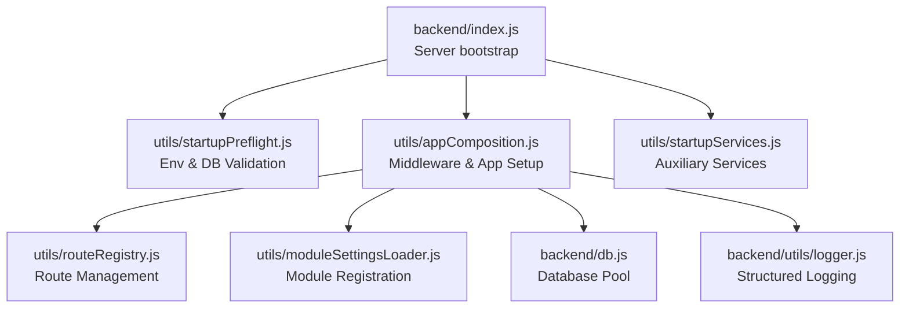
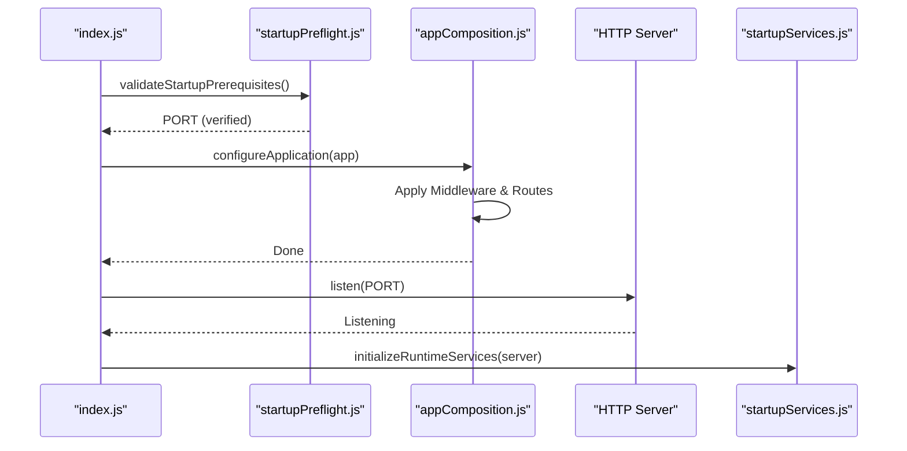
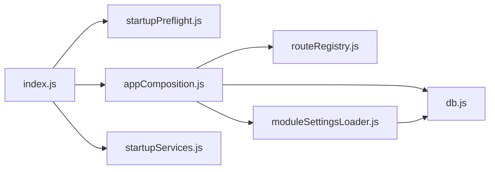

# Express Application Setup

<cite>
**Referenced Files in This Document**
- [index.js](file://backend/index.js)
- [appComposition.js](file://backend/utils/appComposition.js)
- [startupPreflight.js](file://backend/utils/startupPreflight.js)
- [startupServices.js](file://backend/utils/startupServices.js)
- [routeRegistry.js](file://backend/utils/routeRegistry.js)
- [env.example](file://backend/env.example)
- [package.json](file://backend/package.json)
- [db.js](file://backend/db.js)
- [logger.js](file://backend/utils/logger.js)
- [moduleSettingsLoader.js](file://backend/utils/moduleSettingsLoader.js)
- [auth.js](file://backend/middleware/auth.js)
- [checkPermission.js](file://backend/middleware/checkPermission.js)
</cite>

## Table of Contents
1. [Introduction](#introduction)
2. [Project Structure](#project-structure)
3. [Core Components](#core-components)
4. [Architecture Overview](#architecture-overview)
5. [Detailed Component Analysis](#detailed-component-analysis)
6. [Dependency Analysis](#dependency-analysis)
7. [Performance Considerations](#performance-considerations)
8. [Troubleshooting Guide](#troubleshooting-guide)
9. [Conclusion](#conclusion)

## Introduction
This document explains the Express.js application setup and configuration for the backend service. It covers the refactored modular initialization process where server bootstrap, environment validation, middleware configuration, and service startup are separated into dedicated utility modules. This ensures a clean entry point and maintainable application composition.

## Project Structure
The Express application is bootstrapped in the backend directory but delegates its configuration to specialized utilities:
- `index.js`: Minimal entry point that orchestrates the startup sequence.
- `utils/startupPreflight.js`: Validates environment variables and database connectivity.
- `utils/appComposition.js`: Configures the Express app, including middleware, static files, and global routes.
- `utils/routeRegistry.js`: Manages legacy aliases and standard API routes.
- `utils/moduleSettingsLoader.js`: Handles dynamic discovery and registration of feature modules.
- `utils/startupServices.js`: Initializes auxiliary services like WebSockets and schedulers.

**Diagram sources**
- [index.js:1-40](file://backend/index.js#L1-L39)
- [startupPreflight.js:1-50](file://backend/utils/startupPreflight.js#L1-L24)
- [appComposition.js:1-125](file://backend/utils/appComposition.js#L1-L125)
- [startupServices.js:1-50](file://backend/utils/startupServices.js#L1-L50)
- [routeRegistry.js:1-45](file://backend/utils/routeRegistry.js#L1-L45)
- [moduleSettingsLoader.js:1-360](file://backend/utils/moduleSettingsLoader.js#L1-L360)
- [db.js:1-68](file://backend/db.js#L1-L68)
- [logger.js:1-319](file://backend/utils/logger.js#L1-L318)

**Section sources**
- [index.js:1-40](file://backend/index.js#L1-L39)
- [appComposition.js:1-125](file://backend/utils/appComposition.js#L1-L125)

## Core Components
- Server Bootstrap: Minimal logic in `index.js` using async/await to ensure proper initialization order.
- Preflight Validation: Strict check of required environment variables and database connectivity before the server starts.
- App Composition: Centralized configuration of Express middleware (CORS, body parsing, logging, activity tracking).
- Modular Routing: Combination of static route registry (legacy/standard) and dynamic module loading based on database configuration.
- Service Orchestration: Post-startup initialization of WebSockets, cache cleaners, and task schedulers.

**Section sources**
- [index.js:1-40](file://backend/index.js#L1-L39)
- [startupPreflight.js:1-50](file://backend/utils/startupPreflight.js#L1-L24)
- [appComposition.js:1-125](file://backend/utils/appComposition.js#L1-L125)
- [startupServices.js:1-50](file://backend/utils/startupServices.js#L1-L50)

## Architecture Overview
The startup sequence is strictly ordered to ensure data integrity and system availability:
1. `index.js` triggers `validateStartupPrerequisites` (Preflight).
2. If successful, it triggers `configureApplication` (Composition).
3. Composition applies global middleware and registers routes via `routeRegistry` and `moduleSettingsLoader`.
4. The server starts listening on the configured port.
5. Post-startup, `initializeRuntimeServices` is called to start auxiliary systems.

**Diagram sources**
- [index.js:1-40](file://backend/index.js#L1-L39)
- [startupPreflight.js:1-50](file://backend/utils/startupPreflight.js#L1-L24)
- [appComposition.js:1-125](file://backend/utils/appComposition.js#L1-L125)
- [startupServices.js:1-50](file://backend/utils/startupServices.js#L1-L50)

## Detailed Component Analysis

### Startup Prerequisites (Preflight)
- Loads environment variables from the `env` file.
- Checks for mandatory keys: `PORT`, `DB_HOST`, `DB_PORT`, `DB_NAME`, `DB_USER`, `DB_PASSWORD`.
- Attempts a test query to the PostgreSQL pool to ensure connectivity.
- Returns the port number if all checks pass, otherwise terminates the process.

**Section sources**
- [startupPreflight.js:1-50](file://backend/utils/startupPreflight.js#L1-L24)

### Application Composition
- Initializes global middleware (CORS, body-parser with 10MB limits).
- Sets up static file serving and the legacy file-serving endpoint.
- Configures request logging and activity tracking.
- Mounts standard and legacy routes from `routeRegistry`.
- Triggers async dynamic module registration via `moduleSettingsLoader`.
- Appends the global error handler as the final middleware.

**Section sources**
- [appComposition.js:1-125](file://backend/utils/appComposition.js#L1-L125)

### Route Registry and Legacy Support
- `routeRegistry.js` defines groups of routes: legacy administration, legacy settings, legacy profile, and standard API routes.
- This allows `appComposition.js` to mount them in bulk, maintaining a clean structure.
- Legacy aliases ensure frontend compatibility during module refactoring.

**Section sources**
- [routeRegistry.js:1-45](file://backend/utils/routeRegistry.js#L1-L45)

### Dynamic Module Loading
- `moduleSettingsLoader.js` scans the `modules` table in the database.
- It loads each module's router and merges its settings.
- It registers each module at its configured prefix (e.g., `/api/finance`).

**Section sources**
- [moduleSettingsLoader.js:1-360](file://backend/utils/moduleSettingsLoader.js#L1-L360)

### Runtime Services
- `startupServices.js` handles components that require a running HTTP server.
- Initializes the WebSocket server.
- Starts the sync scheduler for background tasks.
- Resumes pending enrichment jobs.

**Section sources**
- [startupServices.js:1-50](file://backend/utils/startupServices.js#L1-L50)

## Dependency Analysis
The Express application depends on the utility layer for its configuration. The utilities in turn depend on core libraries like `express`, `cors`, `pg`, and the internal `db.js` and `logger.js`.

**Section sources**
- [index.js:1-40](file://backend/index.js#L1-L39)
- [appComposition.js:1-125](file://backend/utils/appComposition.js#L1-L125)

## Performance Considerations
- Async Initialization: Using async/await during startup prevents blocking and allows for sequential dependency resolution.
- Cached Settings: `moduleSettingsLoader` caches module configuration to avoid redundant DB hits.
- Payload Limits: 10MB limits on JSON/URL-encoded bodies prevent memory exhaustion.

## Troubleshooting Guide
- "Backend startup error": Check `startupPreflight.js` logs; usually caused by missing `.env` values or unreachable database.
- "Module settings initialization failed": Non-fatal warning; check `moduleSettingsLoader.js` logs and database content.
- 404 on modular routes: Ensure the module is active in the database and its folder exists in `backend/modules`.

**Section sources**
- [index.js:1-40](file://backend/index.js#L1-L39)
- [appComposition.js:111-125](file://backend/utils/appComposition.js#L111-L125)

## Conclusion
The refactored Express application setup provides a highly modular and extensible foundation for Titan CRM. By separating concerns into preflight, composition, and service initialization, the system achieves better maintainability and clearer operational visibility during startup.