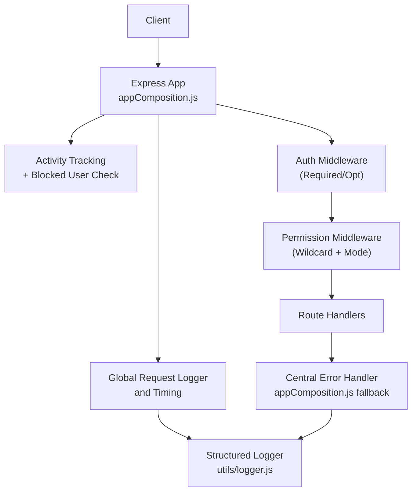
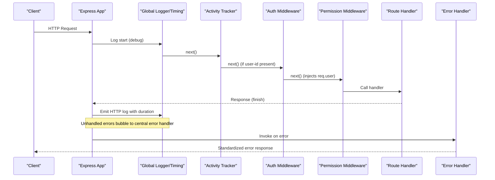

# Middleware & Cross-Cutting Concerns

<cite>
**Referenced Files in This Document**
- [index.js](file://backend/index.js)
- [appComposition.js](file://backend/utils/appComposition.js)
- [auth.js](file://backend/middleware/auth.js)
- [checkPermission.js](file://backend/middleware/checkPermission.js)
- [logger.js](file://backend/utils/logger.js)
- [errorHandler.js](file://backend/utils/errorHandler.js)
- [authService.js](file://backend/modules/auth/services/authService.js)
- [userService.js](file://backend/modules/administration/services/userService.js)
</cite>

## Table of Contents
1. [Introduction](#introduction)
2. [Project Structure](#project-structure)
3. [Core Components](#core-components)
4. [Architecture Overview](#architecture-overview)
5. [Detailed Component Analysis](#detailed-component-analysis)
6. [Dependency Analysis](#dependency-analysis)
7. [Performance Considerations](#performance-considerations)
8. [Troubleshooting Guide](#troubleshooting-guide)
9. [Conclusion](#conclusion)

## Introduction
This document explains the middleware architecture and cross-cutting concerns in the backend. It covers the refactored middleware stack configuration within `appComposition.js`, the request/response processing pipeline, and how cross-cutting concerns like authentication, permission checking, activity tracking, structured logging, and error handling are integrated into the application lifecycle.

## Project Structure
The backend is an Express application that mounts middleware globally via `appComposition.js` and selectively within modules. Middleware includes:
- Global request logging and timing.
- Activity tracking and blocked user checks.
- Authentication via JWT and optional auth modes.
- Permission checking with wildcard support and logic modes (any/all).
- Structured logging with file and database persistence.
- Centralized error handling for synchronous and asynchronous routes.

**Diagram sources**
- [appComposition.js:1-125](file://backend/utils/appComposition.js#L1-L125)
- [auth.js:1-82](file://backend/middleware/auth.js#L1-L81)
- [checkPermission.js:1-130](file://backend/middleware/checkPermission.js#L1-L129)
- [logger.js:1-319](file://backend/utils/logger.js#L1-L318)
- [errorHandler.js:1-81](file://backend/utils/errorHandler.js#L1-L80)

**Section sources**
- [appComposition.js:1-125](file://backend/utils/appComposition.js#L1-L125)

## Core Components
- Authentication middleware (`middleware/auth.js`): Validates JWT tokens, supports mock tokens, and injects user info into the request.
- Permission middleware (`middleware/checkPermission.js`): Enforces RBAC with wildcard support and any/all logic.
- Activity tracking middleware (inline in `appComposition.js`): Updates `last_active_at` and blocks blocked users.
- Structured logger (`utils/logger.js`): Handles multi-transport logging (file/DB) and sensitive data sanitization.
- Central error handler (`utils/errorHandler.js` & `appComposition.js`): Catch-all for unhandled rejections and exceptions.

**Section sources**
- [auth.js:1-82](file://backend/middleware/auth.js#L1-L81)
- [checkPermission.js:1-130](file://backend/middleware/checkPermission.js#L1-L129)
- [appComposition.js:58-99](file://backend/utils/appComposition.js#L58-L99)
- [logger.js:1-319](file://backend/utils/logger.js#L1-L318)
- [errorHandler.js:1-81](file://backend/utils/errorHandler.js#L1-L80)

## Architecture Overview
The middleware stack is configured in `appComposition.js` and executed in a strict order to ensure security and traceability.

**Section sources**
- [appComposition.js:1-125](file://backend/utils/appComposition.js#L1-L125)

## Detailed Component Analysis

### Authentication Middleware
- **Purpose**: Validates JWT, supports mock tokens for development, and handles optional auth.
- **Behavior**:
  - Checks `DISABLE_AUTH` env flag.
  - Verifies JWT secret.
  - Injects `req.user` for downstream use.
- **Integration**: Mounted globally or per-route group.

**Section sources**
- [auth.js:1-82](file://backend/middleware/auth.js#L1-L81)

### Permission Checking Middleware
- **Purpose**: Enforces access control based on granular permissions.
- **Features**:
  - Supports resource wildcards (e.g., `administration.*`).
  - Supports global wildcard `*`.
  - Modes: `any` (at least one) or `all` (must have all).
- **Integration**: Applied per route within modules.

**Section sources**
- [checkPermission.js:1-130](file://backend/middleware/checkPermission.js#L1-L129)

### Activity Tracking & Blocking
- **Location**: Inline middleware in `appComposition.js`.
- **Behavior**:
  - Updates `last_active_at` in the `users` table.
  - Checks `is_blocked` status.
  - Excludes auth and unblock endpoints to prevent lockouts.

**Section sources**
- [appComposition.js:58-99](file://backend/utils/appComposition.js#L58-L99)

### Structured Logging
- **Location**: `utils/logger.js`.
- **Features**:
  - Recursive data sanitization (removes passwords, tokens).
  - Multi-transport: File system (daily rotate) and optional Database.
  - HTTP logging includes duration, status, and sanitized body/query.

**Section sources**
- [logger.js:1-319](file://backend/utils/logger.js#L1-L318)
- [appComposition.js:101-115](file://backend/utils/appComposition.js#L101-L115)

### Error Handling
- **asyncHandler**: Wraps async route handlers to catch rejections without boilerplate try-catch.
- **Global Handler**: Final middleware in `appComposition.js` that logs the full stack trace and returns a generic 500.

**Section sources**
- [errorHandler.js:1-81](file://backend/utils/errorHandler.js#L1-L80)
- [appComposition.js:111-125](file://backend/utils/appComposition.js#L111-L125)

## Dependency Analysis
- `appComposition.js` depends on `logger.js`, `db.js`, and various module routers.
- Middleware like `auth.js` and `checkPermission.js` depend on `db.js` and `jsonwebtoken`.

**Section sources**
- [appComposition.js:1-125](file://backend/utils/appComposition.js#L1-L125)

## Performance Considerations
- **Body Parsing Limits**: 10MB limit prevents memory spikes.
- **Cached DB Logging**: Logging to the database is cached to minimize overhead.
- **Lightweight Activity Updates**: Uses `RETURNING` and an update threshold (e.g., 30s) to reduce DB writes.

## Troubleshooting Guide
- **401 Unauthorized**: JWT signature mismatch or expired token.
- **403 Forbidden**: Insufficient permissions or user is blocked.
- **500 Internal Error**: Check logs for the stack trace emitted by the global error handler.

**Section sources**
- [appComposition.js:111-125](file://backend/utils/appComposition.js#L111-L125)
- [auth.js:24-53](file://backend/middleware/auth.js#L24-L53)

## Conclusion
Titan CRM's middleware architecture provides a robust and secure foundation by centralizing cross-cutting concerns. Through refactored application composition and dedicated middleware for authentication, permissions, and logging, the system ensures consistent behavior and high operational visibility across all modules.