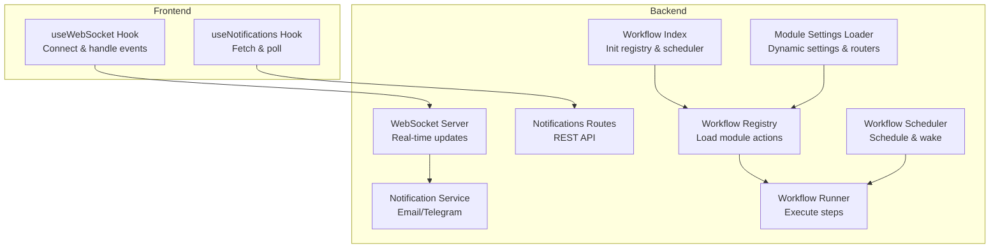
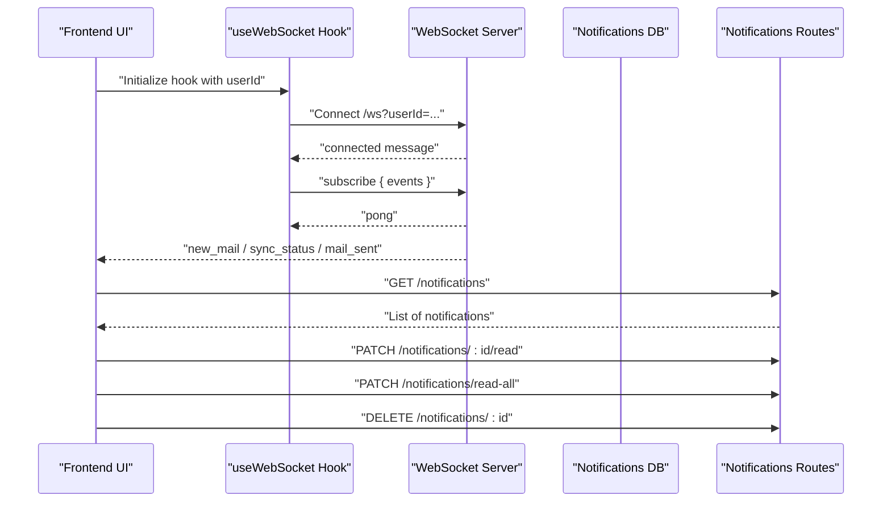
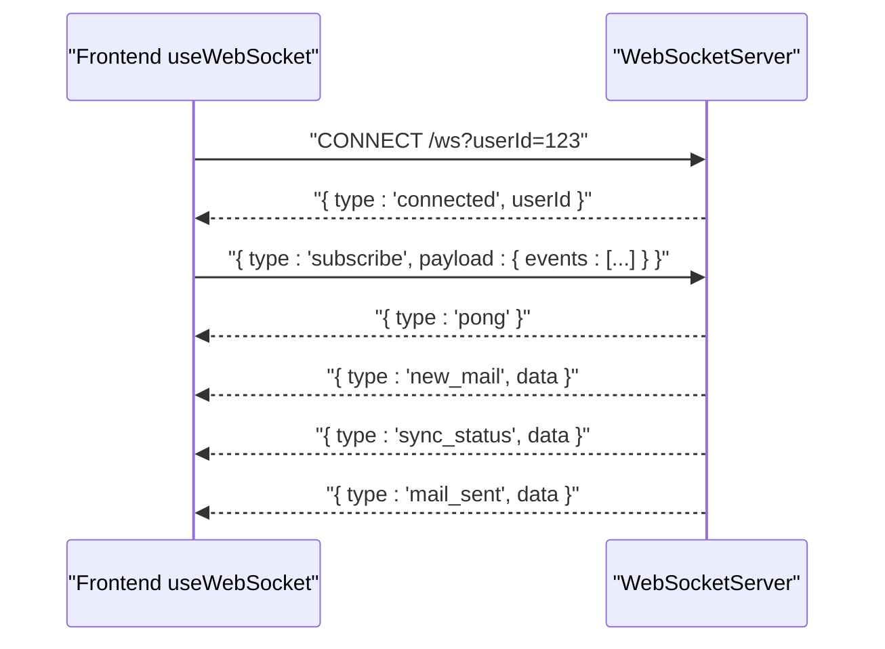
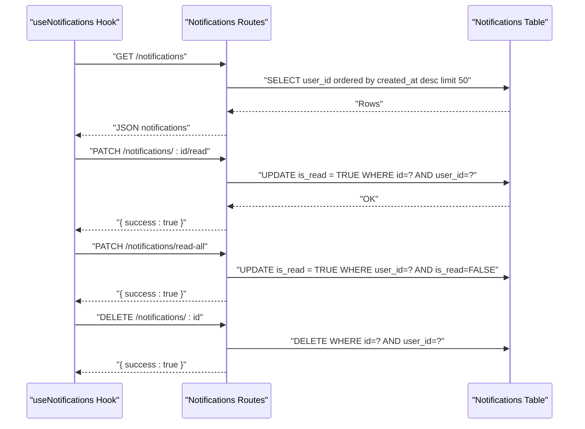
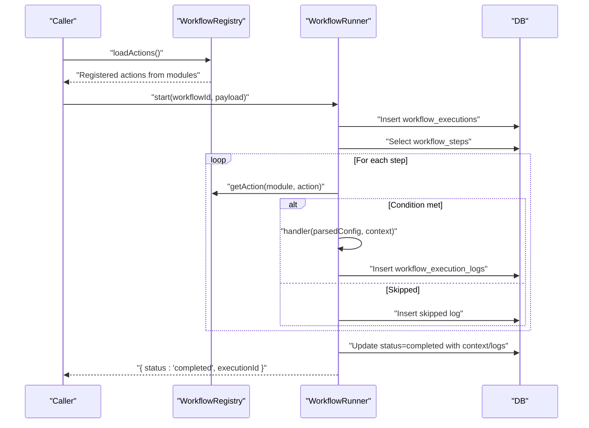
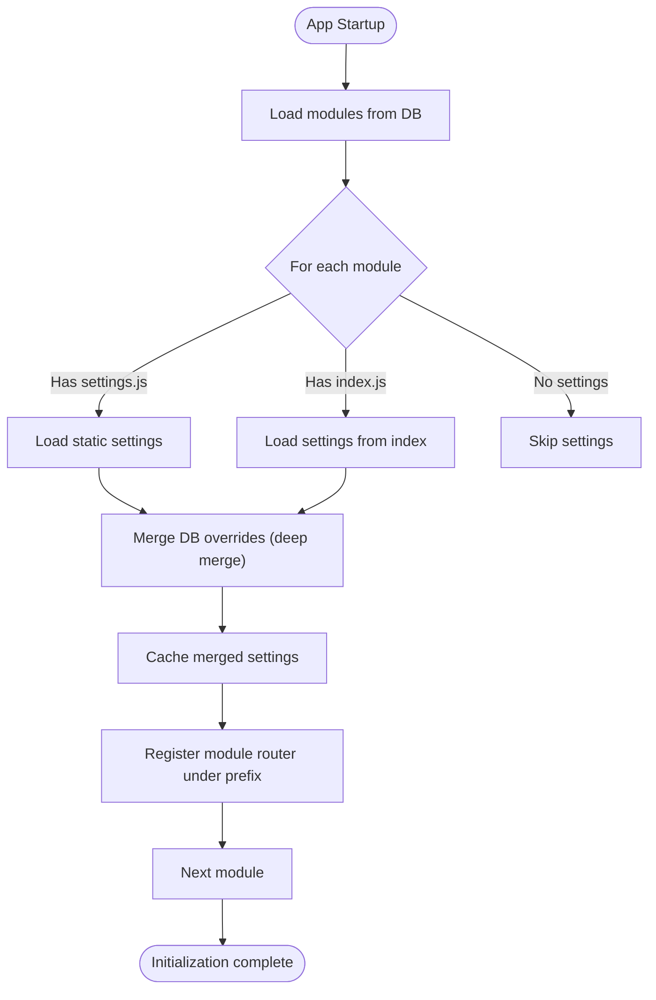
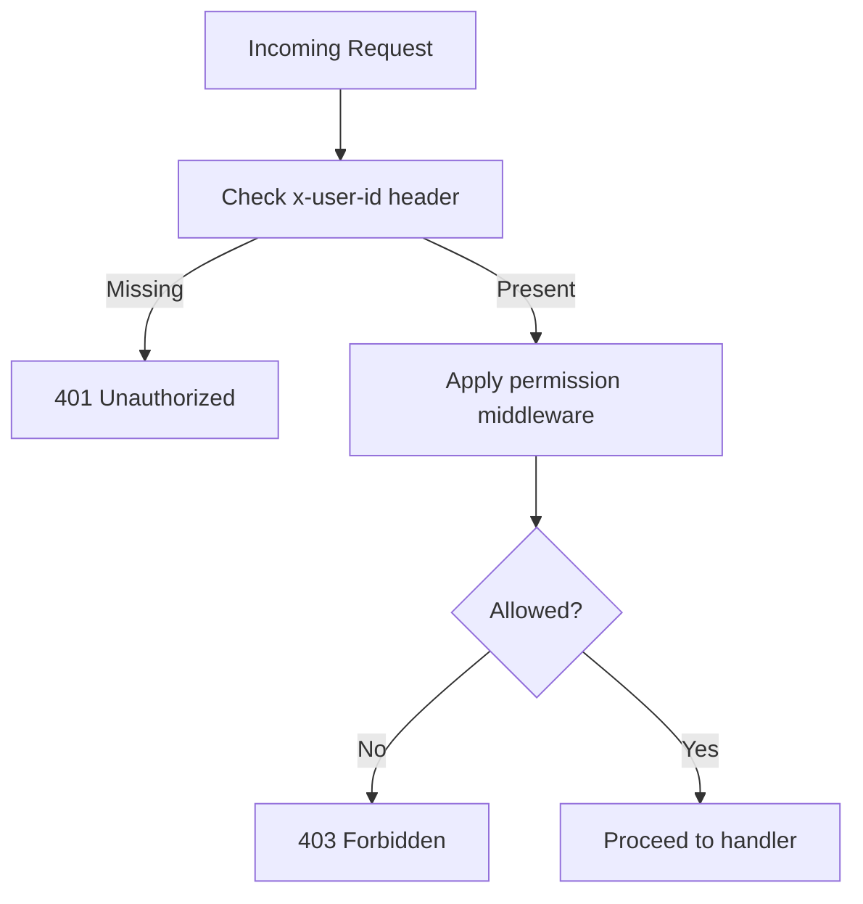
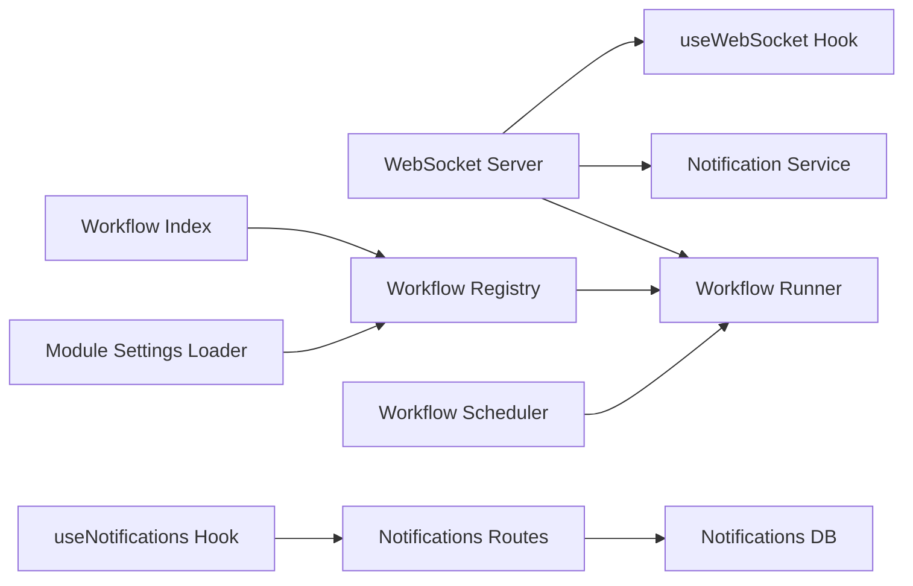

# Inter-Module Communication

<cite>
**Referenced Files in This Document**
- [websocketServer.js](file://backend/services/websocketServer.js)
- [useWebSocket.ts](file://frontend/src/hooks/useWebSocket.ts)
- [useNotifications.ts](file://frontend/src/hooks/useNotifications.ts)
- [notificationService.js](file://backend/utils/notificationService.js)
- [notifications.js](file://backend/routes/notifications.js)
- [index.js](file://backend/modules/workflow/index.js)
- [workflowRegistry.js](file://backend/modules/workflow/engine/workflowRegistry.js)
- [workflowRunner.js](file://backend/modules/workflow/engine/workflowRunner.js)
- [scheduler.js](file://backend/modules/workflow/triggers/scheduler.js)
- [moduleSettingsLoader.js](file://backend/utils/moduleSettingsLoader.js)
- [PERMISSIONS_SYSTEM.md](file://docs/PERMISSIONS_SYSTEM.md)
</cite>

## Table of Contents
1. [Introduction](#introduction)
2. [Project Structure](#project-structure)
3. [Core Components](#core-components)
4. [Architecture Overview](#architecture-overview)
5. [Detailed Component Analysis](#detailed-component-analysis)
6. [Dependency Analysis](#dependency-analysis)
7. [Performance Considerations](#performance-considerations)
8. [Troubleshooting Guide](#troubleshooting-guide)
9. [Conclusion](#conclusion)

## Introduction
This document explains how modules communicate across the TITAN CRM platform. It focuses on shared services, event systems, and notification mechanisms, and details how the workflow engine coordinates cross-module processes. It also covers WebSocket-based real-time updates, broadcasting patterns, and the decoupling strategies that keep modules independent while enabling collaboration. Security and permission checks during inter-module operations are addressed to ensure safe and authorized interactions.

## Project Structure
The platform organizes inter-module communication through:
- Backend services for real-time updates and notifications
- Frontend hooks for WebSocket connectivity and notification polling
- A workflow engine that dynamically loads actions from modules and orchestrates cross-module steps
- A module settings loader that provides dynamic configuration and router registration
- Middleware and documentation for permission enforcement

**Diagram sources**
- [websocketServer.js:15-310](file://backend/modules/notifications/services/websocketServer.js#L1-L241)
- [useWebSocket.ts:140-236](file://frontend/src/hooks/useWebSocket.ts#L140-L236)
- [useNotifications.ts:15-100](file://frontend/src/hooks/useNotifications.ts#L15-L100)
- [notificationService.js:24-82](file://backend/utils/notificationService.js#L24-L82)
- [notifications.js:1-81](file://backend/modules/notifications/routes.js#L1-L80)
- [index.js:1-21](file://backend/modules/workflow/index.js#L1-L20)
- [workflowRegistry.js:4-136](file://backend/modules/workflow/engine/workflowRegistry.js#L4-L136)
- [workflowRunner.js:18-398](file://backend/modules/workflow/engine/workflowRunner.js#L18-L398)
- [scheduler.js:6-105](file://backend/modules/workflow/triggers/scheduler.js#L6-L105)
- [moduleSettingsLoader.js:1-360](file://backend/utils/moduleSettingsLoader.js#L1-L360)

**Section sources**
- [websocketServer.js:1-311](file://backend/modules/notifications/services/websocketServer.js#L1-L241)
- [useWebSocket.ts:1-237](file://frontend/src/hooks/useWebSocket.ts#L1-L237)
- [useNotifications.ts:1-101](file://frontend/src/hooks/useNotifications.ts#L1-L101)
- [notificationService.js:1-83](file://backend/utils/notificationService.js#L1-L82)
- [notifications.js:1-81](file://backend/modules/notifications/routes.js#L1-L80)
- [index.js:1-21](file://backend/modules/workflow/index.js#L1-L20)
- [workflowRegistry.js:1-137](file://backend/modules/workflow/engine/workflowRegistry.js#L1-L136)
- [workflowRunner.js:1-399](file://backend/modules/workflow/engine/workflowRunner.js#L1-L399)
- [scheduler.js:1-106](file://backend/modules/workflow/triggers/scheduler.js#L1-L105)
- [moduleSettingsLoader.js:1-360](file://backend/utils/moduleSettingsLoader.js#L1-L360)

## Core Components
- WebSocket Server: Provides real-time bi-directional communication, heartbeat, subscription model, and targeted/broadcast messaging. It supports per-user routing and notification types such as new mail, sync status, and mail sent.
- Frontend WebSocket Hook: Manages a global WebSocket connection, handles message dispatching, and exposes subscribe/unsubscribe utilities. It integrates with toast notifications and auto-reconnection.
- Notification Service: Centralized service for sending email and Telegram notifications using system settings.
- Notifications Routes: REST endpoints for listing, marking read, marking all read, and deleting user-specific notifications.
- Workflow Engine: Dynamically loads actions from modules, executes orchestrated steps, supports conditions, delays, human approvals, and persistence of execution logs and context.
- Module Settings Loader: Loads static and dynamic module settings, merges overrides, caches results, and registers module routers with the main application.

**Section sources**
- [websocketServer.js:15-310](file://backend/modules/notifications/services/websocketServer.js#L1-L241)
- [useWebSocket.ts:140-236](file://frontend/src/hooks/useWebSocket.ts#L140-L236)
- [notificationService.js:24-82](file://backend/utils/notificationService.js#L24-L82)
- [notifications.js:1-81](file://backend/modules/notifications/routes.js#L1-L80)
- [workflowRegistry.js:4-136](file://backend/modules/workflow/engine/workflowRegistry.js#L4-L136)
- [workflowRunner.js:18-398](file://backend/modules/workflow/engine/workflowRunner.js#L18-L398)
- [scheduler.js:6-105](file://backend/modules/workflow/triggers/scheduler.js#L6-L105)
- [moduleSettingsLoader.js:11-137](file://backend/utils/moduleSettingsLoader.js#L11-L137)

## Architecture Overview
The system separates concerns across backend services, workflow orchestration, and frontend hooks. Modules contribute actions to the workflow registry, enabling cross-module automation. Real-time updates propagate via WebSocket, while notifications persist in the database and are exposed through REST endpoints. Dynamic module settings and router registration enable modular extension without tight coupling.

**Diagram sources**
- [useWebSocket.ts:140-236](file://frontend/src/hooks/useWebSocket.ts#L140-L236)
- [websocketServer.js:38-120](file://backend/modules/notifications/services/websocketServer.js#L38-L120)
- [notifications.js:1-81](file://backend/modules/notifications/routes.js#L1-L80)

**Section sources**
- [useWebSocket.ts:140-236](file://frontend/src/hooks/useWebSocket.ts#L140-L236)
- [websocketServer.js:38-120](file://backend/modules/notifications/services/websocketServer.js#L38-L120)
- [notifications.js:1-81](file://backend/modules/notifications/routes.js#L1-L80)

## Detailed Component Analysis

### Real-Time Communication via WebSocket
- Connection lifecycle: The server accepts connections with a user identifier, maintains heartbeat, tracks clients per user, and supports ping/pong.
- Message handling: Supports subscribe/unsubscribe for event topics and forwards typed messages to clients.
- Broadcasting: Offers per-user delivery and broadcast to all clients.
- Notification types: New mail, sync status, and mail sent are supported out of the box.

**Diagram sources**
- [websocketServer.js:38-150](file://backend/modules/notifications/services/websocketServer.js#L38-L150)
- [useWebSocket.ts:79-124](file://frontend/src/hooks/useWebSocket.ts#L79-L124)

**Section sources**
- [websocketServer.js:15-310](file://backend/modules/notifications/services/websocketServer.js#L1-L241)
- [useWebSocket.ts:140-236](file://frontend/src/hooks/useWebSocket.ts#L140-L236)

### Notification System and Persistence
- Backend notification service: Sends email and Telegram notifications using system settings and returns success/failure.
- REST endpoints: Fetch notifications, mark as read, mark all as read, and delete individual notifications. All endpoints enforce user authorization via a header carrying the user identifier.
- Frontend integration: A dedicated hook fetches notifications, marks read/unread, deletes, and polls periodically. It also listens for WebSocket-driven notification events.

**Diagram sources**
- [notifications.js:1-81](file://backend/modules/notifications/routes.js#L1-L80)
- [useNotifications.ts:15-100](file://frontend/src/hooks/useNotifications.ts#L15-L100)
- [notificationService.js:24-82](file://backend/utils/notificationService.js#L24-L82)

**Section sources**
- [notificationService.js:24-82](file://backend/utils/notificationService.js#L24-L82)
- [notifications.js:1-81](file://backend/modules/notifications/routes.js#L1-L80)
- [useNotifications.ts:15-100](file://frontend/src/hooks/useNotifications.ts#L15-L100)

### Workflow Engine: Cross-Module Orchestration
- Dynamic action discovery: The registry scans modules for a workflow definition file exporting actions. It supports both object and legacy array formats and registers built-in core actions.
- Execution engine: The runner starts/resumes workflows, evaluates conditions, pauses for human approvals or long delays, and persists execution logs and context. It supports per-item processing for arrays and step-level error handling.
- Scheduling: The scheduler initializes cron-based schedules from the database and periodically resumes delayed executions.

**Diagram sources**
- [workflowRegistry.js:15-118](file://backend/modules/workflow/engine/workflowRegistry.js#L15-L118)
- [workflowRunner.js:23-247](file://backend/modules/workflow/engine/workflowRunner.js#L23-L247)
- [scheduler.js:11-52](file://backend/modules/workflow/triggers/scheduler.js#L11-L52)

**Section sources**
- [workflowRegistry.js:4-136](file://backend/modules/workflow/engine/workflowRegistry.js#L4-L136)
- [workflowRunner.js:18-398](file://backend/modules/workflow/engine/workflowRunner.js#L18-L398)
- [scheduler.js:6-105](file://backend/modules/workflow/triggers/scheduler.js#L6-L105)

### Module Settings and Router Registration
- Dynamic settings: Combines static settings from module files with dynamic overrides from the database, deep-merging nested groups and caching results.
- Router registration: Scans modules, loads their routers, and mounts them under a configurable prefix derived from module settings.
- Initialization: Preloads module metadata and settings at startup to minimize runtime overhead.

**Diagram sources**
- [moduleSettingsLoader.js:89-137](file://backend/utils/moduleSettingsLoader.js#L89-L137)
- [moduleSettingsLoader.js:296-345](file://backend/utils/moduleSettingsLoader.js#L296-L345)

**Section sources**
- [moduleSettingsLoader.js:11-137](file://backend/utils/moduleSettingsLoader.js#L11-L137)
- [moduleSettingsLoader.js:296-345](file://backend/utils/moduleSettingsLoader.js#L296-L345)

### Decoupling Mechanisms and Shared Services
- Action-based decoupling: Modules expose actions that the workflow registry can consume without direct imports, enabling loose coupling between modules.
- Dynamic discovery: The registry scans module directories and loads actions at runtime, avoiding compile-time dependencies.
- Shared services: Notification service centralizes external integrations (email, Telegram) and is invoked by modules or workflows without embedding transport logic inside each module.
- Settings-driven configuration: Module behavior is controlled via settings, allowing runtime reconfiguration without code changes.

**Section sources**
- [workflowRegistry.js:15-72](file://backend/modules/workflow/engine/workflowRegistry.js#L15-L72)
- [notificationService.js:24-82](file://backend/utils/notificationService.js#L24-L82)
- [moduleSettingsLoader.js:89-137](file://backend/utils/moduleSettingsLoader.js#L89-L137)

### Security and Permission Checking
- Authorization headers: Notification endpoints require a user identifier header to enforce per-user access.
- Middleware pattern: Route handlers apply permission middleware to enforce granular access controls for module endpoints.
- Permissions system: Documentation outlines adding new permissions, resources, and translations consistently across frontend and backend.

**Diagram sources**
- [notifications.js:7-22](file://backend/modules/notifications/routes.js#L7-L22)
- [PERMISSIONS_SYSTEM.md:209-223](file://docs/PERMISSIONS_SYSTEM.md#L209-L223)

**Section sources**
- [notifications.js:7-22](file://backend/modules/notifications/routes.js#L7-L22)
- [PERMISSIONS_SYSTEM.md:209-223](file://docs/PERMISSIONS_SYSTEM.md#L209-L223)

## Dependency Analysis
The following diagram highlights key dependencies among components involved in inter-module communication:

**Diagram sources**
- [websocketServer.js:15-310](file://backend/modules/notifications/services/websocketServer.js#L1-L241)
- [useWebSocket.ts:140-236](file://frontend/src/hooks/useWebSocket.ts#L140-L236)
- [notificationService.js:24-82](file://backend/utils/notificationService.js#L24-L82)
- [workflowRunner.js:18-398](file://backend/modules/workflow/engine/workflowRunner.js#L18-L398)
- [index.js:1-21](file://backend/modules/workflow/index.js#L1-L20)
- [workflowRegistry.js:4-136](file://backend/modules/workflow/engine/workflowRegistry.js#L4-L136)
- [scheduler.js:6-105](file://backend/modules/workflow/triggers/scheduler.js#L6-L105)
- [moduleSettingsLoader.js:1-360](file://backend/utils/moduleSettingsLoader.js#L1-L360)
- [useNotifications.ts:15-100](file://frontend/src/hooks/useNotifications.ts#L15-L100)
- [notifications.js:1-81](file://backend/modules/notifications/routes.js#L1-L80)

**Section sources**
- [websocketServer.js:15-310](file://backend/modules/notifications/services/websocketServer.js#L1-L241)
- [workflowRunner.js:18-398](file://backend/modules/workflow/engine/workflowRunner.js#L18-L398)
- [workflowRegistry.js:4-136](file://backend/modules/workflow/engine/workflowRegistry.js#L4-L136)
- [scheduler.js:6-105](file://backend/modules/workflow/triggers/scheduler.js#L6-L105)
- [moduleSettingsLoader.js:1-360](file://backend/utils/moduleSettingsLoader.js#L1-L360)
- [useWebSocket.ts:140-236](file://frontend/src/hooks/useWebSocket.ts#L140-L236)
- [useNotifications.ts:15-100](file://frontend/src/hooks/useNotifications.ts#L15-L100)
- [notifications.js:1-81](file://backend/modules/notifications/routes.js#L1-L80)

## Performance Considerations
- WebSocket heartbeat: Maintains liveness and cleans stale connections automatically.
- Client tracking: Per-user sets of WebSocket connections enable efficient targeted messaging.
- Workflow execution logging: Execution logs and context are persisted incrementally, reducing memory footprint and enabling recovery.
- Module settings caching: Static and dynamic settings are cached to avoid repeated disk and database reads.
- Scheduler efficiency: Cron tasks are validated and managed centrally; delayed execution wake-ups occur on a per-minute schedule to balance responsiveness and CPU usage.

[No sources needed since this section provides general guidance]

## Troubleshooting Guide
- WebSocket connection issues:
  - Verify the presence of a user identifier in the connection URL or header.
  - Confirm the WebSocket endpoint path and that the server is initialized with the HTTP server instance.
  - Check for ping/pong heartbeats and client tracking logs.
- Notification delivery failures:
  - Ensure system settings for email/Telegram are configured and enabled.
  - Review error logs from the notification service and network responses.
- Workflow execution problems:
  - Validate workflow existence and active status before starting.
  - Inspect execution logs and step-level error messages in the database.
  - Confirm action handlers exist in the registry and that conditions are satisfied.
- Permission and authorization:
  - Ensure requests include the required user identifier header.
  - Verify middleware is applied to protected routes and that permissions are granted to the user.

**Section sources**
- [websocketServer.js:66-120](file://backend/modules/notifications/services/websocketServer.js#L66-L120)
- [notificationService.js:24-82](file://backend/utils/notificationService.js#L24-L82)
- [workflowRunner.js:23-61](file://backend/modules/workflow/engine/workflowRunner.js#L23-L61)
- [notifications.js:7-22](file://backend/modules/notifications/routes.js#L7-L22)

## Conclusion
The platform achieves robust inter-module communication through a combination of real-time WebSocket updates, a centralized notification service, a dynamic workflow engine, and a settings-driven router registration system. The workflow engine’s action registry enables cross-module automation without tight coupling, while the WebSocket and notification subsystems provide responsive, user-centric updates. Security is enforced via explicit authorization headers and middleware, ensuring that inter-module operations remain safe and auditable.