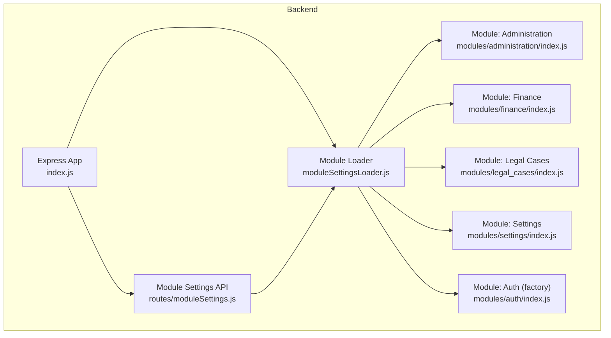
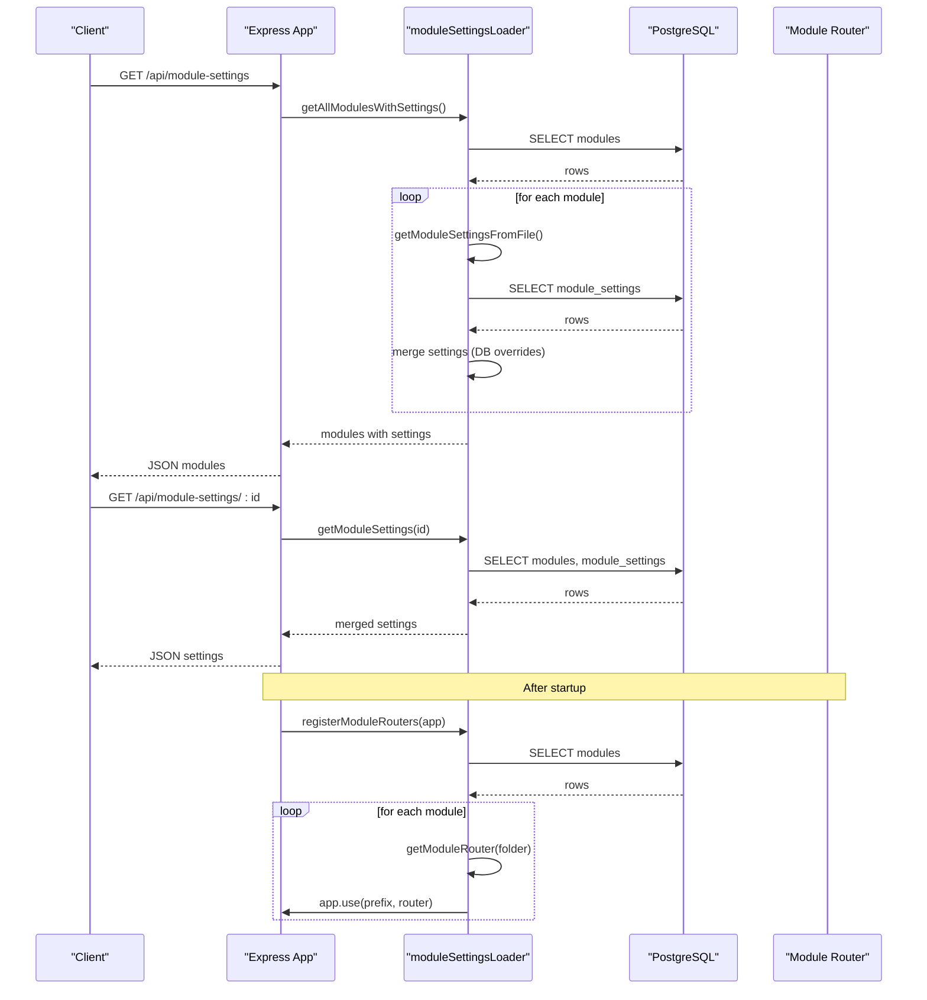
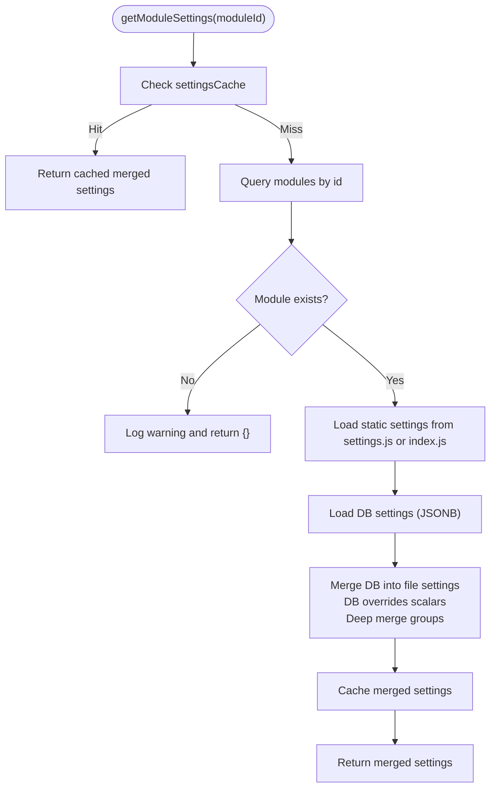
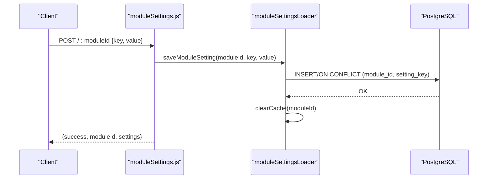
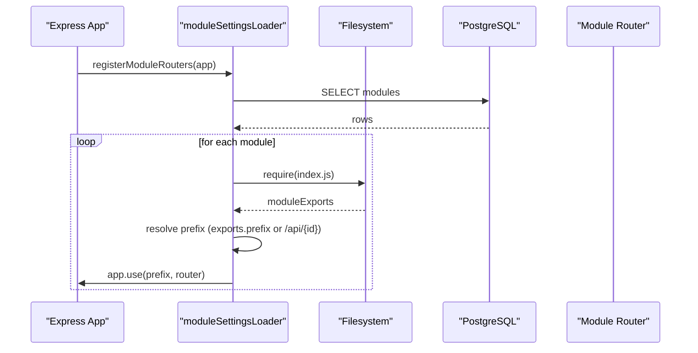
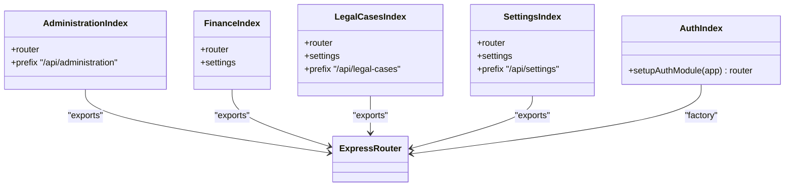
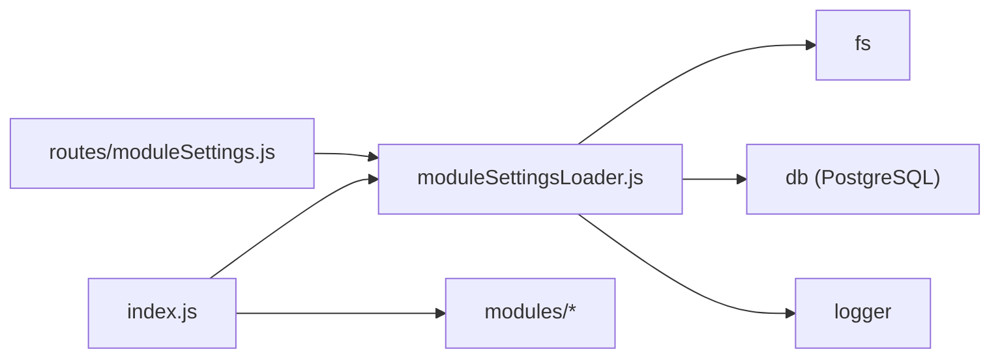

# Module Registration and Loading

<cite>
**Referenced Files in This Document**
- [moduleSettingsLoader.js](file://backend/utils/moduleSettingsLoader.js)
- [moduleSettings.js](file://backend/routes/moduleSettings.js)
- [index.js](file://backend/index.js)
- [administration/index.js](file://backend/modules/administration/index.js)
- [finance/index.js](file://backend/modules/finance/index.js)
- [legal_cases/index.js](file://backend/modules/legal_cases/index.js)
- [settings/index.js](file://backend/modules/settings/index.js)
- [auth/index.js](file://backend/modules/auth/index.js)
- [check_modules.js](file://backend/modules/references/services/referencesService.js)
- [TEMPLATE.js](file://backend/modules/TEMPLATE.js)
</cite>

## Table of Contents
1. [Introduction](#introduction)
2. [Project Structure](#project-structure)
3. [Core Components](#core-components)
4. [Architecture Overview](#architecture-overview)
5. [Detailed Component Analysis](#detailed-component-analysis)
6. [Dependency Analysis](#dependency-analysis)
7. [Performance Considerations](#performance-considerations)
8. [Troubleshooting Guide](#troubleshooting-guide)
9. [Conclusion](#conclusion)

## Introduction
This document explains the module registration and loading system used by the backend. It covers:
- Dynamic module discovery from the filesystem
- Automatic loading of module settings and routers
- Hybrid settings model: static file-based defaults and database-driven overrides
- Router registration with per-module prefixes
- Lifecycle from discovery to registration
- Error handling and fallback strategies

## Project Structure
The module system is organized around a central loader utility and a set of modules under backend/modules. Each module exposes a router and optional settings. A dedicated route handler manages module settings via an API.

**Diagram sources**
- [index.js:141-190](file://backend/index.js#L39)
- [moduleSettingsLoader.js:296-345](file://backend/utils/moduleSettingsLoader.js#L296-L345)
- [moduleSettings.js:1-261](file://backend/modules/settings/routes/moduleSettings.js#L1-L190)
- [administration/index.js:1-34](file://backend/modules/administration/index.js#L1-L33)
- [finance/index.js:1-55](file://backend/modules/finance/index.js#L1-L55)
- [legal_cases/index.js:1-14](file://backend/modules/legal_cases/index.js#L1-L13)
- [settings/index.js:1-22](file://backend/modules/settings/index.js#L1-L21)
- [auth/index.js:1-18](file://backend/modules/auth/index.js#L1-L17)

**Section sources**
- [index.js:141-190](file://backend/index.js#L39)
- [moduleSettingsLoader.js:296-345](file://backend/utils/moduleSettingsLoader.js#L296-L345)
- [moduleSettings.js:1-261](file://backend/modules/settings/routes/moduleSettings.js#L1-L190)

## Core Components
- Module settings loader: discovers modules, loads static settings from files, merges with database overrides, caches results, and exposes router discovery and registration.
- Module settings API: exposes endpoints to read/update/delete module settings and bulk-edit settings.
- Application bootstrap: initializes module settings and registers routers dynamically after mounting legacy routes.

Key responsibilities:
- Discovery: queries the modules table for active modules and their folder names.
- Static settings: loads settings.js or index.js exports from each module’s folder.
- Database settings: loads JSONB values from module_settings keyed by module_id and setting_key.
- Merge strategy: database overrides take precedence over static settings; nested objects are deep-merged.
- Router loading: loads module index.js and extracts router and optional prefix.
- Registration: mounts each module router under either module-defined prefix or a generated default (/api/{moduleId}).

**Section sources**
- [moduleSettingsLoader.js:89-137](file://backend/utils/moduleSettingsLoader.js#L89-L137)
- [moduleSettingsLoader.js:266-290](file://backend/utils/moduleSettingsLoader.js#L266-L290)
- [moduleSettingsLoader.js:329-345](file://backend/utils/moduleSettingsLoader.js#L329-L345)
- [moduleSettings.js:26-72](file://backend/modules/settings/routes/moduleSettings.js#L26-L72)
- [index.js:189-200](file://backend/index.js#L39)

## Architecture Overview
The system follows a layered pattern:
- Top-level Express app defines global middleware and legacy routes.
- Module loader orchestrates discovery, settings merging, and router registration.
- Each module encapsulates its own routes and optional settings.

**Diagram sources**
- [moduleSettings.js:26-72](file://backend/modules/settings/routes/moduleSettings.js#L26-L72)
- [moduleSettingsLoader.js:143-166](file://backend/utils/moduleSettingsLoader.js#L143-L166)
- [moduleSettingsLoader.js:89-137](file://backend/utils/moduleSettingsLoader.js#L89-L137)
- [moduleSettingsLoader.js:296-345](file://backend/utils/moduleSettingsLoader.js#L296-L345)

## Detailed Component Analysis

### Dynamic Module Discovery and Loading
- Discovery: Queries the modules table to enumerate active modules and their folder names.
- Static settings: Attempts to load settings from settings.js first; falls back to index.js export if present and containing a settings property.
- Database settings: Loads all key-value pairs for a module from module_settings and normalizes keys (supports both camelCase and snake_case).
- Merge: Creates a shallow copy of file settings and then applies DB overrides. For object-valued DB entries, performs a deep merge with file groups; scalar DB values override scalars.

**Diagram sources**
- [moduleSettingsLoader.js:89-137](file://backend/utils/moduleSettingsLoader.js#L89-L137)

**Section sources**
- [moduleSettingsLoader.js:89-137](file://backend/utils/moduleSettingsLoader.js#L89-L137)
- [moduleSettingsLoader.js:23-55](file://backend/utils/moduleSettingsLoader.js#L23-L55)
- [moduleSettingsLoader.js:62-81](file://backend/utils/moduleSettingsLoader.js#L62-L81)

### Module Settings API
- Endpoints:
  - GET /api/module-settings: list all modules with merged settings
  - GET /api/module-settings/:moduleId: get settings for a specific module
  - POST /api/module-settings/:moduleId: save a single setting (key/value)
  - PUT /api/module-settings/:moduleId: save multiple settings
  - DELETE /api/module-settings/:moduleId/:key: delete a setting
  - Bulk-edit endpoints: manage bulk-edit configurations per module
- Behavior:
  - Validation: ensures required fields are present
  - Persistence: stores values as JSONB in module_settings
  - Cache invalidation: clears module cache on save/delete
  - Synchronization: when enabling/disabling statistics globally, updates all modules’ features consistently

**Diagram sources**
- [moduleSettings.js:95-126](file://backend/modules/settings/routes/moduleSettings.js#L95-L126)
- [moduleSettingsLoader.js:175-206](file://backend/utils/moduleSettingsLoader.js#L175-L206)

**Section sources**
- [moduleSettings.js:26-196](file://backend/modules/settings/routes/moduleSettings.js#L1-L190)
- [moduleSettingsLoader.js:175-206](file://backend/utils/moduleSettingsLoader.js#L175-L206)

### Router Registration Mechanism and Module Prefix System
- Router discovery: Loads module index.js and supports multiple export forms (default export, named router, or .router property).
- Prefix resolution:
  - If module exports a prefix property, use it.
  - Otherwise, default to /api/{moduleId}.
- Registration: Iterates discovered modules and mounts router at computed prefix.

**Diagram sources**
- [moduleSettingsLoader.js:329-345](file://backend/utils/moduleSettingsLoader.js#L329-L345)
- [administration/index.js:32-33](file://backend/modules/administration/index.js#L32-L33)
- [legal_cases/index.js:12](file://backend/modules/legal_cases/index.js#L12)
- [settings/index.js:20](file://backend/modules/settings/index.js#L20)

**Section sources**
- [moduleSettingsLoader.js:266-290](file://backend/utils/moduleSettingsLoader.js#L266-L290)
- [moduleSettingsLoader.js:329-345](file://backend/utils/moduleSettingsLoader.js#L329-L345)
- [administration/index.js:24-33](file://backend/modules/administration/index.js#L24-L33)
- [legal_cases/index.js:9-13](file://backend/modules/legal_cases/index.js#L9-L13)
- [settings/index.js:13-21](file://backend/modules/settings/index.js#L13-L21)

### Examples of Module Initialization and Lifecycle
- Initialization:
  - On startup, the app calls initializeModules(), which preloads settings for all modules to warm caches.
- Legacy vs modular:
  - Some modules are mounted statically (e.g., Settings, Administration) to preserve compatibility.
  - Remaining modules are registered dynamically via registerModuleRouters(app).
- Example modules:
  - Administration: exports router and multiple sub-routers with a fixed prefix.
  - Finance: exports a single router and settings object; settings are merged into module settings.
  - Legal Cases: exports router and settings with a fixed prefix.
  - Settings: exports router and settings with a fixed prefix.
  - Auth: exported factory function returns a configured router for mounting.

**Diagram sources**
- [administration/index.js:24-33](file://backend/modules/administration/index.js#L24-L33)
- [finance/index.js:40-55](file://backend/modules/finance/index.js#L40-L55)
- [legal_cases/index.js:9-13](file://backend/modules/legal_cases/index.js#L9-L13)
- [settings/index.js:13-21](file://backend/modules/settings/index.js#L13-L21)
- [auth/index.js:8-17](file://backend/modules/auth/index.js#L8-L17)

**Section sources**
- [index.js:141-190](file://backend/index.js#L39)
- [administration/index.js:1-34](file://backend/modules/administration/index.js#L1-L33)
- [finance/index.js:1-55](file://backend/modules/finance/index.js#L1-L55)
- [legal_cases/index.js:1-14](file://backend/modules/legal_cases/index.js#L1-L13)
- [settings/index.js:1-22](file://backend/modules/settings/index.js#L1-L21)
- [auth/index.js:1-18](file://backend/modules/auth/index.js#L1-L17)

### Settings Caching Strategies
- Two-layer cache:
  - settingsCache: stores merged settings per module_id to avoid repeated disk and DB reads.
  - routersCache: stores loaded module routers to avoid repeated require() calls.
- Cache invalidation:
  - Clearing a specific module’s cache on save/delete.
  - Full clear by passing 'all'.
- Pre-warming:
  - initializeModules() fetches all modules with settings to populate caches early.

**Section sources**
- [moduleSettingsLoader.js:11-15](file://backend/utils/moduleSettingsLoader.js#L11-L15)
- [moduleSettingsLoader.js:235-243](file://backend/utils/moduleSettingsLoader.js#L235-L243)
- [moduleSettingsLoader.js:250-258](file://backend/utils/moduleSettingsLoader.js#L250-L258)

### Error Handling and Fallback Mechanisms
- Filesystem errors:
  - getModuleSettingsFromFile(): logs warnings and returns empty object if settings files are missing.
  - getModuleRouter(): logs debug when router file is missing and returns null.
- Database errors:
  - getModuleSettingsFromDatabase(): logs errors and returns empty object.
  - saveModuleSetting/deleteModuleSetting: wrap errors and return structured failure objects.
- Runtime errors:
  - registerModuleRouters(): logs errors and continues processing other modules.
- Fallback behavior:
  - If a module lacks settings.js or index.js, the loader proceeds without settings for that module.
  - If a module lacks a router file, the loader skips mounting that module’s router.

**Section sources**
- [moduleSettingsLoader.js:23-55](file://backend/utils/moduleSettingsLoader.js#L23-L55)
- [moduleSettingsLoader.js:266-290](file://backend/utils/moduleSettingsLoader.js#L266-L290)
- [moduleSettingsLoader.js:62-81](file://backend/utils/moduleSettingsLoader.js#L62-L81)
- [moduleSettingsLoader.js:175-206](file://backend/utils/moduleSettingsLoader.js#L175-L206)
- [moduleSettingsLoader.js:329-345](file://backend/utils/moduleSettingsLoader.js#L329-L345)

## Dependency Analysis
- moduleSettingsLoader.js depends on:
  - filesystem (fs) for reading settings.js and index.js
  - PostgreSQL client (db) for modules and module_settings tables
  - logger for diagnostics
- moduleSettings.js depends on:
  - moduleSettingsLoader for CRUD operations on module settings
  - bulkEditSettings for bulk-edit endpoints
- index.js depends on:
  - moduleSettingsLoader for dynamic router registration and initialization
  - several modules for legacy/static mounting

**Diagram sources**
- [moduleSettingsLoader.js:6-9](file://backend/utils/moduleSettingsLoader.js#L6-L9)
- [moduleSettings.js:9-20](file://backend/modules/settings/routes/moduleSettings.js#L9-L20)
- [index.js:141-190](file://backend/index.js#L39)

**Section sources**
- [moduleSettingsLoader.js:6-9](file://backend/utils/moduleSettingsLoader.js#L6-L9)
- [moduleSettings.js:9-20](file://backend/modules/settings/routes/moduleSettings.js#L9-L20)
- [index.js:141-190](file://backend/index.js#L39)

## Performance Considerations
- Caching:
  - settingsCache and routersCache reduce repeated IO and DB queries.
- Batch operations:
  - getAllModulesWithSettings() and getAllModulesWithRouters() iterate modules once; consider pagination if module count grows very large.
- JSONB storage:
  - Values stored as JSONB enable flexible nested settings; deep merge avoids unnecessary writes.
- Router loading:
  - Fresh require() via cache clearing ensures updates are reflected after saves.

[No sources needed since this section provides general guidance]

## Troubleshooting Guide
Common issues and resolutions:
- Module not appearing:
  - Verify entry exists in the modules table and folder name matches.
  - Confirm index.js exports a router and optional prefix.
- Settings not applied:
  - Check module_settings table for overrides; remember DB overrides take precedence.
  - Clear module cache using clearCache(moduleId) or clearCache('all').
- Router not mounted:
  - Ensure index.js exports router and is reachable from filesystem.
  - Confirm module folder name in modules table matches actual folder name.
- Startup warnings:
  - initializeModules() logs warnings on failures; investigate DB connectivity and table schemas.

**Section sources**
- [check_modules.js:1-15](file://backend/modules/references/services/referencesService.js#L73-L73)
- [moduleSettingsLoader.js:235-243](file://backend/utils/moduleSettingsLoader.js#L235-L243)
- [moduleSettingsLoader.js:329-345](file://backend/utils/moduleSettingsLoader.js#L329-L345)

## Conclusion
The module registration and loading system provides a robust, extensible foundation:
- Modules are discovered and loaded dynamically from the filesystem and database.
- A hybrid settings model allows both static defaults and runtime overrides.
- Routers are mounted with predictable per-module prefixes.
- Comprehensive caching and error handling ensure reliability and performance.
- The design supports gradual migration from legacy static routes to modular routers.