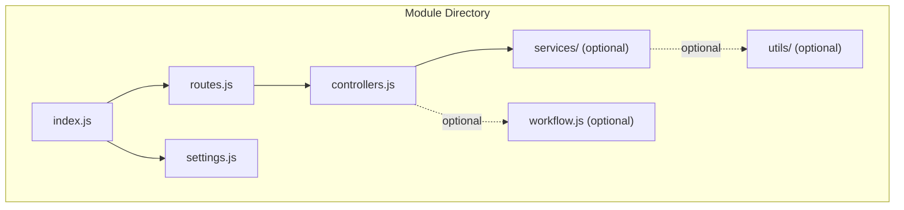
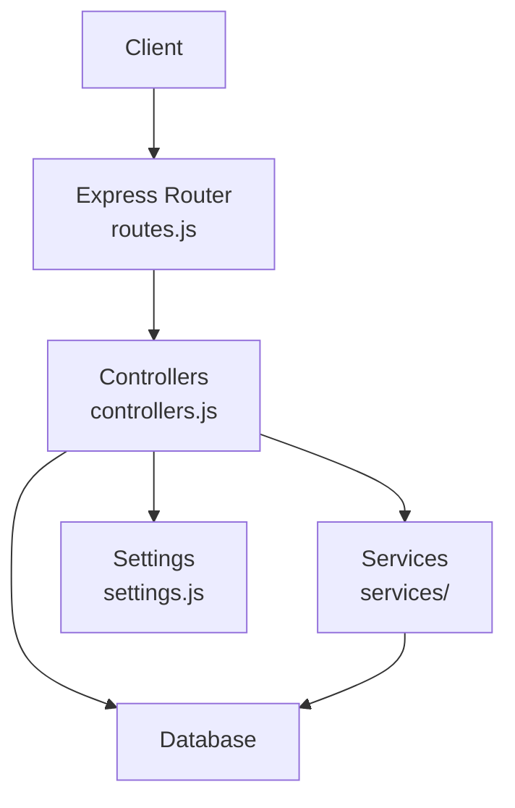
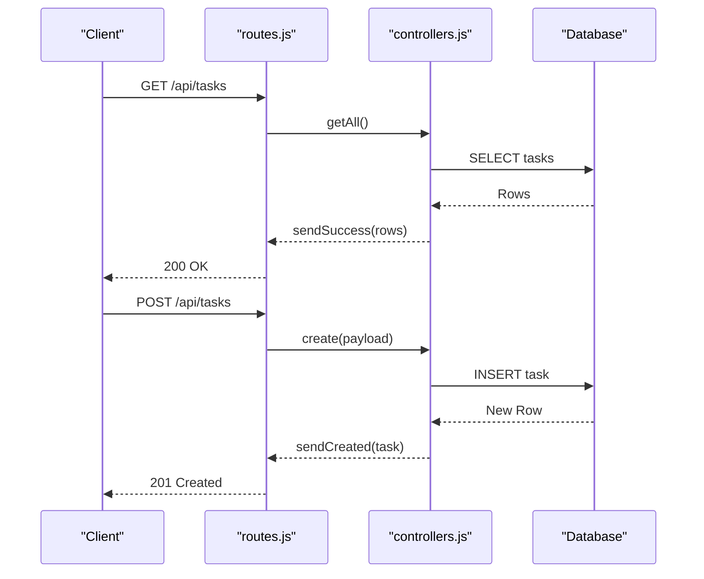
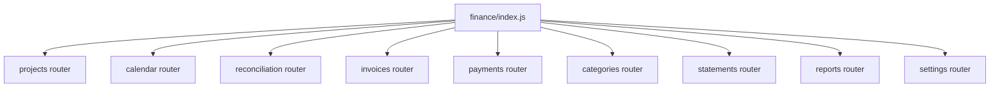
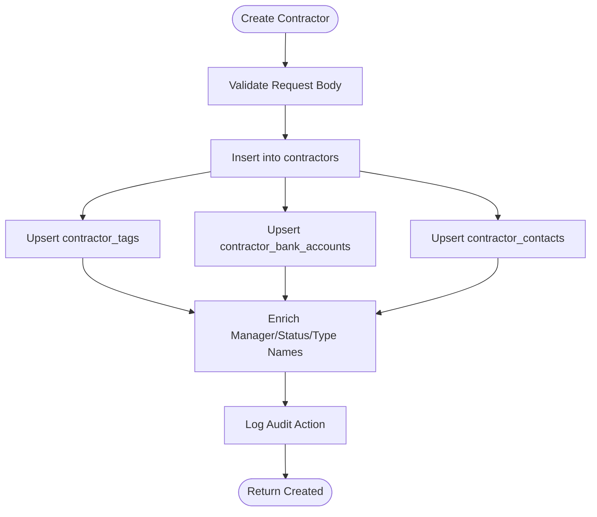
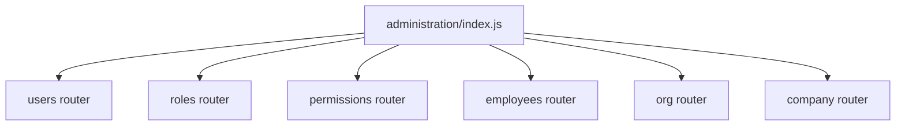
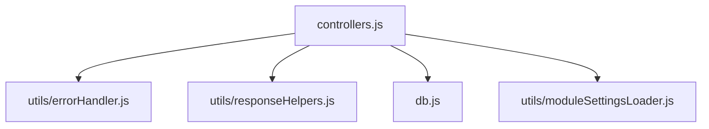

# Module Structure and Organization

<cite>
**Referenced Files in This Document**
- [STANDARD.md](file://backend/modules/STANDARD.md)
- [TEMPLATE.js](file://backend/modules/TEMPLATE.js)
- [administration/index.js](file://backend/modules/administration/index.js)
- [administration/settings.js](file://backend/modules/administration/settings.js)
- [administration/settings.json](file://backend/modules/administration/settings.json)
- [tasks/index.js](file://backend/modules/tasks/index.js)
- [tasks/controllers.js](file://backend/modules/tasks/controllers.js)
- [tasks/routes.js](file://backend/modules/tasks/routes.js)
- [tasks/settings.js](file://backend/modules/tasks/settings.js)
- [finance/index.js](file://backend/modules/finance/index.js)
- [finance/settings.js](file://backend/modules/finance/settings.js)
- [contractors/index.js](file://backend/modules/contractors/index.js)
- [contractors/controllers.js](file://backend/modules/contractors/controllers.js)
- [contractors/settings.js](file://backend/modules/contractors/settings.js)
</cite>

## Table of Contents
1. [Introduction](#introduction)
2. [Project Structure](#project-structure)
3. [Core Components](#core-components)
4. [Architecture Overview](#architecture-overview)
5. [Detailed Component Analysis](#detailed-component-analysis)
6. [Dependency Analysis](#dependency-analysis)
7. [Performance Considerations](#performance-considerations)
8. [Troubleshooting Guide](#troubleshooting-guide)
9. [Conclusion](#conclusion)

## Introduction
This document explains the standardized module structure and organization patterns used in the Titan CRM backend. It covers the conventional module directory layout, the module template system, and how new modules are created while adhering to established conventions. It also details the separation of concerns across controllers, services, routes, and settings, and provides examples of typical module layouts, naming conventions, and file organization patterns.

## Project Structure
The backend organizes each functional module under backend/modules/<module>/ with a consistent set of files and optional subdirectories. The standardization ensures predictable routing, configuration, and maintainability.

- Controllers: Handle HTTP request/response logic and orchestrate data retrieval and transformation.
- Services: Contain reusable business logic and domain-specific operations (optional).
- Routes: Define API endpoints and route registration.
- Settings: Provide module-level configuration, defaults, and feature flags.
- Workflow: Encapsulates workflow-related logic and triggers (optional).

**Diagram sources**
- [STANDARD.md:14-21](file://backend/modules/STANDARD.md#L14-L21)
- [STANDARD.md:29-45](file://backend/modules/STANDARD.md#L29-L45)

**Section sources**
- [STANDARD.md:8-46](file://backend/modules/STANDARD.md#L8-L46)

## Core Components
This section outlines the responsibilities and structure of each core component within a module.

- index.js: Acts as the module’s entry point, exporting the router, settings, and a URL prefix for mounting.
- routes.js: Declares HTTP endpoints and binds them to controller functions.
- controllers.js: Implements request handlers, performs data validation, interacts with the database, and returns structured responses.
- settings.js: Defines module display preferences, feature flags, defaults, and related configuration.
- services/: Optional directory for encapsulating business logic and reusable operations.
- utils/: Optional directory for module-specific utilities and helpers.
- workflow.js: Optional workflow orchestration file for workflow-enabled modules.

Examples of these components across modules:
- Tasks module demonstrates a simple CRUD module with a single controllers.js and a compact routes.js.
- Finance module demonstrates a complex module with a top-level router composing multiple sub-routers.
- Contractors module demonstrates a simple CRUD module with rich controller logic and settings.

**Section sources**
- [STANDARD.md:49-128](file://backend/modules/STANDARD.md#L49-L128)
- [STANDARD.md:336-499](file://backend/modules/STANDARD.md#L336-L499)
- [tasks/index.js:1-14](file://backend/modules/tasks/index.js#L1-L13)
- [tasks/routes.js:1-28](file://backend/modules/tasks/routes.js#L1-L28)
- [tasks/controllers.js:1-207](file://backend/modules/tasks/controllers.js#L1-L207)
- [tasks/settings.js:1-23](file://backend/modules/tasks/settings.js#L1-L22)
- [finance/index.js:1-55](file://backend/modules/finance/index.js#L1-L55)
- [finance/settings.js:1-55](file://backend/modules/finance/settings.js#L1-L54)
- [contractors/index.js:1-14](file://backend/modules/contractors/index.js#L1-L13)
- [contractors/controllers.js:1-563](file://backend/modules/contractors/controllers.js#L1-L563)
- [contractors/settings.js:1-28](file://backend/modules/contractors/settings.js#L1-L27)

## Architecture Overview
Modules follow a layered architecture:
- Routing layer: routes.js defines endpoints and delegates to controllers.
- Controller layer: controllers.js handles request parsing, validation, and response formatting.
- Business logic layer: services/ contains reusable business operations (when present).
- Configuration layer: settings.js centralizes module configuration and defaults.
- Optional workflow layer: workflow.js coordinates workflow triggers and steps.

**Diagram sources**
- [STANDARD.md:49-128](file://backend/modules/STANDARD.md#L49-L128)
- [tasks/routes.js:1-28](file://backend/modules/tasks/routes.js#L1-L28)
- [tasks/controllers.js:1-207](file://backend/modules/tasks/controllers.js#L1-L207)
- [finance/index.js:1-55](file://backend/modules/finance/index.js#L1-L55)

## Detailed Component Analysis

### Tasks Module
The Tasks module exemplifies a simple CRUD module:
- index.js exports router, settings, and a prefix.
- routes.js registers standard CRUD endpoints plus a statistics endpoint.
- controllers.js implements getAll, getById, create, update, remove, and getStats with internal relation loading and validation.
- settings.js defines display preferences, feature flags, and defaults.

**Diagram sources**
- [tasks/routes.js:1-28](file://backend/modules/tasks/routes.js#L1-L28)
- [tasks/controllers.js:26-108](file://backend/modules/tasks/controllers.js#L26-L108)

**Section sources**
- [tasks/index.js:1-14](file://backend/modules/tasks/index.js#L1-L13)
- [tasks/routes.js:1-28](file://backend/modules/tasks/routes.js#L1-L28)
- [tasks/controllers.js:1-207](file://backend/modules/tasks/controllers.js#L1-L207)
- [tasks/settings.js:1-23](file://backend/modules/tasks/settings.js#L1-L22)

### Finance Module
The Finance module is a complex module composed of multiple sub-routers:
- index.js composes sub-routers for projects, calendar payments, reconciliation act, invoices, payments, categories, statements, reports, and settings.
- A middleware ensures database schema initialization before each request.
- settings.js defines features and display preferences for the module.

**Diagram sources**
- [finance/index.js:1-55](file://backend/modules/finance/index.js#L1-L55)

**Section sources**
- [finance/index.js:1-55](file://backend/modules/finance/index.js#L1-L55)
- [finance/settings.js:1-55](file://backend/modules/finance/settings.js#L1-L54)

### Contractors Module
The Contractors module demonstrates a simple CRUD module with extensive controller logic:
- index.js exports router, settings, and a prefix.
- controllers.js implements getAll, getById, create, update, remove, bulkUpdate, and audit activity endpoints, with relation loading and enrichment utilities.
- settings.js defines display preferences, feature flags, enrichment provider settings, and defaults.

**Diagram sources**
- [contractors/controllers.js:199-307](file://backend/modules/contractors/controllers.js#L199-L307)

**Section sources**
- [contractors/index.js:1-14](file://backend/modules/contractors/index.js#L1-L13)
- [contractors/controllers.js:1-563](file://backend/modules/contractors/controllers.js#L1-L563)
- [contractors/settings.js:1-28](file://backend/modules/contractors/settings.js#L1-L27)

### Administration Module
The Administration module aggregates multiple sub-routes under a single router:
- index.js mounts sub-routers for users, roles, permissions, employees, organizational structure, and company settings.
- settings.js defines default roles, permissions, and visibility settings.
- settings.json provides module metadata such as id, name, icon, and prefix.

**Diagram sources**
- [administration/index.js:1-34](file://backend/modules/administration/index.js#L1-L33)

**Section sources**
- [administration/index.js:1-34](file://backend/modules/administration/index.js#L1-L33)
- [administration/settings.js:1-93](file://backend/modules/administration/settings.js#L1-L92)
- [administration/settings.json:1-7](file://backend/modules/administration/settings.json#L1-L6)

## Dependency Analysis
Modules depend on shared utilities and database access:
- Controllers import error handling helpers and response helpers.
- Controllers import database access and module settings loader.
- Complex modules compose sub-routers and may include middleware for schema initialization.

**Diagram sources**
- [tasks/controllers.js:6-10](file://backend/modules/tasks/controllers.js#L6-L10)
- [contractors/controllers.js:6-10](file://backend/modules/contractors/controllers.js#L6-L10)
- [finance/index.js:8-17](file://backend/modules/finance/index.js#L8-L17)

**Section sources**
- [tasks/controllers.js:6-10](file://backend/modules/tasks/controllers.js#L6-L10)
- [contractors/controllers.js:6-10](file://backend/modules/contractors/controllers.js#L6-L10)
- [finance/index.js:8-27](file://backend/modules/finance/index.js#L8-L27)

## Performance Considerations
- Prefer parameterized queries to avoid SQL injection and improve plan reuse.
- Use transactions for bulk operations to ensure atomicity.
- Minimize N+1 queries by batching related data retrieval and enriching in-memory.
- Keep controller functions focused and delegate heavy logic to services.
- Use pagination and filtering to limit payload sizes.

## Troubleshooting Guide
Common issues and resolutions:
- Missing or incorrect router export: Ensure index.js exports router, settings, and prefix consistently.
- Unhandled exceptions: Wrap async handlers with the provided async handler utility.
- Incorrect response formatting: Use the provided response helpers for consistent status codes and payloads.
- Schema initialization failures: For complex modules, ensure middleware initializes required schema before handling requests.
- Audit logging: Verify audit actions are logged after create/update/remove operations.

**Section sources**
- [STANDARD.md:564-586](file://backend/modules/STANDARD.md#L564-L586)
- [finance/index.js:19-27](file://backend/modules/finance/index.js#L19-L27)
- [contractors/controllers.js:295-304](file://backend/modules/contractors/controllers.js#L295-L304)

## Conclusion
The Titan CRM backend employs a standardized module structure that cleanly separates concerns across controllers, routes, services, and settings. The module template system and guidelines ensure consistency, maintainability, and scalability. By following the documented patterns—simple CRUD modules with a single controllers.js and compact routes.js, and complex modules with composed sub-routers—the team can rapidly develop and integrate new features while preserving architectural coherence.