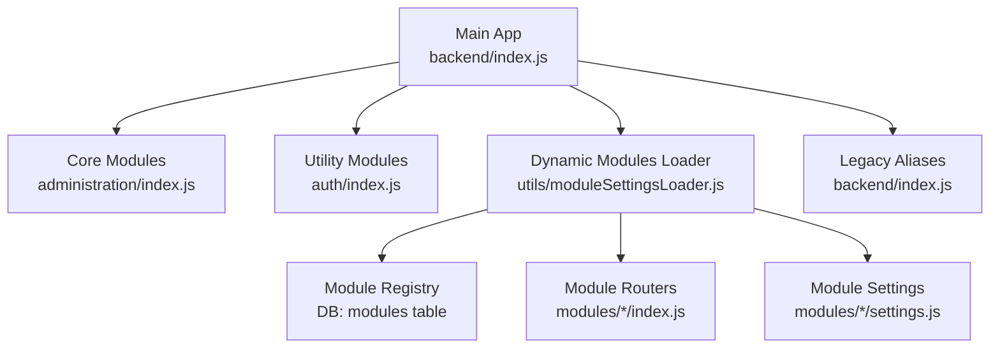
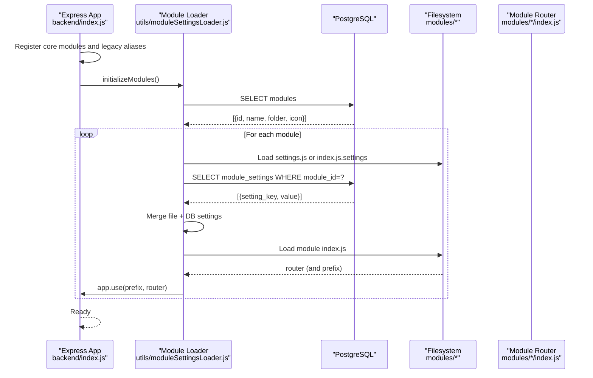
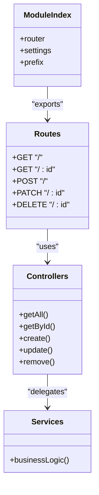
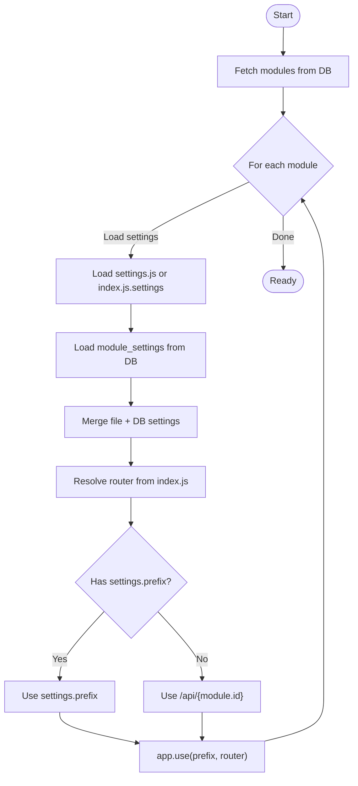
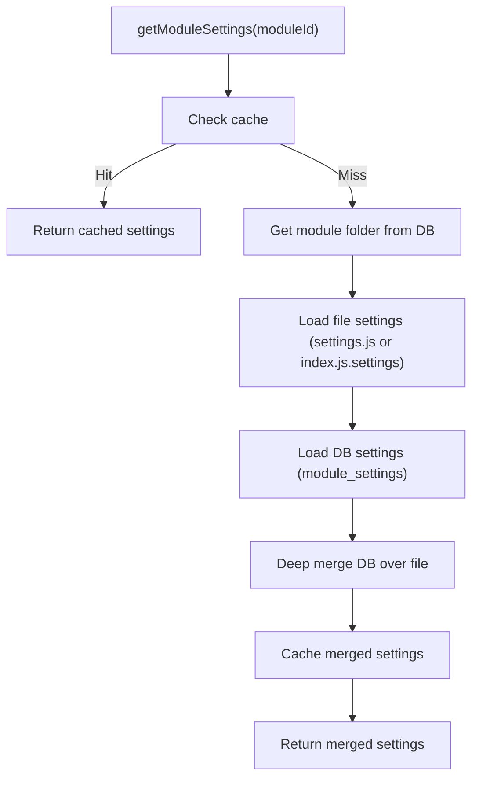
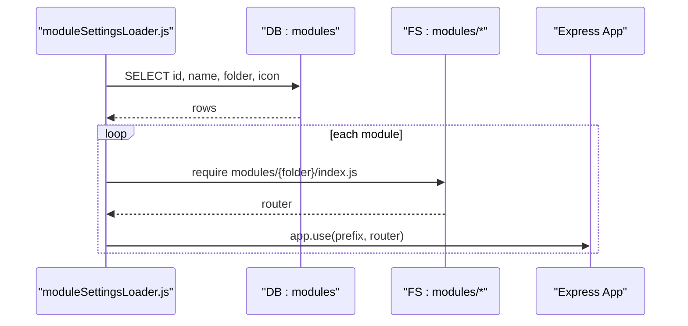
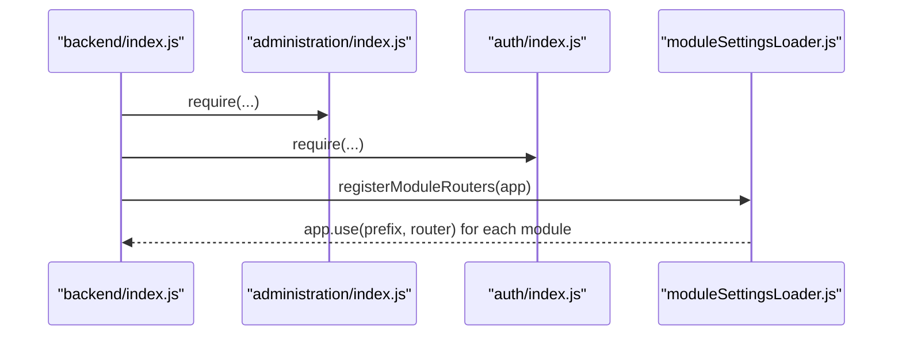
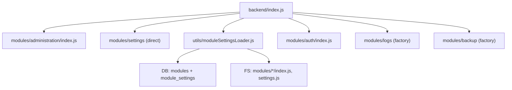

# Module System Architecture

<cite>
**Referenced Files in This Document**
- [index.js](file://backend/index.js)
- [moduleSettingsLoader.js](file://backend/utils/moduleSettingsLoader.js)
- [administration/index.js](file://backend/modules/administration/index.js)
- [administration/routes/users.js](file://backend/modules/administration/routes/users.js)
- [administration/controllers/users.js](file://backend/modules/administration/controllers/users.js)
- [administration/services/userService.js](file://backend/modules/administration/services/userService.js)
- [finance/index.js](file://backend/modules/finance/index.js)
- [legal_cases/index.js](file://backend/modules/legal_cases/index.js)
- [tasks/index.js](file://backend/modules/tasks/index.js)
- [auth/index.js](file://backend/modules/auth/index.js)
- [sync-modules.js](file://backend/scripts/sync-modules.js)
- [check_modules.js](file://backend/modules/references/services/referencesService.js)
- [TEMPLATE.js](file://backend/modules/TEMPLATE.js)
- [db-structure.json](file://backend/config/db-structure.json)
</cite>

## Table of Contents
1. [Introduction](#introduction)
2. [Project Structure](#project-structure)
3. [Core Components](#core-components)
4. [Architecture Overview](#architecture-overview)
5. [Detailed Component Analysis](#detailed-component-analysis)
6. [Dependency Analysis](#dependency-analysis)
7. [Performance Considerations](#performance-considerations)
8. [Troubleshooting Guide](#troubleshooting-guide)
9. [Conclusion](#conclusion)
10. [Appendices](#appendices)

## Introduction
This document explains the modular backend architecture used in the system. It covers the independent feature module design pattern, module registration and loading mechanisms, dynamic router registration, module structure (controllers, services, routes, settings), module settings loader functionality, legacy route redirections, automatic module discovery, module initialization, inter-module communication patterns, module prefix system, module lifecycle, dependency management, and configuration loading.

## Project Structure
The backend is organized around a modular design under the modules directory. Each module encapsulates its own routes, controllers, services, settings, and optional index.js that exports a router and settings. The main application entry point registers core modules, legacy aliases, utility modules, and dynamically registers all other modules via the module settings loader.

**Diagram sources**
- [index.js:141-190](file://backend/index.js#L39)
- [moduleSettingsLoader.js:296-345](file://backend/utils/moduleSettingsLoader.js#L296-L345)
- [administration/index.js:1-34](file://backend/modules/administration/index.js#L1-L33)
- [auth/index.js:1-18](file://backend/modules/auth/index.js#L1-L17)

**Section sources**
- [index.js:141-190](file://backend/index.js#L39)
- [moduleSettingsLoader.js:296-345](file://backend/utils/moduleSettingsLoader.js#L296-L345)

## Core Components
- Module definition and exports: Each module defines a router and optionally settings. Some modules export a function that receives the app instance to mount routes.
- Dynamic module loader: Loads module settings and routers from the filesystem and database, merges them, and registers routers with configurable prefixes.
- Legacy route redirections: Internal aliases map old endpoints to new module routers for backward compatibility.
- Automatic discovery: Scans the modules table and mounts routers for all active modules.

Key responsibilities:
- Module exports define the module’s public API surface (router, settings, prefix).
- Loader reads module metadata from the database and settings from disk, caches results, and registers routers.
- Main app wires core modules, legacy aliases, and delegates remaining modules to the loader.

**Section sources**
- [administration/index.js:1-34](file://backend/modules/administration/index.js#L1-L33)
- [finance/index.js:1-55](file://backend/modules/finance/index.js#L1-L55)
- [legal_cases/index.js:1-14](file://backend/modules/legal_cases/index.js#L1-L13)
- [tasks/index.js:1-14](file://backend/modules/tasks/index.js#L1-L13)
- [auth/index.js:1-18](file://backend/modules/auth/index.js#L1-L17)
- [moduleSettingsLoader.js:89-137](file://backend/utils/moduleSettingsLoader.js#L89-L137)
- [moduleSettingsLoader.js:266-290](file://backend/utils/moduleSettingsLoader.js#L266-L290)
- [moduleSettingsLoader.js:296-345](file://backend/utils/moduleSettingsLoader.js#L296-L345)
- [index.js:149-167](file://backend/index.js#L39)
- [index.js:169-177](file://backend/index.js#L39)

## Architecture Overview
The system initializes core modules and legacy aliases, then dynamically discovers and mounts all other modules. Module settings are loaded from disk and database, merged, and cached. Routers are resolved from module index files and mounted under computed prefixes.

**Diagram sources**
- [index.js:141-200](file://backend/index.js#L39)
- [moduleSettingsLoader.js:250-258](file://backend/utils/moduleSettingsLoader.js#L250-L258)
- [moduleSettingsLoader.js:143-166](file://backend/utils/moduleSettingsLoader.js#L143-L166)
- [moduleSettingsLoader.js:89-137](file://backend/utils/moduleSettingsLoader.js#L89-L137)
- [moduleSettingsLoader.js:296-345](file://backend/utils/moduleSettingsLoader.js#L296-L345)

## Detailed Component Analysis

### Module Structure and Lifecycle
Each module follows a consistent structure:
- routes: Define HTTP endpoints and attach controllers.
- controllers: Handle request logic and delegate to services.
- services: Encapsulate business logic and database operations.
- settings: Provide default configuration (roles, permissions, visibility).
- index.js: Exports router, settings, and optional prefix.

Lifecycle:
- Initialization: Main app requires core modules and legacy aliases, then calls loader.initializeModules().
- Discovery: Loader queries modules table and builds module info with settings and routers.
- Registration: Loader mounts routers under computed prefixes.
- Runtime: Requests routed to module-specific controllers and services.

**Diagram sources**
- [administration/index.js:1-34](file://backend/modules/administration/index.js#L1-L33)
- [administration/routes/users.js:1-45](file://backend/modules/administration/routes/users.js#L1-L45)
- [administration/controllers/users.js:1-132](file://backend/modules/administration/controllers/users.js#L1-L131)
- [administration/services/userService.js:1-554](file://backend/modules/administration/services/userService.js#L1-L553)

**Section sources**
- [administration/index.js:1-34](file://backend/modules/administration/index.js#L1-L33)
- [administration/routes/users.js:1-45](file://backend/modules/administration/routes/users.js#L1-L45)
- [administration/controllers/users.js:1-132](file://backend/modules/administration/controllers/users.js#L1-L131)
- [administration/services/userService.js:1-554](file://backend/modules/administration/services/userService.js#L1-L553)

### Module Registration and Loading Mechanisms
- Static registration: Core modules and legacy aliases are registered directly in the main app.
- Dynamic registration: Loader fetches modules from the database, loads settings from disk and DB, merges them, resolves router from index.js, and mounts with computed prefix.

Prefix resolution:
- If module settings include a prefix property, it is used.
- Otherwise, a default prefix is constructed from the module id.

Caching:
- Settings and routers are cached to avoid repeated filesystem and database reads.

**Section sources**
- [index.js:141-190](file://backend/index.js#L39)
- [moduleSettingsLoader.js:89-137](file://backend/utils/moduleSettingsLoader.js#L89-L137)
- [moduleSettingsLoader.js:266-290](file://backend/utils/moduleSettingsLoader.js#L266-L290)
- [moduleSettingsLoader.js:296-345](file://backend/utils/moduleSettingsLoader.js#L296-L345)
- [moduleSettingsLoader.js:235-243](file://backend/utils/moduleSettingsLoader.js#L235-L243)

### Dynamic Router Registration Process
The loader performs the following steps:
1. Retrieve all modules from the database.
2. For each module:
   - Load static settings from settings.js or index.js.settings.
   - Load dynamic settings from module_settings table.
   - Merge dynamic overrides into static settings.
   - Resolve router from module index.js (supports named export, default export, or direct export).
   - Mount router under computed prefix.
3. Optionally initialize module settings at startup.

**Diagram sources**
- [moduleSettingsLoader.js:143-166](file://backend/utils/moduleSettingsLoader.js#L143-L166)
- [moduleSettingsLoader.js:89-137](file://backend/utils/moduleSettingsLoader.js#L89-L137)
- [moduleSettingsLoader.js:266-290](file://backend/utils/moduleSettingsLoader.js#L266-L290)
- [moduleSettingsLoader.js:329-345](file://backend/utils/moduleSettingsLoader.js#L329-L345)

**Section sources**
- [moduleSettingsLoader.js:143-166](file://backend/utils/moduleSettingsLoader.js#L143-L166)
- [moduleSettingsLoader.js:89-137](file://backend/utils/moduleSettingsLoader.js#L89-L137)
- [moduleSettingsLoader.js:266-290](file://backend/utils/moduleSettingsLoader.js#L266-L290)
- [moduleSettingsLoader.js:329-345](file://backend/utils/moduleSettingsLoader.js#L329-L345)

### Module Settings Loader Functionality
- File-based settings: Reads settings.js or extracts settings from index.js.
- Database-based settings: Reads module_settings keyed by module id.
- Merging: DB settings override file settings; nested objects are deep merged.
- Persistence: Supports saving and deleting module settings; clears cache after changes.
- Initialization: Preloads settings for all modules at startup.

**Diagram sources**
- [moduleSettingsLoader.js:89-137](file://backend/utils/moduleSettingsLoader.js#L89-L137)

**Section sources**
- [moduleSettingsLoader.js:17-55](file://backend/utils/moduleSettingsLoader.js#L17-L55)
- [moduleSettingsLoader.js:62-81](file://backend/utils/moduleSettingsLoader.js#L62-L81)
- [moduleSettingsLoader.js:89-137](file://backend/utils/moduleSettingsLoader.js#L89-L137)
- [moduleSettingsLoader.js:175-206](file://backend/utils/moduleSettingsLoader.js#L175-L206)
- [moduleSettingsLoader.js:214-229](file://backend/utils/moduleSettingsLoader.js#L214-L229)
- [moduleSettingsLoader.js:235-243](file://backend/utils/moduleSettingsLoader.js#L235-L243)
- [moduleSettingsLoader.js:250-258](file://backend/utils/moduleSettingsLoader.js#L250-L258)

### Legacy Route Redirections
The main app maintains internal aliases to legacy endpoints, routing them to the appropriate module routers. These are not HTTP redirects but in-process route delegation to preserve frontend compatibility during refactors.

Examples:
- /api/users → administration.usersRouter
- /api/roles → administration.rolesRouter
- /api/permissions → administration.permissionsRouter
- /api/employees → administration.employeesRouter
- /api/org → administration.orgRouter
- /api/company → administration.companyRouter
- /api/profile → profile.router
- /api/auth/me → profile.router

**Section sources**
- [index.js:149-167](file://backend/index.js#L39)
- [index.js:158-161](file://backend/index.js#L39)

### Automatic Module Discovery System
Discovery is driven by the modules table in the database. The loader:
- Queries modules with id, name, folder, icon.
- Builds module info with settings and router.
- Registers routers with computed prefixes.

**Diagram sources**
- [moduleSettingsLoader.js:296-345](file://backend/utils/moduleSettingsLoader.js#L296-L345)
- [index.js:189-190](file://backend/index.js#L39)

**Section sources**
- [moduleSettingsLoader.js:296-345](file://backend/utils/moduleSettingsLoader.js#L296-L345)
- [index.js:189-190](file://backend/index.js#L39)

### Examples of Module Initialization
- Core modules: Registered directly in main app.
- Utility modules: Mounted via factory-style index.js that accepts the app instance.
- Dynamic modules: Mounted by the loader after startup.

**Diagram sources**
- [index.js:141-190](file://backend/index.js#L39)
- [auth/index.js:1-18](file://backend/modules/auth/index.js#L1-L17)
- [moduleSettingsLoader.js:329-345](file://backend/utils/moduleSettingsLoader.js#L329-L345)

**Section sources**
- [index.js:141-190](file://backend/index.js#L39)
- [auth/index.js:1-18](file://backend/modules/auth/index.js#L1-L17)
- [moduleSettingsLoader.js:329-345](file://backend/utils/moduleSettingsLoader.js#L329-L345)

### Inter-Module Communication Patterns
- Controllers call services for business logic.
- Services interact with the database and can coordinate with other services within the same module.
- Cross-module coordination is not enforced by the loader; modules remain independent. If cross-module calls are needed, they should be explicit and scoped to service boundaries.

**Section sources**
- [administration/controllers/users.js:1-132](file://backend/modules/administration/controllers/users.js#L1-L131)
- [administration/services/userService.js:1-554](file://backend/modules/administration/services/userService.js#L1-L553)

### Module Prefix System
- Modules can specify a prefix in their settings or export a prefix property.
- If absent, a default prefix is constructed from the module id.
- The loader computes the prefix and mounts the router accordingly.

**Section sources**
- [finance/index.js:43-54](file://backend/modules/finance/index.js#L43-L54)
- [legal_cases/index.js:12-13](file://backend/modules/legal_cases/index.js#L12-L13)
- [tasks/index.js:12-13](file://backend/modules/tasks/index.js#L12-L13)
- [moduleSettingsLoader.js:335-336](file://backend/utils/moduleSettingsLoader.js#L335-L336)

### Module Lifecycle
- Discovery: Loader queries modules and settings.
- Registration: Routers are mounted under computed prefixes.
- Runtime: Requests flow through routes to controllers and services.
- Shutdown: No special teardown is defined in the loader; graceful shutdown is application-wide.

**Section sources**
- [moduleSettingsLoader.js:296-345](file://backend/utils/moduleSettingsLoader.js#L296-L345)
- [index.js:189-190](file://backend/index.js#L39)

### Dependency Management and Configuration Loading
- Dependencies are managed per module via local requires in routes/controllers/services.
- Configuration is split between:
  - Static defaults in settings.js or index.js.settings.
  - Dynamic overrides in module_settings table.
- The loader ensures consistent precedence and caching.

**Section sources**
- [administration/settings.js:1-93](file://backend/modules/administration/settings.js#L1-L92)
- [moduleSettingsLoader.js:89-137](file://backend/utils/moduleSettingsLoader.js#L89-L137)
- [moduleSettingsLoader.js:175-206](file://backend/utils/moduleSettingsLoader.js#L175-L206)

## Dependency Analysis
The main app depends on:
- Core modules (administration, settings) for foundational routes.
- Loader for dynamic module discovery and registration.
- Utility modules (auth, logs, backup) via factory-style mounting.
- Legacy aliases for backward compatibility.

**Diagram sources**
- [index.js:141-190](file://backend/index.js#L39)
- [moduleSettingsLoader.js:296-345](file://backend/utils/moduleSettingsLoader.js#L296-L345)

**Section sources**
- [index.js:141-190](file://backend/index.js#L39)
- [moduleSettingsLoader.js:296-345](file://backend/utils/moduleSettingsLoader.js#L296-L345)

## Performance Considerations
- Caching: Settings and routers are cached to reduce filesystem and database overhead.
- Lazy loading: Routers are re-required fresh when resolving to avoid stale module exports.
- Pagination and filtering: Controllers implement pagination and filters to limit payload sizes.
- Middleware: Centralized logging and activity tracking are applied globally.

Recommendations:
- Keep settings minimal and cache-friendly.
- Avoid heavy synchronous operations in module routers.
- Monitor DB queries for module settings and consider batching if needed.

**Section sources**
- [moduleSettingsLoader.js:11-16](file://backend/utils/moduleSettingsLoader.js#L11-L16)
- [moduleSettingsLoader.js:235-243](file://backend/utils/moduleSettingsLoader.js#L235-L243)
- [administration/controllers/users.js:31-51](file://backend/modules/administration/controllers/users.js#L31-L51)

## Troubleshooting Guide
Common issues and resolutions:
- Missing environment variables: The app checks required variables and exits early if missing.
- Database connectivity: A pre-flight query verifies DB availability.
- Module not found: Loader warns when a module id is unknown or router file is missing.
- Settings errors: Loader logs errors and returns empty defaults; verify settings.js and module_settings entries.
- Legacy routes not working: Ensure legacy aliases are present in the main app and module routers are mounted by the loader.

Operational utilities:
- Module listing script prints module records from the database.
- Module sync script synchronizes module registry with backend via API.

**Section sources**
- [index.js:14-29](file://backend/index.js#L14-L29)
- [index.js:31-41](file://backend/index.js#L31-L39)
- [moduleSettingsLoader.js:102-105](file://backend/utils/moduleSettingsLoader.js#L102-L105)
- [moduleSettingsLoader.js:270-273](file://backend/utils/moduleSettingsLoader.js#L270-L273)
- [check_modules.js:1-15](file://backend/modules/references/services/referencesService.js#L73-L73)
- [sync-modules.js:53-110](file://backend/scripts/sync-modules.js#L53-L110)

## Conclusion
The modular backend architecture cleanly separates concerns into independent feature modules, supports dynamic discovery and registration, and provides a robust settings loader with caching and merging. Legacy route redirections maintain backward compatibility while the loader enables scalable growth. Following the documented module structure and lifecycle ensures predictable behavior and maintainability.

## Appendices

### Module Template Reference
Use the template to scaffold new modules consistently.

**Section sources**
- [TEMPLATE.js:1-117](file://backend/modules/TEMPLATE.js#L1-L116)

### Database Schema Notes
The database schema includes tables for modules and module settings, supporting the dynamic module system.

**Section sources**
- [db-structure.json:1-2399](file://backend/config/db-structure.json#L1-L2399)